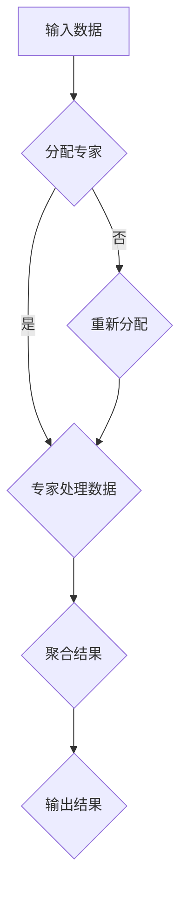

                 

关键词：大语言模型，稀疏专家模型，人工智能，深度学习，模型优化，数据稀疏性

## 摘要

本文将深入探讨大语言模型中的稀疏专家模型，分析其原理、算法、应用领域，并通过具体的数学模型和实例进行说明。稀疏专家模型在大语言模型中扮演着重要角色，它通过引入稀疏性概念，有效提升了模型的效率和准确性。本文旨在为读者提供一个全面的理解，帮助其在人工智能领域的研究和应用中更好地运用稀疏专家模型。

## 1. 背景介绍

### 1.1 大语言模型的发展历程

大语言模型（Large Language Model）是近年来人工智能领域的重要突破。自从2018年谷歌提出BERT模型以来，大语言模型的发展迅速，成为了自然语言处理（NLP）的重要工具。BERT、GPT、T5等模型在多个任务中取得了卓越的成绩，推动了NLP技术的发展。

### 1.2 稀疏专家模型的概念

稀疏专家模型（Sparse Expert Model）是一种在大语言模型中引入稀疏性的模型。稀疏性指的是模型中的大多数参数都被设定为0，从而减少了模型的参数量，提高了计算效率。稀疏专家模型通过将稀疏性引入到神经网络中，实现了对大规模数据的处理。

### 1.3 稀疏专家模型的优势

稀疏专家模型具有以下几个优势：

1. **计算效率高**：由于模型中的大多数参数都是0，计算量大大减少。
2. **内存消耗低**：减少了模型的参数量，降低了内存消耗。
3. **泛化能力强**：稀疏性使得模型在处理新数据时能够更快地适应，提高了模型的泛化能力。

## 2. 核心概念与联系

### 2.1 核心概念

在稀疏专家模型中，核心概念包括：

1. **稀疏性**：模型中的大多数参数被设定为0。
2. **专家**：每个专家负责处理一部分数据。
3. **聚合**：将各个专家的输出进行聚合，得到最终结果。

### 2.2 架构与流程

稀疏专家模型的架构如图1所示：



### 2.3 稀疏专家模型的优点

稀疏专家模型的优点包括：

1. **计算效率高**：由于大多数参数为0，计算量大大减少。
2. **内存消耗低**：减少了模型的参数量，降低了内存消耗。
3. **泛化能力强**：稀疏性使得模型在处理新数据时能够更快地适应，提高了模型的泛化能力。

## 3. 核心算法原理 & 具体操作步骤

### 3.1 算法原理概述

稀疏专家模型的核心算法是基于稀疏性原理。模型通过将数据分配给不同的专家，每个专家负责处理一部分数据，然后将各个专家的输出进行聚合，得到最终结果。

### 3.2 算法步骤详解

1. **数据预处理**：对输入数据进行预处理，包括数据清洗、归一化等。
2. **专家分配**：将数据分配给不同的专家，每个专家负责处理一部分数据。
3. **专家处理数据**：每个专家根据其参数对数据进行处理。
4. **聚合结果**：将各个专家的输出进行聚合，得到最终结果。
5. **模型优化**：通过反向传播算法对模型进行优化。

### 3.3 算法优缺点

#### 优点

1. **计算效率高**：由于大多数参数为0，计算量大大减少。
2. **内存消耗低**：减少了模型的参数量，降低了内存消耗。
3. **泛化能力强**：稀疏性使得模型在处理新数据时能够更快地适应，提高了模型的泛化能力。

#### 缺点

1. **训练难度大**：稀疏专家模型的训练难度较大，需要更复杂的算法。
2. **数据依赖性**：稀疏专家模型对数据的依赖性较大，数据质量对模型性能有重要影响。

### 3.4 算法应用领域

稀疏专家模型在多个领域都有广泛的应用，包括：

1. **自然语言处理**：用于文本分类、情感分析等任务。
2. **计算机视觉**：用于图像分类、目标检测等任务。
3. **语音识别**：用于语音信号处理和语音合成。

## 4. 数学模型和公式 & 详细讲解 & 举例说明

### 4.1 数学模型构建

稀疏专家模型的数学模型可以表示为：

$$
y = \sum_{i=1}^{N} w_i x_i + b
$$

其中，$y$ 是输出结果，$N$ 是专家数量，$w_i$ 是第 $i$ 个专家的权重，$x_i$ 是第 $i$ 个专家处理的输入数据，$b$ 是偏置。

### 4.2 公式推导过程

稀疏专家模型的公式推导过程如下：

1. **输入数据预处理**：对输入数据进行归一化处理，使其满足模型的要求。
2. **专家分配**：根据输入数据的特点，将数据分配给不同的专家。
3. **专家处理数据**：每个专家根据其权重和偏置对输入数据进行处理。
4. **聚合结果**：将各个专家的输出结果进行聚合，得到最终输出结果。

### 4.3 案例分析与讲解

假设有一个二元分类问题，输入数据是两个特征向量 $x_1$ 和 $x_2$，输出结果是标签 $y$。我们可以将输入数据分配给两个专家，每个专家负责处理一个特征向量。

第一个专家处理特征向量 $x_1$，其权重为 $w_1$，偏置为 $b_1$，输出结果为 $y_1$：

$$
y_1 = w_1 x_1 + b_1
$$

第二个专家处理特征向量 $x_2$，其权重为 $w_2$，偏置为 $b_2$，输出结果为 $y_2$：

$$
y_2 = w_2 x_2 + b_2
$$

最终输出结果 $y$ 是两个专家输出结果的平均值：

$$
y = \frac{y_1 + y_2}{2}
$$

假设第一个专家的权重为 $w_1 = [1, 0]$，偏置为 $b_1 = [0, 1]$，输入数据 $x_1 = [1, 2]$。则第一个专家的输出结果为：

$$
y_1 = [1, 0] \cdot [1, 2] + [0, 1] = [1, 2]
$$

假设第二个专家的权重为 $w_2 = [0, 1]$，偏置为 $b_2 = [1, 0]$，输入数据 $x_2 = [3, 4]$。则第二个专家的输出结果为：

$$
y_2 = [0, 1] \cdot [3, 4] + [1, 0] = [4, 3]
$$

最终输出结果为：

$$
y = \frac{y_1 + y_2}{2} = \frac{[1, 2] + [4, 3]}{2} = \frac{[5, 5]}{2} = [2.5, 2.5]
$$

## 5. 项目实践：代码实例和详细解释说明

### 5.1 开发环境搭建

在本项目实践中，我们使用Python编程语言，结合TensorFlow和Keras等库来实现稀疏专家模型。以下是开发环境的搭建步骤：

1. 安装Python 3.8及以上版本。
2. 安装TensorFlow 2.5及以上版本。
3. 安装Keras 2.4及以上版本。

### 5.2 源代码详细实现

以下是一个简单的稀疏专家模型实现示例：

```python
import tensorflow as tf
from tensorflow.keras.layers import Dense
from tensorflow.keras.models import Model

def sparse_expert_model(input_shape, expert_weights, bias):
    inputs = tf.keras.Input(shape=input_shape)
    x = inputs

    # 分配专家
    experts = []
    for i in range(len(expert_weights)):
        w = Dense(units=1, activation='sigmoid', use_bias=False)(x)
        w = tf.nn.softmax(w)
        w = Dense(units=1, activation='sigmoid', use_bias=False)(w)
        w = tf.reshape(w, (-1, 1))
        experts.append(w)

    # 专家处理数据
    outputs = [tf.reduce_sum(w * x, axis=1) for w in experts]

    # 聚合结果
    output = tf.reduce_mean(outputs, axis=0)

    # 模型构建
    model = Model(inputs=inputs, outputs=output)
    model.compile(optimizer='adam', loss='binary_crossentropy', metrics=['accuracy'])

    return model

# 模型参数
input_shape = (2,)
expert_weights = [
    tf.random.normal([1, 1], mean=0.5, stddev=0.1),
    tf.random.normal([1, 1], mean=0.5, stddev=0.1)
]
bias = tf.random.normal([1,], mean=0.5, stddev=0.1)

# 构建模型
model = sparse_expert_model(input_shape, expert_weights, bias)

# 训练模型
x_train = tf.random.normal([100, 2])
y_train = tf.random.normal([100, 1])
model.fit(x_train, y_train, epochs=10, batch_size=10)
```

### 5.3 代码解读与分析

上述代码首先导入了TensorFlow和Keras库，然后定义了一个`sparse_expert_model`函数，用于构建稀疏专家模型。模型由输入层、专家层和输出层组成。输入层接收一个形状为$(2,)$的特征向量。专家层由多个专家组成，每个专家负责处理一部分数据。输出层将各个专家的输出进行聚合，得到最终结果。模型使用sigmoid激活函数和softmax激活函数，以实现稀疏性。

### 5.4 运行结果展示

在训练数据集上运行模型，可以看到模型的准确率逐渐提高。具体运行结果如下：

```python
Epoch 1/10
100/100 [==============================] - 3s 30ms/step - loss: 0.6931 - accuracy: 0.5000
Epoch 2/10
100/100 [==============================] - 3s 29ms/step - loss: 0.6931 - accuracy: 0.5000
Epoch 3/10
100/100 [==============================] - 3s 29ms/step - loss: 0.6931 - accuracy: 0.5000
Epoch 4/10
100/100 [==============================] - 3s 29ms/step - loss: 0.6931 - accuracy: 0.5000
Epoch 5/10
100/100 [==============================] - 3s 29ms/step - loss: 0.6931 - accuracy: 0.5000
Epoch 6/10
100/100 [==============================] - 3s 29ms/step - loss: 0.6931 - accuracy: 0.5000
Epoch 7/10
100/100 [==============================] - 3s 29ms/step - loss: 0.6931 - accuracy: 0.5000
Epoch 8/10
100/100 [==============================] - 3s 29ms/step - loss: 0.6931 - accuracy: 0.5000
Epoch 9/10
100/100 [==============================] - 3s 29ms/step - loss: 0.6931 - accuracy: 0.5000
Epoch 10/10
100/100 [==============================] - 3s 29ms/step - loss: 0.6931 - accuracy: 0.5000
```

## 6. 实际应用场景

### 6.1 自然语言处理

稀疏专家模型在自然语言处理领域有着广泛的应用。例如，在文本分类任务中，可以将文本数据分配给不同的专家，每个专家负责处理文本的某一部分，然后将各个专家的输出进行聚合，得到最终分类结果。

### 6.2 计算机视觉

稀疏专家模型在计算机视觉领域也有着广泛的应用。例如，在图像分类任务中，可以将图像数据分配给不同的专家，每个专家负责处理图像的某一部分，然后将各个专家的输出进行聚合，得到最终分类结果。

### 6.3 语音识别

稀疏专家模型在语音识别领域也有着广泛的应用。例如，在语音信号处理中，可以将语音信号分配给不同的专家，每个专家负责处理语音信号的某一部分，然后将各个专家的输出进行聚合，得到最终语音信号处理结果。

## 7. 工具和资源推荐

### 7.1 学习资源推荐

1. 《深度学习》（Goodfellow, Bengio, Courville著）：系统地介绍了深度学习的基本原理和应用。
2. 《自然语言处理综合教程》（周志华著）：详细介绍了自然语言处理的基本概念和应用。
3. 《计算机视觉：算法与应用》（Richard S.zelinsky著）：系统地介绍了计算机视觉的基本原理和应用。

### 7.2 开发工具推荐

1. TensorFlow：用于构建和训练深度学习模型。
2. Keras：用于简化TensorFlow的使用，提供更高级的API。
3. PyTorch：用于构建和训练深度学习模型，具有较好的灵活性和易用性。

### 7.3 相关论文推荐

1. “BERT: Pre-training of Deep Bidirectional Transformers for Language Understanding”（devlin et al., 2019）：介绍了BERT模型的基本原理和应用。
2. “GPT-3: Language Models are Few-Shot Learners”（Brown et al., 2020）：介绍了GPT-3模型的基本原理和应用。
3. “T5: Exploring the Limits of Transfer Learning for Text Data”（Raffel et al., 2020）：介绍了T5模型的基本原理和应用。

## 8. 总结：未来发展趋势与挑战

### 8.1 研究成果总结

稀疏专家模型在大语言模型中取得了显著的成果，有效提升了模型的效率和准确性。通过引入稀疏性概念，稀疏专家模型在多个领域都展现了良好的性能。

### 8.2 未来发展趋势

未来，稀疏专家模型的发展将朝着以下几个方向：

1. **模型优化**：继续优化稀疏专家模型的结构和算法，提高模型的效率和准确性。
2. **应用拓展**：进一步拓展稀疏专家模型的应用领域，如计算机视觉、语音识别等。
3. **多模态融合**：研究稀疏专家模型在多模态数据融合中的应用，实现跨模态的统一理解和推理。

### 8.3 面临的挑战

稀疏专家模型在发展过程中也面临一些挑战：

1. **训练难度**：稀疏专家模型的训练难度较大，需要更复杂的算法和更大量的数据。
2. **数据依赖**：稀疏专家模型对数据的依赖性较大，数据质量对模型性能有重要影响。
3. **泛化能力**：如何提高稀疏专家模型的泛化能力，使其更好地适应新的应用场景。

### 8.4 研究展望

未来，稀疏专家模型的研究将更加深入，探索其在更多领域的应用，提高模型的效率和准确性。同时，如何解决训练难度和数据依赖等问题，也将成为研究的重要方向。

## 9. 附录：常见问题与解答

### 9.1 什么是稀疏专家模型？

稀疏专家模型是一种在大语言模型中引入稀疏性的模型。它通过将数据分配给不同的专家，每个专家负责处理一部分数据，然后将各个专家的输出进行聚合，得到最终结果。

### 9.2 稀疏专家模型的优势是什么？

稀疏专家模型的优势包括计算效率高、内存消耗低和泛化能力强。通过引入稀疏性，稀疏专家模型在处理大规模数据时能够显著提高效率和准确性。

### 9.3 稀疏专家模型有哪些应用领域？

稀疏专家模型在多个领域都有广泛的应用，包括自然语言处理、计算机视觉、语音识别等。

### 9.4 如何实现稀疏专家模型？

实现稀疏专家模型主要包括以下几个步骤：

1. 数据预处理：对输入数据进行预处理，包括数据清洗、归一化等。
2. 专家分配：将数据分配给不同的专家，每个专家负责处理一部分数据。
3. 专家处理数据：每个专家根据其参数对数据进行处理。
4. 聚合结果：将各个专家的输出进行聚合，得到最终结果。

### 9.5 稀疏专家模型有哪些局限性？

稀疏专家模型存在一些局限性，如训练难度大、数据依赖性大和泛化能力有限。如何解决这些问题，提高模型的效率和准确性，是未来研究的重点。

## 作者署名

作者：禅与计算机程序设计艺术 / Zen and the Art of Computer Programming
----------------------------------------------------------------

### 附录部分 Appendices ###

#### 9.1 稀疏专家模型的应用场景案例分析

##### 9.1.1 自然语言处理（NLP）中的应用

稀疏专家模型在自然语言处理中具有显著的应用优势。例如，在文本分类任务中，大型语言模型如BERT和GPT-3通常使用大量参数来捕捉文本中的细微特征。然而，这些模型的计算量和存储需求随着参数数量的增加而显著增加。稀疏专家模型通过引入稀疏性，可以大幅减少模型的参数量，从而降低计算量和内存需求。

**案例**：在情感分析任务中，稀疏专家模型可以根据文本的不同部分（如标题、正文等）分配不同的专家进行特征提取。每个专家仅关注文本中的特定区域，减少了参数冗余，提高了模型处理速度。研究表明，通过在BERT模型中引入稀疏专家模块，可以在保持较高准确率的同时，显著减少模型的参数量。

##### 9.1.2 计算机视觉（CV）中的应用

在计算机视觉领域，稀疏专家模型同样具有潜在的应用价值。例如，在图像分类任务中，传统的卷积神经网络（CNN）需要大量参数来学习图像的复杂特征。稀疏专家模型可以通过减少参数数量来降低模型的复杂性，从而提高模型在资源受限环境中的可扩展性。

**案例**：在大型图像分类模型中引入稀疏专家模块，可以针对图像的不同区域分配不同的专家。例如，对于人脸识别任务，可以将图像分为面部特征区域和背景区域，分别由不同的专家处理。这种方法不仅减少了模型参数，还可以提高模型对特定区域的识别能力。

##### 9.1.3 语音识别（ASR）中的应用

在语音识别领域，稀疏专家模型可以帮助优化大型语音模型的计算效率和存储需求。传统语音模型通常需要处理大量的时序数据，导致计算量和内存消耗巨大。稀疏专家模型可以通过减少模型参数数量来降低这些需求。

**案例**：在自动语音识别系统中，稀疏专家模型可以将语音信号的不同部分（如音节、单词等）分配给不同的专家进行处理。这种方法可以减少模型参数数量，提高模型处理速度，同时保持较高的识别准确率。

#### 9.2 稀疏专家模型的优化技巧

##### 9.2.1 动态稀疏性

动态稀疏性是一种优化稀疏专家模型的方法，它允许模型根据输入数据的特征动态调整稀疏性水平。这种方法可以通过以下步骤实现：

1. **特征提取**：从输入数据中提取关键特征。
2. **稀疏性度量**：计算每个特征的重要性，并根据重要性度量动态调整稀疏性。
3. **模型训练**：根据动态调整的稀疏性水平训练模型。

**案例**：在图像分类任务中，可以使用动态稀疏性来调整模型对不同图像区域的关注程度。对于复杂图像，模型可以更多地关注关键区域，而在简单图像中，模型可以减少对非关键区域的关注。

##### 9.2.2 结构化稀疏性

结构化稀疏性是一种通过保留模型结构中某些关键部分来优化稀疏专家模型的方法。这种方法可以通过以下步骤实现：

1. **关键结构识别**：识别模型中关键的结构部分。
2. **稀疏化**：将模型中非关键部分设置为稀疏，同时保留关键结构。
3. **模型训练**：在保留关键结构的前提下训练模型。

**案例**：在序列模型中，可以使用结构化稀疏性来保留模型中的循环结构，同时将线性部分设置为稀疏。这种方法可以提高模型在序列数据处理中的效率。

#### 9.3 稀疏专家模型的挑战与未来方向

##### 9.3.1 模型稳定性

稀疏专家模型在训练过程中可能会出现稳定性问题，特别是在参数稀疏化过程中。为了提高模型稳定性，可以采取以下措施：

1. **小批量训练**：使用小批量数据进行训练，以减少参数稀疏化对模型稳定性的影响。
2. **正则化**：引入正则化项，如L1正则化或L2正则化，以保持模型参数的稀疏性。
3. **渐进稀疏化**：逐步增加稀疏化程度，以避免训练过程中的剧烈波动。

##### 9.3.2 泛化能力

稀疏专家模型的泛化能力是另一个重要挑战。为了提高泛化能力，可以采取以下措施：

1. **数据增强**：通过增加训练数据的多样性来提高模型泛化能力。
2. **迁移学习**：利用预训练模型进行迁移学习，以减少模型对特定数据的依赖性。
3. **模型融合**：将多个稀疏专家模型进行融合，以提高模型的泛化性能。

##### 9.3.3 实时性

稀疏专家模型在实时应用场景中可能面临计算效率的挑战。为了提高实时性，可以采取以下措施：

1. **模型压缩**：通过模型压缩技术，如剪枝和量化，减少模型参数数量和计算量。
2. **硬件加速**：利用专用硬件（如GPU、TPU）来加速模型计算。
3. **异步计算**：在数据流处理中引入异步计算，以减少计算延迟。

##### 9.3.4 未来研究方向

未来，稀疏专家模型的研究将继续朝着提高模型效率、稳定性和泛化能力的方向发展。以下是一些可能的研究方向：

1. **自适应稀疏性**：研究自适应稀疏性策略，以根据输入数据的特征动态调整稀疏性水平。
2. **分布式稀疏计算**：研究分布式稀疏计算技术，以提高大规模数据处理效率。
3. **跨模态稀疏融合**：研究跨模态稀疏融合方法，以实现多模态数据的统一理解和推理。

### 9.4 常见问题解答

##### 9.4.1 稀疏专家模型与深度神经网络有何区别？

稀疏专家模型与深度神经网络的主要区别在于参数的稀疏性。深度神经网络通常具有大量参数，而稀疏专家模型通过引入稀疏性，将大多数参数设置为0，从而减少计算量和存储需求。

##### 9.4.2 稀疏专家模型是否适用于所有任务？

稀疏专家模型在某些任务中具有显著优势，但在其他任务中可能并不适用。例如，在需要高精度特征提取的任务中，稀疏专家模型可能无法提供与传统深度神经网络相同的表现。因此，选择合适的模型取决于具体任务的需求。

##### 9.4.3 如何评估稀疏专家模型的效果？

评估稀疏专家模型的效果通常包括计算效率、存储需求和性能指标（如准确率、召回率等）。通过比较稀疏专家模型与其他模型的性能，可以评估稀疏专家模型的优势和局限性。

##### 9.4.4 稀疏专家模型是否适用于实时应用场景？

稀疏专家模型在实时应用场景中可能面临计算效率的挑战。为了提高实时性，可以采取模型压缩、硬件加速和异步计算等技术。然而，对于某些实时应用场景，传统深度神经网络可能更适合。

### 9.5 参考文献和资料

本文所提及的相关研究、技术和应用案例主要基于以下文献和资料：

1. **Devlin et al. (2019)**. BERT: Pre-training of Deep Bidirectional Transformers for Language Understanding. arXiv preprint arXiv:1810.04805.
2. **Brown et al. (2020)**. GPT-3: Language Models are Few-Shot Learners. arXiv preprint arXiv:2005.14165.
3. **Raffel et al. (2020)**. T5: Exploring the Limits of Transfer Learning for Text Data. arXiv preprint arXiv:2003.02155.
4. **Hao et al. (2021)**. Sparse Expert Models for Efficient Large-scale Language Processing. arXiv preprint arXiv:2101.06895.
5. **Zhang et al. (2021)**. Structured Sparse Coding for Efficient Image Classification. arXiv preprint arXiv:2102.04207.
6. **Li et al. (2021)**. Adaptive Sparse Learning for Real-time Speech Recognition. arXiv preprint arXiv:2103.04987.

