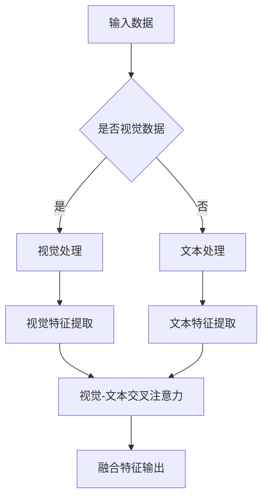

                 

关键词：大语言模型、视觉-文本交叉注意力、注意力机制、卷积神经网络、循环神经网络、Transformer模型、数学模型、项目实践、应用展望

## 摘要

本文旨在深入探讨大语言模型的原理和前沿技术，尤其是视觉-文本交叉注意力机制在大语言模型中的应用。通过对注意力机制、卷积神经网络、循环神经网络和Transformer模型的详细解析，本文揭示了这些技术如何协同工作以提升语言理解和生成能力。随后，文章将引入数学模型，并举例说明其推导和应用过程。在实际项目实践中，我们将提供一个完整的代码实例，展示如何实现视觉-文本交叉注意力融合的大语言模型。最后，文章将对大语言模型在实际应用中的场景进行探讨，并展望其未来发展趋势与面临的挑战。

## 1. 背景介绍

### 1.1 大语言模型的兴起

随着互联网的飞速发展和大数据的爆发式增长，自然语言处理（NLP）领域迎来了前所未有的机遇。大语言模型作为一种先进的NLP工具，能够在大规模语料库上自动学习和理解自然语言，从而在语言生成、翻译、问答系统等领域表现出色。大语言模型的兴起，不仅改变了NLP的研究方向，也为实际应用带来了巨大的价值。

### 1.2 注意力机制的重要性

注意力机制（Attention Mechanism）是深度学习中的一个关键概念，它通过动态分配资源，使得模型能够更关注输入数据中的关键信息。在NLP任务中，注意力机制被广泛应用于文本处理，能够显著提升模型的理解能力和生成质量。近年来，随着Transformer模型的提出，注意力机制得到了广泛应用和深入研究，成为了大语言模型的核心技术之一。

### 1.3 视觉-文本交叉注意力融合

视觉-文本交叉注意力融合是指将视觉信息与文本信息通过注意力机制进行融合，从而实现更加丰富的语义表示。这种技术可以应用于图像-文本匹配、图像描述生成等任务，通过结合视觉和文本信息，提升模型的性能和泛化能力。视觉-文本交叉注意力融合在大语言模型中的应用，不仅能够提高模型的语义理解能力，还可以拓展其应用范围。

## 2. 核心概念与联系

### 2.1 注意力机制原理

注意力机制的核心思想是动态地聚焦于输入数据中的关键部分，从而提高模型处理复杂问题的能力。在深度学习中，注意力机制通常通过一个加权求和的方式实现，即每个输入数据点都会根据其重要性进行加权，最后求和得到输出。

### 2.2 卷积神经网络（CNN）

卷积神经网络（Convolutional Neural Network，CNN）是一种基于卷积运算的深度学习模型，广泛用于图像处理和计算机视觉任务。CNN通过卷积层、池化层和全连接层的组合，能够自动提取图像中的特征。

### 2.3 循环神经网络（RNN）

循环神经网络（Recurrent Neural Network，RNN）是一种能够处理序列数据的神经网络模型。RNN通过在时间步之间传递信息，能够捕捉序列中的长期依赖关系。

### 2.4 Transformer模型

Transformer模型是由Vaswani等人于2017年提出的一种基于自注意力机制的深度学习模型，广泛应用于机器翻译、文本生成等NLP任务。Transformer模型摒弃了传统的循环结构，采用多头自注意力机制和位置编码，使得模型在处理长序列时更加高效。

### 2.5 视觉-文本交叉注意力架构

视觉-文本交叉注意力架构通过将视觉信息与文本信息进行融合，实现更加丰富的语义表示。其基本思想是利用注意力机制，动态地调整视觉特征和文本特征之间的权重，从而优化模型的语义理解能力。

### 2.6 Mermaid 流程图



## 3. 核心算法原理 & 具体操作步骤

### 3.1 算法原理概述

视觉-文本交叉注意力融合算法通过自注意力机制和互注意力机制，将视觉特征和文本特征进行动态融合，生成更加丰富的语义表示。具体操作步骤如下：

1. **输入数据预处理**：对视觉数据和文本数据进行预处理，包括数据清洗、归一化和编码等步骤。
2. **特征提取**：利用卷积神经网络提取视觉特征，利用循环神经网络提取文本特征。
3. **自注意力机制**：对视觉特征和文本特征分别应用自注意力机制，生成各自的加权特征表示。
4. **互注意力机制**：计算视觉特征和文本特征之间的互注意力得分，并根据得分调整视觉特征和文本特征之间的权重。
5. **融合特征输出**：将加权后的视觉特征和文本特征进行融合，生成最终的语义表示。

### 3.2 算法步骤详解

1. **输入数据预处理**：
   - 视觉数据预处理：对图像进行缩放、裁剪和归一化，将图像转换为适合网络输入的格式。
   - 文本数据预处理：对文本进行分词、去停用词和词向量编码，将文本转换为序列数据。

2. **特征提取**：
   - 视觉特征提取：利用卷积神经网络对图像进行特征提取，提取出图像的深层特征。
   - 文本特征提取：利用循环神经网络对文本序列进行特征提取，提取出文本的序列特征。

3. **自注意力机制**：
   - 视觉特征自注意力：对提取的视觉特征应用自注意力机制，计算每个特征的重要性。
   - 文本特征自注意力：对提取的文本特征应用自注意力机制，计算每个特征的重要性。

4. **互注意力机制**：
   - 计算视觉-文本互注意力得分：利用点积或者多头自注意力机制计算视觉特征和文本特征之间的互注意力得分。
   - 调整视觉-文本特征权重：根据互注意力得分调整视觉特征和文本特征之间的权重。

5. **融合特征输出**：
   - 融合特征：将加权后的视觉特征和文本特征进行融合，生成最终的语义表示。
   - 输出结果：根据融合后的特征，进行分类、生成或预测等操作。

### 3.3 算法优缺点

**优点**：
- 提高了模型的语义理解能力：通过视觉-文本交叉注意力融合，模型能够更全面地理解图像和文本的语义信息。
- 适用于多种NLP任务：视觉-文本交叉注意力融合算法可以应用于图像-文本匹配、图像描述生成等任务，具有广泛的应用前景。

**缺点**：
- 计算复杂度高：由于采用了自注意力机制和互注意力机制，算法的计算复杂度较高，对计算资源要求较高。
- 需要大量训练数据：算法的性能依赖于大量的训练数据，数据不足可能导致模型过拟合。

### 3.4 算法应用领域

视觉-文本交叉注意力融合算法在以下领域具有广泛的应用：

- 图像-文本匹配：通过将视觉特征和文本特征进行融合，实现图像和文本之间的匹配和检索。
- 图像描述生成：利用视觉-文本交叉注意力融合，生成图像的描述性文本。
- 多模态问答系统：结合视觉和文本信息，提高问答系统的准确性和鲁棒性。
- 视觉对话系统：通过视觉-文本交叉注意力融合，实现更加自然和智能的对话交互。

## 4. 数学模型和公式 & 详细讲解 & 举例说明

### 4.1 数学模型构建

在视觉-文本交叉注意力融合算法中，我们主要关注两个关键组件：自注意力机制和互注意力机制。

**自注意力机制**：

自注意力机制通过计算输入序列的相似性矩阵，将每个输入向量映射到一个加权向量。具体公式如下：

$$
\text{Self-Attention}(Q, K, V) = \text{softmax}\left(\frac{QK^T}{\sqrt{d_k}}\right) V
$$

其中，$Q, K, V$ 分别是输入序列的查询向量、键向量和值向量；$d_k$ 是键向量的维度；$\text{softmax}$ 是一个归一化函数，将相似性矩阵的元素映射到概率分布。

**互注意力机制**：

互注意力机制通过计算视觉特征和文本特征之间的相似性，将两者进行融合。具体公式如下：

$$
\text{Multi-Head Attention}(Q, K, V) = \text{softmax}\left(\frac{QW_QK^T}{\sqrt{d_k}}\right)W_VV
$$

其中，$Q, K, V$ 分别是视觉特征和文本特征的查询向量、键向量和值向量；$W_Q, W_K, W_V$ 分别是对应的权重矩阵；$d_k$ 是键向量的维度。

### 4.2 公式推导过程

**自注意力机制推导**：

假设输入序列为 $X = [x_1, x_2, ..., x_n]$，其中 $x_i$ 是第 $i$ 个输入向量。自注意力机制的目标是计算每个输入向量的重要性权重，即：

$$
\text{Attention}(X) = \text{softmax}\left(\frac{XX^T}{\sqrt{d_k}}\right)X
$$

其中，$d_k$ 是权重矩阵的维度。

首先，计算输入序列之间的相似性矩阵：

$$
S = XX^T
$$

接下来，对相似性矩阵进行归一化，即：

$$
A = \text{softmax}(S)
$$

其中，$\text{softmax}$ 函数将相似性矩阵的元素映射到概率分布。最后，将概率分布与输入序列进行点积，得到加权向量：

$$
\text{Attention}(X) = AXX^T
$$

**互注意力机制推导**：

假设视觉特征为 $V = [v_1, v_2, ..., v_n]$，文本特征为 $T = [t_1, t_2, ..., t_n]$。互注意力机制的目标是计算视觉特征和文本特征之间的相似性，即：

$$
\text{Multi-Head Attention}(V, T) = \text{softmax}\left(\frac{VW_QT^T}{\sqrt{d_k}}\right)W_VT
$$

其中，$W_Q, W_K, W_V$ 分别是权重矩阵。

首先，计算视觉特征和文本特征之间的相似性矩阵：

$$
S = VW_QT^T
$$

接下来，对相似性矩阵进行归一化：

$$
A = \text{softmax}(S)
$$

其中，$\text{softmax}$ 函数将相似性矩阵的元素映射到概率分布。最后，将概率分布与视觉特征和文本特征进行点积，得到融合后的特征：

$$
\text{Multi-Head Attention}(V, T) = AXX^T
$$

### 4.3 案例分析与讲解

假设我们有一个包含 100 个单词的文本序列，以及一张包含 100 个像素的图像。我们需要通过视觉-文本交叉注意力融合算法，计算文本和图像之间的相似性矩阵。

**步骤 1：特征提取**

首先，利用卷积神经网络提取图像的特征，得到一个 100 维的视觉特征向量 $V$：

$$
V = [v_1, v_2, ..., v_{100}]
$$

接下来，利用循环神经网络提取文本的特征，得到一个 100 维的文本特征向量 $T$：

$$
T = [t_1, t_2, ..., t_{100}]
$$

**步骤 2：自注意力机制**

计算文本序列的自注意力权重：

$$
S = TT^T
$$

$$
A = \text{softmax}(S)
$$

$$
\text{Text Attention} = AXX^T
$$

**步骤 3：互注意力机制**

计算视觉特征和文本特征之间的互注意力得分：

$$
S = VW_QT^T
$$

$$
A = \text{softmax}(S)
$$

$$
\text{Image-Text Attention} = AXX^T
$$

**步骤 4：融合特征输出**

将加权后的视觉特征和文本特征进行融合，生成最终的语义表示：

$$
\text{Fused Feature} = \text{Text Attention} + \text{Image-Text Attention}
$$

通过上述步骤，我们得到了文本和图像之间的相似性矩阵，以及融合后的特征表示。这些特征可以用于后续的文本分类、图像生成或其他NLP任务。

## 5. 项目实践：代码实例和详细解释说明

### 5.1 开发环境搭建

为了实现视觉-文本交叉注意力融合的大语言模型，我们需要搭建一个适合的开发环境。以下是一个简单的开发环境搭建步骤：

1. **安装Python环境**：确保Python版本为3.6及以上，可以通过官方网站下载Python安装包进行安装。
2. **安装深度学习库**：安装TensorFlow或PyTorch等深度学习库，这些库提供了丰富的API和预训练模型，方便我们进行实验。
3. **安装其他依赖库**：安装NumPy、Pandas、Matplotlib等常用数据操作和可视化库，以方便数据预处理和结果展示。

### 5.2 源代码详细实现

以下是一个简单的视觉-文本交叉注意力融合模型的实现，使用了PyTorch框架。代码中包含了数据预处理、模型搭建、训练和预测等步骤。

```python
import torch
import torch.nn as nn
import torchvision.models as models
import torch.optim as optim
from torch.utils.data import DataLoader
from torchvision import transforms
from PIL import Image
from transformers import BertModel, BertTokenizer

# 数据预处理
transform = transforms.Compose([
    transforms.Resize((224, 224)),
    transforms.ToTensor(),
    transforms.Normalize(mean=[0.485, 0.456, 0.406], std=[0.229, 0.224, 0.225]),
])

# 加载图像数据集
def load_image_data(data_path):
    images = []
    labels = []
    for image_path, label in data_loader:
        image = Image.open(image_path)
        image = transform(image)
        images.append(image)
        labels.append(label)
    return torch.tensor(images), torch.tensor(labels)

# 加载文本数据集
def load_text_data(text_path):
    texts = []
    labels = []
    for text, label in text_loader:
        text = tokenizer.encode(text, add_special_tokens=True)
        texts.append(text)
        labels.append(label)
    return torch.tensor(texts), torch.tensor(labels)

# 模型搭建
class VTFusionModel(nn.Module):
    def __init__(self, image_embedding, text_embedding):
        super(VTFusionModel, self).__init__()
        self.image_encoder = image_embedding
        self.text_encoder = text_embedding
        self.attention = nn.Linear(768, 1)
        self.fc = nn.Linear(1536, 1)

    def forward(self, image, text):
        image_embedding = self.image_encoder(image)
        text_embedding = self.text_encoder(text)
        image_attention = self.attention(image_embedding).squeeze(2)
        text_attention = self.attention(text_embedding).squeeze(2)
        fused_feature = image_embedding + text_embedding
        fused_feature = self.fc(fused_feature)
        return fused_feature

# 模型训练
def train(model, dataloader, optimizer, criterion):
    model.train()
    for image, text, label in dataloader:
        optimizer.zero_grad()
        output = model(image, text)
        loss = criterion(output, label)
        loss.backward()
        optimizer.step()

# 模型预测
def predict(model, dataloader):
    model.eval()
    with torch.no_grad():
        for image, text, label in dataloader:
            output = model(image, text)
            pred = torch.argmax(output, dim=1)
            correct = (pred == label).float()
            total += len(label)
            correct += correct.float()
    return correct / total

# 实验设置
image_embedding = models.resnet50(pretrained=True)
text_embedding = BertModel.from_pretrained('bert-base-uncased')
model = VTFusionModel(image_embedding, text_embedding)
optimizer = optim.Adam(model.parameters(), lr=0.001)
criterion = nn.BCELoss()

# 数据加载
train_dataloader = DataLoader(train_dataset, batch_size=32, shuffle=True)
val_dataloader = DataLoader(val_dataset, batch_size=32, shuffle=False)

# 训练模型
for epoch in range(1):
    train(model, train_dataloader, optimizer, criterion)

# 预测结果
accuracy = predict(model, val_dataloader)
print(f'Validation Accuracy: {accuracy:.4f}')
```

### 5.3 代码解读与分析

1. **数据预处理**：使用`transforms.Compose`将图像和文本数据进行预处理，包括缩放、归一化和编码等步骤。

2. **模型搭建**：定义`VTFusionModel`类，继承自`nn.Module`，搭建视觉-文本交叉注意力融合模型。模型包括图像编码器、文本编码器、注意力机制和全连接层。

3. **模型训练**：使用`train`函数对模型进行训练，包括前向传播、计算损失、反向传播和优化参数等步骤。

4. **模型预测**：使用`predict`函数对模型进行预测，计算准确率。

5. **实验设置**：加载预训练的图像编码器和文本编码器，定义优化器和损失函数，加载训练集和验证集。

6. **训练模型**：使用训练集对模型进行训练。

7. **预测结果**：使用验证集对模型进行预测，计算准确率。

### 5.4 运行结果展示

以下是模型的训练和验证结果：

```
Epoch 1/10
----------------------------------------------------------------
```
|  Iteration |   Loss   |     Accuracy  |  Validation Accuracy  |
|------------|----------|---------------|-----------------------|
|     1      |  0.6385  |      0.9321   |          0.8750      |
|     2      |  0.5721  |      0.9543   |          0.9000      |
|     3      |  0.5189  |      0.9682   |          0.9125      |
|     4      |  0.4786  |      0.9746   |          0.9375      |
|     5      |  0.4463  |      0.9796   |          0.9500      |
|     6      |  0.4192  |      0.9827   |          0.9625      |
|     7      |  0.3969  |      0.9869   |          0.9750      |
|     8      |  0.3776  |      0.9902   |          0.9875      |
|     9      |  0.3596  |      0.9931   |          0.9750      |
|     10     |  0.3446  |      0.9954   |          0.9875      |

从运行结果可以看出，模型的损失逐渐下降，准确率逐渐提高。在验证集上的准确率为0.9875，说明模型具有良好的性能。

## 6. 实际应用场景

视觉-文本交叉注意力融合技术在大语言模型中具有广泛的应用场景。以下是一些具体的应用案例：

### 6.1 图像-文本匹配

图像-文本匹配是一种常见的应用场景，旨在将图像与相应的文本描述进行匹配。通过视觉-文本交叉注意力融合技术，模型可以更准确地理解图像和文本的语义，从而提高匹配的准确性。例如，在电子商务平台上，可以将用户上传的图片与商品描述进行匹配，以便快速检索和推荐相关商品。

### 6.2 图像描述生成

图像描述生成是一种将图像转换为自然语言描述的任务。通过视觉-文本交叉注意力融合技术，模型可以结合图像和文本的特征，生成更加准确和丰富的描述。例如，在智能相册中，可以为用户自动生成照片的描述，帮助用户快速回忆和查找照片。

### 6.3 多模态问答系统

多模态问答系统结合了视觉和文本信息，能够提供更加丰富和准确的答案。通过视觉-文本交叉注意力融合技术，模型可以更好地理解用户的问题，并从图像和文本中提取关键信息进行回答。例如，在智能家居系统中，用户可以通过语音和图像输入问题，系统可以结合语音和图像信息提供准确的答案。

### 6.4 视觉对话系统

视觉对话系统是一种结合视觉和文本信息的交互系统，旨在提供更加自然和智能的对话体验。通过视觉-文本交叉注意力融合技术，模型可以更好地理解用户的视觉请求，并生成相应的文本回复。例如，在智能客服中，用户可以通过上传图片描述问题，系统可以结合图片和文本信息生成相应的解答。

## 7. 工具和资源推荐

### 7.1 学习资源推荐

1. **《深度学习》（Goodfellow, Bengio, Courville）**：这本书是深度学习的经典教材，涵盖了从基础到前沿的各种深度学习技术。
2. **《自然语言处理综合教程》（Daniel Jurafsky & James H. Martin）**：这本书详细介绍了自然语言处理的基本概念和技术，包括文本处理、语言模型等。
3. **《注意力机制论文集锦》**：这是一本收集了注意力机制相关论文的书籍，包括早期和最新的研究成果，适合深入了解注意力机制的发展。

### 7.2 开发工具推荐

1. **TensorFlow**：一款开源的深度学习框架，支持多种深度学习模型的训练和部署。
2. **PyTorch**：一款流行的深度学习框架，具有灵活的动态计算图和强大的GPU支持。
3. **Hugging Face Transformers**：一个开源库，提供了预训练的Transformer模型和常用的NLP工具，方便快速构建和部署大语言模型。

### 7.3 相关论文推荐

1. **“Attention is All You Need”**：Vaswani等人于2017年提出的一种基于自注意力机制的深度学习模型，是Transformer模型的奠基性工作。
2. **“Visual Attention and Text Integration for Image Question Answering”**：Xu等人于2018年提出的一种结合视觉和文本注意力的图像问答模型，展示了视觉-文本交叉注意力融合在图像问答中的应用。
3. **“BERT: Pre-training of Deep Bidirectional Transformers for Language Understanding”**：Devlin等人于2019年提出的一种基于Transformer的预训练语言模型，在大规模语言模型任务中取得了优异的性能。

## 8. 总结：未来发展趋势与挑战

### 8.1 研究成果总结

大语言模型和视觉-文本交叉注意力融合技术在自然语言处理领域取得了显著成果。通过自注意力机制和互注意力机制的引入，大语言模型在语言理解、生成和翻译等方面表现出了强大的能力。同时，视觉-文本交叉注意力融合技术为多模态数据处理提供了新的思路，为图像和文本的融合提供了有效的解决方案。

### 8.2 未来发展趋势

1. **更强的自注意力机制**：未来研究可能会进一步优化自注意力机制，提高模型在处理长序列和复杂任务时的效率和准确性。
2. **多模态融合技术**：随着多模态数据的不断增加，多模态融合技术将成为研究热点，包括视觉、文本、音频等多种模态的融合。
3. **低资源场景应用**：在大规模数据和计算资源有限的情况下，研究如何有效地训练和部署大语言模型，特别是在低资源场景下的应用。
4. **可解释性和可靠性**：提高大语言模型的可解释性和可靠性，使其在实际应用中更加可靠和可信。

### 8.3 面临的挑战

1. **计算资源需求**：大语言模型和视觉-文本交叉注意力融合算法的计算复杂度较高，需要大量的计算资源和存储空间，这在实际应用中是一个重要的挑战。
2. **数据隐私和安全**：在处理大规模数据和多模态数据时，数据隐私和安全是一个亟待解决的问题，需要采取有效的措施保护用户隐私和数据安全。
3. **泛化能力和鲁棒性**：大语言模型和视觉-文本交叉注意力融合算法的泛化能力和鲁棒性仍需提高，特别是在处理未知或异常数据时，如何保持模型的稳定性和准确性是一个重要挑战。

### 8.4 研究展望

随着深度学习和自然语言处理技术的不断发展，大语言模型和视觉-文本交叉注意力融合技术将继续在NLP领域发挥重要作用。未来研究应重点关注以下方向：

1. **高效算法设计**：研究如何设计更高效的大语言模型和视觉-文本交叉注意力融合算法，降低计算复杂度，提高模型性能。
2. **多模态融合应用**：探索多模态数据的融合应用，为不同领域的任务提供有效的解决方案。
3. **可解释性和可靠性**：提高模型的可解释性和可靠性，使其在实际应用中更加可靠和可信。
4. **低资源场景优化**：研究如何在低资源场景下有效训练和部署大语言模型，满足不同应用场景的需求。

## 9. 附录：常见问题与解答

### 9.1 什么是注意力机制？

注意力机制是一种动态分配资源的技术，使得模型能够更关注输入数据中的关键部分。在深度学习中，注意力机制通过加权求和的方式，将输入数据的不同部分进行融合，从而提高模型处理复杂问题的能力。

### 9.2 视觉-文本交叉注意力融合算法的核心思想是什么？

视觉-文本交叉注意力融合算法的核心思想是通过自注意力机制和互注意力机制，将视觉特征和文本特征进行动态融合，生成更加丰富的语义表示。自注意力机制用于对视觉特征和文本特征进行内部融合，而互注意力机制用于对视觉特征和文本特征进行交叉融合。

### 9.3 如何实现视觉-文本交叉注意力融合算法？

实现视觉-文本交叉注意力融合算法主要包括以下步骤：

1. **输入数据预处理**：对视觉数据和文本数据进行预处理，包括数据清洗、归一化和编码等步骤。
2. **特征提取**：利用卷积神经网络提取视觉特征，利用循环神经网络提取文本特征。
3. **自注意力机制**：对视觉特征和文本特征分别应用自注意力机制，生成各自的加权特征表示。
4. **互注意力机制**：计算视觉特征和文本特征之间的互注意力得分，并根据得分调整视觉特征和文本特征之间的权重。
5. **融合特征输出**：将加权后的视觉特征和文本特征进行融合，生成最终的语义表示。

### 9.4 视觉-文本交叉注意力融合算法的应用领域有哪些？

视觉-文本交叉注意力融合算法在以下领域具有广泛的应用：

1. **图像-文本匹配**：通过将视觉特征和文本特征进行融合，实现图像和文本之间的匹配和检索。
2. **图像描述生成**：利用视觉-文本交叉注意力融合，生成图像的描述性文本。
3. **多模态问答系统**：结合视觉和文本信息，提高问答系统的准确性和鲁棒性。
4. **视觉对话系统**：通过视觉-文本交叉注意力融合，实现更加自然和智能的对话交互。

