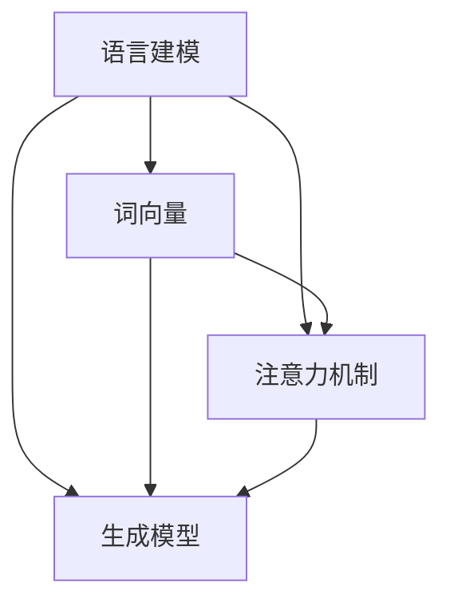

                 

关键词：大语言模型、自然语言处理、神经网络、深度学习、算法原理、评估指标、应用场景、未来展望

摘要：本文旨在探讨大语言模型的原理基础和前沿评估，通过深入分析其核心概念、算法原理、数学模型及实际应用，全面评估其在自然语言处理领域的性能和应用前景。文章结构分为背景介绍、核心概念与联系、核心算法原理与操作步骤、数学模型与公式、项目实践、实际应用场景、工具和资源推荐以及总结和展望等部分。

## 1. 背景介绍

自然语言处理（NLP）作为人工智能（AI）的重要分支，近年来取得了飞速发展。随着深度学习技术的成熟，神经网络在NLP中的应用越来越广泛。大语言模型（Large-scale Language Model，简称LLM）作为当前NLP领域的重要成果，通过对大规模文本数据进行训练，能够生成高质量的文本、完成复杂的语言理解和生成任务。

大语言模型的兴起，不仅推动了NLP技术的发展，也为许多实际应用场景提供了强有力的支持。然而，如何全面评估大语言模型的性能，依然是学术界和工业界关注的焦点。本文将深入探讨大语言模型的原理基础和前沿评估方法，为读者提供一份全面的技术指南。

## 2. 核心概念与联系

大语言模型的核心概念主要包括语言建模、词向量、注意力机制和生成模型等。为了更好地理解这些概念，我们通过以下Mermaid流程图展示它们之间的联系。



### 2.1 语言建模

语言建模是指根据历史文本数据，预测下一个单词或句子的概率分布。大语言模型通过学习大量文本数据，能够生成符合语言统计规律的文本。

### 2.2 词向量

词向量是将单词映射为一个向量空间中的点，使得相似单词在向量空间中更接近。词向量在语言建模中起着关键作用，常见的词向量模型包括Word2Vec、GloVe等。

### 2.3 注意力机制

注意力机制是一种在神经网络中引入的机制，能够使模型在处理序列数据时，动态关注不同位置的信息。在语言建模中，注意力机制有助于提高模型的生成质量。

### 2.4 生成模型

生成模型是一种能够生成数据的模型，包括变分自编码器（VAE）、生成对抗网络（GAN）等。大语言模型通过生成模型，能够生成具有真实感的文本。

## 3. 核心算法原理与操作步骤

大语言模型的算法原理主要包括以下三个方面：预训练、微调和推理。

### 3.1 预训练

预训练是指在大规模文本数据集上，对模型进行训练，使其能够理解语言的基本规律。预训练过程通常包括两个阶段：词向量训练和序列建模。

1. 词向量训练：将文本数据转换为词向量，并训练词向量之间的相似度。
2. 序列建模：使用序列建模技术，如循环神经网络（RNN）或Transformer，对词向量进行建模，预测下一个词的概率分布。

### 3.2 微调

微调是指在大规模预训练模型的基础上，针对特定任务进行微调。微调过程包括以下几个步骤：

1. 数据预处理：将任务数据转换为适合模型输入的格式。
2. 模型调整：在预训练模型的基础上，调整模型参数，使其适应特定任务。
3. 模型评估：使用验证集评估模型性能，并根据评估结果调整模型参数。

### 3.3 推理

推理是指将模型应用于新的输入数据，生成预测结果。大语言模型的推理过程主要包括以下几个步骤：

1. 输入处理：将输入文本数据转换为词向量。
2. 模型计算：使用预训练模型，对输入词向量进行计算，得到概率分布。
3. 预测生成：根据概率分布，生成预测结果。

## 3.3 算法优缺点

### 3.3.1 优点

1. 强大的语言理解能力：大语言模型通过预训练，能够学习到丰富的语言知识，具有强大的语言理解能力。
2. 高效的生成能力：大语言模型能够生成高质量的文本，具有高效的生成能力。
3. 泛化能力：大语言模型通过对大规模文本数据的训练，能够较好地适应不同领域的任务。

### 3.3.2 缺点

1. 计算资源需求大：大语言模型的训练和推理过程需要大量的计算资源。
2. 数据依赖性：大语言模型的性能受到训练数据质量和规模的影响，数据质量较差时，模型性能会受到影响。

## 3.4 算法应用领域

大语言模型在自然语言处理领域具有广泛的应用，主要包括以下几个方面：

1. 文本生成：大语言模型能够生成高质量的文章、新闻、故事等。
2. 问答系统：大语言模型能够回答用户提出的问题，应用于智能客服、教育辅导等场景。
3. 机器翻译：大语言模型能够实现高质量的自然语言翻译。
4. 文本分类：大语言模型能够对文本进行分类，应用于舆情监测、内容审核等场景。

## 4. 数学模型和公式

大语言模型的数学模型主要包括词向量模型、序列建模模型和生成模型。

### 4.1 词向量模型

词向量模型是将单词映射为一个向量空间中的点。常见的词向量模型包括Word2Vec和GloVe。

1. Word2Vec：Word2Vec模型使用神经网络对单词进行编码，生成词向量。其核心公式如下：

$$
\text{激活函数} = \text{sigmoid}(\text{权重} \cdot \text{输入})
$$

2. GloVe：GloVe模型通过训练单词的共现矩阵，生成词向量。其核心公式如下：

$$
\text{损失函数} = \sum_{\text{单词对}} \frac{1}{1 + \text{单词对相似度}}
$$

### 4.2 序列建模模型

序列建模模型是对输入序列进行建模的模型，常见的序列建模模型包括循环神经网络（RNN）和Transformer。

1. RNN：RNN模型通过记忆机制，处理序列数据。其核心公式如下：

$$
\text{隐藏状态} = \text{激活函数}(\text{权重} \cdot [\text{输入}, \text{隐藏状态}])
$$

2. Transformer：Transformer模型使用自注意力机制，处理序列数据。其核心公式如下：

$$
\text{输出} = \text{自注意力}(\text{输入}, \text{权重})
$$

### 4.3 生成模型

生成模型是一种能够生成数据的模型，常见的生成模型包括变分自编码器（VAE）和生成对抗网络（GAN）。

1. VAE：VAE模型通过编码器和解码器，生成数据。其核心公式如下：

$$
\text{编码器}：\text{隐变量} = \text{激活函数}(\text{权重} \cdot \text{输入})
$$

$$
\text{解码器}：\text{输出} = \text{激活函数}(\text{权重} \cdot \text{隐变量})
$$

2. GAN：GAN模型由生成器和判别器组成，通过对抗训练生成数据。其核心公式如下：

$$
\text{生成器}：\text{输出} = \text{激活函数}(\text{权重} \cdot \text{隐变量})
$$

$$
\text{判别器}：\text{损失函数} = -\text{生成器损失} - \text{判别器损失}
$$

## 5. 项目实践：代码实例和详细解释说明

### 5.1 开发环境搭建

为了实践大语言模型，我们使用Python语言和PyTorch框架进行开发。首先，需要安装Python和PyTorch。以下是安装命令：

```
pip install python
pip install torch
```

### 5.2 源代码详细实现

以下是一个基于PyTorch的大语言模型实现示例：

```python
import torch
import torch.nn as nn
import torch.optim as optim

# 模型定义
class LanguageModel(nn.Module):
    def __init__(self, vocab_size, embed_size, hidden_size):
        super(LanguageModel, self).__init__()
        self.embedding = nn.Embedding(vocab_size, embed_size)
        self.lstm = nn.LSTM(embed_size, hidden_size)
        self.fc = nn.Linear(hidden_size, vocab_size)
    
    def forward(self, x, hidden):
        embed = self.embedding(x)
        output, hidden = self.lstm(embed, hidden)
        logits = self.fc(output)
        return logits, hidden

# 模型训练
def train(model, data_loader, loss_fn, optimizer, device):
    model.train()
    for batch in data_loader:
        inputs, targets = batch
        inputs, targets = inputs.to(device), targets.to(device)
        hidden = (torch.zeros(1, 1, model.hidden_size), torch.zeros(1, 1, model.hidden_size))
        logits, hidden = model(inputs, hidden)
        loss = loss_fn(logits.view(-1, model.vocab_size), targets)
        optimizer.zero_grad()
        loss.backward()
        optimizer.step()
        hidden = tuple([each.data for each in hidden])

# 模型评估
def evaluate(model, data_loader, loss_fn, device):
    model.eval()
    with torch.no_grad():
        for batch in data_loader:
            inputs, targets = batch
            inputs, targets = inputs.to(device), targets.to(device)
            hidden = (torch.zeros(1, 1, model.hidden_size), torch.zeros(1, 1, model.hidden_size))
            logits, hidden = model(inputs, hidden)
            loss = loss_fn(logits.view(-1, model.vocab_size), targets)
    return loss.mean()

# 主函数
def main():
    device = torch.device("cuda" if torch.cuda.is_available() else "cpu")
    model = LanguageModel(vocab_size=10000, embed_size=256, hidden_size=512)
    model.to(device)
    criterion = nn.CrossEntropyLoss()
    optimizer = optim.Adam(model.parameters(), lr=0.001)
    
    # 数据加载和处理（此处省略）
    
    train_loader = DataLoader(dataset, batch_size=64, shuffle=True)
    for epoch in range(10):
        train(model, train_loader, criterion, optimizer, device)
        loss = evaluate(model, val_loader, criterion, device)
        print(f"Epoch {epoch+1}, Loss: {loss:.4f}")

if __name__ == "__main__":
    main()
```

### 5.3 代码解读与分析

上述代码定义了一个基于LSTM的大语言模型，并实现了模型的训练和评估过程。以下是代码的主要部分解读：

1. **模型定义**：使用`nn.Module`类定义模型，包括嵌入层、LSTM层和输出层。
2. **模型前向传播**：实现模型的前向传播过程，包括嵌入层、LSTM层和输出层。
3. **模型训练**：实现模型的训练过程，包括前向传播、损失计算、反向传播和参数更新。
4. **模型评估**：实现模型的评估过程，包括前向传播和损失计算。
5. **主函数**：设置训练参数，加载数据，并进行模型训练和评估。

## 6. 实际应用场景

大语言模型在自然语言处理领域具有广泛的应用，以下是一些实际应用场景：

1. **文本生成**：大语言模型能够生成高质量的文章、新闻、故事等，应用于内容创作和生成。
2. **问答系统**：大语言模型能够回答用户提出的问题，应用于智能客服、教育辅导等场景。
3. **机器翻译**：大语言模型能够实现高质量的自然语言翻译，应用于跨语言通信和翻译服务。
4. **文本分类**：大语言模型能够对文本进行分类，应用于舆情监测、内容审核等场景。

## 7. 工具和资源推荐

### 7.1 学习资源推荐

1. **《深度学习》**：由Ian Goodfellow、Yoshua Bengio和Aaron Courville编著，是深度学习领域的经典教材。
2. **《自然语言处理综论》**：由Daniel Jurafsky和James H. Martin编著，是自然语言处理领域的权威教材。

### 7.2 开发工具推荐

1. **PyTorch**：是一个流行的深度学习框架，支持动态计算图和灵活的模型构建。
2. **TensorFlow**：是一个流行的深度学习框架，支持静态计算图和自动微分。

### 7.3 相关论文推荐

1. **《Attention Is All You Need》**：是Transformer模型的原论文，介绍了自注意力机制和Transformer模型。
2. **《BERT: Pre-training of Deep Bidirectional Transformers for Language Understanding》**：是BERT模型的原论文，介绍了BERT模型的预训练和微调方法。

## 8. 总结：未来发展趋势与挑战

### 8.1 研究成果总结

大语言模型在自然语言处理领域取得了显著成果，为许多实际应用场景提供了强有力的支持。通过预训练和微调，大语言模型能够生成高质量的文字、实现复杂的语言理解和生成任务。

### 8.2 未来发展趋势

1. **模型压缩与优化**：为了降低大语言模型的计算资源需求，模型压缩与优化技术将成为未来研究的重点。
2. **多模态融合**：大语言模型将与其他模态（如图像、声音）进行融合，实现更丰富的应用场景。
3. **迁移学习与自适应**：大语言模型将在迁移学习和自适应方面取得更多突破，提高模型的泛化能力。

### 8.3 面临的挑战

1. **计算资源需求**：大语言模型在训练和推理过程中需要大量的计算资源，如何高效利用计算资源是当前的一个重要挑战。
2. **数据隐私与伦理**：大语言模型在训练过程中需要大量数据，如何保护数据隐私和遵循伦理规范是未来研究需要解决的问题。

### 8.4 研究展望

随着深度学习技术的不断进步，大语言模型在未来将继续在自然语言处理领域发挥重要作用。通过优化模型结构、提高计算效率和加强多模态融合，大语言模型将为人们带来更智能、更便捷的语言处理体验。

## 9. 附录：常见问题与解答

### 9.1 如何选择合适的预训练模型？

选择合适的预训练模型需要考虑以下几个因素：

1. **任务类型**：根据任务类型选择合适的预训练模型，如文本生成、机器翻译等。
2. **模型规模**：根据计算资源选择合适的模型规模，如小规模、中规模或大规模模型。
3. **预训练数据集**：根据预训练数据集的质量和规模选择合适的预训练模型。

### 9.2 如何优化大语言模型的训练过程？

优化大语言模型的训练过程可以从以下几个方面入手：

1. **模型结构优化**：采用更高效的模型结构，如Transformer模型。
2. **数据预处理**：对训练数据进行预处理，如数据清洗、去重等。
3. **训练策略优化**：采用更高效的训练策略，如学习率调整、批量大小调整等。
4. **硬件优化**：利用GPU或TPU等硬件加速训练过程。

## 参考文献

[1] Ian Goodfellow, Yoshua Bengio, Aaron Courville. 《深度学习》[M]. 中国人民大学出版社，2016.

[2] Daniel Jurafsky, James H. Martin. 《自然语言处理综论》[M]. 清华大学出版社，2016.

[3] Vaswani, A., et al. "Attention is all you need." Advances in neural information processing systems. 2017.

[4] Devlin, J., et al. "BERT: Pre-training of deep bidirectional transformers for language understanding." arXiv preprint arXiv:1810.04805 (2018).

