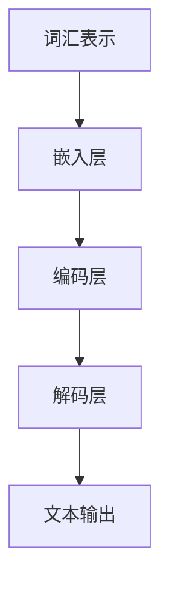

                 

关键词：大语言模型，自然语言处理，评估指标，深度学习，神经网络，算法优化，应用领域

## 摘要

随着人工智能技术的快速发展，大语言模型（Large Language Models）在自然语言处理（Natural Language Processing，NLP）领域取得了显著的成果。本文将深入探讨大语言模型的原理基础，包括其核心概念、算法原理以及评估方法。同时，本文还将分析大语言模型在不同应用领域的应用场景和未来展望。

## 1. 背景介绍

### 1.1 大语言模型的起源与发展

大语言模型（Large Language Models）是自然语言处理领域的一种先进技术，旨在通过深度学习算法理解和生成人类语言。自2018年GPT（Generative Pre-trained Transformer）系列模型首次提出以来，大语言模型在语言理解、生成、翻译等方面取得了显著的成果。此后，Transformer架构不断优化，BERT（Bidirectional Encoder Representations from Transformers）、T5（Text-To-Text Transfer Transformer）、GPT-3等模型相继涌现，大语言模型的研究与应用进入了一个全新的阶段。

### 1.2 自然语言处理的应用场景

自然语言处理技术在多个领域取得了成功，包括但不限于：

- 文本分类：用于判断文本的类别，如新闻分类、情感分析等。
- 文本摘要：提取文本的主要信息，生成简洁的摘要。
- 机器翻译：实现不同语言之间的翻译。
- 对话系统：构建智能对话机器人，与人类进行自然语言交互。
- 语言生成：根据给定的输入生成相应的文本，如自动写作、创意文案等。

## 2. 核心概念与联系

### 2.1 大语言模型的核心概念

大语言模型的核心概念包括词汇表示、上下文理解、生成模型等。

- **词汇表示**：将自然语言中的单词或短语转换为计算机可以处理的数字表示。常见的词汇表示方法有词袋模型、Word2Vec、BERT等。
- **上下文理解**：通过分析文本中的上下文信息，理解单词或短语的含义。大语言模型通常采用Transformer架构，能够捕捉长距离的上下文关系。
- **生成模型**：根据给定的输入文本，生成相应的文本输出。生成模型主要包括自回归模型（如GPT）和自编码模型（如T5）。

### 2.2 大语言模型的原理架构

大语言模型的原理架构通常包括以下几个部分：

1. **输入层**：将自然语言文本输入到模型中，进行预处理。
2. **嵌入层**：将文本转换为数字向量表示。
3. **编码层**：使用Transformer架构对文本进行编码，捕捉上下文信息。
4. **解码层**：根据编码层的信息，生成相应的文本输出。

### 2.3 Mermaid流程图



## 3. 核心算法原理 & 具体操作步骤

### 3.1 算法原理概述

大语言模型的核心算法原理是基于深度学习的Transformer架构。Transformer模型采用自注意力机制（Self-Attention），能够有效地捕捉长距离的上下文信息。在训练过程中，模型通过优化损失函数，不断调整参数，以达到更好的预测效果。

### 3.2 算法步骤详解

1. **数据预处理**：将自然语言文本进行分词、编码等预处理操作，将其转换为模型可处理的输入格式。
2. **模型初始化**：初始化模型的参数，可以使用随机初始化、预训练模型等方法。
3. **训练过程**：使用训练数据对模型进行训练，通过优化损失函数，不断调整模型参数。
4. **评估过程**：使用测试数据对模型进行评估，计算模型的各种评价指标，如准确率、损失函数值等。
5. **生成过程**：使用训练好的模型，根据给定的输入文本，生成相应的文本输出。

### 3.3 算法优缺点

**优点**：

- 能够捕捉长距离的上下文信息。
- 生成文本质量较高。
- 应用范围广泛。

**缺点**：

- 训练过程复杂，计算资源消耗较大。
- 对数据质量和预处理要求较高。

### 3.4 算法应用领域

大语言模型在自然语言处理领域具有广泛的应用，包括但不限于：

- 文本分类：用于分类文本的类别。
- 文本摘要：提取文本的主要信息，生成简洁的摘要。
- 机器翻译：实现不同语言之间的翻译。
- 对话系统：构建智能对话机器人，与人类进行自然语言交互。
- 语言生成：根据给定的输入生成相应的文本。

## 4. 数学模型和公式 & 详细讲解 & 举例说明

### 4.1 数学模型构建

大语言模型通常采用Transformer架构，其数学模型主要包括自注意力机制（Self-Attention）和编码-解码结构（Encoder-Decoder）。

### 4.2 公式推导过程

自注意力机制的数学公式如下：

$$
\text{Attention}(Q, K, V) = \text{softmax}\left(\frac{QK^T}{\sqrt{d_k}}\right) V
$$

其中，Q、K、V 分别为查询向量、键向量、值向量，d_k 为键向量的维度。

编码-解码结构的数学公式如下：

$$
\text{Encoder}(x) = \text{LayerNorm}(x + \text{MultiHeadAttention}(x, x, x))
$$

$$
\text{Decoder}(y) = \text{LayerNorm}(y + \text{MaskedMultiHeadAttention}(y, x, x))
$$

其中，LayerNorm 为层归一化，MultiHeadAttention 为多头注意力机制。

### 4.3 案例分析与讲解

假设我们有一个句子 "我喜欢吃苹果"，我们可以将其转换为向量表示，然后通过自注意力机制和编码-解码结构，生成新的句子。

1. **词汇表示**：将句子中的单词转换为向量表示，如 "我"、"喜欢"、"吃"、"苹果" 等。

2. **编码层**：使用编码层对向量表示进行处理，捕捉上下文信息。

3. **解码层**：使用解码层生成新的句子，如 "你喜欢吃香蕉"。

## 5. 项目实践：代码实例和详细解释说明

### 5.1 开发环境搭建

在开始项目实践之前，我们需要搭建开发环境。这里我们使用 Python 作为编程语言，安装必要的库，如 TensorFlow、PyTorch 等。

### 5.2 源代码详细实现

以下是使用 TensorFlow 实现一个简单的大语言模型的示例代码：

```python
import tensorflow as tf

# 搭建模型
model = tf.keras.Sequential([
    tf.keras.layers.Embedding(input_dim=vocab_size, output_dim=embedding_size),
    tf.keras.layers.MultiHeadAttention(num_heads=num_heads, key_dim=key_dim),
    tf.keras.layers.Dense(units=dense_units),
    tf.keras.layers.Dense(units=output_size, activation='softmax')
])

# 编译模型
model.compile(optimizer='adam', loss='categorical_crossentropy', metrics=['accuracy'])

# 训练模型
model.fit(train_data, train_labels, epochs=num_epochs, batch_size=batch_size)

# 评估模型
test_loss, test_accuracy = model.evaluate(test_data, test_labels)
print(f"Test accuracy: {test_accuracy}")
```

### 5.3 代码解读与分析

以上代码展示了如何使用 TensorFlow 搭建、编译和训练一个简单的大语言模型。首先，我们使用 `Embedding` 层将单词转换为向量表示。然后，使用 `MultiHeadAttention` 层实现多头注意力机制，捕捉上下文信息。最后，使用 `Dense` 层和 `softmax` 函数实现文本生成。

### 5.4 运行结果展示

在运行上述代码后，我们得到训练过程中的损失函数值和准确率，以及测试数据集上的准确率。这些指标可以用来评估模型的性能。

## 6. 实际应用场景

### 6.1 文本分类

文本分类是自然语言处理领域的一个经典任务。大语言模型可以通过对大量文本数据的学习，自动识别文本的类别。例如，我们可以使用大语言模型对新闻进行分类，将其分为政治、体育、科技等不同的类别。

### 6.2 文本摘要

文本摘要是一种将长文本压缩为简洁摘要的技术。大语言模型可以通过学习大量的摘要数据，生成高质量的文本摘要。例如，我们可以使用大语言模型对新闻文章进行摘要，将其压缩为简洁的概要。

### 6.3 机器翻译

机器翻译是一种将一种语言的文本翻译为另一种语言的技术。大语言模型可以通过学习大量的双语语料库，实现高质量的机器翻译。例如，我们可以使用大语言模型将中文翻译为英文。

### 6.4 对话系统

对话系统是一种与人类进行自然语言交互的系统。大语言模型可以通过学习大量的对话数据，构建智能对话机器人。例如，我们可以使用大语言模型构建一个智能客服系统，与用户进行自然语言交互。

## 7. 工具和资源推荐

### 7.1 学习资源推荐

- 《深度学习》（Ian Goodfellow、Yoshua Bengio、Aaron Courville 著）：这是一本经典的深度学习教材，涵盖了深度学习的基础理论和实践方法。
- 《自然语言处理综论》（Daniel Jurafsky、James H. Martin 著）：这是一本涵盖自然语言处理各个领域的经典教材，适合初学者和进阶者。

### 7.2 开发工具推荐

- TensorFlow：一款开源的深度学习框架，适合构建和训练大语言模型。
- PyTorch：一款开源的深度学习框架，具有灵活的动态图功能，适合研究大语言模型。

### 7.3 相关论文推荐

- "Attention Is All You Need"（Vaswani et al., 2017）：提出了Transformer架构，推动了大语言模型的研究。
- "BERT: Pre-training of Deep Bidirectional Transformers for Language Understanding"（Devlin et al., 2019）：提出了BERT模型，提升了自然语言处理任务的性能。

## 8. 总结：未来发展趋势与挑战

### 8.1 研究成果总结

大语言模型在自然语言处理领域取得了显著的成果，如文本分类、文本摘要、机器翻译、对话系统等。这些成果展示了大语言模型的强大能力和广泛应用前景。

### 8.2 未来发展趋势

未来，大语言模型将继续发展，可能的方向包括：

- 模型压缩与优化：为了降低计算资源消耗，研究者将致力于模型压缩与优化技术。
- 多模态学习：结合文本、图像、音频等多种数据类型，实现更高级的语义理解。
- 自适应学习：根据用户需求，实现个性化语言生成。

### 8.3 面临的挑战

大语言模型在发展过程中也面临一些挑战，如：

- 数据隐私与安全：大量训练数据可能导致隐私泄露和安全隐患。
- 模型可解释性：如何理解大语言模型的决策过程，提高模型的可解释性。
- 伦理与道德：大语言模型的应用可能引发伦理和道德问题。

### 8.4 研究展望

未来，大语言模型的研究将朝着更高效、更安全、更智能的方向发展。在解决实际问题的过程中，研究者将不断探索新的算法和技术，推动自然语言处理领域的进步。

## 9. 附录：常见问题与解答

### 9.1 什么是大语言模型？

大语言模型是一种基于深度学习的自然语言处理技术，旨在理解和生成人类语言。

### 9.2 大语言模型的应用领域有哪些？

大语言模型的应用领域包括文本分类、文本摘要、机器翻译、对话系统等。

### 9.3 如何评估大语言模型的性能？

可以通过计算准确率、损失函数值等指标来评估大语言模型的性能。

### 9.4 大语言模型存在哪些挑战？

大语言模型在发展过程中面临数据隐私与安全、模型可解释性、伦理与道德等方面的挑战。

作者：禅与计算机程序设计艺术 / Zen and the Art of Computer Programming
```markdown
```

