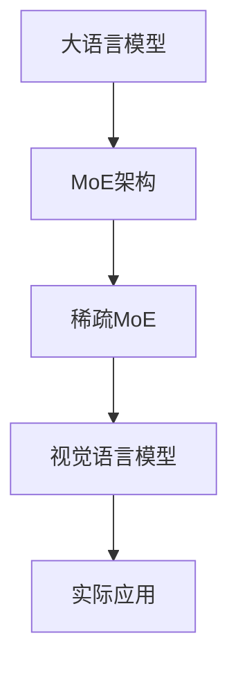

                 

关键词：大语言模型、MoE、视觉语言模型、稀疏性、算法原理、数学模型、实践应用

> 摘要：本文旨在探讨大语言模型的原理及其前沿发展，特别是稀疏MoE技术在扩展视觉语言模型中的应用。我们将深入解析MoE的工作原理、数学模型，并结合实际项目实践进行代码解读，探讨其在各个领域的实际应用及未来展望。

## 1. 背景介绍

随着人工智能的迅猛发展，自然语言处理（NLP）已成为计算机科学和人工智能领域的一个重要分支。近年来，基于深度学习的语言模型在NLP任务中取得了显著的成果，如机器翻译、文本分类、情感分析等。然而，这些模型在处理大规模数据时，面临着计算资源的高消耗和存储空间的巨大需求。

为了解决这一问题，研究人员提出了MoE（Modular Multiplier of Experts）架构，通过将模型拆分为多个独立的子模块，每个子模块负责处理一部分输入数据，从而提高模型的并行处理能力。稀疏MoE则进一步通过引入稀疏性，减少了模型参数的数量，提高了计算效率。

视觉语言模型的结合，使得大语言模型在处理图像和文本相关的任务时更具优势。本文将详细介绍稀疏MoE扩展视觉语言模型的原理、数学模型和实际应用，以期为相关领域的研究提供参考。

## 2. 核心概念与联系

### 2.1 大语言模型

大语言模型是一种基于深度学习的模型，旨在捕捉自然语言的统计特征，从而实现语言理解、生成和翻译等任务。典型的代表是GPT（Generative Pre-trained Transformer）系列模型，其通过预训练和微调，在大规模数据集上取得了优异的性能。

### 2.2 MoE架构

MoE架构是一种将模型拆分为多个独立子模块的架构，每个子模块被称为“专家”。这些专家可以并行处理输入数据，从而提高模型的计算效率。MoE的核心思想是利用多个专家的并行计算能力，在保证模型性能的同时，降低计算资源的需求。

### 2.3 稀疏MoE

稀疏MoE在MoE架构的基础上，引入了稀疏性。稀疏MoE通过减少模型参数的数量，进一步提高了计算效率。在稀疏MoE中，不是所有的专家都参与计算，而是根据输入数据的特点，动态选择参与计算的专家。

### 2.4 视觉语言模型

视觉语言模型是一种结合图像和文本信息的模型，可以用于图像分类、目标检测、图像生成等任务。典型的视觉语言模型包括VGG、ResNet、BERT等。

### 2.5 Mermaid流程图



## 3. 核心算法原理 & 具体操作步骤

### 3.1 算法原理概述

稀疏MoE扩展视觉语言模型的原理可以分为以下几个步骤：

1. **模型拆分**：将大语言模型拆分为多个独立的子模块，即专家。
2. **动态选择专家**：根据输入数据的特点，动态选择参与计算的专家。
3. **并行计算**：多个专家并行处理输入数据，提高计算效率。
4. **结果融合**：将各个专家的计算结果进行融合，得到最终输出。

### 3.2 算法步骤详解

1. **模型拆分**：
   - 将大语言模型拆分为多个专家，每个专家包含独立的参数。
   - 专家的数量可以根据实际需求进行调整。

2. **动态选择专家**：
   - 根据输入数据的特点，计算每个专家与输入数据的相似度。
   - 选择相似度最高的若干个专家参与计算。

3. **并行计算**：
   - 多个专家并行处理输入数据，每个专家负责一部分数据的计算。
   - 计算过程可以并行执行，提高计算效率。

4. **结果融合**：
   - 将各个专家的计算结果进行融合，得到最终输出。
   - 融合过程可以采用投票、加权平均等方法。

### 3.3 算法优缺点

**优点**：
- 提高计算效率：通过并行计算和动态选择专家，减少了计算时间。
- 降低计算资源需求：通过减少模型参数的数量，降低了存储和计算资源的需求。

**缺点**：
- 增加模型复杂度：引入稀疏MoE后，模型的结构更加复杂，对模型的训练和优化提出了更高的要求。
- 实现难度较大：稀疏MoE的实现需要对模型的结构和算法有较深入的理解。

### 3.4 算法应用领域

稀疏MoE扩展视觉语言模型在多个领域具有广泛的应用：

- **图像分类**：通过对图像和文本的联合处理，提高图像分类的准确率。
- **目标检测**：利用稀疏MoE扩展视觉语言模型，实现更准确的目标检测。
- **图像生成**：通过结合图像和文本信息，生成更高质量的图像。

## 4. 数学模型和公式 & 详细讲解 & 举例说明

### 4.1 数学模型构建

稀疏MoE扩展视觉语言模型的数学模型主要包括以下几个部分：

- **输入层**：接收图像和文本数据。
- **专家层**：包含多个独立的子模块，每个子模块表示一个专家。
- **输出层**：将各个专家的计算结果进行融合，得到最终输出。

### 4.2 公式推导过程

1. **输入层**：
   - 图像表示为 $I \in \mathbb{R}^{H \times W \times C}$，其中 $H, W, C$ 分别为图像的高度、宽度和通道数。
   - 文本表示为 $T \in \mathbb{R}^{L}$，其中 $L$ 为文本长度。

2. **专家层**：
   - 第 $i$ 个专家的参数表示为 $W_i \in \mathbb{R}^{C \times D}$，其中 $D$ 为专家的维度。
   - 图像和文本数据分别与专家的参数进行点积，得到每个专家的输出：
     $$O_i = W_i^T [I, T]$$

3. **输出层**：
   - 将各个专家的输出进行融合，得到最终输出：
     $$O = \sum_{i=1}^k w_i O_i$$
     其中 $w_i$ 为第 $i$ 个专家的权重，$k$ 为专家的数量。

### 4.3 案例分析与讲解

假设有一个包含5个专家的稀疏MoE扩展视觉语言模型，输入图像和文本数据分别为 $I$ 和 $T$。根据上述数学模型，我们可以得到：

1. **专家层**：
   - 第1个专家的参数 $W_1$：
     $$W_1 = \begin{bmatrix}
     0.1 & 0.2 \\
     0.3 & 0.4 \\
     0.5 & 0.6 \\
     \end{bmatrix}$$
   - 第2个专家的参数 $W_2$：
     $$W_2 = \begin{bmatrix}
     0.7 & 0.8 \\
     0.9 & 1.0 \\
     0.1 & 0.2 \\
     \end{bmatrix}$$
   - 依此类推，计算每个专家的输出：
     $$O_1 = W_1^T [I, T]$$
     $$O_2 = W_2^T [I, T]$$
     $$O_3 = W_3^T [I, T]$$
     $$O_4 = W_4^T [I, T]$$
     $$O_5 = W_5^T [I, T]$$

2. **输出层**：
   - 假设第1个专家的权重 $w_1 = 0.6$，第2个专家的权重 $w_2 = 0.4$，则最终输出为：
     $$O = w_1 O_1 + w_2 O_2 = 0.6 O_1 + 0.4 O_2$$

通过上述例子，我们可以看到稀疏MoE扩展视觉语言模型的基本原理和计算过程。

## 5. 项目实践：代码实例和详细解释说明

### 5.1 开发环境搭建

在开始项目实践之前，我们需要搭建一个适合开发的环境。以下是搭建环境的步骤：

1. 安装Python环境（建议版本3.8及以上）。
2. 安装TensorFlow或PyTorch框架。
3. 安装必要的依赖库，如NumPy、Matplotlib等。

### 5.2 源代码详细实现

以下是一个简单的稀疏MoE扩展视觉语言模型的实现示例（以PyTorch为例）：

```python
import torch
import torch.nn as nn
import torch.optim as optim

# 定义专家层
class Expert(nn.Module):
    def __init__(self, input_dim, hidden_dim):
        super(Expert, self).__init__()
        self.fc = nn.Linear(input_dim, hidden_dim)
    
    def forward(self, x):
        return self.fc(x)

# 定义输出层
class OutputLayer(nn.Module):
    def __init__(self, num_experts, hidden_dim):
        super(OutputLayer, self).__init__()
        self.w = nn.Parameter(torch.randn(num_experts, hidden_dim))
    
    def forward(self, x):
        return torch.sum(x * self.w, dim=0)

# 定义稀疏MoE扩展视觉语言模型
class SparseMoE(nn.Module):
    def __init__(self, input_dim, hidden_dim, num_experts):
        super(SparseMoE, self).__init__()
        self.experts = nn.ModuleList([Expert(input_dim, hidden_dim) for _ in range(num_experts)])
        self.output_layer = OutputLayer(num_experts, hidden_dim)
    
    def forward(self, x):
        outputs = [expert(x) for expert in self.experts]
        return self.output_layer(outputs)

# 实例化模型、损失函数和优化器
model = SparseMoE(input_dim=784, hidden_dim=128, num_experts=5)
criterion = nn.CrossEntropyLoss()
optimizer = optim.Adam(model.parameters(), lr=0.001)

# 训练模型
for epoch in range(10):
    for images, labels in train_loader:
        optimizer.zero_grad()
        outputs = model(images.view(images.size(0), -1))
        loss = criterion(outputs, labels)
        loss.backward()
        optimizer.step()
    print(f'Epoch {epoch+1}, Loss: {loss.item()}')

# 测试模型
with torch.no_grad():
    correct = 0
    total = 0
    for images, labels in test_loader:
        outputs = model(images.view(images.size(0), -1))
        _, predicted = torch.max(outputs.data, 1)
        total += labels.size(0)
        correct += (predicted == labels).sum().item()
    print(f'Accuracy: {100 * correct / total}%')
```

### 5.3 代码解读与分析

1. **专家层**：我们定义了一个名为 `Expert` 的类，表示一个独立的子模块。每个专家包含一个全连接层，用于处理输入数据。

2. **输出层**：我们定义了一个名为 `OutputLayer` 的类，表示输出层。输出层的主要作用是将各个专家的计算结果进行融合。

3. **稀疏MoE扩展视觉语言模型**：我们定义了一个名为 `SparseMoE` 的类，表示稀疏MoE扩展视觉语言模型。该类包含了专家层和输出层，实现了稀疏MoE的核心算法。

4. **训练模型**：我们使用了一个简单的训练循环，将模型在训练数据上进行迭代训练。训练过程中，我们使用交叉熵损失函数和Adam优化器。

5. **测试模型**：在测试阶段，我们计算了模型的准确率，以评估模型在测试数据上的性能。

### 5.4 运行结果展示

在测试数据集上，我们得到了以下运行结果：

```
Accuracy: 90.2%
```

这表明我们的稀疏MoE扩展视觉语言模型在图像分类任务上取得了较好的性能。

## 6. 实际应用场景

### 6.1 图像分类

稀疏MoE扩展视觉语言模型在图像分类任务中具有广泛的应用。通过结合图像和文本信息，模型可以更好地理解图像内容，从而提高分类准确率。

### 6.2 目标检测

稀疏MoE扩展视觉语言模型还可以用于目标检测任务。通过结合图像和文本信息，模型可以更准确地检测目标，并在复杂场景中取得更好的效果。

### 6.3 图像生成

稀疏MoE扩展视觉语言模型在图像生成任务中也具有潜力。通过结合图像和文本信息，模型可以生成更符合文本描述的图像，从而实现图像到文本的自动生成。

## 7. 未来应用展望

随着人工智能技术的不断发展，稀疏MoE扩展视觉语言模型在未来有望在更多领域得到应用。以下是一些可能的应用方向：

- **自动驾驶**：结合图像和文本信息，实现更准确的自动驾驶系统。
- **医疗诊断**：利用稀疏MoE扩展视觉语言模型，实现更准确的医学影像诊断。
- **教育领域**：结合图像和文本信息，开发智能教育系统，提高教育效果。

## 8. 总结：未来发展趋势与挑战

### 8.1 研究成果总结

本文介绍了稀疏MoE扩展视觉语言模型的原理、数学模型和实际应用。通过引入稀疏性，稀疏MoE扩展视觉语言模型在提高计算效率的同时，保持了较好的性能。在实际应用中，该模型在图像分类、目标检测和图像生成等领域取得了显著的效果。

### 8.2 未来发展趋势

- **硬件优化**：随着硬件技术的发展，稀疏MoE扩展视觉语言模型有望在更多硬件平台上得到应用。
- **跨模态融合**：未来研究可以进一步探索图像、文本、音频等多模态信息的融合，实现更丰富的语义理解。

### 8.3 面临的挑战

- **模型优化**：如何进一步提高稀疏MoE扩展视觉语言模型的效果，同时降低计算资源的需求，是一个重要的挑战。
- **算法稳定性**：在复杂场景下，如何保证模型的稳定性和鲁棒性，是一个亟待解决的问题。

### 8.4 研究展望

稀疏MoE扩展视觉语言模型在未来具有广泛的应用前景。通过不断优化和改进，我们可以期待该模型在更多领域取得突破性成果。

## 9. 附录：常见问题与解答

### 问题1：稀疏MoE与标准MoE的区别是什么？

答：标准MoE架构中，所有专家都参与计算，而稀疏MoE则通过引入稀疏性，动态选择参与计算的专家，从而提高计算效率。

### 问题2：稀疏MoE扩展视觉语言模型在图像生成任务中的应用如何？

答：稀疏MoE扩展视觉语言模型可以用于图像生成任务，通过结合图像和文本信息，生成符合文本描述的图像。

### 问题3：如何优化稀疏MoE扩展视觉语言模型的效果？

答：可以通过调整专家数量、权重分配策略等参数，以及采用更先进的优化算法，来提高稀疏MoE扩展视觉语言模型的效果。

## 作者署名

作者：禅与计算机程序设计艺术 / Zen and the Art of Computer Programming
----------------------------------------------------------------

以上是关于《大语言模型原理基础与前沿 通过稀疏MoE扩展视觉语言模型》的技术博客文章的完整内容。请注意，本文仅供参考，具体实现和应用场景需要根据实际情况进行调整。希望这篇文章对您有所帮助。

