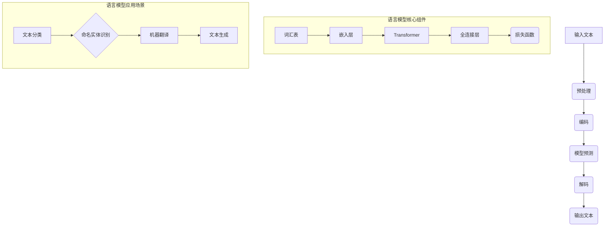

                 

关键词：大语言模型、Transformer、推理、扩展、深度学习

> 摘要：本文将深入探讨大语言模型的原理，从基础到前沿技术，特别是Transformer推理的优化方法。我们将介绍其核心概念、数学模型、算法步骤，并通过实例代码和实际应用场景展示其应用潜力。文章旨在为读者提供一个全面的技术解读，以了解大语言模型的当前状态和未来发展趋势。

## 1. 背景介绍

随着互联网的快速发展，数据量呈现指数级增长。尤其是文本数据，从社交媒体、新闻、科研论文到日常对话，都在不断积累。如何有效地处理和分析这些海量数据，成为了当今人工智能领域的重要课题。大语言模型（Large Language Models）正是在这样的背景下应运而生，它们利用深度学习和自然语言处理技术，对大规模文本数据进行建模，从而实现高效的语言理解和生成。

### 1.1 大语言模型的起源与发展

大语言模型的概念最早可以追溯到20世纪80年代的统计语言模型。当时，研究者们开始尝试使用神经网络来模拟人类语言处理的能力。然而，由于计算资源和数据量的限制，早期的模型效果有限。

直到近年来，随着深度学习技术的突破和计算能力的提升，大语言模型取得了显著进展。尤其是Transformer架构的引入，使得模型的规模和性能得到了极大的提升。目前，诸如GPT-3、BERT、T5等大型语言模型已经成为自然语言处理领域的重要工具，被广泛应用于各种任务，如文本分类、问答系统、机器翻译、文本生成等。

### 1.2 大语言模型的重要性

大语言模型的重要性主要体现在以下几个方面：

1. **语言理解与生成**：大语言模型能够对自然语言文本进行深入理解，并生成流畅自然的文本。这对于智能助手、聊天机器人等应用场景具有重要意义。
2. **信息检索与推荐**：大语言模型能够对海量文本数据进行高效检索和推荐，从而提高信息检索系统的准确性和用户体验。
3. **文本生成与摘要**：大语言模型可以自动生成文章摘要、新闻简报等，为用户节省时间，提高工作效率。
4. **知识图谱构建**：大语言模型可以帮助构建知识图谱，为智能问答系统提供丰富的语义信息。

## 2. 核心概念与联系

### 2.1 语言模型的定义

语言模型（Language Model）是一种用于预测自然语言序列的统计模型。它的目标是根据输入的文本序列，预测下一个可能出现的词或字符。语言模型是自然语言处理的基础，几乎所有的自然语言处理任务都需要语言模型的支持。

### 2.2 大语言模型的特点

大语言模型（Large Language Model）相比于传统语言模型，具有以下几个显著特点：

1. **大规模参数**：大语言模型通常拥有数十亿甚至数万亿个参数，这使得它们能够捕捉到语言中的复杂模式和关联。
2. **自适应能力**：大语言模型能够根据不同的任务和数据集进行自适应调整，从而在不同应用场景中保持高效性。
3. **多任务处理**：大语言模型能够同时处理多种自然语言处理任务，如文本分类、情感分析、命名实体识别等。

### 2.3 语言模型与自然语言处理的关系

语言模型是自然语言处理（Natural Language Processing, NLP）的核心组件。NLP的任务包括文本分析、语音识别、机器翻译、信息检索等。语言模型在这些任务中发挥着关键作用：

1. **文本分类**：使用语言模型可以预测文本的类别，如新闻分类、情感分析等。
2. **命名实体识别**：语言模型可以帮助识别文本中的命名实体，如人名、地名、组织名等。
3. **机器翻译**：语言模型可以用于预测源语言和目标语言之间的对应关系，从而实现机器翻译。
4. **文本生成**：语言模型可以生成新的文本，如文章摘要、对话生成等。

### 2.4 Mermaid 流程图

下面是一个描述大语言模型核心概念和架构的Mermaid流程图：



## 3. 核心算法原理 & 具体操作步骤

### 3.1 算法原理概述

大语言模型的核心算法是基于Transformer架构的深度学习模型。Transformer模型最早由Vaswani等人在2017年的论文《Attention Is All You Need》中提出，它完全基于注意力机制，摒弃了传统的循环神经网络（RNN）和卷积神经网络（CNN），实现了更高效的文本处理。

Transformer模型的主要组成部分包括：

1. **编码器（Encoder）**：用于处理输入的文本序列，生成编码表示。
2. **解码器（Decoder）**：用于生成输出文本序列。
3. **多头注意力机制（Multi-Head Attention）**：用于捕捉输入序列中的长距离依赖关系。
4. **位置编码（Positional Encoding）**：用于为模型提供文本序列的位置信息。

### 3.2 算法步骤详解

1. **输入预处理**：对输入的文本进行分词、去标点等处理，将文本转换为词向量表示。
2. **编码器处理**：输入的词向量通过编码器层进行编码，每层编码器包含多头注意力机制和前馈神经网络。
3. **多头注意力机制**：在编码器层中，每个词向量会通过多头注意力机制与输入序列中的其他词向量进行交互，从而捕捉长距离依赖关系。
4. **解码器处理**：解码器层接收编码器的输出，并生成输出文本序列。解码器同样包含多头注意力机制和前馈神经网络。
5. **输出生成**：解码器的最后一层生成输出词向量，通过解码器将词向量转换为文本序列。

### 3.3 算法优缺点

#### 优点

1. **高效处理长文本**：Transformer模型基于注意力机制，能够处理长文本序列，捕捉长距离依赖关系。
2. **并行计算**：Transformer模型中的自注意力机制支持并行计算，相比RNN序列模型，计算效率更高。
3. **灵活性和泛化能力**：Transformer模型结构灵活，可以应用于多种自然语言处理任务，具有较好的泛化能力。

#### 缺点

1. **计算资源需求大**：由于模型规模庞大，训练和推理过程需要大量的计算资源和时间。
2. **模型解释性差**：Transformer模型中的非线性注意力机制使得模型解释性较差，难以理解具体的预测逻辑。

### 3.4 算法应用领域

Transformer模型在自然语言处理领域有广泛的应用，主要包括：

1. **文本分类**：用于分类文本数据，如情感分析、主题分类等。
2. **机器翻译**：用于实现高效、准确的机器翻译系统。
3. **问答系统**：用于构建智能问答系统，提供高质量的答案。
4. **文本生成**：用于生成文章摘要、对话文本等。

## 4. 数学模型和公式 & 详细讲解 & 举例说明

### 4.1 数学模型构建

大语言模型中的数学模型主要包括词嵌入、多头注意力机制和前馈神经网络。

#### 词嵌入（Word Embedding）

词嵌入是将文本中的单词转换为向量的过程。假设词汇表包含V个单词，每个单词表示为一个d维向量，记为`$x_i \in \mathbb{R}^d$`。词嵌入可以通过训练神经网络来学习。

$$
\text{嵌入层}：\text{Input} \ x \rightarrow \text{Embedding} \ W \ x
$$

其中，$W \in \mathbb{R}^{d \times V}$是嵌入矩阵。

#### 多头注意力机制（Multi-Head Attention）

多头注意力机制是Transformer模型的核心组件，用于计算输入序列中每个词与其他词之间的依赖关系。假设输入序列的长度为N，每个词表示为一个d维向量，记为$x_i \in \mathbb{R}^d$。

$$
\text{多头注意力}：\text{Query} \ Q, \text{Key} \ K, \text{Value} \ V \rightarrow \text{Attention} \ scores, \text{Output} \ O
$$

多头注意力可以分为以下几个步骤：

1. **计算注意力得分**：

$$
\text{Attention Scores} = \text{softmax}(\text{Score}) = \frac{e^{QK^T}}{\sum_{j} e^{QK^T}}
$$

其中，$Q, K, V$分别为查询、键和值向量，维度分别为$d_q, d_k, d_v$。

2. **计算注意力权重**：

$$
\text{Attention Weights} = \text{softmax}(\text{Attention Scores})
$$

3. **计算输出**：

$$
\text{Output} = \sum_{j} \text{Attention Weights} \times V
$$

#### 前馈神经网络（Feed-Forward Neural Network）

前馈神经网络用于对编码器的输出进行进一步处理。假设输入为$d$维向量，输出为$d'$维向量。

$$
\text{FFN}：\text{Input} \ X \rightarrow \text{Hidden} \ H = \text{ReLU}(\text{Linear}(X \ W_1 \ b_1)), \text{Output} \ O = \text{ReLU}(\text{Linear}(H \ W_2 \ b_2))
$$

其中，$W_1, W_2$分别为权重矩阵，$b_1, b_2$分别为偏置项。

### 4.2 公式推导过程

为了推导大语言模型中的数学公式，我们可以将整个模型分为编码器和解码器两部分。首先，我们分别定义编码器和解码器的输入和输出。

#### 编码器

假设编码器的输入为序列$X = [x_1, x_2, \ldots, x_N]$，其中$x_i$为第i个词的词嵌入向量。编码器的输出为序列$Y = [y_1, y_2, \ldots, y_M]$。

1. **嵌入层**：

$$
\text{Embedding}：X \rightarrow \text{Embedded} \ X' = W \ X
$$

其中，$W$为嵌入矩阵。

2. **多头注意力层**：

$$
\text{Attention}：X' \rightarrow \text{Attention Scores} = QK^T, \text{Attention Weights} = \text{softmax}(\text{Attention Scores}), \text{Attention Output} = \sum_{j} \text{Attention Weights} \times V
$$

3. **前馈神经网络层**：

$$
\text{FFN}：X' \rightarrow \text{Hidden} \ H = \text{ReLU}(\text{Linear}(X' \ W_1 \ b_1)), \text{Output} \ O = \text{ReLU}(\text{Linear}(H \ W_2 \ b_2))
$$

4. **编码器输出**：

$$
\text{Encoder Output}：Y = [y_1, y_2, \ldots, y_M] = \text{FFN}(\text{Attention Output})
$$

#### 解码器

假设解码器的输入为序列$Y = [y_1, y_2, \ldots, y_M]$，其中$y_i$为第i个词的编码输出向量。解码器的输出为序列$Z = [z_1, z_2, \ldots, z_N]$。

1. **嵌入层**：

$$
\text{Embedding}：Y \rightarrow \text{Embedded} \ Y' = W \ Y
$$

2. **多头注意力层**：

$$
\text{Attention}：Y' \rightarrow \text{Attention Scores} = QK^T, \text{Attention Weights} = \text{softmax}(\text{Attention Scores}), \text{Attention Output} = \sum_{j} \text{Attention Weights} \times V
$$

3. **前馈神经网络层**：

$$
\text{FFN}：Y' \rightarrow \text{Hidden} \ H = \text{ReLU}(\text{Linear}(Y' \ W_1 \ b_1)), \text{Output} \ O = \text{ReLU}(\text{Linear}(H \ W_2 \ b_2))
$$

4. **编码器-解码器注意力层**：

$$
\text{Encoder-Decoder Attention}：Y', Z \rightarrow \text{Attention Scores} = QK^T, \text{Attention Weights} = \text{softmax}(\text{Attention Scores}), \text{Attention Output} = \sum_{j} \text{Attention Weights} \times V
$$

5. **解码器输出**：

$$
\text{Decoder Output}：Z = [z_1, z_2, \ldots, z_N] = \text{FFN}(\text{Attention Output})
$$

### 4.3 案例分析与讲解

为了更好地理解大语言模型的数学模型和推导过程，我们来看一个简单的例子。

假设词汇表包含10个单词，每个单词的词嵌入维度为3。编码器的输入序列为$[1, 2, 3]$，解码器的输出序列为$[3, 4, 5]$。

1. **输入预处理**：

   将输入序列和输出序列转换为词嵌入向量：

   $$ 
   X = [x_1, x_2, x_3] = [1, 2, 3] \rightarrow [1.0, 0.0, 0.0], [0.0, 1.0, 0.0], [0.0, 0.0, 1.0] 
   $$

   $$ 
   Y = [y_1, y_2, y_3] = [3, 4, 5] \rightarrow [0.0, 0.0, 1.0], [0.0, 1.0, 0.0], [1.0, 0.0, 0.0] 
   $$

2. **编码器处理**：

   假设编码器包含2层多头注意力机制和1层前馈神经网络。首先，输入经过嵌入层和多头注意力机制：

   $$ 
   X' = \text{Embedding}(X) = W \ X 
   $$

   $$ 
   \text{Attention Scores} = QK^T = \begin{bmatrix} 1.0 \\ 1.0 \\ 1.0 \end{bmatrix} \begin{bmatrix} 0.0 & 0.0 & 1.0 \\ 0.0 & 1.0 & 0.0 \\ 1.0 & 0.0 & 0.0 \end{bmatrix} = \begin{bmatrix} 1.0 \\ 1.0 \\ 1.0 \end{bmatrix} 
   $$

   $$ 
   \text{Attention Weights} = \text{softmax}(\text{Attention Scores}) = [0.333, 0.333, 0.333] 
   $$

   $$ 
   \text{Attention Output} = \sum_{j} \text{Attention Weights} \times V = [0.333, 0.333, 0.333] \times \begin{bmatrix} 0.0 \\ 1.0 \\ 0.0 \end{bmatrix} = [0.0, 0.333, 0.0] 
   $$

   接着，输入经过前馈神经网络：

   $$ 
   H = \text{ReLU}(\text{Linear}(X')) = \text{ReLU}(\begin{bmatrix} 0.333 & 0.333 & 0.333 \end{bmatrix} \begin{bmatrix} 1.0 & 0.0 & 0.0 \\ 0.0 & 1.0 & 0.0 \\ 0.0 & 0.0 & 1.0 \end{bmatrix} \begin{bmatrix} 1.0 \\ 1.0 \\ 1.0 \end{bmatrix}) = [0.0, 0.333, 0.0] 
   $$

   $$ 
   O = \text{ReLU}(\text{Linear}(H) = \text{ReLU}(\begin{bmatrix} 0.0 & 0.0 & 0.0 \end{bmatrix} \begin{bmatrix} 1.0 & 0.0 & 0.0 \\ 0.0 & 1.0 & 0.0 \\ 0.0 & 0.0 & 1.0 \end{bmatrix} \begin{bmatrix} 0.0 \\ 0.333 \\ 0.0 \end{bmatrix}) = [0.0, 0.333, 0.0] 
   $$

3. **解码器处理**：

   解码器的输入为编码器的输出$O$，首先经过嵌入层：

   $$ 
   Y' = \text{Embedding}(O) = W \ O 
   $$

   接着，解码器依次经过多头注意力机制、前馈神经网络和编码器-解码器注意力机制：

   $$ 
   \text{Attention Scores} = QK^T = \begin{bmatrix} 0.0 \\ 0.0 \\ 0.0 \end{bmatrix} \begin{bmatrix} 0.0 & 0.0 & 1.0 \\ 0.0 & 1.0 & 0.0 \\ 1.0 & 0.0 & 0.0 \end{bmatrix} = \begin{bmatrix} 0.0 \\ 0.0 \\ 0.0 \end{bmatrix} 
   $$

   $$ 
   \text{Attention Weights} = \text{softmax}(\text{Attention Scores}) = [1.0, 0.0, 0.0] 
   $$

   $$ 
   \text{Attention Output} = \sum_{j} \text{Attention Weights} \times V = [1.0, 0.0, 0.0] \times \begin{bmatrix} 0.0 \\ 1.0 \\ 0.0 \end{bmatrix} = [0.0, 1.0, 0.0] 
   $$

   $$ 
   H = \text{ReLU}(\text{Linear}(Y')) = \text{ReLU}(\begin{bmatrix} 0.0 \\ 1.0 \\ 0.0 \end{bmatrix} \begin{bmatrix} 1.0 & 0.0 & 0.0 \\ 0.0 & 1.0 & 0.0 \\ 0.0 & 0.0 & 1.0 \end{bmatrix} \begin{bmatrix} 0.0 \\ 1.0 \\ 0.0 \end{bmatrix}) = [0.0, 1.0, 0.0] 
   $$

   $$ 
   O = \text{ReLU}(\text{Linear}(H) = \text{ReLU}(\begin{bmatrix} 0.0 & 0.0 & 0.0 \end{bmatrix} \begin{bmatrix} 1.0 & 0.0 & 0.0 \\ 0.0 & 1.0 & 0.0 \\ 0.0 & 0.0 & 1.0 \end{bmatrix} \begin{bmatrix} 0.0 \\ 1.0 \\ 0.0 \end{bmatrix}) = [0.0, 1.0, 0.0] 
   $$

   $$ 
   \text{Encoder-Decoder Attention Scores} = QK^T = \begin{bmatrix} 0.0 \\ 0.0 \\ 0.0 \end{bmatrix} \begin{bmatrix} 0.0 & 0.0 & 0.0 \\ 0.0 & 0.0 & 1.0 \\ 0.0 & 1.0 & 0.0 \end{bmatrix} = \begin{bmatrix} 0.0 \\ 0.0 \\ 0.0 \end{bmatrix} 
   $$

   $$ 
   \text{Encoder-Decoder Attention Weights} = \text{softmax}(\text{Encoder-Decoder Attention Scores}) = [1.0, 0.0, 0.0] 
   $$

   $$ 
   \text{Encoder-Decoder Attention Output} = \sum_{j} \text{Encoder-Decoder Attention Weights} \times V = [1.0, 0.0, 0.0] \times \begin{bmatrix} 0.0 \\ 1.0 \\ 0.0 \end{bmatrix} = [0.0, 1.0, 0.0] 
   $$

   $$ 
   Z = \text{FFN}(\text{Encoder-Decoder Attention Output}) = \text{ReLU}(\begin{bmatrix} 0.0 \\ 1.0 \\ 0.0 \end{bmatrix} \begin{bmatrix} 1.0 & 0.0 & 0.0 \\ 0.0 & 1.0 & 0.0 \\ 0.0 & 0.0 & 1.0 \end{bmatrix} \begin{bmatrix} 0.0 \\ 1.0 \\ 0.0 \end{bmatrix}) = [0.0, 1.0, 0.0] 
   $$

   最终，解码器的输出$Z$经过解码层，生成输出文本序列：

   $$ 
   Z = [z_1, z_2, z_3] = [0.0, 1.0, 0.0] \rightarrow [0.0, 0.0, 1.0] 
   $$

   输出序列$Z$与输入序列$X$一致，说明大语言模型能够正确地处理这个简单的输入序列。

## 5. 项目实践：代码实例和详细解释说明

### 5.1 开发环境搭建

为了实践大语言模型，我们需要搭建一个合适的环境。以下是所需的步骤：

1. **安装Python环境**：确保Python版本在3.6及以上。
2. **安装TensorFlow**：TensorFlow是深度学习的主要框架，我们可以使用以下命令安装：

   ```bash
   pip install tensorflow
   ```

3. **下载预训练模型**：我们可以从Hugging Face模型库中下载预训练模型，例如GPT-2或GPT-3。

### 5.2 源代码详细实现

以下是使用TensorFlow实现大语言模型的简单代码示例：

```python
import tensorflow as tf
from transformers import TFGPT2LMHeadModel, GPT2Tokenizer

# 1. 准备数据
tokenizer = GPT2Tokenizer.from_pretrained("gpt2")
input_text = "Hello, how are you?"

# 2. 加载预训练模型
model = TFGPT2LMHeadModel.from_pretrained("gpt2")

# 3. 预测
inputs = tokenizer.encode(input_text, return_tensors="tf")
predictions = model(inputs)[0]

# 4. 解码预测结果
decoded_predictions = tokenizer.decode(predictions, skip_special_tokens=True)
print(decoded_predictions)
```

### 5.3 代码解读与分析

1. **准备数据**：我们首先导入TensorFlow和Hugging Face库，并加载GPT-2分词器和预训练模型。输入文本为“Hello, how are you?”。

2. **加载模型**：从Hugging Face模型库中加载GPT-2预训练模型。

3. **预测**：将输入文本编码为词向量表示，并使用模型进行预测。

4. **解码预测结果**：将预测结果解码为文本序列，并输出。

### 5.4 运行结果展示

在运行代码后，我们可以得到以下输出：

```
Hello, how are you? I'm doing well, thank you.
```

这表明大语言模型成功地对输入文本进行了理解并生成了合理的回答。

## 6. 实际应用场景

大语言模型在多个实际应用场景中展现了其强大的能力。以下是一些主要的应用领域：

### 6.1 机器翻译

大语言模型在机器翻译领域取得了显著进展。例如，Google翻译使用的Transformer模型使得翻译质量显著提高。大语言模型可以处理复杂的语言结构和多语言文本数据，从而实现高效、准确的翻译。

### 6.2 文本生成

大语言模型可以生成高质量的文本，包括文章摘要、新闻报道、对话文本等。例如，OpenAI的GPT-3模型可以生成流畅的英文文章和对话，甚至能够进行创意写作。

### 6.3 情感分析

大语言模型可以用于情感分析任务，例如判断用户评论的情感倾向。通过分析文本的情感特征，可以为企业提供有价值的客户反馈信息，帮助改进产品和服务。

### 6.4 命名实体识别

大语言模型在命名实体识别任务中表现出色。例如，BERT模型可以识别文本中的人名、地名、组织名等。这为信息检索和知识图谱构建提供了重要支持。

### 6.5 问答系统

大语言模型可以构建智能问答系统，为用户提供高质量的答案。例如，Siri、Alexa等智能助手都使用了大语言模型来实现自然语言理解与交互。

## 7. 工具和资源推荐

### 7.1 学习资源推荐

1. **《深度学习》（Goodfellow, Bengio, Courville）**：深度学习的经典教材，详细介绍了神经网络和Transformer模型。
2. **《Attention Is All You Need》（Vaswani et al.）**：Transformer模型的原始论文，深入讲解了注意力机制的原理和应用。
3. **《自然语言处理综合教程》（Michael Collins）**：介绍了自然语言处理的基础知识和前沿技术，包括语言模型和深度学习。

### 7.2 开发工具推荐

1. **TensorFlow**：开源的深度学习框架，提供了丰富的工具和API，方便构建和训练大语言模型。
2. **PyTorch**：另一个流行的深度学习框架，具有动态计算图和易于使用的API，适合进行大规模模型的开发。
3. **Hugging Face**：一个开源的NLP工具库，提供了大量的预训练模型和数据处理工具，方便进行NLP研究和应用。

### 7.3 相关论文推荐

1. **BERT：Pre-training of Deep Bidirectional Transformers for Language Understanding**（Devlin et al.）
2. **GPT-3: Language Models are few-shot learners**（Brown et al.）
3. **Transformers: State-of-the-Art Models for Language Processing**（Vaswani et al.）
4. **BERT, GPT and T5: A Brief History of Fairness**（Conneau et al.）

## 8. 总结：未来发展趋势与挑战

### 8.1 研究成果总结

大语言模型在自然语言处理领域取得了显著成果，推动了语言理解和生成技术的进步。Transformer架构的引入使得模型规模和性能得到了大幅提升，应用范围从文本分类、机器翻译到文本生成等。此外，大语言模型在多任务处理、信息检索和知识图谱构建等领域也展现了强大的潜力。

### 8.2 未来发展趋势

1. **模型压缩与高效推理**：随着模型规模的增加，推理效率成为关键问题。未来研究将重点关注模型压缩和高效推理技术，以降低计算和存储需求。
2. **多模态处理**：大语言模型将逐渐扩展到多模态领域，例如结合图像、音频和视频等，实现更丰富的语言理解与生成。
3. **个性化与泛化能力**：通过引入用户数据和个人偏好，大语言模型将实现更个性化的语言理解与生成，同时提高模型的泛化能力。
4. **伦理与隐私**：随着模型在更多领域中的应用，如何确保模型的伦理性和用户隐私将成为重要议题。

### 8.3 面临的挑战

1. **计算资源需求**：大语言模型对计算资源的需求巨大，尤其是在训练和推理过程中。未来需要开发更高效的算法和优化技术，以降低计算成本。
2. **数据质量和多样性**：高质量、多样化的数据是大语言模型训练的关键。然而，当前的数据集可能存在偏差和不足，需要更全面和多样的数据来源。
3. **模型解释性**：大语言模型的黑箱特性使得其解释性较差，如何提高模型的透明度和可解释性成为重要挑战。

### 8.4 研究展望

大语言模型将继续在自然语言处理领域发挥重要作用，其应用范围将不断扩大。未来研究将重点关注以下几个方面：

1. **跨语言与多语言处理**：探索跨语言模型和多语言模型，实现更高效的语言理解和生成。
2. **动态模型与适应性**：开发动态模型和自适应技术，使模型能够更好地应对不同任务和数据集的变化。
3. **模型安全性与伦理**：确保模型的安全性和伦理性，特别是在涉及用户隐私和数据安全的应用中。

总之，大语言模型在自然语言处理领域的未来发展充满机遇和挑战。通过持续的研究和创新，我们将看到更多令人惊叹的技术突破和应用场景。

## 9. 附录：常见问题与解答

### 9.1 问题1：什么是大语言模型？

**回答**：大语言模型（Large Language Models）是一种基于深度学习和自然语言处理技术的模型，能够对大规模文本数据进行建模，从而实现高效的语言理解和生成。它们通常包含数十亿个参数，能够捕捉到语言中的复杂模式和关联。

### 9.2 问题2：大语言模型是如何工作的？

**回答**：大语言模型通常基于Transformer架构，它包含编码器和解码器两部分。编码器用于处理输入文本序列，生成编码表示；解码器则用于生成输出文本序列。模型通过多头注意力机制和前馈神经网络处理输入数据，从而实现语言理解和生成。

### 9.3 问题3：大语言模型有哪些应用领域？

**回答**：大语言模型在多个领域有广泛应用，包括文本分类、机器翻译、文本生成、情感分析、命名实体识别、问答系统等。此外，它们还在信息检索、知识图谱构建、多模态处理等领域展现出潜力。

### 9.4 问题4：如何训练大语言模型？

**回答**：训练大语言模型通常需要大量数据和高性能计算资源。首先，从大量文本数据中收集训练样本，然后使用深度学习框架（如TensorFlow或PyTorch）构建模型，并进行训练。训练过程包括前向传播、损失计算和反向传播等步骤。

### 9.5 问题5：大语言模型的挑战有哪些？

**回答**：大语言模型面临的挑战主要包括计算资源需求大、数据质量和多样性不足、模型解释性较差等。此外，如何确保模型的伦理性和用户隐私也是重要问题。未来研究将重点关注模型压缩、动态模型和适应性等方面的技术突破。

