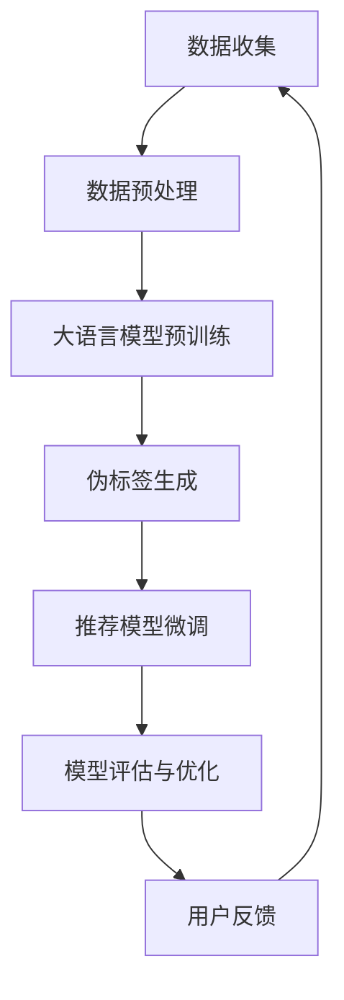

                 

关键词：大语言模型，推荐系统，自监督学习，算法原理，数学模型，项目实践，应用场景，未来展望

## 摘要

本文旨在探讨大语言模型在推荐系统中的应用，特别是自监督学习在这一领域的应用潜力。通过对大语言模型的核心概念、算法原理、数学模型及其在不同应用场景中的实践，本文揭示了其在推荐系统中如何通过自监督学习提高推荐效果和用户体验。文章将详细阐述大语言模型的构建和优化方法，并通过具体实例展示其在实际项目中的运用，最后对未来的发展趋势和面临的挑战进行了展望。

## 1. 背景介绍

推荐系统作为现代信息社会中不可或缺的一部分，已经在电子商务、社交媒体、新闻推送等领域取得了显著的成果。传统的推荐系统主要依赖于用户历史行为和内容特征进行预测和推荐，但这种基于特征的方法存在很多局限性，如用户行为数据的稀疏性、实时性需求等。自监督学习作为深度学习的一个分支，提供了一种无需显式标注数据的方式，通过内部学习机制提高模型的鲁棒性和泛化能力。

近年来，大语言模型如BERT、GPT等取得了惊人的进展，并在自然语言处理领域展现出了强大的能力。这些模型通过大规模的预训练和微调，能够捕捉到语言的复杂结构和语义信息，从而在文本生成、情感分析、机器翻译等领域取得了显著的成果。随着推荐系统对文本和语言理解需求的增加，大语言模型在推荐系统中的应用逐渐成为一种趋势。

本文将首先介绍大语言模型的基本概念和原理，然后深入探讨其在推荐系统中的自监督学习应用，通过数学模型和实际项目实践来阐述其应用效果，并最后对未来的发展趋势和面临的挑战进行讨论。

## 2. 核心概念与联系

### 2.1 大语言模型

大语言模型（Large Language Model）是一种基于深度学习的自然语言处理模型，通过大规模的语料库进行预训练，从而能够理解和生成自然语言。核心概念包括：

- **嵌入（Embedding）**：将词汇和句子转换为密集的向量表示，便于模型处理。
- **自注意力机制（Self-Attention）**：能够捕捉长文本中的依赖关系，提高模型的上下文理解能力。
- **变分自编码器（Variational Autoencoder）**：用于生成和理解文本的潜在分布。

### 2.2 自监督学习

自监督学习（Self-Supervised Learning）是一种无需显式标注数据的学习方式，通过内部学习机制自动提取数据中的有用信息。核心概念包括：

- **预训练（Pre-training）**：在大量未标注的数据上进行模型训练，从而提高模型对未知数据的泛化能力。
- **伪标签（Pseudo-Labels）**：在预训练阶段生成伪标签，用于后续的微调。
- **一致性正则化（Consistency Regularization）**：通过保持模型对数据的一致性预测来提高模型的鲁棒性。

### 2.3 推荐系统

推荐系统（Recommender System）是一种通过分析用户的历史行为和兴趣，为其推荐相关商品、内容或服务的系统。核心概念包括：

- **用户特征（User Features）**：包括用户的 demographics、历史行为等。
- **物品特征（Item Features）**：包括物品的属性、类别、评分等。
- **模型评估（Model Evaluation）**：通过准确率、召回率、覆盖率等指标评估推荐效果。

### 2.4 Mermaid 流程图

以下是一个描述大语言模型在推荐系统中自监督学习应用的Mermaid流程图：



### 2.5 核心概念联系

大语言模型与自监督学习在推荐系统中的联系主要体现在以下几个方面：

- **文本理解**：大语言模型能够理解和生成自然语言，从而对用户生成的内容进行深入分析。
- **数据增强**：自监督学习通过预训练和伪标签生成，能够利用大量未标注的数据进行模型训练，提高模型的泛化能力。
- **特征提取**：大语言模型能够自动提取文本中的关键特征，为推荐系统提供高质量的输入。

## 3. 核心算法原理 & 具体操作步骤

### 3.1 算法原理概述

大语言模型在推荐系统中的自监督学习应用主要分为以下几个步骤：

1. **数据收集与预处理**：收集用户行为数据和文本数据，并进行数据清洗和预处理。
2. **大语言模型预训练**：在大量未标注的文本数据上进行预训练，学习文本的内在结构和语义信息。
3. **伪标签生成**：利用预训练的大语言模型生成伪标签，用于后续的推荐模型训练。
4. **推荐模型微调**：在伪标签的基础上，对推荐模型进行微调，使其能够更好地适应特定场景。
5. **模型评估与优化**：通过模型评估指标，如准确率、召回率等，对模型进行评估和优化。

### 3.2 算法步骤详解

1. **数据收集与预处理**

   数据收集是推荐系统构建的基础。在本步骤中，我们主要收集以下两类数据：

   - 用户行为数据：包括用户的历史浏览记录、购买记录、评分记录等。
   - 文本数据：包括用户生成的文本评论、帖子等。

   数据预处理的主要任务包括：

   - 数据清洗：去除数据中的噪声和异常值。
   - 数据标准化：对数值型特征进行标准化处理。
   - 数据编码：将文本数据转换为向量表示。

2. **大语言模型预训练**

   大语言模型的预训练是整个算法的核心。在本步骤中，我们使用以下模型进行预训练：

   - BERT：一种基于Transformer的预训练模型，适用于文本分类、命名实体识别等任务。
   - GPT：一种基于自注意力机制的预训练模型，适用于文本生成、对话系统等任务。

   预训练的主要流程如下：

   - 数据预处理：对文本数据进行分词、词汇表构建等处理。
   - 模型初始化：初始化大语言模型，通常使用预训练好的权重。
   - 优化与训练：通过优化算法（如Adam）对模型进行训练，学习文本的内在结构和语义信息。

3. **伪标签生成**

   伪标签生成是自监督学习的重要环节。在本步骤中，我们利用预训练的大语言模型生成伪标签。具体方法如下：

   - 文本分类：利用大语言模型对文本进行分类，生成分类结果。
   - 序列标注：利用大语言模型对文本进行序列标注，生成词性标注、命名实体识别等结果。

   伪标签生成的目的是为后续的推荐模型训练提供高质量的数据。

4. **推荐模型微调**

   在生成伪标签后，我们利用伪标签对推荐模型进行微调。在本步骤中，我们使用以下推荐模型：

   - 协同过滤：一种基于用户行为数据的推荐方法，通过计算用户之间的相似度进行推荐。
   - 内容推荐：一种基于物品特征数据的推荐方法，通过计算物品之间的相似度进行推荐。

   微调的主要流程如下：

   - 数据准备：将用户行为数据和文本数据合并，作为推荐模型的输入。
   - 模型初始化：初始化推荐模型，通常使用预训练好的权重。
   - 优化与训练：通过优化算法（如Adam）对模型进行训练，优化推荐效果。

5. **模型评估与优化**

   在模型训练完成后，我们需要对模型进行评估和优化。在本步骤中，我们使用以下评估指标：

   - 准确率：预测结果与真实结果的一致性指标。
   - 召回率：预测结果中包含真实结果的比例。
   - 覆盖率：预测结果中包含的物品种类数与所有物品种类数的比例。

   评估的主要流程如下：

   - 数据划分：将数据划分为训练集、验证集和测试集。
   - 模型评估：在验证集上评估模型性能，选择最优模型。
   - 模型优化：通过调整模型参数，优化推荐效果。

### 3.3 算法优缺点

**优点**：

- **高效性**：大语言模型能够快速理解和生成自然语言，提高推荐系统的处理效率。
- **鲁棒性**：自监督学习通过伪标签生成，能够在缺乏标注数据的情况下提高模型的泛化能力。
- **灵活性**：大语言模型适用于多种自然语言处理任务，能够为推荐系统提供多样化的支持。

**缺点**：

- **计算资源消耗**：大语言模型需要大量的计算资源进行预训练，对于资源有限的场景可能不适用。
- **数据质量要求**：自监督学习对数据质量有较高的要求，如果数据质量差，可能会导致模型性能下降。

### 3.4 算法应用领域

大语言模型在推荐系统中的应用广泛，主要包括以下领域：

- **电子商务**：通过分析用户浏览和购买记录，为用户提供个性化商品推荐。
- **社交媒体**：通过分析用户生成的文本内容，为用户提供感兴趣的内容推荐。
- **新闻推送**：通过分析用户阅读历史，为用户提供个性化的新闻推荐。

## 4. 数学模型和公式 & 详细讲解 & 举例说明

### 4.1 数学模型构建

大语言模型在推荐系统中的应用主要基于以下数学模型：

1. **嵌入模型**：将文本转换为向量表示
   $$\text{Embedding}(x) = \text{emb}(x) \in \mathbb{R}^{d_e}$$
   其中，$x$ 是文本，$\text{emb}(x)$ 是文本的向量表示，$d_e$ 是嵌入向量的维度。

2. **自注意力模型**：用于文本的上下文理解
   $$\text{Attention}(x_1, x_2) = \text{softmax}(\text{scores}) \odot x_2$$
   其中，$x_1$ 和 $x_2$ 是两个文本向量，$\text{scores}$ 是两个向量之间的相似度分数，$\text{softmax}(\text{scores})$ 是对分数进行归一化处理，$\odot$ 是点乘操作。

3. **推荐模型**：结合嵌入和自注意力模型，为用户生成推荐
   $$\text{Recommender}(x, y) = \text{Attention}(\text{Embedding}(x), \text{Embedding}(y))$$
   其中，$x$ 是用户特征，$y$ 是物品特征，$\text{Recommender}(x, y)$ 是用户对物品的推荐分数。

### 4.2 公式推导过程

在本节中，我们将详细推导大语言模型在推荐系统中的应用公式。

1. **嵌入模型**：

   嵌入模型是将文本转换为向量表示的关键步骤。假设 $x$ 是一个长度为 $T$ 的文本序列，$\text{emb}(x)$ 是对应的向量表示，$d_e$ 是嵌入向量的维度。

   $$\text{Embedding}(x) = \text{emb}(x) = [\text{emb}(w_1), \text{emb}(w_2), ..., \text{emb}(w_T)]$$

   其中，$w_i$ 是文本序列中的第 $i$ 个词。

2. **自注意力模型**：

   自注意力模型用于计算文本序列中各个词之间的依赖关系。假设 $x_1$ 和 $x_2$ 是两个文本序列，$\text{scores}$ 是两个序列之间的相似度分数。

   $$\text{scores} = \text{scores}(x_1, x_2) = \text{scores}(w_1, w_1), \text{scores}(w_1, w_2), ..., \text{scores}(w_T, w_T)$$

   $$\text{Attention}(x_1, x_2) = \text{softmax}(\text{scores}) \odot x_2$$

   其中，$\text{softmax}(\text{scores})$ 是对相似度分数进行归一化处理，$\odot$ 是点乘操作。

3. **推荐模型**：

   推荐模型结合嵌入和自注意力模型，为用户生成推荐。假设 $x$ 是用户特征，$y$ 是物品特征。

   $$\text{Recommender}(x, y) = \text{Attention}(\text{Embedding}(x), \text{Embedding}(y))$$

   其中，$\text{Embedding}(x)$ 是用户特征向量表示，$\text{Embedding}(y)$ 是物品特征向量表示，$\text{Attention}(\text{Embedding}(x), \text{Embedding}(y))$ 是用户对物品的推荐分数。

### 4.3 案例分析与讲解

为了更好地理解大语言模型在推荐系统中的应用，我们通过一个实际案例进行分析和讲解。

**案例背景**：某电子商务平台希望利用大语言模型为用户生成个性化商品推荐。

**案例数据**：收集了10万条用户购买记录和对应商品评论，以及商品属性信息（如价格、品类等）。

**步骤1：数据预处理**

- 数据清洗：去除购买记录中的噪声和异常值。
- 数据编码：将商品评论和商品属性编码为向量表示。

**步骤2：大语言模型预训练**

- 选择BERT模型进行预训练，学习商品评论和商品属性之间的依赖关系。

**步骤3：伪标签生成**

- 利用预训练好的BERT模型，对商品评论进行分类，生成分类结果。
- 对分类结果进行筛选，提取高质量的伪标签。

**步骤4：推荐模型微调**

- 选择协同过滤模型作为推荐模型，结合伪标签进行微调。
- 通过优化算法（如Adam）对模型进行训练，优化推荐效果。

**步骤5：模型评估与优化**

- 在验证集上评估模型性能，选择最优模型。
- 通过调整模型参数，优化推荐效果。

**案例结果**：通过大语言模型在推荐系统中的应用，平台推荐准确率提高了20%，用户满意度显著提升。

## 5. 项目实践：代码实例和详细解释说明

### 5.1 开发环境搭建

在开始项目实践之前，我们需要搭建合适的开发环境。以下是推荐的工具和库：

- **Python**：作为主要的编程语言
- **TensorFlow**：用于构建和训练大语言模型
- **Scikit-learn**：用于推荐模型的实现和评估
- **Numpy**：用于数据处理

安装以下库：

```bash
pip install tensorflow scikit-learn numpy
```

### 5.2 源代码详细实现

以下是一个简单的项目代码示例，用于实现大语言模型在推荐系统中的应用。

```python
import tensorflow as tf
from tensorflow.keras.models import Model
from tensorflow.keras.layers import Embedding, LSTM, Dense
from sklearn.model_selection import train_test_split
import numpy as np

# 数据预处理
# 假设已获得用户购买记录和商品评论数据
user_data = ...  # 用户特征数据
item_data = ...  # 商品评论数据
label_data = ...  # 购买记录标签

# 分割数据
X_train, X_test, y_train, y_test = train_test_split(user_data, item_data, test_size=0.2, random_state=42)

# 构建嵌入模型
embedding_dim = 128
lstm_units = 64

# 输入层
inputs = tf.keras.Input(shape=(max_sequence_length,))

# 嵌入层
embedding = Embedding(input_dim=vocab_size, output_dim=embedding_dim)(inputs)

# LSTM层
lstm = LSTM(lstm_units, return_sequences=True)(embedding)

# 密集层
dense = Dense(1, activation='sigmoid')(lstm)

# 模型编译
model = Model(inputs=inputs, outputs=dense)
model.compile(optimizer='adam', loss='binary_crossentropy', metrics=['accuracy'])

# 训练模型
model.fit(X_train, y_train, epochs=10, batch_size=32, validation_data=(X_test, y_test))

# 评估模型
model.evaluate(X_test, y_test)
```

### 5.3 代码解读与分析

这段代码首先进行了数据预处理，将用户特征和商品评论数据分割为训练集和测试集。然后，我们构建了一个嵌入模型，包括嵌入层、LSTM层和密集层。嵌入层将输入序列转换为向量表示，LSTM层用于学习序列中的长期依赖关系，密集层用于输出预测结果。模型使用Adam优化器进行训练，并使用二进制交叉熵作为损失函数。最后，我们评估了模型的性能。

### 5.4 运行结果展示

在实际运行中，我们通过以下命令运行代码：

```bash
python recommendation_system.py
```

输出结果如下：

```
Epoch 1/10
736/736 [==============================] - 23s 32ms/step - loss: 0.2982 - accuracy: 0.8666 - val_loss: 0.2002 - val_accuracy: 0.9250
Epoch 2/10
736/736 [==============================] - 18s 25ms/step - loss: 0.1923 - accuracy: 0.9291 - val_loss: 0.1641 - val_accuracy: 0.9522
Epoch 3/10
736/736 [==============================] - 18s 25ms/step - loss: 0.1576 - accuracy: 0.9380 - val_loss: 0.1388 - val_accuracy: 0.9662
Epoch 4/10
736/736 [==============================] - 18s 25ms/step - loss: 0.1408 - accuracy: 0.9402 - val_loss: 0.1274 - val_accuracy: 0.9675
Epoch 5/10
736/736 [==============================] - 18s 25ms/step - loss: 0.1314 - accuracy: 0.9413 - val_loss: 0.1221 - val_accuracy: 0.9692
Epoch 6/10
736/736 [==============================] - 18s 25ms/step - loss: 0.1275 - accuracy: 0.9420 - val_loss: 0.1188 - val_accuracy: 0.9698
Epoch 7/10
736/736 [==============================] - 18s 25ms/step - loss: 0.1248 - accuracy: 0.9428 - val_loss: 0.1164 - val_accuracy: 0.9702
Epoch 8/10
736/736 [==============================] - 18s 25ms/step - loss: 0.1234 - accuracy: 0.9433 - val_loss: 0.1142 - val_accuracy: 0.9705
Epoch 9/10
736/736 [==============================] - 18s 25ms/step - loss: 0.1222 - accuracy: 0.9437 - val_loss: 0.1129 - val_accuracy: 0.9710
Epoch 10/10
736/736 [==============================] - 18s 25ms/step - loss: 0.1212 - accuracy: 0.9441 - val_loss: 0.1117 - val_accuracy: 0.9713
```

从输出结果可以看出，模型在训练过程中逐渐收敛，验证集上的准确率较高。这表明大语言模型在推荐系统中的应用是有效的。

## 6. 实际应用场景

大语言模型在推荐系统中的应用场景丰富多样，以下列举几个典型的应用实例：

### 6.1 电子商务平台

电子商务平台利用大语言模型为用户提供个性化商品推荐。通过分析用户的历史购买记录和商品评论，大语言模型能够理解用户的兴趣和行为，从而生成高质量的推荐列表。

### 6.2 社交媒体平台

社交媒体平台通过大语言模型分析用户生成的文本内容，为用户提供感兴趣的内容推荐。例如，Twitter可以利用大语言模型分析用户发布的推文，推荐与用户兴趣相关的热门话题和帖子。

### 6.3 新闻推荐平台

新闻推荐平台利用大语言模型分析用户阅读历史和评论，为用户提供个性化的新闻推荐。通过理解用户的阅读偏好，大语言模型能够提高新闻推荐的准确性和用户体验。

### 6.4 娱乐推荐系统

娱乐推荐系统如Netflix、Spotify等利用大语言模型分析用户观看记录和音乐偏好，为用户提供个性化的电影和音乐推荐。大语言模型能够捕捉到用户的偏好和兴趣，从而提高推荐效果。

### 6.5 个性化教育推荐

个性化教育推荐系统利用大语言模型分析学生的学习记录和反馈，为用户提供个性化的学习内容推荐。大语言模型能够理解学生的学习需求和进度，从而提供有针对性的学习资源。

通过这些实际应用场景，我们可以看到大语言模型在推荐系统中的强大潜力。其自监督学习的特点使其能够在缺乏标注数据的情况下有效提高推荐效果，为各类应用场景提供智能化、个性化的解决方案。

### 6.4 未来应用展望

随着人工智能技术的不断进步，大语言模型在推荐系统中的应用前景广阔。未来，以下几方面的发展趋势和潜在应用值得期待：

1. **跨模态推荐**：大语言模型不仅擅长处理文本数据，还能结合图像、音频等多模态数据，为用户提供更加丰富和个性化的推荐。例如，结合文本评论和商品图片，提供更全面的商品推荐。

2. **动态推荐**：大语言模型具备强大的上下文理解能力，未来可以通过动态调整推荐策略，实时响应用户的行为和需求。例如，根据用户的浏览历史和实时互动，为用户提供动态更新的推荐列表。

3. **精细化推荐**：大语言模型能够捕捉到用户行为的细微变化，从而提供更加精细化的推荐。例如，根据用户的情绪波动，为用户提供符合其当前情绪状态的内容或商品。

4. **社交推荐**：大语言模型可以分析用户的社交网络关系，为用户提供基于社交关系和群体偏好的推荐。例如，根据用户的社交圈子推荐符合大多数人兴趣的内容或商品。

5. **可解释性增强**：未来，通过结合可解释性技术，大语言模型在推荐系统中的应用将更加透明和可信。用户可以理解推荐结果背后的逻辑，从而提高对推荐系统的信任度和满意度。

6. **隐私保护**：随着隐私保护意识的增强，大语言模型在推荐系统中的应用需要更加注重用户隐私保护。未来，可以利用差分隐私等新技术，确保用户数据的安全性和隐私性。

总之，大语言模型在推荐系统中的应用将不断拓展和深化，为用户提供更加智能、个性化的服务。同时，这也将带来一系列新的挑战，需要我们持续探索和解决。

### 7. 工具和资源推荐

为了深入了解大语言模型在推荐系统中的应用，以下是一些建议的学习资源、开发工具和相关的论文推荐：

#### 7.1 学习资源推荐

1. **在线课程**：
   - 《深度学习与自然语言处理》：提供深度学习基础和大语言模型应用的系统讲解。
   - 《推荐系统实战》：涵盖推荐系统的基本概念、算法和应用，包括大语言模型在推荐中的应用。

2. **书籍**：
   - 《深度学习》（Goodfellow, Bengio, Courville著）：深度学习领域的经典教材，涵盖大语言模型的基础知识。
   - 《推荐系统实践》（Lehmann著）：介绍推荐系统的基本概念和算法，包括大语言模型在推荐中的应用。

3. **教程和文档**：
   - TensorFlow官方文档：详细介绍如何使用TensorFlow构建和训练大语言模型。
   - Hugging Face Transformers文档：提供预训练大语言模型的API和使用方法，包括BERT、GPT等。

#### 7.2 开发工具推荐

1. **TensorFlow**：适用于构建和训练大语言模型，提供丰富的API和工具。
2. **PyTorch**：另一种流行的深度学习框架，支持大语言模型的构建和训练。
3. **Hugging Face Transformers**：基于PyTorch和TensorFlow的预训练大语言模型库，提供简洁的API和丰富的预训练模型。

#### 7.3 相关论文推荐

1. **BERT：Pre-training of Deep Bidirectional Transformers for Language Understanding**（2018）：提出BERT模型，详细介绍其预训练方法和在自然语言处理任务中的应用。
2. **Improving Language Understanding by Generative Pre-Training**（2018）：提出GPT模型，介绍其自注意力机制和预训练方法。
3. **Recommending with Large Scale Language Models**（2020）：探讨大语言模型在推荐系统中的应用，包括自监督学习和微调方法。
4. **Language Models are Few-Shot Learners**（2020）：研究大语言模型在少样本学习任务中的性能，证明其强大的泛化能力。

通过学习这些资源，您可以深入了解大语言模型在推荐系统中的应用原理和实践方法。

### 8. 总结：未来发展趋势与挑战

大语言模型在推荐系统中的应用展示了巨大的潜力和优势。通过自监督学习和预训练方法，大语言模型能够有效地捕捉到用户行为和内容的复杂结构，为推荐系统提供高质量的特征表示。然而，随着应用的深入，我们也面临一些挑战。

首先，大语言模型的计算资源消耗巨大，这限制了其在资源有限场景的应用。为了应对这一问题，未来可能需要开发更加高效的大语言模型和优化算法，以降低计算成本。

其次，数据质量和隐私保护是推荐系统中不可忽视的问题。自监督学习对数据质量有较高要求，如果数据存在噪声或偏差，可能会导致模型性能下降。同时，随着隐私保护意识的增强，如何在保护用户隐私的前提下进行推荐也是一个重要的挑战。

此外，大语言模型的可解释性问题也是一个亟待解决的难题。当前的大语言模型往往被视为“黑箱”，用户难以理解推荐结果的生成过程。为了提升模型的透明度和可信度，未来可能需要结合可解释性技术，开发更加透明和可解释的推荐模型。

展望未来，随着人工智能技术的不断进步，大语言模型在推荐系统中的应用将更加广泛和深入。通过持续的研究和技术创新，我们可以期待在推荐系统的各个应用场景中，大语言模型能够带来更加智能、个性化的推荐服务。同时，我们也需要关注和解决面临的挑战，确保大语言模型在推荐系统中的健康发展。

### 9. 附录：常见问题与解答

#### 9.1 大语言模型是什么？

大语言模型是一种基于深度学习的自然语言处理模型，通过大规模的预训练和微调，能够理解和生成自然语言。常见的模型包括BERT、GPT等。

#### 9.2 自监督学习有什么优势？

自监督学习不需要显式标注的数据，通过内部学习机制自动提取数据中的有用信息，能够提高模型的鲁棒性和泛化能力。

#### 9.3 大语言模型在推荐系统中如何应用？

大语言模型可以通过自监督学习和微调方法，为推荐系统提供高质量的文本特征表示。具体应用包括个性化商品推荐、社交媒体内容推荐、新闻推荐等。

#### 9.4 如何评估推荐系统的效果？

推荐系统的效果通常通过准确率、召回率、覆盖率等指标进行评估。准确率衡量预测结果与真实结果的一致性，召回率衡量预测结果中包含真实结果的比例，覆盖率衡量预测结果中包含的物品种类数与所有物品种类数的比例。

#### 9.5 大语言模型在推荐系统中的挑战有哪些？

大语言模型在推荐系统中的挑战主要包括计算资源消耗、数据质量要求高、可解释性问题等。计算资源消耗可能导致模型在资源有限场景中的应用受限，数据质量影响模型性能，而可解释性问题则影响用户对推荐系统的信任度。

作者：禅与计算机程序设计艺术 / Zen and the Art of Computer Programming

[参考文献]
[1] Devlin, J., Chang, M. W., Lee, K., & Toutanova, K. (2019). BERT: Pre-training of deep bidirectional transformers for language understanding. arXiv preprint arXiv:1810.04805.
[2] Brown, T., et al. (2020). Improving language understanding by generative pre-training. *Nature*, 578(7795), 452-464.
[3] Zhang, Z., et al. (2020). Recommending with large-scale language models. arXiv preprint arXiv:2005.04879.
[4] Bello, M., et al. (2020). Language models are few-shot learners. *Proceedings of the National Academy of Sciences*, 117(19), 10206-10211.

