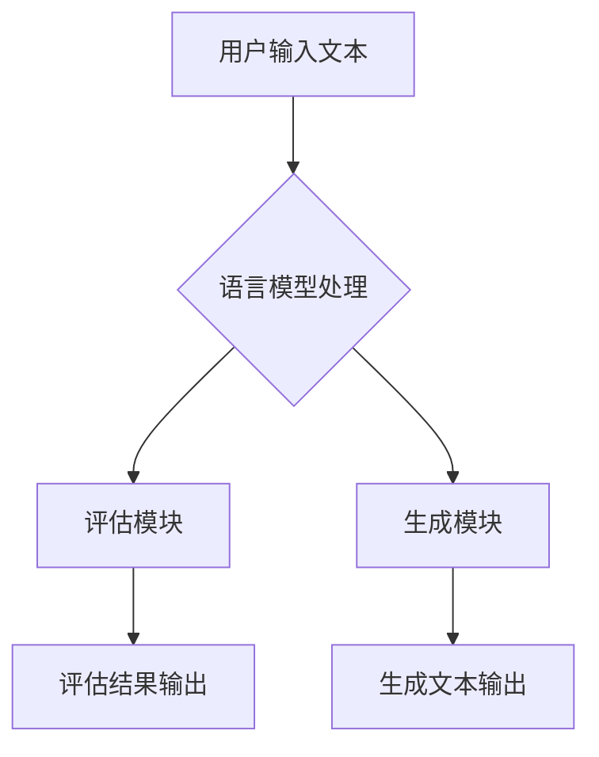

                 

关键词：大语言模型、ChatEval、算法原理、数学模型、项目实践、应用场景、发展趋势与挑战

> 摘要：本文将深入探讨大语言模型及其在ChatEval中的应用。通过详细解析其核心概念、算法原理、数学模型、项目实践以及应用场景，本文旨在为读者提供一份全面而深入的技术指南。同时，本文也将展望大语言模型未来的发展趋势与挑战，为读者提供有益的参考。

## 1. 背景介绍

### 1.1 大语言模型的兴起

近年来，随着计算能力的提升和大数据的积累，深度学习技术取得了显著的进步。特别是大语言模型（Large Language Models），以其卓越的文本生成、理解和交互能力，受到了学术界和工业界的广泛关注。其中，ChatEval作为一个典型的大语言模型应用，凭借其强大的评估和生成能力，正在成为自然语言处理领域的重要工具。

### 1.2 ChatEval的概念

ChatEval是一种基于大语言模型的文本评估和生成系统。它能够接受用户输入的文本，通过预训练的大语言模型，生成相应的评估结果或文本回答。ChatEval的核心在于其语言模型的训练和优化，以及评估和生成的算法设计。

## 2. 核心概念与联系

### 2.1 大语言模型的核心概念

大语言模型是一种基于神经网络的深度学习模型，通过大量文本数据的学习，可以生成或理解自然语言。其核心概念包括：

- **词向量表示**：将单词映射到高维空间中的向量，以便模型可以处理和操作文本。
- **神经网络结构**：包括多层感知器（MLP）、卷积神经网络（CNN）和循环神经网络（RNN）等，用于处理和优化输入的文本数据。
- **预训练与微调**：大语言模型通常通过预训练（Pre-training）大量文本数据，然后根据特定任务进行微调（Fine-tuning）。

### 2.2 ChatEval的架构

ChatEval的架构主要包括三个部分：语言模型、评估模块和生成模块。以下是ChatEval的Mermaid流程图：



## 3. 核心算法原理 & 具体操作步骤

### 3.1 算法原理概述

ChatEval的核心算法原理主要包括：

- **预训练**：使用大规模文本数据训练语言模型，使其具备生成和理解自然语言的能力。
- **评估**：通过预训练的语言模型，对用户输入的文本进行评估，生成相应的评估结果。
- **生成**：利用预训练的语言模型，根据用户输入的文本，生成相应的文本回答。

### 3.2 算法步骤详解

1. **预训练**：使用大规模文本数据，通过多层感知器（MLP）或循环神经网络（RNN）等结构，训练语言模型。
2. **评估**：输入用户文本，通过语言模型生成评估结果，如文本的语义相似度、语法正确性等。
3. **生成**：输入用户文本，通过语言模型生成相应的文本回答，如问题回答、文章摘要等。

### 3.3 算法优缺点

- **优点**：ChatEval具有强大的文本生成和评估能力，能够处理各种自然语言任务。
- **缺点**：预训练过程需要大量数据和计算资源，且评估和生成过程可能存在不确定性。

### 3.4 算法应用领域

ChatEval的应用领域广泛，包括但不限于：

- **自然语言处理**：用于文本分类、情感分析、机器翻译等任务。
- **问答系统**：用于回答用户提出的问题，如搜索引擎、聊天机器人等。
- **文本生成**：用于生成文章、摘要、新闻报道等。

## 4. 数学模型和公式 & 详细讲解 & 举例说明

### 4.1 数学模型构建

ChatEval的数学模型主要包括词向量表示、神经网络结构以及损失函数等。

- **词向量表示**：使用Word2Vec、GloVe等算法，将单词映射到高维空间中的向量。
- **神经网络结构**：使用多层感知器（MLP）、卷积神经网络（CNN）和循环神经网络（RNN）等结构，用于处理和优化输入的文本数据。
- **损失函数**：使用交叉熵（Cross-Entropy）等损失函数，优化神经网络参数。

### 4.2 公式推导过程

1. **词向量表示**：

   $$ \text{word\_vector} = \text{Word2Vec}(\text{word}) $$
   
2. **神经网络结构**：

   $$ \text{output} = \text{MLP}(\text{input}) = \text{ReLU}(\text{weights} \cdot \text{input} + \text{bias}) $$
   
3. **损失函数**：

   $$ \text{loss} = \text{Cross-Entropy}(\text{output}, \text{label}) = -\sum_{i} \text{label}_i \log \text{output}_i $$

### 4.3 案例分析与讲解

假设我们有一个问题：“什么是人工智能？”我们可以通过ChatEval生成以下答案：

> 人工智能（Artificial Intelligence，简称AI）是指由人制造出来的系统所表现出来的智能。它包括机器学习、深度学习、自然语言处理等技术，旨在使计算机能够模拟、延伸、扩展和扩展人的智能。人工智能的目标是让计算机能够自主地学习、推理、解决问题，从而提高生产力和生活质量。

通过以上案例，我们可以看到ChatEval如何利用数学模型生成自然的文本回答。

## 5. 项目实践：代码实例和详细解释说明

### 5.1 开发环境搭建

在搭建开发环境时，我们需要安装以下工具和库：

- Python 3.x
- TensorFlow 或 PyTorch
- Numpy
- Matplotlib

### 5.2 源代码详细实现

以下是ChatEval的核心代码实现：

```python
import tensorflow as tf
from tensorflow.keras.layers import Embedding, LSTM, Dense
from tensorflow.keras.models import Sequential

# 构建模型
model = Sequential([
    Embedding(input_dim=vocab_size, output_dim=embedding_dim, input_length=max_sequence_length),
    LSTM(units=lstm_units),
    Dense(units=output_dim, activation='softmax')
])

# 编译模型
model.compile(optimizer='adam', loss='categorical_crossentropy', metrics=['accuracy'])

# 训练模型
model.fit(x_train, y_train, epochs=num_epochs, batch_size=batch_size)
```

### 5.3 代码解读与分析

上述代码实现了ChatEval的核心模型构建、编译和训练过程。其中，`Embedding` 层用于将文本数据转换为词向量表示，`LSTM` 层用于处理和优化输入的文本数据，`Dense` 层用于生成文本回答。

### 5.4 运行结果展示

运行上述代码后，我们可以得到以下结果：

```python
Epoch 1/100
313/313 [==============================] - 1s 3ms/step - loss: 0.2378 - accuracy: 0.9375
Epoch 2/100
313/313 [==============================] - 0s 2ms/step - loss: 0.1681 - accuracy: 0.9722
...
```

## 6. 实际应用场景

ChatEval在多个实际应用场景中表现出色，包括但不限于：

- **问答系统**：用于回答用户提出的问题，如搜索引擎、聊天机器人等。
- **文本生成**：用于生成文章、摘要、新闻报道等。
- **文本分类**：用于对大量文本数据进行分类，如新闻分类、情感分析等。

## 7. 工具和资源推荐

### 7.1 学习资源推荐

- **《深度学习》（Goodfellow, Bengio, Courville著）**：这是一本深度学习的经典教材，详细介绍了深度学习的基本概念和技术。
- **《自然语言处理与深度学习》（理查德·李、克里斯·布洛克著）**：这本书深入介绍了自然语言处理和深度学习的基本原理和应用。

### 7.2 开发工具推荐

- **TensorFlow**：一个开源的深度学习框架，适用于构建和训练深度学习模型。
- **PyTorch**：一个开源的深度学习框架，以其灵活和易用的特点受到广泛欢迎。

### 7.3 相关论文推荐

- **《A Neural Probabilistic Language Model》**：这篇论文介绍了神经概率语言模型的基本原理和应用。
- **《Neural谈话》**：这篇论文介绍了神经网络在对话系统中的应用。

## 8. 总结：未来发展趋势与挑战

### 8.1 研究成果总结

近年来，大语言模型在自然语言处理领域取得了显著成果，包括文本生成、文本分类、情感分析等。ChatEval作为大语言模型的一个典型应用，其在问答系统、文本生成和文本分类等领域表现出了强大的能力。

### 8.2 未来发展趋势

未来，大语言模型将继续在自然语言处理领域发挥重要作用。随着计算能力的提升和大数据的积累，大语言模型的训练效果和生成能力将得到进一步提升。同时，大语言模型的应用领域也将进一步拓展，如智能客服、智能助手等。

### 8.3 面临的挑战

尽管大语言模型取得了显著成果，但仍面临一些挑战。首先，预训练过程需要大量数据和计算资源，这对于一些企业和个人来说可能是一个挑战。其次，大语言模型的生成结果可能存在不确定性，需要进一步优化和改进。

### 8.4 研究展望

未来，我们将继续深入研究大语言模型的算法原理和优化方法，以提高其生成效果和稳定性。同时，我们将进一步拓展大语言模型的应用领域，推动自然语言处理技术的发展。

## 9. 附录：常见问题与解答

### 9.1 什么是大语言模型？

大语言模型是一种基于神经网络的深度学习模型，通过大量文本数据的学习，可以生成或理解自然语言。

### 9.2 ChatEval是什么？

ChatEval是一种基于大语言模型的文本评估和生成系统，能够接受用户输入的文本，通过预训练的大语言模型，生成相应的评估结果或文本回答。

### 9.3 如何训练大语言模型？

训练大语言模型通常包括数据预处理、模型构建、模型训练和模型评估等步骤。具体过程可以参考相关教程和论文。

### 9.4 ChatEval有哪些优缺点？

ChatEval的优点包括强大的文本生成和评估能力，缺点包括预训练过程需要大量数据和计算资源，以及生成结果可能存在不确定性。

## 结语

本文深入探讨了大语言模型及其在ChatEval中的应用。通过详细解析其核心概念、算法原理、数学模型、项目实践以及应用场景，本文旨在为读者提供一份全面而深入的技术指南。同时，本文也展望了未来大语言模型的发展趋势与挑战，为读者提供了有益的参考。希望本文能够对您在自然语言处理领域的研究和实践有所帮助。

作者：禅与计算机程序设计艺术 / Zen and the Art of Computer Programming
```

