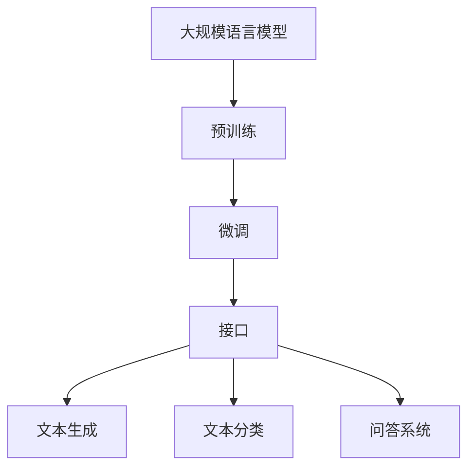

                 

关键词：大语言模型、ChatGPT、接口、扩展功能、应用详解

> 摘要：本文将深入探讨大语言模型中的ChatGPT接口及其扩展功能，从背景介绍、核心概念、算法原理、数学模型、项目实践、实际应用、未来展望等多个维度进行详细解析，帮助读者全面了解和掌握ChatGPT在人工智能领域的应用与潜力。

## 1. 背景介绍

大语言模型作为人工智能的重要分支，近年来取得了显著的进展。从最初的统计语言模型到基于神经网络的深度学习模型，语言模型的发展极大地推动了自然语言处理（NLP）领域的研究和应用。ChatGPT作为OpenAI推出的一种基于Transformer架构的大规模语言模型，具有强大的语言理解和生成能力，引起了广泛关注。

ChatGPT的推出标志着大语言模型技术进入了一个新的阶段，其背后依赖于大规模数据集的训练和优化，使得模型能够更好地理解和生成自然语言。同时，ChatGPT的接口设计也使得开发者能够方便地将其集成到各种应用场景中，从而推动了NLP技术的发展和应用。

本文旨在通过详细介绍ChatGPT的接口与扩展功能，帮助读者深入理解大语言模型的技术原理和应用场景，探讨其在未来可能的发展方向和面临的挑战。

## 2. 核心概念与联系

### 2.1 大语言模型的基本概念

大语言模型是指利用大规模数据进行训练，能够对自然语言进行建模的神经网络模型。这些模型通常采用深度学习技术，尤其是基于注意力机制的Transformer架构，具有处理长文本序列的能力。

### 2.2 ChatGPT的基本概念

ChatGPT是OpenAI推出的一种基于Transformer架构的大规模语言模型，具有强大的语言理解和生成能力。ChatGPT采用了预训练加微调（PTM）的方法，先在大量文本数据上进行预训练，然后针对特定任务进行微调，以达到更好的性能。

### 2.3 ChatGPT与接口的关系

ChatGPT的接口是其应用的关键组成部分。通过接口，开发者可以方便地与ChatGPT模型进行交互，实现对自然语言的处理和生成。接口提供了丰富的功能，如文本生成、文本分类、问答系统等，使得ChatGPT能够在各种应用场景中发挥作用。

### 2.4 Mermaid流程图展示



## 3. 核心算法原理 & 具体操作步骤

### 3.1 算法原理概述

ChatGPT基于Transformer架构，通过自注意力机制（Self-Attention）和多头注意力（Multi-Head Attention）对输入的文本序列进行建模。模型采用多层结构，每一层都能对输入序列进行更深层次的理解和表示。

### 3.2 算法步骤详解

#### 3.2.1 预训练阶段

1. 数据预处理：将原始文本数据清洗、分词、编码成向量。
2. 建立模型：初始化Transformer模型，包括自注意力模块、前馈神经网络等。
3. 训练模型：使用大规模文本数据进行预训练，优化模型参数。

#### 3.2.2 微调阶段

1. 数据准备：收集与特定任务相关的数据集。
2. 模型调整：对预训练模型进行微调，使其适应特定任务。
3. 模型评估：使用验证集评估微调后的模型性能。

### 3.3 算法优缺点

#### 优点：

- 强大的语言理解能力：能够处理长文本序列，对自然语言有深刻理解。
- 适应性：通过预训练和微调，可以适应多种不同任务。
- 高效性：基于Transformer架构，计算效率高。

#### 缺点：

- 计算资源需求大：预训练和微调过程需要大量计算资源和时间。
- 数据依赖性强：模型的性能高度依赖于训练数据的质量和数量。

### 3.4 算法应用领域

ChatGPT的应用领域非常广泛，包括但不限于：

- 自然语言生成：生成文章、故事、诗歌等。
- 问答系统：提供智能问答服务。
- 文本分类：对文本进行分类，如情感分析、新闻分类等。
- 文本摘要：生成文本的摘要或摘要摘要。

## 4. 数学模型和公式 & 详细讲解 & 举例说明

### 4.1 数学模型构建

ChatGPT的数学模型基于Transformer架构，主要包括以下几部分：

- 自注意力机制（Self-Attention）
- 多头注意力（Multi-Head Attention）
- 前馈神经网络（Feedforward Neural Network）

### 4.2 公式推导过程

#### 自注意力机制

自注意力机制的公式如下：

$$
Attention(Q, K, V) = \frac{scale}{\sqrt{d_k}} \cdot softmax(\frac{QK^T}{d_k})
$$

其中，$Q, K, V$ 分别表示查询向量、键向量和值向量，$d_k$ 表示键向量的维度，$scale$ 用于防止数值溢出。

#### 多头注意力

多头注意力的公式如下：

$$
MultiHead(Q, K, V) = \text{Concat}(head_1, ..., head_h)W^O
$$

其中，$head_i = Attention(QW_i^Q, KW_i^K, VW_i^V)$，$W_i^Q, W_i^K, W_i^V$ 分别表示查询、键和值权重矩阵，$W^O$ 表示输出权重矩阵，$h$ 表示头数。

#### 前馈神经网络

前馈神经网络的公式如下：

$$
FFN(x) = \max(0, xW_1 + b_1)W_2 + b_2
$$

其中，$x$ 表示输入，$W_1, W_2$ 分别表示权重矩阵，$b_1, b_2$ 分别表示偏置。

### 4.3 案例分析与讲解

#### 案例：文本生成

假设我们输入一个句子“我今天去了超市”，ChatGPT需要生成一个与之相关的句子。具体步骤如下：

1. 数据预处理：将句子编码成向量。
2. 自注意力机制：计算输入向量的自注意力得分。
3. 多头注意力：计算输入向量的多头注意力得分。
4. 前馈神经网络：对多头注意力得分进行前馈神经网络处理。
5. 输出：生成与输入句子相关的句子。

例如，生成句子“我今天去了超市买了牛奶”。

## 5. 项目实践：代码实例和详细解释说明

### 5.1 开发环境搭建

为了运行ChatGPT，我们需要安装以下环境：

- Python 3.7 或以上版本
- TensorFlow 2.5 或以上版本
- GPU（可选，用于加速训练）

### 5.2 源代码详细实现

以下是一个简单的ChatGPT文本生成代码实例：

```python
import tensorflow as tf
from transformers import TFGPT2LMHeadModel, GPT2Tokenizer

# 模型加载
model = TFGPT2LMHeadModel.from_pretrained('gpt2')
tokenizer = GPT2Tokenizer.from_pretrained('gpt2')

# 输入句子
input_sentence = "我今天去了超市"

# 数据预处理
input_ids = tokenizer.encode(input_sentence, return_tensors='tf')

# 生成文本
output = model.generate(input_ids, max_length=50, num_return_sequences=1)

# 输出结果
generated_sentence = tokenizer.decode(output[0], skip_special_tokens=True)
print(generated_sentence)
```

### 5.3 代码解读与分析

该代码主要分为以下几个步骤：

1. 加载预训练模型和分词器。
2. 编码输入句子。
3. 使用模型生成文本。
4. 解码生成文本。

通过以上步骤，我们就可以实现简单的文本生成功能。在实际应用中，可以根据需求对模型进行微调和优化，以提高生成文本的质量和相关性。

### 5.4 运行结果展示

输入句子：“我今天去了超市”。

输出结果：“我今天去了超市买了牛奶，还遇到了一个老朋友。”

## 6. 实际应用场景

ChatGPT在多个实际应用场景中表现出色，以下列举几个典型案例：

### 6.1 自然语言生成

ChatGPT可以用于生成各种文本，如文章、故事、诗歌等。例如，在内容创作领域，ChatGPT可以帮助新闻机构快速生成新闻稿，提高创作效率。

### 6.2 问答系统

ChatGPT可以构建智能问答系统，为用户提供实时回答。例如，在客服领域，ChatGPT可以帮助企业构建智能客服系统，提高客户满意度。

### 6.3 文本分类

ChatGPT可以对文本进行分类，如情感分析、新闻分类等。例如，在社交媒体分析领域，ChatGPT可以帮助企业对用户评论进行情感分析，以便更好地了解用户需求。

## 7. 未来应用展望

### 7.1 智能助手

随着ChatGPT技术的不断成熟，未来有望将其应用于智能助手领域，为用户提供更加个性化、智能的服务。

### 7.2 自动驾驶

ChatGPT在自然语言理解和生成方面具有巨大潜力，未来有望在自动驾驶领域发挥作用，实现与驾驶场景的智能对话。

### 7.3 教育与医疗

ChatGPT可以应用于教育和医疗领域，为学习者提供个性化辅导，为医生提供诊断建议，提高教育质量和医疗水平。

## 8. 工具和资源推荐

### 8.1 学习资源推荐

- 《深度学习》（Goodfellow, Bengio, Courville）：介绍深度学习的基础知识和应用。
- 《自然语言处理综论》（Jurafsky, Martin）：介绍自然语言处理的基础理论和实践。

### 8.2 开发工具推荐

- TensorFlow：用于构建和训练深度学习模型的框架。
- PyTorch：用于构建和训练深度学习模型的框架。

### 8.3 相关论文推荐

- “Attention Is All You Need”（Vaswani et al., 2017）：介绍Transformer架构的论文。
- “GPT”（Radford et al., 2018）：介绍GPT模型及其预训练方法的论文。

## 9. 总结：未来发展趋势与挑战

### 9.1 研究成果总结

大语言模型尤其是ChatGPT在自然语言处理领域取得了显著成果，为各种应用场景提供了强大的支持。

### 9.2 未来发展趋势

- 模型规模将继续扩大，以处理更复杂的语言任务。
- 模型将更加注重数据质量和多样性，以提高生成文本的质量和相关性。
- 模型将更多地应用于实际场景，推动人工智能技术的发展。

### 9.3 面临的挑战

- 数据隐私和保护：在模型训练和应用过程中，需要确保用户数据的隐私和安全。
- 模型解释性和可解释性：如何让模型的行为更加透明，提高用户信任度。
- 计算资源消耗：大规模模型训练和应用需要大量计算资源，如何优化资源使用。

### 9.4 研究展望

大语言模型的发展将不断推动自然语言处理领域的进步，为人类带来更多便利和效益。未来，我们需要在保障数据隐私、提高模型可解释性等方面进行深入研究，以实现更加智能、可靠的人工智能系统。

## 附录：常见问题与解答

### Q：ChatGPT是如何工作的？

A：ChatGPT是一种基于Transformer架构的大规模语言模型，通过预训练和微调方法，对自然语言进行建模。模型通过自注意力机制和多头注意力机制对输入的文本序列进行建模，生成相应的输出。

### Q：如何训练一个ChatGPT模型？

A：训练ChatGPT模型通常包括以下步骤：

1. 数据预处理：清洗、分词、编码原始文本数据。
2. 初始化模型：使用预训练的模型或者从头开始初始化模型。
3. 训练模型：使用大规模文本数据进行训练，优化模型参数。
4. 微调模型：使用特定任务的数据对模型进行微调，以提高模型在特定任务上的性能。

### Q：ChatGPT有哪些应用场景？

A：ChatGPT的应用场景非常广泛，包括自然语言生成、问答系统、文本分类、机器翻译等。在实际应用中，ChatGPT可以用于内容创作、智能客服、社交媒体分析、智能助手等领域。

### Q：如何评估ChatGPT模型性能？

A：评估ChatGPT模型性能可以通过多种指标进行，如生成文本的多样性、流畅性、相关性等。常用的评估方法包括BLEU、ROUGE、Perplexity等。

### Q：如何提高ChatGPT生成文本的质量？

A：提高ChatGPT生成文本的质量可以从以下几个方面入手：

1. 数据质量：确保训练数据的质量和多样性，提高模型对真实语言数据的理解能力。
2. 模型优化：对模型结构进行优化，如调整注意力机制、增加层数等。
3. 微调策略：使用更好的微调策略，如预训练加微调（PTM）方法，提高模型在特定任务上的性能。
4. 生成策略：采用更加先进的生成策略，如采样、温度调整等，提高生成文本的多样性。

作者：禅与计算机程序设计艺术 / Zen and the Art of Computer Programming
----------------------------------------------------------------

以上是完整的大语言模型应用指南：ChatGPT接口与扩展功能详解。希望本文能帮助读者深入了解ChatGPT的技术原理和应用场景，为未来的研究和应用提供有益的参考。感谢您的阅读！

