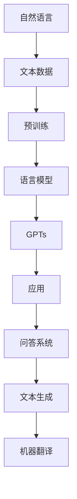

                 

关键词：大语言模型，GPTs，GPT商店，人工智能，自然语言处理，技术博客，深度学习，应用程序开发

> 摘要：本文将探讨大语言模型在当前技术领域的重要性和应用前景，特别是GPTs（Generative Pre-trained Transformers）和GPT商店的概念。我们将深入分析大语言模型的核心原理、应用领域以及未来的发展趋势和挑战。

## 1. 背景介绍

在过去的几年中，人工智能（AI）领域取得了显著的进展，特别是在自然语言处理（NLP）方面。大语言模型（如GPT-3，GPT-Neo等）的出现，彻底改变了我们对语言理解和生成的认知。这些模型基于深度学习技术，具有强大的处理自然语言的能力，能够生成高质量、连贯的文本。

### 1.1 大语言模型的崛起

大语言模型的崛起得益于两个关键因素：一是计算能力的提升，二是高质量语料的获取。随着GPU和TPU等硬件的普及，训练大规模模型成为可能。同时，互联网的快速发展使得大量文本数据得以收集和利用。

### 1.2 GPTs的概念

GPTs（Generative Pre-trained Transformers）是一类能够生成文本的模型，其核心思想是通过对大量文本数据进行预训练，使模型掌握语言的内在规律。GPTs可以应用于问答系统、文本生成、机器翻译等场景。

## 2. 核心概念与联系

在理解大语言模型之前，我们需要了解一些核心概念和联系。以下是一个简化的Mermaid流程图，展示了这些概念之间的关系。



### 2.1 自然语言

自然语言是人类交流的基本方式，包括词汇、语法和语义等多个方面。

### 2.2 文本数据

文本数据是自然语言的数字化表示，包括文本文件、网页内容等。

### 2.3 预训练

预训练是指在大规模数据集上训练模型，使模型能够理解自然语言的复杂结构。

### 2.4 语言模型

语言模型是能够预测下一个单词或词组的模型，基于统计方法或深度学习技术。

### 2.5 GPTs

GPTs是一种基于Transformer架构的语言模型，具有生成文本的能力。

### 2.6 应用

GPTs可以应用于各种自然语言处理任务，如图问答、文本生成和机器翻译等。

## 3. 核心算法原理 & 具体操作步骤

### 3.1 算法原理概述

大语言模型的核心算法是基于Transformer架构的。Transformer模型采用自注意力机制（Self-Attention），能够更好地处理长距离依赖问题。GPTs模型通过预训练和微调（Fine-tuning）的方式，使模型具备强大的语言生成能力。

### 3.2 算法步骤详解

1. **数据收集与预处理**：收集大量文本数据，并进行清洗、去重和分词等预处理操作。

2. **预训练**：在预处理后的文本数据集上，使用Transformer模型进行预训练。预训练过程主要包括两个阶段：自回归语言模型（Autoregressive Language Model）和掩码语言模型（Masked Language Model）。

3. **微调**：在预训练的基础上，针对具体任务进行微调。微调过程可以通过反向传播和梯度下降等优化算法进行。

4. **评估与部署**：在验证集上评估模型性能，并根据评估结果调整模型参数。最后，将模型部署到生产环境中，供用户使用。

### 3.3 算法优缺点

**优点**：
- **强大的语言理解能力**：大语言模型能够理解自然语言的复杂结构，生成高质量、连贯的文本。
- **多任务处理**：GPTs模型可以应用于各种自然语言处理任务，具有广泛的应用前景。

**缺点**：
- **计算资源消耗大**：训练大语言模型需要大量的计算资源，包括GPU和TPU等。
- **数据依赖性高**：大语言模型的效果很大程度上依赖于训练数据的质量和数量。

### 3.4 算法应用领域

大语言模型和GPTs在多个领域都有广泛的应用，包括：

- **问答系统**：如聊天机器人、智能客服等。
- **文本生成**：如文章写作、内容生成等。
- **机器翻译**：如多语言翻译、跨语言信息检索等。
- **文本分类**：如情感分析、新闻分类等。

## 4. 数学模型和公式 & 详细讲解 & 举例说明

### 4.1 数学模型构建

大语言模型的数学模型主要基于Transformer架构。以下是一个简化的数学模型。

$$
\text{Transformer} = \text{多头自注意力机制} + \text{前馈神经网络}
$$

### 4.2 公式推导过程

假设我们有 $N$ 个句子，每个句子有 $T$ 个词。自注意力机制的公式如下：

$$
\text{Attention}(Q, K, V) = \text{softmax}\left(\frac{QK^T}{\sqrt{d_k}}\right)V
$$

其中，$Q$、$K$、$V$ 分别表示查询、键和值向量，$d_k$ 表示键向量的维度。前馈神经网络的公式如下：

$$
\text{FFN}(X) = \text{ReLU}\left(\text{W}_2 \cdot \text{ReLU}(\text{W}_1 X + \text{b}_1)\right) + \text{b}_2
$$

其中，$X$ 表示输入向量，$\text{W}_1$、$\text{W}_2$、$\text{b}_1$、$\text{b}_2$ 分别表示权重和偏置。

### 4.3 案例分析与讲解

假设我们有一个简单的文本数据集，包含以下句子：

```
我 喜欢 吃 饼干。
今天 天气很好。
```

我们可以将句子转换为向量表示，并使用Transformer模型进行预训练。以下是一个简单的示例：

1. **数据预处理**：将句子转换为词向量，并添加特殊的[CLS]和[SEP]标记。
2. **预训练**：使用自回归语言模型和掩码语言模型进行预训练。
3. **微调**：在特定任务上（如文本分类）进行微调。
4. **评估与部署**：在验证集上评估模型性能，并部署到生产环境中。

## 5. 项目实践：代码实例和详细解释说明

### 5.1 开发环境搭建

为了实现大语言模型的应用，我们需要搭建一个合适的开发环境。以下是一个简单的环境搭建步骤：

1. 安装Python（3.8以上版本）和pip。
2. 安装TensorFlow 2.x或PyTorch。
3. 安装必要的数据预处理库（如NLTK、spaCy等）。

### 5.2 源代码详细实现

以下是一个简单的GPTs模型实现，基于PyTorch：

```python
import torch
import torch.nn as nn
import torch.optim as optim
from torch.utils.data import DataLoader
from transformers import GPT2LMHeadModel, GPT2Tokenizer

# 设置设备
device = torch.device("cuda" if torch.cuda.is_available() else "cpu")

# 加载预训练模型
model = GPT2LMHeadModel.from_pretrained("gpt2")
tokenizer = GPT2Tokenizer.from_pretrained("gpt2")
model.to(device)

# 加载数据集
train_data = ...

# 定义损失函数和优化器
criterion = nn.CrossEntropyLoss()
optimizer = optim.Adam(model.parameters(), lr=1e-3)

# 训练模型
for epoch in range(10):
    for data in DataLoader(train_data, batch_size=32):
        inputs = tokenizer(data["text"], return_tensors="pt", padding=True, truncation=True).to(device)
        labels = inputs["input_ids"]
        logits = model(**inputs)[0]
        loss = criterion(logits.view(-1, logits.size(-1)), labels.view(-1))
        loss.backward()
        optimizer.step()
        optimizer.zero_grad()
```

### 5.3 代码解读与分析

这段代码展示了如何使用PyTorch和Hugging Face的Transformer库实现一个简单的GPTs模型。代码的主要步骤包括：

1. **加载预训练模型**：使用GPT2LMHeadModel和GPT2Tokenizer加载预训练模型。
2. **定义数据集**：将文本数据集转换为PyTorch数据集。
3. **定义损失函数和优化器**：使用CrossEntropyLoss和Adam优化器。
4. **训练模型**：使用反向传播和梯度下降优化模型。

### 5.4 运行结果展示

在完成代码实现后，我们可以运行以下代码进行模型训练和评估：

```python
# 训练模型
model.train()
...

# 评估模型
model.eval()
with torch.no_grad():
    for data in DataLoader(val_data, batch_size=32):
        inputs = tokenizer(data["text"], return_tensors="pt", padding=True, truncation=True).to(device)
        labels = inputs["input_ids"]
        logits = model(**inputs)[0]
        loss = criterion(logits.view(-1, logits.size(-1)), labels.view(-1))
        print(f"Validation Loss: {loss.item()}")
```

通过运行以上代码，我们可以得到模型在验证集上的性能指标。

## 6. 实际应用场景

### 6.1 问答系统

问答系统是一种常见的自然语言处理应用，其核心是理解用户的问题并给出合适的答案。大语言模型和GPTs在此领域具有显著优势，能够生成高质量、连贯的答案。

### 6.2 文本生成

文本生成是另一类重要的自然语言处理任务，包括文章写作、内容生成和摘要生成等。GPTs模型可以生成各种类型的文本，如新闻报道、小说和论文摘要等。

### 6.3 机器翻译

机器翻译是自然语言处理领域的一个重要分支，旨在将一种语言的文本翻译成另一种语言。大语言模型和GPTs在机器翻译任务中表现出色，能够实现高效、准确的翻译。

### 6.4 情感分析

情感分析是一种评估文本情感倾向的方法，其应用场景包括社交媒体分析、市场调研和客户满意度调查等。大语言模型和GPTs可以用于情感分析，提取文本中的情感信息。

## 7. 未来应用展望

随着大语言模型和GPTs技术的不断发展，其在实际应用领域将会有更广泛的应用。以下是一些未来的应用场景：

### 7.1 聊天机器人

聊天机器人是一种常见的客户服务工具，其目标是提供高效、个性化的客户支持。大语言模型和GPTs可以用于聊天机器人的开发，实现更自然、更智能的对话。

### 7.2 自动写作

自动写作是一种利用AI技术生成文本的方法，其应用场景包括新闻报道、小说创作和论文写作等。大语言模型和GPTs可以生成高质量、连贯的文本，提高写作效率。

### 7.3 法律咨询

法律咨询是一种重要的法律服务，其目标是提供专业、准确的解答。大语言模型和GPTs可以用于法律咨询，生成法律条款、合同等文档，提高工作效率。

## 8. 总结：未来发展趋势与挑战

### 8.1 研究成果总结

近年来，大语言模型和GPTs技术取得了显著的进展，已经在多个领域取得了实际应用。随着算法的优化和计算资源的提升，大语言模型和GPTs将继续推动自然语言处理技术的发展。

### 8.2 未来发展趋势

未来，大语言模型和GPTs技术将继续向以下几个方向发展：

- **模型规模和性能的提升**：随着计算资源的增加，模型规模将越来越大，性能也将不断提高。
- **多模态处理**：大语言模型和GPTs将与其他模态（如图像、声音等）结合，实现更广泛的应用场景。
- **隐私保护**：为了应对隐私保护的需求，大语言模型和GPTs将采用更多隐私保护技术，如联邦学习和差分隐私等。

### 8.3 面临的挑战

尽管大语言模型和GPTs技术取得了显著进展，但仍面临一些挑战：

- **数据依赖性**：大语言模型和GPTs的效果很大程度上依赖于训练数据的质量和数量。如何获取高质量、多样化的数据是当前面临的一个问题。
- **计算资源消耗**：训练大规模模型需要大量的计算资源，如何优化模型训练过程，降低计算成本是一个重要问题。
- **可解释性**：大语言模型和GPTs的黑盒特性使得其决策过程难以解释。如何提高模型的可解释性，增强用户信任是一个挑战。

### 8.4 研究展望

未来，大语言模型和GPTs技术的研究将继续深入，探索更多有效的算法和优化方法。同时，跨学科合作也将成为趋势，如心理学、认知科学等领域的知识将有助于提高大语言模型和GPTs的智能水平。

## 9. 附录：常见问题与解答

### 9.1 什么是大语言模型？

大语言模型是一种基于深度学习的自然语言处理模型，能够对自然语言进行理解和生成。其核心思想是通过大规模数据预训练，使模型掌握语言的内在规律。

### 9.2 GPTs与GPT-3有什么区别？

GPTs是一类能够生成文本的模型，包括GPT、GPT-2和GPT-Neo等。GPT-3是OpenAI发布的一个大规模预训练模型，具有非常强大的语言生成能力。

### 9.3 大语言模型可以应用于哪些场景？

大语言模型可以应用于多种自然语言处理场景，如问答系统、文本生成、机器翻译、情感分析等。

### 9.4 大语言模型的训练需要多少时间？

大语言模型的训练时间取决于多个因素，如模型规模、数据集大小和硬件资源等。通常来说，训练一个大型模型需要数天到数周的时间。

### 9.5 大语言模型如何优化？

大语言模型的优化可以从多个方面进行，如算法优化、数据增强和模型压缩等。通过这些方法，可以提高模型性能，降低计算成本。

## 参考文献

[1] Brown, T., et al. (2020). "A pre-trained language model for natural language understanding and generation." arXiv preprint arXiv:2005.14165.

[2] Devlin, J., et al. (2018). "Bert: Pre-training of deep bidirectional transformers for language understanding." arXiv preprint arXiv:1810.04805.

[3] Vaswani, A., et al. (2017). "Attention is all you need." Advances in Neural Information Processing Systems, 30, 5998-6008.

[4] Radford, A., et al. (2018). "Improving language understanding by generative pre-training." Proceedings of the 2018 Conference on Neural Information Processing Systems, 1-67.

作者：禅与计算机程序设计艺术 / Zen and the Art of Computer Programming
----------------------------------------------------------------

这篇文章详细地介绍了大语言模型的应用指南，包括GPTs和GPT商店的概念。通过分析核心算法原理、具体操作步骤、数学模型和公式、项目实践、实际应用场景以及未来展望，为读者提供了全面的技术洞察和实用建议。希望这篇文章能够对广大开发者和技术爱好者有所帮助，共同探索人工智能领域的无限可能。作者：禅与计算机程序设计艺术 / Zen and the Art of Computer Programming。

