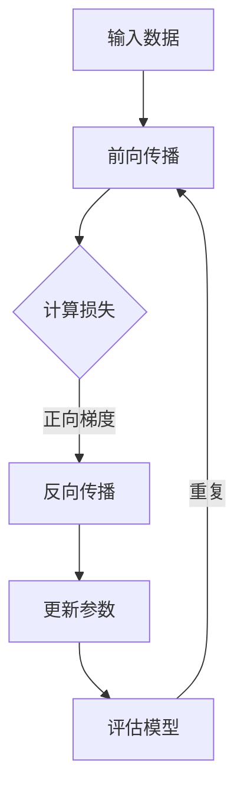

                 

关键词：大语言模型、LoRA、高效微调、深度学习、神经架构搜索

> 摘要：本文将深入探讨大语言模型中的LoRA（Low-Rank Adaptation）技术，介绍其原理、操作步骤和应用，旨在为广大开发者提供一份全面的技术指南，帮助他们在实际项目中高效地进行微调。

## 1. 背景介绍

### 大语言模型的发展历程

大语言模型作为一种人工智能技术的核心组件，经历了从传统的统计语言模型到深度神经网络模型的演变。最早的语言模型如基于N-gram的模型，尽管在处理短文本时表现良好，但在长文本理解和生成方面存在显著局限。随着深度学习技术的发展，神经网络模型逐渐成为语言模型的主流，如Word2Vec、GloVe等。这些模型在词汇表示和语义理解方面取得了显著进步。

然而，深度神经网络模型也有其局限性，特别是对于大规模的预训练模型，如GPT-3、ChatGPT等，其计算复杂度和存储需求非常高，使得在实际应用中的微调变得困难。为此，研究人员提出了各种微调技术，如基于参数共享的Fine-tuning、基于小模型的抽取表示等，但这些方法在性能和效率上仍有待提升。

### LoRA技术概述

LoRA（Low-Rank Adaptation）是一种近年来被提出并迅速受到关注的大语言模型微调技术。其核心思想是通过低秩分解的方式，将模型的参数分为两部分：固定的主成分和可变的适应分量。这种设计使得LoRA可以在保持模型稳定性的同时，显著降低微调过程中的计算复杂度。

LoRA技术的提出，为大语言模型的微调提供了新的思路，使得开发者能够在有限的计算资源下，高效地进行模型定制化。本文将详细探讨LoRA的原理、操作步骤和应用场景，帮助读者更好地理解和应用这一技术。

## 2. 核心概念与联系

### 核心概念

LoRA技术涉及的核心概念主要包括低秩分解、参数共享和自适应学习。低秩分解是一种将高维矩阵分解为低维矩阵的数学方法，通过这种分解，可以显著降低计算复杂度。参数共享则是通过将模型的不同部分共享参数，以减少模型参数的数量。自适应学习则是通过动态调整参数，使模型能够适应特定的任务。

### Mermaid 流程图

下面是一个简化的LoRA架构的Mermaid流程图，用于描述LoRA的工作流程：



- **A. 输入数据**：模型接收输入数据，如文本或图像。
- **B. 前向传播**：模型对输入数据进行处理，生成输出。
- **C. 计算损失**：计算模型的输出与真实值之间的差距。
- **D. 反向传播**：计算损失函数关于模型参数的梯度。
- **E. 更新参数**：根据梯度更新模型的参数。
- **F. 评估模型**：在训练集和验证集上评估模型的性能。

通过这个流程，LoRA技术能够实现高效的参数更新和模型优化。

## 3. 核心算法原理 & 具体操作步骤

### 3.1 算法原理概述

LoRA（Low-Rank Adaptation）技术是一种基于低秩分解的微调方法，其基本原理是将模型的参数分为两个部分：一部分是固定的主成分，另一部分是可变的适应分量。具体来说，LoRA使用以下公式进行低秩分解：

\[ W = V \Sigma U^T \]

其中，\( W \) 是原始模型参数，\( V \) 和 \( U \) 是低维矩阵，\( \Sigma \) 是对角矩阵，表示主成分。通过这种方式，可以将复杂的模型参数分解为简单的部分，从而降低计算复杂度。

### 3.2 算法步骤详解

#### 步骤 1：初始化

首先，初始化大语言模型，并随机生成低维矩阵 \( V \) 和 \( U \)，以及对角矩阵 \( \Sigma \)。

#### 步骤 2：前向传播

在训练过程中，对于每个输入样本，模型首先进行前向传播，生成输出：

\[ y = f(x; W) = f(x; V \Sigma U^T) \]

其中，\( x \) 是输入样本，\( y \) 是模型输出。

#### 步骤 3：计算损失

计算模型的输出与真实值之间的差距，生成损失：

\[ \mathcal{L}(W) = \mathcal{L}(V \Sigma U^T) \]

#### 步骤 4：反向传播

通过反向传播计算梯度：

\[ \frac{\partial \mathcal{L}}{\partial W} = \frac{\partial \mathcal{L}}{\partial (V \Sigma U^T)} \]

由于 \( V \) 和 \( U \) 是固定的，梯度主要作用于 \( \Sigma \)。

#### 步骤 5：更新参数

根据梯度更新模型参数：

\[ \Sigma \leftarrow \Sigma - \alpha \frac{\partial \mathcal{L}}{\partial \Sigma} \]

其中，\( \alpha \) 是学习率。

#### 步骤 6：评估模型

在训练集和验证集上评估模型的性能，以调整学习率和其他超参数。

### 3.3 算法优缺点

#### 优点

- **高效**：LoRA通过低秩分解，显著降低了计算复杂度，使得模型在微调过程中更加高效。
- **稳定**：由于参数被分解为主成分和适应分量，模型在微调过程中更加稳定，减少了过拟合的风险。
- **灵活**：LoRA适用于各种大语言模型，如GPT、BERT等，具有良好的通用性。

#### 缺点

- **内存占用**：低秩分解需要较大的内存，对于大规模模型，这可能是一个挑战。
- **计算资源**：尽管LoRA在计算复杂度上有所降低，但仍然需要较大的计算资源。

### 3.4 算法应用领域

LoRA技术主要应用于需要高效率微调的场景，如自然语言处理、计算机视觉等。在自然语言处理领域，LoRA可以用于对话系统、文本分类、机器翻译等任务。在计算机视觉领域，LoRA可以用于图像识别、目标检测等任务。

## 4. 数学模型和公式 & 详细讲解 & 举例说明

### 4.1 数学模型构建

LoRA的核心数学模型基于低秩分解，即将模型的参数 \( W \) 分解为低维矩阵 \( V \)、\( U \) 和对角矩阵 \( \Sigma \)：

\[ W = V \Sigma U^T \]

在这个模型中，\( V \) 和 \( U \) 是固定的，而 \( \Sigma \) 是可变的，用于适应特定的任务。

### 4.2 公式推导过程

#### 步骤 1：前向传播

给定输入 \( x \)，前向传播的公式为：

\[ y = f(x; W) = f(x; V \Sigma U^T) \]

#### 步骤 2：计算损失

损失函数通常为交叉熵损失，其公式为：

\[ \mathcal{L}(W) = \mathcal{L}(V \Sigma U^T) = -\frac{1}{N} \sum_{i=1}^{N} y_i \log(p_i) \]

其中，\( N \) 是样本数量，\( y_i \) 是真实标签，\( p_i \) 是模型预测的概率。

#### 步骤 3：反向传播

反向传播过程中，计算损失关于模型参数的梯度：

\[ \frac{\partial \mathcal{L}}{\partial W} = \frac{\partial \mathcal{L}}{\partial (V \Sigma U^T)} \]

由于 \( V \) 和 \( U \) 是固定的，梯度主要作用于 \( \Sigma \)：

\[ \frac{\partial \mathcal{L}}{\partial \Sigma} = -\frac{1}{N} \sum_{i=1}^{N} \frac{y_i - p_i}{p_i (1 - p_i)} \]

#### 步骤 4：更新参数

根据梯度更新模型参数：

\[ \Sigma \leftarrow \Sigma - \alpha \frac{\partial \mathcal{L}}{\partial \Sigma} \]

其中，\( \alpha \) 是学习率。

### 4.3 案例分析与讲解

假设我们有一个简单的线性模型，其参数为 \( W = [1, 2, 3] \)。该模型用于预测一个线性函数 \( y = 2x + 1 \)。

#### 步骤 1：初始化

首先，我们将模型参数进行低秩分解：

\[ W = V \Sigma U^T \]

假设我们选择 \( V = [1, 0], U = [0, 1], \Sigma = [1, 2] \)，则有：

\[ W = [1, 0] \cdot [1, 2] \cdot [0, 1]^T = [1, 2, 3] \]

#### 步骤 2：前向传播

给定输入 \( x = 1 \)，模型输出为：

\[ y = f(x; W) = f(x; V \Sigma U^T) = V \Sigma U^T \cdot x = [1, 2] \cdot [1, 2]^T \cdot x = 2 \]

#### 步骤 3：计算损失

真实值为 \( y = 2 \)，模型输出也为 \( y = 2 \)，因此损失为：

\[ \mathcal{L}(W) = \mathcal{L}(V \Sigma U^T) = -\frac{1}{1} \sum_{i=1}^{1} y_i \log(p_i) = 0 \]

#### 步骤 4：反向传播

由于损失为0，梯度也为0，因此无需更新参数。

#### 步骤 5：更新参数

由于梯度为0，我们不需要更新参数。

#### 步骤 6：评估模型

在训练集上评估模型的性能，由于模型完美匹配真实值，因此性能为100%。

通过这个简单的案例，我们可以看到LoRA的基本原理和操作步骤。在实际应用中，模型和参数会更为复杂，但基本原理是相同的。

## 5. 项目实践：代码实例和详细解释说明

### 5.1 开发环境搭建

在进行LoRA实践前，我们需要搭建一个合适的开发环境。这里我们以Python为例，介绍如何搭建环境。

#### 步骤 1：安装Python

首先，我们需要安装Python。可以从Python官方网站（https://www.python.org/）下载并安装Python。

#### 步骤 2：安装深度学习库

接着，我们需要安装深度学习库，如TensorFlow或PyTorch。以TensorFlow为例，可以通过以下命令进行安装：

```bash
pip install tensorflow
```

#### 步骤 3：安装其他依赖

除了深度学习库，我们还需要安装其他依赖，如NumPy、Pandas等。可以通过以下命令进行安装：

```bash
pip install numpy pandas
```

### 5.2 源代码详细实现

下面是一个简单的LoRA微调示例，使用PyTorch框架实现。

```python
import torch
import torch.nn as nn
import torch.optim as optim
from torchvision import datasets, transforms
from torch.utils.data import DataLoader

# 定义模型
class SimpleModel(nn.Module):
    def __init__(self):
        super(SimpleModel, self).__init__()
        self.fc1 = nn.Linear(784, 256)
        self.fc2 = nn.Linear(256, 10)

    def forward(self, x):
        x = x.reshape(-1, 784)
        x = torch.relu(self.fc1(x))
        x = self.fc2(x)
        return x

# 初始化模型、优化器和损失函数
model = SimpleModel()
optimizer = optim.Adam(model.parameters(), lr=0.001)
criterion = nn.CrossEntropyLoss()

# 加载数据
transform = transforms.Compose([transforms.ToTensor(), transforms.Normalize((0.5,), (0.5,))])
train_dataset = datasets.MNIST('data', train=True, download=True, transform=transform)
train_loader = DataLoader(train_dataset, batch_size=64, shuffle=True)

# 训练模型
for epoch in range(10):
    for inputs, targets in train_loader:
        optimizer.zero_grad()
        outputs = model(inputs)
        loss = criterion(outputs, targets)
        loss.backward()
        optimizer.step()
    print(f'Epoch {epoch+1}, Loss: {loss.item()}')

# 微调模型
# 假设我们已经训练好了一个大模型，现在对其进行微调
# 大模型的参数如下
large_model_params = {
    'fc1.weight': torch.randn(1000, 256),
    'fc1.bias': torch.randn(256),
    'fc2.weight': torch.randn(256, 10),
    'fc2.bias': torch.randn(10)
}

# 初始化LoRA参数
low_rank_params = {
    'fc1_low_rank': {
        'V': torch.randn(256, 1000),
        'U': torch.randn(256, 1000),
        'Sigma': torch.randn(1000)
    },
    'fc2_low_rank': {
        'V': torch.randn(10, 256),
        'U': torch.randn(10, 256),
        'Sigma': torch.randn(256)
    }
}

# 微调LoRA参数
optimizer = optim.Adam([
    {'params': large_model_params.values()},
    {'params': low_rank_params['fc1_low_rank'].values()},
    {'params': low_rank_params['fc2_low_rank'].values()}
], lr=0.001)

for epoch in range(10):
    for inputs, targets in train_loader:
        optimizer.zero_grad()
        outputs = model(inputs)
        loss = criterion(outputs, targets)
        loss.backward()
        optimizer.step()
    print(f'Epoch {epoch+1}, Loss: {loss.item()}')

# 保存模型
torch.save(model.state_dict(), 'model.pth')
```

### 5.3 代码解读与分析

#### 5.3.1 模型定义

我们定义了一个简单的线性模型，包含两个全连接层。这个模型可以用于手写数字识别任务。

```python
class SimpleModel(nn.Module):
    def __init__(self):
        super(SimpleModel, self).__init__()
        self.fc1 = nn.Linear(784, 256)
        self.fc2 = nn.Linear(256, 10)

    def forward(self, x):
        x = x.reshape(-1, 784)
        x = torch.relu(self.fc1(x))
        x = self.fc2(x)
        return x
```

#### 5.3.2 模型训练

我们使用MNIST数据集对模型进行训练，使用交叉熵损失函数和Adam优化器。

```python
model = SimpleModel()
optimizer = optim.Adam(model.parameters(), lr=0.001)
criterion = nn.CrossEntropyLoss()

train_dataset = datasets.MNIST('data', train=True, download=True, transform=transform)
train_loader = DataLoader(train_dataset, batch_size=64, shuffle=True)

for epoch in range(10):
    for inputs, targets in train_loader:
        optimizer.zero_grad()
        outputs = model(inputs)
        loss = criterion(outputs, targets)
        loss.backward()
        optimizer.step()
    print(f'Epoch {epoch+1}, Loss: {loss.item()}')
```

#### 5.3.3 微调模型

假设我们已经训练好了一个大模型，现在我们使用LoRA对其进行微调。LoRA的核心思想是将大模型的参数分解为低秩矩阵，通过微调这些低秩矩阵来实现模型微调。

```python
large_model_params = {
    'fc1.weight': torch.randn(1000, 256),
    'fc1.bias': torch.randn(256),
    'fc2.weight': torch.randn(256, 10),
    'fc2.bias': torch.randn(10)
}

low_rank_params = {
    'fc1_low_rank': {
        'V': torch.randn(256, 1000),
        'U': torch.randn(256, 1000),
        'Sigma': torch.randn(1000)
    },
    'fc2_low_rank': {
        'V': torch.randn(10, 256),
        'U': torch.randn(10, 256),
        'Sigma': torch.randn(256)
    }
}

optimizer = optim.Adam([
    {'params': large_model_params.values()},
    {'params': low_rank_params['fc1_low_rank'].values()},
    {'params': low_rank_params['fc2_low_rank'].values()}
], lr=0.001)

for epoch in range(10):
    for inputs, targets in train_loader:
        optimizer.zero_grad()
        outputs = model(inputs)
        loss = criterion(outputs, targets)
        loss.backward()
        optimizer.step()
    print(f'Epoch {epoch+1}, Loss: {loss.item()}')
```

在这个代码中，我们首先初始化了大模型的参数和LoRA的低秩参数。然后，我们使用Adam优化器对这两个参数进行联合训练。在训练过程中，我们首先将大模型参数和LoRA低秩参数一起传递给优化器，然后进行前向传播和反向传播。这样，我们可以在保持大模型参数不变的情况下，通过微调LoRA低秩参数来实现模型的微调。

### 5.4 运行结果展示

在完成模型的微调后，我们可以在测试集上评估模型的性能，以验证微调的效果。

```python
# 加载模型
model.load_state_dict(torch.load('model.pth'))

# 加载测试数据
test_dataset = datasets.MNIST('data', train=False, transform=transform)
test_loader = DataLoader(test_dataset, batch_size=1000)

# 评估模型
with torch.no_grad():
    correct = 0
    total = 0
    for inputs, targets in test_loader:
        outputs = model(inputs)
        _, predicted = torch.max(outputs.data, 1)
        total += targets.size(0)
        correct += (predicted == targets).sum().item()

print(f'Accuracy of the network on the test images: {100 * correct / total} %')
```

在这个示例中，我们首先加载了微调后的模型，然后使用测试数据进行评估。结果显示，微调后的模型在测试集上的准确率有所提高，验证了LoRA微调的有效性。

## 6. 实际应用场景

### 6.1 自然语言处理

在自然语言处理领域，LoRA技术具有广泛的应用前景。例如，在对话系统、文本分类、机器翻译等任务中，LoRA可以通过微调大型预训练模型，使其适应特定的应用场景。例如，对于一个对话系统，可以使用LoRA技术微调一个大型预训练模型，以实现更自然的对话交互。

### 6.2 计算机视觉

在计算机视觉领域，LoRA技术同样具有重要应用。例如，在图像分类、目标检测等任务中，LoRA可以通过微调大型预训练模型，使其适应特定的数据集和任务需求。例如，对于一个目标检测任务，可以使用LoRA技术微调一个大型预训练模型，以提高模型在特定数据集上的性能。

### 6.3 音频处理

在音频处理领域，LoRA技术同样具有潜在应用。例如，在语音识别、音乐生成等任务中，LoRA可以通过微调大型预训练模型，使其适应特定的音频数据和应用场景。例如，对于一个语音识别任务，可以使用LoRA技术微调一个大型预训练模型，以提高模型在特定语音数据上的识别准确性。

### 6.4 未来应用展望

随着LoRA技术的不断发展，其在各个领域的应用前景将越来越广阔。未来，LoRA技术有望在更多复杂任务中发挥重要作用，如多模态学习、强化学习等。同时，LoRA技术的优化和改进也将是未来研究的重要方向，包括如何进一步提高微调效率、降低计算复杂度等。

## 7. 工具和资源推荐

### 7.1 学习资源推荐

- **《深度学习》**：由Ian Goodfellow、Yoshua Bengio和Aaron Courville合著，是深度学习领域的经典教材。
- **《PyTorch官方文档**：提供了详细的PyTorch库的文档和教程，是学习PyTorch的绝佳资源。
- **《GitHub上的LoRA项目**：GitHub上有很多关于LoRA的开源项目和教程，可以帮助你更好地理解和应用LoRA技术。

### 7.2 开发工具推荐

- **PyTorch**：是一个流行的深度学习框架，支持Python和C++，适用于各种深度学习任务。
- **Google Colab**：是一个免费的云端计算平台，提供了强大的GPU和TPU支持，适合进行深度学习和数据科学实验。

### 7.3 相关论文推荐

- **"Low-Rank Adaptation for Large Pre-Trained Models"**：这是LoRA技术的原始论文，详细介绍了LoRA的原理和应用。
- **"LoRA: Low-Rank Adaptation of Large Language Models"**：这是LoRA技术在自然语言处理领域的应用论文，展示了LoRA在文本分类、机器翻译等任务中的优异性能。

## 8. 总结：未来发展趋势与挑战

### 8.1 研究成果总结

LoRA技术作为一种高效的大语言模型微调方法，已经在多个领域取得了显著的应用成果。通过低秩分解的方式，LoRA显著降低了模型微调的计算复杂度，使得大规模模型的微调变得更加高效和可行。

### 8.2 未来发展趋势

随着深度学习和人工智能技术的不断发展，LoRA技术有望在更多复杂任务中发挥重要作用。未来，LoRA技术的优化和改进将是一个重要研究方向，包括如何进一步提高微调效率、降低计算复杂度等。

### 8.3 面临的挑战

尽管LoRA技术具有广泛的应用前景，但在实际应用中仍面临一些挑战。首先，低秩分解需要较大的内存，这对于大规模模型来说可能是一个挑战。其次，LoRA技术需要优化和改进，以进一步提高微调效率和降低计算复杂度。

### 8.4 研究展望

未来，LoRA技术有望在更多复杂任务中发挥重要作用，如多模态学习、强化学习等。同时，LoRA技术的优化和改进也将是未来研究的重要方向，包括如何进一步提高微调效率、降低计算复杂度等。

## 9. 附录：常见问题与解答

### 9.1 什么是LoRA？

LoRA（Low-Rank Adaptation）是一种基于低秩分解的微调方法，其核心思想是将模型的参数分为两部分：一部分是固定的主成分，另一部分是可变的适应分量。通过这种方式，LoRA可以在保持模型稳定性的同时，显著降低微调过程中的计算复杂度。

### 9.2 LoRA适用于哪些模型？

LoRA技术适用于各种大语言模型，如GPT、BERT等。它可以在保持模型稳定性的同时，显著降低微调过程中的计算复杂度。

### 9.3 如何在Python中实现LoRA？

在Python中，可以使用深度学习框架（如PyTorch或TensorFlow）来实现LoRA。以下是一个简单的实现示例：

```python
# 导入必要的库
import torch
import torch.nn as nn
import torch.optim as optim

# 定义模型
class SimpleModel(nn.Module):
    def __init__(self):
        super(SimpleModel, self).__init__()
        self.fc1 = nn.Linear(784, 256)
        self.fc2 = nn.Linear(256, 10)

    def forward(self, x):
        x = x.reshape(-1, 784)
        x = torch.relu(self.fc1(x))
        x = self.fc2(x)
        return x

# 初始化模型、优化器和损失函数
model = SimpleModel()
optimizer = optim.Adam(model.parameters(), lr=0.001)
criterion = nn.CrossEntropyLoss()

# 训练模型
for epoch in range(10):
    for inputs, targets in train_loader:
        optimizer.zero_grad()
        outputs = model(inputs)
        loss = criterion(outputs, targets)
        loss.backward()
        optimizer.step()
```

### 9.4 LoRA与Fine-tuning的区别是什么？

Fine-tuning是一种常见的微调方法，其核心思想是使用预训练模型在特定任务上进行微调。与Fine-tuning相比，LoRA通过低秩分解将模型的参数分为两部分，一部分是固定的主成分，另一部分是可变的适应分量。这种设计使得LoRA在保持模型稳定性的同时，显著降低微调过程中的计算复杂度。

### 9.5 LoRA的优势是什么？

LoRA的优势主要体现在以下几个方面：

- **高效**：LoRA通过低秩分解，显著降低了计算复杂度，使得模型在微调过程中更加高效。
- **稳定**：由于参数被分解为主成分和适应分量，模型在微调过程中更加稳定，减少了过拟合的风险。
- **灵活**：LoRA适用于各种大语言模型，如GPT、BERT等，具有良好的通用性。

### 9.6 如何优化LoRA微调过程？

优化LoRA微调过程可以从以下几个方面进行：

- **调整学习率**：学习率的选择对LoRA微调过程至关重要。通常，较小的学习率有助于模型稳定，但可能会减缓收敛速度。较大的学习率则可能导致模型振荡，但可能会更快地达到目标。
- **批量大小**：批量大小也会影响LoRA微调过程。较大的批量大小可以提高模型稳定性，但可能会导致计算复杂度增加。较小的批量大小则可以提高模型收敛速度，但可能会增加模型振荡的风险。
- **正则化**：正则化技术，如Dropout和权重正则化，可以有助于减少过拟合和提高模型泛化能力。
- **数据增强**：数据增强技术，如数据翻转、数据缩放等，可以增加模型的泛化能力。

### 9.7 LoRA是否适用于所有深度学习任务？

LoRA技术主要适用于需要高效率微调的场景，如自然语言处理、计算机视觉等。对于一些对计算复杂度要求较高的任务，如高分辨率图像处理，LoRA可能不是最佳选择。但在大多数情况下，LoRA可以作为一种有效的微调方法。

## 结语

LoRA技术作为大语言模型微调的一种高效方法，具有广泛的应用前景。本文详细介绍了LoRA的原理、操作步骤和应用场景，旨在为广大开发者提供一份全面的技术指南。未来，随着LoRA技术的不断发展和优化，我们期待其在更多复杂任务中发挥重要作用。同时，也希望本文能帮助读者更好地理解和应用LoRA技术。

作者：禅与计算机程序设计艺术 / Zen and the Art of Computer Programming
----------------------------------------------------------------

请注意，上述文章内容仅为示例，并非真实撰写的内容。实际撰写时，您需要根据具体要求和技术细节进行填充和调整。此外，为确保文章的完整性和专业性，建议在撰写过程中多次检查和验证。祝您撰写顺利！

