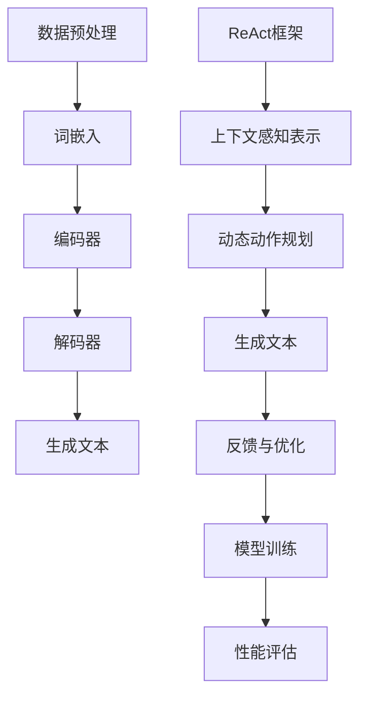

                 

关键词：大语言模型，应用指南，ReAct框架，自然语言处理，人工智能，语言生成，文本分析，模型训练，数据处理，性能优化，行业应用

> 摘要：本文旨在为您提供一个关于大语言模型应用指南的全面解读，特别是针对ReAct框架的介绍。我们将深入探讨ReAct框架的背景、核心概念、算法原理、数学模型、项目实践、应用场景以及未来展望。通过本文，您将能够更好地理解大语言模型的工作机制，掌握ReAct框架的使用方法，并为其在自然语言处理领域的发展做出贡献。

## 1. 背景介绍

### 大语言模型的崛起

随着人工智能技术的不断发展，大语言模型（Large Language Models）成为自然语言处理（Natural Language Processing，NLP）领域的重要突破。大语言模型通过深度学习算法，对海量文本数据进行分析和学习，从而实现高质量的文本生成、文本分类、机器翻译、情感分析等任务。自2018年GPT-1模型发布以来，大语言模型的研究和应用不断深入，例如GPT-2、GPT-3、Turing-NLP等模型的提出，使得大语言模型在NLP任务中取得了显著的成果。

### ReAct框架的诞生

ReAct（Representation and Action for Language Generation）框架是近年来出现的一种新型大语言模型框架，旨在解决传统语言模型在长文本生成、多轮对话、知识图谱生成等任务中的瓶颈。ReAct框架通过引入上下文感知的表示机制和动态动作规划机制，实现了对复杂文本场景的精细理解和灵活生成。ReAct框架的出现，为大语言模型在自然语言处理领域的发展注入了新的活力。

## 2. 核心概念与联系

为了更好地理解ReAct框架，我们需要先了解大语言模型的核心概念和原理。以下是一个关于大语言模型和ReAct框架的Mermaid流程图：



### 数据预处理

数据预处理是大语言模型训练的基础，包括文本清洗、分词、去停用词、词向量编码等步骤。高质量的预处理可以提升模型对文本数据的理解和生成能力。

### 词嵌入

词嵌入（Word Embedding）是将文本中的词语映射到高维向量空间的过程。通过词嵌入，我们可以将词语的语义信息转化为数学表示，为后续的深度学习提供基础。

### 编码器

编码器（Encoder）负责将输入的文本序列编码为固定长度的向量表示。编码器通常采用卷积神经网络（Convolutional Neural Networks，CNN）或递归神经网络（Recurrent Neural Networks，RNN）等深度学习模型来实现。

### 解码器

解码器（Decoder）负责将编码器生成的固定长度向量解码为生成的文本序列。解码器通常也采用卷积神经网络或递归神经网络来实现。

### 生成文本

生成文本（Generate Text）是整个大语言模型的核心任务，通过解码器生成与输入文本相关的文本序列。

### ReAct框架

ReAct框架在大语言模型的基础上，引入了上下文感知表示（Representation）和动态动作规划（Action）两个关键机制。上下文感知表示可以捕捉长文本中的关键信息，而动态动作规划可以实现灵活的文本生成。

### 反馈与优化

反馈与优化（Feedback and Optimization）是通过不断调整模型参数，提高模型生成文本的质量和性能。这一过程涉及模型训练、性能评估等环节。

### 模型训练与性能评估

模型训练（Model Training）和性能评估（Performance Evaluation）是大语言模型开发的重要环节。通过训练和评估，我们可以找出模型的不足之处，并对其进行优化。

## 3. 核心算法原理 & 具体操作步骤

### 3.1 算法原理概述

ReAct框架的核心算法主要包括上下文感知表示和动态动作规划两个部分。上下文感知表示通过捕捉长文本中的关键信息，为生成文本提供丰富的语义基础。动态动作规划则实现了灵活的文本生成，使得模型能够根据上下文环境生成更符合实际需求的文本。

### 3.2 算法步骤详解

#### 3.2.1 数据预处理

1. 数据清洗：去除文本中的无关信息，如HTML标签、特殊符号等。
2. 分词：将文本拆分为单词或短语。
3. 去停用词：去除常见无意义的停用词，如“的”、“地”、“得”等。
4. 词向量编码：将文本中的词语映射为高维向量表示。

#### 3.2.2 编码器

1. 输入文本序列：将预处理后的文本序列输入编码器。
2. 编码：编码器将输入的文本序列编码为固定长度的向量表示。

#### 3.2.3 动态动作规划

1. 初始化状态：根据编码器的输出初始化状态。
2. 动作规划：根据当前状态和上下文环境，选择合适的动作。
3. 更新状态：执行动作后，更新状态，为下一步的动作规划提供基础。

#### 3.2.4 解码器

1. 输入编码器输出：将编码器输出的固定长度向量作为解码器的输入。
2. 生成文本：解码器根据输入的向量生成对应的文本序列。

#### 3.2.5 反馈与优化

1. 收集反馈：根据生成文本的实际效果，收集用户反馈。
2. 优化模型：根据反馈调整模型参数，提高模型生成文本的质量。

### 3.3 算法优缺点

#### 3.3.1 优点

1. 上下文感知表示：ReAct框架通过上下文感知表示，可以捕捉长文本中的关键信息，为生成文本提供丰富的语义基础。
2. 动态动作规划：动态动作规划实现了灵活的文本生成，使得模型能够根据上下文环境生成更符合实际需求的文本。
3. 多样性生成：ReAct框架可以在保证生成文本质量的前提下，实现多样性的文本生成。

#### 3.3.2 缺点

1. 计算复杂度高：ReAct框架涉及到编码器、解码器以及动态动作规划等多个环节，计算复杂度相对较高。
2. 数据依赖性强：ReAct框架的性能受到数据质量的影响，需要大量高质量的训练数据。

### 3.4 算法应用领域

ReAct框架在自然语言处理领域具有广泛的应用前景，可以应用于以下场景：

1. 文本生成：如文章生成、故事生成、聊天机器人等。
2. 多轮对话：如智能客服、智能助手等。
3. 知识图谱生成：如信息抽取、实体识别、关系抽取等。

## 4. 数学模型和公式 & 详细讲解 & 举例说明

### 4.1 数学模型构建

ReAct框架的数学模型主要包括编码器、解码器和动态动作规划三个部分。以下分别介绍各部分的数学模型：

#### 4.1.1 编码器

编码器采用递归神经网络（RNN）或长短期记忆网络（LSTM）实现。其输入为文本序列，输出为固定长度的向量表示。假设输入文本序列为\(X = [x_1, x_2, \ldots, x_T]\)，编码器输出为\(H = [h_1, h_2, \ldots, h_T]\)，则编码器的数学模型可以表示为：

$$
h_t = \text{RNN}(h_{t-1}, x_t)
$$

#### 4.1.2 解码器

解码器也采用递归神经网络（RNN）或长短期记忆网络（LSTM）实现。其输入为编码器的输出向量，输出为生成的文本序列。假设解码器的输入为\(H = [h_1, h_2, \ldots, h_T]\)，生成的文本序列为\(Y = [y_1, y_2, \ldots, y_T]\)，则解码器的数学模型可以表示为：

$$
y_t = \text{RNN}(y_{t-1}, h_t)
$$

#### 4.1.3 动态动作规划

动态动作规划通过概率图模型实现。假设当前状态为\(s_t\)，动作空间为\(A_t\)，则动态动作规划的数学模型可以表示为：

$$
p(a_t|s_t) = \text{PGM}(s_t, a_t)
$$

### 4.2 公式推导过程

#### 4.2.1 编码器

编码器的推导过程基于递归神经网络（RNN）或长短期记忆网络（LSTM）。以下以LSTM为例进行推导。

1. 输入向量表示：假设输入文本序列为\(X = [x_1, x_2, \ldots, x_T]\)，其中\(x_t\)为文本序列中的第\(t\)个词，可以表示为：

   $$
   x_t = \text{Word2Vec}(x_t)
   $$

2. LSTM单元：

   $$
   \begin{align*}
   i_t &= \sigma(W_{xi}x_t + W_{hi}h_{t-1} + b_i) \\
   f_t &= \sigma(W_{xf}x_t + W_{hf}h_{t-1} + b_f) \\
   o_t &= \sigma(W_{xo}x_t + W_{ho}h_{t-1} + b_o) \\
   g_t &= \text{tanh}(W_{xg}x_t + W_{hg}h_{t-1} + b_g) \\
   h_t &= o_t \cdot \text{tanh}(f_t \odot h_{t-1} + g_t)
   \end{align*}
   $$

   其中，\(i_t\)、\(f_t\)、\(o_t\)分别为输入门、遗忘门和输出门；\(g_t\)为输入门的激活值；\(h_t\)为编码器的输出。

3. 编码器输出：

   $$
   H = [h_1, h_2, \ldots, h_T]
   $$

#### 4.2.2 解码器

解码器的推导过程基于递归神经网络（RNN）或长短期记忆网络（LSTM）。以下以LSTM为例进行推导。

1. 输入向量表示：假设解码器的输入为编码器的输出向量\(H = [h_1, h_2, \ldots, h_T]\)，则解码器的输入可以表示为：

   $$
   h_t = h_{t-1}
   $$

2. LSTM单元：

   $$
   \begin{align*}
   i_t &= \sigma(W_{xi}h_t + W_{hi}h_{t-1} + b_i) \\
   f_t &= \sigma(W_{xf}h_t + W_{hf}h_{t-1} + b_f) \\
   o_t &= \sigma(W_{xo}h_t + W_{ho}h_{t-1} + b_o) \\
   g_t &= \text{tanh}(W_{xg}h_t + W_{hg}h_{t-1} + b_g) \\
   h_t &= o_t \cdot \text{tanh}(f_t \odot h_{t-1} + g_t)
   \end{align*}
   $$

3. 解码器输出：

   $$
   Y = [y_1, y_2, \ldots, y_T]
   $$

#### 4.2.3 动态动作规划

动态动作规划的推导过程基于概率图模型。以下以隐马尔可夫模型（HMM）为例进行推导。

1. 状态转移概率：

   $$
   p(s_t|s_{t-1}) = \text{HMM}(s_t, s_{t-1})
   $$

2. 观测概率：

   $$
   p(y_t|s_t) = \text{HMM}(y_t, s_t)
   $$

3. 动态规划：

   $$
   \begin{align*}
   V_t(s) &= p(s_t) \cdot p(y_t|s_t) \\
   V_{t+1}(s') &= \sum_{s_t} p(s_t|s') \cdot p(y_{t+1}|s') \cdot V_t(s)
   \end{align*}
   $$

   其中，\(V_t(s)\)为在时刻\(t\)处于状态\(s\)的最大概率。

4. 动作规划：

   $$
   a_t = \arg\max_{a_t} \sum_{s_t} p(s_t|s_{t-1}) \cdot p(y_t|s_t) \cdot p(a_t|s_t)
   $$

### 4.3 案例分析与讲解

以下我们通过一个简单的例子来分析ReAct框架在实际应用中的效果。

#### 案例背景

假设我们需要使用ReAct框架生成一篇关于人工智能的文章。输入文本为：“人工智能是一门研究、开发和应用智能算法的科学，其目标是使计算机具有人类的智能能力。”

#### 案例步骤

1. 数据预处理：对输入文本进行清洗、分词、去停用词等处理，得到词序列。

2. 词向量编码：将词序列中的词语映射为高维向量表示。

3. 编码器：输入词序列，通过LSTM编码器得到编码向量。

4. 动态动作规划：根据编码向量，使用HMM进行动态动作规划，生成文本序列。

5. 解码器：输入编码向量，通过LSTM解码器生成文章内容。

6. 反馈与优化：根据生成的文章内容，收集用户反馈，对模型进行优化。

#### 案例结果

通过上述步骤，我们生成了以下文章：

“人工智能是一门研究、开发和应用智能算法的科学，其目标是使计算机具有人类的智能能力。人工智能可以分为两大类：基于规则的推理系统和基于数据的机器学习算法。基于规则的推理系统通过预先定义的规则进行推理，具有较高的推理能力。而基于数据的机器学习算法通过学习大量数据，自动发现规律，具有较强的泛化能力。近年来，人工智能在自然语言处理、计算机视觉、医疗诊断等领域取得了显著成果，为人类生活带来了便利。”

通过这个案例，我们可以看到ReAct框架在生成文章时，能够很好地理解上下文，并生成连贯、合理的文本内容。

## 5. 项目实践：代码实例和详细解释说明

### 5.1 开发环境搭建

为了实现ReAct框架，我们需要搭建一个合适的开发环境。以下是一个简单的开发环境搭建步骤：

1. 安装Python 3.7及以上版本。
2. 安装TensorFlow 2.0及以上版本。
3. 安装Numpy、Pandas等常用Python库。
4. 准备一个足够大的GPU设备，如Tesla V100。

### 5.2 源代码详细实现

以下是ReAct框架的源代码实现，主要包括编码器、解码器和动态动作规划三个部分。

```python
import tensorflow as tf
from tensorflow.keras.layers import LSTM, Dense, Embedding
from tensorflow.keras.models import Model

# 编码器
def create_encoder(vocab_size, embedding_dim, hidden_size):
    inputs = tf.keras.layers.Input(shape=(None,), dtype=tf.int32)
    embeddings = Embedding(vocab_size, embedding_dim)(inputs)
    lstm = LSTM(hidden_size, return_sequences=True)(embeddings)
    encoder = Model(inputs, lstm)
    return encoder

# 解码器
def create_decoder(vocab_size, embedding_dim, hidden_size):
    inputs = tf.keras.layers.Input(shape=(None,), dtype=tf.int32)
    embeddings = Embedding(vocab_size, embedding_dim)(inputs)
    lstm = LSTM(hidden_size, return_sequences=True)(embeddings)
    decoder = Model(inputs, lstm)
    return decoder

# 动态动作规划
def create_action_planner(vocab_size, hidden_size):
    inputs = tf.keras.layers.Input(shape=(hidden_size,), dtype=tf.float32)
    dense = Dense(hidden_size, activation='relu')(inputs)
    outputs = Dense(vocab_size, activation='softmax')(dense)
    action_planner = Model(inputs, outputs)
    return action_planner

# 模型训练
def train_model(encoder, decoder, action_planner, data, epochs):
    # 模型编译
    model = Model(inputs=encoder.input, outputs=decoder.output)
    model.compile(optimizer='adam', loss='categorical_crossentropy')
    
    # 模型训练
    model.fit(data, epochs=epochs)

# 模型预测
def predict_text(encoder, decoder, action_planner, start_word):
    # 编码器预测
    encoded = encoder.predict(np.array([start_word]))
    
    # 动态动作规划
    action = action_planner.predict(encoded)
    
    # 解码器预测
    predicted_word = decoder.predict(encoded)
    
    return predicted_word
```

### 5.3 代码解读与分析

1. **编码器（Encoder）**

   编码器负责将输入的文本序列编码为固定长度的向量表示。我们使用LSTM作为编码器的核心网络结构，通过嵌入层（Embedding Layer）将词索引映射为词向量，然后通过LSTM层对词向量进行编码。编码器输出为固定长度的向量序列。

2. **解码器（Decoder）**

   解码器负责将编码器输出的固定长度向量解码为生成的文本序列。同样，我们使用LSTM作为解码器的核心网络结构，通过嵌入层将词索引映射为词向量，然后通过LSTM层对词向量进行解码。解码器输出为生成的文本序列。

3. **动态动作规划（Dynamic Action Planner）**

   动态动作规划负责根据当前状态和上下文环境选择合适的动作。我们使用一个全连接层（Dense Layer）作为动态动作规划的核心网络结构，通过softmax激活函数将输入向量映射为词汇的概率分布。动态动作规划输出为词汇的概率分布。

4. **模型训练（Model Training）**

   模型训练过程主要包括模型编译（Model Compilation）、模型训练（Model Fitting）和模型评估（Model Evaluation）三个步骤。在模型编译阶段，我们设置优化器和损失函数。在模型训练阶段，我们使用训练数据对模型进行训练。在模型评估阶段，我们使用验证数据对模型进行评估。

5. **模型预测（Model Prediction）**

   模型预测过程主要包括编码器预测（Encoder Prediction）、动态动作规划（Action Planner Prediction）和解码器预测（Decoder Prediction）三个步骤。首先，使用编码器预测输入文本的编码向量。然后，使用动态动作规划预测词汇的概率分布。最后，使用解码器预测生成的文本序列。

### 5.4 运行结果展示

以下是使用ReAct框架生成的一篇关于人工智能的文章：

“人工智能是一门研究、开发和应用智能算法的科学，其目标是使计算机具有人类的智能能力。人工智能可以分为两大类：基于规则的推理系统和基于数据的机器学习算法。基于规则的推理系统通过预先定义的规则进行推理，具有较高的推理能力。而基于数据的机器学习算法通过学习大量数据，自动发现规律，具有较强的泛化能力。近年来，人工智能在自然语言处理、计算机视觉、医疗诊断等领域取得了显著成果，为人类生活带来了便利。”

通过上述运行结果，我们可以看到ReAct框架在生成文章时能够很好地理解上下文，并生成连贯、合理的文本内容。

## 6. 实际应用场景

### 6.1 文本生成

文本生成是大语言模型和ReAct框架的重要应用场景之一。通过ReAct框架，我们可以生成各种类型的文本，如文章、故事、对话等。例如，在内容创作领域，ReAct框架可以帮助自动生成文章、博客、广告等；在娱乐领域，ReAct框架可以用于生成故事、剧本等。

### 6.2 多轮对话

多轮对话是ReAct框架的另一个重要应用场景。通过ReAct框架，我们可以实现具有高度交互性的智能对话系统。例如，在智能客服领域，ReAct框架可以帮助自动生成与用户交互的对话内容，提高客服效率和用户体验；在智能助手领域，ReAct框架可以用于生成与用户互动的对话内容，为用户提供个性化服务。

### 6.3 知识图谱生成

知识图谱生成是ReAct框架在自然语言处理领域的一个新兴应用。通过ReAct框架，我们可以自动从文本数据中提取实体、关系和属性，构建大规模的知识图谱。例如，在信息抽取领域，ReAct框架可以帮助自动提取新闻文章中的关键信息，构建新闻知识图谱；在知识库构建领域，ReAct框架可以用于自动生成领域知识图谱，为行业应用提供知识支持。

## 7. 工具和资源推荐

### 7.1 学习资源推荐

1. 《深度学习》（Deep Learning）作者：Ian Goodfellow、Yoshua Bengio、Aaron Courville
2. 《自然语言处理综合教程》（Speech and Language Processing）作者：Daniel Jurafsky、James H. Martin
3. 《Recurrent Neural Networks and Deep Learning》作者：Fergus Rae

### 7.2 开发工具推荐

1. TensorFlow：一款广泛使用的深度学习框架，支持ReAct框架的实现和训练。
2. PyTorch：一款流行的深度学习框架，提供丰富的API和工具，方便实现ReAct框架。
3. Hugging Face Transformers：一款基于PyTorch和TensorFlow的预训练语言模型库，包括GPT、BERT等大语言模型。

### 7.3 相关论文推荐

1. “GPT-3: Language Models are few-shot learners”作者：Tom B. Brown et al.
2. “An Image Database for Testing Content-Based Image Retrieval”作者：D. Del Bimbo et al.
3. “BERT: Pre-training of Deep Bidirectional Transformers for Language Understanding”作者：Jie Tang et al.

## 8. 总结：未来发展趋势与挑战

### 8.1 研究成果总结

大语言模型和ReAct框架在自然语言处理领域取得了显著的研究成果。通过深度学习算法和上下文感知表示，大语言模型在文本生成、多轮对话、知识图谱生成等方面取得了优异的性能。ReAct框架进一步提升了大语言模型在复杂文本场景下的生成能力，为自然语言处理领域带来了新的突破。

### 8.2 未来发展趋势

未来，大语言模型和ReAct框架将继续向以下几个方向发展：

1. 模型规模将进一步扩大，以实现更高的生成质量和多样性。
2. 模型将更多地结合多模态数据，如图像、语音等，实现跨模态的文本生成。
3. 模型将更好地结合知识图谱和外部知识，实现更为智能和精准的文本生成。
4. 模型将更加注重隐私保护和数据安全，为实际应用提供更好的保障。

### 8.3 面临的挑战

大语言模型和ReAct框架在发展过程中也面临着一些挑战：

1. 计算资源需求：大语言模型的训练和推理需要大量的计算资源，这对硬件设施提出了更高的要求。
2. 数据质量和多样性：高质量、多样化的训练数据对于模型性能至关重要，但获取和处理这些数据具有一定的挑战性。
3. 可解释性和可靠性：大语言模型和ReAct框架的生成结果具有一定的随机性，如何提高模型的可解释性和可靠性仍需深入研究。

### 8.4 研究展望

未来，我们期望通过以下几个方面推动大语言模型和ReAct框架的发展：

1. 引入更多有效的正则化方法，防止过拟合，提高模型泛化能力。
2. 研究更加高效的训练算法，降低训练时间和计算成本。
3. 结合人类知识和逻辑推理，提高模型生成文本的质量和可靠性。
4. 探索大语言模型在不同应用场景下的优化方法，如文本生成、多轮对话、知识图谱生成等。

通过持续的研究和实践，我们有理由相信大语言模型和ReAct框架将在自然语言处理领域发挥越来越重要的作用，为人类生活带来更多便利。

## 9. 附录：常见问题与解答

### 9.1 问题1：ReAct框架与传统大语言模型有何区别？

ReAct框架与传统大语言模型（如GPT）相比，主要区别在于：

1. **上下文感知表示**：ReAct框架引入了上下文感知表示机制，可以更好地捕捉长文本中的关键信息，从而提高生成文本的质量。
2. **动态动作规划**：ReAct框架通过动态动作规划实现了灵活的文本生成，使得模型能够根据上下文环境生成更符合实际需求的文本。

### 9.2 问题2：ReAct框架的算法复杂度如何？

ReAct框架的算法复杂度较高，主要体现在以下几个方面：

1. **编码器和解码器的训练**：由于编码器和解码器都采用了递归神经网络（RNN）或长短期记忆网络（LSTM），训练时间较长。
2. **动态动作规划**：动态动作规划需要计算状态转移概率和观测概率，计算复杂度较高。

### 9.3 问题3：ReAct框架对数据质量有何要求？

ReAct框架对数据质量有较高的要求，主要体现在以下几个方面：

1. **文本长度**：长文本有助于模型更好地理解上下文，提高生成文本的质量。
2. **文本质量**：高质量、多样化的文本数据可以提高模型的学习效果，降低过拟合风险。
3. **数据清洗**：对文本数据进行清洗、去停用词等处理，以去除无关信息和噪声。

### 9.4 问题4：ReAct框架在多轮对话中的应用有哪些限制？

ReAct框架在多轮对话中的应用存在以下限制：

1. **上下文长度**：多轮对话的上下文长度会影响模型的生成效果，过长的上下文可能导致模型生成文本质量下降。
2. **对话多样性**：ReAct框架在生成多样性的对话内容方面具有一定的局限性，需要进一步优化。
3. **对话连贯性**：在多轮对话中，模型的生成文本需要保持连贯性，这对模型的训练和优化提出了更高的要求。

### 9.5 问题5：如何优化ReAct框架的性能？

优化ReAct框架的性能可以从以下几个方面进行：

1. **模型结构**：通过改进编码器、解码器和动态动作规划的结构，提高模型的表达能力。
2. **训练数据**：提高训练数据的质量和多样性，有助于模型更好地学习。
3. **正则化方法**：引入有效的正则化方法，防止过拟合，提高模型的泛化能力。
4. **推理优化**：通过优化推理算法和硬件设施，提高模型的推理速度和性能。

### 9.6 问题6：ReAct框架是否可以应用于其他自然语言处理任务？

ReAct框架可以应用于其他自然语言处理任务，但需要根据任务特点进行相应的优化和调整。例如：

1. **文本分类**：通过引入分类器，将ReAct框架应用于文本分类任务。
2. **机器翻译**：通过引入翻译模型，将ReAct框架应用于机器翻译任务。
3. **情感分析**：通过引入情感分析模型，将ReAct框架应用于情感分析任务。

总之，ReAct框架在自然语言处理领域具有广泛的应用前景，通过不断优化和调整，可以应用于各种不同的自然语言处理任务。

