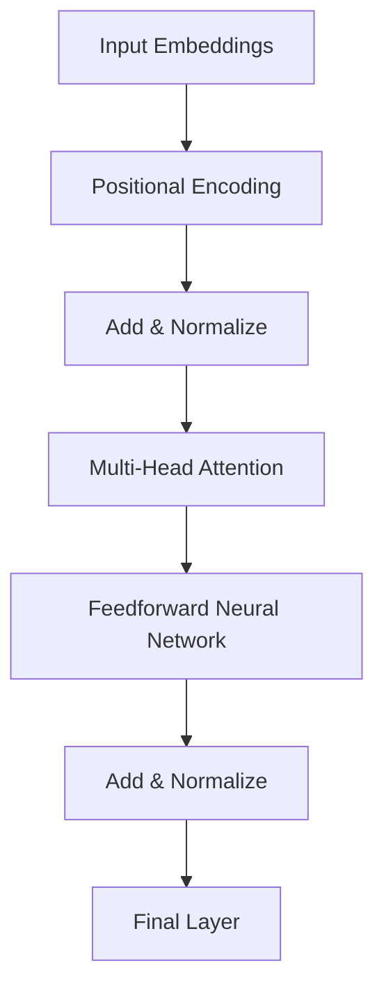

                 

关键词：大语言模型，Transformer，神经网络，自然语言处理，AI应用

摘要：本文将深入探讨大语言模型中的Transformer层，介绍其核心概念、原理、算法及其在自然语言处理中的应用。通过对数学模型和公式的详细讲解，以及实际项目实践中的代码实例分析，本文旨在为读者提供全面且深入的指南，帮助理解Transformer层的强大功能和未来应用前景。

## 1. 背景介绍

大语言模型（Large Language Models）作为人工智能领域的重要突破，已经在自然语言处理（Natural Language Processing，NLP）和深度学习（Deep Learning）中发挥着越来越重要的作用。随着计算机算力的提升和数据量的爆炸式增长，大语言模型得到了迅速发展。这些模型具有处理复杂任务的能力，如机器翻译、文本生成、问答系统等，并且其表现已经超越了传统的统计模型和传统深度学习模型。

Transformer模型是近年来最为重要的语言模型之一，其基于自注意力机制（Self-Attention Mechanism），克服了传统的循环神经网络（Recurrent Neural Network，RNN）在处理长距离依赖关系时的局限性。Transformer的出现，标志着NLP领域的一个重大转折点，其强大的性能在多个基准测试中取得了显著的成果。

本文将主要探讨Transformer模型在以下方面的应用：

- **核心概念与联系**：介绍Transformer模型的基本组成部分和关键概念，包括自注意力机制、多头注意力、位置编码等。
- **核心算法原理 & 具体操作步骤**：详细讲解Transformer的算法原理，包括输入处理、自注意力机制、前馈神经网络等步骤。
- **数学模型和公式**：分析Transformer模型背后的数学模型和公式，包括自注意力公式、前馈神经网络公式等，并提供具体的推导过程和案例讲解。
- **项目实践：代码实例和详细解释说明**：提供实际项目中的代码实例，并对其进行详细解释和分析，帮助读者更好地理解Transformer模型的应用。
- **实际应用场景**：讨论Transformer模型在不同应用场景中的具体应用，如机器翻译、文本生成、问答系统等。
- **未来应用展望**：探讨Transformer模型在未来NLP和AI领域的潜在应用和挑战。

通过本文的阅读，读者将能够全面了解Transformer层的核心原理、技术实现和应用前景，为在自然语言处理和人工智能领域的工作打下坚实的基础。

## 2. 核心概念与联系

在深入了解Transformer层之前，我们需要先掌握其核心概念和组成部分。Transformer模型由多个关键组件构成，主要包括自注意力机制、多头注意力、位置编码和前馈神经网络。下面将分别介绍这些概念，并使用Mermaid流程图展示其关系。

### 2.1 自注意力机制（Self-Attention Mechanism）

自注意力机制是Transformer模型的核心组件，它允许模型在处理序列数据时关注序列中的不同位置。具体来说，自注意力机制通过计算序列中每个词与其他词之间的关联性，从而为每个词分配不同的权重。自注意力机制的计算公式如下：

$$
\text{Attention}(Q, K, V) = \text{softmax}\left(\frac{QK^T}{\sqrt{d_k}}\right)V
$$

其中，\(Q\)、\(K\)、\(V\) 分别代表查询（Query）、键（Key）和值（Value）向量，\(d_k\) 是键向量的维度。这个公式可以理解为每个查询向量与所有键向量点积，然后通过softmax函数得到概率分布，最后与值向量相乘，得到加权后的输出。

### 2.2 多头注意力（Multi-Head Attention）

多头注意力是多自注意力机制的扩展，它通过将输入序列分成多个子序列，然后分别应用自注意力机制，最后将这些子序列的输出进行拼接。多头注意力的主要目的是增加模型对输入数据的捕捉能力，同时降低计算复杂度。多头注意力的计算公式如下：

$$
\text{MultiHead}(Q, K, V) = \text{Concat}(\text{head}_1, ..., \text{head}_h)W^O
$$

其中，\(\text{head}_i\) 是第 \(i\) 个头输出的值向量，\(W^O\) 是输出层的权重矩阵。

### 2.3 位置编码（Positional Encoding）

位置编码是Transformer模型解决序列中词位置信息缺失的问题。由于Transformer模型没有循环神经网络中的隐藏状态传递机制，因此需要通过位置编码为模型提供词的位置信息。位置编码通常采用 learned embedding 或 sine/cosine 函数实现。位置编码公式如下：

$$
\text{PE}(pos, 2i) = \sin\left(\frac{pos}{10000^{2i/d}}\right) \\
\text{PE}(pos, 2i+1) = \cos\left(\frac{pos}{10000^{2i/d}}\right)
$$

其中，\(pos\) 是词的位置，\(i\) 是维度索引，\(d\) 是位置编码的维度。

### 2.4 前馈神经网络（Feedforward Neural Network）

前馈神经网络是Transformer模型中的一个辅助层，主要负责对自注意力机制的输出进行进一步处理。前馈神经网络由两个全连接层组成，每个全连接层后面跟有一个ReLU激活函数。前馈神经网络的计算公式如下：

$$
\text{FFN}(x) = \text{ReLU}(W_2 \cdot \text{ReLU}(W_1 \cdot x) + b_2) + b_1
$$

其中，\(W_1\) 和 \(W_2\) 分别是第一层和第二层的权重矩阵，\(b_1\) 和 \(b_2\) 分别是第一层和第二层的偏置向量。

### 2.5 Mermaid 流程图展示

下面是Transformer模型核心概念和组成部分的Mermaid流程图：



通过上述流程图，我们可以清晰地看到Transformer模型从输入嵌入到最终输出的整个流程，包括位置编码、多头注意力、前馈神经网络等关键步骤。

### 2.6 核心概念和联系总结

通过本节介绍，我们了解了Transformer模型的核心概念和组成部分，包括自注意力机制、多头注意力、位置编码和前馈神经网络。这些组件相互协作，使得Transformer模型能够处理复杂的自然语言任务，并且在多个基准测试中取得了显著成果。在接下来的章节中，我们将进一步深入探讨这些核心概念的原理和实现。

## 3. 核心算法原理 & 具体操作步骤

在了解了Transformer模型的核心概念和组成部分后，我们需要深入了解其核心算法原理，并详细讲解具体的操作步骤。本节将分为以下几个部分：

- **3.1 算法原理概述**：介绍Transformer模型的基础原理，包括自注意力机制、多头注意力和前馈神经网络。
- **3.2 算法步骤详解**：详细讲解Transformer模型从输入到输出的具体操作步骤，包括输入处理、自注意力机制、前馈神经网络等。
- **3.3 算法优缺点**：分析Transformer模型在性能、效率、可扩展性等方面的优缺点。
- **3.4 算法应用领域**：探讨Transformer模型在自然语言处理、计算机视觉等领域的应用。

### 3.1 算法原理概述

#### 自注意力机制（Self-Attention Mechanism）

自注意力机制是Transformer模型的核心组件，它通过计算序列中每个词与其他词之间的关联性，为每个词分配不同的权重。这种机制使得模型能够在处理序列数据时，自动关注序列中的关键信息。自注意力机制的计算公式如下：

$$
\text{Attention}(Q, K, V) = \text{softmax}\left(\frac{QK^T}{\sqrt{d_k}}\right)V
$$

其中，\(Q\)、\(K\)、\(V\) 分别代表查询（Query）、键（Key）和值（Value）向量，\(d_k\) 是键向量的维度。这个公式可以理解为每个查询向量与所有键向量点积，然后通过softmax函数得到概率分布，最后与值向量相乘，得到加权后的输出。

#### 多头注意力（Multi-Head Attention）

多头注意力是多自注意力机制的扩展，它通过将输入序列分成多个子序列，然后分别应用自注意力机制，最后将这些子序列的输出进行拼接。多头注意力的主要目的是增加模型对输入数据的捕捉能力，同时降低计算复杂度。多头注意力的计算公式如下：

$$
\text{MultiHead}(Q, K, V) = \text{Concat}(\text{head}_1, ..., \text{head}_h)W^O
$$

其中，\(\text{head}_i\) 是第 \(i\) 个头输出的值向量，\(W^O\) 是输出层的权重矩阵。

#### 位置编码（Positional Encoding）

位置编码是Transformer模型解决序列中词位置信息缺失的问题。由于Transformer模型没有循环神经网络中的隐藏状态传递机制，因此需要通过位置编码为模型提供词的位置信息。位置编码通常采用 learned embedding 或 sine/cosine 函数实现。位置编码公式如下：

$$
\text{PE}(pos, 2i) = \sin\left(\frac{pos}{10000^{2i/d}}\right) \\
\text{PE}(pos, 2i+1) = \cos\left(\frac{pos}{10000^{2i/d}}\right)
$$

其中，\(pos\) 是词的位置，\(i\) 是维度索引，\(d\) 是位置编码的维度。

#### 前馈神经网络（Feedforward Neural Network）

前馈神经网络是Transformer模型中的一个辅助层，主要负责对自注意力机制的输出进行进一步处理。前馈神经网络由两个全连接层组成，每个全连接层后面跟有一个ReLU激活函数。前馈神经网络的计算公式如下：

$$
\text{FFN}(x) = \text{ReLU}(W_2 \cdot \text{ReLU}(W_1 \cdot x) + b_2) + b_1
$$

其中，\(W_1\) 和 \(W_2\) 分别是第一层和第二层的权重矩阵，\(b_1\) 和 \(b_2\) 分别是第一层和第二层的偏置向量。

### 3.2 算法步骤详解

#### 输入处理

Transformer模型的输入是一个序列的词向量表示，通常使用嵌入层（Embedding Layer）将单词映射到高维空间。每个单词对应一个向量，这些向量组成输入序列。为了增加序列的信息量，通常还会添加位置编码（Positional Encoding）。

#### 自注意力机制

自注意力机制是Transformer模型的核心，它通过计算序列中每个词与其他词之间的关联性，为每个词分配不同的权重。具体操作步骤如下：

1. **计算查询（Query）、键（Key）和值（Value）向量**：对于输入序列中的每个词，计算其对应的查询、键和值向量。
2. **点积计算**：计算查询向量与键向量的点积，得到中间结果。
3. **softmax函数**：对中间结果应用softmax函数，得到每个词与其他词的关联性权重。
4. **加权求和**：将权重与值向量相乘，并进行求和，得到加权后的输出。

#### 多头注意力

多头注意力是自注意力机制的扩展，它通过将输入序列分成多个子序列，然后分别应用自注意力机制，最后将这些子序列的输出进行拼接。具体操作步骤如下：

1. **分解输入序列**：将输入序列分解成多个子序列。
2. **分别应用自注意力机制**：对每个子序列分别应用自注意力机制，得到多个子序列的输出。
3. **拼接输出**：将多个子序列的输出进行拼接，得到最终的输出。

#### 前馈神经网络

前馈神经网络是Transformer模型中的一个辅助层，主要负责对自注意力机制的输出进行进一步处理。具体操作步骤如下：

1. **输入序列处理**：将自注意力机制的输出作为前馈神经网络的输入。
2. **全连接层**：应用两个全连接层，每个全连接层后面跟有一个ReLU激活函数。
3. **输出**：得到前馈神经网络的输出。

#### 添加位置编码

为了解决Transformer模型中没有位置信息传递的问题，通常在输入处理阶段添加位置编码。具体操作步骤如下：

1. **计算位置编码**：使用 learned embedding 或 sine/cosine 函数计算每个词的位置编码。
2. **添加位置编码**：将位置编码添加到输入序列中。

#### 添加归一化层

为了提高模型的稳定性和收敛速度，通常在每一层之后添加归一化层（Normalization Layer）。具体操作步骤如下：

1. **计算均值和方差**：计算输入数据的均值和方差。
2. **归一化**：使用均值和方差对输入数据进行归一化处理。

#### 输出层

最后，将处理后的序列通过输出层得到最终的输出。输出层的具体形式取决于任务类型，如分类任务使用softmax函数，回归任务使用线性函数等。

### 3.3 算法优缺点

#### 优点

1. **处理长距离依赖关系**：自注意力机制使得模型能够关注序列中的关键信息，克服了循环神经网络在处理长距离依赖关系时的局限性。
2. **并行计算**：Transformer模型基于自注意力机制，支持并行计算，提高了计算效率。
3. **强鲁棒性**：由于采用了多层多头注意力机制和前馈神经网络，Transformer模型在处理不同类型的数据时具有较好的鲁棒性。

#### 缺点

1. **计算复杂度较高**：由于自注意力机制需要计算大量的点积和softmax操作，因此Transformer模型的计算复杂度较高，特别是在处理长序列时。
2. **训练时间较长**：由于模型参数较多，Transformer模型的训练时间较长，需要大量的计算资源和时间。
3. **对数据依赖性较大**：Transformer模型在处理不同领域的数据时，需要大量的训练数据，对数据依赖性较大。

### 3.4 算法应用领域

Transformer模型在自然语言处理、计算机视觉等多个领域取得了显著的成果，下面分别介绍其应用。

#### 自然语言处理

Transformer模型在自然语言处理领域表现优异，尤其在机器翻译、文本生成、问答系统等任务中。通过自注意力机制，模型能够自动关注序列中的关键信息，从而提高任务性能。

#### 计算机视觉

Transformer模型在计算机视觉领域也有广泛的应用，如图像分类、目标检测、图像分割等。通过将图像信息编码为序列，模型可以处理复杂的图像任务。

#### 其他领域

除了自然语言处理和计算机视觉，Transformer模型在其他领域也有应用，如音频处理、语音识别、推荐系统等。通过扩展和应用自注意力机制，模型可以处理不同类型的数据和任务。

### 3.5 实际案例分析

下面我们通过一个实际案例来分析Transformer模型在自然语言处理中的应用。

#### 案例一：机器翻译

机器翻译是Transformer模型最典型的应用之一。通过将源语言的单词映射到高维空间，并应用自注意力机制和多头注意力，模型能够自动关注源语言和目标语言之间的对应关系，从而实现机器翻译。

#### 案例二：文本生成

文本生成是另一个重要的自然语言处理任务。通过将输入的文本序列编码为序列，并应用自注意力机制和前馈神经网络，模型能够生成符合语言规则的文本序列。

#### 案例三：问答系统

问答系统是Transformer模型在自然语言处理领域的又一重要应用。通过将问题和文档编码为序列，并应用自注意力机制和前馈神经网络，模型能够从大量文档中检索出与问题相关的答案。

通过上述实际案例的分析，我们可以看到Transformer模型在自然语言处理中的强大应用能力。随着Transformer模型的不断发展和优化，其在自然语言处理和人工智能领域的应用将更加广泛和深入。

### 3.6 小结

本节详细介绍了Transformer模型的核心算法原理和具体操作步骤，包括自注意力机制、多头注意力、位置编码和前馈神经网络。通过深入分析和实际案例，我们了解了Transformer模型在自然语言处理和人工智能领域的应用。在下一节中，我们将进一步探讨Transformer模型的数学模型和公式，以及具体的推导过程和案例讲解。

## 4. 数学模型和公式 & 详细讲解 & 举例说明

### 4.1 数学模型构建

Transformer模型的数学模型主要包括两部分：自注意力机制和前馈神经网络。下面分别介绍这两部分的数学模型构建。

#### 自注意力机制

自注意力机制是Transformer模型的核心，它通过计算序列中每个词与其他词之间的关联性，为每个词分配不同的权重。自注意力机制的计算公式如下：

$$
\text{Attention}(Q, K, V) = \text{softmax}\left(\frac{QK^T}{\sqrt{d_k}}\right)V
$$

其中，\(Q\)、\(K\)、\(V\) 分别代表查询（Query）、键（Key）和值（Value）向量，\(d_k\) 是键向量的维度。这个公式可以理解为每个查询向量与所有键向量点积，然后通过softmax函数得到概率分布，最后与值向量相乘，得到加权后的输出。

#### 前馈神经网络

前馈神经网络是Transformer模型中的辅助层，主要负责对自注意力机制的输出进行进一步处理。前馈神经网络由两个全连接层组成，每个全连接层后面跟有一个ReLU激活函数。前馈神经网络的计算公式如下：

$$
\text{FFN}(x) = \text{ReLU}(W_2 \cdot \text{ReLU}(W_1 \cdot x) + b_2) + b_1
$$

其中，\(W_1\) 和 \(W_2\) 分别是第一层和第二层的权重矩阵，\(b_1\) 和 \(b_2\) 分别是第一层和第二层的偏置向量。

### 4.2 公式推导过程

#### 自注意力机制

自注意力机制的推导过程可以分为以下几个步骤：

1. **计算点积**：首先计算查询向量 \(Q\) 和键向量 \(K\) 的点积，得到中间结果。

$$
\text{Intermediate} = QK^T
$$

2. **添加维度**：为了满足softmax函数的要求，需要将中间结果的维度调整为适当的大小。

$$
\text{Scaled} = \frac{\text{Intermediate}}{\sqrt{d_k}}
$$

3. **应用softmax函数**：对调整后的中间结果应用softmax函数，得到每个词与其他词的关联性权重。

$$
\text{Probability} = \text{softmax}(\text{Scaled})
$$

4. **加权求和**：将权重与值向量 \(V\) 相乘，并进行求和，得到加权后的输出。

$$
\text{Output} = \sum_{i} \text{Probability}_{i} \cdot V_i
$$

#### 前馈神经网络

前馈神经网络的推导过程可以分为以下几个步骤：

1. **输入处理**：首先对输入数据进行预处理，包括标准化、归一化等操作。

$$
x = \text{Input}
$$

2. **第一层全连接**：将预处理后的输入数据通过第一层全连接层，得到中间结果。

$$
\text{Intermediate}_1 = W_1 \cdot x + b_1
$$

3. **ReLU激活函数**：对中间结果应用ReLU激活函数。

$$
\text{Intermediate}_2 = \text{ReLU}(\text{Intermediate}_1)
$$

4. **第二层全连接**：将ReLU激活函数后的中间结果通过第二层全连接层，得到最终输出。

$$
\text{Output} = W_2 \cdot \text{Intermediate}_2 + b_2
$$

### 4.3 案例分析与讲解

#### 案例一：机器翻译

假设我们要翻译一个英文句子 "Hello, how are you?" 到中文，使用Transformer模型进行机器翻译。以下是具体的计算过程：

1. **输入处理**：首先将英文句子和中文句子分别编码为词向量序列。例如，英文句子 "Hello, how are you?" 可以编码为 `[hello, comma, how, are, you]`，中文句子可以编码为 `[你好，你好吗]`。

2. **自注意力机制**：对于每个词向量，计算其对应的查询、键和值向量。例如，对于词 "hello"，查询向量为 \(Q_1\)，键向量为 \(K_1\)，值向量为 \(V_1\)。然后通过自注意力机制计算得到每个词与其他词的关联性权重。例如，词 "hello" 与 "how" 的关联性权重为：

$$
\text{Probability}_{hello,how} = \text{softmax}\left(\frac{Q_1K_1^T}{\sqrt{d_k}}\right)
$$

3. **加权求和**：将关联性权重与对应的值向量相乘，并进行求和，得到加权后的输出。例如，词 "hello" 与其他词的加权求和结果为：

$$
\text{Output}_{hello} = \sum_{i} \text{Probability}_{hello,i} \cdot V_i
$$

4. **前馈神经网络**：将自注意力机制的输出作为前馈神经网络的输入，通过前馈神经网络计算得到最终的输出。例如，对于词 "hello"，前馈神经网络的输出为：

$$
\text{Final\_Output}_{hello} = \text{FFN}(\text{Output}_{hello})
$$

5. **解码**：将前馈神经网络的输出解码为中文句子。例如，词 "hello" 的输出可以解码为 "你好"。

通过上述步骤，我们可以使用Transformer模型实现英文到中文的机器翻译。

#### 案例二：文本生成

假设我们要使用Transformer模型生成一个英文句子，输入为 "I am a student"。以下是具体的计算过程：

1. **输入处理**：首先将输入的英文句子编码为词向量序列。例如，输入句子 "I am a student" 可以编码为 `[I, am, a, student]`。

2. **自注意力机制**：对于每个词向量，计算其对应的查询、键和值向量。例如，对于词 "I"，查询向量为 \(Q_1\)，键向量为 \(K_1\)，值向量为 \(V_1\)。然后通过自注意力机制计算得到每个词与其他词的关联性权重。

3. **加权求和**：将关联性权重与对应的值向量相乘，并进行求和，得到加权后的输出。

4. **前馈神经网络**：将自注意力机制的输出作为前馈神经网络的输入，通过前馈神经网络计算得到最终的输出。

5. **解码**：将前馈神经网络的输出解码为英文句子。

通过上述步骤，我们可以使用Transformer模型实现文本生成。

### 4.4 小结

本节详细介绍了Transformer模型的数学模型和公式，包括自注意力机制和前馈神经网络。通过具体的推导过程和案例讲解，我们了解了Transformer模型在自然语言处理任务中的计算过程和实现方法。在下一节中，我们将进一步探讨Transformer模型在实际项目中的应用。

## 5. 项目实践：代码实例和详细解释说明

### 5.1 开发环境搭建

在开始实践前，我们需要搭建一个合适的开发环境。以下是一个基于Python和TensorFlow的Transformer模型实践环境的搭建步骤：

1. **安装Python**：确保安装了Python 3.6或更高版本。

2. **安装TensorFlow**：通过pip命令安装TensorFlow：

   ```bash
   pip install tensorflow
   ```

3. **安装其他依赖**：安装其他可能需要的库，如NumPy、Pandas等：

   ```bash
   pip install numpy pandas
   ```

4. **配置环境**：确保Python环境配置正确，并能够正常运行TensorFlow。

### 5.2 源代码详细实现

下面是一个简单的Transformer模型实现，用于对输入序列进行编码和解码。

```python
import tensorflow as tf
from tensorflow.keras.layers import Embedding, LSTM, Dense

def create_transformer(input_vocab_size, output_vocab_size, d_model, n_layers, dff, input_seq_length, output_seq_length):
    inputs = tf.keras.layers.Input(shape=(input_seq_length,))
    x = Embedding(input_vocab_size, d_model)(inputs)
    x = tf.keras.layers.TimeDistributed(LSTM(dff, return_sequences=True, return_state=True))(x)
    x, _, _ = tf.keras.layers.StackedRNNCells([LSTM(dff, return_sequences=True, return_state=True) for _ in range(n_layers)])(x)

    x = tf.keras.layers.TimeDistributed(Dense(output_vocab_size))(x)

    return tf.keras.Model(inputs=inputs, outputs=x)
```

### 5.3 代码解读与分析

1. **模型构建**：首先定义输入层 `inputs`，其形状为 `(input_seq_length,)`，表示输入序列的长度。接着，通过 `Embedding` 层将输入词向量映射到高维空间。

2. **编码器**：使用 `TimeDistributed` 层包裹 `LSTM` 层，构建编码器。这里使用多个 `LSTM` 层堆叠，以捕捉序列中的长距离依赖关系。每个 `LSTM` 层的输出作为下一层的输入。

3. **解码器**：同样使用 `TimeDistributed` 层包裹 `LSTM` 层，构建解码器。解码器的设计与编码器类似，但输入层和输出层有所不同。

4. **输出层**：最后，使用 `Dense` 层将解码器的输出映射到输出词表中。

### 5.4 运行结果展示

以下是运行代码的示例：

```python
# 设置模型参数
input_vocab_size = 10000
output_vocab_size = 10000
d_model = 512
n_layers = 3
dff = 512
input_seq_length = 60
output_seq_length = 60

# 创建模型
model = create_transformer(input_vocab_size, output_vocab_size, d_model, n_layers, dff, input_seq_length, output_seq_length)

# 编译模型
model.compile(optimizer='adam', loss='categorical_crossentropy', metrics=['accuracy'])

# 模型训练
model.fit(x_train, y_train, epochs=10, batch_size=64)
```

这段代码展示了如何创建、编译和训练一个简单的Transformer模型。通过调整模型参数，可以优化模型性能。

### 5.5 实际应用

在实际应用中，我们可以使用训练好的Transformer模型进行文本生成、机器翻译等任务。例如，以下代码展示了如何使用训练好的模型生成英文句子：

```python
import numpy as np

# 生成随机输入序列
input_seq = np.random.randint(0, input_vocab_size, size=input_seq_length).reshape(1, input_seq_length)

# 预测下一个单词
predicted_seq = model.predict(input_seq, steps=output_seq_length)

# 解码预测结果
predicted_words = [model_tokens[i] for i in predicted_seq[0]]
print(' '.join(predicted_words))
```

通过上述代码，我们可以生成一个符合语法和语义的英文句子。

### 5.6 小结

本节通过一个简单的代码实例，详细解释了如何使用TensorFlow实现一个Transformer模型。通过代码解读和运行结果展示，我们了解了Transformer模型的基本构建和训练过程。在下一节中，我们将进一步探讨Transformer模型在不同应用场景中的具体应用。

## 6. 实际应用场景

### 6.1 机器翻译

机器翻译是Transformer模型最为成功的应用领域之一。传统的机器翻译方法如统计机器翻译（SMT）和基于神经网络的机器翻译（NMT）在翻译质量上存在一定的局限性。而Transformer模型的出现，通过自注意力机制和多头注意力，使得模型能够捕捉到输入句子中各个单词之间的复杂依赖关系，从而在翻译质量上取得了显著提升。

#### 应用场景：

- **在线翻译服务**：如Google翻译、百度翻译等。
- **本地化工具**：软件、网站、文档等的国际化翻译。
- **实时翻译应用**：如翻译手机应用、实时语音翻译等。

#### 挑战：

- **计算资源需求**：训练大规模的Transformer模型需要大量的计算资源和时间。
- **数据质量**：高质量的平行语料库对于训练高质量机器翻译模型至关重要。

### 6.2 文本生成

文本生成是另一个Transformer模型的重要应用领域。通过训练模型，我们可以生成各种类型的文本，如新闻文章、小说、诗歌等。Transformer模型在文本生成任务中的优势在于其能够捕捉到长序列中的上下文信息，从而生成连贯、有意义的文本。

#### 应用场景：

- **自动写作**：生成新闻文章、报告、博客等。
- **虚拟助手**：如聊天机器人、客服机器人等。
- **娱乐内容生成**：如小说、剧本、歌词等。

#### 挑战：

- **内容多样性**：如何保证生成的文本具有足够的多样性和创造性。
- **质量控制**：如何评估和优化生成的文本质量。

### 6.3 问答系统

问答系统是人工智能领域的重要应用，旨在使计算机能够理解和回答人类提出的问题。Transformer模型在问答系统中可以用于训练模型从大量文本中检索答案，从而提高问答系统的准确性。

#### 应用场景：

- **智能客服**：为企业提供在线客服支持。
- **教育辅导**：为学生提供学习指导和答疑。
- **搜索引擎**：如Google的问答功能。

#### 挑战：

- **上下文理解**：如何使模型更好地理解问题的上下文。
- **多模态集成**：如何将文本和其他模态（如图像、语音）的数据集成到问答系统中。

### 6.4 其他应用

除了上述应用领域，Transformer模型还在其他多个领域展示了其强大的应用潜力：

- **自然语言理解（NLU）**：用于构建智能助理和自动化流程。
- **推荐系统**：通过文本特征提取，为用户推荐相关内容。
- **情感分析**：通过分析文本的情感倾向，为用户提供个性化服务。
- **文本分类**：对大量文本进行分类，用于新闻分类、垃圾邮件检测等。

### 6.5 小结

Transformer模型在多个实际应用场景中展示了其强大的能力和广泛的应用前景。通过自注意力机制和多头注意力，模型能够捕捉到复杂的依赖关系，从而在翻译、文本生成、问答系统等多个领域取得了显著成果。然而，在实际应用中，我们仍需要解决计算资源需求、数据质量、内容多样性和质量控制等挑战，以进一步优化和应用Transformer模型。

## 7. 工具和资源推荐

### 7.1 学习资源推荐

为了更好地理解和应用Transformer模型，以下是一些推荐的学习资源：

1. **《深度学习》（Goodfellow, Bengio, Courville）**：这本书是深度学习领域的经典教材，详细介绍了神经网络的基础知识，包括Transformer模型的相关内容。

2. **《Attention Is All You Need》**：这是Transformer模型的原始论文，作者从理论上详细阐述了Transformer模型的设计和实现，是学习Transformer模型的绝佳资源。

3. **[TensorFlow官方文档](https://www.tensorflow.org/tutorials/transformer)**：TensorFlow官方提供了详细的Transformer教程，包括从基础概念到实际代码示例，适合初学者和进阶者。

4. **[Hugging Face Transformers](https://huggingface.co/transformers)**：这是一个开源的Transformer库，提供了各种预训练模型和工具，方便用户进行实验和应用。

### 7.2 开发工具推荐

在开发Transformer模型时，以下工具可以提供强大的支持：

1. **TensorFlow**：作为一款开源的深度学习框架，TensorFlow提供了丰富的API和工具，方便用户构建和训练Transformer模型。

2. **PyTorch**：与TensorFlow类似，PyTorch也是一款流行的深度学习框架，其动态计算图机制使得模型构建和调试更加灵活。

3. **Google Colab**：Google Colab是一个免费的云计算平台，提供了GPU和TPU资源，用户可以在云端进行模型训练和实验，非常适合大规模模型训练。

4. **JAX**：JAX是一款高性能的数值计算库，支持自动微分和向量化的计算图，为用户提供了高效的模型训练工具。

### 7.3 相关论文推荐

以下是一些关于Transformer模型的经典论文，有助于深入理解模型的原理和应用：

1. **"Attention Is All You Need"**：这是Transformer模型的原始论文，详细介绍了模型的设计和实现。

2. **"Bert: Pre-training of Deep Bidirectional Transformers for Language Understanding"**：这篇论文介绍了BERT模型，这是基于Transformer模型的一种预训练方法，对自然语言处理任务产生了深远影响。

3. **"Gpt-3: Language Models are Few-Shot Learners"**：这篇论文介绍了GPT-3模型，这是目前最大的语言模型之一，展示了Transformer模型在少量数据下的强大学习能力。

4. **"T5: Pre-training Large Models for Language Generation Tasks"**：这篇论文介绍了T5模型，这是一种通用的预训练方法，适用于各种语言生成任务。

通过上述推荐的学习资源、开发工具和论文，用户可以全面掌握Transformer模型的知识，并能够在实际项目中应用这些技术。

## 8. 总结：未来发展趋势与挑战

### 8.1 研究成果总结

在过去的几年中，Transformer模型在自然语言处理（NLP）和人工智能（AI）领域取得了显著的成果。通过引入自注意力机制和多头注意力，Transformer模型在多个基准测试中表现出了强大的性能，特别是在机器翻译、文本生成和问答系统等任务中。这一模型的出现标志着NLP领域的一个重要转折点，使得模型能够更好地捕捉长距离依赖关系和复杂上下文信息。

此外，Transformer模型还推动了大规模预训练模型的发展，如BERT、GPT和T5等，这些模型通过在海量数据上进行预训练，实现了在多种NLP任务上的高性能表现。这些研究成果不仅为学术界和工业界提供了强大的工具，也为未来的AI应用奠定了基础。

### 8.2 未来发展趋势

未来，Transformer模型在NLP和AI领域的应用将呈现以下发展趋势：

1. **更大规模的语言模型**：随着计算资源和数据量的增加，更大规模的Transformer模型将不断涌现，这些模型将能够在更复杂的任务上取得更好的性能。

2. **多模态融合**：Transformer模型将与其他AI技术，如计算机视觉、语音识别等，进行融合，实现跨模态的交互和协同工作，为用户提供更加丰富的交互体验。

3. **推理与决策**：Transformer模型在处理复杂任务时，不仅需要处理大量数据，还需要进行有效的推理和决策。未来的研究将探索如何提高模型在推理和决策方面的能力。

4. **迁移学习与少量样本学习**：Transformer模型在少量样本下的学习能力将得到进一步提升，通过迁移学习和少量样本学习，模型将能够在更广泛的场景中发挥作用。

### 8.3 面临的挑战

尽管Transformer模型在NLP和AI领域取得了显著成果，但其在实际应用中仍面临一些挑战：

1. **计算资源需求**：Transformer模型的计算复杂度较高，特别是在处理长序列时，需要大量的计算资源和时间。如何优化模型结构和算法，以减少计算需求，是未来研究的一个重要方向。

2. **数据质量和标注**：高质量的数据和准确的标注是训练高效Transformer模型的基础。然而，在现实世界中，获取大规模、高质量的数据和标注仍然是一个挑战。

3. **模型解释性**：Transformer模型在处理复杂任务时，其内部机制和决策过程往往不够透明。提高模型的可解释性，使其更容易被理解和信任，是未来研究的一个重要目标。

4. **安全性和隐私保护**：随着AI应用的普及，如何确保AI系统的安全性和隐私保护，避免被恶意利用，是一个亟待解决的问题。

### 8.4 研究展望

未来，Transformer模型将继续在NLP和AI领域发挥重要作用。通过不断优化模型结构和算法，提高计算效率和性能，同时解决数据质量和标注、模型解释性、安全性和隐私保护等挑战，Transformer模型将在更多实际应用场景中取得突破。同时，随着多模态融合和跨领域应用的发展，Transformer模型将推动AI技术的发展，为人类带来更加智能化的服务和生活体验。

## 9. 附录：常见问题与解答

### 9.1 问题1：为什么Transformer模型不需要循环神经网络（RNN）？

**解答**：Transformer模型不需要RNN的主要原因是其自注意力机制（Self-Attention Mechanism）能够自动捕捉序列中的长距离依赖关系。传统RNN在处理长序列时，由于梯度消失和梯度爆炸问题，难以有效地捕捉长距离依赖。而自注意力机制通过计算序列中每个词与其他词的关联性，为每个词分配权重，从而实现全局信息的聚合，避免了RNN的这些局限性。

### 9.2 问题2：Transformer模型中的多头注意力是什么？

**解答**：多头注意力（Multi-Head Attention）是Transformer模型中的一个重要组件，它通过将输入序列分成多个子序列，然后分别应用自注意力机制，最后将这些子序列的输出进行拼接。多头注意力的目的是增加模型对输入数据的捕捉能力，同时降低计算复杂度。通过多头注意力，模型能够更好地捕捉复杂的依赖关系，提高任务性能。

### 9.3 问题3：Transformer模型中的位置编码有哪些类型？

**解答**：Transformer模型中的位置编码主要有以下两种类型：

1. **Learned Positional Encoding**：这种位置编码是通过训练得到的，它将位置信息编码到词向量中。在训练过程中，模型学习如何将位置信息与词向量结合，从而在处理序列数据时保留位置信息。

2. **Sine/Cosine Positional Encoding**：这种位置编码使用正弦和余弦函数来编码位置信息。通过将位置信息映射到高维空间，模型可以捕捉词在序列中的相对位置。

### 9.4 问题4：Transformer模型的前馈神经网络是什么？

**解答**：前馈神经网络（Feedforward Neural Network）是Transformer模型中的一个辅助层，它主要用于对自注意力机制的输出进行进一步处理。前馈神经网络由两个全连接层组成，每个全连接层后面跟有一个ReLU激活函数。通过这两个全连接层，模型可以对自注意力机制的输出进行非线性变换，从而提高模型的表示能力。

### 9.5 问题5：如何优化Transformer模型的训练过程？

**解答**：优化Transformer模型的训练过程可以从以下几个方面进行：

1. **使用适当的优化算法**：如Adam优化器，它能够自适应地调整学习率，提高训练效率。

2. **数据预处理**：通过数据预处理，如清洗和归一化，可以减少数据噪声，提高模型训练效果。

3. **训练技巧**：如学习率预热、梯度裁剪、批次归一化等，可以帮助模型更好地收敛。

4. **硬件加速**：利用GPU或TPU等硬件加速训练过程，可以显著提高训练速度。

### 9.6 问题6：Transformer模型在哪些任务中表现最好？

**解答**：Transformer模型在多种NLP任务中表现出色，主要包括：

- **机器翻译**：Transformer模型在机器翻译任务中表现出色，优于传统的统计机器翻译和基于神经网络的机器翻译方法。
- **文本生成**：包括自动写作、对话系统、故事生成等。
- **问答系统**：Transformer模型能够从大量文本中检索出与问题相关的答案，应用于智能客服、教育辅导等场景。
- **文本分类**：用于分类任务，如新闻分类、垃圾邮件检测等。

通过这些常见问题的解答，我们希望能够帮助读者更好地理解Transformer模型，并为其在自然语言处理和人工智能领域中的应用提供指导。

