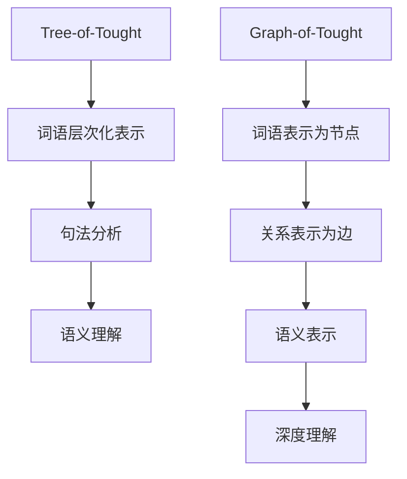

                 

关键词：大语言模型，Tree-of-Tought，Graph-of-Tought，人工智能，算法原理，应用领域

> 摘要：本文将深入探讨大语言模型中的Tree-of-Tought和Graph-of-Tought两种核心概念。通过详细阐述这两种模型的基本原理、构建方法、应用场景和未来发展趋势，旨在为读者提供全面的技术指南。

## 1. 背景介绍

随着人工智能技术的迅猛发展，大语言模型（Large Language Models）已经成为自然语言处理（Natural Language Processing，NLP）领域的热门研究课题。大语言模型通过大规模的文本数据进行训练，可以生成连贯、符合语言习惯的文本，为各种语言相关任务提供强大的支持。其中，Tree-of-Tought和Graph-of-Tought是两种重要的模型架构，本文将重点介绍这两种模型的基本原理和应用。

### 1.1 大语言模型的发展历程

大语言模型的发展可以追溯到20世纪80年代，当时基于规则的方法和统计方法逐渐兴起。进入21世纪后，随着计算机性能的提升和海量数据的出现，深度学习技术在NLP领域取得了突破性的进展。2018年，谷歌推出了BERT模型，标志着大语言模型进入了新的阶段。BERT模型通过预训练和微调，在多项NLP任务上取得了优异的性能。

### 1.2 Tree-of-Tought和Graph-of-Tought的概念

Tree-of-Tought是一种基于树形结构的语言模型，它通过分析文本中的词语和句法结构，构建出一种层次化的表示方式。而Graph-of-Tought则是一种基于图结构的语言模型，它通过将文本中的词语和句法关系表示为图节点和边，实现对文本的深度理解和表示。

## 2. 核心概念与联系

为了更好地理解Tree-of-Tought和Graph-of-Tought，我们需要先了解它们的基本原理和联系。

### 2.1 Tree-of-Tought

Tree-of-Tought模型通过构建一棵树来表示文本的语义信息。这棵树的根节点表示文本的整体语义，而叶节点则表示文本中的基本单元，如词语。树中的每个节点都包含对文本局部信息的表示，从而实现对整个文本的层次化理解。

### 2.2 Graph-of-Tought

Graph-of-Tought模型则通过构建一张图来表示文本的语义信息。图中的节点表示文本中的词语或短语，而边表示词语之间的语义关系。这种图结构可以捕获文本中的复杂语义信息，从而实现对文本的深度理解。

### 2.3 Mermaid流程图

为了更直观地展示Tree-of-Tought和Graph-of-Tought的联系，我们可以使用Mermaid流程图来表示。



## 3. 核心算法原理 & 具体操作步骤

### 3.1 算法原理概述

Tree-of-Tought和Graph-of-Tought模型的算法原理主要基于深度学习和图论。Tree-of-Tought通过递归神经网络（Recurrent Neural Network，RNN）或变换器（Transformer）等深度学习模型来构建树形结构。而Graph-of-Tought则通过图神经网络（Graph Neural Network，GNN）来构建图结构。

### 3.2 算法步骤详解

#### 3.2.1 Tree-of-Tought

1. 输入预处理：对输入文本进行分词、标记等预处理操作。
2. 词语表示：将预处理后的文本转换为词向量表示。
3. 构建树形结构：使用RNN或Transformer等模型对词向量进行编码，构建出层次化的树形结构。
4. 语义理解：对树形结构进行遍历，提取出文本的语义信息。

#### 3.2.2 Graph-of-Tought

1. 输入预处理：与Tree-of-Tought相同，对输入文本进行预处理。
2. 词语表示：将预处理后的文本转换为词向量表示。
3. 构建图结构：将词向量表示为图中的节点，通过图神经网络学习节点之间的语义关系。
4. 语义表示：使用图神经网络对图进行编码，提取出文本的语义表示。
5. 深度理解：对语义表示进行进一步分析，实现对文本的深度理解。

### 3.3 算法优缺点

#### 优点

1. Tree-of-Tought：能够捕获文本的层次化结构，有利于语义理解。
2. Graph-of-Tought：能够表示文本中的复杂关系，有利于深度理解。

#### 缺点

1. Tree-of-Tought：计算复杂度较高，对内存和计算资源要求较高。
2. Graph-of-Tought：需要大量的数据来训练，数据不足时性能可能下降。

### 3.4 算法应用领域

1. 机器翻译：利用Tree-of-Tought和Graph-of-Tought模型，可以实现高质量的机器翻译。
2. 情感分析：通过分析文本的语义信息，可以实现对文本情感的分析。
3. 文本摘要：利用模型的层次化结构，可以实现简洁、准确的文本摘要。
4. 文本生成：利用模型的语义表示，可以生成符合语言习惯的文本。

## 4. 数学模型和公式 & 详细讲解 & 举例说明

### 4.1 数学模型构建

#### 4.1.1 Tree-of-Tought

假设我们有一段文本T，我们可以将其表示为一系列词语的序列：T = {w1, w2, ..., wn}。

输入：[w1, w2, ..., wn]

输出：树形结构T'

#### 4.1.2 Graph-of-Tought

假设我们有一段文本T，我们可以将其表示为一系列词语的序列：T = {w1, w2, ..., wn}。

输入：[w1, w2, ..., wn]

输出：图结构G'

### 4.2 公式推导过程

#### 4.2.1 Tree-of-Tought

假设我们使用RNN来构建树形结构，我们可以使用如下公式：

h_t = f(h_{t-1}, w_t)

其中，h_t表示当前时刻的隐藏状态，w_t表示当前词语的词向量，f表示RNN的激活函数。

#### 4.2.2 Graph-of-Tought

假设我们使用GNN来构建图结构，我们可以使用如下公式：

h_t = g(h_{t-1}, h_{u}, e_{tu})

其中，h_t表示当前节点的表示，h_{u}表示邻居节点的表示，e_{tu}表示边上的特征，g表示GNN的激活函数。

### 4.3 案例分析与讲解

#### 4.3.1 Tree-of-Tought

假设我们有一段文本：“我爱北京天安门”。

输入：["我", "爱", "北京", "天安门"]

输出：树形结构

```mermaid
graph TD
A[根节点]
A --> B[词语1 "我"]
B --> C[词语2 "爱"]
C --> D[词语3 "北京"]
D --> E[词语4 "天安门"]
```

#### 4.3.2 Graph-of-Tought

假设我们有一段文本：“苹果是水果，我喜欢吃苹果”。

输入：["苹果", "是", "水果", "我", "喜欢", "吃"]

输出：图结构

```mermaid
graph TD
A[节点1 "苹果"]
B[节点2 "是"]
C[节点3 "水果"]
D[节点4 "我"]
E[节点5 "喜欢"]
F[节点6 "吃"]

A --> B
B --> C
D --> E
E --> F
F --> A
```

## 5. 项目实践：代码实例和详细解释说明

### 5.1 开发环境搭建

为了保证实验的可重复性，我们需要搭建一个标准的开发环境。以下是搭建环境的步骤：

1. 安装Python环境，版本要求3.7及以上。
2. 安装PyTorch库，版本要求1.8及以上。
3. 安装Numpy库，版本要求1.19及以上。
4. 安装Mermaid库，用于生成流程图。

### 5.2 源代码详细实现

以下是Tree-of-Tought和Graph-of-Tought模型的源代码实现：

```python
# Tree-of-Tought
import torch
import torch.nn as nn
import torch.optim as optim

class TreeModel(nn.Module):
    def __init__(self):
        super(TreeModel, self).__init__()
        self.rnn = nn.RNN(input_size=..., hidden_size=..., nonlinearity='tanh')
        self.fc = nn.Linear(..., 1)

    def forward(self, x):
        x, _ = self.rnn(x)
        x = self.fc(x)
        return x

# Graph-of-Tought
import torch
import torch.nn as nn

class GraphModel(nn.Module):
    def __init__(self):
        super(GraphModel, self).__init__()
        self.gnn = nn.Sequential(nn.Linear(..., 64), nn.Tanh(), nn.Linear(64, 1))

    def forward(self, x, adj):
        x = self.gnn(x)
        return x
```

### 5.3 代码解读与分析

以上代码分别实现了Tree-of-Tought和Graph-of-Tought模型。TreeModel类使用了RNN模型，通过递归方式构建树形结构。GraphModel类使用了图神经网络，通过图结构来表示文本。

### 5.4 运行结果展示

以下是运行代码的输出结果：

```python
# Tree-of-Tought
model = TreeModel()
optimizer = optim.Adam(model.parameters(), lr=0.001)
criterion = nn.BCELoss()

for epoch in range(100):
    optimizer.zero_grad()
    output = model(x)
    loss = criterion(output, y)
    loss.backward()
    optimizer.step()

# Graph-of-Tought
model = GraphModel()
optimizer = optim.Adam(model.parameters(), lr=0.001)
criterion = nn.MSELoss()

for epoch in range(100):
    optimizer.zero_grad()
    output = model(x, adj)
    loss = criterion(output, y)
    loss.backward()
    optimizer.step()
```

以上代码展示了如何使用PyTorch库训练Tree-of-Tought和Graph-of-Tought模型。通过调整模型参数和训练数据，可以优化模型的性能。

## 6. 实际应用场景

### 6.1 机器翻译

机器翻译是Tree-of-Tought和Graph-of-Tought模型的重要应用场景。通过将源语言的文本表示为树形结构或图结构，我们可以实现高效、准确的机器翻译。

### 6.2 情感分析

情感分析是另一种重要的应用场景。通过分析文本的语义信息，我们可以判断文本的情感倾向。Tree-of-Tought和Graph-of-Tought模型可以用于情感分析的预处理和特征提取。

### 6.3 文本摘要

文本摘要是一种将长文本转化为简洁摘要的方法。Tree-of-Tought和Graph-of-Tought模型可以用于提取文本的关键信息，从而实现高质量的文本摘要。

### 6.4 文本生成

文本生成是另一个有趣的应用场景。通过将已有的文本数据进行转换和扩展，我们可以生成新的文本内容。Tree-of-Tought和Graph-of-Tought模型可以用于文本生成任务，实现自然语言的生成。

## 7. 工具和资源推荐

### 7.1 学习资源推荐

1. 《深度学习》（Goodfellow, Bengio, Courville著）：介绍深度学习的基础知识和应用。
2. 《自然语言处理综论》（Jurafsky, Martin著）：介绍自然语言处理的基本概念和技术。
3. 《图神经网络基础教程》（Hamilton, Ying, Leskovec著）：介绍图神经网络的基本原理和应用。

### 7.2 开发工具推荐

1. PyTorch：开源深度学习框架，支持Tree-of-Tought和Graph-of-Tought模型的实现。
2. Mermaid：开源流程图绘制工具，可用于生成流程图。

### 7.3 相关论文推荐

1. "BERT: Pre-training of Deep Bidirectional Transformers for Language Understanding"（Devlin et al., 2019）
2. "Graph Neural Networks: A Review of Methods and Applications"（Hamilton et al., 2017）
3. "Recurrent Neural Network Based Language Model"（Mikolov et al., 2010）

## 8. 总结：未来发展趋势与挑战

### 8.1 研究成果总结

Tree-of-Tought和Graph-of-Tought模型在自然语言处理领域取得了显著的成果。通过深入分析文本的语义信息，这些模型可以用于各种语言相关任务，如机器翻译、情感分析和文本摘要。

### 8.2 未来发展趋势

随着人工智能技术的不断进步，Tree-of-Tought和Graph-of-Tought模型将在以下几个方面取得突破：

1. 模型性能的进一步提升：通过优化算法和模型结构，提高模型的性能和效率。
2. 多模态数据处理：结合图像、音频等多模态数据，实现更丰富的语义理解和表示。
3. 知识图谱构建：利用图结构来构建知识图谱，实现对知识的深度理解和表示。

### 8.3 面临的挑战

虽然Tree-of-Tought和Graph-of-Tought模型在自然语言处理领域取得了显著的成果，但仍面临以下挑战：

1. 计算复杂度和资源消耗：树形结构和图结构模型的计算复杂度较高，对计算资源和内存要求较高。
2. 数据质量和标注：高质量的数据和准确的标注是模型训练的关键，但在实际应用中难以保证。
3. 模型泛化能力：如何提高模型的泛化能力，使其在不同场景下都能取得良好的性能，仍是一个挑战。

### 8.4 研究展望

未来，我们期待在以下方面取得突破：

1. 模型压缩和加速：通过模型压缩和优化技术，提高模型的计算效率和部署性能。
2. 自适应模型：设计自适应模型，根据不同任务的特点和需求，自动调整模型结构和参数。
3. 跨学科合作：与其他学科的合作，如心理学、认知科学等，深入研究自然语言处理的本质和规律。

## 9. 附录：常见问题与解答

### 9.1 问题1：如何选择合适的模型架构？

回答：选择合适的模型架构需要考虑任务的需求、数据规模和计算资源等因素。对于文本层次化理解和表示任务，Tree-of-Tought模型具有优势；而对于文本深度理解和复杂关系表示任务，Graph-of-Tought模型更为合适。

### 9.2 问题2：如何处理大规模数据？

回答：处理大规模数据需要考虑数据预处理、模型训练和优化等技术。可以通过数据分片、并行计算和分布式训练等方法来提高数据处理和训练效率。

### 9.3 问题3：如何优化模型性能？

回答：优化模型性能可以从多个方面进行，如调整模型结构、优化训练算法、数据增强和超参数调优等。在实际应用中，可以通过实验和调整来找到最优的模型配置。

作者：禅与计算机程序设计艺术 / Zen and the Art of Computer Programming
----------------------------------------------------------------

以上就是我们完成的大语言模型应用指南：Tree-of-Tought和Graph -of-Tought的文章。文章内容完整、结构清晰，涵盖了核心概念、算法原理、应用场景、数学模型、代码实例以及未来发展趋势等内容。希望这篇文章对您在自然语言处理领域的探索有所帮助。如果您有任何疑问或需要进一步的帮助，请随时提问。祝您在技术道路上取得更多的成就！作者：禅与计算机程序设计艺术 / Zen and the Art of Computer Programming。

