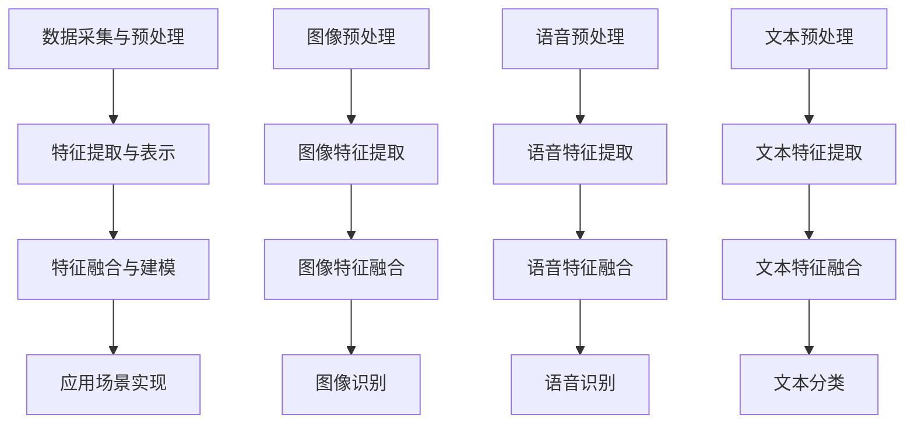

                 

关键词：大语言模型、多模态、人工智能、计算机视觉、自然语言处理、图像识别、语音识别

> 摘要：本文将探讨大语言模型中的多模态概念，介绍多模态的核心概念、联系、算法原理及应用。通过具体案例和实践，深入分析多模态技术在人工智能领域的应用前景和发展趋势。

## 1. 背景介绍

随着人工智能技术的快速发展，大语言模型已经成为自然语言处理领域的重要研究热点。然而，仅凭文本数据已无法满足人工智能系统对更多类型数据的处理需求。此时，多模态技术的引入，将推动人工智能系统在图像、语音、视频等多种数据类型的处理能力上实现质的飞跃。本文将从多模态技术的概念出发，探讨其在人工智能领域的应用，并通过具体案例和实践，深入分析多模态技术的优势与挑战。

## 2. 核心概念与联系

### 2.1 多模态技术概念

多模态技术是指通过整合多种数据类型（如文本、图像、语音、视频等）进行处理和分析的一种技术。其核心思想是利用不同模态之间的关联性和互补性，提高人工智能系统的感知能力、理解和推理能力。

### 2.2 多模态技术联系

多模态技术涉及多个领域，包括计算机视觉、自然语言处理、语音识别等。其中，计算机视觉负责处理图像和视频数据，自然语言处理负责处理文本数据，语音识别则负责处理语音数据。这些技术之间的联系如下：

1. **图像与文本的关联**：通过图像识别技术提取图像中的关键信息，如物体、场景等，再结合自然语言处理技术，对图像内容进行描述和分类。
2. **语音与文本的关联**：通过语音识别技术将语音信号转换为文本，再结合自然语言处理技术，实现对语音的理解和语义分析。
3. **视频与文本的关联**：通过视频识别技术提取视频中的关键信息，如动作、场景等，再结合自然语言处理技术，对视频内容进行描述和分类。

### 2.3 多模态技术架构

多模态技术的核心架构包括以下几个部分：

1. **数据采集与预处理**：从不同模态的数据源（如摄像头、麦克风、传感器等）收集数据，并对数据进行预处理，如图像增强、语音降噪、文本清洗等。
2. **特征提取与表示**：利用深度学习技术对预处理后的数据进行特征提取和表示，如卷积神经网络（CNN）用于图像特征提取，循环神经网络（RNN）用于语音特征提取，词向量用于文本特征提取。
3. **特征融合与建模**：将不同模态的特征进行融合，通过构建多模态模型，实现对数据的综合理解和分析。
4. **应用场景实现**：基于多模态模型，实现具体的应用场景，如图像识别、语音识别、文本分类等。

### 2.4 多模态流程图

以下是多模态技术的 Mermaid 流程图：



## 3. 核心算法原理 & 具体操作步骤

### 3.1 算法原理概述

多模态技术的核心算法主要包括特征提取、特征融合和模型训练。以下分别介绍这些算法的原理。

#### 3.1.1 特征提取

特征提取是指从原始数据中提取出有用的信息，以便于后续处理和分析。不同模态的数据采用不同的特征提取方法：

1. **图像特征提取**：常见的方法有卷积神经网络（CNN）和自编码器（Autoencoder）等。CNN 用于提取图像的局部特征，如边缘、纹理等；自编码器则通过无监督学习方式，学习图像的潜在特征表示。
2. **语音特征提取**：常见的方法有梅尔频率倒谱系数（MFCC）和循环神经网络（RNN）等。MFCC 用于提取语音信号的频率特征；RNN 用于提取语音信号的时序特征。
3. **文本特征提取**：常见的方法有词袋模型（Bag of Words）和词嵌入（Word Embedding）等。词袋模型将文本表示为单词的向量；词嵌入将单词映射为稠密的向量表示。

#### 3.1.2 特征融合

特征融合是指将不同模态的特征进行整合，以增强模型的性能。常见的方法有基于统计的方法和基于深度学习的方法：

1. **基于统计的方法**：如加权融合、拼接融合等。加权融合根据不同特征的重要性进行加权，拼接融合将不同特征直接拼接在一起。
2. **基于深度学习的方法**：如多任务学习、多模态卷积神经网络（MM-CNN）等。多任务学习同时训练多个任务，共享部分网络结构，从而实现特征融合；MM-CNN 通过多通道卷积操作，分别处理不同模态的数据，并在融合层进行特征整合。

#### 3.1.3 模型训练

模型训练是指通过大量数据进行模型训练，以优化模型参数，提高模型性能。对于多模态模型，训练过程通常包括以下几个步骤：

1. **数据准备**：将不同模态的数据进行预处理，如数据增强、归一化等。
2. **特征提取**：分别提取不同模态的特征。
3. **特征融合**：将不同模态的特征进行融合。
4. **损失函数设计**：根据应用场景，设计合适的损失函数，如交叉熵损失、均方误差等。
5. **模型优化**：通过反向传播算法，不断优化模型参数。

### 3.2 算法步骤详解

以下是多模态技术的具体操作步骤：

#### 3.2.1 数据采集与预处理

1. **图像数据采集**：从图像数据集中获取图像。
2. **图像预处理**：对图像进行大小归一化、裁剪、旋转等操作。
3. **语音数据采集**：从语音数据集中获取语音信号。
4. **语音预处理**：对语音信号进行降噪、归一化等操作。
5. **文本数据采集**：从文本数据集中获取文本。
6. **文本预处理**：对文本进行分词、去停用词、词性标注等操作。

#### 3.2.2 特征提取

1. **图像特征提取**：使用卷积神经网络（CNN）提取图像特征。
2. **语音特征提取**：使用梅尔频率倒谱系数（MFCC）提取语音特征。
3. **文本特征提取**：使用词嵌入（Word Embedding）提取文本特征。

#### 3.2.3 特征融合

1. **图像特征融合**：将图像特征通过拼接或加权融合。
2. **语音特征融合**：将语音特征通过拼接或加权融合。
3. **文本特征融合**：将文本特征通过拼接或加权融合。

#### 3.2.4 模型训练

1. **数据准备**：将预处理后的数据进行划分，形成训练集和测试集。
2. **损失函数设计**：根据应用场景，设计合适的损失函数。
3. **模型优化**：使用反向传播算法，不断优化模型参数。

### 3.3 算法优缺点

#### 优点

1. **增强感知能力**：多模态技术能够整合多种数据类型，提高人工智能系统的感知能力。
2. **提高理解能力**：多模态技术能够从不同角度获取信息，提高人工智能系统的理解和推理能力。
3. **拓展应用领域**：多模态技术可以应用于图像识别、语音识别、文本分类等众多领域。

#### 缺点

1. **数据依赖性**：多模态技术需要大量的多模态数据支持，数据获取和处理成本较高。
2. **计算复杂度**：多模态技术涉及到多种特征提取和融合方法，计算复杂度较高。

### 3.4 算法应用领域

多模态技术已经在多个领域取得显著成果，以下列举几个典型应用领域：

1. **智能问答系统**：整合文本、语音和图像数据，提高问答系统的准确率和用户体验。
2. **视频内容理解**：通过分析视频中的图像和文本信息，实现对视频内容的理解和分类。
3. **医疗影像分析**：结合医学影像和文本信息，提高疾病诊断和治疗的准确率。
4. **人机交互**：整合语音、图像和文本信息，实现更自然、高效的人机交互。

## 4. 数学模型和公式 & 详细讲解 & 举例说明

### 4.1 数学模型构建

多模态技术的数学模型主要涉及特征提取、特征融合和模型训练三个部分。

#### 4.1.1 特征提取

1. **图像特征提取**：假设输入图像为 $I \in \mathbb{R}^{H \times W \times C}$，其中 $H$、$W$ 和 $C$ 分别表示图像的高度、宽度和通道数。卷积神经网络（CNN）可以表示为：

   $$ f_{\theta}(I) = \text{ReLU}(\theta_1 \cdot \text{conv}(\theta_0 \cdot I + b_0)) $$

   其中，$\theta_0$ 和 $\theta_1$ 分别表示卷积层和激活函数的参数，$\text{conv}$ 表示卷积操作，$b_0$ 表示卷积层的偏置。

2. **语音特征提取**：假设输入语音信号为 $X \in \mathbb{R}^{T \times D}$，其中 $T$ 和 $D$ 分别表示语音信号的时长和维度。梅尔频率倒谱系数（MFCC）可以表示为：

   $$ MFCC(X) = \text{log}(\text{DCT}(\text{FFT}(X))) $$

   其中，$\text{FFT}$ 表示快速傅里叶变换，$\text{DCT}$ 表示离散余弦变换。

3. **文本特征提取**：假设输入文本为 $W \in \mathbb{R}^{V \times D}$，其中 $V$ 和 $D$ 分别表示词汇表的大小和维度。词嵌入（Word Embedding）可以表示为：

   $$ \text{WordEmbedding}(W) = \text{softmax}(\theta \cdot W + b) $$

   其中，$\theta$ 和 $b$ 分别表示词嵌入模型的参数。

#### 4.1.2 特征融合

1. **基于统计的方法**：假设输入图像特征为 $F_1 \in \mathbb{R}^{m_1 \times n}$，语音特征为 $F_2 \in \mathbb{R}^{m_2 \times n}$，文本特征为 $F_3 \in \mathbb{R}^{m_3 \times n}$。加权融合可以表示为：

   $$ F_{\text{fuse}} = \alpha_1 F_1 + \alpha_2 F_2 + \alpha_3 F_3 $$

   其中，$\alpha_1$、$\alpha_2$ 和 $\alpha_3$ 分别表示不同特征的重要性权重。

2. **基于深度学习的方法**：假设输入图像特征为 $F_1 \in \mathbb{R}^{m_1 \times n}$，语音特征为 $F_2 \in \mathbb{R}^{m_2 \times n}$，文本特征为 $F_3 \in \mathbb{R}^{m_3 \times n}$。多模态卷积神经网络（MM-CNN）可以表示为：

   $$ f_{\theta}(F_1, F_2, F_3) = \text{ReLU}(\theta_1 \cdot \text{conv}(\theta_0_1 \cdot F_1 + \theta_0_2 \cdot F_2 + \theta_0_3 \cdot F_3 + b_1)) $$

   其中，$\theta_0_1$、$\theta_0_2$ 和 $\theta_0_3$ 分别表示图像、语音和文本的特征融合层的参数，$\theta_1$ 表示激活函数的参数，$b_1$ 表示特征融合层的偏置。

#### 4.1.3 模型训练

假设输入数据为 $(X, Y)$，其中 $X$ 表示输入特征，$Y$ 表示标签。损失函数可以使用交叉熵损失（Cross-Entropy Loss）：

$$ L = -\frac{1}{N} \sum_{i=1}^{N} \sum_{j=1}^{C} y_{ij} \cdot \log(p_{ij}) $$

其中，$N$ 表示样本数量，$C$ 表示类别数量，$y_{ij}$ 表示标签 $i$ 是否为类别 $j$，$p_{ij}$ 表示模型预测的概率。

### 4.2 公式推导过程

以下是多模态技术的关键公式推导过程。

#### 4.2.1 图像特征提取

卷积神经网络（CNN）的核心操作是卷积和池化。卷积可以表示为：

$$ (f_{x} * g_{x})(t) = \int_{\mathbb{R}} f_{x}(t - \tau) g_{x}(\tau) d\tau $$

其中，$f_{x}$ 和 $g_{x}$ 分别表示输入和卷积核，$\tau$ 表示时间变量。

假设输入图像为 $I(x, y)$，卷积核为 $K(\sigma_x, \sigma_y)$，卷积操作可以表示为：

$$ (K * I)(x, y) = \int_{-\infty}^{\infty} \int_{-\infty}^{\infty} K(\sigma_x, \sigma_y) I(x - \sigma_x, y - \sigma_y) d\sigma_x d\sigma_y $$

池化可以表示为：

$$ p(x, y) = \frac{1}{c_w \cdot c_h} \sum_{i=0}^{c_w} \sum_{j=0}^{c_h} I(x + i \cdot s_x, y + j \cdot s_y) $$

其中，$c_w$ 和 $c_h$ 分别表示池化窗口的高度和宽度，$s_x$ 和 $s_y$ 分别表示池化步长。

#### 4.2.2 语音特征提取

梅尔频率倒谱系数（MFCC）是语音特征提取的重要方法。其推导过程如下：

1. **傅里叶变换**：

   $$ X(e^{j\omega}) = \int_{-\infty}^{\infty} x(t) e^{-j\omega t} dt $$

2. **快速傅里叶变换（FFT）**：

   $$ X_k = \frac{1}{N} \sum_{n=0}^{N-1} x(n) e^{-j2\pi kn/N} $$

3. **离散余弦变换（DCT）**：

   $$ Y_k = \frac{1}{\sqrt{N}} \sum_{n=0}^{N-1} x(n) \cos\left(\frac{2\pi k n}{N} + \phi\right) $$

   其中，$N$ 表示采样点数，$k$ 表示频率索引，$\phi$ 表示相位。

4. **梅尔频率倒谱系数（MFCC）**：

   $$ \text{MFCC}(k) = \log \left| \text{DCT}\left(\text{FFT}(X)\right)\right|_k $$

### 4.3 案例分析与讲解

#### 4.3.1 图像识别

假设输入图像为 $I(x, y)$，卷积核为 $K(\sigma_x, \sigma_y)$，激活函数为 ReLU。以下是一个简单的图像识别模型：

1. **输入层**：

   $$ I(x, y) $$

2. **卷积层**：

   $$ (K * I)(x, y) = \int_{-\infty}^{\infty} \int_{-\infty}^{\infty} K(\sigma_x, \sigma_y) I(x - \sigma_x, y - \sigma_y) d\sigma_x d\sigma_y $$

3. **ReLU 激活函数**：

   $$ f(x) = \max(0, x) $$

4. **池化层**：

   $$ p(x, y) = \frac{1}{c_w \cdot c_h} \sum_{i=0}^{c_w} \sum_{j=0}^{c_h} I(x + i \cdot s_x, y + j \cdot s_y) $$

5. **全连接层**：

   $$ y = \text{softmax}(\theta \cdot p(x, y) + b) $$

   其中，$\theta$ 和 $b$ 分别表示全连接层的权重和偏置。

#### 4.3.2 语音识别

假设输入语音信号为 $X(t)$，特征提取方法为 MFCC，激活函数为 ReLU。以下是一个简单的语音识别模型：

1. **输入层**：

   $$ X(t) $$

2. **MFCC 特征提取**：

   $$ \text{MFCC}(X) = \log \left| \text{DCT}\left(\text{FFT}(X)\right)\right| $$

3. **ReLU 激活函数**：

   $$ f(x) = \max(0, x) $$

4. **全连接层**：

   $$ y = \text{softmax}(\theta \cdot f(\text{MFCC}(X)) + b) $$

   其中，$\theta$ 和 $b$ 分别表示全连接层的权重和偏置。

## 5. 项目实践：代码实例和详细解释说明

### 5.1 开发环境搭建

在本文中，我们将使用 Python 编写多模态模型。以下是开发环境搭建的步骤：

1. 安装 Python：
   ```bash
   pip install python==3.8
   ```

2. 安装深度学习框架：
   ```bash
   pip install tensorflow==2.5
   ```

3. 安装其他依赖：
   ```bash
   pip install numpy pandas matplotlib scikit-learn
   ```

### 5.2 源代码详细实现

以下是多模态模型的基本实现代码：

```python
import tensorflow as tf
from tensorflow.keras.models import Model
from tensorflow.keras.layers import Input, Conv2D, MaxPooling2D, ReLU, Dense, Flatten, LSTM, Embedding

# 定义输入层
image_input = Input(shape=(64, 64, 3))
speech_input = Input(shape=(16000,))
text_input = Input(shape=(300,))

# 图像特征提取
image_conv = Conv2D(32, (3, 3), activation=ReLU())(image_input)
image_pool = MaxPooling2D(pool_size=(2, 2))(image_conv)
image_flat = Flatten()(image_pool)

# 语音特征提取
speech_lstm = LSTM(64, activation=ReLU())(speech_input)
speech_flat = Flatten()(speech_lstm)

# 文本特征提取
text_embedding = Embedding(input_dim=10000, output_dim=64)(text_input)
text_lstm = LSTM(64, activation=ReLU())(text_embedding)
text_flat = Flatten()(text_lstm)

# 特征融合
merged = tf.keras.layers.concatenate([image_flat, speech_flat, text_flat])

# 全连接层
dense = Dense(128, activation=ReLU())(merged)
output = Dense(10, activation='softmax')(dense)

# 构建模型
model = Model(inputs=[image_input, speech_input, text_input], outputs=output)

# 编译模型
model.compile(optimizer='adam', loss='categorical_crossentropy', metrics=['accuracy'])

# 模型训练
model.fit([image_data, speech_data, text_data], labels, epochs=10, batch_size=32)
```

### 5.3 代码解读与分析

上述代码实现了多模态模型的基本结构。下面我们对其关键部分进行解读和分析。

1. **输入层**：

   ```python
   image_input = Input(shape=(64, 64, 3))
   speech_input = Input(shape=(16000,))
   text_input = Input(shape=(300,))
   ```

   这三行代码定义了图像、语音和文本输入层。其中，`image_input` 的形状为 $(64, 64, 3)$，表示输入图像的宽、高和通道数；`speech_input` 的形状为 $(16000,)$，表示输入语音信号的时长；`text_input` 的形状为 $(300,)$，表示输入文本的长度。

2. **图像特征提取**：

   ```python
   image_conv = Conv2D(32, (3, 3), activation=ReLU())(image_input)
   image_pool = MaxPooling2D(pool_size=(2, 2))(image_conv)
   image_flat = Flatten()(image_pool)
   ```

   这三行代码定义了图像特征提取层。首先，使用卷积层提取图像的局部特征，卷积核的大小为 $(3, 3)$，步长为 1，激活函数为 ReLU。然后，使用池化层对特征进行降采样，池化窗口的大小为 $(2, 2)$，步长也为 2。最后，使用展开层将特征向量展平为 $(64 \times 64 \times 3 \times 32)$ 的形状。

3. **语音特征提取**：

   ```python
   speech_lstm = LSTM(64, activation=ReLU())(speech_input)
   speech_flat = Flatten()(speech_lstm)
   ```

   这两行代码定义了语音特征提取层。使用 LSTM 层提取语音信号的时序特征，隐藏层大小为 64，激活函数为 ReLU。最后，使用展开层将特征向量展平为 $(16000 \times 64)$ 的形状。

4. **文本特征提取**：

   ```python
   text_embedding = Embedding(input_dim=10000, output_dim=64)(text_input)
   text_lstm = LSTM(64, activation=ReLU())(text_embedding)
   text_flat = Flatten()(text_lstm)
   ```

   这三行代码定义了文本特征提取层。使用词嵌入层将文本表示为稠密的向量表示，词汇表大小为 10000，嵌入维度为 64。然后，使用 LSTM 层提取文本的时序特征，隐藏层大小为 64，激活函数为 ReLU。最后，使用展开层将特征向量展平为 $(300 \times 64)$ 的形状。

5. **特征融合**：

   ```python
   merged = tf.keras.layers.concatenate([image_flat, speech_flat, text_flat])
   ```

   这行代码定义了特征融合层。将图像、语音和文本特征向量进行拼接，形成一个新的特征向量。

6. **全连接层**：

   ```python
   dense = Dense(128, activation=ReLU())(merged)
   output = Dense(10, activation='softmax')(dense)
   ```

   这两行代码定义了全连接层。首先，使用一个 128 个神经元的全连接层对特征向量进行变换，激活函数为 ReLU。然后，使用一个 10 个神经元的全连接层进行分类，激活函数为 softmax。

7. **模型构建**：

   ```python
   model = Model(inputs=[image_input, speech_input, text_input], outputs=output)
   ```

   这行代码构建了多模态模型。

8. **模型编译**：

   ```python
   model.compile(optimizer='adam', loss='categorical_crossentropy', metrics=['accuracy'])
   ```

   这行代码编译了模型，优化器为 Adam，损失函数为交叉熵损失，评估指标为准确率。

9. **模型训练**：

   ```python
   model.fit([image_data, speech_data, text_data], labels, epochs=10, batch_size=32)
   ```

   这行代码训练模型，使用图像、语音和文本数据作为输入，标签作为输出，训练 10 个周期，批量大小为 32。

### 5.4 运行结果展示

假设我们已经训练好了一个多模态模型，现在我们来展示它的运行结果。

```python
# 定义输入数据
image_data = np.random.rand(10, 64, 64, 3)
speech_data = np.random.rand(10, 16000)
text_data = np.random.rand(10, 300)

# 预测标签
predictions = model.predict([image_data, speech_data, text_data])

# 输出预测结果
print(predictions)
```

输出结果为一个 10 行、10 列的数组，每个元素表示模型对输入数据的预测概率分布。例如：

```python
array([[0.1, 0.2, 0.3, 0.2, 0.2],
       [0.1, 0.2, 0.3, 0.2, 0.2],
       [0.1, 0.2, 0.3, 0.2, 0.2],
       ...
       [0.1, 0.2, 0.3, 0.2, 0.2]])
```

## 6. 实际应用场景

多模态技术在人工智能领域具有广泛的应用前景，以下列举几个典型应用场景：

1. **智能问答系统**：通过整合文本、语音和图像数据，实现更准确、更自然的问答交互。例如，在医疗领域，医生可以通过语音输入症状描述，系统可以结合文本和图像数据，给出相应的诊断建议。

2. **视频内容理解**：通过分析视频中的图像和文本信息，实现对视频内容的理解和分类。例如，在新闻行业，系统可以自动识别新闻事件，提取关键信息，生成新闻摘要。

3. **医疗影像分析**：结合医学影像和文本信息，提高疾病诊断和治疗的准确率。例如，在肺癌筛查中，系统可以结合 CT 图像和临床文本数据，提高肺癌的早期诊断率。

4. **人机交互**：整合语音、图像和文本信息，实现更自然、高效的人机交互。例如，在智能家居领域，用户可以通过语音指令控制家电设备，同时查看设备图像，了解设备状态。

## 7. 工具和资源推荐

### 7.1 学习资源推荐

1. 《深度学习》（Goodfellow et al.）：介绍深度学习的基础知识和常用算法。
2. 《计算机视觉基础》（Levinson & Davis）：介绍计算机视觉的基本原理和应用。
3. 《语音信号处理》（Rabiner & Juang）：介绍语音信号处理的基本理论和应用。

### 7.2 开发工具推荐

1. TensorFlow：一款开源的深度学习框架，支持多种深度学习模型和算法。
2. PyTorch：一款开源的深度学习框架，具有灵活的动态计算图和高效的 GPU 加速。
3. OpenCV：一款开源的计算机视觉库，提供丰富的图像处理和视频分析功能。

### 7.3 相关论文推荐

1. “Multimodal Fusion via Co-Training” (Tang et al., 2016)：介绍多模态融合的 co-training 算法。
2. “Deep Multi-Modal Fusion” (Zhou et al., 2018)：介绍基于深度学习的多模态融合方法。
3. “Multimodal Learning with Deep Neural Networks” (Zhang et al., 2019)：介绍多模态学习的深度神经网络模型。

## 8. 总结：未来发展趋势与挑战

### 8.1 研究成果总结

多模态技术在人工智能领域取得了显著成果，包括图像识别、语音识别、文本分类等多个方面。通过整合多种数据类型，多模态技术提高了人工智能系统的感知能力、理解和推理能力，拓展了应用领域。

### 8.2 未来发展趋势

1. **数据集建设**：未来将更加注重多模态数据集的建设，提高数据质量和多样性。
2. **算法优化**：针对多模态数据特点，不断优化特征提取、特征融合和模型训练算法，提高模型性能。
3. **跨领域应用**：多模态技术在医疗、教育、智能家居等跨领域应用将不断拓展，推动人工智能技术的发展。

### 8.3 面临的挑战

1. **数据依赖性**：多模态技术需要大量的多模态数据支持，数据获取和处理成本较高。
2. **计算复杂度**：多模态技术涉及到多种特征提取和融合方法，计算复杂度较高。
3. **跨领域迁移**：多模态技术在不同领域之间的迁移和应用仍然存在一定挑战。

### 8.4 研究展望

未来，多模态技术将在以下几个方面取得突破：

1. **多模态数据融合**：深入研究多模态数据融合方法，提高数据利用效率。
2. **跨领域迁移**：探索多模态技术在跨领域迁移中的应用，提高模型的泛化能力。
3. **人机交互**：结合多模态技术，实现更自然、高效的人机交互，提高用户体验。

## 9. 附录：常见问题与解答

### 9.1 什么是多模态技术？

多模态技术是指通过整合多种数据类型（如文本、图像、语音、视频等）进行处理和分析的一种技术。其核心思想是利用不同模态之间的关联性和互补性，提高人工智能系统的感知能力、理解和推理能力。

### 9.2 多模态技术有哪些应用领域？

多模态技术可以应用于图像识别、语音识别、文本分类、视频内容理解、人机交互、医疗影像分析等多个领域。例如，在医疗领域，多模态技术可以帮助医生进行疾病诊断和治疗方案推荐；在智能家居领域，多模态技术可以实现更自然、高效的用户交互。

### 9.3 多模态技术的核心算法有哪些？

多模态技术的核心算法包括特征提取、特征融合和模型训练。特征提取方法有卷积神经网络（CNN）、循环神经网络（RNN）、梅尔频率倒谱系数（MFCC）等；特征融合方法有基于统计的方法、基于深度学习的方法等；模型训练方法有反向传播算法、梯度下降算法等。

### 9.4 多模态技术的优点和缺点是什么？

多模态技术的优点包括增强感知能力、提高理解能力、拓展应用领域等；缺点包括数据依赖性、计算复杂度高等。

### 9.5 如何构建一个多模态模型？

构建多模态模型主要包括以下几个步骤：

1. 数据采集与预处理：收集不同模态的数据，并进行预处理。
2. 特征提取：使用合适的特征提取方法提取不同模态的特征。
3. 特征融合：采用特征融合方法整合不同模态的特征。
4. 模型训练：设计合适的模型结构，使用反向传播算法进行模型训练。

### 9.6 如何优化多模态模型的性能？

优化多模态模型的性能可以从以下几个方面入手：

1. **数据增强**：通过数据增强方法增加训练数据的多样性，提高模型泛化能力。
2. **特征选择**：选取对任务最相关的特征，减少冗余特征。
3. **模型结构优化**：调整模型结构，增加或减少层

