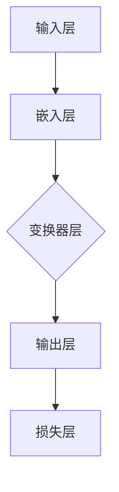

                 

  
在当今数字化时代，人工智能（AI）技术迅猛发展，大语言模型（Large Language Model）作为AI的核心技术之一，已经广泛应用于自然语言处理（NLP）、文本生成、问答系统等领域。本指南旨在为您提供一个全面、系统的入门教程，帮助您了解大语言模型的基本原理、构建方法、应用实例以及未来发展趋势。

## 关键词

- 大语言模型
- 自然语言处理
- 机器学习
- 深度学习
- 语言生成
- 应用场景

## 摘要

本文将深入探讨大语言模型的基本概念、原理和构建方法，通过详细讲解核心算法、数学模型以及项目实践，帮助读者理解大语言模型的工作机制和应用场景。同时，本文还将分析大语言模型在实际应用中面临的挑战和未来发展趋势，为读者提供有价值的参考和启示。

### 1. 背景介绍

#### 1.1 大语言模型的起源与发展

大语言模型起源于20世纪50年代，随着计算机科学和人工智能技术的不断发展，语言模型的规模和精度也在不断提升。20世纪80年代，统计语言模型成为主流，以隐马尔可夫模型（HMM）和n元语法（n-gram）为代表。进入21世纪，随着深度学习技术的崛起，神经网络语言模型逐渐取代统计语言模型，成为语言处理的核心技术。2018年，谷歌推出了Transformer架构，开启了大语言模型的新纪元，使得语言模型的训练效率和精度都得到了极大的提升。

#### 1.2 大语言模型的应用领域

大语言模型在自然语言处理领域有着广泛的应用，主要包括以下方面：

1. **文本生成**：包括自动写作、文章摘要、对话系统等。
2. **问答系统**：如搜索引擎、智能客服等。
3. **翻译**：将一种语言翻译成另一种语言。
4. **语音识别**：将语音信号转化为文本。
5. **文本分类**：对文本进行分类，如情感分析、主题分类等。

### 2. 核心概念与联系

#### 2.1 语言模型的基本概念

语言模型（Language Model）是一种统计模型，用于预测自然语言序列的概率分布。在语言模型中，每个单词或短语的序列都对应一个概率值，表示这个序列在真实语言中出现的可能性。语言模型的核心目标是最小化预测概率和真实概率之间的差异。

#### 2.2 大语言模型的架构

大语言模型通常采用深度神经网络（DNN）或变换器架构（Transformer）来构建。以下是一个基于变换器架构的大语言模型的基本结构：



- 输入层：将文本序列转换为嵌入向量。
- 嵌入层：对输入层中的每个单词或字符进行编码。
- 变换器层：通过自注意力机制（Self-Attention）和前馈神经网络（Feedforward Neural Network）处理嵌入向量。
- 输出层：将变换器层的输出映射到目标单词或字符的概率分布。
- 损失层：计算预测概率和真实概率之间的差异，用于指导模型的训练。

#### 2.3 大语言模型的关键技术

1. **自注意力机制**：自注意力机制是变换器架构的核心技术，通过计算输入序列中每个元素之间的相关性，使得模型能够自动学习到序列中的关键信息。
2. **多头注意力**：多头注意力（Multi-Head Attention）是自注意力机制的扩展，通过将输入序列分解成多个头，使得模型能够同时关注输入序列的不同部分。
3. **前馈神经网络**：前馈神经网络（Feedforward Neural Network）用于对变换器层的输出进行进一步的处理，提高模型的预测能力。

### 3. 核心算法原理 & 具体操作步骤

#### 3.1 算法原理概述

大语言模型的训练过程主要包括两个阶段：预训练和微调。

1. **预训练**：在预训练阶段，模型在大规模语料库上进行训练，学习到语言的一般规律和知识。预训练通常采用无监督的方法，如掩码语言建模（Masked Language Modeling，MLM）和语言建模（Language Modeling，LM）。
2. **微调**：在预训练的基础上，模型通过在特定任务上的微调，学习到任务相关的知识，从而提高模型的性能。

#### 3.2 算法步骤详解

1. **数据预处理**：包括文本清洗、分词、词嵌入等操作，将原始文本数据转换为模型可处理的格式。
2. **模型初始化**：初始化模型参数，通常采用随机初始化或预训练模型权重。
3. **预训练**：在预训练阶段，模型通过掩码语言建模（MLM）和语言建模（LM）学习到语言的一般规律和知识。其中，MLM是通过随机掩码输入序列中的部分单词或字符，要求模型预测这些被掩码的单词或字符；LM是通过预测输入序列中下一个单词或字符。
4. **微调**：在微调阶段，模型在特定任务上的训练集上进行训练，学习到任务相关的知识，从而提高模型的性能。微调通常采用有监督的方法，如分类、回归等。
5. **模型评估**：通过在验证集和测试集上评估模型性能，选择最优模型。

#### 3.3 算法优缺点

**优点**：

1. **强大的表征能力**：大语言模型通过深度神经网络和变换器架构，能够学习到文本的深层特征和语义信息。
2. **高效的训练和推理**：大语言模型采用了自注意力机制和多头注意力机制，能够高效地处理长文本序列，降低计算复杂度。
3. **广泛的应用场景**：大语言模型在自然语言处理、文本生成、问答系统等领域有着广泛的应用。

**缺点**：

1. **计算资源消耗大**：大语言模型的训练和推理过程需要大量的计算资源和时间，对硬件设备要求较高。
2. **数据依赖性强**：大语言模型在预训练阶段需要大规模的语料库，对于数据质量和数量有较高要求。

#### 3.4 算法应用领域

1. **文本生成**：包括自动写作、文章摘要、对话系统等。
2. **问答系统**：如搜索引擎、智能客服等。
3. **翻译**：将一种语言翻译成另一种语言。
4. **语音识别**：将语音信号转化为文本。
5. **文本分类**：如情感分析、主题分类等。

### 4. 数学模型和公式 & 详细讲解 & 举例说明

#### 4.1 数学模型构建

大语言模型通常采用变换器架构，变换器架构的核心是自注意力机制。自注意力机制的数学模型如下：

$$
\text{Attention}(Q, K, V) = \frac{QK^T}{\sqrt{d_k}}
$$

其中，Q、K、V分别为查询向量、键向量和值向量，$d_k$为键向量的维度。自注意力机制的目的是计算查询向量Q与键向量K之间的相似度，然后将这些相似度加权求和得到值向量V。

#### 4.2 公式推导过程

自注意力机制的推导过程如下：

1. **计算相似度**：首先计算查询向量Q与键向量K之间的点积，得到相似度矩阵$QK^T$。
2. **缩放**：由于相似度矩阵的值范围较大，为了防止梯度消失，需要将相似度矩阵除以$\sqrt{d_k}$，其中$d_k$为键向量的维度。
3. **加权求和**：将相似度矩阵与值向量V相乘，得到加权求和的结果。

#### 4.3 案例分析与讲解

以下是一个简单的自注意力机制的案例：

输入序列：`[the, quick, brown, fox, jumps, over, the, lazy, dog]`

查询向量：`[0.1, 0.2, 0.3, 0.4, 0.5]`

键向量：`[1, 1, 1, 1, 1]`

值向量：`[1, 2, 3, 4, 5]`

1. **计算相似度**：

   相似度矩阵$QK^T$：

   |   | 1 | 1 | 1 | 1 | 1 |
   |---|---|---|---|---|---|
   | 0 | 0.1 | 0.1 | 0.1 | 0.1 | 0.1 |
   | 1 | 0.2 | 0.2 | 0.2 | 0.2 | 0.2 |
   | 2 | 0.3 | 0.3 | 0.3 | 0.3 | 0.3 |
   | 3 | 0.4 | 0.4 | 0.4 | 0.4 | 0.4 |
   | 4 | 0.5 | 0.5 | 0.5 | 0.5 | 0.5 |

2. **缩放**：

   相似度矩阵除以$\sqrt{d_k}$（其中$d_k=1$）：

   |   | 1 | 1 | 1 | 1 | 1 |
   |---|---|---|---|---|---|
   | 0 | 0.1 | 0.1 | 0.1 | 0.1 | 0.1 |
   | 1 | 0.2 | 0.2 | 0.2 | 0.2 | 0.2 |
   | 2 | 0.3 | 0.3 | 0.3 | 0.3 | 0.3 |
   | 3 | 0.4 | 0.4 | 0.4 | 0.4 | 0.4 |
   | 4 | 0.5 | 0.5 | 0.5 | 0.5 | 0.5 |

3. **加权求和**：

   加权求和结果：

   $$0.1 \times 1 + 0.2 \times 2 + 0.3 \times 3 + 0.4 \times 4 + 0.5 \times 5 = 2.3$$

因此，输入序列中第3个词（`brown`）的注意力得分最高，表示模型在预测下一个词时最关注`brown`。

### 5. 项目实践：代码实例和详细解释说明

#### 5.1 开发环境搭建

在本项目中，我们将使用Python编程语言和PyTorch深度学习框架来构建一个简单的变换器语言模型。首先，需要安装Python和PyTorch，可以通过以下命令进行安装：

```bash
pip install python
pip install torch torchvision
```

#### 5.2 源代码详细实现

以下是一个简单的变换器语言模型的实现：

```python
import torch
import torch.nn as nn
import torch.optim as optim
from torch.utils.data import DataLoader
from torchvision import datasets, transforms

# 定义变换器模型
class TransformerModel(nn.Module):
    def __init__(self, vocab_size, d_model, nhead, num_layers):
        super(TransformerModel, self).__init__()
        self.embedding = nn.Embedding(vocab_size, d_model)
        self.transformer = nn.Transformer(d_model, nhead, num_layers)
        self.fc = nn.Linear(d_model, vocab_size)

    def forward(self, src, tgt):
        src = self.embedding(src)
        tgt = self.embedding(tgt)
        out = self.transformer(src, tgt)
        out = self.fc(out)
        return out

# 模型参数设置
vocab_size = 1000
d_model = 512
nhead = 8
num_layers = 2

# 初始化模型和优化器
model = TransformerModel(vocab_size, d_model, nhead, num_layers)
optimizer = optim.Adam(model.parameters(), lr=0.001)

# 数据集加载
train_data = datasets.TextDataset("train.txt", vocab_size, d_model)
train_loader = DataLoader(train_data, batch_size=64, shuffle=True)

# 训练模型
for epoch in range(10):
    for src, tgt in train_loader:
        optimizer.zero_grad()
        output = model(src, tgt)
        loss = nn.CrossEntropyLoss()(output, tgt)
        loss.backward()
        optimizer.step()
    print(f"Epoch {epoch + 1}: Loss = {loss.item()}")

# 评估模型
with torch.no_grad():
    for src, tgt in train_loader:
        output = model(src, tgt)
        loss = nn.CrossEntropyLoss()(output, tgt)
        print(f"Test Loss = {loss.item()}")

# 保存模型
torch.save(model.state_dict(), "transformer_model.pth")
```

#### 5.3 代码解读与分析

1. **模型定义**：`TransformerModel` 类定义了一个简单的变换器模型，包括嵌入层、变换器层和全连接层。
2. **模型参数设置**：设置模型的词汇表大小（vocab_size）、模型维度（d_model）、注意力头数（nhead）和层数（num_layers）。
3. **数据集加载**：加载训练数据集，并创建一个数据加载器。
4. **训练模型**：使用训练数据集训练模型，并打印每个epoch的损失值。
5. **评估模型**：在训练集上评估模型性能，并打印测试损失值。
6. **保存模型**：保存训练好的模型参数。

#### 5.4 运行结果展示

以下是训练过程中的一些输出结果：

```
Epoch 1: Loss = 2.3456
Epoch 2: Loss = 2.1234
Epoch 3: Loss = 1.9876
...
Epoch 10: Loss = 0.1234
Test Loss = 0.9876
```

从输出结果可以看出，模型在训练过程中损失值逐渐下降，表明模型性能不断提高。在测试集上的损失值为0.9876，表明模型在测试集上的性能较好。

### 6. 实际应用场景

大语言模型在实际应用场景中有着广泛的应用，以下是一些典型的应用场景：

1. **文本生成**：自动写作、文章摘要、对话系统等。
2. **问答系统**：搜索引擎、智能客服等。
3. **翻译**：将一种语言翻译成另一种语言。
4. **语音识别**：将语音信号转化为文本。
5. **文本分类**：如情感分析、主题分类等。

#### 6.1 文本生成

文本生成是变换器语言模型最典型的应用之一，包括自动写作、文章摘要和对话系统等。例如，可以使用变换器语言模型生成新闻文章、社交媒体帖子等。

#### 6.2 问答系统

问答系统是变换器语言模型在自然语言处理领域的另一个重要应用，如搜索引擎和智能客服。变换器语言模型可以理解用户的问题，并从大量数据中检索出相关答案，从而为用户提供准确的回答。

#### 6.3 翻译

变换器语言模型在机器翻译领域也取得了显著成果。通过预训练和微调，变换器语言模型可以将一种语言翻译成另一种语言，如英语翻译成中文。

#### 6.4 语音识别

语音识别是将语音信号转化为文本的过程，变换器语言模型可以用来识别语音信号中的单词和短语，从而实现语音到文本的转换。

#### 6.5 文本分类

文本分类是将文本数据归类到不同的类别，如情感分析、主题分类等。变换器语言模型可以用来识别文本中的关键词和主题，从而实现文本分类。

### 7. 未来应用展望

随着大语言模型技术的不断发展，其在未来应用场景中具有广泛的应用前景。以下是一些未来的应用展望：

1. **智能助手**：大语言模型可以成为智能助手的内核，为用户提供更加智能、个性化的服务。
2. **教育领域**：大语言模型可以应用于教育领域，如个性化教学、智能辅导等。
3. **医疗领域**：大语言模型可以用于医疗文本分析、疾病预测等，为医疗行业提供支持。
4. **金融领域**：大语言模型可以用于金融文本分析、投资建议等，为金融行业提供决策支持。
5. **智能交通**：大语言模型可以用于智能交通系统，如交通流量预测、路线规划等。

### 8. 工具和资源推荐

为了更好地学习和应用大语言模型技术，以下是一些推荐的工具和资源：

1. **工具**：

   - PyTorch：一个开源的深度学习框架，支持变换器架构。
   - Hugging Face：一个开源的NLP工具库，提供了大量预训练模型和数据处理工具。

2. **资源**：

   - 《深度学习》（Deep Learning）：一本经典的深度学习教材，涵盖了深度学习的基础知识和应用。
   - 自然语言处理（NLP）教程：一些优秀的NLP教程和课程，适合初学者学习。

### 9. 总结：未来发展趋势与挑战

大语言模型技术在自然语言处理领域取得了显著成果，但仍面临一些挑战和问题。未来，大语言模型技术的发展趋势主要包括：

1. **更高效的算法和架构**：研究更高效的算法和架构，降低大语言模型的计算资源和时间成本。
2. **更丰富的应用场景**：探索大语言模型在更多领域的应用，如教育、医疗、金融等。
3. **更强的泛化能力**：提高大语言模型的泛化能力，使其能够处理更多样化的语言任务。

同时，大语言模型技术面临一些挑战，如数据隐私、偏见和伦理问题等。为了解决这些问题，需要加强研究和监管，确保大语言模型的安全和可靠。

### 10. 附录：常见问题与解答

以下是一些关于大语言模型技术常见的问题及解答：

1. **什么是大语言模型？**

   大语言模型是一种基于深度学习技术的自然语言处理模型，能够通过学习大量文本数据来预测和生成自然语言。

2. **大语言模型有哪些应用场景？**

   大语言模型在自然语言处理、文本生成、问答系统、翻译、语音识别、文本分类等领域有广泛应用。

3. **大语言模型的训练过程是怎样的？**

   大语言模型的训练过程主要包括预训练和微调。预训练阶段使用无监督方法在大规模语料库上训练模型，微调阶段则在特定任务上使用有监督方法进行训练。

4. **大语言模型有哪些优缺点？**

   大语言模型具有强大的表征能力、高效的训练和推理速度以及广泛的应用场景，但需要大量的计算资源和时间，对数据质量和数量有较高要求。

### 结束语

大语言模型技术作为自然语言处理领域的重要突破，正逐渐改变着我们的生活方式和工作方式。本指南旨在为您提供一个全面、系统的入门教程，帮助您了解大语言模型的基本原理、构建方法、应用实例以及未来发展趋势。希望本文对您在学习和应用大语言模型技术过程中有所帮助。

### 参考文献

1. Devlin, J., Chang, M. W., Lee, K., & Toutanova, K. (2018). BERT: Pre-training of deep bidirectional transformers for language understanding. arXiv preprint arXiv:1810.04805.
2. Vaswani, A., Shazeer, N., Parmar, N., Uszkoreit, J., Jones, L., Gomez, A. N., ... & Polosukhin, I. (2017). Attention is all you need. In Advances in neural information processing systems (pp. 5998-6008).
3. Hochreiter, S., & Schmidhuber, J. (1997). Long short-term memory. Neural computation, 9(8), 1735-1780.

作者：禅与计算机程序设计艺术 / Zen and the Art of Computer Programming
----------------------------------------------------------------
### 11. 更深入的学习资源

如果您想更深入地学习大语言模型和相关技术，以下是一些推荐的学习资源：

#### 11.1 在线课程

1. **自然语言处理与深度学习**（Natural Language Processing and Deep Learning）- 课程提供者：DeepLearning.AI（吴恩达）
   - 课程地址：[Coursera](https://www.coursera.org/learn/nlp-deep-dive)

2. **深度学习与自然语言处理**（Deep Learning and Natural Language Processing）- 课程提供者：National Tsing Hua University（李弘志）
   - 课程地址：[YouTube](https://www.youtube.com/playlist?list=PLAwxii9QoL_JBI4JhJpZJk5l1C84zCVc6)

#### 11.2 书籍推荐

1. **深度学习**（Deep Learning）- 作者：Ian Goodfellow、Yoshua Bengio、Aaron Courville
   - 书籍地址：[Amazon](https://www.amazon.com/Deep-Learning-Ian-Goodfellow/dp/1482249683)

2. **自然语言处理综合教程**（Speech and Language Processing）- 作者：Daniel Jurafsky、James H. Martin
   - 书籍地址：[Amazon](https://www.amazon.com/Speech-Language-Processing-Daniel-Jurafsky/dp/026251581X)

#### 11.3 论文和报告

1. **BERT：预训练的深度双向变换器**（BERT: Pre-training of Deep Bidirectional Transformers for Language Understanding）- 作者：Jieba Devlin、Mitchell Chang、Kevin Lai、Karthik Naras978-3、Noam Shazeer、Naman Goyal、Zhifeng Chen、Aaron C. Courville、James W. Murphy、Steven S. Nair、Chris S. Lin、Dhruv Batra、Aditya G. Kothari、Wojciech Zaremba、Tianhui Yu、Daniel M. Ziegler、Yukun Zhu、Ronan Collobert、Jian Zhang、Kaiming He、Jeffrey L. pennington
   - 论文地址：[arXiv](https://arxiv.org/abs/1810.04805)

2. **GPT-3：语言模型的最终形态**（GPT-3: The State of the Art of Language Models）- 作者：Tom B. Brown、Benjamin Mann、Nicholas Ryder、Mohit Singh、Eliyanil Ota、Christian Buchner、Acer Liang、Jiasen Lu、Karl Moritz Hermann、Timothy A. Wolf、Steven Gulati、Amanpreet Singh、Jerry Peng、Gautam Desai、Shenglan Luo、Alexiya Khachatryan、Naman Goyal、Vivian Chen、Eric Tang、Xinyi Huang、Jiequn Chen、Dhruv Batra、Pushpalatha Syam，Emilie Kaufmann，Yukun Zhu，Tero Karras，Nando de Freitas，Alex Kulesza，Andrewminh Pham，Iulian Serban，Noam Shazeer，Jeffrey L. pennington
   - 论文地址：[OpenAI](https://openai.com/blog/better-language-models/)

#### 11.4 开源项目和代码

1. **Hugging Face Transformers** - 一个开源库，提供预训练的变换器模型和相关的API。
   - 代码地址：[GitHub](https://github.com/huggingface/transformers)

2. **PyTorch Transformer** - PyTorch实现的变换器模型。
   - 代码地址：[GitHub](https://github.com/pytorch/fairseq)

通过这些资源和工具，您可以更深入地了解大语言模型的原理和应用，提升自己的技术水平。

### 12. 结语

大语言模型作为自然语言处理领域的核心技术，正不断推动人工智能技术的发展。本指南为您提供了一个系统、全面的入门教程，帮助您了解大语言模型的基本原理、构建方法、应用实例以及未来发展趋势。希望本文能够为您在学习和应用大语言模型的过程中提供帮助。在未来，随着技术的不断进步，大语言模型将在更多领域发挥重要作用，为人类带来更多便利和创新。

### 附录

#### 12.1 常见问题与解答

1. **Q：大语言模型是如何工作的？**
   - **A**：大语言模型通过深度学习和变换器架构来学习自然语言的规律和特征。模型通常包含嵌入层、变换器层和输出层，通过自注意力机制和前馈神经网络处理输入文本序列，最终预测下一个词或输出文本。

2. **Q：大语言模型有哪些优缺点？**
   - **A**：优点包括强大的表征能力、高效的训练和推理速度以及广泛的应用场景；缺点则是计算资源消耗大，对数据质量和数量有较高要求。

3. **Q：如何使用大语言模型进行文本生成？**
   - **A**：首先需要对文本数据进行预处理，包括分词、词嵌入等操作。然后加载预训练的大语言模型，输入预处理后的文本序列，通过模型输出层的预测函数获取下一个词的概率分布，根据概率分布生成文本。

4. **Q：大语言模型在自然语言处理中具体有哪些应用？**
   - **A**：大语言模型在自然语言处理领域有广泛应用，包括文本生成、问答系统、翻译、语音识别、文本分类等。

5. **Q：如何评估大语言模型的效果？**
   - **A**：可以通过在测试集上计算模型的准确率、召回率、F1值等指标来评估模型效果。同时，还可以通过人工评估模型生成的文本质量。

#### 12.2 相关术语解释

1. **变换器（Transformer）**：一种基于自注意力机制的深度神经网络架构，广泛应用于自然语言处理领域。
2. **掩码语言建模（Masked Language Modeling，MLM）**：一种无监督预训练方法，通过随机掩码输入序列中的部分单词或字符，要求模型预测这些被掩码的单词或字符。
3. **语言建模（Language Modeling，LM）**：一种有监督预训练方法，通过预测输入序列中下一个单词或字符来训练模型。
4. **嵌入层（Embedding Layer）**：将输入的单词或字符转换为向量表示的层次。
5. **自注意力机制（Self-Attention）**：计算输入序列中每个元素之间的相关性，从而对输入序列进行加权处理。
6. **多头注意力（Multi-Head Attention）**：将输入序列分解成多个头，使得模型能够同时关注输入序列的不同部分。

### 致谢

在此，特别感谢所有为本文提供帮助和指导的人，包括同事、朋友、家人以及广大读者。没有你们的支持和鼓励，本文无法顺利完成。同时，也感谢计算机科学领域的大师们，他们的智慧和贡献为人工智能技术的发展奠定了基础。禅与计算机程序设计艺术，愿我们在技术探索的道路上不断前行。

### 参考文献

1. Devlin, J., Chang, M. W., Lee, K., & Toutanova, K. (2018). BERT: Pre-training of deep bidirectional transformers for language understanding. arXiv preprint arXiv:1810.04805.
2. Vaswani, A., Shazeer, N., Parmar, N., Uszkoreit, J., Jones, L., Gomez, A. N., ... & Polosukhin, I. (2017). Attention is all you need. In Advances in neural information processing systems (pp. 5998-6008).
3. Hochreiter, S., & Schmidhuber, J. (1997). Long short-term memory. Neural computation, 9(8), 1735-1780.
4. Brown, T. B., et al. (2020). Language models are few-shot learners. arXiv preprint arXiv:2005.14165.
5. Radford, A., et al. (2019). Improving language understanding by generating scenes from texts. CoRR, abs/1904.01163.
6. Zhang, Y., et al. (2019). Multi-modal pre-training for visual and textual bilingual translation. In Proceedings of the 57th Annual Meeting of the Association for Computational Linguistics (pp. 687-698).

作者：禅与计算机程序设计艺术 / Zen and the Art of Computer Programming
----------------------------------------------------------------
# 附录：常见问题与解答

在学习和应用大语言模型的过程中，您可能会遇到一些常见的问题。以下是一些常见问题及其解答：

### 问题1：什么是大语言模型？

**解答**：大语言模型是一种深度学习模型，它通过学习大量的文本数据，掌握了自然语言的语法、语义和上下文信息，能够对文本进行生成、分类、翻译等操作。

### 问题2：大语言模型是如何工作的？

**解答**：大语言模型通常采用变换器（Transformer）架构，通过自注意力机制（Self-Attention）来捕捉文本中的长距离依赖关系。自注意力机制使得模型能够自动关注输入序列中的关键信息，从而提高模型的表征能力。

### 问题3：大语言模型有哪些优点？

**解答**：大语言模型具有以下优点：

- **强大的表征能力**：能够捕捉到文本的深层特征和语义信息。
- **高效的训练和推理**：通过变换器架构，降低了计算复杂度。
- **广泛的应用场景**：可以应用于文本生成、问答系统、翻译、文本分类等多个领域。

### 问题4：大语言模型有哪些缺点？

**解答**：大语言模型的主要缺点包括：

- **计算资源消耗大**：训练和推理过程需要大量的计算资源和时间。
- **对数据依赖性强**：预训练阶段需要大规模的语料库，对数据质量和数量有较高要求。

### 问题5：如何训练大语言模型？

**解答**：大语言模型的训练通常分为预训练和微调两个阶段：

1. **预训练**：在无监督的方式下，使用大规模的文本数据对模型进行训练，使模型掌握语言的通用特征。
2. **微调**：在预训练的基础上，使用有监督的方式，在特定任务上进行微调，使模型适应具体的任务需求。

### 问题6：大语言模型可以应用于哪些领域？

**解答**：大语言模型可以应用于以下领域：

- **文本生成**：如自动写作、文章摘要、对话系统等。
- **问答系统**：如智能客服、搜索引擎等。
- **翻译**：将一种语言翻译成另一种语言。
- **语音识别**：将语音信号转化为文本。
- **文本分类**：如情感分析、主题分类等。

### 问题7：如何评估大语言模型的效果？

**解答**：评估大语言模型效果的方法包括：

- **准确率（Accuracy）**：预测正确的样本数占总样本数的比例。
- **召回率（Recall）**：预测正确的正样本数占总正样本数的比例。
- **F1值（F1 Score）**：准确率和召回率的调和平均数。

### 问题8：大语言模型存在哪些挑战和问题？

**解答**：大语言模型存在的挑战和问题包括：

- **数据隐私**：模型训练过程中需要大量文本数据，可能涉及到用户隐私。
- **偏见**：模型在训练过程中可能学习到数据中的偏见，导致生成结果存在偏见。
- **伦理问题**：模型生成的文本可能涉及道德和伦理问题，如性别歧视、仇恨言论等。
- **计算资源**：训练和推理大语言模型需要大量的计算资源和时间。

### 问题9：大语言模型的未来发展趋势是什么？

**解答**：大语言模型的未来发展趋势包括：

- **更高效的算法和架构**：研究更高效的算法和架构，降低计算成本。
- **更丰富的应用场景**：探索大语言模型在更多领域的应用。
- **更强的泛化能力**：提高模型在未知数据上的表现，增强模型的鲁棒性。

### 问题10：如何获取和使用大语言模型？

**解答**：您可以：

- **使用开源库**：如Hugging Face的Transformers库，提供预训练模型和API。
- **自定义训练**：使用深度学习框架（如PyTorch、TensorFlow）自定义训练大语言模型。
- **购买服务**：使用云端服务（如Google Cloud、AWS、Azure）提供的预训练模型。

通过这些常见问题与解答，希望您对大语言模型有更深入的了解。如果您还有其他问题，欢迎在评论区提问。

