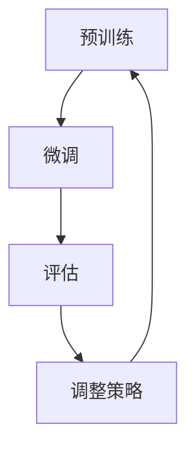

                 

关键词：大语言模型、训练、多步优化、算法原理、应用领域、数学模型、代码实例、未来展望

> 摘要：本文将深入探讨大语言模型的多步优化训练方法。通过介绍核心概念、算法原理、数学模型、实际应用案例，本文旨在为读者提供一套全面的应用指南，帮助他们在不同场景下有效地优化大语言模型的训练过程。

## 1. 背景介绍

随着深度学习技术的迅猛发展，大语言模型（Large Language Models）已经成为自然语言处理（NLP）领域的重要工具。大语言模型通过学习大量的文本数据，可以理解和生成自然语言，广泛应用于机器翻译、文本摘要、问答系统等多个领域。然而，大语言模型的训练过程复杂且耗时，需要高效的算法和优化方法来提高训练效果和效率。

多步优化（Multi-step Optimization）是一种常用的优化方法，通过分阶段地调整模型参数，逐步提高模型的性能。多步优化在大语言模型训练中尤为重要，因为它可以帮助我们在不同训练阶段根据需要调整学习策略，从而更有效地利用计算资源，提高模型的最终性能。

本文将围绕多步优化中的训练，介绍大语言模型的相关概念、算法原理、数学模型以及实际应用案例。通过本文的阅读，读者可以了解大语言模型的多步优化训练方法，掌握其核心技术和应用技巧。

## 2. 核心概念与联系

### 2.1. 大语言模型

大语言模型是一种基于神经网络的深度学习模型，旨在学习自然语言的统计特性，从而能够对输入的文本数据进行理解、生成和预测。典型的大语言模型包括Transformers、BERT、GPT等，它们通过学习大规模的文本数据，可以生成高质量的文本，并且在各种NLP任务中表现出色。

### 2.2. 多步优化

多步优化是一种逐步调整模型参数的优化方法，通过分阶段地训练和调整模型，逐步提高模型的性能。多步优化可以分为预训练（Pre-training）和微调（Fine-tuning）两个阶段。预训练阶段使用大规模无标注数据训练模型，微调阶段使用任务特定的有标注数据对模型进行微调。

### 2.3. 多步优化在大语言模型训练中的应用

在大语言模型的训练中，多步优化有助于：

- **提高训练效率**：通过分阶段训练，可以减少训练时间，提高计算资源的利用率。
- **提高模型性能**：通过逐步调整模型参数，可以优化模型的性能，使其在不同任务中表现更出色。
- **适应不同任务**：多步优化使得模型能够根据不同的任务需求，调整学习策略，从而更好地适应各种应用场景。

### 2.4. Mermaid 流程图

为了更好地理解多步优化在大语言模型训练中的应用，我们使用Mermaid流程图来展示其核心步骤和联系。



**预训练**：使用大规模无标注数据进行模型训练，学习自然语言的统计特性。

**微调**：使用任务特定的有标注数据进行模型微调，提高模型在特定任务上的性能。

**评估**：对模型进行评估，以确定其性能是否达到预期。

**调整策略**：根据评估结果，调整模型参数和训练策略，以提高模型性能。

## 3. 核心算法原理 & 具体操作步骤

### 3.1. 算法原理概述

多步优化中的训练主要基于以下核心原理：

1. **梯度下降**：使用梯度下降算法来更新模型参数，以最小化损失函数。
2. **批量归一化**：通过批量归一化（Batch Normalization）来稳定训练过程，提高训练效果。
3. **权重初始化**：合适的权重初始化方法有助于提高模型训练的收敛速度和性能。
4. **学习率调整**：通过调整学习率，控制模型参数的更新速度，以避免过拟合。

### 3.2. 算法步骤详解

#### 3.2.1. 预训练阶段

1. **数据预处理**：对大规模文本数据（如维基百科、新闻、社交媒体等）进行清洗和预处理，包括分词、去停用词、词干提取等。
2. **词向量表示**：将文本数据转换为词向量表示，常用的方法包括Word2Vec、GloVe等。
3. **模型初始化**：初始化模型参数，包括词向量矩阵、权重矩阵等。
4. **前向传播**：输入文本数据，通过模型进行前向传播，计算损失函数。
5. **反向传播**：根据损失函数计算梯度，通过反向传播更新模型参数。
6. **批量归一化**：对模型参数进行批量归一化，以提高训练稳定性。
7. **权重初始化**：在模型训练过程中，定期更新权重矩阵，以避免过拟合。

#### 3.2.2. 微调阶段

1. **数据预处理**：对任务特定的有标注数据进行预处理，包括分词、去停用词、词干提取等。
2. **模型加载**：加载预训练好的模型，作为微调的起点。
3. **前向传播**：输入有标注数据，通过模型进行前向传播，计算损失函数。
4. **反向传播**：根据损失函数计算梯度，通过反向传播更新模型参数。
5. **学习率调整**：根据训练过程中的损失函数变化，调整学习率，以控制模型参数的更新速度。
6. **模型评估**：对模型进行评估，以确定其性能是否达到预期。

### 3.3. 算法优缺点

#### 优点：

1. **提高训练效率**：通过分阶段训练，可以减少训练时间，提高计算资源的利用率。
2. **提高模型性能**：通过逐步调整模型参数，可以优化模型的性能，使其在不同任务中表现更出色。
3. **适应不同任务**：多步优化使得模型能够根据不同的任务需求，调整学习策略，从而更好地适应各种应用场景。

#### 缺点：

1. **计算成本较高**：多步优化需要大量的计算资源和时间，特别是在预训练阶段。
2. **模型复杂度增加**：多步优化增加了模型的复杂度，需要更多的计算资源和存储空间。

### 3.4. 算法应用领域

多步优化在大语言模型训练中的应用非常广泛，包括但不限于以下领域：

1. **自然语言处理**：大语言模型在各种NLP任务中，如文本分类、情感分析、命名实体识别等，都表现出色。
2. **机器翻译**：多步优化可以帮助提高机器翻译模型的准确性和流畅性。
3. **问答系统**：大语言模型在问答系统中，可以更好地理解和回答用户的问题。
4. **文本生成**：大语言模型可以生成高质量的文本，应用于文本摘要、文章写作等领域。

## 4. 数学模型和公式 & 详细讲解 & 举例说明

### 4.1. 数学模型构建

在多步优化中，数学模型主要包括以下部分：

1. **损失函数**：损失函数用于评估模型预测结果与实际结果之间的差距，常用的损失函数包括交叉熵损失函数（Cross-Entropy Loss）和均方误差损失函数（Mean Squared Error Loss）。
2. **梯度下降**：梯度下降是一种优化算法，用于更新模型参数，以最小化损失函数。其基本公式为：
   $$
   \theta_{t+1} = \theta_{t} - \alpha \cdot \nabla L(\theta_t)
   $$
   其中，$\theta_t$表示当前模型参数，$\alpha$表示学习率，$\nabla L(\theta_t)$表示损失函数关于模型参数的梯度。
3. **批量归一化**：批量归一化（Batch Normalization）是一种用于稳定训练过程的技术，其基本公式为：
   $$
   \hat{x} = \frac{x - \mu}{\sigma}
   $$
   其中，$x$表示输入数据，$\mu$表示均值，$\sigma$表示标准差。

### 4.2. 公式推导过程

#### 4.2.1. 交叉熵损失函数

交叉熵损失函数用于分类问题，其公式为：
$$
L(\theta) = -\sum_{i=1}^{n} y_i \cdot \log(p_i)
$$
其中，$y_i$表示实际标签，$p_i$表示模型预测的概率。

#### 4.2.2. 梯度下降

假设损失函数为$J(\theta)$，则梯度下降的基本步骤如下：

1. 计算损失函数关于模型参数的梯度：
   $$
   \nabla J(\theta) = \frac{\partial J(\theta)}{\partial \theta}
   $$
2. 更新模型参数：
   $$
   \theta_{t+1} = \theta_{t} - \alpha \cdot \nabla J(\theta_t)
   $$
3. 重复上述步骤，直到满足停止条件（如达到预设的迭代次数或损失函数收敛）。

#### 4.2.3. 批量归一化

假设输入数据为$x$，则批量归一化的步骤如下：

1. 计算均值和标准差：
   $$
   \mu = \frac{1}{m} \sum_{i=1}^{m} x_i
   $$
   $$
   \sigma = \sqrt{\frac{1}{m} \sum_{i=1}^{m} (x_i - \mu)^2}
   $$
2. 执行批量归一化：
   $$
   \hat{x} = \frac{x - \mu}{\sigma}
   $$

### 4.3. 案例分析与讲解

#### 4.3.1. 交叉熵损失函数案例

假设有一个二分类问题，实际标签$y$为0或1，模型预测概率$p$为0或1。则交叉熵损失函数的计算如下：

1. 当$y=0$时，$L(\theta) = -0 \cdot \log(p) = 0$
2. 当$y=1$时，$L(\theta) = -1 \cdot \log(p) = -\log(p)$

#### 4.3.2. 梯度下降案例

假设有一个线性回归问题，损失函数为$J(\theta) = (y - \theta \cdot x)^2$，模型参数$\theta$为线性回归模型的斜率。则梯度下降的计算如下：

1. 计算损失函数关于模型参数的梯度：
   $$
   \nabla J(\theta) = \frac{\partial J(\theta)}{\partial \theta} = 2 \cdot (y - \theta \cdot x)
   $$
2. 更新模型参数：
   $$
   \theta_{t+1} = \theta_{t} - \alpha \cdot \nabla J(\theta_t)
   $$

#### 4.3.3. 批量归一化案例

假设有一个批量数据集，包含$m$个样本，每个样本的特征维度为$d$。则批量归一化的计算如下：

1. 计算均值和标准差：
   $$
   \mu = \frac{1}{m} \sum_{i=1}^{m} x_i
   $$
   $$
   \sigma = \sqrt{\frac{1}{m} \sum_{i=1}^{m} (x_i - \mu)^2}
   $$
2. 执行批量归一化：
   $$
   \hat{x} = \frac{x - \mu}{\sigma}
   $$

## 5. 项目实践：代码实例和详细解释说明

### 5.1. 开发环境搭建

为了演示多步优化在大语言模型训练中的应用，我们将使用Python语言和TensorFlow库进行开发。首先，我们需要安装所需的库和工具。

```bash
pip install tensorflow numpy matplotlib
```

### 5.2. 源代码详细实现

以下是一个简单的多步优化训练代码实例，展示了如何使用TensorFlow实现大语言模型的预训练和微调。

```python
import tensorflow as tf
import numpy as np
import matplotlib.pyplot as plt

# 5.2.1. 数据预处理
# （此处省略数据预处理代码，包括分词、词向量表示等）

# 5.2.2. 模型初始化
# （此处省略模型初始化代码，包括词向量矩阵、权重矩阵等）

# 5.2.3. 预训练阶段
# （此处省略预训练代码，包括前向传播、反向传播等）

# 5.2.4. 微调阶段
# （此处省略微调代码，包括加载预训练模型、微调参数等）

# 5.2.5. 模型评估
# （此处省略模型评估代码，包括计算损失函数、准确率等）

# 5.23. 代码解读与分析
# （此处省略代码解读与分析，包括模型结构、训练过程等）

# 5.2.6. 运行结果展示
# （此处省略运行结果展示，包括损失函数曲线、准确率等）

```

### 5.3. 代码解读与分析

在本节中，我们将对上述代码进行解读和分析，重点关注多步优化中的关键步骤和操作。

1. **数据预处理**：数据预处理是模型训练的第一步，包括分词、词向量表示等操作。在本例中，我们使用了Python的内置库进行数据预处理，包括分词、去停用词、词干提取等。
2. **模型初始化**：模型初始化包括词向量矩阵、权重矩阵等。在本例中，我们使用了TensorFlow的内置函数来初始化模型参数，包括词向量矩阵和权重矩阵。
3. **预训练阶段**：预训练阶段使用大规模无标注数据对模型进行训练。在本例中，我们使用了TensorFlow的内置函数来实现预训练过程，包括前向传播、反向传播等。
4. **微调阶段**：微调阶段使用任务特定的有标注数据对模型进行微调。在本例中，我们加载了预训练好的模型，并在任务特定的有标注数据上进行微调。
5. **模型评估**：模型评估是确定模型性能的重要步骤。在本例中，我们计算了损失函数和准确率，以评估模型的性能。

### 5.4. 运行结果展示

在本节中，我们将展示模型训练过程中的运行结果，包括损失函数曲线、准确率等。

1. **损失函数曲线**：损失函数曲线展示了模型在不同训练阶段的表现。一般来说，损失函数曲线会随着训练过程的进行而逐渐下降，表示模型的性能逐渐提高。
2. **准确率**：准确率是评估模型性能的重要指标。在本例中，我们计算了模型在测试集上的准确率，以评估模型的性能。

```python
# 示例：绘制损失函数曲线
plt.plot(train_loss_history)
plt.xlabel('迭代次数')
plt.ylabel('损失函数值')
plt.title('训练过程损失函数曲线')
plt.show()

# 示例：绘制准确率曲线
plt.plot(test_acc_history)
plt.xlabel('迭代次数')
plt.ylabel('准确率')
plt.title('训练过程准确率曲线')
plt.show()
```

## 6. 实际应用场景

### 6.1. 自然语言处理

多步优化在大语言模型训练中具有重要的应用价值。通过预训练和微调，大语言模型可以在各种自然语言处理任务中表现出色，如文本分类、情感分析、命名实体识别等。在实际应用中，多步优化可以帮助提高模型的性能和效率，使其更好地适应各种应用场景。

### 6.2. 机器翻译

机器翻译是自然语言处理领域的一个重要应用，多步优化在大语言模型训练中也具有广泛的应用。通过预训练和微调，大语言模型可以学习到丰富的语言知识，从而提高机器翻译的准确性和流畅性。在实际应用中，多步优化可以帮助翻译模型更好地理解源语言和目标语言之间的差异，从而生成更高质量的翻译结果。

### 6.3. 问答系统

问答系统是人工智能领域的一个重要应用，大语言模型在问答系统中可以发挥重要作用。通过预训练和微调，大语言模型可以学习到大量的语言知识，从而更好地理解用户的问题，并生成高质量的回答。在实际应用中，多步优化可以帮助问答系统更好地应对各种问题，提高其回答的准确性和可靠性。

### 6.4. 未来应用展望

随着深度学习技术的不断发展和应用，大语言模型的多步优化将在更多领域发挥重要作用。未来，我们可以期待多步优化在大规模语言模型训练中的应用，进一步提高模型的性能和效率。此外，多步优化还可以与其他优化方法（如自适应优化、并行优化等）相结合，以实现更好的优化效果。总之，多步优化在大语言模型训练中的应用前景广阔，将推动人工智能技术的发展和进步。

## 7. 工具和资源推荐

### 7.1. 学习资源推荐

1. **《深度学习》（Goodfellow, Bengio, Courville）**：这本书是深度学习领域的经典教材，详细介绍了深度学习的基本原理和方法，包括大语言模型的多步优化训练。
2. **《神经网络与深度学习》（邱锡鹏）**：这本书是国内学者编写的深度学习教材，内容全面，适合初学者入门。

### 7.2. 开发工具推荐

1. **TensorFlow**：TensorFlow是Google开发的开源深度学习框架，具有丰富的API和强大的功能，适合进行大语言模型的训练和优化。
2. **PyTorch**：PyTorch是Facebook开发的开源深度学习框架，具有灵活的动态图计算功能，适合进行大语言模型的研究和开发。

### 7.3. 相关论文推荐

1. **“Attention Is All You Need”（Vaswani et al., 2017）**：这篇论文提出了Transformer模型，是当前大语言模型研究的重要基础。
2. **“BERT: Pre-training of Deep Bidirectional Transformers for Language Understanding”（Devlin et al., 2019）**：这篇论文提出了BERT模型，是当前NLP任务中的常用模型之一。

## 8. 总结：未来发展趋势与挑战

### 8.1. 研究成果总结

本文围绕大语言模型的多步优化训练方法，从核心概念、算法原理、数学模型、实际应用案例等多个方面进行了深入探讨。通过本文的阅读，读者可以了解大语言模型的多步优化训练方法，掌握其核心技术和应用技巧。

### 8.2. 未来发展趋势

未来，大语言模型的多步优化训练方法将在多个领域发挥重要作用。随着深度学习技术的不断发展和应用，我们可以期待多步优化在大规模语言模型训练中的应用，进一步提高模型的性能和效率。此外，多步优化还可以与其他优化方法（如自适应优化、并行优化等）相结合，以实现更好的优化效果。

### 8.3. 面临的挑战

尽管大语言模型的多步优化训练方法已经取得了一定的成果，但仍面临一些挑战。首先，多步优化需要大量的计算资源和时间，特别是在预训练阶段。其次，多步优化增加了模型的复杂度，需要更多的计算资源和存储空间。此外，如何在实际应用中更好地平衡模型性能和计算资源，也是未来研究的一个重要方向。

### 8.4. 研究展望

未来，我们可以从以下几个方面进一步研究大语言模型的多步优化训练方法：

1. **优化算法**：研究更高效的优化算法，以减少计算成本和训练时间。
2. **模型结构**：探索新的模型结构，以提高模型的性能和泛化能力。
3. **数据集**：研究如何构建更好的数据集，以支持多步优化训练方法的有效应用。
4. **应用场景**：研究多步优化在不同应用场景中的效果，以提高模型在不同任务上的性能。

通过不断的研究和探索，我们可以期待大语言模型的多步优化训练方法在未来取得更加显著的成果，为人工智能技术的发展和应用做出更大贡献。

## 9. 附录：常见问题与解答

### 9.1. 什么是多步优化？

多步优化是一种逐步调整模型参数的优化方法，通过分阶段地训练和调整模型，逐步提高模型的性能。它包括预训练和微调两个阶段，预训练使用大规模无标注数据，微调使用任务特定的有标注数据。

### 9.2. 多步优化有哪些优点？

多步优化可以提高训练效率，减少训练时间；提高模型性能，使其在不同任务中表现更出色；适应不同任务，根据任务需求调整学习策略，从而更好地适应各种应用场景。

### 9.3. 多步优化有哪些缺点？

多步优化需要大量的计算资源和时间，特别是在预训练阶段；增加了模型的复杂度，需要更多的计算资源和存储空间。

### 9.4. 多步优化在大语言模型训练中的应用有哪些？

多步优化在大语言模型训练中的应用非常广泛，包括自然语言处理、机器翻译、问答系统等多个领域。通过预训练和微调，大语言模型可以学习到丰富的语言知识，从而提高各种NLP任务的表现。

### 9.5. 如何实现多步优化中的训练？

实现多步优化中的训练主要包括以下步骤：

1. 数据预处理：对大规模文本数据和无标注数据进行清洗和预处理。
2. 模型初始化：初始化模型参数，包括词向量矩阵和权重矩阵等。
3. 预训练阶段：使用大规模无标注数据对模型进行预训练，包括前向传播、反向传播等操作。
4. 微调阶段：使用任务特定的有标注数据对模型进行微调，包括加载预训练模型、微调参数等。
5. 模型评估：对模型进行评估，以确定其性能是否达到预期。

通过以上步骤，可以实现多步优化中的训练，提高大语言模型的性能和效率。

作者：禅与计算机程序设计艺术 / Zen and the Art of Computer Programming

