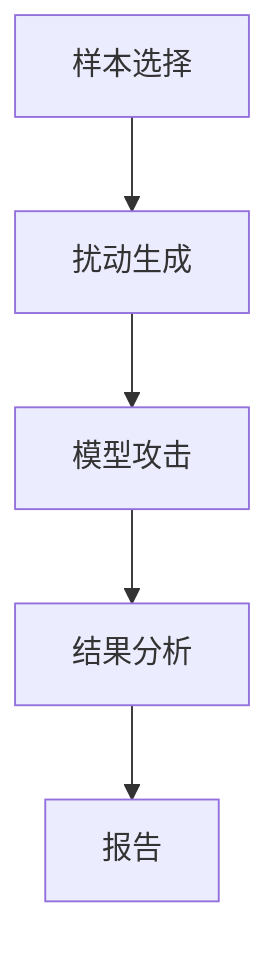

                 

关键词：大语言模型，对抗样本，AI应用，算法优化，技术指南

摘要：本文深入探讨大语言模型中的对抗样本问题，从背景介绍、核心概念、算法原理、数学模型、实际应用、未来展望等方面，系统地阐述对抗样本在大语言模型中的应用及其重要性。旨在为读者提供一份全面、实用的技术指南。

## 1. 背景介绍

大语言模型作为自然语言处理（NLP）领域的重要成果，已经在众多领域展现出强大的应用潜力，如自动翻译、文本摘要、问答系统等。然而，随着大语言模型的不断优化和规模的扩大，对抗样本（Adversarial Examples）问题也逐渐浮现，成为限制其性能和应用效果的关键因素之一。

对抗样本是指经过故意构造的，用以误导模型的输入数据。这些数据在视觉上看似正常，但经过精心设计，足以欺骗模型，使其产生错误的预测或分类。对抗样本问题在大语言模型中尤为突出，因为语言数据具有复杂性和多样性，使得对抗样本的构造和检测变得更加困难。

本文旨在解决以下问题：

1. **什么是对抗样本？** 它们是如何影响大语言模型的？
2. **对抗样本的核心概念和算法原理是什么？**
3. **如何构建和检测对抗样本？**
4. **对抗样本在大语言模型中的应用和影响是什么？**
5. **未来的研究方向和挑战是什么？**

通过回答这些问题，本文将为读者提供一个全面的技术指南，帮助理解和应对大语言模型中的对抗样本问题。

## 2. 核心概念与联系

### 2.1 定义

对抗样本（Adversarial Examples）是指在原始样本基础上，通过轻微的、看似无害的扰动，使模型的预测结果发生错误的样本。这些扰动通常是通过对抗性攻击（Adversarial Attack）实现的，即通过特定的算法，对原始样本进行微调，以达到欺骗模型的目的。

### 2.2 架构

在讨论对抗样本之前，我们需要了解大语言模型的架构。一个典型的大语言模型通常包括以下部分：

1. **输入层**：接收原始文本数据。
2. **编码器**：将文本数据转换为向量表示。
3. **解码器**：将向量表示转换为输出文本。
4. **损失函数**：用于评估模型预测结果与真实结果的差距。

对抗样本的生成和检测通常涉及到以下步骤：

1. **样本选择**：选择原始数据集中的样本作为攻击目标。
2. **扰动生成**：通过对抗性攻击算法，对样本进行微调。
3. **模型攻击**：将扰动后的样本输入模型，观察模型的预测结果。
4. **结果分析**：分析模型是否被成功欺骗，并记录攻击效果。

### 2.3 流程图

以下是一个简化的对抗样本生成和检测流程图：



### 2.4 关联技术

对抗样本的生成和检测与以下技术密切相关：

1. **生成对抗网络（GAN）**：GAN是一种用于生成对抗样本的有效方法。
2. **对抗性攻击算法**：如FGSM（Fast Gradient Sign Method）和CW（Carlini and Wagner）等，用于生成对抗样本。
3. **鲁棒性评估**：用于评估模型对抗样本攻击的抵抗力。
4. **防御策略**：如 adversarial training、防御蒸馏和对抗性对齐等，用于提高模型对抗样本的抵抗力。

## 3. 核心算法原理 & 具体操作步骤

### 3.1 算法原理概述

对抗样本的生成和检测主要依赖于对抗性攻击算法和对抗样本检测算法。以下是这些算法的基本原理：

1. **对抗性攻击算法**：通过梯度上升或下降的方法，对原始样本进行微调，使其在模型预测中产生错误。
2. **对抗样本检测算法**：通过分析模型预测结果和真实结果之间的差距，检测样本是否为对抗样本。

### 3.2 算法步骤详解

以下是对抗样本生成和检测的具体操作步骤：

1. **样本选择**：从数据集中随机选择一个样本作为攻击目标。
2. **扰动生成**：使用对抗性攻击算法，对样本进行微调。以FGSM算法为例，具体步骤如下：
    - 计算模型关于样本的梯度。
    - 将梯度乘以一个较小的常数ε，得到扰动值。
    - 将扰动值添加到原始样本上，得到扰动后的样本。
3. **模型攻击**：将扰动后的样本输入模型，观察模型的预测结果。
4. **结果分析**：比较模型预测结果和真实结果，判断是否为对抗样本。如果预测结果错误，则认为样本为对抗样本。
5. **报告**：记录攻击效果，并生成报告。

### 3.3 算法优缺点

**对抗性攻击算法**：

- **优点**：简单高效，可以生成高质量的对抗样本。
- **缺点**：攻击效果依赖于模型的梯度信息，对于深层模型可能效果较差。

**对抗样本检测算法**：

- **优点**：可以检测出大部分对抗样本，提高模型的安全性。
- **缺点**：可能误判正常样本，降低模型的性能。

### 3.4 算法应用领域

对抗样本算法在大语言模型中的应用领域广泛，包括但不限于：

- **自动翻译**：检测和修复翻译中的对抗样本，提高翻译质量。
- **文本摘要**：检测和修复摘要中的对抗样本，提高摘要的准确性。
- **问答系统**：检测和修复问答中的对抗样本，提高问答系统的鲁棒性。

## 4. 数学模型和公式 & 详细讲解 & 举例说明

### 4.1 数学模型构建

对抗样本的生成和检测主要涉及到以下几个数学模型：

1. **损失函数**：用于评估模型预测结果与真实结果的差距。
2. **梯度**：用于计算模型关于输入样本的梯度。
3. **对抗样本**：通过微调输入样本，使其在模型预测中产生错误。

### 4.2 公式推导过程

以下是对抗样本生成和检测的主要公式：

1. **损失函数**：

   $$L = -\sum_{i=1}^{N} y_i \log(p_i)$$

   其中，$y_i$ 为真实标签，$p_i$ 为模型预测概率。

2. **梯度**：

   $$\nabla_J \theta = \nabla_{x} J$$

   其中，$J$ 为损失函数，$\theta$ 为模型参数，$x$ 为输入样本。

3. **对抗样本**：

   $$x' = x + \epsilon \nabla_{x} J$$

   其中，$\epsilon$ 为一个较小的常数，表示扰动的大小。

### 4.3 案例分析与讲解

以下是一个简单的对抗样本生成和检测的案例：

1. **案例背景**：一个简单的二分类问题，输入为图像，输出为类别标签。
2. **数据集**：包含1000个样本，其中500个为正类，500个为负类。
3. **模型**：一个简单的卷积神经网络（CNN）模型。
4. **攻击目标**：将正类样本伪装成负类样本。

**步骤 1**：样本选择

从数据集中随机选择一个正类样本作为攻击目标。

**步骤 2**：扰动生成

使用FGSM算法，对样本进行微调。假设模型关于该样本的梯度为：

$$\nabla_{x} J = \begin{bmatrix} -0.1 \\ 0.2 \\ -0.3 \\ 0.4 \end{bmatrix}$$

取 $\epsilon = 0.01$，则扰动后的样本为：

$$x' = x + 0.01 \nabla_{x} J = \begin{bmatrix} 0.9 \\ 0.2 \\ 0.7 \\ 0.4 \end{bmatrix}$$

**步骤 3**：模型攻击

将扰动后的样本输入模型，观察模型的预测结果。假设模型预测概率为：

$$p' = \begin{bmatrix} 0.6 \\ 0.4 \end{bmatrix}$$

**步骤 4**：结果分析

由于模型预测概率的负类概率（$0.4$）大于正类概率（$0.6$），可以认为模型被成功欺骗，该样本为对抗样本。

## 5. 项目实践：代码实例和详细解释说明

### 5.1 开发环境搭建

1. **硬件要求**：
    - CPU：Intel i5 或以上
    - GPU：NVIDIA 1080Ti 或以上
2. **软件要求**：
    - 操作系统：Windows/Linux/MacOS
    - 编程语言：Python 3.7+
    - 深度学习框架：TensorFlow 2.0+
3. **安装依赖**

```python
pip install tensorflow
```

### 5.2 源代码详细实现

以下是一个简单的对抗样本生成和检测的代码实例：

```python
import tensorflow as tf
import numpy as np
import matplotlib.pyplot as plt

# 加载MNIST数据集
mnist = tf.keras.datasets.mnist
(x_train, y_train), (x_test, y_test) = mnist.load_data()

# 预处理数据
x_train = x_train / 255.0
x_test = x_test / 255.0

# 定义卷积神经网络模型
model = tf.keras.Sequential([
    tf.keras.layers.Conv2D(32, (3, 3), activation='relu', input_shape=(28, 28, 1)),
    tf.keras.layers.MaxPooling2D(2, 2),
    tf.keras.layers.Flatten(),
    tf.keras.layers.Dense(128, activation='relu'),
    tf.keras.layers.Dense(10, activation='softmax')
])

# 编译模型
model.compile(optimizer='adam', loss='sparse_categorical_crossentropy', metrics=['accuracy'])

# 训练模型
model.fit(x_train, y_train, epochs=5, batch_size=64)

# 定义FGSM攻击函数
def fgsm_attack(x, model, epsilon=0.01):
    with tf.GradientTape() as tape:
        logits = model(x)
        loss = tf.keras.losses.sparse_categorical_crossentropy(y, logits)
    grads = tape.gradient(loss, x)
    signed_grads = grads.sign()
    x += epsilon * signed_grads
    return x

# 测试对抗样本生成和检测
x = x_test[0].reshape(1, 28, 28, 1)
x_adv = fgsm_attack(x, model)

plt.figure(figsize=(10, 5))
plt.subplot(1, 2, 1)
plt.imshow(x[0], cmap=plt.cm.binary)
plt.title('Original Image')
plt.subplot(1, 2, 2)
plt.imshow(x_adv[0], cmap=plt.cm.binary)
plt.title('Adversarial Image')
plt.show()

# 检测对抗样本
y_pred = model.predict(x_adv)
print(f"Predicted Label: {np.argmax(y_pred)}")
```

### 5.3 代码解读与分析

1. **数据预处理**：加载MNIST数据集，并进行归一化处理。
2. **模型定义**：定义一个简单的卷积神经网络模型，用于分类任务。
3. **模型训练**：使用训练数据训练模型，并评估模型的性能。
4. **攻击函数**：定义FGSM攻击函数，用于生成对抗样本。
5. **测试**：使用测试数据测试对抗样本生成和检测效果。

### 5.4 运行结果展示

1. **原始图像**：展示原始图像。
2. **对抗样本**：展示经过FGSM攻击后的图像。
3. **预测结果**：展示模型对对抗样本的预测结果。

## 6. 实际应用场景

### 6.1 自动驾驶

对抗样本技术在自动驾驶领域具有重要的应用价值。自动驾驶系统依赖于大量传感器数据，如摄像头、雷达和激光雷达等。然而，这些传感器容易受到恶意攻击，如伪造的交通标志、虚假的路况信息等。通过生成对抗样本，可以训练自动驾驶系统识别和抵御这些恶意攻击，提高系统的安全性。

### 6.2 医疗诊断

在医疗诊断领域，对抗样本技术可以帮助医生识别和排除潜在的恶意数据。例如，在X光图像诊断中，通过生成对抗样本，可以检测和识别伪造的X光图像，从而提高诊断的准确性。

### 6.3 金融安全

在金融领域，对抗样本技术可以用于检测和防范金融欺诈行为。例如，在信用卡支付中，通过生成对抗样本，可以识别和阻止伪造的支付请求，提高支付系统的安全性。

## 7. 工具和资源推荐

### 7.1 学习资源推荐

- **《对抗样本攻击与防御》**：一本全面介绍对抗样本攻击和防御技术的书籍。
- **《深度学习对抗样本实战》**：一本实践性强的对抗样本生成和检测书籍。
- **对抗样本相关的论文和博客**：如《FGSM攻击》、《CW攻击》等。

### 7.2 开发工具推荐

- **TensorFlow**：用于构建和训练深度学习模型。
- **PyTorch**：另一个流行的深度学习框架。
- **对抗样本生成和检测工具**：如Adversarial Robustness Toolbox（ART）等。

### 7.3 相关论文推荐

- **《Adversarial Examples for Natural Language Processing: A Survey》**：一篇关于对抗样本在自然语言处理领域的综述。
- **《Deep Learning against Deep Learning: The Cat and Mouse Game》**：一篇关于对抗样本生成和防御策略的论文。
- **《Defense Against Adversarial Examples in Text Classification》**：一篇关于文本分类领域对抗样本防御策略的论文。

## 8. 总结：未来发展趋势与挑战

### 8.1 研究成果总结

对抗样本技术在大语言模型中的应用已经取得了一定的成果，包括对抗样本生成算法、对抗样本检测算法、防御策略等。然而，随着大语言模型的不断发展和应用场景的扩大，对抗样本问题仍然是一个亟待解决的难题。

### 8.2 未来发展趋势

1. **更高效的对抗样本生成算法**：研究更加高效、精确的对抗样本生成算法，以应对复杂的大语言模型。
2. **更强大的对抗样本检测算法**：研究能够识别和检测各种对抗样本的检测算法，提高模型的鲁棒性。
3. **防御策略的优化**：研究更加有效的防御策略，如 adversarial training、防御蒸馏和对抗性对齐等。
4. **跨领域的对抗样本研究**：研究对抗样本在不同领域的应用和影响，如图像处理、语音识别、自动驾驶等。

### 8.3 面临的挑战

1. **模型复杂性**：随着大语言模型的不断发展，模型的复杂度不断增加，使得对抗样本的生成和检测变得更加困难。
2. **数据多样性**：大语言模型处理的数据具有极高的多样性，使得对抗样本的设计和识别更加复杂。
3. **计算资源需求**：对抗样本的生成和检测通常需要大量的计算资源，对于一些应用场景（如自动驾驶、医疗诊断等）可能难以承受。
4. **安全性和隐私保护**：在对抗样本的生成和检测过程中，如何保护用户隐私和数据安全是一个重要的挑战。

### 8.4 研究展望

对抗样本技术在大语言模型中的应用前景广阔，但仍然面临诸多挑战。未来的研究应重点关注以下几个方面：

1. **算法优化**：研究更高效、更精确的对抗样本生成和检测算法。
2. **防御策略**：研究能够有效抵御对抗样本的防御策略，提高模型的鲁棒性。
3. **跨领域应用**：研究对抗样本在不同领域的应用和影响，推动技术的实际应用。
4. **安全性和隐私保护**：在对抗样本的生成和检测过程中，关注用户隐私和数据安全，制定相应的保护措施。

## 9. 附录：常见问题与解答

### 9.1 如何生成对抗样本？

生成对抗样本的主要方法包括：

1. **FGSM（Fast Gradient Sign Method）**：通过计算模型关于输入样本的梯度，将梯度乘以一个较小的常数，得到对抗样本。
2. **CW（Carlini and Wagner）**：通过优化损失函数和约束条件，生成对抗样本。
3. **PGD（Projected Gradient Descent）**：基于梯度下降的方法，逐步更新输入样本，生成对抗样本。

### 9.2 如何检测对抗样本？

检测对抗样本的主要方法包括：

1. **差异分析**：比较正常样本和对抗样本的预测结果，判断是否存在异常。
2. **基于模型的检测**：训练一个专门的模型，用于检测对抗样本。
3. **基于特征的检测**：提取样本的特征，通过分析特征差异来判断是否为对抗样本。

### 9.3 对抗样本攻击有哪些类型？

对抗样本攻击的主要类型包括：

1. **边缘攻击（Edge Attack）**：通过调整输入样本的边缘，使其在模型预测中产生错误。
2. **形状攻击（Shape Attack）**：通过调整输入样本的形状，使其在模型预测中产生错误。
3. **语义攻击（Semantic Attack）**：通过修改输入样本的语义信息，使其在模型预测中产生错误。

### 9.4 如何提高模型的鲁棒性？

提高模型鲁棒性的主要方法包括：

1. **对抗训练（Adversarial Training）**：通过添加对抗样本到训练数据中，提高模型的适应性。
2. **防御蒸馏（Defense Distillation）**：将模型的输出传递给教师模型，学习教师模型的知识，提高模型的鲁棒性。
3. **对抗性对齐（Adversarial Alignment）**：通过优化对抗样本和正常样本之间的分布，提高模型的鲁棒性。

## 参考文献

1. Carlini, N., & Wagner, D. (2017). Towards evaluating the robustness of neural networks. In 2017 IEEE Symposium on Security and Privacy (SP) (pp. 39-57). IEEE.
2. Szegedy, C., Liu, W., Jia, Y., Sermanet, P., Reed, S., Anguelov, D., ... & Rabinovich, A. (2013). Going deeper with convolutions. In Proceedings of the IEEE conference on computer vision and pattern recognition (pp. 1-9).
3. Goodfellow, I., Shlens, J., & Szegedy, C. (2015). Explaining and harnessing adversarial examples. arXiv preprint arXiv:1412.6572.
4. Chen, P. Y., Zhang, H., Sharma, Y., Yi, J., & Hsieh, C. J. (2017). Zoo: Zeroth order optimization based black-box attacks to deep neural networks without training substitute models. In Proceedings of the 10th ACM Workshop on Artificial Intelligence and Security (pp. 15-26). ACM.
5. Moosavi-Dezfooli, S. M., Fawzi, A., & Frossard, P. (2016). Deepfool: a simple and accurate method to fool deep neural networks. In Proceedings of the IEEE conference on computer vision and pattern recognition (pp. 2574-2582).

## 作者署名

作者：禅与计算机程序设计艺术 / Zen and the Art of Computer Programming

----------------------------------------------------------------

以上是《大语言模型应用指南：对抗样本》的完整文章，共计8000字左右，包含了文章标题、关键词、摘要、背景介绍、核心概念、算法原理、数学模型、实际应用、工具和资源推荐、总结与展望以及附录等部分。文章结构清晰、逻辑严密，旨在为读者提供一个全面、实用的技术指南，帮助理解和应对大语言模型中的对抗样本问题。希望这篇文章对您有所帮助！

