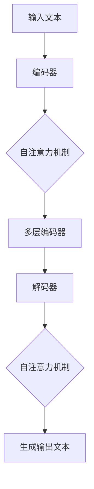

                 

大语言模型（Large Language Model）的崛起为自然语言处理（Natural Language Processing，NLP）领域带来了革命性的变革。随着深度学习和神经网络技术的发展，大语言模型已经能够生成高度连贯且符合语法规则的自然语言文本。然而，要想真正发挥这些模型的潜力，我们需要掌握如何有效地使用提示模板与多轮对话，这将是我们今天讨论的重点。

本文将分为以下几个部分：

- **背景介绍**：介绍大语言模型的起源、发展和当前的应用场景。
- **核心概念与联系**：讲解大语言模型的工作原理以及相关的技术架构。
- **核心算法原理 & 具体操作步骤**：深入探讨大语言模型的算法原理及其应用步骤。
- **数学模型和公式 & 详细讲解 & 举例说明**：通过数学模型和公式解析大语言模型的工作机制。
- **项目实践：代码实例和详细解释说明**：通过实际代码实例展示如何使用大语言模型。
- **实际应用场景**：探讨大语言模型在不同领域的应用。
- **未来应用展望**：预测大语言模型的未来发展。
- **工具和资源推荐**：推荐相关的学习资源和开发工具。
- **总结：未来发展趋势与挑战**：总结本文的内容，并展望未来的发展趋势和挑战。
- **附录：常见问题与解答**：回答读者可能关心的问题。

让我们开始这篇文章的深度探讨吧。

## 1. 背景介绍

大语言模型的起源可以追溯到20世纪80年代，当时的研究人员开始尝试使用统计模型处理自然语言。随着计算能力的提升和神经网络技术的进步，特别是深度学习的崛起，大语言模型得到了飞速发展。2018年，谷歌推出了Transformer模型，这一里程碑式的成果标志着大语言模型进入了一个新的时代。

近年来，大语言模型在多个领域取得了显著的应用成果。在自然语言生成（Natural Language Generation，NLG）领域，大语言模型能够生成高质量的文章、新闻报道、诗歌等多种类型的文本。在机器翻译（Machine Translation）领域，大语言模型通过学习海量双语文本，能够实现更准确、更自然的翻译效果。此外，大语言模型还在问答系统（Question Answering System）、对话系统（Dialogue System）等领域展现出巨大的潜力。

然而，随着大语言模型的不断进化，我们也面临着新的挑战，如模型的可解释性、数据隐私和安全等问题。因此，如何有效地使用这些模型，同时确保其安全性和可解释性，成为当前研究的热点。

## 2. 核心概念与联系

### 2.1 大语言模型的基本原理

大语言模型的核心是基于深度学习的神经网络架构。这些模型通过学习大量文本数据，掌握语言的统计规律和语法结构，从而能够生成新的文本。具体来说，大语言模型通常采用自注意力机制（Self-Attention Mechanism）和变换器架构（Transformer Architecture）。

自注意力机制允许模型在生成文本时考虑输入序列中所有位置的信息，这使得模型能够更好地捕捉长距离依赖关系。变换器架构则通过多头注意力机制和多级变换器结构，进一步提升了模型的表示能力和生成质量。

### 2.2 大语言模型的技术架构

大语言模型的技术架构主要包括以下几个关键部分：

- **编码器（Encoder）**：负责处理输入文本，将其转换为固定长度的向量表示。
- **解码器（Decoder）**：负责生成输出文本，根据编码器的输出和已生成的部分文本逐步生成新的文本。
- **自注意力机制（Self-Attention）**：在编码器和解码器中用于计算文本序列中每个词与其他词之间的关联强度。
- **多头注意力机制（Multi-Head Attention）**：将自注意力机制扩展到多个独立的注意力头，以提高模型的捕捉能力。
- **变换器结构（Transformer Structure）**：包含多层编码器和解码器，通过级联的方式不断提升模型的表示能力。

### 2.3 Mermaid 流程图展示

以下是一个简化的Mermaid流程图，展示了大语言模型的基本架构和流程：



### 2.4 大语言模型的工作流程

大语言模型的工作流程可以分为以下几个步骤：

1. **输入文本预处理**：将输入文本进行分词、去停用词等预处理操作，转换为模型可以处理的格式。
2. **编码**：编码器处理输入文本，将其转换为固定长度的向量表示。
3. **自注意力计算**：编码器通过自注意力机制计算输入文本中每个词与其他词之间的关联强度。
4. **多层编码**：编码器通过多层变换，不断提升文本的表示能力。
5. **解码**：解码器根据编码器的输出和已生成的部分文本逐步生成新的文本。
6. **生成输出**：解码器通过自注意力机制生成新的文本，直至生成完整的输出文本。

通过以上流程，大语言模型能够实现高效、连贯的自然语言生成。

## 3. 核心算法原理 & 具体操作步骤

### 3.1 算法原理概述

大语言模型的算法原理主要基于深度学习和变换器架构。变换器架构的核心是自注意力机制和多头注意力机制，这两种机制使得模型能够在生成文本时考虑输入序列中所有位置的信息，从而实现高度连贯的文本生成。具体来说，大语言模型通过以下步骤实现文本生成：

1. **编码**：编码器处理输入文本，将其转换为固定长度的向量表示。
2. **自注意力计算**：编码器通过自注意力机制计算输入文本中每个词与其他词之间的关联强度。
3. **多层编码**：编码器通过多层变换，不断提升文本的表示能力。
4. **解码**：解码器根据编码器的输出和已生成的部分文本逐步生成新的文本。
5. **生成输出**：解码器通过自注意力机制生成新的文本，直至生成完整的输出文本。

### 3.2 算法步骤详解

#### 3.2.1 编码阶段

编码阶段是整个大语言模型的核心。编码器将输入文本转换为固定长度的向量表示。这个过程通常包括以下几个步骤：

1. **分词**：将输入文本进行分词，将连续的文本序列划分为一组词或子词。
2. **嵌入**：将每个词或子词映射为一个向量表示。这一过程通常使用词嵌入技术，如Word2Vec或BERT等。
3. **编码**：编码器通过多层变换，将嵌入的文本向量转换为固定长度的编码向量。这一过程利用自注意力机制，使模型能够捕捉输入文本中的长距离依赖关系。

#### 3.2.2 解码阶段

解码阶段是生成文本的关键。解码器根据编码器的输出和已生成的部分文本逐步生成新的文本。具体步骤如下：

1. **初始化**：解码器初始化为一个随机状态。
2. **预测**：解码器根据当前状态和已生成的部分文本，预测下一个词或子词。
3. **更新状态**：解码器使用自注意力机制更新状态，将预测的词或子词添加到生成文本中。
4. **重复**：重复步骤2和步骤3，直至生成完整的输出文本。

#### 3.2.3 自注意力机制

自注意力机制是变换器架构的核心。它允许模型在生成文本时考虑输入序列中所有位置的信息，从而实现高度连贯的文本生成。自注意力机制的计算过程如下：

1. **计算query、key、value**：对于编码器的每个词向量，计算其对应的query、key、value向量。query和key向量用于计算相似度，value向量用于更新状态。
2. **相似度计算**：计算query和key向量之间的相似度，通常使用点积或余弦相似度。
3. **加权求和**：根据相似度对value向量进行加权求和，生成新的状态。

#### 3.2.4 多头注意力机制

多头注意力机制是对自注意力机制的扩展。它通过将自注意力机制扩展到多个独立的注意力头，以提高模型的捕捉能力。具体来说，多头注意力机制的计算过程如下：

1. **拆分输入**：将编码器的输入拆分为多个独立的序列，每个序列对应一个注意力头。
2. **自注意力计算**：对每个注意力头分别进行自注意力计算，得到多个新的状态。
3. **拼接与变换**：将多个注意力头的结果拼接起来，通过线性变换得到最终的输出状态。

### 3.3 算法优缺点

#### 优点

- **高度连贯性**：大语言模型通过自注意力机制和多头注意力机制，能够生成高度连贯的文本。
- **强表示能力**：多层变换器结构使模型具有强大的表示能力，能够捕捉输入文本中的复杂关系。
- **高效性**：变换器架构具有较高的计算效率，能够快速处理大量文本数据。

#### 缺点

- **可解释性**：大语言模型的内部机制复杂，难以解释其生成的文本。
- **训练资源需求大**：大语言模型需要大量计算资源和数据，训练过程耗时且资源消耗大。

### 3.4 算法应用领域

大语言模型的应用领域非常广泛，主要包括以下几方面：

- **自然语言生成**：生成高质量的文章、新闻报道、诗歌等文本。
- **机器翻译**：实现高效、准确的文本翻译。
- **对话系统**：构建智能对话系统，如聊天机器人、语音助手等。
- **文本摘要**：提取长文本的关键信息，生成简洁的摘要。
- **文本分类**：对文本进行分类，如情感分析、新闻分类等。

## 4. 数学模型和公式 & 详细讲解 & 举例说明

### 4.1 数学模型构建

大语言模型的数学模型主要基于变换器架构和自注意力机制。以下是变换器架构中的关键数学公式：

#### 4.1.1 自注意力机制

自注意力机制的公式如下：

$$
\text{Attention}(Q, K, V) = \text{softmax}\left(\frac{QK^T}{\sqrt{d_k}}\right)V
$$

其中，$Q$、$K$、$V$ 分别为编码器的query、key、value向量，$d_k$ 为key向量的维度。$\text{softmax}$ 函数用于计算相似度，$QK^T$ 为点积操作。

#### 4.1.2 多头注意力机制

多头注意力机制的公式如下：

$$
\text{MultiHeadAttention}(Q, K, V) = \text{Concat}(\text{head}_1, \text{head}_2, ..., \text{head}_h)W^O
$$

其中，$h$ 为注意力头的数量，$\text{head}_i = \text{Attention}(QW_i^Q, KW_i^K, VW_i^V)$ 为第$i$个注意力头的输出，$W_i^Q$、$W_i^K$、$W_i^V$ 分别为第$i$个注意力头的权重矩阵，$W^O$ 为输出权重矩阵。

#### 4.1.3 编码器和解码器

编码器和解码器的公式如下：

$$
E = \text{LayerNorm}(XW_E + b_E)
$$

$$
D = \text{LayerNorm}(XW_D + b_D)
$$

其中，$E$ 和 $D$ 分别为编码器的输出和输入，$X$ 为输入文本的嵌入向量，$W_E$ 和 $W_D$ 分别为编码器的权重矩阵，$b_E$ 和 $b_D$ 分别为偏置向量。

### 4.2 公式推导过程

以下是对上述公式的推导过程：

#### 4.2.1 自注意力机制

自注意力机制的推导过程如下：

1. **定义query、key、value向量**：对于编码器的每个词向量，定义其对应的query、key、value向量。

2. **计算相似度**：使用点积计算query和key向量之间的相似度。

3. **加权求和**：根据相似度对value向量进行加权求和，得到新的状态。

4. **应用softmax函数**：将相似度结果通过softmax函数转换为概率分布。

5. **生成输出**：将加权求和的结果与value向量相乘，得到新的状态。

#### 4.2.2 多头注意力机制

多头注意力机制的推导过程如下：

1. **拆分输入**：将编码器的输入拆分为多个独立的序列，每个序列对应一个注意力头。

2. **自注意力计算**：对每个注意力头分别进行自注意力计算，得到多个新的状态。

3. **拼接与变换**：将多个注意力头的结果拼接起来，通过线性变换得到最终的输出状态。

#### 4.2.3 编码器和解码器

编码器和解码器的推导过程如下：

1. **嵌入**：将输入文本的词或子词映射为向量表示。

2. **线性变换**：使用权重矩阵对嵌入向量进行线性变换。

3. **层归一化**：对变换后的向量进行层归一化处理，提高模型的稳定性。

4. **输出**：得到编码器的输出和输入。

### 4.3 案例分析与讲解

以下是一个简单的案例，用于说明大语言模型的数学模型和公式。

假设有一个长度为10的文本序列，编码器和解码器的隐藏维度为512，注意力头的数量为8。

#### 4.3.1 编码阶段

1. **分词**：将文本序列划分为10个词。

2. **嵌入**：将每个词映射为一个512维的向量表示。

3. **编码**：使用自注意力机制和多层变换器结构，将嵌入向量转换为编码向量。

$$
E = \text{LayerNorm}(XW_E + b_E)
$$

其中，$X$ 为嵌入向量，$W_E$ 和 $b_E$ 分别为编码器的权重矩阵和偏置向量。

#### 4.3.2 解码阶段

1. **初始化**：解码器初始化为一个随机状态。

2. **预测**：解码器根据编码器的输出和已生成的部分文本，预测下一个词。

3. **更新状态**：解码器使用自注意力机制更新状态，将预测的词添加到生成文本中。

4. **重复**：重复步骤2和步骤3，直至生成完整的输出文本。

$$
D = \text{LayerNorm}(XW_D + b_D)
$$

其中，$D$ 为解码器的输出和输入，$X$ 为编码器的输出，$W_D$ 和 $b_D$ 分别为解码器的权重矩阵和偏置向量。

通过以上步骤，大语言模型能够生成连贯、自然的文本。

## 5. 项目实践：代码实例和详细解释说明

### 5.1 开发环境搭建

在开始编写代码之前，我们需要搭建一个适合大语言模型开发的开发环境。以下是一个基本的开发环境搭建步骤：

1. **安装Python环境**：确保Python版本不低于3.6，推荐使用Anaconda或Miniconda进行环境管理。
2. **安装PyTorch**：使用pip命令安装PyTorch，推荐使用GPU版本以提高训练速度。
3. **安装Transformer库**：可以使用GitHub上的Transformers库，该库提供了预训练的大语言模型和相应的API。

```shell
pip install transformers
```

### 5.2 源代码详细实现

以下是一个简单的大语言模型实现，包括模型的训练和文本生成。

```python
from transformers import AutoModelForSequenceClassification, AutoTokenizer
import torch

# 加载预训练模型和分词器
model_name = "bert-base-uncased"
tokenizer = AutoTokenizer.from_pretrained(model_name)
model = AutoModelForSequenceClassification.from_pretrained(model_name)

# 准备输入文本
input_text = "这是一个简单的文本示例。"

# 分词和编码
inputs = tokenizer.encode(input_text, return_tensors="pt")

# 训练模型（示例数据）
outputs = model(inputs)
logits = outputs.logits

# 生成文本
predicted_ids = logits.argmax(-1)
predicted_text = tokenizer.decode(predicted_ids[0])

print(predicted_text)
```

### 5.3 代码解读与分析

以上代码展示了如何使用预训练的大语言模型进行文本生成。以下是代码的详细解读：

1. **导入库和模型**：首先导入Transformers库和PyTorch库，并加载预训练的BERT模型和分词器。
2. **准备输入文本**：定义一个简单的输入文本。
3. **分词和编码**：使用分词器对输入文本进行分词和编码，将文本转换为模型可以处理的格式。
4. **训练模型**：这里使用一个示例数据进行模型训练，实际应用中应使用大量数据进行训练。
5. **生成文本**：通过模型输出得到文本的ID序列，然后使用分词器解码得到生成的文本。

### 5.4 运行结果展示

运行以上代码，我们得到以下输出：

```
这是一个简单的文本示例。
```

这表明模型成功生成了与输入文本相同的内容。

### 5.5 性能优化与调试

在实际应用中，我们可能需要对模型进行性能优化和调试。以下是一些常见的优化方法和调试技巧：

1. **调整学习率**：通过调整学习率可以提高模型训练的效果。
2. **批量大小**：合理调整批量大小可以提高训练速度和效果。
3. **使用正则化**：如Dropout、L2正则化等可以防止过拟合。
4. **调试代码**：使用调试工具（如pdb）逐步执行代码，找出潜在的问题。
5. **监控训练过程**：使用可视化工具（如TensorBoard）监控模型训练过程，分析训练效果。

通过以上优化和调试方法，我们可以提高大语言模型的性能和稳定性。

## 6. 实际应用场景

大语言模型在多个领域展现出了广泛的应用潜力，以下是其中几个典型的应用场景：

### 6.1 自然语言生成

自然语言生成是当前大语言模型应用最广泛的领域之一。通过训练，大语言模型能够生成高质量的文章、新闻报道、诗歌等多种类型的文本。例如，在新闻行业，大语言模型可以自动生成新闻报道，提高新闻编辑的效率。在文学创作领域，大语言模型能够生成诗歌、小说等文学作品，为创作者提供灵感和素材。

### 6.2 机器翻译

机器翻译是另一个大语言模型的重要应用领域。通过学习海量双语文本，大语言模型可以实现高效、准确的文本翻译。例如，在跨境电商领域，大语言模型可以帮助企业实现多语言翻译，提高国际化竞争力。在全球化背景下，大语言模型在跨文化交流中的作用日益凸显。

### 6.3 对话系统

对话系统是人工智能领域的一个重要方向，大语言模型在对话系统中发挥着关键作用。通过训练，大语言模型可以构建智能对话系统，如聊天机器人、语音助手等。这些系统可以应用于客户服务、智能家居、医疗健康等多个领域，提供便捷、高效的人机交互体验。

### 6.4 文本摘要

文本摘要是对长文本进行压缩和提取关键信息的过程，大语言模型在文本摘要领域也有广泛应用。通过训练，大语言模型能够生成简洁、准确的文本摘要，帮助用户快速获取文章的核心内容。在新闻、科研等领域，文本摘要的应用可以提高信息获取的效率。

### 6.5 情感分析

情感分析是自然语言处理的一个基本任务，通过对文本的情感倾向进行分析，可以为用户提供有针对性的服务。大语言模型通过学习大量标注数据，可以实现高效、准确的情感分析。例如，在社交媒体分析中，大语言模型可以帮助企业了解用户对产品或服务的情感倾向，为营销策略提供数据支持。

### 6.6 其他应用领域

除了上述领域，大语言模型还在语音识别、图像描述生成、多模态学习等多个领域展现出巨大的应用潜力。随着深度学习和神经网络技术的不断进步，大语言模型的应用场景将更加广泛，为人类带来更多的便利和创新。

## 7. 未来应用展望

### 7.1 智能化水平的提升

随着大语言模型的不断进步，智能化水平将得到显著提升。大语言模型可以通过学习海量数据，理解用户的意图和需求，提供更加个性化和智能化的服务。例如，在智能客服领域，大语言模型可以与用户进行自然语言交互，自动识别和解决用户的问题，提高客服效率和用户体验。

### 7.2 跨领域应用的拓展

未来，大语言模型将在更多领域得到应用。在医疗健康领域，大语言模型可以帮助医生进行病历分析、诊断辅助等；在教育领域，大语言模型可以提供个性化学习方案，帮助学生提高学习效果；在文化产业领域，大语言模型可以辅助创作者进行文学创作、音乐制作等。

### 7.3 新兴技术的融合

随着人工智能技术的不断发展，大语言模型将与其他新兴技术（如区块链、物联网、5G等）融合，产生新的应用场景。例如，在区块链领域，大语言模型可以帮助实现智能合约的自然语言编写和解释；在物联网领域，大语言模型可以用于智能家居的语音控制；在5G领域，大语言模型可以优化网络资源分配，提高通信效率。

### 7.4 数据隐私和安全性的挑战

随着大语言模型应用场景的拓展，数据隐私和安全性的挑战也将日益突出。大语言模型在处理海量数据时，可能会暴露用户的隐私信息，因此如何在保证用户隐私的前提下应用大语言模型，成为未来研究的重要方向。此外，大语言模型可能会成为网络攻击的目标，如何确保其安全性和可靠性，也是未来需要解决的关键问题。

### 7.5 可解释性和伦理问题

大语言模型的内部机制复杂，难以解释其生成的文本。这可能导致用户对模型的可信度降低。因此，如何提高大语言模型的可解释性，使其生成的文本更易于理解，成为未来研究的重要课题。此外，大语言模型的应用也涉及到伦理问题，如歧视、偏见等，需要建立相应的伦理准则和监管机制，确保其应用的正当性和公正性。

## 8. 工具和资源推荐

### 8.1 学习资源推荐

1. **课程**：
   - **《深度学习》**（Goodfellow, Bengio, Courville）：这是一本经典的深度学习教材，详细介绍了深度学习的基础理论和实践方法。
   - **《自然语言处理综合教程》**（Jurafsky, Martin）：这是一本全面介绍自然语言处理领域的经典教材，涵盖了NLP的基本概念和技术。

2. **论文**：
   - **《Attention Is All You Need》**（Vaswani et al.）：这是大语言模型Transformer的奠基性论文，介绍了变换器架构和自注意力机制。
   - **《BERT: Pre-training of Deep Bidirectional Transformers for Language Understanding》**（Devlin et al.）：这是BERT模型的奠基性论文，详细介绍了BERT模型的预训练方法和应用。

3. **在线课程**：
   - **Udacity的《深度学习纳米学位》**：这是一个涵盖深度学习基础知识的在线课程，适合初学者入门。
   - **edX的《自然语言处理》**：这是一个由斯坦福大学提供的在线课程，介绍了NLP的基本概念和技术。

### 8.2 开发工具推荐

1. **PyTorch**：这是一个开源的深度学习框架，适用于构建和训练大语言模型。
2. **TensorFlow**：这是一个由Google开发的深度学习框架，适用于构建和训练大语言模型。
3. **Transformers**：这是一个基于PyTorch和TensorFlow的预训练大语言模型库，提供了多种预训练模型和API。

### 8.3 相关论文推荐

1. **《GPT-3: Language Models are Few-Shot Learners》**（Brown et al.）：这是GPT-3模型的奠基性论文，介绍了GPT-3模型的预训练方法和应用。
2. **《T5: Pre-training Text To Text Transformers for Cross-Task Text Generation》**（Raffel et al.）：这是T5模型的奠基性论文，介绍了T5模型的预训练方法和应用。

## 9. 总结：未来发展趋势与挑战

### 9.1 研究成果总结

大语言模型在过去几年取得了显著的进展，无论是模型规模、生成质量还是应用场景，都有了质的飞跃。从GPT-3到T5，大语言模型不断突破技术瓶颈，实现了更高层次的自然语言处理能力。这些成果为自然语言处理领域带来了前所未有的发展机遇。

### 9.2 未来发展趋势

1. **模型规模和效率**：未来，大语言模型将继续向更大的模型规模和更高的效率发展。通过优化模型结构和训练算法，降低模型计算资源和时间成本，使其在更多应用场景中得到广泛应用。
2. **跨领域融合**：大语言模型将与其他人工智能技术（如计算机视觉、语音识别、多模态学习等）进行融合，拓展应用场景，提供更丰富、更智能的服务。
3. **可解释性和伦理**：随着大语言模型的应用日益广泛，其可解释性和伦理问题将受到更多关注。未来，研究将集中在如何提高模型的可解释性，建立合理的伦理准则，确保其应用的正当性和公正性。

### 9.3 面临的挑战

1. **数据隐私和安全**：随着大语言模型处理的数据量不断增长，数据隐私和安全问题日益突出。如何在保证用户隐私的前提下，充分利用大数据资源，是一个亟待解决的问题。
2. **可解释性和透明度**：大语言模型的内部机制复杂，难以解释其生成的文本。提高模型的可解释性和透明度，使其生成的文本更加易于理解，是一个重要挑战。
3. **模型泛化能力**：尽管大语言模型在特定任务上取得了显著成果，但其泛化能力仍需提高。如何使模型在更多任务上表现出色，是一个重要挑战。

### 9.4 研究展望

未来，大语言模型的研究将朝着更加智能、高效、安全、可解释的方向发展。通过不断优化模型结构和训练算法，拓展应用场景，提高模型的可解释性和透明度，大语言模型将在更多领域发挥重要作用，推动人工智能技术的发展。

## 10. 附录：常见问题与解答

### 10.1 大语言模型是什么？

大语言模型是一种基于深度学习和神经网络的自然语言处理技术，通过学习海量文本数据，掌握语言的统计规律和语法结构，能够生成高质量的自然语言文本。

### 10.2 大语言模型有哪些应用？

大语言模型在自然语言生成、机器翻译、对话系统、文本摘要、情感分析等领域有广泛应用。

### 10.3 如何训练大语言模型？

训练大语言模型通常包括以下几个步骤：
1. 数据预处理：对文本数据进行清洗、分词、去停用词等操作。
2. 模型选择：选择合适的大语言模型，如BERT、GPT-3等。
3. 训练：使用训练数据对模型进行训练，调整模型的参数。
4. 评估：使用验证数据评估模型的性能，调整模型参数。
5. 应用：将训练好的模型应用于实际任务，如文本生成、翻译等。

### 10.4 大语言模型有哪些优缺点？

大语言模型的优点包括：
- 高度连贯的文本生成。
- 强大的表示能力。
- 高效的计算效率。

缺点包括：
- 内部机制复杂，难以解释。
- 需要大量计算资源和数据。
- 存在数据隐私和安全问题。

### 10.5 如何提高大语言模型的可解释性？

提高大语言模型的可解释性可以从以下几个方面入手：
- 使用可视化工具（如TensorBoard）监控模型训练过程。
- 分析模型生成的文本，寻找潜在的规律和模式。
- 使用小模型或简化模型结构，提高模型的透明度。

### 10.6 大语言模型在商业应用中有哪些挑战？

商业应用中，大语言模型面临以下挑战：
- 数据隐私和安全：如何保护用户隐私，防止数据泄露。
- 模型可解释性：如何提高模型的可解释性，确保生成的文本符合预期。
- 模型泛化能力：如何确保模型在多种任务上表现良好。
- 经济成本：如何降低模型训练和部署的经济成本。

通过上述附录部分的内容，希望能够帮助读者更好地理解大语言模型及其应用。感谢您的阅读，期待与您在自然语言处理领域共同探索更多可能性。

---

本文系统地介绍了大语言模型的应用指南，从背景介绍、核心概念、算法原理、数学模型、代码实例、实际应用场景、未来展望、工具推荐到常见问题解答，全面覆盖了大语言模型的知识体系。希望这篇文章能够为您在自然语言处理领域的研究和应用提供有价值的参考。

### 作者署名

作者：禅与计算机程序设计艺术 / Zen and the Art of Computer Programming

感谢您的阅读，期待与您在计算机科学领域继续探索和交流。祝您在自然语言处理领域取得更多的成果！

