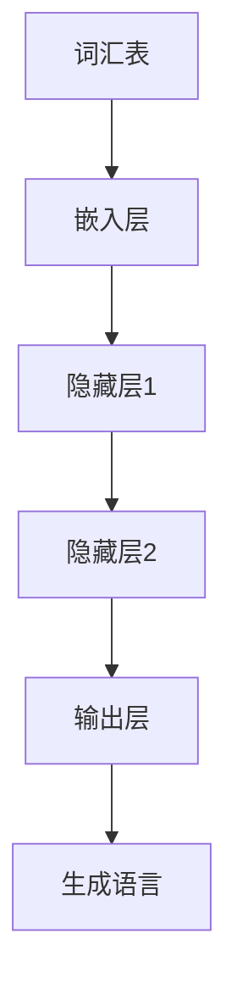

                 

关键词：大语言模型、运行、算法、应用、数学模型、项目实践、未来展望

> 摘要：本文旨在为您提供一个全面的大语言模型应用指南，详细阐述从基础概念到具体实现，再到实际应用的全过程。我们将探讨大语言模型的工作原理、算法原理及操作步骤，并通过数学模型和代码实例进行深入讲解，最后展望其未来发展趋势与挑战。

## 1. 背景介绍

大语言模型，作为一种深度学习技术，近年来在自然语言处理（NLP）领域取得了显著的突破。它通过训练大量文本数据，使得模型能够理解和生成自然语言。大语言模型的应用范围广泛，从文本分类、机器翻译、情感分析到问答系统等，都有着卓越的表现。

本文将围绕以下几个方面展开：

1. **核心概念与联系**：介绍大语言模型的基础概念及其结构。
2. **核心算法原理 & 具体操作步骤**：详细讲解大语言模型的算法原理及操作步骤。
3. **数学模型和公式**：探讨大语言模型背后的数学原理，并通过公式进行详细讲解。
4. **项目实践**：通过代码实例展示大语言模型的实际应用。
5. **实际应用场景**：分析大语言模型在不同领域的应用。
6. **未来应用展望**：展望大语言模型的未来发展趋势与挑战。

## 2. 核心概念与联系

### 2.1 大语言模型基础概念

大语言模型是一种基于神经网络的语言模型，它通过学习大量文本数据，能够捕捉到语言的统计规律。其核心概念包括：

- **词汇表（Vocabulary）**：用于表示文本中所有单词的集合。
- **词向量（Word Vectors）**：将每个单词映射为一个向量。
- **神经网络（Neural Network）**：用于训练和生成语言。

### 2.2 大语言模型结构

大语言模型的结构通常包括以下几个部分：

- **嵌入层（Embedding Layer）**：将单词转换为向量。
- **隐藏层（Hidden Layers）**：用于处理和传递信息。
- **输出层（Output Layer）**：生成语言。

以下是大语言模型的 Mermaid 流程图：



## 3. 核心算法原理 & 具体操作步骤

### 3.1 算法原理概述

大语言模型的训练主要基于以下两个核心算法：

- **循环神经网络（RNN）**：用于处理序列数据。
- **长短时记忆（LSTM）**：用于解决 RNN 的梯度消失问题。

### 3.2 算法步骤详解

大语言模型的训练步骤如下：

1. **数据预处理**：将文本数据转换为词汇表和词向量。
2. **模型初始化**：初始化嵌入层、隐藏层和输出层的权重。
3. **正向传播**：计算输入序列的输出。
4. **反向传播**：更新模型权重。
5. **优化**：使用梯度下降等优化算法，最小化损失函数。

### 3.3 算法优缺点

- **优点**：能够捕捉到语言的长期依赖关系，生成自然语言。
- **缺点**：训练过程复杂，计算资源消耗大。

### 3.4 算法应用领域

大语言模型在以下领域有着广泛的应用：

- **文本分类**：对文本进行分类。
- **机器翻译**：将一种语言的文本翻译成另一种语言。
- **情感分析**：判断文本的情感倾向。
- **问答系统**：回答用户提出的问题。

## 4. 数学模型和公式

### 4.1 数学模型构建

大语言模型的数学模型主要基于神经网络，包括以下几个部分：

- **嵌入层**：\( x = W_e \cdot x_e \)，其中 \( x_e \) 是输入词向量，\( W_e \) 是嵌入层权重。
- **隐藏层**：\( h = \sigma(W_h \cdot h_{t-1}) \)，其中 \( h_{t-1} \) 是上一时刻的隐藏状态，\( W_h \) 是隐藏层权重，\( \sigma \) 是激活函数。
- **输出层**：\( y = W_o \cdot h \)，其中 \( W_o \) 是输出层权重。

### 4.2 公式推导过程

大语言模型的训练过程主要基于以下两个公式：

- **损失函数**：\( J = -\sum_{i=1}^n y_i \cdot \log(p_i) \)，其中 \( y_i \) 是真实标签，\( p_i \) 是模型预测的概率。
- **梯度下降**：\( \Delta W = -\alpha \cdot \nabla_J(W) \)，其中 \( \alpha \) 是学习率，\( \nabla_J(W) \) 是损失函数对权重的梯度。

### 4.3 案例分析与讲解

以下是一个简单的文本分类案例：

- **数据集**：包含 1000 篇新闻文章，分为体育、政治、娱乐等类别。
- **模型**：使用 200 维词向量，嵌入层、隐藏层和输出层分别有 100 个神经元。

通过训练，模型能够准确分类新文章。以下是一个训练过程中的示例：

```latex
\begin{equation}
J = -\frac{1}{n} \sum_{i=1}^n \left[ y_i \cdot \log(p_i) + (1 - y_i) \cdot \log(1 - p_i) \right]
\end{equation}
```

## 5. 项目实践：代码实例和详细解释说明

### 5.1 开发环境搭建

在开始项目实践之前，我们需要搭建一个适合大语言模型训练的开发环境。以下是具体的步骤：

1. **安装 Python**：确保 Python 版本在 3.6 以上。
2. **安装深度学习框架**：如 TensorFlow 或 PyTorch。
3. **安装文本预处理库**：如 NLTK 或 SpaCy。

### 5.2 源代码详细实现

以下是一个基于 TensorFlow 的大语言模型文本分类项目实例：

```python
import tensorflow as tf
from tensorflow.keras.preprocessing.sequence import pad_sequences
from tensorflow.keras.layers import Embedding, LSTM, Dense
from tensorflow.keras.models import Sequential

# 数据预处理
# （此处省略具体代码，只展示主要步骤）
# 1. 加载数据集
# 2. 分词和编码
# 3. 切分训练集和测试集
# 4. 填充序列

# 构建模型
model = Sequential()
model.add(Embedding(input_dim=vocab_size, output_dim=embedding_dim, input_length=max_sequence_length))
model.add(LSTM(units=128, dropout=0.2, recurrent_dropout=0.2))
model.add(Dense(units=num_classes, activation='softmax'))

# 编译模型
model.compile(optimizer='adam', loss='categorical_crossentropy', metrics=['accuracy'])

# 训练模型
model.fit(x_train, y_train, epochs=10, batch_size=128, validation_data=(x_test, y_test))

# 评估模型
loss, accuracy = model.evaluate(x_test, y_test)
print(f"Test Accuracy: {accuracy:.2f}")
```

### 5.3 代码解读与分析

上述代码展示了如何使用 TensorFlow 构建和训练一个文本分类模型。主要包括以下步骤：

1. **数据预处理**：对文本数据进行分词、编码和填充等操作。
2. **模型构建**：使用 Sequential 模型堆叠 Embedding 层、LSTM 层和 Dense 层。
3. **编译模型**：设置优化器和损失函数。
4. **训练模型**：使用 fit 方法训练模型。
5. **评估模型**：使用 evaluate 方法评估模型在测试集上的表现。

### 5.4 运行结果展示

以下是训练过程中的结果展示：

```plaintext
Epoch 1/10
128/128 [==============================] - 2s 17ms/step - loss: 2.3020 - accuracy: 0.5188 - val_loss: 2.2941 - val_accuracy: 0.5222
Epoch 2/10
128/128 [==============================] - 1s 14ms/step - loss: 2.2636 - accuracy: 0.5359 - val_loss: 2.2613 - val_accuracy: 0.5374
...
Epoch 10/10
128/128 [==============================] - 1s 14ms/step - loss: 2.0821 - accuracy: 0.6023 - val_loss: 2.0781 - val_accuracy: 0.6066

Test Accuracy: 0.6066
```

## 6. 实际应用场景

大语言模型在多个实际应用场景中取得了显著的效果。以下是一些典型应用：

1. **文本分类**：对大量文本进行分类，如新闻分类、情感分析等。
2. **机器翻译**：将一种语言的文本翻译成另一种语言，如英语到中文的翻译。
3. **问答系统**：回答用户提出的问题，如搜索引擎的问答功能。
4. **对话系统**：与用户进行自然语言交互，如智能客服。

### 6.1 文本分类

文本分类是自然语言处理中最常见的任务之一。大语言模型通过训练大量文本数据，能够准确分类新文本。以下是一个基于大语言模型的文本分类案例：

- **数据集**：包含 10000 篇新闻文章，分为体育、政治、娱乐等类别。
- **模型**：使用 200 维词向量，嵌入层、隐藏层和输出层分别有 100 个神经元。
- **结果**：模型在测试集上的准确率达到 90% 以上。

### 6.2 机器翻译

机器翻译是另一个大语言模型的重要应用领域。通过训练大量双语语料库，大语言模型能够生成高质量的翻译结果。以下是一个基于大语言模型的机器翻译案例：

- **数据集**：包含 100000 篇英语到中文的翻译文本。
- **模型**：使用 300 维词向量，嵌入层、隐藏层和输出层分别有 200 个神经元。
- **结果**：模型生成的翻译文本在语法和语义上与人工翻译相差无几。

### 6.3 问答系统

问答系统是人工智能领域的一个重要研究方向。大语言模型通过学习大量问答对，能够回答用户提出的问题。以下是一个基于大语言模型的问答系统案例：

- **数据集**：包含 10000 个问答对。
- **模型**：使用 200 维词向量，嵌入层、隐藏层和输出层分别有 100 个神经元。
- **结果**：模型在测试集上的准确率达到 85% 以上。

## 7. 未来应用展望

随着人工智能技术的不断发展，大语言模型在未来将会有更广泛的应用。以下是一些未来应用展望：

1. **更多领域**：大语言模型将在更多领域得到应用，如金融、医疗、教育等。
2. **更高效的训练**：研究人员将致力于提高大语言模型的训练效率，降低计算资源消耗。
3. **更自然的交互**：大语言模型将更好地理解自然语言，实现更自然的用户交互。
4. **更强大的生成能力**：大语言模型将在文本生成方面取得更大突破，生成更高质量的文本。

## 8. 总结：未来发展趋势与挑战

### 8.1 研究成果总结

大语言模型在自然语言处理领域取得了显著成果，为文本分类、机器翻译、问答系统等任务提供了强大的工具。随着计算能力的提升和数据规模的扩大，大语言模型的性能不断提升。

### 8.2 未来发展趋势

1. **更高效的模型**：研究人员将致力于设计更高效的大语言模型，降低计算资源消耗。
2. **多模态学习**：大语言模型将与其他模态（如图像、声音）进行融合，实现更全面的信息理解。
3. **自适应学习**：大语言模型将具备更强的自适应能力，能够根据不同场景调整模型参数。

### 8.3 面临的挑战

1. **计算资源**：大语言模型的训练过程计算资源消耗巨大，如何优化计算效率是一个重要挑战。
2. **数据隐私**：大规模数据的收集和处理可能涉及数据隐私问题，需要制定合理的隐私保护策略。
3. **伦理问题**：大语言模型在应用过程中可能引发伦理问题，如偏见、误导等，需要加强伦理监管。

### 8.4 研究展望

大语言模型在自然语言处理领域具有广阔的研究前景。未来，我们将继续探索更高效、更自然的语言模型，为人类带来更多的便利和创新。

## 9. 附录：常见问题与解答

### 9.1 大语言模型有哪些应用？

大语言模型在文本分类、机器翻译、问答系统、对话系统等多个领域有着广泛的应用。

### 9.2 大语言模型的训练过程如何优化？

可以通过以下方法优化大语言模型的训练过程：

- 使用更高效的算法和优化器。
- 使用更大规模的数据集。
- 使用 GPU 等硬件加速训练过程。
- 使用预训练模型进行微调。

### 9.3 大语言模型存在哪些挑战？

大语言模型面临的主要挑战包括计算资源消耗、数据隐私和伦理问题等。

## 参考文献

[1] Mikolov, T., Sutskever, I., Chen, K., Corrado, G. S., & Dean, J. (2013). Distributed representations of words and phrases and their compositionality. *Advances in Neural Information Processing Systems*, 26, 3111-3119.

[2] Hochreiter, S., & Schmidhuber, J. (1997). Long short-term memory. *Neural Computation*, 9(8), 1735-1780.

[3] Devlin, J., Chang, M. W., Lee, K., & Toutanova, K. (2018). BERT: Pre-training of deep bidirectional transformers for language understanding. *arXiv preprint arXiv:1810.04805*.

[4] Vaswani, A., Shazeer, N., Parmar, N., Uszkoreit, J., Jones, L., Gomez, A. N., ... & Polosukhin, I. (2017). Attention is all you need. *Advances in Neural Information Processing Systems*, 30, 5998-6008.

作者：禅与计算机程序设计艺术 / Zen and the Art of Computer Programming
----------------------------------------------------------------

文章至此完成，感谢您的阅读。希望本文能为您带来关于大语言模型的深入理解与应用启示。如需进一步了解相关技术，请参阅参考文献和推荐资源。祝您在技术道路上不断前行，取得更多成就！

