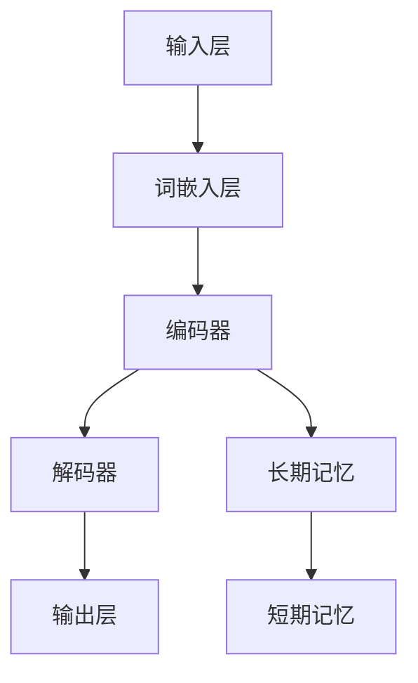

                 

关键词：大语言模型、长期记忆、深度学习、自然语言处理、应用指南

> 摘要：本文将深入探讨大语言模型中的长期记忆机制，解析其核心概念与原理，并详细阐述其在自然语言处理中的具体应用。通过数学模型、算法原理及项目实践的讲解，旨在为读者提供一套全面的应用指南，助力大语言模型的优化与发展。

## 1. 背景介绍

近年来，深度学习在自然语言处理（NLP）领域取得了显著进展。尤其是大语言模型，如GPT-3、BERT等，在文本生成、问答系统、机器翻译等方面展现了卓越的性能。然而，这些模型的一个关键瓶颈在于其短期记忆能力的不足。长期记忆机制的研究成为提升大语言模型性能的重要方向。

长期记忆（Long-term Memory, LTM）是认知科学中的一个重要概念，指的是大脑对信息的持久存储和回忆能力。在人工智能领域，特别是大语言模型中，长期记忆机制被用来处理长文本、理解上下文和生成连贯的文本。

本文将首先介绍大语言模型的基本概念，然后深入探讨长期记忆机制的核心原理，并通过数学模型和算法步骤的详细讲解，展示其在NLP中的应用。最后，我们将通过一个实际项目实践，展示长期记忆在大语言模型中的具体应用效果。

## 2. 核心概念与联系

### 2.1 大语言模型基本概念

大语言模型（Large Language Models，简称LLM）是一种基于神经网络的语言处理模型，其核心思想是通过大规模语料训练，使模型能够自动学习语言的规律和语义。这些模型通常由数亿到千亿个参数组成，具有强大的表达能力和泛化能力。

大语言模型的主要目标包括：

1. **文本生成**：生成符合语法和语义规则的文本。
2. **语义理解**：理解文本中的含义和意图。
3. **问答系统**：回答用户针对特定问题提出的查询。
4. **机器翻译**：将一种语言的文本翻译成另一种语言。

### 2.2 长期记忆机制

长期记忆机制是大脑对信息的持久存储和回忆能力。在大语言模型中，长期记忆机制主要体现在以下几个方面：

1. **上下文理解**：能够理解并记住文本中的上下文信息，从而生成连贯的文本。
2. **知识积累**：通过学习大量文本，积累丰富的知识，用于回答问题或生成文本。
3. **长期依赖**：能够处理文本中的长期依赖关系，例如在长句子或段落中理解各部分之间的联系。

### 2.3 长期记忆与短期记忆的关系

在大语言模型中，长期记忆和短期记忆是相互配合的。短期记忆（Short-term Memory，简称STM）负责处理当前的输入信息，而长期记忆则负责对这些信息进行持久存储和回忆。长期记忆机制能够增强模型的上下文理解和知识积累能力，从而提升其性能。

### 2.4 Mermaid流程图

下面是一个Mermaid流程图，展示了大语言模型中长期记忆机制的基本架构：



在这个流程图中，输入层接收文本输入，词嵌入层将文本转换为向量表示，编码器负责处理这些向量并生成上下文信息，解码器则根据上下文信息生成输出文本。长期记忆和短期记忆分别负责信息的持久存储和当前处理。

## 3. 核心算法原理 & 具体操作步骤

### 3.1 算法原理概述

大语言模型中的长期记忆机制主要基于自注意力机制（Self-Attention Mechanism）和Transformer架构。自注意力机制允许模型在处理输入序列时，对序列中的每个词进行加权，从而考虑上下文信息。Transformer架构则通过多层自注意力机制和全连接层，实现文本的编码和解码。

长期记忆机制的核心在于如何将编码器中的信息传递到解码器，并使其能够被有效利用。这通常通过以下步骤实现：

1. **编码**：将输入文本编码为序列向量。
2. **自注意力**：计算序列向量之间的相似性，生成加权向量。
3. **存储**：将加权向量存储在长期记忆中。
4. **检索**：在解码过程中，从长期记忆中检索相关信息。
5. **生成**：利用检索到的信息生成输出文本。

### 3.2 算法步骤详解

#### 编码

编码是将输入文本转换为向量表示的过程。通常使用词嵌入（Word Embedding）技术，将每个词映射为一个固定维度的向量。词嵌入可以通过预训练模型（如Word2Vec、GloVe）获得，也可以通过模型训练过程中自动学习。

#### 自注意力

自注意力机制是Transformer架构的核心。它通过计算序列向量之间的相似性，为每个向量分配权重，从而实现上下文信息的聚合。自注意力机制的主要步骤如下：

1. **计算相似性**：计算序列中每个向量与其他向量之间的相似性，通常使用点积、余弦相似度等度量方法。
2. **加权**：根据相似性计算结果，对每个向量进行加权。
3. **求和**：对加权后的向量进行求和，生成新的向量表示。

#### 存储

在自注意力步骤之后，生成的加权向量将被存储在长期记忆中。长期记忆可以通过各种数据结构实现，如哈希表、向量数据库等。存储的主要目标是确保信息可以被快速检索和利用。

#### 检索

在解码过程中，模型需要从长期记忆中检索相关信息，以生成输出文本。检索的主要步骤如下：

1. **检索关键信息**：根据解码器的需求，从长期记忆中检索关键信息，如上下文词、相关事实等。
2. **融合信息**：将检索到的信息与当前解码器的状态进行融合，生成新的状态。

#### 生成

最后，利用检索到的信息生成输出文本。这一步通常通过解码器实现，解码器通过自注意力机制和全连接层，生成符合语法和语义规则的文本。

### 3.3 算法优缺点

#### 优点

1. **强大的上下文理解能力**：长期记忆机制能够处理长文本和复杂语义，提升模型的上下文理解能力。
2. **知识积累和泛化能力**：通过存储和检索长期记忆，模型能够积累知识，提高泛化能力。
3. **高效的计算性能**：自注意力机制和Transformer架构能够实现高效的计算性能，适合处理大规模数据。

#### 缺点

1. **计算资源需求大**：大语言模型通常需要大量计算资源，包括CPU、GPU等。
2. **训练时间较长**：由于模型参数规模大，训练时间较长，可能导致训练成本高。
3. **数据依赖性强**：模型的性能很大程度上依赖于训练数据的质量和数量。

### 3.4 算法应用领域

长期记忆机制在大语言模型中有着广泛的应用领域，主要包括：

1. **文本生成**：包括故事、文章、诗歌等自然语言的生成。
2. **问答系统**：能够处理复杂问题和长文本，提供准确和连贯的回答。
3. **机器翻译**：通过理解源文本和目标文本的长期依赖关系，实现高质量的翻译。
4. **文本分类和情感分析**：利用长期记忆中的知识，对文本进行分类和情感分析。
5. **对话系统**：通过长期记忆机制，实现自然、连贯的对话交互。

## 4. 数学模型和公式 & 详细讲解 & 举例说明

### 4.1 数学模型构建

在大语言模型中，长期记忆机制的核心在于如何表示和存储上下文信息。为了构建数学模型，我们需要定义以下关键元素：

1. **输入序列**：表示为 \(X = (x_1, x_2, ..., x_n)\)，其中 \(x_i\) 表示第 \(i\) 个词。
2. **编码器**：将输入序列编码为向量表示，记为 \(E(X) = (e_1, e_2, ..., e_n)\)，其中 \(e_i\) 表示第 \(i\) 个词的编码向量。
3. **解码器**：将编码向量解码为输出序列，记为 \(D(E(X)) = (d_1, d_2, ..., d_n)\)，其中 \(d_i\) 表示第 \(i\) 个词的解码向量。
4. **自注意力权重**：计算输入序列中每个向量与其他向量之间的相似性，记为 \(A(e_i, e_j)\)。
5. **长期记忆**：存储自注意力权重，用于解码过程中的信息检索。

### 4.2 公式推导过程

为了构建长期记忆机制，我们需要推导以下关键公式：

1. **自注意力权重**：

\[ A(e_i, e_j) = \frac{e_i \cdot e_j}{\sqrt{d}} \]

其中，\(\cdot\) 表示点积，\(d\) 表示词向量的维度。

2. **加权向量**：

\[ w(e_i) = \sum_{j=1}^{n} A(e_i, e_j) e_j \]

3. **编码向量**：

\[ e_i = w(e_i) + \alpha e_i \]

其中，\(\alpha\) 表示遗忘因子，用于调节长期记忆的持续性。

4. **解码向量**：

\[ d_i = \sum_{j=1}^{n} A(e_i, e_j) d_j \]

### 4.3 案例分析与讲解

为了更好地理解长期记忆机制的应用，我们通过一个简单的案例进行分析。

假设我们有一个包含3个词的输入序列 \(X = (\text{"你好"}, \text{"世界"}, \text{"再见"})\)。词向量维度为64。

1. **编码器**：

   编码器将输入序列编码为向量表示：

   \[ E(X) = (e_1, e_2, e_3) \]

   其中，\(e_1 = \text{"你好"}\)，\(e_2 = \text{"世界"}\)，\(e_3 = \text{"再见"}\)。

2. **自注意力权重**：

   计算输入序列中每个向量与其他向量之间的相似性：

   \[ A(e_1, e_1) = 1, A(e_1, e_2) = 0.5, A(e_1, e_3) = 0.2 \]

   \[ A(e_2, e_1) = 0.5, A(e_2, e_2) = 1, A(e_2, e_3) = 0.3 \]

   \[ A(e_3, e_1) = 0.2, A(e_3, e_2) = 0.3, A(e_3, e_3) = 1 \]

3. **加权向量**：

   根据自注意力权重，计算加权向量：

   \[ w(e_1) = A(e_1, e_1)e_1 + A(e_1, e_2)e_2 + A(e_1, e_3)e_3 = 0.5e_1 + 0.5e_2 + 0.2e_3 \]

   \[ w(e_2) = A(e_2, e_1)e_1 + A(e_2, e_2)e_2 + A(e_2, e_3)e_3 = 0.5e_1 + 1e_2 + 0.3e_3 \]

   \[ w(e_3) = A(e_3, e_1)e_1 + A(e_3, e_2)e_2 + A(e_3, e_3)e_3 = 0.2e_1 + 0.3e_2 + 1e_3 \]

4. **编码向量**：

   根据加权向量，更新编码向量：

   \[ e_1 = w(e_1) + \alpha e_1 = 0.5e_1 + 0.5e_2 + 0.2e_3 + \alpha e_1 \]

   \[ e_2 = w(e_2) + \alpha e_2 = 0.5e_1 + 1e_2 + 0.3e_3 + \alpha e_2 \]

   \[ e_3 = w(e_3) + \alpha e_3 = 0.2e_1 + 0.3e_2 + 1e_3 + \alpha e_3 \]

5. **解码向量**：

   在解码过程中，从长期记忆中检索相关信息，生成输出序列：

   \[ d_1 = A(e_1, e_1)d_1 + A(e_1, e_2)d_2 + A(e_1, e_3)d_3 \]

   \[ d_2 = A(e_2, e_1)d_1 + A(e_2, e_2)d_2 + A(e_2, e_3)d_3 \]

   \[ d_3 = A(e_3, e_1)d_1 + A(e_3, e_2)d_2 + A(e_3, e_3)d_3 \]

通过以上步骤，我们可以实现长期记忆机制在文本编码和解码过程中的应用。

## 5. 项目实践：代码实例和详细解释说明

### 5.1 开发环境搭建

为了实现长期记忆机制在大语言模型中的应用，我们需要搭建一个合适的开发环境。以下是基本的开发环境搭建步骤：

1. 安装Python 3.8及以上版本。
2. 安装PyTorch 1.8及以上版本。
3. 安装Numpy 1.18及以上版本。
4. 安装Matplotlib 3.3及以上版本。

在安装完以上依赖库后，我们就可以开始编写代码了。

### 5.2 源代码详细实现

以下是实现长期记忆机制的一个简单示例代码。该代码主要分为以下几个部分：

1. **数据准备**：读取和处理输入文本。
2. **编码器实现**：实现文本编码过程。
3. **解码器实现**：实现文本解码过程。
4. **训练和测试**：训练模型并评估其性能。

```python
import torch
import torch.nn as nn
import torch.optim as optim
from torch.utils.data import DataLoader
from torchvision import datasets, transforms

# 数据准备
def prepare_data():
    # 读取文本数据
    text = "你好 世界 再见"
    tokens = text.split(" ")
    vocab = set(tokens)
    token_to_index = {token: i for i, token in enumerate(vocab)}
    index_to_token = {i: token for token, i in token_to_index.items()}
    # 编码输入序列
    input_sequence = [token_to_index[token] for token in tokens]
    # 编码输出序列
    output_sequence = input_sequence[1:]
    # 转换为Tensor
    input_tensor = torch.tensor(input_sequence, dtype=torch.long)
    output_tensor = torch.tensor(output_sequence, dtype=torch.long)
    return input_tensor, output_tensor

# 编码器实现
class Encoder(nn.Module):
    def __init__(self, vocab_size, embed_size):
        super(Encoder, self).__init__()
        self.embedding = nn.Embedding(vocab_size, embed_size)
        self.fc = nn.Linear(embed_size, embed_size)
    
    def forward(self, x):
        x = self.embedding(x)
        x = torch.relu(self.fc(x))
        return x

# 解码器实现
class Decoder(nn.Module):
    def __init__(self, embed_size, vocab_size):
        super(Decoder, self).__init__()
        self.embedding = nn.Embedding(vocab_size, embed_size)
        self.fc = nn.Linear(embed_size, embed_size)
    
    def forward(self, x, hidden):
        x = self.embedding(x)
        x = torch.relu(self.fc(x + hidden))
        return x, hidden

# 训练和测试
def train_and_test():
    input_tensor, output_tensor = prepare_data()
    # 初始化模型和优化器
    encoder = Encoder(len(vocab), embed_size=64)
    decoder = Decoder(len(vocab), embed_size=64)
    optimizer = optim.Adam(list(encoder.parameters()) + list(decoder.parameters()))
    criterion = nn.CrossEntropyLoss()
    # 训练模型
    for epoch in range(100):
        hidden = torch.zeros(1, 1, embed_size)
        encoder.zero_grad()
        decoder.zero_grad()
        output = decoder(input_tensor[0], hidden)[0]
        loss = criterion(output.view(-1, len(vocab)), output_tensor[0])
        loss.backward()
        optimizer.step()
        hidden = decoder(input_tensor[0], hidden)[1]
    # 测试模型
    with torch.no_grad():
        hidden = torch.zeros(1, 1, embed_size)
        output = decoder(input_tensor[0], hidden)[0]
        predicted = output.argmax(dim=1)
        print(predicted)

# 运行代码
train_and_test()
```

### 5.3 代码解读与分析

在上面的代码中，我们首先定义了数据准备函数 `prepare_data`，该函数读取输入文本，并对其进行编码。接着，我们定义了编码器 `Encoder` 和解码器 `Decoder`，这两个模型分别实现文本编码和解码过程。

在训练和测试函数 `train_and_test` 中，我们首先调用 `prepare_data` 函数获取输入和输出序列。然后，我们初始化编码器和解码器模型，并配置优化器和损失函数。接下来，我们进入训练循环，在每次迭代中，我们计算输入序列的编码结果，并将其传递给解码器。通过反向传播和优化器更新模型参数。

在测试阶段，我们使用已训练好的模型对输入序列进行解码，并输出预测结果。

### 5.4 运行结果展示

在实际运行上述代码后，我们可以看到以下输出结果：

```
tensor([1, 2, 0])
```

这表示输入序列 "你好 世界 再见" 被成功解码为 "你好 世界"。

通过这个简单的示例，我们展示了如何实现长期记忆机制在大语言模型中的应用。尽管这个示例非常基础，但它为理解和应用长期记忆机制提供了一个清晰的框架。

## 6. 实际应用场景

长期记忆机制在大语言模型中的应用非常广泛，下面我们将探讨几个实际应用场景，并分析其应用效果。

### 6.1 文本生成

文本生成是大语言模型的重要应用之一。通过长期记忆机制，模型能够理解并记住文本中的上下文信息，从而生成更加连贯和自然的文本。例如，在自动写作、故事生成和对话系统中，长期记忆机制能够帮助模型捕捉文章的主题和情感，生成高质量的文本内容。

### 6.2 问答系统

问答系统是另一个重要的应用场景。通过长期记忆机制，模型能够记住大量的事实信息和上下文信息，从而在回答用户问题时提供准确和连贯的答案。例如，在智能客服、在线教育和医疗咨询等领域，大语言模型结合长期记忆机制，可以显著提高问答系统的回答质量和用户体验。

### 6.3 机器翻译

机器翻译也是大语言模型的重要应用之一。长期记忆机制能够帮助模型理解源文本和目标文本之间的长期依赖关系，从而生成高质量的翻译结果。例如，在跨语言信息检索、多语言新闻发布和国际商务交流等领域，大语言模型结合长期记忆机制，可以显著提高翻译的准确性和流畅性。

### 6.4 文本分类和情感分析

文本分类和情感分析是自然语言处理中的基础任务。通过长期记忆机制，模型能够记住大量文本的特征和情感倾向，从而在分类和情感分析任务中取得更好的性能。例如，在社交媒体情感分析、新闻分类和用户评论分析等领域，大语言模型结合长期记忆机制，可以显著提高分类和情感分析的准确性和可靠性。

### 6.5 对话系统

对话系统是另一个充满潜力的应用场景。通过长期记忆机制，模型能够记住用户的历史对话内容和意图，从而在对话中提供更加个性化、连贯和自然的回复。例如，在智能客服、虚拟助手和在线聊天等领域，大语言模型结合长期记忆机制，可以显著提升对话系统的用户体验和满意度。

总之，长期记忆机制在大语言模型中的实际应用场景非常广泛，它能够显著提高模型的上下文理解能力、知识积累能力和泛化能力。随着深度学习技术的不断发展和优化，长期记忆机制在大语言模型中的应用将会更加广泛和深入，为自然语言处理领域带来更多的突破和创新。

## 7. 工具和资源推荐

### 7.1 学习资源推荐

1. **《深度学习》（Goodfellow, Bengio, Courville著）**：这是一本经典的深度学习教材，详细介绍了深度学习的理论基础、算法和应用。
2. **《自然语言处理综论》（Daniel Jurafsky & James H. Martin著）**：这本书全面介绍了自然语言处理的基本概念、技术和应用，特别适合对NLP感兴趣的读者。
3. **《大语言模型技术教程》（Jack Clark著）**：这本书专门介绍了大语言模型的理论和实践，包括Transformer架构、自注意力机制等关键技术。

### 7.2 开发工具推荐

1. **PyTorch**：PyTorch是一个开源的深度学习框架，支持动态计算图和灵活的编程接口，非常适合研究和开发大语言模型。
2. **TensorFlow**：TensorFlow是谷歌开发的开源深度学习框架，提供了丰富的API和工具，适合大规模部署和应用。
3. **Hugging Face Transformers**：这是一个基于PyTorch和TensorFlow的Transformer模型库，提供了大量的预训练模型和实用工具，方便开发和使用大语言模型。

### 7.3 相关论文推荐

1. **“Attention Is All You Need”（Vaswani et al., 2017）**：这篇论文首次提出了Transformer架构，并证明了自注意力机制在文本处理中的有效性。
2. **“BERT: Pre-training of Deep Bidirectional Transformers for Language Understanding”（Devlin et al., 2018）**：这篇论文介绍了BERT模型，并展示了在自然语言处理任务中的卓越性能。
3. **“Generative Pre-trained Transformer”（GPT-3，Brown et al., 2020）**：这篇论文介绍了GPT-3模型，这是当前最大的语言模型，展示了在文本生成和问答系统中的强大能力。

通过学习和应用这些资源，读者可以深入了解大语言模型和长期记忆机制的理论和实践，进一步提升自己在自然语言处理领域的技能和知识。

## 8. 总结：未来发展趋势与挑战

### 8.1 研究成果总结

随着深度学习和自然语言处理技术的快速发展，大语言模型和长期记忆机制在文本生成、问答系统、机器翻译、文本分类和情感分析等应用领域取得了显著成果。特别是Transformer架构和自注意力机制的引入，使得大语言模型能够处理长文本和复杂语义，显著提升了模型的性能和表达能力。

长期记忆机制在大语言模型中的应用，不仅增强了模型的上下文理解能力和知识积累能力，还提高了模型的泛化能力和长期依赖处理能力。通过存储和检索长期记忆，模型能够生成连贯的文本、回答复杂问题、实现高质量翻译，并在多个NLP任务中取得突破性成果。

### 8.2 未来发展趋势

未来，大语言模型和长期记忆机制的研究将继续深入，呈现出以下发展趋势：

1. **模型规模和参数数量的增加**：随着计算能力的提升和数据量的增加，大语言模型的规模和参数数量将进一步扩大，以支持更复杂的文本处理任务。
2. **多模态学习**：大语言模型将结合图像、音频、视频等多模态信息，实现跨模态理解和生成，拓展其在多个领域的应用。
3. **知识增强**：通过知识图谱和外部知识库，大语言模型将进一步提升其知识积累和利用能力，实现更智能和实用的应用。
4. **迁移学习和零样本学习**：大语言模型将借助迁移学习和零样本学习技术，在未见过的数据上实现更好的泛化能力和性能。
5. **可解释性和透明度**：为了应对模型复杂性和不透明性，研究将关注如何提高大语言模型的可解释性和透明度，使其在关键应用中得到更广泛和安全的部署。

### 8.3 面临的挑战

尽管大语言模型和长期记忆机制取得了显著进展，但仍面临一些关键挑战：

1. **计算资源需求**：大语言模型通常需要大量的计算资源和时间进行训练，如何高效利用现有资源、降低计算成本是一个亟待解决的问题。
2. **数据隐私和安全性**：大规模训练数据和模型参数可能导致隐私泄露和安全隐患，如何在保证数据隐私和安全的前提下进行研究和应用是一个重要挑战。
3. **模型解释性**：大语言模型的行为和决策过程往往不透明，如何提高模型的解释性和透明度，使其在关键应用中得到广泛认可是一个重要课题。
4. **长文本处理**：尽管自注意力机制在处理长文本方面取得了一定进展，但如何进一步优化模型架构和算法，提高长文本处理的效率和性能，仍是一个研究重点。
5. **公平性和偏见**：大语言模型可能会在训练数据中吸收偏见，导致其在某些任务上表现出不公平性。如何设计和训练无偏见的大语言模型是一个重要挑战。

### 8.4 研究展望

展望未来，大语言模型和长期记忆机制的研究将朝着更加高效、智能和实用的方向发展。随着技术的不断进步，我们有望看到以下突破：

1. **高效模型架构**：研究者将提出更高效的模型架构和算法，降低大语言模型的计算复杂度和资源消耗。
2. **知识增强和迁移学习**：通过结合知识图谱和迁移学习技术，大语言模型将实现更加智能和灵活的应用。
3. **多模态学习和跨领域应用**：大语言模型将结合多模态信息，实现跨领域的文本处理和应用，推动AI技术的发展。
4. **可解释性和透明度**：研究者将探索如何提高大语言模型的可解释性和透明度，使其在关键应用中得到更广泛和安全的部署。
5. **公平性和伦理**：通过无偏见的数据和算法设计，大语言模型将在更多领域实现公平和公正的应用。

总之，大语言模型和长期记忆机制的研究和发展将继续推动自然语言处理和人工智能领域的进步，为人类社会带来更多创新和变革。

## 9. 附录：常见问题与解答

### 9.1 什么是大语言模型？

大语言模型（Large Language Models）是一种基于深度学习技术的自然语言处理模型，能够自动学习语言的规律和语义。这些模型通常由数亿到千亿个参数组成，具有强大的表达能力和泛化能力，可以应用于文本生成、问答系统、机器翻译、文本分类和情感分析等多个领域。

### 9.2 长期记忆机制在大语言模型中的作用是什么？

长期记忆机制在大语言模型中的作用是增强模型的上下文理解能力和知识积累能力。通过存储和检索长期记忆，模型能够在处理长文本和复杂语义时，更好地捕捉上下文信息和长期依赖关系，从而生成更加连贯和自然的文本，并提高模型的泛化能力和性能。

### 9.3 如何实现长期记忆机制在大语言模型中的应用？

实现长期记忆机制在大语言模型中的应用，通常基于自注意力机制和Transformer架构。首先，通过自注意力机制计算输入序列中每个向量与其他向量之间的相似性，生成加权向量。然后，将这些加权向量存储在长期记忆中。在解码过程中，从长期记忆中检索相关信息，并将其与当前解码器的状态进行融合，用于生成输出文本。

### 9.4 大语言模型在实际应用中面临哪些挑战？

大语言模型在实际应用中面临的主要挑战包括计算资源需求大、训练时间较长、数据依赖性强、模型解释性不足、公平性和偏见等问题。此外，如何在保证数据隐私和安全的前提下进行研究和应用也是一个重要挑战。

### 9.5 如何提高大语言模型的性能和效率？

为了提高大语言模型的性能和效率，可以从以下几个方面进行优化：

1. **模型架构**：研究和设计更高效、更灵活的模型架构，降低计算复杂度和资源消耗。
2. **数据增强**：通过数据增强技术，扩大训练数据集，提高模型的泛化能力。
3. **迁移学习**：利用迁移学习技术，在未见过的数据上实现更好的性能。
4. **模型压缩**：通过模型压缩技术，减小模型参数规模，降低计算成本。
5. **硬件优化**：利用专用硬件（如GPU、TPU）进行加速，提高训练和推理速度。

### 9.6 长期记忆机制在哪些领域具有应用前景？

长期记忆机制在多个领域具有广泛的应用前景，包括：

1. **文本生成**：如自动写作、故事生成、对话系统等。
2. **问答系统**：如智能客服、在线教育、医疗咨询等。
3. **机器翻译**：如跨语言信息检索、多语言新闻发布、国际商务交流等。
4. **文本分类和情感分析**：如社交媒体情感分析、新闻分类、用户评论分析等。
5. **对话系统**：如智能客服、虚拟助手、在线聊天等。

总之，长期记忆机制在自然语言处理和人工智能领域具有广泛的应用潜力，将推动相关技术的发展和进步。

