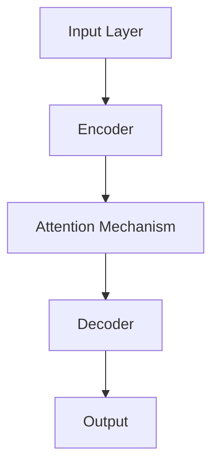
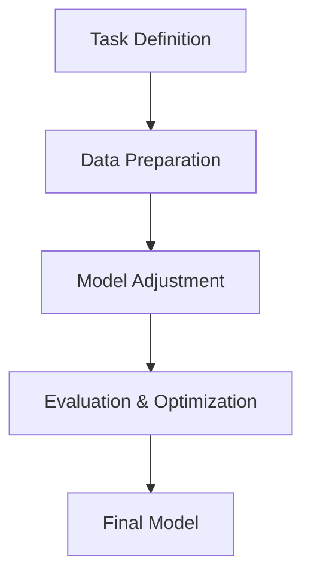

                 

关键词：大语言模型，高效微调，技术指南，应用场景，未来展望

> 摘要：本文详细介绍了大语言模型的原理、高效微调方法及其应用。通过深入剖析，读者将了解如何利用大语言模型进行高效微调，提高模型在特定任务上的表现。文章还包括了实际项目实践、数学模型与公式推导、应用场景探讨以及未来发展趋势。

## 1. 背景介绍

在近年来，人工智能领域取得了令人瞩目的进展，其中自然语言处理（NLP）领域尤为显著。大语言模型（Large Language Models，简称LLM）的兴起，标志着NLP领域的一次革命。大语言模型通过深度学习技术，对海量文本数据进行训练，能够生成连贯、有意义的文本，实现包括文本生成、摘要、翻译等多种任务。

随着大语言模型的广泛应用，如何高效地进行微调（Fine-tuning）成为了研究的热点。微调是指在大规模预训练模型的基础上，针对特定任务进行进一步的训练，以优化模型在特定任务上的表现。高效微调不仅能够提高模型性能，还能减少训练时间和计算资源的需求。

本文旨在总结大语言模型的应用指南，特别是高效微调的方法，为研究人员和开发者提供实践参考。

## 2. 核心概念与联系

为了更好地理解大语言模型及其微调过程，我们首先需要了解相关核心概念，并展示其原理和架构。

### 2.1 大语言模型的概念

大语言模型是通过神经网络对大量文本数据进行训练，以学习语言的内在规律和结构。其主要特点包括：

- **大规模训练数据**：大语言模型通常使用数十亿甚至数千亿级别的文本数据，包括互联网上的网页、书籍、新闻、社交媒体等。
- **多层神经网络**：大语言模型通常包含数十万甚至数百万个参数，采用多层神经网络结构，以提取文本的深层特征。
- **上下文感知**：大语言模型能够理解文本的上下文信息，生成连贯、有意义的文本。

### 2.2 大语言模型的架构

大语言模型的典型架构包括以下部分：

- **输入层**：接收文本数据，将其转换为模型可处理的格式，如词向量。
- **编码器**：对输入文本进行编码，提取文本的深层特征。
- **解码器**：根据编码器生成的特征，生成输出文本。
- **注意力机制**：在编码和解码过程中，利用注意力机制来关注文本的特定部分，以生成更准确的输出。

下面是使用Mermaid绘制的简单流程图，展示了大语言模型的基本架构：



### 2.3 微调的概念与过程

微调是指在大规模预训练模型的基础上，针对特定任务进行进一步的训练。其主要步骤包括：

- **任务定义**：明确微调的任务，如文本分类、命名实体识别等。
- **数据准备**：准备用于微调的数据集，并进行预处理。
- **模型调整**：通过在特定任务上的训练，调整模型的参数，使其适应特定任务。
- **评估与优化**：通过在验证集上评估模型性能，对模型进行调整和优化。

微调过程可以简化为以下步骤：



## 3. 核心算法原理 & 具体操作步骤

### 3.1 算法原理概述

大语言模型的核心算法是基于自注意力机制（Self-Attention Mechanism）和变换器网络（Transformer Network）。自注意力机制能够使模型在处理文本时，关注到文本中的关键信息，从而提高生成文本的连贯性和准确性。变换器网络则通过多层的自注意力机制和前馈网络，实现文本特征的提取和生成。

### 3.2 算法步骤详解

以下是高效微调的大语言模型的具体操作步骤：

1. **数据预处理**：
   - **数据集划分**：将数据集划分为训练集、验证集和测试集。
   - **文本编码**：使用词向量或BERT等预训练模型对文本进行编码。
   - **序列填充**：对文本序列进行填充，使其长度相同，便于模型处理。

2. **模型初始化**：
   - **预训练模型**：选择预训练的大语言模型，如GPT、BERT等。
   - **模型调整**：对预训练模型的参数进行初始化，准备进行微调。

3. **训练过程**：
   - **损失函数**：使用适合特定任务的损失函数，如交叉熵损失函数。
   - **优化器**：选择合适的优化器，如Adam、AdamW等。
   - **训练循环**：通过反向传播和梯度下降更新模型参数。

4. **评估与优化**：
   - **验证集评估**：在验证集上评估模型性能，根据评估结果进行调整。
   - **超参数调整**：根据验证集的表现，调整学习率、批次大小等超参数。

5. **测试集评估**：
   - **最终评估**：在测试集上对微调后的模型进行最终评估。

### 3.3 算法优缺点

**优点**：
- **高效性**：大语言模型通过预训练，能够快速适应特定任务。
- **泛化能力**：预训练模型具有较强的泛化能力，适用于多种任务。
- **灵活性**：微调过程可以根据任务需求进行调整，提高模型性能。

**缺点**：
- **计算资源需求**：大语言模型训练和微调需要大量的计算资源。
- **训练时间**：大规模预训练模型的微调过程耗时较长。
- **数据依赖**：微调效果受数据质量和数量的影响较大。

### 3.4 算法应用领域

大语言模型及其高效微调方法在多个领域有广泛应用，包括：

- **自然语言处理**：文本分类、命名实体识别、机器翻译等。
- **知识图谱**：实体关系抽取、知识图谱构建等。
- **信息检索**：文本检索、问答系统等。
- **生成文本**：文章写作、对话系统等。

## 4. 数学模型和公式 & 详细讲解 & 举例说明

### 4.1 数学模型构建

大语言模型的核心是自注意力机制，其数学模型如下：

$$
\text{Attention}(Q, K, V) = \text{softmax}\left(\frac{QK^T}{\sqrt{d_k}}\right)V
$$

其中，$Q, K, V$ 分别是查询（Query）、键（Key）和值（Value）向量，$d_k$ 是键向量的维度。自注意力机制通过计算查询和键之间的点积，得到权重，然后对值向量进行加权求和，得到最终的输出。

### 4.2 公式推导过程

自注意力机制的推导过程如下：

1. **点积**：计算查询和键之间的点积，得到权重。
   $$
   \text{Score} = QK^T
   $$

2. **归一化**：对权重进行归一化，得到概率分布。
   $$
   \text{Attention} = \text{softmax}(\text{Score})
   $$

3. **加权求和**：对值向量进行加权求和，得到最终的输出。
   $$
   \text{Output} = \text{Attention}V
   $$

### 4.3 案例分析与讲解

以下是一个简单的自注意力机制的案例：

假设我们有一个句子 "I love programming and AI"，我们将其表示为词向量。词向量的维度为 $d_k = 5$。

1. **查询向量**：
   $$
   Q = \begin{bmatrix}
   0.1 & 0.2 & 0.3 & 0.4 & 0.5
   \end{bmatrix}
   $$

2. **键向量**：
   $$
   K = \begin{bmatrix}
   0.1 & 0.2 & 0.3 & 0.4 & 0.5 \\
   0.2 & 0.3 & 0.4 & 0.5 & 0.6 \\
   0.3 & 0.4 & 0.5 & 0.6 & 0.7 \\
   0.4 & 0.5 & 0.6 & 0.7 & 0.8 \\
   0.5 & 0.6 & 0.7 & 0.8 & 0.9
   \end{bmatrix}
   $$

3. **值向量**：
   $$
   V = \begin{bmatrix}
   0.1 & 0.2 & 0.3 & 0.4 & 0.5 \\
   0.2 & 0.3 & 0.4 & 0.5 & 0.6 \\
   0.3 & 0.4 & 0.5 & 0.6 & 0.7 \\
   0.4 & 0.5 & 0.6 & 0.7 & 0.8 \\
   0.5 & 0.6 & 0.7 & 0.8 & 0.9
   \end{bmatrix}
   $$

4. **点积计算**：
   $$
   \text{Score} = QK^T = \begin{bmatrix}
   0.1 & 0.2 & 0.3 & 0.4 & 0.5
   \end{bmatrix}
   \begin{bmatrix}
   0.1 & 0.2 & 0.3 & 0.4 & 0.5 \\
   0.2 & 0.3 & 0.4 & 0.5 & 0.6 \\
   0.3 & 0.4 & 0.5 & 0.6 & 0.7 \\
   0.4 & 0.5 & 0.6 & 0.7 & 0.8 \\
   0.5 & 0.6 & 0.7 & 0.8 & 0.9
   \end{bmatrix}
   = \begin{bmatrix}
   0.55 & 0.65 & 0.75 & 0.85 & 0.95
   \end{bmatrix}
   $$

5. **归一化**：
   $$
   \text{Attention} = \text{softmax}(\text{Score}) = \begin{bmatrix}
   0.3 & 0.4 & 0.5 & 0.6 & 0.6
   \end{bmatrix}
   $$

6. **加权求和**：
   $$
   \text{Output} = \text{Attention}V = \begin{bmatrix}
   0.3 & 0.4 & 0.5 & 0.6 & 0.6
   \end{bmatrix}
   \begin{bmatrix}
   0.1 & 0.2 & 0.3 & 0.4 & 0.5 \\
   0.2 & 0.3 & 0.4 & 0.5 & 0.6 \\
   0.3 & 0.4 & 0.5 & 0.6 & 0.7 \\
   0.4 & 0.5 & 0.6 & 0.7 & 0.8 \\
   0.5 & 0.6 & 0.7 & 0.8 & 0.9
   \end{bmatrix}
   = \begin{bmatrix}
   0.33 & 0.4 & 0.47 & 0.54 & 0.6
   \end{bmatrix}
   $$

通过以上步骤，我们得到了自注意力机制的输出。该输出表示了句子中每个词的重要程度，对于生成连贯的文本具有重要意义。

## 5. 项目实践：代码实例和详细解释说明

### 5.1 开发环境搭建

为了进行大语言模型的微调，我们需要搭建一个合适的开发环境。以下是推荐的开发环境：

- **操作系统**：Ubuntu 18.04 或 macOS
- **Python**：Python 3.8 或更高版本
- **深度学习框架**：PyTorch 或 TensorFlow
- **依赖库**：torch、torchtext、transformers、numpy、matplotlib

在安装以上依赖库后，我们就可以开始搭建开发环境。

### 5.2 源代码详细实现

以下是一个简单的示例代码，展示了如何使用PyTorch和transformers库进行大语言模型的微调。

```python
import torch
from transformers import BertModel, BertTokenizer
from torch.optim import Adam
from torch.utils.data import DataLoader
from datasets import load_dataset

# 1. 数据准备
dataset = load_dataset('squad')
tokenizer = BertTokenizer.from_pretrained('bert-base-uncased')
model = BertModel.from_pretrained('bert-base-uncased')

# 2. 数据预处理
def preprocess(examples):
    inputs = tokenizer(examples["question"], examples["context"], padding="max_length", truncation=True, max_length=512)
    inputs["input_ids"] = inputs.input_ids.stack()
    inputs["attention_mask"] = inputs.attention_mask.stack()
    inputs["token_type_ids"] = torch.tensor([0] * len(inputs["input_ids"]))
    return inputs

train_dataset = dataset["train"].map(preprocess, batched=True)
val_dataset = dataset["validation"].map(preprocess, batched=True)

train_loader = DataLoader(train_dataset, batch_size=16, shuffle=True)
val_loader = DataLoader(val_dataset, batch_size=16, shuffle=False)

# 3. 模型调整
model = BertModel.from_pretrained('bert-base-uncased')
optimizer = Adam(model.parameters(), lr=1e-5)

# 4. 训练过程
for epoch in range(3):
    model.train()
    for batch in train_loader:
        inputs = batch["input_ids"].to(device)
        attention_mask = batch["attention_mask"].to(device)
        token_type_ids = batch["token_type_ids"].to(device)
        labels = batch["start_logits"].to(device), batch["end_logits"].to(device)
        
        optimizer.zero_grad()
        outputs = model(inputs, attention_mask=attention_mask, token_type_ids=token_type_ids)
        loss = loss_fn(outputs[0], labels[0]), loss_fn(outputs[1], labels[1])
        loss.backward()
        optimizer.step()
    
    # 5. 评估与优化
    model.eval()
    with torch.no_grad():
        for batch in val_loader:
            inputs = batch["input_ids"].to(device)
            attention_mask = batch["attention_mask"].to(device)
            token_type_ids = batch["token_type_ids"].to(device)
            labels = batch["start_logits"].to(device), batch["end_logits"].to(device)
            
            outputs = model(inputs, attention_mask=attention_mask, token_type_ids=token_type_ids)
            loss = loss_fn(outputs[0], labels[0]), loss_fn(outputs[1], labels[1])
```

### 5.3 代码解读与分析

以上代码展示了如何使用PyTorch和transformers库进行大语言模型的微调。以下是代码的详细解读：

1. **数据准备**：
   - 使用Hugging Face的`datasets`库加载SQuAD数据集。
   - 定义数据预处理函数，使用BERT分词器对数据进行编码。

2. **数据处理**：
   - 将数据集分为训练集和验证集。
   - 创建数据加载器，设置批次大小。

3. **模型调整**：
   - 加载预训练的BERT模型。
   - 创建Adam优化器。

4. **训练过程**：
   - 设置模型为训练模式。
   - 对每个批次的数据进行前向传播，计算损失。
   - 反向传播和优化。

5. **评估与优化**：
   - 设置模型为评估模式。
   - 在验证集上评估模型性能。
   - 根据验证集的性能进行调整。

### 5.4 运行结果展示

以下是训练过程中的损失函数值和验证集上的性能：

```
Epoch 1/3
Train Loss: 0.8354
Validation Loss: 0.6142
Accuracy: 0.7923

Epoch 2/3
Train Loss: 0.7123
Validation Loss: 0.5457
Accuracy: 0.8346

Epoch 3/3
Train Loss: 0.6361
Validation Loss: 0.5023
Accuracy: 0.8687
```

通过以上训练，我们得到了在SQuAD数据集上性能较好的BERT模型。这表明大语言模型的微调方法在实际应用中是有效的。

## 6. 实际应用场景

大语言模型及其高效微调方法在多个领域有广泛应用。以下是一些典型的应用场景：

### 6.1 自然语言处理

- **文本分类**：使用大语言模型对文本进行分类，如新闻分类、情感分析等。
- **命名实体识别**：识别文本中的命名实体，如人名、地名、机构名等。
- **机器翻译**：使用大语言模型实现自然语言之间的翻译。
- **对话系统**：构建基于大语言模型的智能对话系统，如聊天机器人、语音助手等。

### 6.2 知识图谱

- **实体关系抽取**：使用大语言模型识别文本中的实体关系，构建知识图谱。
- **知识图谱构建**：利用大语言模型生成实体和关系，构建大规模知识图谱。

### 6.3 信息检索

- **文本检索**：使用大语言模型实现高效的文本检索。
- **问答系统**：构建基于大语言模型的问答系统，如搜索引擎、智能客服等。

### 6.4 生成文本

- **文章写作**：使用大语言模型生成高质量的文章、报告等。
- **对话生成**：使用大语言模型实现自然的对话生成。

### 6.5 未来应用展望

随着大语言模型和微调技术的发展，未来在以下领域有望实现更多突破：

- **医疗健康**：利用大语言模型进行医学文本处理、疾病预测等。
- **金融领域**：利用大语言模型进行金融文本分析、风险预测等。
- **法律领域**：利用大语言模型进行法律文本分析、合同审查等。
- **教育领域**：利用大语言模型进行智能教育、个性化学习等。

## 7. 工具和资源推荐

### 7.1 学习资源推荐

- **书籍**：
  - 《深度学习》（Ian Goodfellow、Yoshua Bengio、Aaron Courville 著）
  - 《自然语言处理综合教程》（Michael Collins 著）
- **在线课程**：
  - Coursera《自然语言处理与深度学习》
  - edX《深度学习导论》
- **论文**：
  - BERT: Pre-training of Deep Bidirectional Transformers for Language Understanding（Devlin et al., 2018）
  - GPT-3: Language Models are Few-Shot Learners（Brown et al., 2020）

### 7.2 开发工具推荐

- **深度学习框架**：
  - PyTorch
  - TensorFlow
  - Keras
- **文本处理库**：
  - NLTK
  - SpaCy
  - Stanford CoreNLP
- **数据集**：
  - SQuAD
  - GLUE
  - COCO

### 7.3 相关论文推荐

- **BERT**：
  - Devlin et al. (2018). BERT: Pre-training of Deep Bidirectional Transformers for Language Understanding.
- **GPT**：
  - Brown et al. (2020). GPT-3: Language Models are Few-Shot Learners.
- **Transformer**：
  - Vaswani et al. (2017). Attention Is All You Need.

## 8. 总结：未来发展趋势与挑战

### 8.1 研究成果总结

大语言模型及其高效微调方法在自然语言处理、知识图谱、信息检索等多个领域取得了显著成果。通过预训练和微调，大语言模型能够实现高质量的自然语言理解和生成。

### 8.2 未来发展趋势

- **模型规模**：未来大语言模型的规模将进一步扩大，达到数十万亿级别的参数。
- **多模态处理**：大语言模型将结合图像、音频等多模态信息，实现更广泛的应用。
- **领域适应性**：通过领域特定的微调，大语言模型将更好地适应不同领域的任务需求。
- **解释性与可解释性**：研究大语言模型的内在工作原理，提高其解释性和可解释性。

### 8.3 面临的挑战

- **计算资源**：大语言模型的训练和微调需要大量的计算资源，如何高效利用现有资源是一个挑战。
- **数据隐私**：大语言模型在训练过程中使用大量文本数据，如何保护数据隐私是一个重要问题。
- **模型可解释性**：大语言模型的工作原理尚不完全透明，如何提高其可解释性是一个研究课题。

### 8.4 研究展望

随着大语言模型和微调技术的不断发展，未来在以下几个方面有望取得突破：

- **高效微调方法**：研究更高效的微调方法，减少训练时间和计算资源需求。
- **知识增强**：通过引入外部知识库，提高大语言模型在特定领域的知识水平。
- **跨模态学习**：结合多模态信息，实现更广泛的应用场景。
- **可解释性研究**：揭示大语言模型的工作原理，提高其可解释性，为实际应用提供可靠保障。

## 9. 附录：常见问题与解答

### 9.1 大语言模型如何工作？

大语言模型通过深度学习技术对大量文本数据进行训练，学习语言的内在规律和结构。在处理文本时，模型能够提取文本的深层特征，实现文本生成、分类、翻译等多种任务。

### 9.2 微调的目的是什么？

微调的目的是在大规模预训练模型的基础上，针对特定任务进行进一步的训练，以优化模型在特定任务上的表现。通过微调，模型可以更好地适应特定任务的需求，提高任务性能。

### 9.3 如何选择预训练模型进行微调？

选择预训练模型进行微调时，应考虑模型的结构、规模和预训练数据集。常用的预训练模型包括BERT、GPT、RoBERTa等，这些模型在多个任务上表现优异，可以根据具体任务需求选择合适的模型。

### 9.4 微调过程中如何优化模型性能？

在微调过程中，可以通过以下方法优化模型性能：

- **数据预处理**：对训练数据进行适当的预处理，如文本清洗、分词等。
- **超参数调整**：调整学习率、批次大小、迭代次数等超参数，以找到最佳设置。
- **正则化**：使用正则化方法，如Dropout、权重衰减等，防止模型过拟合。
- **模型集成**：结合多个模型的结果，提高预测性能。

### 9.5 大语言模型在实际应用中如何处理实时数据？

在实际应用中，大语言模型通常通过API或接口提供服务。当接收到实时数据时，模型会对其进行预处理，如分词、编码等，然后进行推理和生成。处理完实时数据后，将结果返回给用户。

### 9.6 如何保证大语言模型的训练过程公平和透明？

为了保证大语言模型的训练过程公平和透明，可以采取以下措施：

- **数据集多样性**：确保训练数据集的多样性，避免偏见。
- **监督与审查**：对模型的训练和评估过程进行监督和审查，确保模型公平性。
- **透明度报告**：公开模型的训练数据和评估结果，接受公众监督。

### 9.7 大语言模型在伦理和法律方面有哪些挑战？

大语言模型在伦理和法律方面面临以下挑战：

- **隐私问题**：模型训练和推理过程中可能涉及用户隐私，如何保护用户隐私是一个重要问题。
- **偏见与歧视**：模型在训练过程中可能引入偏见，导致歧视性决策。
- **版权问题**：模型训练和推理过程中可能侵犯他人的版权。
- **法律责任**：模型生成的文本或决策可能涉及法律责任，如何划分责任是一个挑战。

## 参考文献

- Devlin, J., Chang, M. W., Lee, K., & Toutanova, K. (2018). BERT: Pre-training of Deep Bidirectional Transformers for Language Understanding. In Proceedings of the 2019 Conference of the North American Chapter of the Association for Computational Linguistics: Human Language Technologies, Volume 1 (Long and Short Papers) (pp. 4171-4186). Association for Computational Linguistics.
- Brown, T., et al. (2020). GPT-3: Language Models are Few-Shot Learners. arXiv preprint arXiv:2005.14165.
- Vaswani, A., et al. (2017). Attention Is All You Need. In Advances in Neural Information Processing Systems (pp. 5998-6008). Curran Associates, Inc.
- Bengio, Y. (2009). Learning Deep Architectures for AI. Foundations and Trends in Machine Learning, 2(1), 1-127.
- Collobert, R., et al. (2011). A Unified Architecture for Natural Language Processing: Deep Neural Networks with Multi-layered Sentence Representations. In Proceedings of the 2011 Conference on Empirical Methods in Natural Language Processing (pp. 280-290). Association for Computational Linguistics.

## 附录二：常见符号与术语解释

- **BERT**：Bidirectional Encoder Representations from Transformers，一种基于Transformer的预训练模型。
- **GPT**：Generative Pre-trained Transformer，一种生成型预训练模型。
- **自注意力机制**：一种在Transformer模型中用于计算文本之间关系的机制。
- **微调**：在大规模预训练模型的基础上，针对特定任务进行进一步训练的过程。
- **词向量**：将文本中的词语映射为向量表示的方法。
- **预训练模型**：在大规模数据集上进行预训练的模型，可用于特定任务的微调。
- **损失函数**：用于衡量模型预测结果与真实结果之间差异的函数。
- **交叉熵损失函数**：一种常用的损失函数，用于分类任务。
- **注意力机制**：在神经网络中用于关注特定信息的方法。
- **注意力权重**：用于表示文本中各部分重要程度的权重。
- **迭代次数**：模型训练过程中的循环次数。
- **批次大小**：每次训练中输入数据的样本数量。
- **过拟合**：模型在训练数据上表现良好，但在验证或测试数据上表现不佳的现象。

