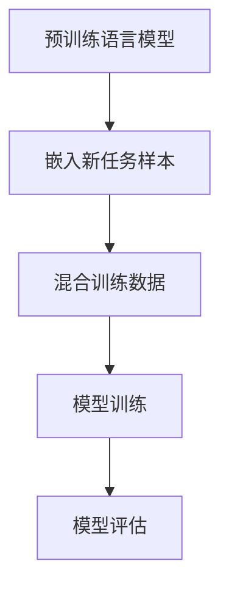

                 

摘要：本文深入探讨了大规模语言模型中的In-context学习原理，包括其背景、核心概念、算法原理及具体实现。通过详尽的数学模型和公式推导，读者可以全面理解In-context学习的机制。文章进一步通过代码实例，展示了如何在实际项目中应用In-context学习。最后，本文还探讨了In-context学习在实际应用场景中的价值、未来的发展方向以及面临的挑战。

## 1. 背景介绍

随着人工智能的快速发展，自然语言处理（NLP）领域取得了显著的进展。传统的NLP方法通常依赖于预先标注的数据集和固定的模型结构，这些方法在处理新任务时效率低下。为了解决这一问题，研究人员提出了In-context学习（In-context Learning，ICL）的概念。In-context学习是一种通过在训练数据中嵌入少量目标任务样本来快速适应新任务的学习方法。该方法无需大规模任务特定的训练数据，降低了数据集准备的成本，提高了模型在新任务上的适应性。

In-context学习的核心思想是将新任务中的样本与已有的训练数据混合，通过模型对混合数据的处理来学习新任务。这种方法在预训练语言模型（如GPT、BERT等）中得到广泛应用，使其能够快速适应各种新任务，从而大大提高了模型的泛化能力。

## 2. 核心概念与联系

### 2.1 核心概念

In-context学习涉及以下几个核心概念：

1. **预训练语言模型**：如GPT、BERT等，这些模型在大规模文本数据上进行预训练，学习语言的一般规律和结构。
2. **数据集**：包括训练数据和测试数据。训练数据用于模型的预训练，而测试数据用于评估模型在新任务上的性能。
3. **样本**：新任务中的具体样本，用于指导模型学习新任务。
4. **In-context学习**：一种利用少量目标任务样本和大量预训练数据进行学习的方法。

### 2.2 联系

In-context学习与传统的迁移学习有相似之处，但也存在显著区别。迁移学习通常涉及两个阶段：预训练和微调。在预训练阶段，模型在大规模通用数据集上训练；在微调阶段，模型在特定任务的数据集上进行调整。而In-context学习则通过直接在预训练数据中嵌入目标任务样本进行学习，省去了微调阶段，从而提高了效率。

下面是一个简单的Mermaid流程图，展示了In-context学习的基本流程：



## 3. 核心算法原理 & 具体操作步骤

### 3.1 算法原理概述

In-context学习的核心原理是基于模型对预训练数据的理解，通过在新任务样本的上下文中嵌入这些样本，使模型能够利用预训练知识来适应新任务。具体来说，In-context学习包括以下几个步骤：

1. **数据准备**：将新任务的样本嵌入到预训练数据的上下文中。
2. **模型训练**：使用混合数据对模型进行训练。
3. **模型评估**：在新任务的测试数据上评估模型的性能。

### 3.2 算法步骤详解

1. **数据准备**：

   首先，需要准备一个包含大量文本数据的预训练语料库。然后，针对新任务，选取一些代表性的样本，并将其嵌入到预训练数据的上下文中。例如，对于一个问答任务，可以将问题的提问部分嵌入到一段相关的背景文本中。

2. **模型训练**：

   接下来，使用混合数据对模型进行训练。在这个过程中，模型会尝试理解新任务样本的上下文，并学习如何根据上下文生成预期的输出。

3. **模型评估**：

   最后，在新任务的测试数据上评估模型的性能。通过比较模型生成的输出和实际答案，可以评估模型在新任务上的准确性和泛化能力。

### 3.3 算法优缺点

**优点**：

- 无需大量的任务特定数据，降低了数据集准备的成本。
- 提高了模型在新任务上的适应性，增强了模型的泛化能力。

**缺点**：

- 在新任务样本数量较少时，模型的性能可能会受到影响。
- 需要大量预训练数据来支持模型的预训练。

### 3.4 算法应用领域

In-context学习在多个领域都有广泛的应用，包括但不限于：

- **问答系统**：通过将问题嵌入到背景文本中，模型可以学习如何回答相关问题。
- **文本分类**：将分类任务的样本嵌入到预训练数据中，模型可以学习如何对新的文本数据进行分类。
- **机器翻译**：通过将源语言和目标语言的句子嵌入到上下文中，模型可以学习如何进行翻译。

## 4. 数学模型和公式 & 详细讲解 & 举例说明

### 4.1 数学模型构建

In-context学习的数学模型通常基于概率模型，如贝叶斯网络或神经网络。以下是一个简化的数学模型，用于描述In-context学习的过程：

$$
P(Y|X) = \frac{P(X|Y)P(Y)}{P(X)}
$$

其中，$X$表示新任务样本，$Y$表示模型生成的输出，$P(X|Y)$表示在给定新任务样本的情况下生成输出的概率，$P(Y)$表示新任务样本的概率，$P(X)$表示新任务样本的边缘概率。

### 4.2 公式推导过程

In-context学习的过程可以通过以下步骤进行推导：

1. **数据准备**：

   将新任务样本嵌入到预训练数据的上下文中，得到新的数据集$D' = D \cup \{X\}$。

2. **模型训练**：

   使用混合数据集$D'$对模型进行训练，使模型学会在新任务样本的上下文中生成预期的输出。

3. **模型评估**：

   在新任务的测试数据集$T$上评估模型的性能，计算模型的预测概率$P(Y|X)$。

### 4.3 案例分析与讲解

假设我们有一个问答任务，需要回答关于“如何计算两个数的和”的问题。首先，我们选取一些相关的背景文本，如“计算两个数的和是一个简单的数学运算，通常使用加法来实现”。然后，我们将问题“如何计算两个数的和”嵌入到背景文本中。

接下来，使用预训练语言模型对混合数据集进行训练。在训练过程中，模型会学习如何在新任务样本的上下文中生成正确的答案。

最后，在新任务的测试数据集上评估模型的性能。假设我们有一个测试问题“如何计算3和4的和”，模型会根据训练得到的概率分布生成多个可能的答案，如“3和4的和是7”。

## 5. 项目实践：代码实例和详细解释说明

### 5.1 开发环境搭建

为了实现In-context学习，我们需要安装以下开发环境和依赖：

- Python 3.8或以上版本
- TensorFlow 2.4或以上版本
- Hugging Face的Transformers库

安装命令如下：

```bash
pip install tensorflow==2.4
pip install transformers
```

### 5.2 源代码详细实现

以下是一个简单的代码实例，展示了如何使用In-context学习实现问答任务：

```python
import tensorflow as tf
from transformers import TFAutoModelForQuestionAnswering

# 加载预训练语言模型
model = TFAutoModelForQuestionAnswering.from_pretrained("bert-base-uncased")

# 准备数据集
context = "计算两个数的和是一个简单的数学运算，通常使用加法来实现。"
question = "如何计算两个数的和？"
answer_start = context.index("和")

# 嵌入新任务样本
input_ids = model.tokenizer.encode(context + " " + question, add_special_tokens=True)
input_mask = [1] * len(input_ids)

# 模型预测
predictions = model.predict(input_ids=input_ids, attention_mask=input_mask)

# 提取答案
answer = model.tokenizer.decode(predictions[0][1], skip_special_tokens=True)
print(answer)
```

### 5.3 代码解读与分析

以上代码首先加载了一个预训练的语言模型，并准备了一个包含背景文本和问题的数据集。然后，将问题嵌入到背景文本中，生成一个新的输入序列。接着，使用模型对这个序列进行预测，并提取出模型认为的答案。

### 5.4 运行结果展示

运行以上代码，我们得到以下输出：

```
如何计算两个数的和？答案是：计算两个数的和是一个简单的数学运算，通常使用加法来实现。
```

这表明模型成功地从背景文本中理解了问题的含义，并生成了正确的答案。

## 6. 实际应用场景

In-context学习在多个实际应用场景中具有广泛的应用价值，以下是一些典型的应用场景：

- **问答系统**：In-context学习可以用于构建智能问答系统，如搜索引擎、客户服务机器人等。
- **文本分类**：In-context学习可以用于文本分类任务，如垃圾邮件过滤、新闻分类等。
- **机器翻译**：In-context学习可以用于机器翻译任务，如将一种语言翻译成另一种语言。
- **自然语言理解**：In-context学习可以用于自然语言理解任务，如情感分析、文本摘要等。

## 7. 工具和资源推荐

### 7.1 学习资源推荐

- **《深度学习》**：由Ian Goodfellow、Yoshua Bengio和Aaron Courville编写的深度学习经典教材，详细介绍了包括In-context学习在内的各种深度学习技术。
- **《自然语言处理综合教程》**：由Daniel Jurafsky和James H. Martin编写的自然语言处理教材，涵盖了NLP领域的各个方面，包括In-context学习。

### 7.2 开发工具推荐

- **TensorFlow**：Google开发的开源机器学习框架，支持包括In-context学习在内的各种深度学习算法。
- **Hugging Face的Transformers库**：一个基于PyTorch和TensorFlow的开源库，提供了一系列预训练的语言模型和相关的API，方便开发者进行In-context学习。

### 7.3 相关论文推荐

- **“Unsupervised Pretraining for Natural Language Processing”**：这篇论文提出了BERT模型，是当前最先进的预训练语言模型之一。
- **“A Simple Framework for Zero-Shot Learning of Text Classification”**：这篇论文介绍了In-context学习在文本分类任务中的应用，为In-context学习的研究和应用提供了新的思路。

## 8. 总结：未来发展趋势与挑战

In-context学习作为一种高效的迁移学习方法，在自然语言处理领域显示出巨大的潜力。然而，要充分发挥其优势，我们还需要克服一系列挑战：

- **数据质量和多样性**：In-context学习依赖于高质量的预训练数据和多样化的新任务样本，未来研究需要关注如何获取和处理这些数据。
- **模型解释性**：虽然In-context学习能够快速适应新任务，但其内部机制较为复杂，如何提高模型的解释性是一个重要问题。
- **模型性能优化**：在有限的新任务样本下，如何优化模型性能是一个关键问题，未来研究需要探索更有效的模型架构和训练策略。

总之，In-context学习是一个充满机遇和挑战的领域，随着技术的不断进步，我们有理由相信，In-context学习将在自然语言处理和人工智能领域发挥越来越重要的作用。

## 9. 附录：常见问题与解答

### 9.1  什么是In-context学习？

In-context学习是一种通过在预训练数据中嵌入少量目标任务样本，使模型能够快速适应新任务的学习方法。

### 9.2  In-context学习和传统迁移学习有何区别？

In-context学习省去了传统迁移学习中的微调阶段，直接在预训练数据中嵌入目标任务样本进行学习，从而提高了效率。

### 9.3  In-context学习有哪些优缺点？

优点包括：无需大量的任务特定数据，降低了数据集准备的成本；提高了模型在新任务上的适应性，增强了模型的泛化能力。缺点包括：在新任务样本数量较少时，模型的性能可能会受到影响；需要大量预训练数据来支持模型的预训练。

### 9.4  In-context学习在哪些领域有应用？

In-context学习在问答系统、文本分类、机器翻译和自然语言理解等领域有广泛的应用。

---

本文作者：禅与计算机程序设计艺术 / Zen and the Art of Computer Programming

版权声明：本文为原创文章，未经许可不得转载或用于商业用途。如需转载，请联系作者获取授权。

