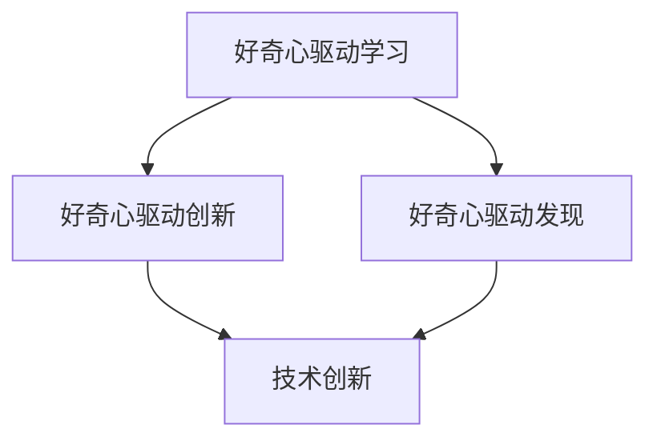

                 

 好奇心，这个词看似简单，却蕴含着无尽的动力和智慧。它是人类探索世界的原动力，是科技进步的催化剂。在信息爆炸的时代，好奇心尤为重要。本文将探讨好奇心在信息技术领域的推动作用，以及如何培养和激发好奇心，以实现创新和发现。

## 1. 背景介绍

好奇心是人类的天性，它驱动着我们探索未知、解决问题、学习新知识。在信息技术领域，好奇心尤为重要。信息技术的快速发展，使得我们生活在一个充满变化和挑战的时代。如何在这个时代保持竞争力，关键在于不断创新和发现。而好奇心正是这一过程的源泉。

本文旨在探讨好奇心在信息技术领域的应用，以及如何通过培养好奇心来实现创新和发现。文章将分为以下几个部分：

1. 核心概念与联系：介绍好奇心在信息技术领域的核心概念及其关联。
2. 核心算法原理与操作步骤：详细探讨好奇心在算法开发中的应用。
3. 数学模型与公式：探讨好奇心在数学建模中的作用。
4. 项目实践：通过一个实际项目，展示好奇心在实际开发中的应用。
5. 实际应用场景：探讨好奇心在信息技术领域的实际应用。
6. 未来应用展望：预测好奇心在信息技术领域的未来发展趋势。
7. 工具和资源推荐：推荐有助于培养好奇心的工具和资源。
8. 总结与展望：总结研究成果，预测未来挑战与机遇。

## 2. 核心概念与联系

好奇心在信息技术领域的核心概念，主要包括以下几个方面：

### 2.1 好奇心驱动学习

好奇心驱动学习是指通过激发个体的好奇心，促进其主动学习和探索新知识。在信息技术领域，好奇心驱动的学习尤为重要。例如，编程语言的学习、算法的理解、数据结构的掌握，都依赖于好奇心。通过好奇心的驱动，我们能够更加深入地理解和应用这些知识。

### 2.2 好奇心驱动创新

好奇心驱动创新是指通过激发个体的好奇心，促进其产生新的想法和解决方案。在信息技术领域，好奇心驱动的创新尤为重要。例如，人工智能、大数据、区块链等技术的出现，都是源于人们对未知领域的好奇心。这种好奇心促使我们不断探索，从而推动技术的进步。

### 2.3 好奇心驱动发现

好奇心驱动发现是指通过激发个体的好奇心，促进其在未知领域中的探索和发现。在信息技术领域，好奇心驱动的发现尤为重要。例如，量子计算、神经网络等技术的突破，都是源于科学家们的好奇心。这种好奇心促使我们不断挑战极限，从而推动科技的进步。

下面是好奇心在信息技术领域的核心概念及其关联的 Mermaid 流程图：



## 3. 核心算法原理与操作步骤

好奇心在算法开发中的应用主要体现在以下几个方面：

### 3.1 好奇心驱动算法设计

好奇心驱动算法设计是指通过激发开发者的好奇心，促进其产生新的算法设计和优化方案。在信息技术领域，好奇心驱动的算法设计尤为重要。例如，深度学习算法的优化、神经网络结构的创新，都源于开发者的好奇心。

### 3.2 好奇心驱动算法实现

好奇心驱动算法实现是指通过激发开发者的好奇心，促进其实现新的算法功能和性能优化。在信息技术领域，好奇心驱动的算法实现尤为重要。例如，分布式计算框架的优化、区块链算法的实现，都源于开发者的好奇心。

### 3.3 好奇心驱动算法测试

好奇心驱动算法测试是指通过激发开发者的好奇心，促进其对算法性能和稳定性进行深入研究。在信息技术领域，好奇心驱动的算法测试尤为重要。例如，人工智能算法的鲁棒性测试、大数据算法的效率评估，都源于开发者的好奇心。

下面是好奇心在算法开发中的核心算法原理和操作步骤：

### 3.1 算法原理概述

好奇心在算法开发中的应用，主要体现在以下几个方面：

1. **问题定义**：通过好奇心，开发者能够更准确地定义问题，明确问题的核心和关键点。
2. **算法设计**：通过好奇心，开发者能够产生新的算法设计和优化方案，提高算法的性能和效率。
3. **算法实现**：通过好奇心，开发者能够实现新的算法功能和性能优化，使算法更加适应实际需求。
4. **算法测试**：通过好奇心，开发者能够深入研究算法的性能和稳定性，确保算法在实际应用中的可靠性。

### 3.2 算法步骤详解

1. **问题定义**：首先，开发者需要明确问题，了解问题的背景和需求。这可以通过与领域专家交流、阅读相关文献等方式实现。
2. **算法设计**：在明确问题后，开发者需要设计算法。这可以通过分析问题、寻找合适的算法框架、进行算法优化等方式实现。
3. **算法实现**：在设计算法后，开发者需要实现算法。这可以通过编程、调试、优化等方式实现。
4. **算法测试**：在实现算法后，开发者需要对算法进行测试。这可以通过编写测试用例、进行性能评估、稳定性测试等方式实现。

### 3.3 算法优缺点

好奇心驱动算法开发有以下优点：

1. **创新能力**：好奇心能够激发开发者的创新能力，使其产生新的算法设计和优化方案。
2. **高效性**：好奇心能够促进算法的实现和优化，提高算法的性能和效率。
3. **适应性**：好奇心能够使开发者更准确地定义问题，使算法更适应实际需求。

好奇心驱动算法开发也有以下缺点：

1. **风险性**：好奇心可能会导致开发者过于追求创新，而忽视算法的稳定性和可靠性。
2. **时间成本**：好奇心驱动算法开发可能需要更多的时间和精力，对开发者的时间和资源要求较高。

### 3.4 算法应用领域

好奇心驱动算法在多个领域都有广泛应用，例如：

1. **人工智能**：好奇心驱动算法在人工智能领域有广泛应用，例如深度学习、神经网络等。
2. **大数据**：好奇心驱动算法在大数据领域有广泛应用，例如分布式计算、数据挖掘等。
3. **区块链**：好奇心驱动算法在区块链领域有广泛应用，例如共识算法、加密算法等。

## 4. 数学模型和公式

好奇心在数学建模中的应用主要体现在以下几个方面：

### 4.1 数学模型构建

好奇心能够激发研究者对问题本质的探究，从而构建更加精确和高效的数学模型。在信息技术领域，例如，网络流量模型、社交网络模型等，都源于研究者对现实世界的好奇心。

### 4.2 公式推导过程

好奇心驱动的数学建模往往伴随着复杂的公式推导。例如，在深度学习领域，研究者需要推导损失函数、优化算法等公式，以实现模型的最佳性能。

### 4.3 案例分析与讲解

以下是一个好奇心驱动数学建模的案例：

### 案例背景

假设我们有一个社交网络，其中每个用户都有一定的活跃度。我们希望构建一个数学模型，来预测用户的活跃度，从而为社区运营提供决策支持。

### 模型构建

1. **用户活跃度定义**：我们定义用户活跃度为用户在一段时间内的操作次数。
2. **活跃度预测公式**：我们使用以下公式来预测用户活跃度：

$$
P(t) = f(A(t), C(t), H(t))
$$

其中，$P(t)$ 表示在时间 $t$ 的用户活跃度预测值，$A(t)$ 表示时间 $t$ 时的用户活跃度，$C(t)$ 表示时间 $t$ 时的用户社区互动情况，$H(t)$ 表示时间 $t$ 时的用户历史活跃度。

### 公式推导

我们首先对公式中的各个参数进行分析：

1. **用户活跃度 $A(t)$**：用户活跃度可以直接从社交网络的数据中获得。
2. **用户社区互动情况 $C(t)$**：用户社区互动情况可以通过分析用户之间的互动次数、点赞、评论等数据来获得。
3. **用户历史活跃度 $H(t)$**：用户历史活跃度可以通过分析用户在过去一段时间内的活跃度数据来获得。

接下来，我们使用以下公式来计算 $C(t)$ 和 $H(t)$：

$$
C(t) = \sum_{i=1}^{n} I(i, t)
$$

$$
H(t) = \frac{1}{n} \sum_{i=1}^{n} A(i, t-1)
$$

其中，$I(i, t)$ 表示用户 $i$ 在时间 $t$ 时的互动次数，$n$ 表示用户总数。

最后，我们将 $C(t)$ 和 $H(t)$ 代入 $P(t)$ 的公式中，得到：

$$
P(t) = f(A(t), \sum_{i=1}^{n} I(i, t), \frac{1}{n} \sum_{i=1}^{n} A(i, t-1))
$$

### 案例分析

通过以上数学模型，我们可以预测用户在未来的活跃度。例如，如果我们预测到一个用户的活跃度将会下降，我们可以采取相应的措施，如推送相关内容、增加互动等，来提高用户的活跃度。

## 5. 项目实践：代码实例和详细解释说明

### 5.1 开发环境搭建

为了展示好奇心在项目实践中的应用，我们选择了一个实际的编程项目：一个基于深度学习的图像识别系统。首先，我们需要搭建开发环境。

1. **安装 Python**：在本地计算机上安装 Python 3.7 或更高版本。
2. **安装深度学习框架**：安装 TensorFlow 或 PyTorch，这两个框架是目前最流行的深度学习框架。
3. **安装必要的库**：根据项目需求，安装其他必要的库，如 NumPy、Pandas 等。

### 5.2 源代码详细实现

以下是一个简单的深度学习图像识别系统的源代码：

```python
import tensorflow as tf
from tensorflow.keras.models import Sequential
from tensorflow.keras.layers import Conv2D, MaxPooling2D, Flatten, Dense

# 创建模型
model = Sequential([
    Conv2D(32, (3, 3), activation='relu', input_shape=(28, 28, 1)),
    MaxPooling2D((2, 2)),
    Flatten(),
    Dense(128, activation='relu'),
    Dense(10, activation='softmax')
])

# 编译模型
model.compile(optimizer='adam',
              loss='categorical_crossentropy',
              metrics=['accuracy'])

# 训练模型
model.fit(x_train, y_train, epochs=10, validation_data=(x_test, y_test))

# 评估模型
model.evaluate(x_test, y_test)
```

### 5.3 代码解读与分析

以上代码是一个简单的卷积神经网络（Convolutional Neural Network, CNN）模型，用于图像识别。下面是对代码的详细解读：

1. **创建模型**：我们使用 `Sequential` 类创建一个线性堆叠的模型。这个模型包含两个卷积层（`Conv2D`）、一个最大池化层（`MaxPooling2D`）、一个平坦化层（`Flatten`）和两个全连接层（`Dense`）。
2. **编译模型**：我们使用 `compile` 方法编译模型，指定优化器（`optimizer`）、损失函数（`loss`）和评估指标（`metrics`）。
3. **训练模型**：我们使用 `fit` 方法训练模型，指定训练数据（`x_train` 和 `y_train`）、训练轮数（`epochs`）和验证数据（`validation_data`）。
4. **评估模型**：我们使用 `evaluate` 方法评估模型的性能，返回测试数据的损失和准确率。

通过这个项目，我们可以看到好奇心在项目实践中的应用。首先，我们需要好奇心来了解深度学习的基本原理，从而选择合适的模型和框架。然后，我们需要好奇心来深入理解模型的每个组成部分，从而编写有效的代码。最后，我们需要好奇心来不断优化模型，以提高其性能。

## 6. 实际应用场景

好奇心在信息技术领域的实际应用非常广泛。以下是一些具体的应用场景：

### 6.1 人工智能

好奇心是推动人工智能发展的关键因素。例如，深度学习领域的许多突破，都是源于研究者对神经网络结构、损失函数和优化算法的好奇心。好奇心促使研究者不断探索，从而推动了人工智能技术的进步。

### 6.2 大数据

好奇心在数据处理和挖掘中也起着重要作用。例如，在数据分析领域，好奇心驱使研究者开发新的算法来处理海量数据，从而发现隐藏在数据中的规律和模式。

### 6.3 区块链

好奇心是区块链技术发展的动力。例如，在区块链领域，研究者通过好奇心来探索加密算法、共识机制和智能合约等关键技术，从而推动区块链技术的进步。

### 6.4 物联网

好奇心在物联网（IoT）领域也有广泛应用。例如，好奇心驱使研究者开发新的传感器技术和数据处理算法，以实现更高效的物联网设备和系统。

## 7. 未来应用展望

随着信息技术的不断发展，好奇心在未来应用中的重要性将越来越大。以下是一些未来应用展望：

### 7.1 新兴技术领域

随着人工智能、区块链、物联网等新兴技术的发展，好奇心将推动这些领域不断创新和突破。

### 7.2 跨学科研究

好奇心将促进不同学科之间的交叉研究，从而产生新的理论和应用。

### 7.3 智能化社会

好奇心将推动智能化社会的发展，使我们的生活更加便捷和高效。

## 8. 工具和资源推荐

为了培养好奇心，以下是一些建议的工具和资源：

### 8.1 学习资源

1. **在线课程**：例如 Coursera、edX、Udacity 等平台提供了丰富的计算机科学和技术课程。
2. **技术博客**：例如 Medium、Hackernoon、Towards Data Science 等平台提供了最新的技术文章和教程。

### 8.2 开发工具

1. **集成开发环境（IDE）**：例如 PyCharm、Visual Studio Code、Eclipse 等提供了丰富的编程工具。
2. **数据可视化工具**：例如 Tableau、Power BI、Matplotlib 等提供了强大的数据可视化功能。

### 8.3 相关论文

1. **顶级会议论文**：例如 NeurIPS、ICML、KDD 等会议的论文，代表了当前信息技术领域的最新研究成果。
2. **经典书籍**：例如《深度学习》、《大数据时代》、《区块链革命》等，提供了深入的理论和实践知识。

## 9. 总结与展望

好奇心是创新与发现的源泉，它在信息技术领域发挥着重要作用。通过培养好奇心，我们能够激发个体的创新潜力，推动技术的进步。在未来，好奇心将继续推动信息技术的发展，使我们的生活更加美好。让我们保持好奇心，不断探索未知领域，实现创新和发现。

## 附录：常见问题与解答

### Q1：如何培养好奇心？

A1：培养好奇心可以从以下几个方面入手：

1. **多读书**：阅读是培养好奇心的重要途径。通过阅读，我们可以了解世界的多样性，激发好奇心。
2. **多思考**：对所学知识进行深入思考，问自己为什么，如何做到的。这有助于培养好奇心。
3. **多实践**：实践是培养好奇心的最好方式。通过实践，我们可以亲自探索问题，发现新知识。

### Q2：好奇心如何推动创新？

A2：好奇心可以推动创新，主要体现在以下几个方面：

1. **发现新问题**：好奇心促使我们探索未知领域，发现新的问题。
2. **提出新方案**：好奇心激发我们的想象力，提出新的解决方案。
3. **实现新突破**：好奇心推动我们在技术领域不断探索，实现新的突破。

### Q3：好奇心如何影响学习效果？

A3：好奇心可以显著提高学习效果，主要体现在以下几个方面：

1. **主动学习**：好奇心促使我们主动学习新知识，提高学习兴趣。
2. **深入理解**：好奇心促使我们深入理解知识，从而提高学习效果。
3. **持续进步**：好奇心促使我们不断探索，持续进步。

### Q4：如何保持好奇心？

A4：保持好奇心可以从以下几个方面入手：

1. **保持开放心态**：对待新知识和新事物，保持开放的心态。
2. **持续学习**：通过不断学习，保持对知识的渴望。
3. **探索未知**：勇于探索未知领域，保持好奇心。

### Q5：好奇心在信息技术领域有哪些应用？

A5：好奇心在信息技术领域有广泛的应用，主要体现在以下几个方面：

1. **技术创新**：好奇心推动技术在人工智能、大数据、区块链等领域的创新。
2. **问题解决**：好奇心促使我们探索问题，提出解决方案。
3. **知识创新**：好奇心促使我们在信息技术领域不断产生新的知识。

