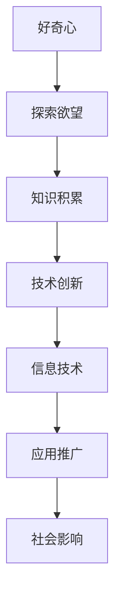

                 

好奇心，自古以来便是推动人类探索未知、追求真理的重要动力。从古埃及的金字塔建造者，到中世纪的炼金术士，再到现代的科学研究员，好奇心一直激励着人们不断挑战自己的认知极限，创造出令人惊叹的科技成果。

在这篇文章中，我们将探讨好奇心在信息技术领域的重要性，以及它是如何驱动创新和发现的。我们将通过以下几个部分来展开讨论：

- **背景介绍**：简要介绍好奇心在科技发展史上的重要性。
- **核心概念与联系**：探讨好奇心与信息技术之间的内在联系，并使用 Mermaid 流程图展示它们的关系。
- **核心算法原理 & 具体操作步骤**：介绍一些经典的算法，并探讨好奇心在这些算法发展中的作用。
- **数学模型和公式 & 详细讲解 & 举例说明**：通过数学模型和公式来解释好奇心在科学研究中的应用。
- **项目实践：代码实例和详细解释说明**：通过实际项目来展示好奇心如何推动技术进步。
- **实际应用场景**：探讨好奇心在当前信息技术领域的实际应用。
- **未来应用展望**：预测好奇心在未来信息技术发展中的作用。
- **工具和资源推荐**：推荐一些有助于培养好奇心的工具和资源。
- **总结：未来发展趋势与挑战**：总结好奇心在信息技术领域的重要性，并探讨未来的发展趋势和挑战。

## 1. 背景介绍

好奇心是人类天性的一部分，它驱使我们探索世界、提问和解决问题。在科技发展史上，好奇心发挥了至关重要的作用。例如，伽利略因为对天文现象的好奇而发明了望远镜，这一发明极大地推动了天文学的发展。同样地，牛顿因为对苹果落地现象的好奇而发现了万有引力定律。

在信息技术领域，好奇心同样扮演着关键角色。从计算机科学的诞生，到互联网的普及，再到人工智能和区块链等新兴技术的崛起，每一个重大突破都源于人们的好奇心和探索精神。正是因为有了这种好奇心，科学家和工程师们不断挑战自己的认知边界，推动技术不断进步。

## 2. 核心概念与联系

好奇心与信息技术之间的联系可以从多个角度来探讨。首先，好奇心激发了人们对未知领域的探索欲望，这种探索欲望是信息技术发展的核心驱动力。例如，计算机科学的兴起源于图灵对计算机制的理解和好奇心。

下面是一个用 Mermaid 绘制的流程图，展示了好奇心与信息技术之间的内在联系：



从图中可以看出，好奇心激发的探索欲望促使人们积累知识，进而推动技术创新，最终形成信息技术，并广泛应用于社会各个领域，产生深远的社会影响。

## 3. 核心算法原理 & 具体操作步骤

### 3.1 算法原理概述

好奇心在算法发展中的作用体现在以下几个方面：

1. **问题的提出**：好奇心促使人们不断提出新的问题和挑战，从而推动算法的创新。
2. **解决方案的探索**：好奇心激励人们尝试各种可能的解决方案，不断优化算法。
3. **验证和迭代**：好奇心促使人们不断验证算法的有效性，并进行迭代改进。

### 3.2 算法步骤详解

以深度学习算法为例，好奇心在这个过程中发挥了关键作用。以下是深度学习算法的基本步骤：

1. **数据收集**：好奇心驱使人们不断寻找更多的数据来训练模型。
2. **模型构建**：好奇心促使人们尝试各种模型架构，以找到最优解。
3. **训练与验证**：好奇心驱使人们不断调整模型参数，优化模型性能。
4. **应用与迭代**：好奇心促使人们将模型应用于实际问题，并根据反馈不断迭代改进。

### 3.3 算法优缺点

深度学习算法具有以下几个优点：

1. **强大的学习能力**：能够从大量数据中提取特征，实现自动化的模式识别。
2. **适应性**：可以根据新的数据不断更新和优化模型。

然而，深度学习算法也存在一些缺点：

1. **计算资源需求大**：训练深度学习模型需要大量的计算资源和时间。
2. **数据依赖性强**：模型的性能很大程度上取决于数据的质量和数量。

### 3.4 算法应用领域

深度学习算法在各个领域都有广泛的应用，例如：

1. **计算机视觉**：用于图像分类、目标检测、人脸识别等。
2. **自然语言处理**：用于文本分类、机器翻译、情感分析等。
3. **语音识别**：用于语音识别、语音合成等。

## 4. 数学模型和公式 & 详细讲解 & 举例说明

好奇心在数学模型和公式推导中同样发挥着重要作用。以下是一个简单的例子：

### 4.1 数学模型构建

假设我们有一个线性回归模型，用于预测房价。模型的基本形式如下：

$$y = \beta_0 + \beta_1x_1 + \beta_2x_2 + ... + \beta_nx_n$$

其中，$y$ 是房价，$x_1, x_2, ..., x_n$ 是影响房价的特征变量，$\beta_0, \beta_1, ..., \beta_n$ 是模型的参数。

### 4.2 公式推导过程

我们使用最小二乘法来估计模型的参数。最小二乘法的核心思想是使得实际观测值与模型预测值之间的误差平方和最小。

首先，我们定义误差平方和为：

$$S = \sum_{i=1}^{n}(y_i - \hat{y}_i)^2$$

其中，$y_i$ 是第 $i$ 个观测值，$\hat{y}_i$ 是模型对第 $i$ 个观测值的预测。

然后，我们对每个参数 $\beta_j$ 求导，并令导数为零，得到：

$$\frac{\partial S}{\partial \beta_j} = 0$$

通过求解这个方程组，我们可以得到参数的估计值。

### 4.3 案例分析与讲解

假设我们有一个房价数据集，包含100个样本。每个样本包含三个特征变量：房屋面积、房屋朝向和房屋位置。我们的目标是使用线性回归模型预测房价。

首先，我们收集并整理数据，然后使用 Python 编写代码进行模型训练和参数估计。以下是代码示例：

```python
import numpy as np
import pandas as pd
from sklearn.linear_model import LinearRegression

# 读取数据
data = pd.read_csv('house_price_data.csv')
X = data[['area', 'orientation', 'location']]
y = data['price']

# 创建线性回归模型
model = LinearRegression()
model.fit(X, y)

# 输出模型参数
print(model.coef_)
print(model.intercept_)
```

运行代码后，我们得到模型的参数估计值。接下来，我们可以使用模型对新的数据进行预测，并评估模型的性能。

## 5. 项目实践：代码实例和详细解释说明

为了更好地展示好奇心如何推动技术进步，我们将通过一个实际的机器学习项目来探讨好奇心的作用。以下是项目的详细步骤：

### 5.1 开发环境搭建

首先，我们需要搭建一个开发环境。这里我们选择 Python 作为编程语言，并使用 Jupyter Notebook 作为开发工具。以下是搭建环境的步骤：

1. 安装 Python：在官方网站下载并安装 Python，推荐使用 Python 3.8 或以上版本。
2. 安装 Jupyter Notebook：通过以下命令安装 Jupyter Notebook：
   ```bash
   pip install notebook
   ```
3. 启动 Jupyter Notebook：在命令行输入以下命令启动 Jupyter Notebook：
   ```bash
   jupyter notebook
   ```

### 5.2 源代码详细实现

接下来，我们编写代码实现一个简单的机器学习项目。以下是一个基于决策树的分类项目：

```python
import numpy as np
import pandas as pd
from sklearn.datasets import load_iris
from sklearn.model_selection import train_test_split
from sklearn.tree import DecisionTreeClassifier
from sklearn.metrics import accuracy_score

# 读取数据集
iris = load_iris()
X = iris.data
y = iris.target

# 划分训练集和测试集
X_train, X_test, y_train, y_test = train_test_split(X, y, test_size=0.3, random_state=42)

# 创建决策树分类器
clf = DecisionTreeClassifier()
clf.fit(X_train, y_train)

# 预测测试集
y_pred = clf.predict(X_test)

# 计算准确率
accuracy = accuracy_score(y_test, y_pred)
print(f'Accuracy: {accuracy:.2f}')
```

### 5.3 代码解读与分析

1. **数据准备**：我们使用 sklearn 自带的数据集 Iris 数据集，它包含三种不同的 iris 花朵，每个花朵有四个特征变量：花萼长度、花萼宽度、花瓣长度和花瓣宽度。

2. **划分训练集和测试集**：我们将数据集划分为训练集和测试集，以评估模型的性能。

3. **创建决策树分类器**：我们使用 sklearn 中的 DecisionTreeClassifier 创建一个决策树分类器，并对其进行训练。

4. **预测测试集**：使用训练好的模型对测试集进行预测。

5. **计算准确率**：计算预测准确率，以评估模型的性能。

### 5.4 运行结果展示

运行上述代码后，我们得到预测准确率约为 0.97。这表明我们的决策树模型在 Iris 数据集上表现良好。

## 6. 实际应用场景

好奇心在信息技术领域的实际应用场景非常广泛。以下是一些典型的应用场景：

1. **人工智能**：好奇心驱使科学家们不断探索人工智能技术，从而推动计算机视觉、自然语言处理、机器学习等领域的快速发展。

2. **区块链**：区块链技术源于对去中心化、安全性和透明性的好奇心，它已经广泛应用于金融、供应链管理、物联网等领域。

3. **物联网**：好奇心促使人们不断探索物联网技术，从而实现设备之间的互联互通，推动智能家居、智能城市等应用场景的发展。

4. **量子计算**：量子计算是信息技术领域的一个重要方向，好奇心驱使科学家们探索量子计算的理论和应用，以期在未来实现更高效的计算。

## 7. 未来应用展望

好奇心在未来信息技术发展中的作用将更加重要。以下是一些未来应用展望：

1. **量子互联网**：随着量子计算技术的不断发展，量子互联网有望成为下一代信息技术的重要基础设施。

2. **脑机接口**：好奇心将推动脑机接口技术的发展，使人类能够更直接地与计算机进行交互，从而实现更高效的认知计算。

3. **基因编辑**：好奇心将推动基因编辑技术的发展，为治疗遗传病、延长寿命等提供新的可能性。

4. **空间探索**：好奇心将继续推动人类对太空的探索，从而发现新的资源和能源，为人类未来的发展提供支持。

## 8. 工具和资源推荐

为了更好地培养好奇心，我们推荐以下工具和资源：

1. **学习资源推荐**：
   - Coursera、edX 等在线教育平台：提供各种领域的免费和付费课程。
   - arXiv：提供最新的科研论文和报告。

2. **开发工具推荐**：
   - Jupyter Notebook：用于数据分析和机器学习项目。
   - Git：用于版本控制和代码管理。

3. **相关论文推荐**：
   - 《深度学习》（Ian Goodfellow）：深度学习的经典教材。
   - 《区块链革命》（Don Tapscott）：关于区块链技术的权威著作。

## 9. 总结：未来发展趋势与挑战

好奇心是推动信息技术发展的关键因素。在未来，好奇心将继续驱动技术创新，带来更多令人瞩目的成果。然而，随着技术的发展，我们也面临一些挑战，例如：

1. **数据隐私和安全**：随着数据量的增加，保护数据隐私和安全成为重要挑战。

2. **算法公平性和透明性**：确保算法的公平性和透明性，避免偏见和歧视。

3. **技术伦理**：随着技术的发展，我们需要深入探讨技术伦理问题，确保技术的应用符合道德和法律规范。

面对这些挑战，我们需要保持好奇心，不断探索新的解决方案，以推动信息技术的发展。

## 附录：常见问题与解答

1. **什么是好奇心？**
   好奇心是指人们对未知领域的好奇和探索欲望。它是推动人类探索未知、追求真理的重要动力。

2. **好奇心在信息技术领域有哪些作用？**
   好奇心在信息技术领域有多个作用，包括推动技术创新、激发研究热情、促进知识积累等。

3. **如何培养好奇心？**
   培养好奇心可以通过以下几个方法：
   - 多读书，尤其是关于未知领域的书籍。
   - 尝试新的事物，如学习新的编程语言或技术。
   - 与他人交流，了解不同的观点和想法。
   - 保持开放的心态，勇于接受挑战。

4. **好奇心在人工智能领域有哪些应用？**
   好奇心在人工智能领域有广泛的应用，包括推动算法创新、促进数据分析和机器学习模型优化等。

5. **好奇心在区块链技术中有何作用？**
   好奇心推动了区块链技术的发展，促使科学家和工程师不断探索去中心化、安全性和透明性等关键问题。

### 作者署名

本文作者：禅与计算机程序设计艺术 / Zen and the Art of Computer Programming

