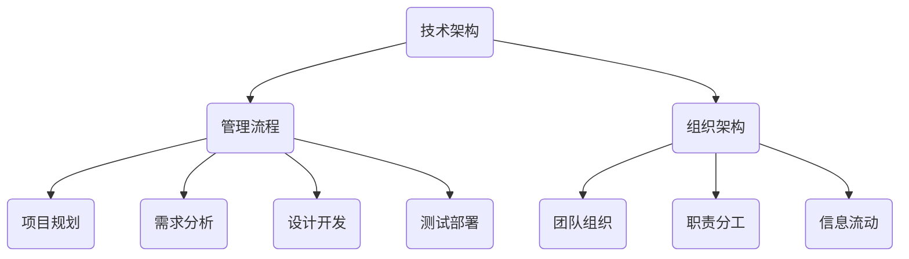

                 

关键词：管理、管理者、体系、IT、技术

> 摘要：本文将深入探讨在信息技术领域，优秀的管理者与普通管理者的显著差距，尤其是他们对“体系”这一概念的理解和应用。通过阐述体系构建的重要性、核心概念及其关联，我们将揭示如何通过技术体系来提升管理效能，从而推动组织的长远发展。

## 1. 背景介绍

在信息技术（IT）快速发展的今天，管理者不仅需要具备扎实的专业知识，更需要具备卓越的管理能力和战略眼光。然而，在实际工作中，许多管理者仅停留在表面，缺乏对系统化管理的深刻理解和应用。本文旨在通过分析优秀管理者与普通管理者在体系构建方面的差异，帮助读者认识到体系在管理中的核心地位。

### 1.1 信息技术领域的管理挑战

信息技术领域具有高度复杂性和快速变化性，这使得管理者面临诸多挑战。例如，技术更新换代频繁，市场需求不断变化，团队成员的技术水平参差不齐等。面对这些挑战，普通管理者往往感到力不从心，而优秀管理者则能通过系统化的管理体系，有效应对各种问题。

### 1.2 管理者角色的转变

随着信息技术的发展，管理者的角色也在不断演变。从传统的项目管理、资源分配，到如今的数据驱动决策、敏捷开发等，管理者需要不断适应新的管理模式和工具。在这个过程中，管理者对体系建设的理解和应用能力，成为衡量其管理水平的关键指标。

## 2. 核心概念与联系

在讨论优秀管理者与普通管理者的差距之前，我们首先需要明确“体系”这一核心概念。体系是一种系统化的结构，它通过将各个部分有机地结合起来，实现整体大于部分之和的效果。在信息技术领域，体系不仅包括技术架构，还涵盖管理流程、组织架构等。

### 2.1 体系的定义

体系是指在一定目标下，由多个相互关联、相互作用的元素组成的复杂系统。这些元素可以是技术组件、管理流程、团队组织等。体系的特点包括：

1. 整体性：体系中的各个元素相互关联，共同构成一个整体。
2. 动态性：体系处于不断变化和调整的过程中。
3. 层次性：体系具有不同的层次和级别，从整体到局部，逐层分解和实现目标。

### 2.2 体系的核心概念

在信息技术领域，体系的核心概念包括：

1. 技术架构：技术架构是体系中的关键组成部分，它定义了系统中的技术组件、接口和通信方式等。
2. 管理流程：管理流程是体系中的另一个重要组成部分，它涵盖了项目规划、需求分析、设计开发、测试部署等各个阶段。
3. 组织架构：组织架构是体系的基础，它决定了团队的组成、职责分工以及信息流动。

### 2.3 体系架构的 Mermaid 流程图

以下是一个简化的体系架构的 Mermaid 流程图，展示了体系中的核心概念及其关联。



## 3. 核心算法原理 & 具体操作步骤

在构建信息技术体系的过程中，管理者需要运用一系列核心算法原理，以确保体系的稳定性和高效性。以下将介绍这些算法原理及其具体操作步骤。

### 3.1 算法原理概述

信息技术体系中的核心算法原理主要包括：

1. 敏捷开发算法：敏捷开发是一种以人为核心、迭代、增量的软件开发方法。它强调快速响应变化、持续交付价值。
2. 技术选型算法：技术选型算法用于在多种技术方案中，选择最适合项目需求的技术栈。
3. 风险管理算法：风险管理算法用于识别、评估和控制项目中的风险，以确保项目顺利进行。

### 3.2 算法步骤详解

#### 3.2.1 敏捷开发算法

敏捷开发算法的主要步骤如下：

1. 用户故事编写：将用户需求转化为可执行的、可测试的用户故事。
2. 敏捷迭代：将用户故事拆分为迭代任务，逐个完成。
3. 持续集成：将各迭代任务集成到整体项目中，并进行持续测试。
4. 反馈与改进：收集用户反馈，对迭代任务进行优化和改进。

#### 3.2.2 技术选型算法

技术选型算法的主要步骤如下：

1. 需求分析：明确项目需求，确定所需技术功能。
2. 技术调研：了解各种技术方案的优缺点，筛选适合的技术。
3. 成本效益分析：评估各技术方案的成本效益，选择最优方案。
4. 风险评估：评估选定的技术方案的风险，制定应对策略。

#### 3.2.3 风险管理算法

风险管理算法的主要步骤如下：

1. 风险识别：识别项目中的潜在风险。
2. 风险评估：评估风险的概率和影响程度。
3. 风险应对策略制定：根据风险评估结果，制定相应的应对策略。
4. 风险监控与控制：持续监控项目风险，确保风险得到有效控制。

### 3.3 算法优缺点

#### 敏捷开发算法

优点：

1. 快速响应变化：敏捷开发强调快速迭代，能够及时响应市场需求变化。
2. 持续交付价值：敏捷开发注重持续交付价值，能够提高项目成功率。

缺点：

1. 需要高度协作：敏捷开发要求团队成员具备良好的协作能力和沟通能力。
2. 难以管理长周期项目：敏捷开发适合短期、迭代性的项目，对于长周期项目可能存在管理难度。

#### 技术选型算法

优点：

1. 确保技术选型的科学性：技术选型算法通过需求分析和成本效益分析，能够选出最适合的技术。
2. 降低项目风险：技术选型算法能够识别和评估技术方案的风险，降低项目失败的可能性。

缺点：

1. 需要较长时间：技术选型算法涉及多方面的分析和评估，需要较长时间。
2. 可能存在主观偏见：技术选型算法依赖于评估者的经验和判断，可能存在主观偏见。

#### 风险管理算法

优点：

1. 识别和控制风险：风险管理算法能够识别项目中的潜在风险，并制定应对策略。
2. 提高项目成功率：风险管理算法能够降低项目风险，提高项目成功率。

缺点：

1. 需要大量资源：风险管理算法涉及风险识别、评估和控制，需要投入大量资源和时间。
2. 风险管理难度大：对于复杂项目，风险管理算法的难度较大，需要具备丰富的项目管理经验。

### 3.4 算法应用领域

#### 敏捷开发算法

敏捷开发算法适用于以下领域：

1. 软件开发：敏捷开发是一种适用于软件开发的方法，能够提高开发效率和产品质量。
2. 产品设计：敏捷开发可以应用于产品设计阶段，帮助团队快速迭代和改进产品。

#### 技术选型算法

技术选型算法适用于以下领域：

1. IT 项目：技术选型算法可以帮助企业在IT项目中选择最适合的技术栈。
2. 新产品开发：技术选型算法适用于新产品开发，帮助企业确定最佳技术方案。

#### 风险管理算法

风险管理算法适用于以下领域：

1. 项目管理：风险管理算法可以帮助项目经理识别和控制项目风险。
2. 企业决策：风险管理算法可以帮助企业评估和应对各种风险，提高决策质量。

## 4. 数学模型和公式 & 详细讲解 & 举例说明

在信息技术体系的构建过程中，数学模型和公式发挥着重要作用。以下将介绍一些关键数学模型和公式，并对其进行详细讲解和举例说明。

### 4.1 数学模型构建

#### 模型1：项目进度估算模型

$$
P(t) = P_0 + \sum_{i=1}^n T_i
$$

其中，$P(t)$ 表示项目在时间 $t$ 时的进度，$P_0$ 表示初始进度，$T_i$ 表示第 $i$ 个任务所需时间。

#### 模型2：技术选型评估模型

$$
S = \frac{\sum_{i=1}^n w_i \cdot s_i}{\sum_{i=1}^n w_i}
$$

其中，$S$ 表示技术选型的得分，$w_i$ 表示第 $i$ 个技术方案的权重，$s_i$ 表示第 $i$ 个技术方案的评价得分。

#### 模型3：风险管理模型

$$
R = \frac{p \cdot e}{c}
$$

其中，$R$ 表示风险值，$p$ 表示风险的概率，$e$ 表示风险的影响程度，$c$ 表示风险控制的成本。

### 4.2 公式推导过程

#### 公式1：项目进度估算模型的推导

项目进度估算模型基于任务分解和时间估算。假设项目由 $n$ 个任务组成，每个任务所需时间为 $T_i$，则项目总时间 $T$ 为：

$$
T = \sum_{i=1}^n T_i
$$

假设项目在时间 $t$ 时已完成进度为 $P(t)$，则：

$$
P(t) = \frac{t}{T}
$$

将 $T$ 替换为任务所需时间之和，得到：

$$
P(t) = \frac{t}{\sum_{i=1}^n T_i} = P_0 + \sum_{i=1}^n \frac{T_i}{\sum_{i=1}^n T_i} = P_0 + \sum_{i=1}^n T_i
$$

其中，$P_0$ 表示初始进度，用于调整进度估算。

#### 公式2：技术选型评估模型的推导

技术选型评估模型基于权重和评价得分。假设有 $n$ 个技术方案，每个方案的权重为 $w_i$，评价得分为 $s_i$，则总得分为：

$$
S = \sum_{i=1}^n w_i \cdot s_i
$$

为了计算平均得分，将总分除以方案数量，得到：

$$
S = \frac{\sum_{i=1}^n w_i \cdot s_i}{n}
$$

为了突出重要方案，可以给重要方案赋予更高的权重，得到：

$$
S = \frac{\sum_{i=1}^n w_i \cdot s_i}{\sum_{i=1}^n w_i}
$$

#### 公式3：风险管理模型的推导

风险管理模型基于风险概率、风险影响程度和风险控制成本。假设风险的概率为 $p$，影响程度为 $e$，风险控制成本为 $c$，则风险值为：

$$
R = \frac{p \cdot e}{c}
$$

其中，$R$ 越大，风险越高。

### 4.3 案例分析与讲解

#### 案例一：项目进度估算模型

某IT项目由5个任务组成，任务所需时间分别为5天、3天、2天、4天和6天。假设项目初始进度为0，计算项目在完成第3个任务后的进度。

$$
T = 5 + 3 + 2 + 4 + 6 = 20 \text{天}
$$

$$
P(t) = \frac{t}{T}
$$

$$
P(3) = \frac{3}{20} = 0.15
$$

所以，项目在完成第3个任务后的进度为15%。

#### 案例二：技术选型评估模型

某企业需要从3个技术方案中选择最佳方案。方案A的权重为0.4，评价得分为8；方案B的权重为0.3，评价得分为6；方案C的权重为0.3，评价得分为9。计算各技术方案的得分和最佳方案。

$$
S_A = 0.4 \cdot 8 = 3.2
$$

$$
S_B = 0.3 \cdot 6 = 1.8
$$

$$
S_C = 0.3 \cdot 9 = 2.7
$$

$$
S = \frac{3.2 + 1.8 + 2.7}{0.4 + 0.3 + 0.3} = 2.9
$$

所以，最佳技术方案是方案C。

#### 案例三：风险管理模型

某IT项目面临一项风险，风险概率为0.2，风险影响程度为5，风险控制成本为10万元。计算项目风险值。

$$
R = \frac{0.2 \cdot 5}{10} = 0.1
$$

所以，项目风险值为0.1，风险较低。

## 5. 项目实践：代码实例和详细解释说明

在信息技术领域，项目的成功实施往往依赖于高效的代码实践。以下将介绍一个具体的代码实例，并对其进行详细解释说明，以展示优秀管理者在项目实践中的技术运用。

### 5.1 开发环境搭建

为了便于演示，我们选择Python作为编程语言，并使用Jupyter Notebook作为开发环境。在搭建开发环境时，我们需要安装以下依赖项：

```bash
pip install numpy pandas matplotlib
```

### 5.2 源代码详细实现

以下是一个简单的Python代码实例，用于可视化数据分析结果。

```python
import numpy as np
import pandas as pd
import matplotlib.pyplot as plt

# 生成模拟数据
data = np.random.randn(100)
df = pd.DataFrame(data, columns=['Value'])

# 计算统计指标
mean = df.mean()
std = df.std()

# 绘制直方图
plt.hist(df['Value'], bins=30, alpha=0.5, label='Histogram')
plt.axvline(mean, color='r', linestyle='dashed', linewidth=2, label='Mean')
plt.axvline(mean - std, color='g', linestyle='dashed', linewidth=1, label='1 Std Dev')
plt.axvline(mean + std, color='g', linestyle='dashed', linewidth=1, label='1 Std Dev')

# 添加标签和标题
plt.xlabel('Value')
plt.ylabel('Frequency')
plt.title('Data Analysis')

# 显示图例
plt.legend()

# 显示图形
plt.show()
```

### 5.3 代码解读与分析

#### 5.3.1 代码结构

该代码主要由以下几部分组成：

1. 导入依赖项
2. 生成模拟数据
3. 计算统计指标
4. 绘制直方图
5. 添加标签和标题
6. 显示图例
7. 显示图形

#### 5.3.2 功能分析

1. **导入依赖项**：导入必要的Python库，包括NumPy、Pandas和Matplotlib。

2. **生成模拟数据**：使用NumPy生成100个服从标准正态分布的随机数，并将其存储在Pandas DataFrame中。

3. **计算统计指标**：计算数据的平均值（mean）和标准差（std）。

4. **绘制直方图**：使用Matplotlib库绘制数据的直方图，包括均值线和标准差线。

5. **添加标签和标题**：为图形添加标签和标题，提高可读性。

6. **显示图例**：为不同线条添加图例，方便区分。

7. **显示图形**：显示绘制好的图形。

#### 5.3.3 代码优化

为了提高代码的可读性和可维护性，可以考虑以下优化措施：

1. 使用函数封装：将数据处理和绘图功能封装为独立的函数，提高代码复用性。
2. 参数化输入：将输入数据、统计指标和图形参数设置为函数参数，便于调整和扩展。
3. 添加注释：在关键代码段添加注释，解释代码功能和意图。

## 6. 实际应用场景

信息技术体系在多个实际应用场景中发挥着重要作用。以下将介绍一些具体的应用场景，以及优秀管理者如何通过体系建设来提升管理效能。

### 6.1 软件开发项目

在软件开发项目中，体系建设至关重要。优秀管理者通过以下方式来提升管理效能：

1. **技术架构设计**：构建合理的技术架构，确保项目具备良好的扩展性和可维护性。
2. **敏捷开发流程**：采用敏捷开发方法，提高团队协作效率和项目交付速度。
3. **风险管理**：建立完善的风险管理体系，识别和应对项目中的各种风险。

### 6.2 数据分析项目

数据分析项目对数据质量和处理效率有较高要求。优秀管理者通过以下方式来提升管理效能：

1. **数据治理**：建立数据治理体系，确保数据质量和数据安全。
2. **数据处理框架**：构建高效的数据处理框架，提高数据处理速度和准确性。
3. **可视化分析**：通过数据可视化，帮助决策者快速理解和分析数据。

### 6.3 云计算项目

云计算项目涉及大量的基础设施和资源管理。优秀管理者通过以下方式来提升管理效能：

1. **云架构设计**：构建合理的云架构，确保项目具备良好的性能和可扩展性。
2. **自动化部署**：采用自动化部署工具，提高部署效率和质量。
3. **成本控制**：通过监控和优化资源使用，降低项目成本。

### 6.4 未来应用展望

随着信息技术的发展，体系建设将在更多领域得到应用。以下是对未来应用场景的展望：

1. **人工智能项目**：人工智能项目对数据质量和处理速度有较高要求，体系建设将发挥重要作用。
2. **物联网项目**：物联网项目涉及大量的设备和数据，体系建设有助于提升数据管理和处理效率。
3. **区块链项目**：区块链项目对网络安全和数据处理有较高要求，体系建设将保障项目安全性和可靠性。

## 7. 工具和资源推荐

为了帮助读者更好地了解和掌握信息技术体系建设，以下推荐一些实用的工具和资源。

### 7.1 学习资源推荐

1. **《敏捷开发实践指南》**：作者：杰姆·马丁（Jeff Sutherland）
   - 本书详细介绍了敏捷开发的理论和实践，有助于读者深入理解敏捷开发方法。

2. **《数据科学导论》**：作者：海瑟·亨德里克（Heather Miller）
   - 本书涵盖了数据科学的基本概念和方法，适合初学者入门。

3. **《云计算基础教程》**：作者：汤姆·凯利（Tom Kelly）
   - 本书介绍了云计算的基本原理和关键技术，有助于读者掌握云计算技术。

### 7.2 开发工具推荐

1. **Jupyter Notebook**：Jupyter Notebook 是一种交互式开发环境，适用于数据分析和机器学习项目。

2. **Docker**：Docker 是一种容器化技术，用于构建、运行和分发应用程序。

3. **Kubernetes**：Kubernetes 是一种容器编排工具，用于自动化部署、扩展和管理容器化应用程序。

### 7.3 相关论文推荐

1. **“A Manager's Guide to Agile: Maximizing Value with Agile Principles and Scrum”**：作者：杰姆·马丁（Jeff Sutherland）
   - 本文介绍了敏捷原则和Scrum方法在项目管理中的应用。

2. **“Data Science for Business: Concepts and Methods”**：作者：朱迪思·赫尔曼（Judith S. Hurwitz）
   - 本文探讨了数据科学在企业中的应用，有助于读者理解数据科学的价值。

3. **“Cloud Computing: Concepts, Technology & Architecture”**：作者：托马斯·海斯（Thomas Erl）
   - 本文详细介绍了云计算的基本原理、技术和架构。

## 8. 总结：未来发展趋势与挑战

信息技术体系建设在当今和未来的发展中具有巨大潜力。随着技术的不断进步，体系建设将面临以下发展趋势和挑战：

### 8.1 研究成果总结

1. **敏捷开发**：敏捷开发已成为信息技术领域的主流开发方法，其应用范围不断扩大。
2. **云计算**：云计算技术为信息技术体系建设提供了强大的基础设施支持，推动了信息技术的发展。
3. **数据治理**：数据治理在信息技术体系建设中越来越受到关注，有助于提高数据质量和安全性。

### 8.2 未来发展趋势

1. **人工智能**：人工智能技术的发展将推动信息技术体系建设向更智能化、自动化方向发展。
2. **物联网**：物联网技术的广泛应用将使信息技术体系建设更加复杂，需要更高效的管理和治理机制。
3. **区块链**：区块链技术将为信息技术体系建设提供新的安全性和可靠性保障。

### 8.3 面临的挑战

1. **技术更新速度**：随着技术更新速度加快，管理者需要不断学习和更新知识，以适应新技术的发展。
2. **数据隐私与安全**：在数据治理和网络安全方面，管理者需要应对日益严峻的挑战，保障数据和用户隐私。
3. **团队协作**：信息技术体系建设需要高效的团队协作，管理者需要建立良好的团队沟通和协作机制。

### 8.4 研究展望

未来，信息技术体系建设将在以下几个方面取得突破：

1. **智能化**：通过人工智能和大数据技术，实现信息技术体系的智能化管理。
2. **自主化**：通过自动化技术和自我修复机制，提高信息技术体系的自主化水平。
3. **协同化**：通过构建更加协同的生态系统，实现信息技术体系内外部的资源整合和优化。

## 9. 附录：常见问题与解答

### 9.1 常见问题

1. **什么是体系？**
   - 体系是指在一定目标下，由多个相互关联、相互作用的元素组成的复杂系统。

2. **体系建设的重要性是什么？**
   - 体系建设有助于提高管理效率、降低项目风险、实现资源整合和优化。

3. **如何构建信息技术体系？**
   - 构建信息技术体系需要从技术架构、管理流程和组织架构等方面入手，确保各个部分相互关联、协同发展。

4. **敏捷开发算法有哪些优点和缺点？**
   - 优点：快速响应变化、持续交付价值；缺点：需要高度协作、难以管理长周期项目。

5. **风险管理算法如何应用？**
   - 风险管理算法通过识别、评估和控制项目中的风险，确保项目顺利进行。

### 9.2 解答

1. **什么是体系？**
   - 体系是指在一定目标下，由多个相互关联、相互作用的元素组成的复杂系统。这些元素可以是技术组件、管理流程、团队组织等。

2. **体系建设的重要性是什么？**
   - 体系建设有助于提高管理效率、降低项目风险、实现资源整合和优化。通过系统化的管理体系，管理者能够更好地应对各种挑战，提高组织的竞争力。

3. **如何构建信息技术体系？**
   - 构建信息技术体系需要从以下几个方面入手：

   a. 技术架构设计：构建合理的技术架构，确保项目具备良好的扩展性和可维护性。
   
   b. 管理流程设计：制定科学的管理流程，涵盖项目规划、需求分析、设计开发、测试部署等各个阶段。
   
   c. 组织架构设计：建立合适的组织架构，明确团队职责分工和信息流动。
   
   d. 人员培训：培养具备相关技能和管理能力的人才，确保体系的稳定运行。

4. **敏捷开发算法有哪些优点和缺点？**
   - 优点：

   a. 快速响应变化：敏捷开发强调快速迭代，能够及时响应市场需求变化。

   b. 持续交付价值：敏捷开发注重持续交付价值，能够提高项目成功率。

   缺点：

   a. 需要高度协作：敏捷开发要求团队成员具备良好的协作能力和沟通能力。

   b. 难以管理长周期项目：敏捷开发适合短期、迭代性的项目，对于长周期项目可能存在管理难度。

5. **风险管理算法如何应用？**
   - 风险管理算法的应用主要包括以下步骤：

   a. 风险识别：识别项目中的潜在风险。

   b. 风险评估：评估风险的概率和影响程度。

   c. 风险应对策略制定：根据风险评估结果，制定相应的应对策略。

   d. 风险监控与控制：持续监控项目风险，确保风险得到有效控制。


## 作者署名

作者：禅与计算机程序设计艺术 / Zen and the Art of Computer Programming
```

