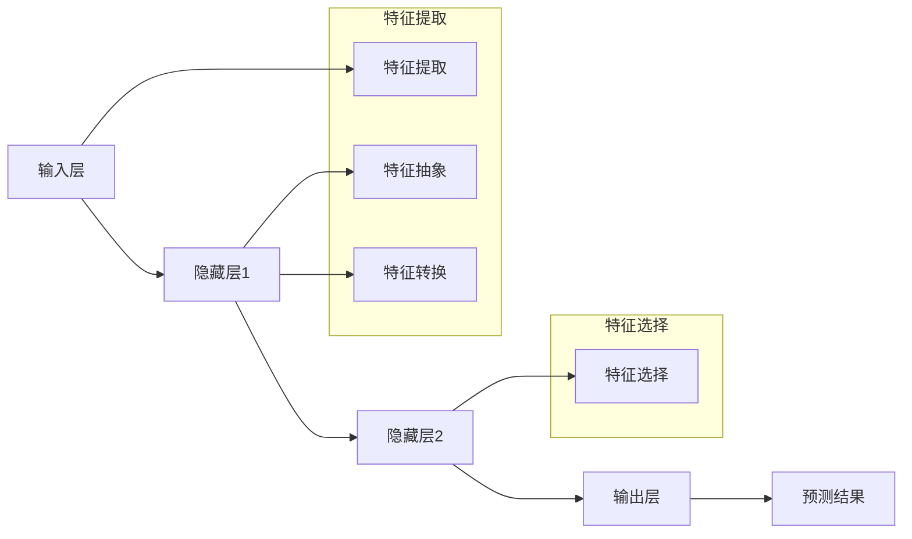

                 

关键词：特征学习、机器学习、深度学习、复杂特征提取、神经网络、数学模型、算法实现、应用领域、发展趋势

> 摘要：本文从机器学习和深度学习的角度出发，探讨了如何从输入数据中学习复杂特征的方法。通过介绍特征学习的核心概念、算法原理、数学模型以及实际应用案例，文章旨在为读者提供一种全面深入的理解，以便更好地掌握这一技术，并在实际项目中灵活运用。

## 1. 背景介绍

在人工智能领域，特征学习是一种重要的技术，它使得机器能够从原始数据中提取有用的信息，从而实现对复杂问题的有效解决。随着深度学习的兴起，特征学习变得更加重要和复杂。深度学习模型，尤其是神经网络，通过多层抽象逐渐学习到数据中的复杂特征，从而实现高度复杂的任务。

### 1.1 机器学习与深度学习的区别

机器学习是人工智能的一个分支，它主要关注如何通过算法从数据中自动学习规律和模式。机器学习方法可以分为监督学习、无监督学习和半监督学习。监督学习是其中最为广泛使用的一种方法，它通过已知的输入输出对（标记数据）来训练模型，从而预测未知数据的输出。

深度学习是机器学习的一个子领域，它依赖于多层神经网络结构来学习数据的复杂特征。与传统的机器学习方法相比，深度学习模型具有更强的表示能力和更好的泛化能力。

### 1.2 复杂特征的含义

复杂特征是指那些能够准确描述数据内在结构和关系的特征。这些特征可能是原始数据的直接转换，也可能是通过多个层次的抽象和转换得到的。复杂特征的学习是实现高精度预测和决策的关键。

## 2. 核心概念与联系

### 2.1 特征学习的核心概念

特征学习涉及到以下几个核心概念：

- **特征提取**：从原始数据中提取出有用的特征。
- **特征选择**：从提取出的特征中选择最相关的特征。
- **特征变换**：对提取出的特征进行转换，以增强其表达能力和鲁棒性。

### 2.2 特征学习的架构

特征学习的架构通常包括以下几个层次：

1. **输入层**：接收原始数据。
2. **隐藏层**：通过神经网络进行特征提取和抽象。
3. **输出层**：生成预测结果或决策。

### 2.3 Mermaid 流程图

下面是一个简单的 Mermaid 流程图，描述了特征学习的基本流程：



## 3. 核心算法原理 & 具体操作步骤

### 3.1 算法原理概述

特征学习算法的核心是基于神经网络的多层抽象。每一层神经网络都从前一层的输出中提取新的特征，并通过反向传播算法不断调整网络权重，以最小化预测误差。

### 3.2 算法步骤详解

1. **初始化网络参数**：设定网络中的权重和偏置。
2. **前向传播**：输入数据通过网络从输入层传递到输出层，得到预测结果。
3. **计算损失函数**：使用预测结果和实际标签计算损失函数。
4. **反向传播**：计算损失函数关于网络参数的梯度，并更新网络参数。
5. **迭代训练**：重复步骤2-4，直到满足停止条件（如损失函数收敛或达到最大迭代次数）。

### 3.3 算法优缺点

**优点**：

- **强大的特征提取能力**：多层神经网络可以自动提取数据中的复杂特征。
- **高度可扩展**：可以应用于各种不同的数据类型和任务。
- **良好的泛化能力**：通过大量训练数据，可以避免过拟合。

**缺点**：

- **计算成本高**：需要大量的计算资源和时间。
- **对数据质量敏感**：数据预处理不当可能导致模型性能下降。
- **解释性差**：神经网络模型通常是“黑盒”模型，难以解释。

### 3.4 算法应用领域

特征学习算法在许多领域都有广泛应用，包括：

- **计算机视觉**：用于图像分类、目标检测和图像生成等任务。
- **自然语言处理**：用于文本分类、机器翻译和情感分析等任务。
- **推荐系统**：用于用户行为分析和物品推荐。

## 4. 数学模型和公式 & 详细讲解 & 举例说明

### 4.1 数学模型构建

特征学习算法的核心是多层神经网络，其数学模型可以表示为：

$$
Y = \sigma(W_L \cdot a^{[L-1]} + b_L)
$$

其中，$Y$ 是输出层激活值，$\sigma$ 是激活函数，$W_L$ 和 $b_L$ 分别是输出层权重和偏置，$a^{[L-1]}$ 是前一层的激活值。

### 4.2 公式推导过程

多层神经网络的前向传播和反向传播过程涉及一系列复杂的数学推导。这里简要介绍以下关键公式：

前向传播：

$$
a^{[l]} = \sigma(W^{[l]} \cdot a^{[l-1]} + b^{[l]})
$$

反向传播：

$$
\frac{\partial J}{\partial W^{[l]}} = \delta^{[l+1]} \cdot a^{[l]}
$$

$$
\frac{\partial J}{\partial b^{[l]}} = \delta^{[l+1]}
$$

其中，$J$ 是损失函数，$\delta^{[l+1]}$ 是输出层误差的梯度，$a^{[l]}$ 是当前层激活值。

### 4.3 案例分析与讲解

假设我们有一个简单的二分类问题，使用多层感知机（MLP）进行特征学习。数据集包含100个样本，每个样本有两个特征，目标标签为0或1。我们使用均方误差（MSE）作为损失函数。

1. **初始化网络参数**：

   设输入层有2个神经元，隐藏层有3个神经元，输出层有1个神经元。初始化权重和偏置为随机值。

2. **前向传播**：

   输入样本 $X = [x_1, x_2]$，通过输入层传递到隐藏层，再传递到输出层。

3. **计算损失函数**：

   使用均方误差（MSE）计算输出层预测值 $Y$ 与实际标签 $y$ 之间的误差。

4. **反向传播**：

   计算输出层误差的梯度，并更新网络参数。

5. **迭代训练**：

   重复步骤2-4，直到满足停止条件。

## 5. 项目实践：代码实例和详细解释说明

### 5.1 开发环境搭建

我们需要安装以下软件和库：

- Python 3.x
- TensorFlow 或 PyTorch
- NumPy
- Matplotlib

安装命令如下：

```bash
pip install python==3.x
pip install tensorflow
pip install numpy
pip install matplotlib
```

### 5.2 源代码详细实现

以下是一个简单的特征学习代码示例，使用 TensorFlow 和 Keras 构建多层感知机（MLP）：

```python
import tensorflow as tf
from tensorflow.keras.models import Sequential
from tensorflow.keras.layers import Dense
from tensorflow.keras.optimizers import Adam
from sklearn.model_selection import train_test_split
import numpy as np

# 加载数据集
X, y = np.random.rand(100, 2), np.random.randint(0, 2, size=100)

# 划分训练集和测试集
X_train, X_test, y_train, y_test = train_test_split(X, y, test_size=0.2, random_state=42)

# 构建模型
model = Sequential()
model.add(Dense(3, input_shape=(2,), activation='relu'))
model.add(Dense(1, activation='sigmoid'))

# 编译模型
model.compile(optimizer=Adam(), loss='binary_crossentropy', metrics=['accuracy'])

# 训练模型
model.fit(X_train, y_train, epochs=100, batch_size=10, validation_data=(X_test, y_test))

# 评估模型
loss, accuracy = model.evaluate(X_test, y_test)
print(f"Test accuracy: {accuracy * 100:.2f}%")
```

### 5.3 代码解读与分析

上述代码首先导入了所需的库和模块，然后加载数据集并划分训练集和测试集。接下来，我们使用 Keras 构建了一个简单的多层感知机（MLP）模型，其中包含一个输入层、一个隐藏层和一个输出层。隐藏层使用 ReLU 激活函数，输出层使用 Sigmoid 激活函数以实现二分类。

我们使用 Adam 优化器和均方误差（MSE）损失函数编译模型，并使用训练集训练模型。最后，使用测试集评估模型性能，并打印测试准确率。

## 6. 实际应用场景

特征学习在许多实际应用场景中具有重要价值，以下是一些常见的应用：

- **计算机视觉**：用于图像分类、目标检测和图像生成等任务，如人脸识别、自动驾驶和医疗图像分析。
- **自然语言处理**：用于文本分类、机器翻译和情感分析等任务，如搜索引擎、智能客服和文本生成。
- **推荐系统**：用于用户行为分析和物品推荐，如电商推荐、社交媒体推荐和音乐推荐。

### 6.4 未来应用展望

随着人工智能技术的不断发展，特征学习在未来将有更广泛的应用前景。一方面，深度学习模型的复杂性和能力将继续提升，从而更好地处理复杂特征；另一方面，特征学习算法将与其他技术相结合，如强化学习、迁移学习和生成对抗网络（GAN），以实现更高效、更智能的特征学习。

## 7. 工具和资源推荐

### 7.1 学习资源推荐

- 《深度学习》（Ian Goodfellow、Yoshua Bengio 和 Aaron Courville 著）
- 《Python 深度学习》（François Chollet 著）
- Coursera 上的“深度学习”课程（吴恩达教授主讲）

### 7.2 开发工具推荐

- TensorFlow：用于构建和训练深度学习模型。
- PyTorch：用于构建和训练深度学习模型，支持动态计算图。
- Keras：用于构建和训练深度学习模型，基于 TensorFlow 和 PyTorch。

### 7.3 相关论文推荐

- “Deep Learning”（Yoshua Bengio、Ian Goodfellow 和 Aaron Courville 著）
- “A Theoretically Grounded Application of Dropout in Recurrent Neural Networks”（Yarin Gal 和 Zoubin Ghahramani 著）
- “Batch Normalization: Accelerating Deep Network Training by Reducing Internal Covariate Shift”（Sergey Ioffe 和 Christian Szegedy 著）

## 8. 总结：未来发展趋势与挑战

### 8.1 研究成果总结

特征学习作为机器学习和深度学习的一个重要分支，已经取得了显著的研究成果。多层神经网络和深度学习模型的不断进步，使得特征学习算法在各类任务中表现出色。

### 8.2 未来发展趋势

未来，特征学习将继续向以下几个方向发展：

- **更复杂的模型结构**：通过设计更复杂的网络结构，提高特征提取能力。
- **迁移学习和少样本学习**：通过迁移学习和少样本学习技术，降低对大规模训练数据的需求。
- **可解释性和可解释性**：提高特征学习算法的可解释性，使其在应用中更具可信度。
- **跨领域应用**：将特征学习算法应用于更多领域，如生物信息学、金融和医疗等。

### 8.3 面临的挑战

尽管特征学习取得了显著成果，但仍然面临以下挑战：

- **计算资源需求**：深度学习模型对计算资源的需求较高，特别是在训练过程中。
- **数据质量和标注**：特征学习算法对数据质量和标注有较高要求，数据预处理不当可能导致模型性能下降。
- **模型可解释性**：深度学习模型通常是“黑盒”模型，难以解释其内部机制。

### 8.4 研究展望

随着人工智能技术的不断发展，特征学习将在更多领域发挥重要作用。未来，我们将看到更多创新性的特征学习算法和应用场景的出现，为人工智能技术的发展做出更大贡献。

## 9. 附录：常见问题与解答

### 9.1 什么是特征学习？

特征学习是一种通过算法从原始数据中提取有用信息的方法。在机器学习和深度学习中，特征学习是一个核心问题，它使得机器能够从原始数据中学习到有用的特征，从而实现高效的任务处理。

### 9.2 特征学习和特征提取有什么区别？

特征学习和特征提取是两个相关的概念。特征提取是指从原始数据中提取出有用的特征，而特征学习是指通过算法从提取出的特征中学习到更有用的特征。特征提取通常是一个预处理的步骤，而特征学习则是机器学习模型训练的核心过程。

### 9.3 深度学习和机器学习中的特征学习有何区别？

深度学习中的特征学习主要通过多层神经网络实现，通过多层次的抽象和转换，学习到数据中的复杂特征。而机器学习中的特征学习通常是指在传统机器学习算法中，通过特征工程等方法提取出有用的特征，然后使用这些特征训练模型。

### 9.4 特征学习在计算机视觉中的应用有哪些？

特征学习在计算机视觉中有着广泛的应用，包括图像分类、目标检测、图像生成、人脸识别等。通过深度学习模型，可以从大量图像数据中自动提取出具有区分性的特征，从而实现高效的视觉任务。

### 9.5 特征学习在自然语言处理中的应用有哪些？

特征学习在自然语言处理中也有重要的应用，包括文本分类、机器翻译、情感分析、文本生成等。通过深度学习模型，可以从大量文本数据中提取出具有语义意义的特征，从而实现高效的文本处理任务。

### 9.6 特征学习有哪些常用的算法？

特征学习的算法主要包括多层感知机（MLP）、卷积神经网络（CNN）、循环神经网络（RNN）、长短期记忆网络（LSTM）等。这些算法在不同的应用场景中有着不同的优势和适用性。

### 9.7 特征学习中的数据预处理有哪些注意事项？

在特征学习过程中，数据预处理至关重要。需要注意以下事项：

- **数据清洗**：去除噪声数据和异常值。
- **特征选择**：选择与任务相关的特征，去除冗余特征。
- **数据标准化**：对数据进行标准化处理，使不同特征具有相似的尺度。
- **数据增强**：通过数据增强方法增加数据多样性，提高模型泛化能力。
- **数据平衡**：对于不平衡的数据集，通过数据平衡方法提高正负样本比例。

