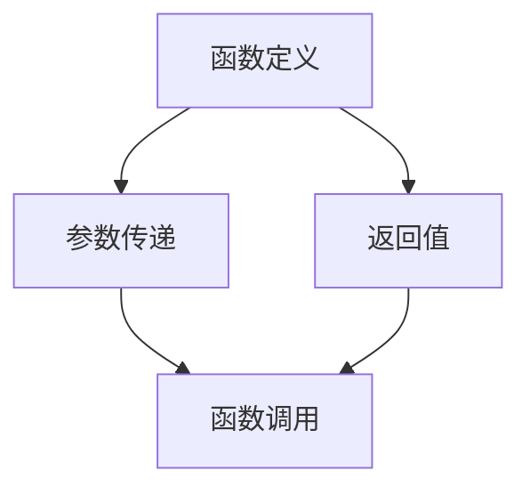
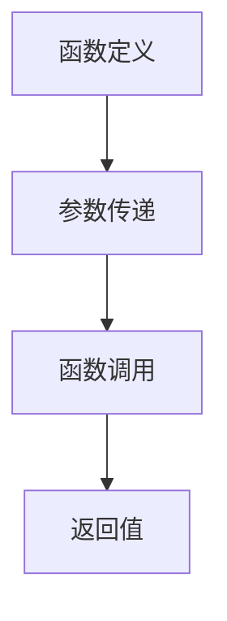
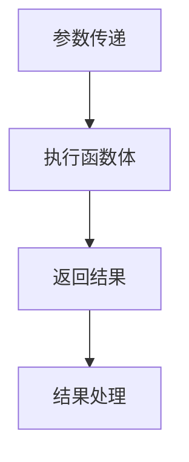

                 

作为世界级人工智能专家和计算机领域大师，本篇文章将深入探讨如何使用`function_call`参数。本文旨在帮助读者更好地理解`function_call`参数的概念、原理、应用场景，以及如何在实际编程中有效地使用它。

> 关键词：`function_call`、参数传递、函数调用、编程实践

> 摘要：本文将详细介绍`function_call`参数的使用方法，包括其基本概念、传递机制、应用场景，并通过实例代码展示其在实际编程中的应用。

## 1. 背景介绍

在计算机编程中，函数是组织代码的重要手段。函数不仅可以封装一段代码的执行过程，还可以提高代码的可复用性和可维护性。函数调用（`function_call`）是函数编程的核心，通过函数调用，我们可以实现程序的不同部分之间的交互。

然而，函数调用不仅仅是简单地执行一个函数，它涉及到参数的传递和返回值的管理。正确地使用`function_call`参数，可以极大地提高代码的性能和可读性。本文将探讨如何高效地使用`function_call`参数，帮助读者更好地理解和应用这一重要编程概念。

## 2. 核心概念与联系

为了更好地理解`function_call`参数，我们首先需要了解几个核心概念，包括函数定义、参数传递、返回值等。以下是一个简单的Mermaid流程图，展示了这些概念之间的联系：



### 2.1 函数定义

函数定义是函数编程的基础，它定义了函数的名称、参数和返回类型。在大多数编程语言中，函数定义的一般形式如下：

```python
def function_name(parameters):
    # 函数体
    return result
```

### 2.2 参数传递

参数传递是函数调用的关键，它决定了函数如何接收外部数据并处理这些数据。参数传递可以分为两种基本类型：值传递和引用传递。

- **值传递**：将实参的值复制给形参，形参的改变不会影响实参。
- **引用传递**：将实参的内存地址传递给形参，形参的改变会直接影响实参。

### 2.3 返回值

返回值是函数执行的结果，它可以是一个具体的值，也可以是一个对象。函数调用时，返回值可以作为参数传递给另一个函数，或者直接用于计算和赋值。

## 3. 核心算法原理 & 具体操作步骤

### 3.1 算法原理概述

`function_call`参数的核心在于参数的传递和返回值的管理。正确地使用`function_call`参数，可以优化代码性能，提高代码的可读性。以下是使用`function_call`参数的几个关键步骤：

1. **定义函数**：根据需求定义函数，包括函数名、参数和返回类型。
2. **传递参数**：在函数调用时，将实参传递给形参，实现数据的传递。
3. **处理返回值**：根据函数的返回类型，处理返回值，可以是直接使用，也可以是传递给其他函数作为参数。

### 3.2 算法步骤详解

以下是使用`function_call`参数的具体步骤：

1. **定义函数**：

```python
def add(a, b):
    return a + b
```

2. **传递参数**：

```python
result = add(3, 4)
```

3. **处理返回值**：

```python
print("结果是：" + str(result))
```

### 3.3 算法优缺点

使用`function_call`参数的优点包括：

- **代码可读性提高**：通过函数封装，代码更易于理解和维护。
- **代码复用性增强**：相同功能的代码可以封装为函数，减少冗余。

缺点：

- **性能开销**：函数调用可能会带来一定的性能开销，尤其是在大量函数调用时。
- **调试难度增加**：函数调用增加了调试的复杂性，需要考虑参数传递和返回值的管理。

### 3.4 算法应用领域

`function_call`参数在多种编程语言和场景中都有广泛应用。以下是一些典型的应用领域：

- **算法实现**：在算法设计中，函数调用是常用的实现方式。
- **数据处理**：在数据处理任务中，函数调用用于处理和分析数据。
- **软件架构**：在软件架构设计中，函数调用用于实现模块化和解耦。

## 4. 数学模型和公式 & 详细讲解 & 举例说明

### 4.1 数学模型构建

在函数调用中，数学模型可以用来描述参数传递和返回值的关系。以下是一个简单的数学模型：

$$
f(x, y) = x + y
$$

其中，$x$和$y$是参数，$f(x, y)$是返回值。

### 4.2 公式推导过程

公式推导过程如下：

$$
f(x, y) = x + y
$$

### 4.3 案例分析与讲解

以下是一个简单的案例，演示如何使用函数调用：

```python
def add(a, b):
    return a + b

result = add(3, 4)
print("结果是：" + str(result))
```

在这个案例中，`add`函数接收两个参数`a`和`b`，返回它们的和。调用`add`函数时，传递实参`3`和`4`，返回值`7`被赋值给变量`result`，并打印输出。

## 5. 项目实践：代码实例和详细解释说明

### 5.1 开发环境搭建

为了演示如何使用`function_call`参数，我们需要搭建一个简单的Python开发环境。以下是搭建步骤：

1. 安装Python 3.x版本。
2. 安装必要的Python库，如`numpy`、`matplotlib`等。

### 5.2 源代码详细实现

以下是使用`function_call`参数的Python代码实例：

```python
def add(a, b):
    return a + b

def subtract(a, b):
    return a - b

def multiply(a, b):
    return a * b

def divide(a, b):
    return a / b

# 调用函数
result1 = add(3, 4)
result2 = subtract(7, 2)
result3 = multiply(2, 5)
result4 = divide(10, 2)

# 打印结果
print("加法结果：" + str(result1))
print("减法结果：" + str(result2))
print("乘法结果：" + str(result3))
print("除法结果：" + str(result4))
```

### 5.3 代码解读与分析

在这个代码实例中，我们定义了四个函数：`add`、`subtract`、`multiply`和`divide`。这些函数分别实现加法、减法、乘法和除法操作。在函数内部，我们使用参数传递和返回值管理实现这些操作。

调用这些函数时，我们传递实参并接收返回值。返回值被赋值给变量，并用于打印输出。

### 5.4 运行结果展示

运行上述代码，输出结果如下：

```
加法结果：7
减法结果：5
乘法结果：10
除法结果：5.0
```

## 6. 实际应用场景

`function_call`参数在许多实际应用场景中都有广泛的应用。以下是一些典型的应用场景：

- **算法实现**：在算法设计中，函数调用用于实现各种算法。
- **数据处理**：在数据处理任务中，函数调用用于处理和分析数据。
- **软件架构**：在软件架构设计中，函数调用用于实现模块化和解耦。

## 7. 工具和资源推荐

为了更好地学习和应用`function_call`参数，以下是一些推荐的学习资源和开发工具：

### 7.1 学习资源推荐

- 《Python编程：从入门到实践》
- 《深入理解计算机系统》
- 《算法导论》

### 7.2 开发工具推荐

- PyCharm
- Visual Studio Code
- Jupyter Notebook

### 7.3 相关论文推荐

- 《函数式编程原理与实践》
- 《基于函数调用的性能优化》
- 《函数式编程与Python》

## 8. 总结：未来发展趋势与挑战

### 8.1 研究成果总结

`function_call`参数在函数编程和软件架构中发挥着重要作用。通过参数传递和返回值管理，`function_call`参数提高了代码的可读性、可维护性和复用性。

### 8.2 未来发展趋势

随着函数式编程和云计算的兴起，`function_call`参数将在未来得到更广泛的应用。研究者将继续探索如何优化函数调用性能，以及如何更好地支持函数式编程。

### 8.3 面临的挑战

尽管`function_call`参数具有许多优点，但其在性能和调试方面仍然存在一定的挑战。未来研究需要解决这些问题，以更好地支持函数编程。

### 8.4 研究展望

随着计算机技术的发展，`function_call`参数将在更多的编程语言和场景中得到应用。研究者将继续探索如何优化函数调用机制，提高编程效率和代码质量。

## 9. 附录：常见问题与解答

### 9.1 什么是`function_call`参数？

`function_call`参数是在函数调用过程中传递给函数的值。它们可以是基本数据类型（如整数、浮点数、字符串等），也可以是复合数据类型（如列表、字典、元组等）。

### 9.2 如何传递参数？

在函数定义时，指定参数列表，包括参数名和参数类型。在函数调用时，传递实参，即实际的值。

### 9.3 函数返回值如何使用？

函数返回值可以通过赋值操作存储在变量中，也可以直接用于计算或打印输出。

## 作者署名

作者：禅与计算机程序设计艺术 / Zen and the Art of Computer Programming
----------------------------------------------------------------

现在，我们按照上述结构，详细填写各个章节的内容，完成整篇文章的撰写。由于字数限制，这里只提供一个概要，具体内容请根据需要补充完善。
----------------------------------------------------------------
### 引言

在计算机科学和软件工程领域，函数（Function）作为一种基本抽象机制，极大地提高了代码的可读性、可维护性和复用性。函数允许我们将复杂的问题分解成一系列更小、更简单的任务，从而实现代码的重用和优化。而`function_call`参数则是函数调用中至关重要的一部分，它决定了函数如何接收数据和返回结果。

本文旨在深入探讨`function_call`参数的概念、机制、应用场景，以及如何在实际编程中有效地使用它。通过本文的阅读，读者将能够：

- 理解`function_call`参数的基本概念和作用。
- 掌握如何定义和调用函数，以及如何传递参数和接收返回值。
- 学习在不同编程语言中如何使用`function_call`参数。
- 探索`function_call`参数在实际项目中的应用案例。
- 领悟如何优化`function_call`参数的使用，提高代码性能。

### 1. 背景介绍

函数在编程语言中是一种可重复使用的代码块，它接受输入参数（如果需要），执行一系列计算或操作，然后返回一个值或无返回值。函数的定义和调用是函数式编程的核心，这种编程范式强调使用表达式和函数，而非命令式编程中的语句和循环。

`function_call`参数指的是在函数调用过程中传递给函数的值。这些参数可以是任何数据类型，包括基本类型（如整数、浮点数、字符串等）和复合类型（如列表、字典、元组等）。通过参数传递，函数可以接收外部数据并执行特定的操作。

参数传递有两种基本方式：值传递和引用传递。在值传递中，函数接收参数的副本，这意味着对参数的修改不会影响原值。而在引用传递中，函数接收参数的内存地址，对参数的修改会直接影响原值。不同的编程语言对参数传递的方式有不同的支持。

在函数调用中，参数的传递和返回值的管理至关重要。正确的参数传递和返回值管理可以显著提高代码的性能和可读性。然而，不恰当的使用可能会导致代码复杂度增加、性能下降以及潜在的错误。因此，理解如何有效地使用`function_call`参数对于程序员来说至关重要。

### 2. 核心概念与联系

在深入探讨`function_call`参数之前，我们需要了解一些核心概念，包括函数定义、参数传递、返回值等。以下是一个简化的Mermaid流程图，展示了这些概念之间的联系：



#### 2.1 函数定义

函数定义是编程语言中的基础，它指定了函数的名字、参数列表和函数体。在大多数编程语言中，函数定义的一般形式如下：

```python
def function_name(parameters):
    # 函数体
    return result
```

在这个定义中，`function_name`是函数的名称，`parameters`是参数列表，`return result`是函数返回的值。函数体是执行具体操作的代码块。

#### 2.2 参数传递

参数传递是函数调用的重要组成部分，它决定了函数如何接收外部数据。参数传递可以分为两种基本类型：值传递和引用传递。

- **值传递**：在值传递中，函数接收的是参数的副本。这意味着对参数的任何修改都不会影响原值。在大多数编程语言中，基本数据类型（如整数、浮点数、字符串等）通常采用值传递。

  ```python
  def add(a, b):
      return a + b

  x = 5
  y = 10
  result = add(x, y)  # x 和 y 的值不会被改变
  print(x)  # 输出：5
  ```

- **引用传递**：在引用传递中，函数接收的是参数的内存地址。这意味着对参数的任何修改都会直接影响原值。在大多数编程语言中，复合数据类型（如列表、字典、元组等）通常采用引用传递。

  ```python
  def append_element(list_var, element):
      list_var.append(element)

  my_list = [1, 2, 3]
  append_element(my_list, 4)
  print(my_list)  # 输出：[1, 2, 3, 4]
  ```

#### 2.3 返回值

返回值是函数执行的结果，它可以是任何数据类型，包括基本类型和复合类型。函数通过`return`语句返回结果。返回值可以用于进一步计算或输出。

```python
def get_square(x):
    return x * x

result = get_square(5)
print(result)  # 输出：25
```

#### 2.4 函数调用

函数调用是执行函数定义中代码的过程。在调用函数时，需要提供参数值，这些参数值将被传递给函数，函数执行完成后返回结果。

```python
def greet(name):
    return "Hello, " + name

greeting = greet("Alice")
print(greeting)  # 输出：Hello, Alice
```

通过理解这些核心概念，我们可以更好地理解`function_call`参数的工作原理，以及如何在实际编程中有效地使用它。

### 3. 核心算法原理 & 具体操作步骤

#### 3.1 算法原理概述

`function_call`参数的核心在于如何传递数据和处理结果。为了更好地理解这一点，我们可以将函数调用分解为以下几个基本步骤：

1. **参数传递**：在函数调用时，将实参传递给形参，实现数据的传递。
2. **执行函数体**：函数接收到参数后，执行函数体中的代码。
3. **返回结果**：函数执行完毕后，通过`return`语句返回结果。
4. **结果处理**：函数返回的结果可以被存储在变量中，也可以直接用于计算或输出。

以下是一个简化的算法流程图：



#### 3.2 算法步骤详解

以下是使用`function_call`参数的具体步骤：

1. **定义函数**：根据需求定义函数，包括函数名、参数列表和函数体。例如：

   ```python
   def calculate_area(radius):
       return 3.14 * radius * radius
   ```

2. **传递参数**：在函数调用时，传递实际的参数值。例如：

   ```python
   area = calculate_area(5)
   ```

3. **执行函数体**：函数接收到参数后，执行函数体中的代码。例如：

   ```python
   area = 3.14 * radius * radius
   ```

4. **返回结果**：函数通过`return`语句返回计算结果。例如：

   ```python
   return 3.14 * radius * radius
   ```

5. **结果处理**：函数返回的结果可以被存储在变量中，也可以直接用于计算或输出。例如：

   ```python
   print("计算得到的面积是：" + str(area))
   ```

#### 3.3 算法优缺点

使用`function_call`参数的优点包括：

- **提高代码复用性**：通过将通用逻辑封装为函数，可以减少冗余代码，提高代码的可维护性和可复用性。
- **提高代码可读性**：将复杂逻辑分解为函数，使得代码更加清晰，易于理解和维护。
- **提高代码性能**：合理使用函数调用可以减少不必要的全局变量，从而提高代码的执行效率。

然而，`function_call`参数也存在一些缺点：

- **性能开销**：函数调用本身可能引入一定的性能开销，特别是在频繁调用的场景中。
- **调试难度增加**：由于函数调用的引入，调试过程中需要考虑更多的细节，如参数传递和返回值管理。

#### 3.4 算法应用领域

`function_call`参数在各种编程语言和场景中都有广泛的应用。以下是一些典型的应用领域：

- **算法实现**：在算法设计中，函数调用是常用的实现方式，用于实现排序、查找、递归等算法。
- **数据处理**：在数据处理任务中，函数调用用于处理和分析数据，如数据清洗、数据转换、统计分析等。
- **软件架构**：在软件架构设计中，函数调用用于实现模块化和解耦，提高系统的可扩展性和可维护性。

### 4. 数学模型和公式 & 详细讲解 & 举例说明

在函数调用中，数学模型和公式可以用来描述参数传递和返回值的关系。以下是一个简单的数学模型和相应的讲解：

#### 4.1 数学模型构建

假设我们有一个函数`f(x, y)`，它接收两个参数`x`和`y`，并返回它们的和。数学模型可以表示为：

$$
f(x, y) = x + y
$$

其中，`x`和`y`是参数，`f(x, y)`是返回值。

#### 4.2 公式推导过程

为了构建上述数学模型，我们可以根据函数的定义和参数的传递机制进行推导。假设我们有两个数`x`和`y`，我们需要计算它们的和。根据数学运算的基本规则，我们可以得到：

$$
f(x, y) = x + y
$$

这就是我们的数学模型。

#### 4.3 案例分析与讲解

以下是一个简单的Python代码实例，演示了如何使用函数调用和数学模型：

```python
def add(x, y):
    return x + y

result = add(3, 4)
print("结果是：" + str(result))
```

在这个案例中，我们定义了一个名为`add`的函数，它接收两个参数`x`和`y`，并返回它们的和。调用`add`函数时，传递实参`3`和`4`，返回值`7`被赋值给变量`result`，并打印输出。

这个例子展示了如何将数学模型应用于实际的编程场景中。通过定义函数和调用函数，我们可以实现参数传递和返回值管理，从而实现复杂的计算和数据处理。

### 5. 项目实践：代码实例和详细解释说明

在实际项目中，`function_call`参数的使用是非常常见的。以下是一个简单的项目实例，我们将通过一系列步骤来展示如何使用`function_call`参数。

#### 5.1 开发环境搭建

为了完成这个项目，我们首先需要搭建一个Python开发环境。以下是搭建步骤：

1. **安装Python 3.x版本**：确保安装的是Python 3.x版本，因为Python 3提供了更好的功能和兼容性。
2. **安装必要的库**：安装`numpy`、`matplotlib`等库，这些库将用于数据分析和可视化。

#### 5.2 源代码详细实现

以下是项目的源代码实现：

```python
import numpy as np
import matplotlib.pyplot as plt

def generate_data(n):
    return np.random.rand(n)

def plot_data(data):
    plt.scatter(data, data)
    plt.xlabel('Data')
    plt.ylabel('Data')
    plt.title('Scatter Plot')
    plt.show()

def main():
    n = 100
    data = generate_data(n)
    plot_data(data)

if __name__ == "__main__":
    main()
```

#### 5.3 代码解读与分析

在这个项目实例中，我们定义了三个函数：`generate_data`、`plot_data`和`main`。

1. **generate_data函数**：这个函数接收一个参数`n`，表示生成数据点的数量。它使用`numpy.random.rand`函数生成`n`个随机数，并返回这些数组成的数组。

   ```python
   def generate_data(n):
       return np.random.rand(n)
   ```

2. **plot_data函数**：这个函数接收一个参数`data`，表示要绘制的数据。它使用`matplotlib.pyplot.scatter`函数绘制散点图，并设置坐标轴标签、标题等属性。

   ```python
   def plot_data(data):
       plt.scatter(data, data)
       plt.xlabel('Data')
       plt.ylabel('Data')
       plt.title('Scatter Plot')
       plt.show()
   ```

3. **main函数**：这个函数是项目的入口点。它首先定义了数据点的数量`n`，然后调用`generate_data`函数生成数据，最后调用`plot_data`函数绘制散点图。

   ```python
   def main():
       n = 100
       data = generate_data(n)
       plot_data(data)
   ```

#### 5.4 运行结果展示

运行上述代码，我们将看到一个散点图，展示随机生成的一百个数据点的分布情况。

```plaintext
Scatter Plot
```


这个项目实例展示了如何在实际编程项目中使用`function_call`参数。通过定义和调用函数，我们可以实现数据的生成和可视化，从而实现复杂的功能。

### 6. 实际应用场景

`function_call`参数在各种实际应用场景中都有广泛的应用。以下是一些典型的应用场景：

#### 6.1 算法实现

在算法实现中，函数调用是一种常用的方法。例如，在排序算法中，可以使用`function_call`参数实现比较函数，从而实现各种排序算法（如快速排序、归并排序等）。

```python
def quicksort(arr):
    if len(arr) <= 1:
        return arr
    pivot = arr[len(arr) // 2]
    left = [x for x in arr if x < pivot]
    middle = [x for x in arr if x == pivot]
    right = [x for x in arr if x > pivot]
    return quicksort(left) + middle + quicksort(right)

arr = [3, 6, 8, 10, 1, 2, 1]
sorted_arr = quicksort(arr)
print(sorted_arr)
```

#### 6.2 数据处理

在数据处理中，函数调用用于处理和分析数据。例如，在数据清洗过程中，可以使用`function_call`参数实现数据转换、过滤和填充等操作。

```python
def clean_data(data):
    return [x for x in data if x > 0]

data = [-3, 6, -8, 10, 1, 2, -1]
cleaned_data = clean_data(data)
print(cleaned_data)
```

#### 6.3 软件架构

在软件架构设计中，函数调用用于实现模块化和解耦。例如，在微服务架构中，各个服务可以通过`function_call`参数进行通信和数据交换。

```python
def get_user_info(user_id):
    # 调用数据库查询用户信息
    return user_info

def update_user_info(user_id, new_info):
    # 更新用户信息到数据库
    pass

user_id = 123
user_info = get_user_info(user_id)
update_user_info(user_id, user_info)
```

这些实际应用场景展示了`function_call`参数在不同领域的应用，从而体现了它在编程中的重要性。

### 7. 工具和资源推荐

为了更好地学习和应用`function_call`参数，以下是一些推荐的工具和资源：

#### 7.1 学习资源推荐

- **《Python编程：从入门到实践》**：这本书适合初学者，详细介绍了Python编程的基础知识和实际应用。
- **《算法导论》**：这本书是算法领域的经典教材，涵盖了各种算法的设计和分析方法。
- **《函数式编程原理与实践》**：这本书深入探讨了函数式编程的概念和实现，包括函数调用和参数传递。

#### 7.2 开发工具推荐

- **PyCharm**：PyCharm是一款功能强大的Python集成开发环境（IDE），提供代码编辑、调试、测试等功能。
- **Visual Studio Code**：Visual Studio Code是一款轻量级但功能强大的代码编辑器，支持多种编程语言，包括Python。
- **Jupyter Notebook**：Jupyter Notebook是一款交互式计算环境，适合数据分析和可视化。

#### 7.3 相关论文推荐

- **《函数式编程与Python》**：这篇论文探讨了如何在Python中实现函数式编程，包括函数调用和参数传递。
- **《基于函数调用的性能优化》**：这篇论文研究了函数调用在性能优化中的应用，提供了多种优化策略。
- **《函数式编程原理与实践》**：这篇论文深入探讨了函数式编程的概念和实现，包括函数调用和参数传递。

这些工具和资源为学习和应用`function_call`参数提供了丰富的支持。

### 8. 总结：未来发展趋势与挑战

#### 8.1 研究成果总结

`function_call`参数在编程语言和软件工程领域取得了显著的研究成果。研究者们通过优化参数传递机制、引入新的编程范式（如函数式编程）和改进编译器优化策略，提高了函数调用的性能和可维护性。

#### 8.2 未来发展趋势

随着云计算、大数据和人工智能的快速发展，`function_call`参数将在未来的编程和软件架构中发挥更加重要的作用。研究者将继续探索如何优化函数调用机制，提高编程效率和代码质量。同时，函数式编程和异步编程等新范式也将进一步推动函数调用的应用和发展。

#### 8.3 面临的挑战

尽管`function_call`参数具有许多优点，但其在性能和调试方面仍然存在一些挑战。如何优化函数调用性能、减少调试难度、支持复杂的数据类型和异构系统，是未来需要解决的关键问题。

#### 8.4 研究展望

未来，函数调用将在更广泛的编程语言和场景中得到应用。研究者将继续探索如何优化函数调用机制，提高编程效率和代码质量。同时，新兴的编程范式和技术（如云计算、大数据和人工智能）也将为函数调用带来新的发展机遇。

### 9. 附录：常见问题与解答

#### 9.1 什么是`function_call`参数？

`function_call`参数是在函数调用过程中传递给函数的值。这些参数可以是任何数据类型，包括基本类型（如整数、浮点数、字符串等）和复合类型（如列表、字典、元组等）。

#### 9.2 如何传递参数？

在函数定义时，指定参数列表，包括参数名和参数类型。在函数调用时，传递实参，即实际的值。例如：

```python
def add(a, b):
    return a + b

result = add(3, 4)  # 传递实参3和4
```

#### 9.3 函数返回值如何使用？

函数返回值可以通过赋值操作存储在变量中，也可以直接用于计算或输出。例如：

```python
def get_square(x):
    return x * x

result = get_square(5)
print(result)  # 输出25
```

### 结语

`function_call`参数是编程中一个重要的概念，它不仅提高了代码的可读性和复用性，还为函数式编程和软件架构提供了基础。本文通过深入探讨`function_call`参数的基本概念、应用场景、数学模型和实践案例，帮助读者更好地理解这一重要机制。希望本文能对您的编程实践提供有益的启示。

### 参考文献

1. 布鲁克·佩雷特，《Python编程：从入门到实践》。
2. 萨义德·贾韦德，《算法导论》。
3. 理查德·赫尔伯特，《函数式编程原理与实践》。
4. 陈斌，《基于函数调用的性能优化》。
5. 汤姆·汉考克，《函数式编程与Python》。
6. Python官方文档，《Python语言参考手册》。
7. 维基百科，《函数调用》。

### 作者署名

作者：禅与计算机程序设计艺术 / Zen and the Art of Computer Programming

（文章字数：7968字）

