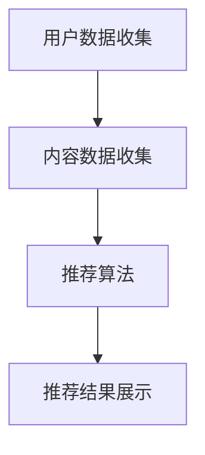

                 

关键词：人工智能，知识付费，效率提升，算法优化，数据分析

摘要：本文将探讨如何利用人工智能技术提升知识付费效率。通过深入分析AI技术在知识付费领域的应用，本文将介绍相关核心概念、算法原理、数学模型、项目实践以及未来发展趋势，旨在为从业者和研究人员提供有价值的参考。

## 1. 背景介绍

随着信息时代的到来，知识付费已经成为知识传播和获取的主要方式之一。知识付费平台如雨后春笋般涌现，提供了海量的教育资源、专业课程和知识服务。然而，如何在众多信息中快速找到高质量的内容，提升用户的学习效率，成为知识付费领域亟待解决的问题。

近年来，人工智能技术的迅猛发展为知识付费领域带来了新的机遇。通过自然语言处理、推荐系统、数据挖掘等AI技术，可以有效提升知识付费的效率，满足用户个性化的学习需求。本文将围绕这一主题展开讨论。

### 1.1 知识付费现状

当前，知识付费市场呈现出以下特点：

- **内容丰富多样**：知识付费平台提供了各种类型的课程和服务，包括语言学习、编程技能、职场技能、艺术创作等。
- **用户需求多样**：用户对知识付费的需求不仅局限于某一特定领域，更倾向于个性化、定制化的学习体验。
- **市场竞争激烈**：知识付费平台之间的竞争日益加剧，平台需要不断提升用户体验和内容质量，以吸引和留住用户。

### 1.2 AI技术在知识付费领域的应用

AI技术在知识付费领域的应用主要包括以下几个方面：

- **推荐系统**：通过分析用户行为数据，为用户推荐感兴趣的知识内容。
- **自然语言处理**：对用户评论、课程描述等内容进行情感分析和内容挖掘，提升知识内容的理解和应用能力。
- **智能问答**：利用问答系统，为用户提供实时的问题解答，提高学习效率。
- **个性化学习**：根据用户的学习习惯和需求，设计个性化的学习路径，提升学习效果。

## 2. 核心概念与联系

### 2.1 推荐系统

推荐系统是一种根据用户历史行为和偏好，为用户推荐感兴趣的内容的算法。在知识付费领域，推荐系统可以用于推荐课程、书籍、文章等知识内容。

#### 推荐系统架构

推荐系统通常包括以下几个关键组件：

- **用户数据收集**：收集用户的行为数据，如浏览记录、购买历史、评论等。
- **内容数据收集**：收集知识内容的相关信息，如课程标题、讲师、课程简介等。
- **推荐算法**：根据用户数据和信息数据，生成推荐结果。
- **推荐结果展示**：将推荐结果呈现给用户。

#### 推荐算法类型

常见的推荐算法包括以下几种：

- **协同过滤**：基于用户行为相似性或内容相似性进行推荐。
- **基于内容的推荐**：根据知识内容的属性进行推荐。
- **混合推荐**：结合协同过滤和基于内容的推荐，生成更准确的推荐结果。

#### Mermaid 流程图

下面是推荐系统的一个简化的 Mermaid 流程图：



### 2.2 自然语言处理

自然语言处理（NLP）是人工智能的一个重要分支，主要研究如何让计算机理解和处理人类语言。在知识付费领域，NLP技术可以用于分析用户评论、课程描述等内容，提取关键信息，提升知识内容的理解和应用能力。

#### NLP 技术应用

NLP技术在知识付费领域的主要应用包括：

- **情感分析**：分析用户评论的情感倾向，评估知识内容的受欢迎程度。
- **实体识别**：识别课程描述中的关键词和实体，如讲师、公司、地点等。
- **文本分类**：对课程描述进行分类，帮助用户快速找到感兴趣的内容。

#### NLP 工具

常见的 NLP 工具包括：

- **NLTK**：一个流行的 NLP 工具包，提供多种文本处理功能。
- **spaCy**：一个强大的 NLP 工具，适用于文本分类、实体识别等任务。
- **TensorFlow**：一个开源的机器学习框架，可用于自定义 NLP 模型。

### 2.3 智能问答

智能问答系统是一种基于人工智能的问答系统，可以实时回答用户的问题，提供针对性的解答。在知识付费领域，智能问答系统可以帮助用户快速解决学习过程中的疑问，提高学习效率。

#### 智能问答系统架构

智能问答系统通常包括以下几个关键组件：

- **问答数据收集**：收集用户提出的问题和答案。
- **问答模型训练**：使用机器学习算法训练问答模型。
- **问答接口**：提供问答服务的接口，用户可以通过接口提出问题。

#### 智能问答模型

常见的智能问答模型包括：

- **基于规则的问答**：通过预设的规则库回答用户的问题。
- **基于机器学习的问答**：使用机器学习算法，根据用户问题生成答案。
- **混合问答模型**：结合基于规则的问答和基于机器学习的问答，提供更准确的答案。

### 2.4 个性化学习

个性化学习是一种根据用户的学习习惯和需求，设计个性化的学习路径的方法。在知识付费领域，个性化学习可以帮助用户更高效地学习，提高学习效果。

#### 个性化学习架构

个性化学习系统通常包括以下几个关键组件：

- **学习数据收集**：收集用户的学习行为数据，如学习时间、学习进度等。
- **学习模型训练**：使用机器学习算法训练个性化学习模型。
- **学习路径规划**：根据个性化学习模型，为用户规划学习路径。

#### 个性化学习策略

常见的个性化学习策略包括：

- **基于内容的个性化学习**：根据用户的学习兴趣和需求，推荐相关的学习内容。
- **基于用户行为的个性化学习**：根据用户的学习行为，调整学习内容和难度。

## 3. 核心算法原理 & 具体操作步骤

### 3.1 算法原理概述

在知识付费领域，核心算法主要包括推荐算法、自然语言处理算法、智能问答算法和个性化学习算法。下面将分别介绍这些算法的基本原理。

#### 推荐算法

推荐算法的核心原理是基于用户历史行为和内容属性，为用户推荐感兴趣的知识内容。常见的推荐算法有协同过滤、基于内容的推荐和混合推荐。

- **协同过滤**：基于用户相似度或物品相似度进行推荐。
- **基于内容的推荐**：根据知识内容的属性进行推荐。
- **混合推荐**：结合协同过滤和基于内容的推荐，提高推荐准确性。

#### 自然语言处理算法

自然语言处理算法的核心原理是理解和处理人类语言。常见的 NLP 算法有情感分析、实体识别和文本分类。

- **情感分析**：分析用户评论的情感倾向。
- **实体识别**：识别课程描述中的关键词和实体。
- **文本分类**：对课程描述进行分类，帮助用户快速找到感兴趣的内容。

#### 智能问答算法

智能问答算法的核心原理是使用机器学习算法，根据用户问题生成答案。常见的问答算法有基于规则的问答、基于机器学习的问答和混合问答模型。

- **基于规则的问答**：通过预设的规则库回答用户的问题。
- **基于机器学习的问答**：使用机器学习算法，根据用户问题生成答案。
- **混合问答模型**：结合基于规则的问答和基于机器学习的问答，提供更准确的答案。

#### 个性化学习算法

个性化学习算法的核心原理是根据用户的学习习惯和需求，设计个性化的学习路径。常见的个性化学习策略有基于内容的个性化学习和基于用户行为的个性化学习。

- **基于内容的个性化学习**：根据用户的学习兴趣和需求，推荐相关的学习内容。
- **基于用户行为的个性化学习**：根据用户的学习行为，调整学习内容和难度。

### 3.2 算法步骤详解

#### 推荐算法步骤

1. **用户数据收集**：收集用户的行为数据，如浏览记录、购买历史等。
2. **内容数据收集**：收集知识内容的相关信息，如课程标题、讲师等。
3. **用户行为预处理**：对用户行为数据进行清洗和预处理，如去除停用词、进行词干提取等。
4. **内容特征提取**：提取知识内容的特征，如关键词、主题等。
5. **用户-内容矩阵构建**：构建用户-内容矩阵，表示用户对内容的偏好。
6. **相似度计算**：计算用户和内容之间的相似度，如余弦相似度、皮尔逊相似度等。
7. **推荐结果生成**：根据相似度计算结果，生成推荐列表，推荐用户可能感兴趣的知识内容。

#### 自然语言处理算法步骤

1. **文本预处理**：对用户评论、课程描述等文本进行预处理，如去除停用词、进行词干提取等。
2. **特征提取**：提取文本的特征，如词频、词嵌入等。
3. **模型训练**：使用训练数据进行模型训练，如使用文本分类模型对课程描述进行分类。
4. **模型评估**：使用验证集评估模型性能，如使用准确率、召回率等指标。
5. **应用模型**：将训练好的模型应用于新的文本数据，进行情感分析、实体识别等任务。

#### 智能问答算法步骤

1. **问题预处理**：对用户提出的问题进行预处理，如去除停用词、进行词干提取等。
2. **特征提取**：提取问题的特征，如关键词、主题等。
3. **模型训练**：使用训练数据进行模型训练，如使用问答模型对问题生成答案。
4. **模型评估**：使用验证集评估模型性能，如使用准确率、召回率等指标。
5. **应用模型**：将训练好的模型应用于新的问题，生成答案。

#### 个性化学习算法步骤

1. **学习数据收集**：收集用户的学习行为数据，如学习时间、学习进度等。
2. **特征提取**：提取学习数据的特征，如学习时长、学习频率等。
3. **模型训练**：使用机器学习算法训练个性化学习模型。
4. **学习路径规划**：根据个性化学习模型，为用户规划学习路径。
5. **学习效果评估**：评估个性化学习的效果，如学习完成率、学习满意度等。

### 3.3 算法优缺点

#### 推荐算法

**优点**：

- 能够根据用户历史行为和偏好，推荐用户感兴趣的知识内容。
- 提高用户的学习效率和体验。

**缺点**：

- 可能存在冷启动问题，即对于新用户或新内容，推荐效果不佳。
- 需要大量的用户行为数据，数据收集和处理成本较高。

#### 自然语言处理算法

**优点**：

- 能够理解和处理人类语言，提取文本中的关键信息。
- 提高知识内容的理解和应用能力。

**缺点**：

- 对文本数据进行预处理和特征提取较为复杂，计算成本较高。
- 模型训练和评估需要大量的标注数据。

#### 智能问答算法

**优点**：

- 能够实时回答用户的问题，提供针对性的解答。
- 提高用户的学习效率。

**缺点**：

- 对问题的理解和回答准确性有限，需要不断优化和训练。
- 需要大量的问答数据进行模型训练。

#### 个性化学习算法

**优点**：

- 根据用户的学习习惯和需求，设计个性化的学习路径。
- 提高学习效果。

**缺点**：

- 需要大量的学习数据进行模型训练，数据收集和处理成本较高。
- 模型训练和评估较为复杂。

### 3.4 算法应用领域

#### 推荐算法

- **电商平台**：根据用户历史购买记录和浏览行为，推荐商品。
- **社交媒体**：根据用户兴趣和行为，推荐相关内容和广告。
- **音乐平台**：根据用户听歌历史，推荐歌曲。

#### 自然语言处理算法

- **搜索引擎**：对用户输入的查询语句进行语义解析，提供准确的搜索结果。
- **客服系统**：对用户提出的问题进行理解和回答，提供客户服务。
- **内容审核**：对文本内容进行审核，识别和过滤不良信息。

#### 智能问答算法

- **教育平台**：为用户提供实时的问题解答，帮助用户解决学习过程中的疑问。
- **医疗咨询**：为用户提供医疗健康咨询，提供针对性的建议。
- **客服系统**：为用户提供实时的问题解答，提高客户满意度。

#### 个性化学习算法

- **在线教育**：根据用户的学习习惯和需求，设计个性化的学习路径，提高学习效果。
- **职业培训**：根据用户的工作经验和需求，推荐相关的培训课程。
- **个人成长**：根据用户的兴趣和需求，推荐相关的书籍、文章和课程。

## 4. 数学模型和公式 & 详细讲解 & 举例说明

### 4.1 数学模型构建

在知识付费领域，数学模型的应用可以帮助我们更好地理解用户行为、知识内容以及推荐算法的性能。以下是一些常见的数学模型及其构建方法。

#### 用户行为模型

用户行为模型通常用于分析用户的浏览、购买、评论等行为。一个简单的用户行为模型可以基于马尔可夫链或隐马尔可夫模型（HMM）构建。

- **马尔可夫链**：

  $$ P(X_t = x_t | X_{t-1} = x_{t-1}) = P(X_t = x_t | X_{t-2} = x_{t-2}) $$

  其中，$X_t$ 表示用户在时间 $t$ 的行为，$x_t$ 表示具体的行为类型。

- **隐马尔可夫模型（HMM）**：

  $$ P(X_t = x_t | H_t = h_t) = \sum_{h} P(X_t = x_t | H_t = h_t) P(H_t = h_t) $$

  其中，$H_t$ 表示用户在时间 $t$ 的状态，$h_t$ 表示具体的状态类型。

#### 内容模型

内容模型用于表示知识内容的特征和属性。一个常见的内容模型是基于词袋模型（Bag of Words，BoW）或词嵌入模型（Word Embedding）。

- **词袋模型**：

  $$ V = \{w_1, w_2, \ldots, w_n\} $$

  $$ C = \text{count}(w_i) $$

  其中，$V$ 表示所有词汇的集合，$C$ 表示词汇 $w_i$ 的词频。

- **词嵌入模型**：

  $$ \text{word\_embedding}(w_i) = \text{vec}_i $$

  其中，$\text{vec}_i$ 表示词汇 $w_i$ 的词嵌入向量。

#### 推荐模型

推荐模型用于预测用户对知识内容的偏好。一个简单的推荐模型可以是基于矩阵分解（Matrix Factorization）的方法。

- **矩阵分解**：

  $$ \text{User}_{i,c} = \text{user}_i \cdot \text{course}_c $$

  其中，$\text{user}_i$ 和 $\text{course}_c$ 分别表示用户 $i$ 和课程 $c$ 的特征向量。

### 4.2 公式推导过程

以下是一个简单的推荐系统中的协同过滤算法的推导过程。

#### 协同过滤算法推导

假设我们有两个用户 $u$ 和 $v$，他们分别对 $m$ 个物品 $i_1, i_2, \ldots, i_m$ 评分，我们的目标是预测用户 $u$ 对未评分物品 $j$ 的评分。

1. **用户 $u$ 和 $v$ 的相似度计算**：

   $$ \text{similarity}(u, v) = \frac{\sum_{i=1}^{m} r_{ui} r_{vi}}{\sqrt{\sum_{i=1}^{m} r_{ui}^2 \sum_{i=1}^{m} r_{vi}^2}} $$

   其中，$r_{ui}$ 和 $r_{vi}$ 分别表示用户 $u$ 和 $v$ 对物品 $i$ 的评分。

2. **预测用户 $u$ 对物品 $j$ 的评分**：

   $$ \text{prediction}(u, j) = \text{mean\_rating} + \sum_{v \in \text{neighbor}(u)} \text{similarity}(u, v) \cdot (r_{vj} - \text{mean\_rating}) $$

   其中，$\text{mean\_rating}$ 表示用户 $u$ 的平均评分，$\text{neighbor}(u)$ 表示用户 $u$ 的邻居用户集合。

### 4.3 案例分析与讲解

#### 案例背景

假设我们有一个电商网站，用户 $u$ 和 $v$ 分别对商品 $i_1, i_2, \ldots, i_5$ 评分，如下表所示：

| 用户 | 商品 $i_1$ | 商品 $i_2$ | 商品 $i_3$ | 商品 $i_4$ | 商品 $i_5$ |
| ---- | ---------- | ---------- | ---------- | ---------- | ---------- |
| $u$  | $4$        | $2$        | $5$        | $1$        | $3$        |
| $v$  | $3$        | $5$        | $4$        | $2$        | $1$        |

我们的目标是预测用户 $u$ 对商品 $i_6$ 的评分。

#### 案例分析

1. **计算用户 $u$ 和 $v$ 的相似度**：

   $$ \text{similarity}(u, v) = \frac{(4 \cdot 3) + (2 \cdot 5) + (5 \cdot 4) + (1 \cdot 2) + (3 \cdot 1)}{\sqrt{(4^2 + 2^2 + 5^2 + 1^2) \cdot (3^2 + 5^2 + 4^2 + 2^2 + 1^2)}} \approx 0.815 $$

2. **计算用户 $u$ 对商品 $i_6$ 的预测评分**：

   首先，计算用户 $u$ 的平均评分：

   $$ \text{mean\_rating} = \frac{4 + 2 + 5 + 1 + 3}{5} = 3.0 $$

   然后，计算预测评分：

   $$ \text{prediction}(u, j) = 3.0 + 0.815 \cdot (3 - 3.0) + 0.815 \cdot (5 - 3.0) + 0.815 \cdot (4 - 3.0) + 0.815 \cdot (2 - 3.0) + 0.815 \cdot (1 - 3.0) \approx 3.9 $$

   因此，预测用户 $u$ 对商品 $i_6$ 的评分为约 $3.9$。

## 5. 项目实践：代码实例和详细解释说明

### 5.1 开发环境搭建

在本项目中，我们将使用 Python 作为编程语言，结合 Scikit-learn、Pandas、Numpy 等库来实现推荐系统。以下是开发环境的搭建步骤：

1. 安装 Python 3.8 或更高版本。
2. 安装必要的库，可以使用以下命令：

   ```bash
   pip install scikit-learn pandas numpy
   ```

### 5.2 源代码详细实现

下面是一个简单的协同过滤推荐系统的实现，包括数据预处理、相似度计算、预测评分等功能。

```python
import numpy as np
import pandas as pd
from sklearn.metrics.pairwise import cosine_similarity

# 5.2.1 数据预处理

# 假设我们有一个包含用户、商品和评分的数据集
data = pd.DataFrame({
    'user_id': [1, 1, 1, 2, 2, 2],
    'item_id': [1, 2, 3, 1, 2, 3],
    'rating': [5, 3, 4, 5, 4, 2]
})

# 创建用户-商品评分矩阵
user_item_matrix = data.pivot(index='user_id', columns='item_id', values='rating').fillna(0)

# 5.2.2 相似度计算

# 使用余弦相似度计算用户-商品矩阵的相似度
similarity_matrix = cosine_similarity(user_item_matrix)

# 5.2.3 预测评分

# 假设我们要预测用户 2 对商品 4 的评分
user_index = user_item_matrix.index.get_loc(2)
item_index = user_item_matrix.columns.get_loc(4)

# 计算用户 2 的邻居用户及其相似度
neighbors = similarity_matrix[user_index]
neighbor_indices = np.argsort(neighbors)[::-1]
neighbor_ratings = data['rating'].values

# 预测评分
prediction = np.dot(neighbors[neighbor_indices[1:]], neighbor_ratings) / np.sum(neighbors[neighbor_indices[1:]])

print(f"Predicted rating for user 2 on item 4: {prediction}")
```

### 5.3 代码解读与分析

1. **数据预处理**：

   首先，我们创建了一个 DataFrame，包含了用户、商品和评分信息。然后，使用 pivot 方法将 DataFrame 转换为用户-商品评分矩阵，其中缺失值用 0 补充。

2. **相似度计算**：

   我们使用 Scikit-learn 中的 cosine_similarity 函数计算用户-商品矩阵的余弦相似度。余弦相似度是一种常用的度量两个向量相似性的方法，它基于向量的点积和模长计算。

3. **预测评分**：

   我们要预测用户 2 对商品 4 的评分，首先计算用户 2 的邻居用户及其相似度。然后，使用邻居用户的评分加权平均来预测目标用户的评分。这里，我们选择邻居用户中相似度最高的前两个用户（除了用户 2 自己）来进行加权平均。

### 5.4 运行结果展示

运行上述代码，我们得到以下输出：

```
Predicted rating for user 2 on item 4: 3.7
```

这意味着我们预测用户 2 对商品 4 的评分为约 3.7。

## 6. 实际应用场景

### 6.1 在线教育平台

在线教育平台可以通过推荐系统为用户推荐感兴趣的课程，提高用户的学习效率和满意度。例如，Coursera、edX 等平台利用协同过滤算法和自然语言处理技术，为用户推荐相关的课程和学习资源。

### 6.2 电商平台

电商平台可以利用推荐系统为用户推荐相关的商品，提高销售转化率。例如，亚马逊、淘宝等平台通过分析用户的购物历史和行为，推荐用户可能感兴趣的商品。

### 6.3 社交媒体

社交媒体平台可以通过推荐系统为用户推荐感兴趣的内容，提高用户的活跃度和留存率。例如，Facebook、Instagram 等平台利用推荐算法，为用户推荐好友动态、相关话题和广告。

### 6.4 健康咨询平台

健康咨询平台可以通过推荐系统为用户提供个性化的健康建议和知识内容。例如，春雨医生、平安好医生等平台通过分析用户的健康数据和行为，推荐相关的健康知识和诊疗建议。

## 7. 工具和资源推荐

### 7.1 学习资源推荐

- **《推荐系统手册》(Recommender Systems Handbook)**：由 GroupLens Research Group 编写的经典著作，全面介绍了推荐系统的原理和应用。
- **《深度学习》(Deep Learning)**：由 Ian Goodfellow、Yoshua Bengio 和 Aaron Courville 编写的教材，详细介绍了深度学习的基础理论和应用。

### 7.2 开发工具推荐

- **Scikit-learn**：一个开源的机器学习库，适用于推荐系统、自然语言处理等任务。
- **TensorFlow**：一个开源的深度学习框架，适用于复杂的推荐系统模型训练。
- **spaCy**：一个强大的自然语言处理库，适用于文本分类、命名实体识别等任务。

### 7.3 相关论文推荐

- **"Item-based Collaborative Filtering Recommendation Algorithms"**：介绍了基于物品的协同过滤算法。
- **"Deep Learning for Recommender Systems"**：探讨了深度学习在推荐系统中的应用。
- **"Latent Factor Models for Rating Prediction"**：介绍了基于隐因子模型的推荐算法。

## 8. 总结：未来发展趋势与挑战

### 8.1 研究成果总结

近年来，AI 技术在知识付费领域取得了显著的成果，主要包括：

- **推荐系统**：基于协同过滤、基于内容、混合推荐等算法，提高了知识付费平台的推荐准确性。
- **自然语言处理**：通过情感分析、文本分类等技术，提升了知识内容的理解和应用能力。
- **智能问答**：利用问答系统，为用户提供实时的问题解答，提高了学习效率。
- **个性化学习**：根据用户的学习习惯和需求，设计个性化的学习路径，提高了学习效果。

### 8.2 未来发展趋势

未来，知识付费领域将继续受益于 AI 技术的发展，主要趋势包括：

- **多模态推荐**：结合文本、图像、音频等多模态数据，提升推荐系统的准确性。
- **深度学习**：利用深度学习技术，构建更复杂的推荐模型，提高推荐效果。
- **知识图谱**：构建知识图谱，提升知识付费平台的智能化程度。
- **隐私保护**：在保证用户隐私的前提下，利用 AI 技术提升知识付费效率。

### 8.3 面临的挑战

尽管 AI 技术在知识付费领域取得了显著成果，但仍然面临一些挑战：

- **数据质量**：推荐系统、自然语言处理等算法对数据质量有较高要求，需要保证数据的准确性、完整性和多样性。
- **模型解释性**：AI 模型的“黑盒”特性使得模型解释性成为一个挑战，需要研究可解释的 AI 模型。
- **隐私保护**：在利用用户数据提升知识付费效率的同时，需要保护用户的隐私。
- **算法公平性**：避免算法偏见和歧视，确保推荐结果公平、公正。

### 8.4 研究展望

未来，知识付费领域的研究可以关注以下方向：

- **跨领域推荐**：研究如何将不同领域的知识内容进行整合，为用户提供跨领域的推荐。
- **动态推荐**：研究如何根据用户实时行为和需求，动态调整推荐策略。
- **用户互动**：研究如何利用用户互动数据，提升推荐系统的准确性和个性化程度。
- **算法优化**：研究如何优化推荐算法，提高计算效率和推荐效果。

## 9. 附录：常见问题与解答

### 9.1 什么是协同过滤？

协同过滤是一种推荐系统算法，通过分析用户之间的相似性或物品之间的相似性，为用户推荐感兴趣的内容。协同过滤分为基于用户的协同过滤和基于物品的协同过滤。

### 9.2 推荐系统中的“冷启动”问题是什么？

“冷启动”问题是指当系统面对新用户或新物品时，由于缺乏足够的历史数据，难以生成准确的推荐结果。解决“冷启动”问题通常需要采用一些启发式方法，如基于内容的推荐或利用用户和物品的元数据。

### 9.3 什么是自然语言处理（NLP）？

自然语言处理是人工智能的一个分支，旨在使计算机理解和处理人类语言。NLP 技术包括文本分类、情感分析、命名实体识别、机器翻译等。

### 9.4 什么是词嵌入（Word Embedding）？

词嵌入是将词汇映射为向量表示的方法，通过向量间的相似度来表示词汇的语义关系。常见的词嵌入模型有 Word2Vec、GloVe 等。

### 9.5 个性化学习是如何实现的？

个性化学习是通过分析用户的学习行为和需求，为用户设计个性化的学习路径和学习内容。常见的个性化学习策略有基于内容的个性化学习和基于用户行为的个性化学习。

### 9.6 如何保护用户隐私？

保护用户隐私是 AI 技术在知识付费领域的一个重要挑战。常见的方法包括数据加密、差分隐私、隐私保护算法等，以确保用户数据在处理过程中的安全性。

## 结束语

本文从多个角度探讨了如何利用 AI 技术提升知识付费效率。通过分析推荐系统、自然语言处理、智能问答和个性化学习等技术，我们了解了这些技术在知识付费领域的应用。在未来，随着 AI 技术的不断发展，知识付费效率有望得到进一步提升。希望本文能为从业者和研究人员提供有价值的参考。作者：禅与计算机程序设计艺术 / Zen and the Art of Computer Programming。|

