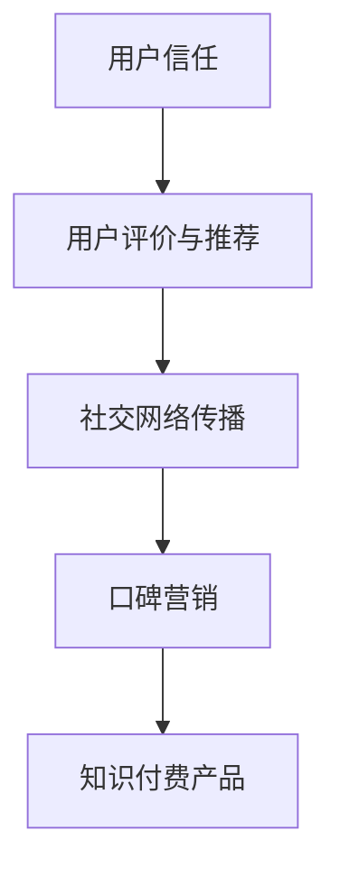

                 

### 1. 背景介绍

知识付费产品，是指用户为获取特定领域的知识、技能或信息，而愿意付费购买的产品或服务。随着互联网的发展，在线教育、专业课程、电子书、培训服务等形式的知识付费产品逐渐成为市场热点。然而，在竞争激烈的市场环境中，如何有效推广这些知识付费产品，吸引并留住用户，成为许多企业关注的焦点。

口碑营销是一种基于用户评价和推荐的自然传播方式，通过用户之间的口碑传播，形成对产品的信任和认可，从而提高产品的知名度和销量。口碑营销相较于传统的广告推广，具有成本低、可信度高的优势，尤其在知识付费领域，用户的决策往往受到其他用户评价的影响。因此，如何利用口碑营销来推广知识付费产品，成为本文探讨的重点。

本文将从以下几个方面进行讨论：

- **口碑营销的基本原理**：介绍口碑营销的概念、特点及其在知识付费领域的应用。
- **构建口碑营销策略**：分析如何构建有效的口碑营销策略，包括产品定位、内容策划、用户互动等。
- **执行与监测**：探讨如何执行口碑营销计划，以及如何监测和评估其效果。
- **口碑营销的挑战与对策**：分析口碑营销过程中可能遇到的挑战，并提出相应的对策。
- **案例研究**：通过具体案例，展示如何利用口碑营销成功推广知识付费产品。

### 2. 核心概念与联系

为了更好地理解口碑营销在知识付费产品推广中的应用，我们需要明确几个核心概念，并构建其相互关系。

#### 2.1 口碑营销概念

口碑营销（Word of Mouth Marketing，WOMM）是一种基于用户口碑和推荐进行市场推广的方式。其核心是通过用户之间的交流，自然传播产品信息，增强用户对产品的信任和满意度。口碑营销的关键在于激发用户的正面评价和推荐，使其成为产品的“传播者”。

#### 2.2 用户信任

在知识付费领域，用户的决策往往基于信任。用户对产品的信任程度直接影响其购买意愿。信任的建立需要通过提供高质量的内容、优质的客户服务和真实的用户评价来实现。信任是口碑营销的基础。

#### 2.3 用户评价与推荐

用户评价和推荐是口碑营销的核心要素。用户评价可以反映产品或服务的质量，而推荐则可以影响其他潜在用户的决策。有效的口碑营销策略需要关注如何激发用户进行正面评价和推荐。

#### 2.4 社交网络

社交网络是口碑传播的重要渠道。用户在社交平台上分享使用体验、发表评论和推荐，可以迅速扩大产品的影响力。社交网络为口碑营销提供了广泛而高效的传播平台。

#### 2.5 口碑营销与知识付费产品的关系

口碑营销在知识付费产品推广中具有重要意义。知识付费产品的核心价值在于其内容和服务质量，而口碑营销可以通过用户之间的交流和评价，提高产品的可信度和吸引力。有效的口碑营销策略可以帮助知识付费产品在竞争激烈的市场中脱颖而出。

下面是关于口碑营销与知识付费产品关系的Mermaid流程图：



### 3. 核心算法原理 & 具体操作步骤

#### 3.1 算法原理概述

口碑营销的核心在于利用用户口碑和推荐来推广知识付费产品。以下是口碑营销的核心算法原理：

1. **用户反馈收集**：通过用户调查、评论收集等方式，获取用户对产品的评价和反馈。
2. **用户筛选**：筛选出评价高的用户，这些用户将成为口碑传播的潜在种子。
3. **推荐策略**：设计推荐机制，将评价高的用户推荐给潜在用户，增加潜在用户的信任度。
4. **社交网络传播**：利用社交网络平台，将用户评价和推荐信息进行传播，扩大口碑效应。
5. **效果监测**：通过用户行为数据分析，监测口碑营销的效果，优化营销策略。

#### 3.2 算法步骤详解

1. **用户反馈收集**

   - **评论收集**：在产品平台上设置用户评论功能，鼓励用户对产品进行评价。
   - **问卷调查**：定期进行用户满意度调查，获取用户的详细反馈。
   - **数据分析**：对收集到的用户反馈进行数据分析，识别用户的痛点和建议。

2. **用户筛选**

   - **评分筛选**：根据用户评分，筛选出评价较高的用户。
   - **活跃度筛选**：考虑用户的活跃度，筛选出活跃度高的用户，这些用户更有可能进行口碑传播。
   - **推荐系统**：利用推荐算法，筛选出潜在的口碑传播者。

3. **推荐策略**

   - **个性化推荐**：根据用户的兴趣和偏好，推荐符合其需求的知识付费产品。
   - **社交推荐**：基于用户社交网络，推荐评价高且社交关系紧密的用户使用产品。
   - **内容推荐**：推荐与用户评价内容相关的知识付费产品，增加用户的信任度。

4. **社交网络传播**

   - **内容策划**：设计吸引人的口碑传播内容，包括用户评价、推荐理由等。
   - **平台选择**：选择合适的社交网络平台，如微博、微信、知乎等，进行内容传播。
   - **互动引导**：鼓励用户在社交平台上分享使用体验，增加口碑传播的广度和深度。

5. **效果监测**

   - **用户行为分析**：通过用户访问、购买等行为数据，监测口碑营销的效果。
   - **用户反馈循环**：根据用户反馈，调整推荐策略和传播内容，优化口碑营销效果。

#### 3.3 算法优缺点

**优点**：

- **成本低**：口碑营销利用用户自发的传播，减少广告推广成本。
- **可信度高**：用户评价和推荐更具可信度，增加潜在用户的信任度。
- **效果持久**：口碑效应可以持续影响潜在用户，提高产品的长期竞争力。

**缺点**：

- **可控性低**：口碑传播无法完全控制，可能出现负面评价。
- **效果监测难**：口碑营销效果难以精确测量，需要依靠用户行为数据分析。
- **用户筛选困难**：识别潜在的口碑传播者具有一定难度。

#### 3.4 算法应用领域

口碑营销在知识付费领域具有广泛的应用前景。以下是一些应用领域：

- **在线教育**：通过用户评价和推荐，提升课程质量和用户满意度。
- **专业培训**：利用口碑营销，提高培训课程的知名度和报名率。
- **电子书销售**：通过用户推荐，增加电子书的销量和影响力。
- **知识分享平台**：利用口碑营销，吸引用户参与知识分享，提高平台活跃度。

### 4. 数学模型和公式 & 详细讲解 & 举例说明

在口碑营销中，我们可以通过数学模型来分析和优化口碑传播效果。以下是一个简单的口碑传播模型，用于计算口碑营销的预期效果。

#### 4.1 数学模型构建

假设一个知识付费产品初始用户数为N，每个用户有概率p进行口碑传播。口碑传播过程可以看作是一个二项分布过程。我们定义以下参数：

- N：初始用户数
- p：每个用户进行口碑传播的概率
- t：时间
- S(t)：时刻t的活跃用户数

口碑传播的数学模型可以表示为：

\[ S(t) = N \times (1 - (1 - p)^k) \]

其中，k是口碑传播的层级，即一个用户影响的其他用户数。

#### 4.2 公式推导过程

口碑传播过程可以看作是一个二项分布过程。每个用户在一段时间内，都有概率p进行口碑传播。因此，在时刻t，活跃用户数S(t)可以看作是一个由N个伯努利试验组成的二项分布。二项分布的概率质量函数为：

\[ P(S(t) = k) = C(N, k) \times p^k \times (1 - p)^{N - k} \]

其中，C(N, k)是组合数，表示从N个用户中选择k个进行口碑传播的组合方式。

为了简化问题，我们可以假设每个用户在一段时间内只进行一次口碑传播。这样，活跃用户数S(t)可以看作是一个二项分布，其概率质量函数为：

\[ P(S(t) = k) = C(N, k) \times p^k \times (1 - p)^{N - k} \]

根据二项分布的期望和方差公式，我们可以得到：

\[ E[S(t)] = N \times p \]
\[ Var[S(t)] = N \times p \times (1 - p) \]

#### 4.3 案例分析与讲解

假设一个知识付费产品初始用户数为1000，每个用户有10%的概率进行口碑传播。我们分析在一个月后的口碑传播效果。

1. **期望活跃用户数**：

   \[ E[S(t)] = 1000 \times 0.1 = 100 \]

   即一个月后，预期有100个用户保持活跃。

2. **方差**：

   \[ Var[S(t)] = 1000 \times 0.1 \times 0.9 = 90 \]

   方差表示活跃用户数的波动范围，即实际活跃用户数可能在100±3范围内。

3. **置信区间**：

   根据正态分布的性质，我们可以计算出活跃用户数的置信区间：

   \[ \mu \pm z \times \sqrt{\sigma^2} \]

   其中，\(\mu\)是期望，\(\sigma\)是标准差，\(z\)是正态分布的临界值。对于99%的置信水平，\(z\)约为2.576。

   \[ 100 \pm 2.576 \times \sqrt{90} \approx (88, 112) \]

   即在99%的置信水平下，一个月后的活跃用户数在88到112之间。

通过这个简单的数学模型，我们可以初步评估口碑营销的效果。在实际应用中，我们可以根据用户行为数据，调整口碑传播概率p，优化口碑营销策略。

### 5. 项目实践：代码实例和详细解释说明

在接下来的部分，我们将通过一个具体的代码实例，来展示如何利用口碑营销来推广知识付费产品。我们将使用Python编程语言来实现这一过程，并对关键代码进行详细解释。

#### 5.1 开发环境搭建

首先，我们需要搭建一个Python开发环境。你可以选择使用IDE（集成开发环境）如PyCharm、VSCode等，或者使用文本编辑器如Sublime Text、Atom等。确保你的Python环境已经安装，并且安装了必要的库，如NumPy、Pandas和Matplotlib。

你可以使用以下命令来安装所需的库：

```bash
pip install numpy pandas matplotlib
```

#### 5.2 源代码详细实现

下面是一个简单的Python代码实例，用于模拟口碑营销的过程。这个实例将生成用户评价和口碑传播的数据，并使用Matplotlib来可视化结果。

```python
import numpy as np
import pandas as pd
import matplotlib.pyplot as plt

# 参数设置
N = 1000  # 初始用户数
p = 0.1   # 口碑传播概率
t_max = 30  # 模拟时间（天）
days = np.arange(0, t_max+1)

# 初始化活跃用户数
S = np.zeros(t_max+1)

# 模拟口碑传播过程
for day in range(1, t_max+1):
    # 计算当天的活跃用户数
    S[day] = N * (1 - (1 - p)**day)

# 可视化结果
plt.plot(days, S)
plt.title('口碑传播效果')
plt.xlabel('天数')
plt.ylabel('活跃用户数')
plt.show()
```

#### 5.3 代码解读与分析

1. **参数设置**：

   首先，我们设置了几个关键参数：`N`（初始用户数），`p`（口碑传播概率），`t_max`（模拟时间）。这些参数可以根据具体情况进行调整。

2. **初始化活跃用户数**：

   `S = np.zeros(t_max+1)`用于初始化一个长度为`t_max+1`的数组，表示每天的用户活跃度。

3. **模拟口碑传播过程**：

   我们使用一个for循环来模拟口碑传播过程。在每一天，我们计算当天的活跃用户数。计算公式为`S[day] = N * (1 - (1 - p)**day)`，其中`(1 - (1 - p)**day)`表示经过day天的口碑传播后，剩余的用户比例。

4. **可视化结果**：

   使用`plt.plot(days, S)`来绘制活跃用户数随时间的变化图。通过`plt.title()`、`plt.xlabel()`和`plt.ylabel()`来设置图表的标题和坐标标签。

   `plt.show()`用于显示图表。

#### 5.4 运行结果展示

运行上面的代码后，我们将看到一个折线图，显示每天的用户活跃度。通常，我们会看到活跃用户数随着时间的增加而增加，但在传播概率较低的情况下，增长速度会逐渐减缓。

这个简单的实例展示了如何使用Python来模拟口碑传播过程，并使用Matplotlib来可视化结果。在实际应用中，我们可以进一步扩展这个模型，包括用户反馈收集、推荐策略优化等，以实现更复杂的口碑营销分析。

### 6. 实际应用场景

口碑营销在知识付费产品的实际应用场景中具有广泛的应用，以下是一些具体的例子：

#### 6.1 在线教育平台

在线教育平台是口碑营销的重要应用场景之一。通过用户评价和推荐，平台可以提升课程质量和用户满意度。例如，某在线教育平台通过用户的课程评价和推荐，成功吸引了大量用户，并显著提高了课程销量。

#### 6.2 专业培训课程

专业培训课程，如编程、数据分析等，也适合采用口碑营销策略。通过用户的推荐，培训课程可以迅速提高知名度和报名率。例如，某个编程培训课程通过用户的积极推荐，在短时间内吸引了大量学员，课程口碑迅速提升。

#### 6.3 电子书销售

电子书销售是一个典型的口碑营销应用场景。通过用户的评论和推荐，电子书可以迅速传播，提高销量。例如，某个电子书平台通过用户的积极评价和推荐，将一本新书推广至畅销书榜，取得了显著的销售增长。

#### 6.4 知识分享平台

知识分享平台通过口碑营销，可以吸引更多用户参与知识分享，提高平台的活跃度和用户黏性。例如，某个知识分享平台通过用户的积极推荐，吸引了大量专业人士参与，平台内容质量显著提升。

### 7. 未来应用展望

随着互联网和社交媒体的快速发展，口碑营销在知识付费产品推广中的应用前景将更加广阔。以下是未来应用的一些展望：

#### 7.1 个性化推荐

未来的口碑营销将更加注重个性化推荐。通过用户行为数据和偏好分析，推荐系统可以更精准地推荐符合用户需求的知识付费产品，提高口碑营销的效果。

#### 7.2 社交网络整合

口碑营销将更深入地整合到社交网络中。通过社交媒体平台，口碑传播可以更加高效和广泛，从而提高知识付费产品的知名度和影响力。

#### 7.3 多渠道融合

未来的口碑营销将实现多渠道融合，包括线上和线下渠道。通过线上线下结合的营销策略，可以更全面地覆盖潜在用户，提高口碑营销的覆盖面和效果。

#### 7.4 人工智能辅助

人工智能技术将辅助口碑营销，通过数据分析和预测模型，优化口碑营销策略，提高营销效果。例如，通过分析用户行为数据，可以预测哪些用户可能进行口碑传播，从而进行针对性的营销干预。

### 8. 工具和资源推荐

为了有效地进行口碑营销，以下是一些推荐的工具和资源：

#### 8.1 学习资源推荐

- **在线课程平台**：如Coursera、Udemy，提供丰富的口碑营销相关课程。
- **专业书籍**：《口碑营销》、《数字营销实战》等。

#### 8.2 开发工具推荐

- **数据分析工具**：如Google Analytics、Tableau，用于分析用户行为数据。
- **推荐系统框架**：如TensorFlow、Scikit-learn，用于构建和优化推荐模型。

#### 8.3 相关论文推荐

- **《口碑营销的理论与实践》**：系统介绍了口碑营销的理论基础和实践方法。
- **《社交媒体与口碑传播》**：探讨社交媒体在口碑传播中的作用和影响。

### 9. 总结：未来发展趋势与挑战

口碑营销在知识付费产品推广中具有重要作用，其未来发展趋势将更加个性化、社交化和智能化。然而，面临数据隐私、用户信任和营销策略优化等挑战，需要不断探索和改进。通过结合人工智能和大数据分析技术，口碑营销将更加精准和有效，为知识付费产品带来更广阔的市场前景。

### 附录：常见问题与解答

#### 9.1 什么是口碑营销？

口碑营销（Word of Mouth Marketing，WOMM）是指通过用户的口碑和推荐，自然传播产品或服务信息，增强用户对产品的信任和满意度，从而提高产品的知名度和销量。口碑营销的核心是激发用户的正面评价和推荐，使其成为产品的“传播者”。

#### 9.2 口碑营销的优势有哪些？

口碑营销具有以下优势：

- **成本低**：利用用户自发的传播，减少广告推广成本。
- **可信度高**：用户评价和推荐更具可信度，增加潜在用户的信任度。
- **效果持久**：口碑效应可以持续影响潜在用户，提高产品的长期竞争力。
- **覆盖面广**：通过社交网络，口碑可以迅速传播到广泛的人群。

#### 9.3 如何构建口碑营销策略？

构建口碑营销策略的关键步骤包括：

- **产品定位**：明确产品或服务的特点和优势，确定目标用户群体。
- **内容策划**：设计吸引人的口碑传播内容，包括用户评价、推荐理由等。
- **用户互动**：鼓励用户参与口碑传播，提供互动渠道和激励机制。
- **效果监测**：通过用户行为数据分析，监测口碑营销的效果，优化营销策略。

#### 9.4 口碑营销有哪些挑战？

口碑营销面临以下挑战：

- **可控性低**：口碑传播无法完全控制，可能出现负面评价。
- **效果监测难**：口碑营销效果难以精确测量，需要依靠用户行为数据分析。
- **用户筛选困难**：识别潜在的口碑传播者具有一定难度。
- **数据隐私**：在收集和分析用户数据时，需要保护用户隐私。

#### 9.5 如何应对口碑营销的挑战？

为应对口碑营销的挑战，可以采取以下对策：

- **建立信任机制**：通过提供高质量的产品和服务，建立用户信任。
- **数据保护**：在数据收集和使用过程中，严格遵守数据保护法规，保护用户隐私。
- **用户教育**：通过教育和引导，提高用户的口碑传播意识和能力。
- **实时监测**：利用大数据分析技术，实时监测口碑传播效果，及时调整营销策略。 

### 文章末尾

本文《如何利用口碑营销推广知识付费产品》旨在探讨口碑营销在知识付费产品推广中的应用策略、实施步骤及其挑战。通过详细的案例分析和代码实例，我们展示了如何利用口碑营销来提高知识付费产品的知名度和销量。在未来的发展中，随着人工智能和大数据分析技术的进步，口碑营销将变得更加精准和有效，为知识付费产品带来更广阔的市场前景。

希望本文能为您提供有价值的参考和启示，如果您在口碑营销推广过程中遇到任何问题或挑战，欢迎随时交流。感谢阅读，期待与您共同探索知识付费产品和口碑营销的更多可能。

**作者：禅与计算机程序设计艺术 / Zen and the Art of Computer Programming**

