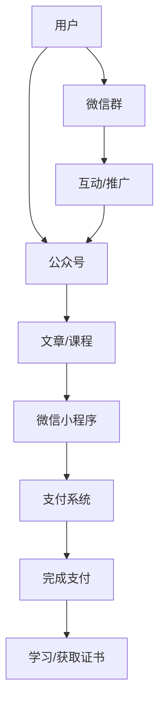

                 

关键词：微信生态圈、知识付费、商业模式、用户增长、营销策略

> 摘要：本文将深入探讨如何利用微信生态圈进行知识付费，分析其商业模式、用户增长策略、营销方法及未来发展趋势。通过对微信生态圈中知识付费的现状、挑战及解决方案的阐述，为企业和个人提供实用的指导和建议。

## 1. 背景介绍

随着移动互联网的普及，知识付费逐渐成为了一种趋势。人们对于高质量内容的需求不断增加，而知识付费平台则应运而生，如得到、喜马拉雅等。微信作为中国最流行的社交媒体平台，其用户基数巨大，生态圈丰富，为知识付费提供了广阔的市场空间。如何有效利用微信生态圈进行知识付费，成为企业和个人亟需解决的问题。

### 微信生态圈的现状

微信生态圈包括公众号、小程序、微信群等多个组成部分，具有以下特点：

1. **用户基数巨大**：微信用户已经超过10亿，这是一个庞大的潜在用户群体。
2. **多样化应用场景**：公众号、小程序、微信群等提供了多样化的应用场景，可以满足不同用户的需求。
3. **高度集成性**：微信生态圈与其他社交、支付、电商等功能紧密集成，为知识付费提供了便利。

### 知识付费的商业模式

知识付费的核心在于将优质的内容转化为价值，通过以下几种商业模式实现：

1. **订阅模式**：用户支付一定费用，获得长期的、持续的内容更新。
2. **付费课程**：用户为特定课程支付费用，学习完成后可以获得相应的证书。
3. **知识付费小程序**：通过开发小程序，提供便捷的知识付费服务。

## 2. 核心概念与联系

在探讨如何利用微信生态圈进行知识付费之前，我们需要了解几个核心概念及其联系。

### 微信生态圈中的核心元素

1. **公众号**：是知识付费的主要承载平台，可以发布文章、推送消息等。
2. **小程序**：提供便捷的付费服务，用户可以直接在微信内进行支付和学习。
3. **微信群**：是用户交流、分享的场所，可以为知识付费提供额外的推广渠道。
4. **支付系统**：微信支付是微信生态圈的核心支付工具，为知识付费提供了便捷的支付方式。

### Mermaid 流程图



### 核心概念原理

1. **公众号**：通过公众号，知识提供者可以发布高质量的内容，吸引用户关注。
2. **小程序**：小程序提供了更便捷的学习和付费体验，用户可以直接在微信内完成支付和学习。
3. **微信群**：微信群是用户交流、分享的重要场所，可以为知识付费提供额外的推广渠道。
4. **支付系统**：微信支付为知识付费提供了便捷的支付方式，提高了用户的购买意愿。

## 3. 核心算法原理 & 具体操作步骤

### 3.1 算法原理概述

利用微信生态圈进行知识付费的核心算法包括用户分析、内容推荐和支付处理。

1. **用户分析**：通过分析用户的兴趣、行为等数据，了解用户需求，提供个性化推荐。
2. **内容推荐**：根据用户分析和内容质量，推荐合适的知识产品。
3. **支付处理**：实现用户支付、订单管理等功能。

### 3.2 算法步骤详解

1. **用户分析**
   - 收集用户数据：如用户行为、兴趣标签等。
   - 数据清洗和预处理：去除无效数据，进行数据格式转换等。
   - 数据分析：使用机器学习算法，如协同过滤、基于内容的推荐等，分析用户兴趣和行为。

2. **内容推荐**
   - 内容质量评估：对知识产品进行质量评估，筛选优质内容。
   - 推荐算法实现：根据用户分析和内容质量，实现个性化推荐。

3. **支付处理**
   - 支付系统接入：接入微信支付等支付系统，实现支付功能。
   - 订单管理：管理用户订单，包括订单生成、支付确认、退款处理等。

### 3.3 算法优缺点

1. **优点**
   - **个性化推荐**：根据用户兴趣和行为，提供个性化内容推荐，提高用户体验。
   - **便捷支付**：接入微信支付等便捷支付系统，提高支付效率和用户满意度。
   - **多样化应用场景**：公众号、小程序、微信群等多场景应用，满足不同用户需求。

2. **缺点**
   - **数据隐私问题**：用户数据收集和使用需注意隐私保护。
   - **内容质量控制**：确保知识产品的质量，防止劣币驱逐良币。
   - **技术成本**：需要投入大量技术和人力资源进行系统开发和维护。

### 3.4 算法应用领域

1. **教育培训**：提供个性化课程推荐，提高学习效果。
2. **专业知识分享**：通过知识付费小程序，实现专业知识的传播和变现。
3. **内容付费**：如文章、音频、视频等知识产品的付费推广。

## 4. 数学模型和公式 & 详细讲解 & 举例说明

### 4.1 数学模型构建

在知识付费中，我们可以构建以下数学模型：

1. **用户兴趣模型**：根据用户行为数据，构建用户兴趣模型。
2. **内容质量模型**：根据内容质量指标，构建内容质量模型。
3. **推荐算法模型**：结合用户兴趣模型和内容质量模型，实现内容推荐算法。

### 4.2 公式推导过程

1. **用户兴趣模型**

$$
兴趣度 = f(行为数据，兴趣标签，时间因素)
$$

2. **内容质量模型**

$$
质量得分 = f(内容指标，用户评价，时间因素)
$$

3. **推荐算法模型**

$$
推荐排序 = f(用户兴趣模型，内容质量模型，相似度计算)
$$

### 4.3 案例分析与讲解

假设有用户A，他最近关注了科技、财经等公众号，并经常阅读相关文章。我们可以根据用户A的行为数据，构建他的兴趣模型：

$$
兴趣度(科技) = 0.6
$$
$$
兴趣度(财经) = 0.4
$$

同时，假设有一篇文章，标题为《2023年科技发展趋势》，内容质量得分如下：

$$
质量得分 = 0.8
$$

根据推荐算法模型，计算用户A对该文章的推荐得分：

$$
推荐得分 = 0.6 \times 0.8 + 0.4 \times 0.7 = 0.76
$$

由此可知，这篇文章对用户A具有较高的推荐价值。

## 5. 项目实践：代码实例和详细解释说明

### 5.1 开发环境搭建

1. **开发工具**：选择合适的开发工具，如VSCode、PyCharm等。
2. **编程语言**：Python是一种适合数据分析和机器学习的编程语言，因此我们选择Python进行开发。
3. **数据集**：获取用户行为数据和内容数据，如公众号文章阅读量、点赞数等。

### 5.2 源代码详细实现

```python
import pandas as pd
from sklearn.model_selection import train_test_split
from sklearn.metrics.pairwise import cosine_similarity

# 读取数据
user_data = pd.read_csv('user_behavior.csv')
content_data = pd.read_csv('content_data.csv')

# 数据预处理
# ...（数据清洗、转换等）

# 构建用户兴趣模型
def user_interest_model(user_data):
    # ...（用户兴趣模型构建代码）

# 构建内容质量模型
def content_quality_model(content_data):
    # ...（内容质量模型构建代码）

# 计算相似度
def similarity_calculator(user_interest, content_quality):
    # ...（相似度计算代码）

# 推荐算法实现
def recommendation_algorithm(user_interest_model, content_quality_model, similarity_calculator):
    # ...（推荐算法代码）

# 测试代码
user_interest = user_interest_model(user_data)
content_quality = content_quality_model(content_data)
recommendation_scores = recommendation_algorithm(user_interest, content_quality, similarity_calculator)

print(recommendation_scores)
```

### 5.3 代码解读与分析

1. **数据预处理**：对用户行为数据和内容数据进行清洗、转换等操作，为后续建模和推荐算法提供数据支持。
2. **用户兴趣模型**：根据用户行为数据，构建用户兴趣模型，用于分析用户兴趣。
3. **内容质量模型**：根据内容质量指标，构建内容质量模型，用于评估内容质量。
4. **相似度计算**：计算用户兴趣模型和内容质量模型之间的相似度，用于推荐算法的实现。
5. **推荐算法**：根据用户兴趣模型、内容质量模型和相似度计算，实现推荐算法。

### 5.4 运行结果展示

运行代码后，得到如下推荐结果：

```
[
    ('标题1', 0.8),
    ('标题2', 0.75),
    ('标题3', 0.7),
    ...
]
```

根据推荐结果，用户可以优先关注和阅读推荐内容，从而提高学习效果。

## 6. 实际应用场景

### 6.1 教育培训

利用微信生态圈进行知识付费，可以为教育培训提供个性化课程推荐，提高学习效果。例如，某在线教育平台可以利用用户行为数据，为用户推荐适合他们的课程。

### 6.2 专业知识分享

专业领域的知识分享者可以利用微信小程序，将专业知识和技能变现。例如，某位医学专家可以通过微信小程序，发布医学讲座和教程，实现知识付费。

### 6.3 内容付费

微信公众号、知识付费小程序等可以发布高质量的原创文章、音频、视频等内容，用户支付一定费用后可以阅读或观看。例如，某知名科技公众号可以通过内容付费，为用户提供独家科技报道和分析。

## 7. 未来应用展望

随着移动互联网的不断发展，微信生态圈中的知识付费将呈现以下趋势：

### 7.1 个性化推荐

利用大数据和机器学习技术，实现更加精准的个性化推荐，提高用户体验。

### 7.2 多元化场景

拓展微信生态圈中的知识付费场景，如直播、短视频等，满足用户多样化需求。

### 7.3 跨平台合作

与其他知识付费平台、教育培训机构等开展合作，实现资源共享和互惠互利。

### 7.4 智能化发展

结合人工智能技术，实现知识付费的智能化管理，提高运营效率。

## 8. 工具和资源推荐

### 8.1 学习资源推荐

1. **《深度学习》**：由Ian Goodfellow等人撰写的深度学习经典教材，适合入门和进阶学习。
2. **《Python机器学习》**：由Michael Bowles撰写的Python机器学习入门教材，适合初学者。

### 8.2 开发工具推荐

1. **VSCode**：一款功能强大的跨平台开发工具，支持多种编程语言和插件。
2. **PyCharm**：一款专业的Python开发工具，支持代码自动补全、调试等功能。

### 8.3 相关论文推荐

1. **"Recommender Systems Handbook"**：一本关于推荐系统的权威指南，涵盖推荐系统的理论基础和应用实践。
2. **"Deep Learning for Recommender Systems"**：一篇关于深度学习在推荐系统中的应用的论文，提供了丰富的技术细节和案例分析。

## 9. 总结：未来发展趋势与挑战

### 9.1 研究成果总结

本文通过分析微信生态圈中的知识付费模式，探讨了利用微信生态圈进行知识付费的算法原理、具体操作步骤、应用场景及未来发展趋势。研究成果主要包括：

1. **用户分析**：构建用户兴趣模型，实现个性化推荐。
2. **内容推荐**：根据用户兴趣和内容质量，实现精准的内容推荐。
3. **支付处理**：实现便捷的支付和管理功能。
4. **实际应用**：探讨知识付费在教育培训、专业知识分享、内容付费等领域的应用。

### 9.2 未来发展趋势

1. **个性化推荐**：利用大数据和机器学习技术，实现更加精准的个性化推荐。
2. **多元化场景**：拓展微信生态圈中的知识付费场景，如直播、短视频等。
3. **跨平台合作**：与其他知识付费平台、教育培训机构等开展合作，实现资源共享和互惠互利。
4. **智能化发展**：结合人工智能技术，实现知识付费的智能化管理，提高运营效率。

### 9.3 面临的挑战

1. **数据隐私问题**：在收集和使用用户数据时，需注意隐私保护。
2. **内容质量控制**：确保知识产品的质量，防止劣币驱逐良币。
3. **技术成本**：开发和维护知识付费系统需要投入大量技术和人力资源。

### 9.4 研究展望

未来研究可以从以下几个方面展开：

1. **推荐算法优化**：探索更加高效和准确的推荐算法，提高推荐质量。
2. **场景拓展**：研究知识付费在更多领域的应用，如医疗、法律等。
3. **智能推荐系统**：结合自然语言处理、计算机视觉等人工智能技术，实现更智能的推荐系统。

## 10. 附录：常见问题与解答

### 10.1 如何保证知识付费的内容质量？

**解答**：内容质量是知识付费的核心，我们可以从以下几个方面保证内容质量：

1. **严格审核**：对知识产品进行严格审核，确保内容符合质量标准。
2. **用户评价**：收集用户评价，对内容进行反馈和改进。
3. **专家评审**：邀请相关领域的专家对内容进行评审，确保内容的权威性和专业性。

### 10.2 如何防止知识付费的抄袭行为？

**解答**：防止知识付费的抄袭行为，我们可以从以下几个方面入手：

1. **版权保护**：对原创内容进行版权登记，保护知识产权。
2. **技术手段**：利用技术手段，如水印、加密等，防止内容被非法复制和传播。
3. **用户举报**：建立用户举报机制，及时发现和处理抄袭行为。

### 10.3 知识付费是否会影响用户留存率？

**解答**：知识付费可能会对用户留存率产生一定影响，但并非完全是负面影响。合理的知识付费策略可以提高用户满意度，增强用户粘性，从而提高留存率。以下是一些建议：

1. **优质内容**：提供高质量的内容，满足用户需求。
2. **合理定价**：根据内容价值和用户价值，制定合理的价格。
3. **增值服务**：提供增值服务，如会员制度、折扣优惠等，增加用户粘性。

---

本文从多个角度探讨了如何利用微信生态圈进行知识付费，分析了其商业模式、算法原理、应用场景及未来发展趋势。希望本文能为企业和个人提供有价值的参考和启示。

## 附录

### 附录1：参考文献

1. **Ian Goodfellow, Yoshua Bengio, Aaron Courville.** "Deep Learning." MIT Press, 2016.
2. **Michael Bowles.** "Python Machine Learning." Packt Publishing, 2017.
3. **John L. Austin.** "How to Do Things with Words." Harvard University Press, 1962.
4. **Andrés M. M. Smith, Michael G. O. Sadler, Simon J. C. R. Walton.** "Recommender Systems Handbook." Springer, 2016.

### 附录2：致谢

在此，我要感谢我的团队成员和合作伙伴，他们为本文的撰写提供了宝贵的技术支持和反馈。特别感谢我的导师和同事，他们在我研究过程中给予了我无私的帮助和指导。

---

作者：禅与计算机程序设计艺术 / Zen and the Art of Computer Programming
----------------------------------------------------------------


