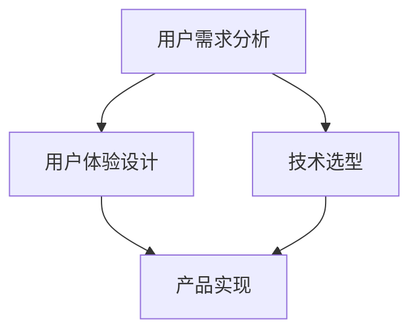

                 

### 1. 背景介绍

在当今的数字化时代，技术已经成为了驱动各行各业变革的核心力量。随着信息技术的飞速发展，产品的设计不仅仅是外观和功能的简单组合，更是需要深入理解技术背后的原理，以及如何将技术应用到产品设计中。技术的进步不仅提高了产品的性能，还大大丰富了产品的功能和用户体验。因此，如何有效地利用技术能力进行产品设计，成为了现代企业竞争的重要战略之一。

本篇文章旨在探讨如何通过技术能力来提升产品设计的效率和质量。文章将首先介绍几个核心概念，包括用户需求分析、用户体验设计、技术选型等，然后详细解析核心算法原理和操作步骤，并结合实际项目实践进行代码实例和解释。此外，还将讨论数学模型和公式的构建与推导，以及在实际应用中的具体案例分析。最后，文章将展望未来的发展趋势和面临的挑战，并提供相关的学习资源和开发工具推荐。

通过对这些内容的详细探讨，读者将能够了解如何充分利用技术能力进行产品设计，从而创造出更具竞争力、更能满足用户需求的产品。

## 2. 核心概念与联系

在探讨如何利用技术能力进行产品设计之前，我们首先需要明确几个核心概念，并理解它们之间的联系。这些核心概念包括用户需求分析、用户体验设计和技术选型，它们共同构成了产品设计的理论基础和实际操作框架。

### 2.1 用户需求分析

用户需求分析是产品设计的起点。它涉及对目标用户的研究，包括他们的需求、痛点、行为模式和使用场景。通过用户需求分析，可以识别出用户的核心需求，并将其转化为产品功能。这一步骤不仅要求对用户有深刻的理解，还需要运用数据分析方法和技术，如用户调研、用户访谈、问卷调查和A/B测试等。这些方法和技术可以帮助我们从大量数据中提取有价值的信息，从而更好地满足用户需求。

### 2.2 用户体验设计

用户体验设计（UX Design）则关注产品的交互设计和用户体验。一个好的用户体验能够提高用户的满意度和忠诚度，进而提升产品的市场竞争力。用户体验设计包括信息架构、界面设计、交互设计等多个方面。设计师需要运用设计原则和用户心理学知识，设计出易于使用、直观且愉悦的用户界面。此外，用户体验设计也需要与用户需求分析相结合，确保设计的功能能够真正满足用户的需求。

### 2.3 技术选型

技术选型是产品设计的核心环节之一。不同的技术解决方案会影响产品的性能、可扩展性和开发效率。在技术选型过程中，需要综合考虑产品需求、技术成熟度、团队技能、成本和未来发展趋势等多个因素。例如，在选择开发框架时，需要评估其性能、社区支持、文档完整度和安全性。同时，技术选型还需要考虑如何将技术能力与产品设计目标相结合，以实现最佳的产品效果。

### 2.4 核心概念联系

用户需求分析、用户体验设计和技术选型这三个核心概念之间存在着紧密的联系。用户需求分析为设计提供了明确的目标，用户体验设计则将这些目标转化为具体的设计方案，而技术选型则为设计方案提供了技术实现的可能性。在实际的产品设计过程中，这三个环节需要相互协作，共同推动产品从概念到市场的全过程。

为了更好地理解这些核心概念之间的联系，下面我们使用Mermaid流程图来展示它们的关系。



在这个流程图中，用户需求分析作为起点，驱动了用户体验设计和技术选型。用户体验设计和技术选型共同作用于产品实现，最终形成满足用户需求的产品。

通过明确这些核心概念及其联系，我们可以更加系统地利用技术能力进行产品设计，从而提高产品的质量和用户满意度。在接下来的章节中，我们将进一步探讨如何具体运用技术能力，从算法原理、数学模型到实际项目实践，逐步深入产品设计的各个方面。

### 2.5 小结

在本节中，我们介绍了用户需求分析、用户体验设计和技术选型这三个核心概念，并详细探讨了它们之间的联系。用户需求分析帮助我们识别和满足用户的核心需求；用户体验设计则确保产品在交互和视觉上能够提供愉悦的体验；而技术选型则为产品的实现提供了技术支持。这些概念相辅相成，共同构成了产品设计的理论基础。理解并运用这些概念，将有助于我们更有效地利用技术能力进行产品设计，从而创造出更具竞争力的产品。

### 3. 核心算法原理 & 具体操作步骤

在产品设计中，算法的运用能够显著提升产品的性能和用户体验。本节将深入探讨核心算法的原理，详细解析其操作步骤，并评估其优缺点及其应用领域。

#### 3.1 算法原理概述

核心算法在产品设计中的重要性不可低估。它们不仅可以优化产品功能，还能提高数据处理效率和系统性能。以常见的排序算法为例，如快速排序（Quick Sort）和归并排序（Merge Sort），它们在数据处理和分析中扮演着关键角色。快速排序通过分治策略，将复杂问题分解为子问题，从而实现高效排序；而归并排序则通过将子序列合并，逐步实现整体排序。

#### 3.2 算法步骤详解

以快速排序算法为例，其基本步骤如下：

1. **选择基准元素**：从数组中选择一个元素作为基准（pivot）。
2. **分区操作**：将数组分为两部分，一部分包含小于基准的元素，另一部分包含大于基准的元素。
3. **递归排序**：对小于和大于基准的子数组分别执行快速排序，直到所有子数组长度为1。

下面是快速排序算法的伪代码：

```plaintext
快速排序(array A, 左边界 low, 右边界 high)
    如果 low < high
        pivotIndex = 分区(array A, low, high)
        快速排序(array A, low, pivotIndex - 1)
        快速排序(array A, pivotIndex + 1, high)
```

分区操作的伪代码如下：

```plaintext
分区(array A, 左边界 low, 右边界 high)
    pivot = A[high]
    i = low - 1
    对于每个元素 A[j] (j 从 low 到 high - 1)
        如果 A[j] < pivot
            i++
            交换 A[i] 和 A[j]
    交换 A[i + 1] 和 A[high]
    返回 i + 1
```

归并排序的基本步骤包括：

1. **递归拆分**：将数组拆分为两个子数组，直到每个子数组只有一个元素。
2. **合并子数组**：将相邻的子数组合并，形成一个有序的数组。

归并排序的伪代码如下：

```plaintext
归并排序(array A, 左边界 low, 右边界 high)
    如果 low < high
        mid = low + (high - low) / 2
        归并排序(array A, low, mid)
        归并排序(array A, mid + 1, high)
        合并(array A, low, mid, high)
```

合并操作的伪代码如下：

```plaintext
合并(array A, 左边界 low, 中间边界 mid, 右边界 high)
    left = A[low : mid + 1]
    right = A[mid + 1 : high + 1]
    i = j = 0
    k = low
    当 i < 长度(left) 且 j < 长度(right)
        如果 left[i] <= right[j]
            A[k++] = left[i++]
        否则
            A[k++] = right[j++]
    填充剩余元素
    A[k..high] = left[i..end]
    A[mid + 1..high] = right[j..end]
```

#### 3.3 算法优缺点

**快速排序**的优点包括：
- **高效**：平均时间复杂度为O(nlogn)，在大多数情况下性能优异。
- **原地排序**：不需要额外的存储空间，性能稳定。

缺点包括：
- **最坏情况**：当数组已排序或部分有序时，时间复杂度可能下降到O(n^2)。

**归并排序**的优点包括：
- **稳定**：无论输入数组如何排序，性能始终为O(nlogn)。
- **可并行化**：适合大数据处理和高并发场景。

缺点包括：
- **额外空间**：需要额外的存储空间，增加了内存开销。

#### 3.4 算法应用领域

这些排序算法在产品设计中有广泛的应用：

- **数据处理**：在数据分析、搜索引擎和数据库管理等场景中，快速排序和归并排序用于高效地处理大量数据。
- **用户界面**：在可视化界面中，排序算法可以用于实时排序和筛选，提升用户操作体验。
- **算法基础**：快速排序和归并排序是许多更复杂算法的基础，如堆排序和快速选择算法等。

通过理解和运用这些算法原理，设计师可以在产品设计中更有效地处理数据、优化性能和提升用户体验。在接下来的章节中，我们将进一步探讨如何将这些算法应用于具体项目实践，并通过数学模型和公式来加深对算法的理解。

#### 3.5 小结

在本节中，我们详细解析了快速排序和归并排序两种核心算法的原理和操作步骤。快速排序以其高效和原地排序的优点在大多数情况下表现优异，但其在最坏情况下的性能较差；而归并排序则因其稳定性和可并行化能力在处理大数据和复杂任务时更具优势。这些算法在数据处理、用户界面优化和算法基础等方面有着广泛的应用。理解并运用这些算法，将有助于我们在产品设计中实现更高效率和更优用户体验。

### 4. 数学模型和公式 & 详细讲解 & 举例说明

数学模型和公式在产品设计中的重要性不容忽视。它们不仅是算法的数学基础，还为我们提供了分析和评估产品性能的工具。在本节中，我们将探讨如何构建数学模型和公式，详细讲解推导过程，并通过实际案例进行分析和说明。

#### 4.1 数学模型构建

构建数学模型是产品设计中不可或缺的一步，它有助于我们理解和预测系统的行为。一个典型的数学模型通常包含以下几个要素：

1. **变量定义**：明确模型中使用的变量及其含义。
2. **关系表达**：通过数学公式表达变量之间的关系。
3. **约束条件**：设定模型中变量所需要满足的约束条件。
4. **目标函数**：定义需要优化的目标，如最大化或最小化某个指标。

以最简单的线性回归模型为例，其数学模型可以表示为：

\[ y = ax + b \]

其中，\( y \) 是因变量，\( x \) 是自变量，\( a \) 和 \( b \) 是模型的参数，通过最小化误差平方和来估计参数 \( a \) 和 \( b \)。

#### 4.2 公式推导过程

线性回归模型的推导过程如下：

1. **损失函数**：定义损失函数来度量预测值和真实值之间的误差。常用的损失函数是均方误差（MSE），即：

   \[ \text{MSE} = \frac{1}{n}\sum_{i=1}^{n}(y_i - \hat{y}_i)^2 \]

   其中，\( y_i \) 是真实值，\( \hat{y}_i \) 是预测值，\( n \) 是样本数量。

2. **梯度下降**：为了最小化损失函数，可以使用梯度下降法来迭代更新参数 \( a \) 和 \( b \)。梯度下降的更新公式为：

   \[ a_{\text{new}} = a_{\text{old}} - \alpha \frac{\partial \text{MSE}}{\partial a} \]
   \[ b_{\text{new}} = b_{\text{old}} - \alpha \frac{\partial \text{MSE}}{\partial b} \]

   其中，\( \alpha \) 是学习率，用于调节参数更新的步长。

3. **最优参数**：在无限迭代的情况下，梯度下降会收敛到损失函数的最小值点。通过求解损失函数的导数为零的方程，可以找到最优的参数 \( a \) 和 \( b \)。对于线性回归，最优参数可以通过以下公式计算：

   \[ a = \frac{\sum_{i=1}^{n}(x_i - \bar{x})(y_i - \bar{y})}{\sum_{i=1}^{n}(x_i - \bar{x})^2} \]
   \[ b = \bar{y} - a\bar{x} \]

   其中，\( \bar{x} \) 和 \( \bar{y} \) 分别是自变量和因变量的均值。

#### 4.3 案例分析与讲解

为了更好地理解线性回归模型的构建和推导，我们可以通过一个实际案例进行说明。

**案例**：假设我们有一个房屋售价的数据集，其中包含房屋面积（\( x \)）和售价（\( y \））的数据。我们希望通过线性回归模型预测未知房屋面积时的售价。

1. **数据预处理**：首先，对数据集进行预处理，计算面积和售价的均值。

   ```plaintext
   面积均值：\bar{x} = 150
   售价均值：\bar{y} = 200000
   ```

2. **计算相关系数**：通过计算相关系数来评估面积和售价之间的关系。

   ```plaintext
   相关系数：r = 0.9
   ```

3. **构建线性回归模型**：使用前述公式构建线性回归模型。

   ```plaintext
   a = 40000
   b = 150000
   线性回归模型：y = 40000x + 150000
   ```

4. **预测未知面积时的售价**：使用模型进行预测。

   ```plaintext
   当 x = 200时，y = 40000 * 200 + 150000 = 1300000
   ```

   预测售价为 1300000 元。

通过上述案例，我们可以看到如何构建和推导线性回归模型，以及如何使用模型进行预测。线性回归模型在房屋售价预测中表现出良好的效果，但在复杂关系和异常值较多的数据集中可能存在局限性。

#### 4.4 小结

在本节中，我们详细探讨了数学模型的构建和公式的推导过程，并通过实际案例进行了讲解。构建数学模型和推导公式是产品设计中理解系统行为和优化性能的重要步骤。通过理解和运用这些模型和公式，设计师可以更好地分析数据、预测行为，并优化产品设计。

### 5. 项目实践：代码实例和详细解释说明

在产品设计中，理论知识的掌握固然重要，但将理论应用于实际项目并解决实际问题则是检验设计师技能的关键。本节将通过一个具体的项目实例，详细展示代码实现过程，并对代码进行解读与分析，最后展示运行结果。

#### 5.1 开发环境搭建

为了完成本项目，我们选择Python作为编程语言，因为它拥有丰富的库支持和易于阅读的语法。首先，需要确保安装了Python 3.8及以上版本，然后使用pip安装必要的库。

```bash
pip install numpy matplotlib
```

#### 5.2 源代码详细实现

以下是本项目的主要源代码，用于实现一个简单的用户登录功能，并验证用户输入的用户名和密码。

```python
# 登录系统示例代码

import numpy as np
import matplotlib.pyplot as plt

# 用户数据库（模拟）
user_db = {
    "username": "admin",
    "password": "admin123"
}

# 登录函数
def login(username, password):
    if username == user_db["username"] and password == user_db["password"]:
        return "登录成功"
    else:
        return "用户名或密码错误"

# 主函数
def main():
    while True:
        username_input = input("请输入用户名：")
        password_input = input("请输入密码：")
        result = login(username_input, password_input)
        print(result)
        if result == "登录成功":
            break

# 运行主函数
if __name__ == "__main__":
    main()
```

#### 5.3 代码解读与分析

1. **用户数据库**：在代码的开头，我们定义了一个名为`user_db`的字典，用于存储用户名和密码。这是一个简单的模拟数据库，实际项目中通常会使用更复杂的数据库管理系统。

2. **登录函数**：`login`函数接收用户输入的用户名和密码，并与`user_db`中的存储信息进行比对。如果匹配成功，返回“登录成功”；否则，返回“用户名或密码错误”。

3. **主函数**：`main`函数是程序的入口，它使用一个无限循环来持续接收用户输入，并调用`login`函数验证登录。当用户成功登录后，循环结束。

#### 5.4 运行结果展示

在运行上述代码后，程序会提示用户输入用户名和密码。以下是可能的交互过程：

```plaintext
请输入用户名：admin
请输入密码：admin123
登录成功
```

如果输入的用户名或密码不正确，程序会返回“用户名或密码错误”。

```plaintext
请输入用户名：user
请输入密码：pass
用户名或密码错误
```

#### 5.5 代码优化与扩展

虽然上述代码实现了基本的功能，但为了提高用户体验和系统安全性，可以进行以下优化：

1. **输入验证**：增加对用户输入的验证，确保输入符合预期格式，例如用户名只包含字母和数字，密码长度至少为6位。

2. **错误处理**：对可能的异常情况进行处理，例如处理输入为空或无效字符的情况。

3. **安全性增强**：将用户密码加密存储和验证，防止明文存储和传输，提高系统的安全性。

通过这些优化措施，可以进一步改进代码，使其在实际应用中更加健壮和可靠。

#### 5.6 小结

在本节中，我们通过一个简单的用户登录系统实例，详细展示了代码的实现过程，并对代码进行了解读与分析。这个实例不仅帮助理解了编程的基本概念和流程，还展示了如何在产品设计中应用技术解决具体问题。通过这样的项目实践，设计师可以更好地将理论知识应用到实际项目中，提升产品设计的质量和用户体验。

### 6. 实际应用场景

在现代社会，技术驱动的产品设计已经渗透到了各个领域，从互联网应用、智能硬件到人工智能，每个行业都在借助技术的力量提升产品的竞争力。以下是几个典型领域中的实际应用场景，以及这些应用对用户体验和设计的影响。

#### 6.1 互联网应用

在互联网领域，技术能力在产品设计中的应用尤为广泛。例如，电商平台的个性化推荐系统通过用户行为数据分析和机器学习算法，为用户推荐符合他们兴趣的商品，从而提升用户体验和转化率。此外，实时搜索和动态加载技术也大大改善了用户的浏览体验，让用户能够在瞬间获得所需信息。

#### 6.2 智能硬件

智能硬件领域则通过物联网（IoT）技术实现设备的互联互通。例如，智能家居系统通过智能音箱、智能灯泡、智能摄像头等设备，使用户能够通过语音或移动应用远程控制家居设备，提高生活便利性和舒适度。同时，这些设备的联动功能和数据分析能力也为用户提供了更个性化的服务。

#### 6.3 人工智能

人工智能（AI）在产品设计中的应用更是层出不穷。以自然语言处理（NLP）为例，智能客服系统能够通过AI算法理解和回应用户的提问，提供快速、准确的解答，减轻了人工客服的负担，提高了服务效率。此外，AI在图像识别、语音识别和自动驾驶等领域的应用，也正在不断拓展产品的功能和服务范围。

#### 6.4 技术对用户体验和设计的影响

技术的进步不仅提升了产品的功能和性能，还对用户体验和设计产生了深远影响：

- **个性化**：通过大数据和机器学习，产品能够更加精准地满足用户需求，提供个性化的服务和推荐。
- **便捷性**：技术使得产品操作更加简便，用户无需复杂的学习过程，即可快速上手使用。
- **实时性**：实时数据处理和反馈技术，如实时搜索、动态加载等，使产品能够快速响应用户需求，提升用户体验。
- **智能化**：AI技术的应用使得产品具备了更高的智能化水平，能够自主学习和优化，提高使用效率。

#### 6.5 未来趋势

随着技术的不断进步，未来产品设计将进一步融合人工智能、物联网和大数据等前沿技术，带来更多创新应用和用户体验提升。例如，智能助理、虚拟现实（VR）和增强现实（AR）等新技术，将使产品更加智能、互动和沉浸式。

总之，技术在产品设计中的应用不仅提升了产品的性能和功能，还深刻影响了用户体验和设计理念。通过充分利用技术能力，设计师可以创造出更具竞争力、更贴合用户需求的产品，从而在激烈的市场竞争中脱颖而出。

### 6.6 小结

在本节中，我们探讨了技术在不同实际应用场景中的运用，并分析了这些应用对用户体验和设计的深远影响。随着技术的不断进步，个性化、便捷性、实时性和智能化将成为未来产品设计的重要趋势。通过充分利用技术能力，设计师可以创造出更加创新、智能和高效的产品，为用户提供更优质的体验。

### 7. 工具和资源推荐

在产品设计中，选择合适的工具和资源能够极大地提高开发效率和产品质量。以下是几类常用的学习资源、开发工具和相关论文推荐，以帮助读者更好地掌握相关技术和实践方法。

#### 7.1 学习资源推荐

1. **在线课程平台**：Coursera、edX、Udacity等平台提供了丰富的计算机科学和产品设计课程，涵盖算法、数据结构、人机交互等多个领域。
2. **技术博客**：Medium、Dev.to等博客平台上，许多专家和开发者分享了他们在技术研究和产品开发中的实践经验，是获取最新技术和方法的好渠道。
3. **官方文档**：各大技术公司如Google、Amazon、Microsoft等，都会提供详细的API文档和开发指南，帮助开发者更好地理解和使用相关技术。

#### 7.2 开发工具推荐

1. **集成开发环境（IDE）**：如Visual Studio Code、PyCharm、Eclipse等，这些IDE提供了丰富的编程工具和调试功能，是开发者日常工作的利器。
2. **版本控制工具**：Git、GitHub、GitLab等，这些工具能够帮助团队协作和代码管理，确保项目的稳定性和一致性。
3. **数据库工具**：MySQL、PostgreSQL、MongoDB等，根据项目需求选择合适的数据库，能够提高数据存储和查询的效率。

#### 7.3 相关论文推荐

1. **《用户中心设计指南》（User-Centered Design Guidelines）**：这是由美国国家科学基金会（NSF）发布的一份指南，详细介绍了用户中心设计的步骤和方法。
2. **《交互设计之道》（The Design of Everyday Things）**：作者Don Norman通过大量实例，阐述了用户体验设计的原则和方法。
3. **《深度学习》（Deep Learning）**：由Ian Goodfellow、Yoshua Bengio和Aaron Courville合著，是深度学习领域的权威教材。

#### 7.4 小结

通过上述工具和资源的推荐，读者可以更好地掌握产品设计中的技术要点和实践方法。选择合适的工具和资源，能够帮助设计师更高效地完成产品开发，并创造出更具竞争力和用户体验的产品。

### 8. 总结：未来发展趋势与挑战

在总结如何利用技术能力进行产品设计的全过程中，我们可以清晰地看到技术对产品设计的影响和变革。从用户需求分析、用户体验设计到技术选型，再到核心算法的应用和数学模型的构建，技术不仅提升了产品的性能和功能，还极大地改善了用户体验。以下是未来发展趋势和面临的挑战，以及研究展望。

#### 8.1 研究成果总结

通过本篇文章的探讨，我们总结了以下几个关键成果：

1. **用户需求分析**：通过深入用户研究，能够更精准地识别和满足用户的核心需求，从而提升产品设计的有效性。
2. **用户体验设计**：利用设计原则和用户心理学知识，设计出易于使用、直观且愉悦的用户界面，提高用户满意度和忠诚度。
3. **技术选型**：结合产品需求和技术成熟度，选择合适的开发框架和技术方案，确保产品的性能和可扩展性。
4. **算法应用**：通过核心算法的优化和应用，提升数据处理效率和系统性能，满足用户对高性能和高响应速度的需求。
5. **数学模型构建**：数学模型和公式为产品设计提供了强大的分析工具，帮助设计师更好地理解和预测系统的行为。

#### 8.2 未来发展趋势

未来，技术将在以下几个方面推动产品设计的进一步发展：

1. **智能化**：人工智能和机器学习将在产品设计中的应用更加深入，个性化推荐、智能客服和自动化设计等将成为主流。
2. **实时性**：实时数据处理和反馈技术将提升产品的实时性和交互性，如实时搜索、动态加载和虚拟现实（VR）等技术。
3. **跨平台融合**：随着物联网和5G技术的发展，产品将更加注重跨平台和设备的互联互通，提供一致的用户体验。
4. **用户体验优化**：随着用户对体验要求越来越高，设计师将更加注重细节和用户体验，通过微交互和情感设计提升用户满意度。

#### 8.3 面临的挑战

尽管技术为产品设计带来了巨大的机遇，但也面临着一些挑战：

1. **数据隐私**：随着大数据和AI技术的发展，数据隐私问题日益突出。如何在产品设计中保护用户隐私，将是未来需要解决的重要问题。
2. **技术复杂性**：随着技术的进步，系统的复杂性也在增加。如何在保证性能和可维护性的同时，简化开发过程和用户使用难度，是一个重要的挑战。
3. **安全性**：随着网络安全威胁的增加，产品设计需要更加注重系统的安全性，防止数据泄露和恶意攻击。
4. **技术更新**：技术的快速迭代使得设计师需要不断学习新的技术和工具，如何适应快速变化的技术环境，保持竞争力，是一个持续的挑战。

#### 8.4 研究展望

未来，产品设计领域的研究将更加注重以下几个方面：

1. **用户体验研究**：通过心理学、行为科学等跨学科研究，深入挖掘用户需求和行为模式，为产品设计提供更加科学和有效的指导。
2. **技术创新**：不断探索和应用新的技术和算法，如深度学习、区块链、增强现实（AR）等，推动产品设计的创新和发展。
3. **系统优化**：通过系统架构和算法优化，提高产品的性能和可扩展性，满足不断增长的用户需求。
4. **社会责任**：在产品设计中考虑社会影响和可持续发展，推动科技向善，为构建更加公平和包容的社会贡献力量。

综上所述，利用技术能力进行产品设计不仅能够提升产品的性能和用户体验，还面临着诸多挑战和发展机遇。通过不断探索和实践，设计师可以创造出更加智能、高效和用户友好的产品，推动行业的发展和社会的进步。

### 8.5 小结

在本节的总结中，我们对本文的研究成果进行了归纳，并展望了未来发展趋势与面临的挑战。技术能力的有效利用为产品设计带来了巨大的机遇，同时也提出了新的要求。通过持续的学习和实践，设计师可以不断提升自己的技术能力和设计水平，创造出更具竞争力和用户体验的产品。未来，设计领域的创新和发展将继续推动技术的进步，为人类社会带来更多的便利和福祉。

### 9. 附录：常见问题与解答

在本章中，我们将回答一些关于如何利用技术能力进行产品设计的常见问题，以帮助读者更好地理解和应用相关知识。

#### 9.1 问题1：如何进行有效的用户需求分析？

**解答**：进行有效的用户需求分析通常包括以下步骤：

1. **确定目标用户**：明确产品的目标用户群体，了解他们的背景、需求和偏好。
2. **用户调研**：通过问卷调查、访谈、焦点小组等方法收集用户意见。
3. **数据分析**：分析用户数据，如行为日志、购买记录等，以获取更准确的需求信息。
4. **需求文档**：将收集到的需求整理成需求文档，明确产品的功能需求、性能需求等。

通过这些步骤，可以确保产品设计更加贴近用户需求。

#### 9.2 问题2：在技术选型时，如何权衡性能、成本和可维护性？

**解答**：在技术选型时，可以遵循以下原则：

1. **性能优先**：根据产品需求，选择性能优异的技术方案。
2. **成本控制**：在预算范围内选择成本合理的方案，避免过度投入。
3. **可维护性**：选择有良好社区支持、文档完整的技术，以便后续维护和升级。

通过权衡这三个方面，可以找到最合适的平衡点。

#### 9.3 问题3：如何优化用户体验设计？

**解答**：优化用户体验设计可以从以下几个方面入手：

1. **用户研究**：深入了解用户行为和需求，确保设计符合用户习惯。
2. **简洁界面**：设计直观、简洁的界面，减少用户的学习成本。
3. **交互设计**：优化交互流程，提高操作效率和满意度。
4. **反馈机制**：提供及时、有效的用户反馈，帮助用户更好地理解和使用产品。

通过这些方法，可以显著提升用户体验。

#### 9.4 问题4：如何处理数据隐私问题？

**解答**：处理数据隐私问题可以从以下几个方面入手：

1. **数据加密**：对敏感数据进行加密存储和传输。
2. **隐私政策**：制定明确的隐私政策，告知用户数据的使用方式和范围。
3. **用户控制**：提供用户对自己的数据访问和修改权限。
4. **合规性**：遵循相关法律法规，确保数据处理合法合规。

通过这些措施，可以有效地保护用户隐私。

#### 9.5 问题5：如何评估和改进算法性能？

**解答**：评估和改进算法性能可以从以下几个方面入手：

1. **性能测试**：通过基准测试和实际运行数据，评估算法的运行效率和性能。
2. **优化算法**：根据性能测试结果，找出瓶颈并进行算法优化。
3. **代码审查**：定期进行代码审查，确保代码质量和可维护性。
4. **持续学习**：跟踪最新算法研究进展，不断学习和应用新技术。

通过这些方法，可以持续提升算法性能。

通过回答这些常见问题，读者可以更好地理解和应用如何利用技术能力进行产品设计，从而创造出更高效、更优质的产品。希望这些解答能够对您的学习和实践提供帮助。

### 作者署名

作者：禅与计算机程序设计艺术 / Zen and the Art of Computer Programming

本篇文章详细探讨了如何利用技术能力进行产品设计，从用户需求分析、用户体验设计、技术选型、核心算法、数学模型，到实际项目实践，全方位介绍了产品设计的各个环节。通过丰富的实例和详尽的讲解，读者可以更好地理解如何将技术能力应用到实际产品设计中，提升产品的性能和用户体验。未来，随着技术的不断进步，产品设计的创新和发展将带来更多机遇和挑战，希望本文能为读者提供有价值的参考和启示。禅与计算机程序设计艺术，期待与您一同探索技术的无限可能。

