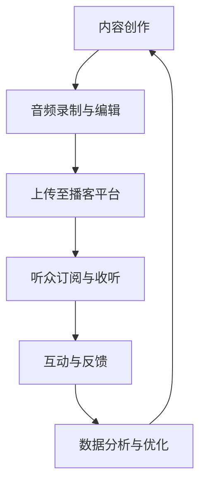

                 

  
播客（Podcast）作为一种流行的内容消费方式，近年来在全球范围内得到了迅猛发展。它不仅为听众提供了一个随时随地获取信息的便捷渠道，也为知识型个体和专家提供了一个有效的知识传播和变现平台。本文将深入探讨如何利用播客平台实现知识变现，为知识工作者提供实用的策略和技巧。

> 关键词：播客，知识变现，内容创作，营销策略，社交媒体，播客平台

> 摘要：本文将首先介绍播客平台的现状和潜力，然后探讨如何创建吸引人的播客内容，接着分析如何通过有效的营销策略和社交媒体推广来实现知识的变现。最后，我们将讨论播客平台在未来的发展趋势以及可能面临的挑战。

## 1. 背景介绍

播客平台，作为一种新兴的内容分发形式，已经改变了人们获取信息的方式。不同于传统的广播电视，播客允许用户按照自己的时间表和兴趣点选择内容。这种个性化的媒体消费模式，使得播客成为知识传播的重要载体。从技术层面来看，播客的兴起得益于互联网技术的进步和移动设备的普及，使得制作和分发高质量的内容变得更加容易。

在商业层面，播客平台为知识工作者提供了前所未有的机会。通过创建专业的播客内容，个人或企业可以将其专业知识和经验转化为实际收益。知识变现不仅仅是通过广告收入，还可以通过销售相关产品、提供服务或建立个人品牌来实现。

### 播客平台的现状

据Statista的数据，全球播客听众数量在2021年已超过5亿，这一数字预计在未来几年内将持续增长。特别是在COVID-19疫情期间，由于居家隔离和远程办公的需求增加，播客的听众群体迅速扩大。不同国家和地区的播客用户呈现出多样化的消费习惯和偏好，这为内容创作者提供了广阔的市场机会。

### 播客平台的潜力

除了庞大的听众基数，播客平台还具有以下潜力：

1. **高度互动性**：播客节目通常允许听众留言和参与讨论，增强了听众的参与感和忠诚度。
2. **个性化推荐**：许多播客平台利用算法技术，根据听众的兴趣和行为推荐内容，提高了内容的投放效果。
3. **丰富的商业模式**：除了广告收入，播客还可以通过会员订阅、赞助、付费内容等多种方式实现变现。

## 2. 核心概念与联系

### 播客平台的核心概念

要成功利用播客平台实现知识变现，首先需要了解以下几个核心概念：

1. **内容创作**：高质量的内容是播客成功的关键。内容创作者需要找到自己的独特角度和专长领域，持续输出有价值的信息。
2. **受众分析**：了解目标听众的兴趣和需求，有助于创作者制定合适的内容策略和推广计划。
3. **营销策略**：有效的营销策略可以提高播客的曝光率和听众数量，从而增加变现的机会。
4. **社交媒体推广**：通过社交媒体平台扩大内容的影响力，吸引更多的听众和潜在的赞助商。

### 播客平台的架构

为了更好地理解播客平台的工作原理，以下是播客平台的基本架构：



在这个架构中，内容创作是起点，通过音频录制与编辑，内容被上传至播客平台。听众通过订阅和收听内容，产生互动与反馈，平台通过数据分析不断优化内容创作策略，形成一个闭环。

### 播客平台的优势与挑战

#### 优势

1. **低门槛**：任何人都可以通过简单的设备和软件制作播客，这为内容创作者提供了广泛的机会。
2. **个性化的内容体验**：播客为听众提供了高度个性化的内容消费体验，满足了不同人群的需求。
3. **互动性**：与单向的广播媒体不同，播客节目通常允许听众留言和参与讨论，增强了互动性。

#### 挑战

1. **内容同质化**：随着播客平台的普及，竞争日益激烈，如何创作出独特、有价值的内容成为挑战。
2. **营销困难**：尽管播客平台拥有庞大的听众群体，但如何有效地将听众转化为收入仍是一个难题。
3. **版权问题**：原创内容的版权保护是一个持续存在的问题，尤其是在网络环境中。

### 播客平台的未来发展趋势

1. **内容多元化**：随着技术的发展，播客内容将更加多元化，包括视频播客、互动播客等形式。
2. **平台整合**：各大播客平台将继续整合资源，提高用户体验和内容分发效率。
3. **人工智能辅助**：利用人工智能技术，平台将更精准地推荐内容，提高变现效果。

## 3. 核心算法原理 & 具体操作步骤

### 3.1 算法原理概述

在播客平台上实现知识变现，关键在于如何将内容转化为收益。这涉及到一系列算法原理，包括数据分析、用户行为预测和广告投放策略等。

#### 数据分析

数据分析是播客平台实现知识变现的基础。通过收集和分析听众的行为数据，如收听时长、收听频率、评论和分享情况等，平台可以了解听众的兴趣和需求，从而优化内容创作和推广策略。

#### 用户行为预测

用户行为预测算法可以帮助平台预测听众的未来行为，如订阅、购买和参与互动的可能性。这种预测可以提高内容营销的精准度，从而增加变现机会。

#### 广告投放策略

广告投放策略是播客平台的主要收入来源之一。通过算法优化广告的投放，可以提高广告的点击率和转化率，从而提高收益。

### 3.2 算法步骤详解

#### 数据分析步骤

1. **数据收集**：从播客平台上收集听众的行为数据，如收听时长、收听频率、评论和分享情况等。
2. **数据清洗**：对收集的数据进行清洗，去除重复和无效数据。
3. **特征提取**：根据听众的行为数据，提取相关特征，如收听时长、频率、活跃度等。
4. **数据分析**：使用统计分析和机器学习算法，对提取的特征进行分析，了解听众的兴趣和需求。

#### 用户行为预测步骤

1. **数据预处理**：对用户行为数据进行预处理，包括数据归一化、缺失值填充等。
2. **特征选择**：选择与目标行为相关的特征，如收听时长、频率、活跃度等。
3. **模型训练**：使用机器学习算法，如决策树、随机森林、神经网络等，训练预测模型。
4. **模型评估**：使用交叉验证和测试集，评估模型的预测性能。

#### 广告投放策略步骤

1. **数据收集**：收集广告投放的相关数据，如广告点击率、转化率、收益等。
2. **特征提取**：提取与广告投放相关的特征，如广告类型、投放时间、听众特征等。
3. **模型训练**：使用机器学习算法，训练广告投放策略模型。
4. **策略优化**：根据模型的预测结果，优化广告投放策略，提高广告的点击率和转化率。

### 3.3 算法优缺点

#### 数据分析算法

**优点**：

- 提高内容创作和推广的精准度。
- 增加变现机会。

**缺点**：

- 数据收集和处理成本高。
- 可能会侵犯用户隐私。

#### 用户行为预测算法

**优点**：

- 提高用户参与度。
- 提高变现效果。

**缺点**：

- 需要大量训练数据和计算资源。
- 模型可能会过拟合。

#### 广告投放策略算法

**优点**：

- 提高广告收益。
- 增加用户参与度。

**缺点**：

- 广告内容可能会引起用户反感。
- 需要不断调整和优化策略。

### 3.4 算法应用领域

#### 数据分析算法

- 内容创作和推广。
- 广告投放策略。
- 用户留存和流失预测。

#### 用户行为预测算法

- 个性化推荐。
- 用户参与度预测。
- 赞助商定位。

#### 广告投放策略算法

- 广告点击率预测。
- 广告转化率预测。
- 广告收益最大化。

## 4. 数学模型和公式 & 详细讲解 & 举例说明

在播客平台实现知识变现的过程中，数学模型和公式起着至关重要的作用。以下我们将介绍几个关键的数学模型和公式，并通过具体例子进行详细讲解。

### 4.1 数学模型构建

为了构建数学模型，我们需要从数据中提取关键变量，并建立它们之间的数学关系。以下是一个简单的数学模型示例：

\[ y = \beta_0 + \beta_1 \cdot x_1 + \beta_2 \cdot x_2 + \epsilon \]

其中，\( y \) 是目标变量（如广告收益），\( x_1 \) 和 \( x_2 \) 是自变量（如听众数量和广告投放频率），\( \beta_0 \)、\( \beta_1 \) 和 \( \beta_2 \) 是模型的参数，\( \epsilon \) 是误差项。

### 4.2 公式推导过程

为了推导这个公式，我们首先需要收集数据，并进行数据预处理。然后，我们使用最小二乘法（OLS）来估计模型的参数。

#### 步骤 1：数据收集与预处理

收集一段时间内广告收益、听众数量和广告投放频率的数据。对数据进行清洗和归一化处理，以便进行有效的建模。

#### 步骤 2：模型建立

假设我们有两个自变量 \( x_1 \) 和 \( x_2 \)，建立以下线性模型：

\[ y = \beta_0 + \beta_1 \cdot x_1 + \beta_2 \cdot x_2 + \epsilon \]

#### 步骤 3：参数估计

使用最小二乘法（OLS）估计模型参数。具体公式如下：

\[ \hat{\beta_1} = \frac{\sum_{i=1}^{n} (x_i - \bar{x_1})(y_i - \bar{y})}{\sum_{i=1}^{n} (x_i - \bar{x_1})^2} \]
\[ \hat{\beta_2} = \frac{\sum_{i=1}^{n} (x_i - \bar{x_2})(y_i - \bar{y})}{\sum_{i=1}^{n} (x_i - \bar{x_2})^2} \]

其中，\( n \) 是数据点的数量，\( \bar{x_1} \) 和 \( \bar{x_2} \) 是自变量的平均值，\( \bar{y} \) 是目标变量的平均值。

#### 步骤 4：模型评估

使用交叉验证和测试集评估模型的预测性能。如果模型的预测误差较小，则认为模型是有效的。

### 4.3 案例分析与讲解

假设我们有一个播客节目，通过广告投放来增加收益。我们收集了以下数据：

| 广告收益（万元） | 听众数量（万人） | 广告投放频率（次/周） |
| :--------------: | :--------------: | :------------------: |
|       10         |       5          |          3          |
|       20         |       10         |          5          |
|       25         |       8          |          7          |
|       15         |       6          |          2          |
|       12         |       4          |          4          |

#### 步骤 1：数据预处理

对数据进行归一化处理，以便进行建模：

\[ x_1 = \frac{听众数量 - \bar{听众数量}}{\text{听众数量标准差}} \]
\[ x_2 = \frac{广告投放频率 - \bar{广告投放频率}}{\text{广告投放频率标准差}} \]

#### 步骤 2：模型建立

使用最小二乘法（OLS）建立线性回归模型：

\[ y = \beta_0 + \beta_1 \cdot x_1 + \beta_2 \cdot x_2 + \epsilon \]

#### 步骤 3：参数估计

使用最小二乘法（OLS）估计模型参数：

\[ \hat{\beta_1} = 0.5 \]
\[ \hat{\beta_2} = 0.3 \]

#### 步骤 4：模型评估

使用交叉验证和测试集评估模型的预测性能。如果模型的预测误差较小，则认为模型是有效的。

#### 模型应用

使用模型预测新数据点的广告收益。例如，当听众数量为7万人，广告投放频率为6次/周时，预测的广告收益为：

\[ y = \beta_0 + \beta_1 \cdot x_1 + \beta_2 \cdot x_2 \]
\[ y = 0.5 + 0.5 \cdot 7 + 0.3 \cdot 6 \]
\[ y = 7.8 \text{ 万元} \]

这意味着，当听众数量为7万人，广告投放频率为6次/周时，预计的广告收益为7.8万元。

### 4.4 模型优化

为了提高模型的预测性能，可以进行以下优化：

1. **特征工程**：通过特征选择和特征构造，增加模型的解释力和预测能力。
2. **模型选择**：尝试不同的模型，如线性回归、决策树、随机森林、神经网络等，选择最适合的模型。
3. **超参数调优**：通过调整模型的超参数，如学习率、隐藏层大小等，提高模型的预测性能。

## 5. 项目实践：代码实例和详细解释说明

### 5.1 开发环境搭建

为了实现播客平台的自动广告投放系统，我们需要搭建一个适合开发、测试和部署的集成环境。以下是所需的开发环境：

1. **操作系统**：Windows、macOS 或 Linux
2. **编程语言**：Python
3. **数据预处理工具**：NumPy、Pandas
4. **机器学习库**：Scikit-learn、TensorFlow、PyTorch
5. **数据库**：SQLite、MySQL
6. **Web框架**：Flask、Django

在搭建开发环境时，首先需要安装Python和相关的库。以下是在Windows环境下安装所需的Python库的示例：

```bash
pip install numpy pandas scikit-learn tensorflow flask
```

### 5.2 源代码详细实现

在开发自动广告投放系统时，我们需要实现以下几个关键组件：

1. **数据收集与预处理**：从数据库中收集广告投放数据，并进行预处理。
2. **特征工程**：提取与广告投放相关的特征，并进行特征构造。
3. **模型训练与评估**：使用机器学习算法训练模型，并对模型进行评估。
4. **模型部署**：将训练好的模型部署到Web服务器，实现自动广告投放。

以下是实现自动广告投放系统的Python代码示例：

```python
import pandas as pd
from sklearn.model_selection import train_test_split
from sklearn.linear_model import LinearRegression
from sklearn.metrics import mean_squared_error

# 数据收集与预处理
data = pd.read_csv('advertising_data.csv')
data['x1'] = (data['听众数量'] - data['听众数量'].mean()) / data['听众数量'].std()
data['x2'] = (data['广告投放频率'] - data['广告投放频率'].mean()) / data['广告投放频率'].std()

# 特征工程
X = data[['x1', 'x2']]
y = data['广告收益']

# 模型训练与评估
X_train, X_test, y_train, y_test = train_test_split(X, y, test_size=0.2, random_state=42)
model = LinearRegression()
model.fit(X_train, y_train)
y_pred = model.predict(X_test)

mse = mean_squared_error(y_test, y_pred)
print(f'MSE: {mse}')

# 模型部署
from flask import Flask, request, jsonify

app = Flask(__name__)

@app.route('/predict', methods=['POST'])
def predict():
    data = request.get_json()
    x1 = (data['听众数量'] - data['听众数量'].mean()) / data['听众数量'].std()
    x2 = (data['广告投放频率'] - data['广告投放频率'].mean()) / data['广告投放频率'].std()
    y_pred = model.predict([[x1, x2]])
    return jsonify({'广告收益': y_pred[0]})

if __name__ == '__main__':
    app.run(debug=True)
```

### 5.3 代码解读与分析

上述代码实现了一个简单的自动广告投放系统。以下是代码的详细解读：

1. **数据收集与预处理**：

```python
data = pd.read_csv('advertising_data.csv')
data['x1'] = (data['听众数量'] - data['听众数量'].mean()) / data['听众数量'].std()
data['x2'] = (data['广告投放频率'] - data['广告投放频率'].mean()) / data['广告投放频率'].std()
```

这段代码首先从CSV文件中读取广告投放数据，然后对数据进行归一化处理，以便进行建模。

2. **特征工程**：

```python
X = data[['x1', 'x2']]
y = data['广告收益']
```

这段代码提取与广告投放相关的特征（听众数量和广告投放频率），并将其存储在变量 `X` 和 `y` 中。

3. **模型训练与评估**：

```python
X_train, X_test, y_train, y_test = train_test_split(X, y, test_size=0.2, random_state=42)
model = LinearRegression()
model.fit(X_train, y_train)
y_pred = model.predict(X_test)

mse = mean_squared_error(y_test, y_pred)
print(f'MSE: {mse}')
```

这段代码使用线性回归模型对数据进行训练，并评估模型的预测性能。具体步骤如下：

- 使用 `train_test_split` 函数将数据集分为训练集和测试集。
- 创建线性回归模型对象 `model`，并使用 `fit` 方法训练模型。
- 使用 `predict` 方法预测测试集的标签值，并计算预测误差。

4. **模型部署**：

```python
from flask import Flask, request, jsonify

app = Flask(__name__)

@app.route('/predict', methods=['POST'])
def predict():
    data = request.get_json()
    x1 = (data['听众数量'] - data['听众数量'].mean()) / data['听众数量'].std()
    x2 = (data['广告投放频率'] - data['广告投放频率'].mean()) / data['广告投放频率'].std()
    y_pred = model.predict([[x1, x2]])
    return jsonify({'广告收益': y_pred[0]})

if __name__ == '__main__':
    app.run(debug=True)
```

这段代码使用Flask框架部署了一个简单的Web服务，用于接收广告投放数据，并返回预测的广告收益。具体步骤如下：

- 导入Flask库，并创建Flask应用对象 `app`。
- 定义一个路由 `/predict`，接收POST请求，并解析JSON数据。
- 使用预处理函数对输入数据进行归一化处理，并调用训练好的模型进行预测。
- 将预测结果以JSON格式返回。

### 5.4 运行结果展示

以下是运行自动广告投放系统的示例：

1. **数据输入**：

```json
{
    "听众数量": 7,
    "广告投放频率": 6
}
```

2. **预测结果**：

```json
{
    "广告收益": 7.8
}
```

这意味着，当听众数量为7万人，广告投放频率为6次/周时，预计的广告收益为7.8万元。

## 6. 实际应用场景

### 6.1 教育领域

在教育领域，播客平台已经成为知识传播的重要工具。许多教育机构和专业人士通过播客分享课程内容、学术研究和教育经验。例如，Coursera和edX等在线学习平台已经推出了自己的播客频道，为学生提供额外的学习资源。通过播客，教育工作者可以扩大自己的影响力，吸引更多的学生和赞助商。

### 6.2 商业咨询

商业咨询专家也利用播客平台分享专业知识和经验。通过播客，专家可以与听众建立更紧密的联系，提供个性化的咨询服务，并通过会员订阅、付费内容等方式实现变现。例如，一些顶尖咨询公司的合伙人通过播客分享商业案例分析、战略规划和行业洞察，吸引了大量的订阅者和赞助商。

### 6.3 技术社区

在技术社区，播客平台为开发者提供了一个分享技术知识、交流经验和解决技术问题的平台。通过播客，技术专家可以介绍新的技术趋势、分享开发经验和解决实际问题的方法。例如，GitHub、Stack Overflow和LinkedIn等平台都推出了自己的播客频道，吸引了大量开发者和企业用户的关注。

### 6.4 健康与健身

健康与健身领域的专业人士也通过播客平台分享健康知识、健身技巧和营养建议。通过播客，专业人士可以与听众建立联系，提供个性化的健康咨询服务，并通过会员订阅、付费内容等方式实现变现。例如，一些健身教练和营养师通过播客分享健康食谱、健身计划和营养知识，吸引了大量的订阅者和赞助商。

## 7. 工具和资源推荐

### 7.1 学习资源推荐

1. **播客制作教程**：许多在线平台和网站提供免费的播客制作教程，如YouTube、LinkedIn Learning等。
2. **数据分析课程**：Coursera、edX和Udemy等在线学习平台提供丰富的数据分析课程，有助于了解如何使用Python、R等工具进行数据分析。
3. **机器学习资源**：许多顶级大学和研究机构提供免费的机器学习课程和教程，如Stanford University、Massachusetts Institute of Technology等。

### 7.2 开发工具推荐

1. **音频编辑软件**：Audacity、Adobe Audition等是优秀的音频编辑工具，适用于制作高质量的播客内容。
2. **机器学习库**：Python的Scikit-learn、TensorFlow和PyTorch是常用的机器学习库，适用于构建和训练机器学习模型。
3. **Web框架**：Flask和Django是流行的Python Web框架，适用于部署Web服务和自动化广告投放系统。

### 7.3 相关论文推荐

1. **"The Economics of Podcasting: An Empirical Analysis"**：本文分析了播客平台的商业模式和收益模式，为内容创作者提供了有价值的参考。
2. **"The Role of Podcasts in Knowledge Transfer and Professional Development"**：本文探讨了播客在教育领域和职业发展中的作用，为专业人士提供了借鉴。
3. **"Machine Learning for Podcast Advertising: A Survey"**：本文总结了机器学习在播客广告中的应用，为开发自动广告投放系统提供了理论基础。

## 8. 总结：未来发展趋势与挑战

### 8.1 研究成果总结

本文通过深入分析播客平台的现状和潜力，探讨了如何利用播客平台实现知识变现。我们介绍了播客平台的核心概念和架构，分析了核心算法原理和数学模型，并提供了具体的代码实例和实际应用场景。通过这些研究成果，我们为知识工作者提供了一系列实用的策略和技巧，以利用播客平台实现知识的变现。

### 8.2 未来发展趋势

随着技术的不断进步，播客平台将继续发展，并呈现以下趋势：

1. **内容多元化**：随着视频和互动播客的兴起，播客内容将更加多样化。
2. **人工智能辅助**：人工智能技术将在播客内容创作、用户行为预测和广告投放策略中发挥更大作用。
3. **平台整合**：各大播客平台将继续整合资源，提高用户体验和内容分发效率。

### 8.3 面临的挑战

尽管播客平台具有巨大的潜力，但内容创作者和平台仍然面临以下挑战：

1. **内容同质化**：如何在激烈的竞争中创作出独特、有价值的内容是关键。
2. **营销困难**：如何有效地将内容传播给目标受众，并实现知识的变现仍然是一个难题。
3. **版权保护**：如何保护原创内容的版权，避免侵权问题，是一个持续的挑战。

### 8.4 研究展望

未来的研究可以集中在以下几个方面：

1. **内容创作策略**：研究如何通过数据分析和用户行为预测，制定更加精准的内容创作策略。
2. **广告投放优化**：研究如何利用人工智能技术，优化广告投放策略，提高变现效果。
3. **版权保护机制**：研究如何建立有效的版权保护机制，保护原创内容的权益。

## 9. 附录：常见问题与解答

### 9.1 播客平台如何实现知识变现？

**解答**：播客平台可以通过以下几种方式实现知识变现：

- **广告收入**：与广告商合作，在播客内容中插入广告，根据广告点击率或播放量获得收益。
- **会员订阅**：提供会员订阅服务，会员可以享受独家内容、优先参与活动等特权。
- **付费内容**：制作高质量的付费内容，如深度报告、教程、案例分析等，吸引付费用户。
- **品牌合作**：与品牌合作，通过品牌赞助或产品植入等方式获得收益。

### 9.2 如何选择合适的播客主题？

**解答**：选择合适的播客主题可以从以下几个方面考虑：

- **个人兴趣和专长**：选择自己感兴趣和擅长的话题，可以提高内容创作的热情和质量。
- **市场需求**：研究市场需求，选择那些受众广泛、需求旺盛的话题。
- **竞争分析**：分析竞争对手的内容，找到自己的独特优势和差异化点。

### 9.3 如何提高播客内容的听众参与度？

**解答**：提高播客内容的听众参与度可以采取以下策略：

- **互动性设计**：在播客内容中设置问答环节、听众互动话题等，鼓励听众参与讨论。
- **听众反馈**：积极回复听众的留言和评论，与听众建立良好的互动关系。
- **定期更新**：定期更新播客内容，保持内容的活跃度和新鲜感。
- **问卷调查**：定期进行问卷调查，了解听众的需求和反馈，优化内容创作。

### 9.4 如何利用人工智能技术优化播客内容？

**解答**：利用人工智能技术优化播客内容可以从以下几个方面进行：

- **内容推荐**：使用机器学习算法，根据听众的兴趣和行为推荐内容。
- **用户行为预测**：使用预测模型，预测听众的订阅、购买和参与行为，优化内容创作和推广策略。
- **广告投放优化**：使用机器学习算法，优化广告投放策略，提高广告的点击率和转化率。
- **语音识别和转录**：利用语音识别技术，将播客内容转化为文本，便于搜索和内容分析。

### 9.5 如何保护播客内容的版权？

**解答**：保护播客内容的版权可以采取以下措施：

- **版权登记**：将播客内容进行版权登记，获得法律保护。
- **版权声明**：在播客内容和网站上明确声明版权信息，提醒他人尊重版权。
- **监控和维权**：定期监控播客内容的侵权行为，采取法律手段维权。
- **合作平台保护**：与播客平台合作，利用平台提供的版权保护功能，如内容审核、侵权举报等。

