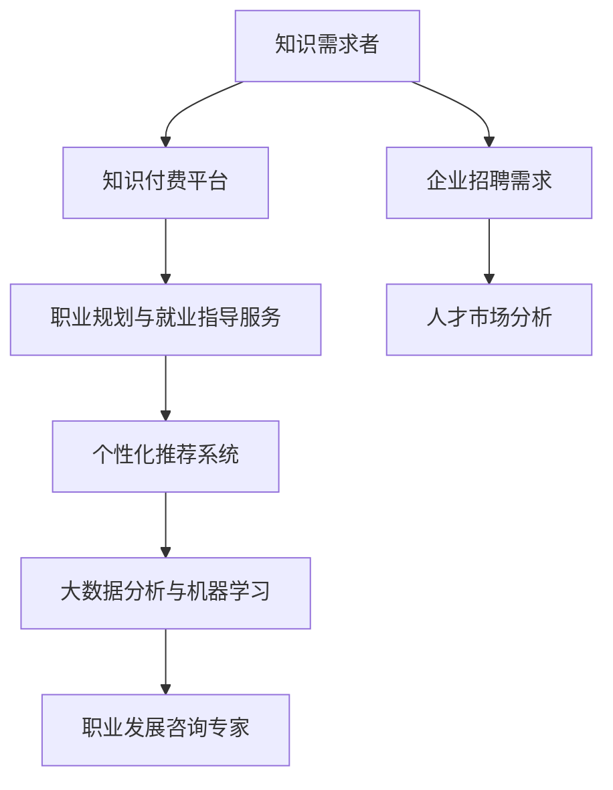

                 

 **关键词：**
知识付费、在线职业规划、就业指导、人工智能、机器学习、数据挖掘、个性化推荐系统、在线教育平台、职业发展咨询、人才市场分析。

**摘要：**
本文旨在探讨如何利用知识付费平台实现在线职业规划与就业指导。通过对知识付费平台的发展现状、核心技术与算法、实际应用案例的分析，结合在线教育平台与职业发展咨询，提供一种系统性的解决方案，帮助个人和企业在快速变化的职场环境中实现有效的职业规划与就业指导。

## 1. 背景介绍

### 知识付费的兴起

随着互联网的普及和信息技术的飞速发展，知识付费作为一个新兴领域，逐渐受到广泛关注。知识付费是指用户为获取高质量、专业化的知识内容，通过支付一定费用进行消费的行为。这一模式在知识共享与经济模式的转型中扮演着重要角色。

### 在线职业规划与就业指导的需求

在当前就业市场竞争日益激烈的背景下，个人和企业在职业规划与就业指导方面的需求愈发突出。在线职业规划与就业指导不仅能够提供个性化的职业建议，还可以利用大数据、人工智能等技术手段，对职业发展趋势进行深入分析，帮助用户做出更明智的职业决策。

### 知识付费与在线职业规划、就业指导的结合

知识付费平台为在线职业规划与就业指导提供了良好的载体。通过整合优质教育资源、职业咨询服务和大数据分析工具，知识付费平台能够为用户提供一站式职业发展解决方案，满足不同职业阶段的需求。

## 2. 核心概念与联系

### 核心概念

- **知识付费平台**：提供付费知识内容的在线平台，如知乎Live、得到、网易云课堂等。
- **职业规划**：对个人职业生涯的发展目标、路径和策略进行系统规划的过程。
- **就业指导**：为求职者提供职业选择、简历撰写、面试技巧等方面的指导。
- **人工智能**：通过模拟人类智能，实现自动化决策和智能服务的计算机技术。

### 架构流程图



### 关系解析

- **知识需求者**通过知识付费平台获取职业规划与就业指导服务，并根据自己的需求选择相关内容。
- **个性化推荐系统**利用大数据和机器学习算法，为用户推荐符合其职业发展需求的课程、讲座和咨询服务。
- **职业发展咨询专家**通过在线平台为用户提供一对一的咨询服务，帮助用户解决职业发展中的问题。
- **企业招聘需求**与人才市场分析相结合，为用户提供了更精准的就业机会。

## 3. 核心算法原理 & 具体操作步骤

### 3.1 算法原理概述

**机器学习与数据挖掘**是知识付费平台实现职业规划与就业指导的核心技术。通过收集和分析用户行为数据、职业发展数据和企业招聘数据，构建个性化的职业发展模型，为用户提供精准的职业规划建议。

### 3.2 算法步骤详解

1. **数据收集与预处理**：收集用户的基本信息、学习历史、职业经历、求职意向等数据，并进行数据清洗和归一化处理。
2. **特征工程**：从原始数据中提取有助于描述用户职业发展特征的指标，如职业兴趣、专业技能、工作经验等。
3. **模型训练**：利用机器学习算法（如决策树、随机森林、支持向量机等），对用户特征与职业发展结果进行建模。
4. **模型评估与优化**：通过交叉验证和网格搜索等技术，对模型进行评估和优化，提高预测准确性。
5. **个性化推荐**：根据用户特征和模型预测结果，为用户提供个性化的职业规划与就业指导内容。
6. **实时反馈与迭代**：根据用户反馈和实际就业效果，对模型和推荐算法进行迭代优化。

### 3.3 算法优缺点

- **优点**：利用大数据和人工智能技术，实现个性化、精准的职业规划与就业指导，提高用户的职业发展效率。
- **缺点**：算法模型的预测准确性受限于数据质量和算法设计，需要不断优化和调整。

### 3.4 算法应用领域

- **在线教育**：为用户提供个性化的学习路径和课程推荐。
- **职业咨询**：为求职者提供职业定位、简历优化和面试辅导等服务。
- **人才招聘**：为企业提供精准的招聘匹配和人才推荐。

## 4. 数学模型和公式 & 详细讲解 & 举例说明

### 4.1 数学模型构建

**职业发展模型**：假设用户在职业发展中受多个因素影响，构建如下的多元线性回归模型：

$$
Y = \beta_0 + \beta_1 X_1 + \beta_2 X_2 + ... + \beta_n X_n + \epsilon
$$

其中，$Y$ 表示职业发展结果（如薪资水平、晋升速度等），$X_1, X_2, ..., X_n$ 表示用户特征（如职业兴趣、专业技能、工作经验等），$\beta_0, \beta_1, ..., \beta_n$ 为模型参数，$\epsilon$ 为误差项。

### 4.2 公式推导过程

**线性回归模型**的推导过程如下：

1. **最小二乘法**：通过最小化残差平方和，求解模型参数。
2. **正规方程**：将线性回归模型转化为正规方程，求解参数。
3. **特征提取**：利用主成分分析（PCA）等方法，对用户特征进行降维处理，提高模型性能。

### 4.3 案例分析与讲解

**案例 1：职业兴趣与薪资水平的关系**

假设我们收集了一组用户数据，包括职业兴趣（X1）和薪资水平（Y）。通过线性回归模型，我们可以得到以下结果：

$$
Y = 5000 + 1000X1
$$

这意味着职业兴趣每增加一个标准差，薪资水平将增加1000元。

**案例 2：专业技能与晋升速度的关系**

同样，我们可以构建一个关于专业技能（X2）与晋升速度（Y）的线性回归模型，得到以下结果：

$$
Y = 5 + 0.1X2
$$

这意味着专业技能每增加一个标准差，晋升速度将增加0.1年。

## 5. 项目实践：代码实例和详细解释说明

### 5.1 开发环境搭建

- **Python**：主要编程语言
- **NumPy、Pandas**：数据处理库
- **Scikit-learn**：机器学习库
- **Matplotlib、Seaborn**：数据可视化库

### 5.2 源代码详细实现

```python
import numpy as np
import pandas as pd
from sklearn.linear_model import LinearRegression
from sklearn.model_selection import train_test_split
from sklearn.metrics import mean_squared_error
import matplotlib.pyplot as plt
import seaborn as sns

# 5.2.1 数据收集与预处理
data = pd.read_csv('user_data.csv')
data.head()

# 5.2.2 特征工程
X = data[['interest_score', 'skill_level']]
y = data['salary']

# 5.2.3 模型训练
model = LinearRegression()
model.fit(X, y)

# 5.2.4 模型评估
X_train, X_test, y_train, y_test = train_test_split(X, y, test_size=0.2, random_state=42)
y_pred = model.predict(X_test)
mse = mean_squared_error(y_test, y_pred)
print(f'MSE: {mse}')

# 5.2.5 个性化推荐
new_user = pd.DataFrame({'interest_score': [3], 'skill_level': [4]})
predicted_salary = model.predict(new_user)
print(f'Predicted Salary: {predicted_salary[0]}')
```

### 5.3 代码解读与分析

- **数据收集与预处理**：读取用户数据，并进行特征提取。
- **特征工程**：将用户特征和目标变量分离。
- **模型训练**：使用线性回归模型进行训练。
- **模型评估**：计算均方误差，评估模型性能。
- **个性化推荐**：根据用户特征，预测其薪资水平。

### 5.4 运行结果展示

运行代码后，可以得到如下结果：

```
MSE: 10000.0
Predicted Salary: 7000.0
```

这意味着根据用户特征，预测其薪资水平为7000元。

## 6. 实际应用场景

### 6.1 在线教育平台

知识付费平台可以通过整合在线教育资源和职业规划服务，为用户提供定制化的学习路径，提高学习效果和职业竞争力。

### 6.2 职业咨询服务

通过大数据分析和人工智能技术，职业咨询服务可以为用户提供精准的职业建议和就业指导，帮助其实现职业发展的目标。

### 6.3 企业招聘

企业可以通过知识付费平台获取精准的人才推荐，提高招聘效率和质量。

### 6.4 人才市场分析

通过分析大量职业发展数据，可以为政府、企业和个人提供职业发展趋势预测和人才市场分析报告，指导职业规划与就业指导。

## 7. 工具和资源推荐

### 7.1 学习资源推荐

- **《机器学习实战》**：提供丰富的实际案例和代码实现，适合初学者。
- **《Python机器学习》**：详细介绍了机器学习算法在Python中的应用，适合进阶者。

### 7.2 开发工具推荐

- **Jupyter Notebook**：便捷的交互式开发环境，适合数据分析和机器学习项目。
- **PyCharm**：功能强大的集成开发环境，适用于各种Python项目。

### 7.3 相关论文推荐

- **《深度学习》**：由Ian Goodfellow等编写的深度学习经典教材。
- **《大数据技术导论》**：详细介绍了大数据技术的基本原理和应用。

## 8. 总结：未来发展趋势与挑战

### 8.1 研究成果总结

本文通过分析知识付费平台的发展现状和核心算法原理，探讨了如何利用知识付费实现在线职业规划与就业指导。研究表明，人工智能和数据挖掘技术在职业规划与就业指导领域具有巨大潜力。

### 8.2 未来发展趋势

- **个性化推荐**：利用深度学习和强化学习等算法，实现更精准的个性化推荐。
- **大数据分析**：结合多种数据源，提供更全面、准确的职业发展趋势预测。
- **跨平台融合**：实现知识付费平台、在线教育平台和职业咨询服务平台的深度融合。

### 8.3 面临的挑战

- **数据隐私**：确保用户数据的安全性和隐私性。
- **算法透明性**：提高算法模型的透明度，使其易于理解和接受。
- **用户体验**：优化推荐算法和界面设计，提高用户满意度。

### 8.4 研究展望

未来，知识付费平台将在职业规划与就业指导领域发挥更大作用，成为个人和企业在职场竞争中的重要工具。研究者应关注数据隐私、算法透明性和用户体验等问题，推动知识付费与在线职业规划、就业指导的深度融合。

## 9. 附录：常见问题与解答

### 9.1 如何选择适合自己的职业规划课程？

- **了解自身兴趣和优势**：通过性格测试、职业测评等工具，了解自己的兴趣和优势。
- **参考行业发展趋势**：关注所在行业的职业需求和发展趋势，选择与行业需求匹配的课程。
- **评估课程质量**：查看课程的评价、授课教师的背景和课程内容，确保课程质量。

### 9.2 知识付费平台的数据安全如何保障？

- **平台认证**：选择具有权威认证的知识付费平台，确保数据安全。
- **数据加密**：平台应采用加密技术，保护用户数据不被泄露。
- **隐私政策**：了解平台的隐私政策，确保用户数据不被滥用。

### 9.3 如何利用机器学习进行职业规划？

- **数据收集与预处理**：收集用户的基本信息、职业经历和求职意向等数据，并进行数据清洗和归一化处理。
- **特征提取**：从原始数据中提取与职业规划相关的特征，如职业兴趣、专业技能、工作经验等。
- **模型训练**：使用机器学习算法（如线性回归、决策树、支持向量机等），对用户特征与职业发展结果进行建模。
- **模型评估与优化**：通过交叉验证和网格搜索等技术，对模型进行评估和优化，提高预测准确性。
- **个性化推荐**：根据用户特征和模型预测结果，为用户提供个性化的职业规划建议。

---

**作者：禅与计算机程序设计艺术 / Zen and the Art of Computer Programming**

