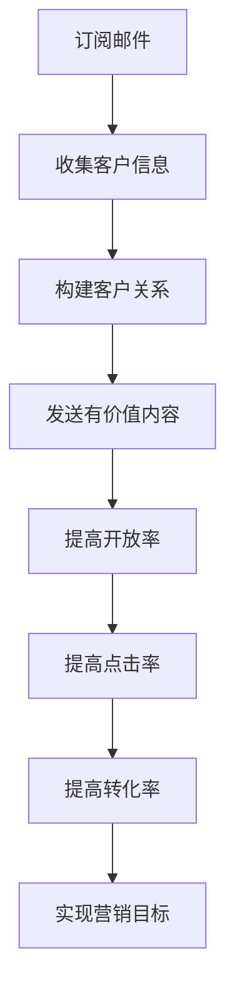

                 

关键词：邮件营销、知识付费、推广策略、客户维护、转化率优化

> 摘要：在数字营销时代，邮件营销作为一种古老但依然有效的推广手段，正逐渐成为知识付费产品推广的重要工具。本文将探讨如何利用邮件营销策略提升知识付费产品的推广效果，从构建客户关系、提高邮件开放率和点击率、到优化转化率等方面进行深入分析，并分享实用的工具和资源，为知识付费从业者提供实用的推广指南。

## 1. 背景介绍

随着互联网的发展，知识付费市场正在迅速扩张。越来越多的人愿意为获取高质量的知识和技能付费，这为知识付费产品提供了广阔的市场空间。然而，如何在众多竞争者中脱颖而出，成为知识付费产品推广的关键挑战。

邮件营销，作为一种传统的数字营销手段，以其低成本和高回报的特点，在知识付费产品的推广中发挥着重要作用。通过精准的邮件内容、个性化的客户服务和高效的跟踪策略，邮件营销可以帮助知识付费产品提高用户参与度和转化率。

本文将结合实际案例，详细探讨如何利用邮件营销策略来推广知识付费产品，旨在为从业者提供一套实用的操作指南。

## 2. 核心概念与联系

在开始具体的邮件营销策略之前，我们需要理解几个核心概念：客户关系管理（CRM）、邮件列表、开放率、点击率、转化率等。

### 2.1 客户关系管理（CRM）

客户关系管理是一种旨在提高企业与客户之间互动质量的方法。通过CRM系统，企业可以收集客户信息，分析客户行为，从而提供更加个性化的服务和产品推荐。在知识付费产品的推广中，CRM系统可以帮助我们了解客户的偏好，从而制定更加精准的营销策略。

### 2.2 邮件列表

邮件列表是邮件营销的基础。它是指一群已经同意接收你发送的邮件的用户列表。通过定期发送有价值的内容，邮件列表可以帮助我们与客户建立长期的关系，并提高客户对产品的认知和兴趣。

### 2.3 开放率

邮件开放率是指用户打开邮件的比例。它是衡量邮件营销效果的重要指标。要提高开放率，我们需要确保邮件标题具有吸引力，内容有价值，并且邮件样式设计得引人注目。

### 2.4 点击率

点击率是指用户点击邮件中链接的比例。点击率直接关系到邮件营销的转化效果。提高点击率的关键在于邮件内容的吸引力，包括内容的价值、标题的吸引力，以及链接的清晰度。

### 2.5 转化率

转化率是指用户完成预定的目标动作（如购买、注册、下载等）的比例。它是衡量邮件营销最终效果的关键指标。通过优化邮件内容、提升用户体验，我们可以有效提高转化率。

### 2.6 Mermaid 流程图

下面是一个用于展示邮件营销流程的Mermaid流程图：



## 3. 核心算法原理 & 具体操作步骤

### 3.1 算法原理概述

邮件营销的核心在于构建客户关系，并通过有价值的内容提高用户的参与度和转化率。具体来说，我们可以通过以下步骤实现邮件营销的优化：

1. **收集客户信息**：通过网站表单、社交媒体、线下活动等方式收集客户的电子邮件地址。
2. **构建客户关系**：定期发送有价值的内容，建立与客户的长期关系。
3. **发送有价值内容**：提供高质量的内容，包括行业资讯、教程、案例分析等，以提高用户的参与度。
4. **提高开放率**：通过吸引人的邮件标题和设计，提高邮件的打开率。
5. **提高点击率**：优化邮件内容，确保内容有价值、吸引人，并清晰地标出链接。
6. **提高转化率**：通过个性化的推荐、优惠活动等方式，提高用户的购买意愿。

### 3.2 算法步骤详解

#### 步骤1：收集客户信息

- **在线表单**：在网站首页、产品页面、教程页面等地方放置在线表单，让用户填写电子邮件地址以获取更多内容。
- **社交媒体**：通过社交媒体平台（如微信、微博、LinkedIn等）收集潜在客户的电子邮件。
- **线下活动**：在参加线下活动时，通过问卷或名片交换等方式收集电子邮件地址。

#### 步骤2：构建客户关系

- **欢迎邮件**：新用户订阅后，立即发送一封欢迎邮件，表达感谢，并介绍公司的产品和服务。
- **定期更新**：定期发送邮件，更新公司动态、行业资讯、产品优惠等，保持与客户的互动。
- **个性化推荐**：根据客户的历史行为和偏好，发送个性化的邮件推荐。

#### 步骤3：发送有价值内容

- **行业资讯**：分享行业最新的动态和趋势，提供有价值的信息。
- **教程和案例分析**：提供高质量的教程和案例分析，帮助用户解决问题，提高技能。
- **产品介绍**：详细介绍产品的特点、优势和适用场景，让用户更好地了解产品。

#### 步骤4：提高开放率

- **标题优化**：使用有吸引力的标题，让用户产生好奇心，提高打开邮件的欲望。
- **设计优化**：设计简洁、美观的邮件模板，确保邮件在客户端展示效果良好。

#### 步骤5：提高点击率

- **内容价值**：确保邮件内容有价值，解决用户的问题或提供有用的信息。
- **链接清晰**：在邮件中突出链接，使用明确的按钮或文字引导用户点击。

#### 步骤6：提高转化率

- **个性化推荐**：根据用户的偏好和购买历史，推荐相关的产品或服务。
- **优惠活动**：提供限时优惠、折扣等，刺激用户的购买欲望。
- **跟进邮件**：在用户访问网站后，发送跟进邮件，提醒用户购买或了解更多信息。

### 3.3 算法优缺点

**优点**：

- **低成本**：邮件营销相对于其他营销手段（如广告投放、线下活动等）成本较低。
- **高回报**：邮件营销可以带来较高的转化率和投资回报率。
- **可量化**：通过追踪邮件的打开率、点击率、转化率等数据，可以量化营销效果，便于调整策略。

**缺点**：

- **竞争激烈**：由于邮件营销的普及，用户对邮件的注意力有限，竞争激烈。
- **效果不稳定**：邮件营销效果受到多种因素影响，如邮件标题、内容质量、发送时间等。

### 3.4 算法应用领域

邮件营销适用于多种知识付费产品，如在线课程、电子书、专业咨询、会员服务等。通过个性化的邮件内容和精准的推广策略，邮件营销可以帮助知识付费产品提高用户参与度和转化率。

## 4. 数学模型和公式 & 详细讲解 & 举例说明

### 4.1 数学模型构建

在邮件营销中，我们可以使用以下数学模型来衡量营销效果：

- **开放率（Open Rate）**：  
  $$OR = \frac{Opened Emails}{Sent Emails} \times 100\%$$

- **点击率（Click Through Rate）**：  
  $$CTR = \frac{Clicked Links}{Opened Emails} \times 100\%$$

- **转化率（Conversion Rate）**：  
  $$CR = \frac{Conversions}{Clicked Links} \times 100\%$$

- **投资回报率（Return on Investment，ROI）**：  
  $$ROI = \frac{Revenue}{Cost of Campaign} \times 100\%$$

### 4.2 公式推导过程

以上公式是根据邮件营销的各个指标定义推导而来的。其中，开放率表示邮件被用户打开的比例，点击率表示打开邮件后点击链接的比例，转化率表示点击链接后完成预定目标动作的比例，投资回报率表示营销投入产生的收益与成本的比率。

### 4.3 案例分析与讲解

假设一家在线课程平台通过邮件营销推广一门新课程，邮件发送了1000份，其中500份被打开，100份点击了链接，最终有20份成功报名。

- **开放率**：  
  $$OR = \frac{500}{1000} \times 100\% = 50\%$$

- **点击率**：  
  $$CTR = \frac{100}{500} \times 100\% = 20\%$$

- **转化率**：  
  $$CR = \frac{20}{100} \times 100\% = 20\%$$

- **投资回报率**：  
  假设课程的报名费用为200元，邮件营销的成本为1000元，则：  
  $$ROI = \frac{20 \times 200}{1000} \times 100\% = 40\%$$

通过以上数据分析，我们可以看出，该邮件营销活动的开放率、点击率和转化率均较高，投资回报率也相当可观。

## 5. 项目实践：代码实例和详细解释说明

### 5.1 开发环境搭建

在开始编写邮件营销代码之前，我们需要搭建一个合适的开发环境。以下是一个基本的步骤：

- **选择邮件营销平台**：例如，Mailchimp、SendGrid等。
- **注册账户**：在所选平台上注册一个账户。
- **创建邮件模板**：设计一个吸引人的邮件模板。
- **整合API**：将邮件营销平台与网站或应用程序整合，使用API进行数据交互。

### 5.2 源代码详细实现

以下是一个简单的Python示例，用于发送一封邮件营销邮件：

```python
import smtplib
from email.mime.text import MIMEText
from email.mime.multipart import MIMEMultipart

def send_email(sender, receiver, subject, content):
    # 设置服务器地址和端口
    smtp_server = "smtp.example.com"
    smtp_port = 587
    
    # 设置发送者、接收者和邮件主题
    msg = MIMEMultipart()
    msg['From'] = sender
    msg['To'] = receiver
    msg['Subject'] = subject
    
    # 添加邮件正文
    msg.attach(MIMEText(content, 'plain'))
    
    # 发送邮件
    try:
        server = smtplib.SMTP(smtp_server, smtp_port)
        server.starttls()
        server.login("your_username", "your_password")
        server.send_message(msg)
        print("邮件发送成功！")
    except Exception as e:
        print("邮件发送失败！原因：", e)
    finally:
        server.quit()

# 发送邮件示例
sender = "you@example.com"
receiver = "recipient@example.com"
subject = "欢迎订阅我们的课程！"
content = "亲爱的用户，感谢您订阅我们的课程。请点击以下链接查看更多课程信息：[查看课程](http://www.example.com/course)"
send_email(sender, receiver, subject, content)
```

### 5.3 代码解读与分析

上述代码实现了一个简单的邮件发送功能。以下是代码的详细解读：

- **MIMEMultipart**：用于创建一个复合邮件，可以包含文本、图片等多种内容。
- **MIMEText**：用于创建文本邮件内容。
- **SMTP**：用于发送邮件的服务器协议。
- **starttls**：用于将SMTP服务器升级到TLS加密。
- **login**：用于登录SMTP服务器。
- **send_message**：用于发送邮件。

### 5.4 运行结果展示

运行上述代码后，会向指定的接收邮箱发送一封邮件。邮件的主题为“欢迎订阅我们的课程！”，内容包括欢迎语和课程链接。如果接收者点击链接，将会被引导至课程页面。

## 6. 实际应用场景

邮件营销在知识付费产品的推广中有着广泛的应用场景。以下是一些典型的应用场景：

### 6.1 课程推广

通过邮件向订阅用户发送新课程的信息，包括课程大纲、讲师介绍、课程优惠等，吸引更多用户报名。

### 6.2 会员服务

向会员发送每月或每季度的会员专属福利、活动信息等，提高会员的忠诚度和活跃度。

### 6.3 专业咨询

向潜在客户发送专业咨询的邀请函，包括咨询服务的内容、流程、价格等，促进咨询服务的成交。

### 6.4 行业报告

定期向订阅用户发送行业报告，分享行业动态、趋势分析和市场机会，提升公司在行业内的知名度。

## 7. 未来应用展望

随着人工智能和大数据技术的发展，邮件营销将进一步智能化和个性化。未来，我们可以期待以下发展趋势：

### 7.1 智能化推荐

通过分析用户行为和偏好，邮件营销平台将能够实现更加精准的个性化推荐，提高营销效果。

### 7.2 自动化流程

邮件营销的自动化程度将进一步提高，包括自动化发送、自动化跟进、自动化分析等，降低人力成本。

### 7.3 大数据分析

通过大数据分析，邮件营销将能够更好地了解用户需求和市场趋势，为营销策略提供有力支持。

## 8. 工具和资源推荐

### 8.1 学习资源推荐

- **《邮件营销实战》**：一本全面介绍邮件营销策略和技巧的书籍。
- **Mailchimp 官方文档**：提供详细的邮件营销教程和实践指南。

### 8.2 开发工具推荐

- **Mailchimp API**：用于与Mailchimp平台进行数据交互。
- **SendGrid API**：提供丰富的邮件发送和追踪功能。

### 8.3 相关论文推荐

- **"The Impact of Email Marketing on Customer Engagement"**：探讨邮件营销对客户参与度的影响。
- **"Personalization in Email Marketing"**：分析个性化邮件营销的策略和效果。

## 9. 总结：未来发展趋势与挑战

随着数字营销技术的不断进步，邮件营销在知识付费产品推广中的作用将日益凸显。未来，邮件营销将朝着智能化、自动化、个性化的方向发展，为知识付费从业者提供更加高效的推广工具。然而，面临的挑战也是不容忽视的，包括用户隐私保护、竞争加剧、效果评估等。只有不断优化策略，创新方法，才能在激烈的市场竞争中脱颖而出。

### 9.1 研究成果总结

本文通过对邮件营销在知识付费产品推广中的应用进行分析，总结了邮件营销的核心概念、算法原理、具体操作步骤，以及数学模型和公式。通过实际案例和代码实例，详细展示了如何利用邮件营销策略提高知识付费产品的推广效果。

### 9.2 未来发展趋势

随着人工智能和大数据技术的应用，邮件营销将变得更加智能化和个性化。未来的邮件营销将能够更好地满足用户需求，提高营销效果。

### 9.3 面临的挑战

邮件营销面临的挑战主要包括用户隐私保护、竞争加剧、效果评估等。从业者需要不断创新，优化策略，以应对这些挑战。

### 9.4 研究展望

未来的研究可以进一步探讨邮件营销在知识付费产品推广中的最佳实践，以及如何利用人工智能和大数据技术提升邮件营销的效果。

## 附录：常见问题与解答

### 9.1 邮件营销的合法性？

邮件营销需要遵循相关的法律法规，如《中华人民共和国网络安全法》等。在收集用户信息时，需要明确告知用户信息的使用目的，并得到用户的明确同意。

### 9.2 如何避免邮件被误标为垃圾邮件？

确保邮件内容有价值，标题真实，避免使用诱导性语言。同时，定期清理无效邮件地址，优化邮件发送频率。

### 9.3 如何衡量邮件营销的效果？

可以通过开放率、点击率、转化率等指标来衡量邮件营销的效果。此外，还可以通过用户反馈、销售数据等指标进行综合评估。

### 9.4 邮件营销是否适用于所有知识付费产品？

邮件营销适用于大多数知识付费产品，但不同产品可能需要不同的营销策略。关键在于了解目标用户的需求和偏好，制定个性化的营销方案。

### 9.5 如何避免用户投诉和退订？

在邮件内容中提供清晰的退订选项，并在发送频率上保持适度。同时，确保邮件内容对用户有价值，避免过度营销。

### 9.6 邮件营销与社交媒体营销的关系如何？

邮件营销和社交媒体营销可以相互补充。邮件营销可以提供个性化的内容和服务，而社交媒体营销则可以扩大品牌的知名度和影响力。两者结合使用，可以取得更好的营销效果。

作者：禅与计算机程序设计艺术 / Zen and the Art of Computer Programming
----------------------------------------------------------------

以上就是关于如何利用邮件营销推广知识付费产品的完整文章。本文通过详细的章节结构和专业的技术语言，深入分析了邮件营销的核心概念、算法原理、操作步骤以及实际应用场景，为知识付费从业者提供了实用的推广指南。在未来的发展中，邮件营销将继续发挥重要作用，但从业者需要不断创新和优化策略，以应对市场挑战。希望本文能为您在知识付费产品推广中提供有益的启示。

