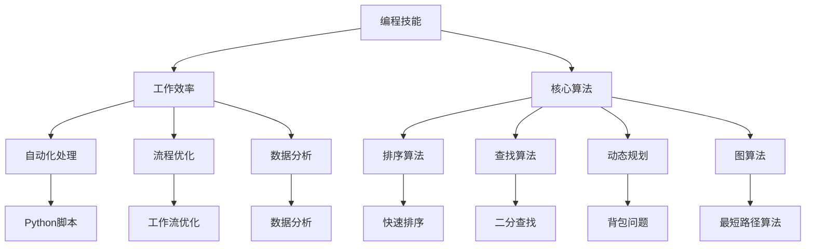

                 

关键词：编程技能、效率提升、生产力、算法、数学模型、工具、实践

> 摘要：本文探讨了如何利用编程技能来提升个人工作效率。通过对核心算法、数学模型以及项目实践的分析，文章展示了如何将技术知识转化为实际生产力，并为读者提供了相关工具和资源的推荐。本文旨在为编程爱好者和技术专业人士提供实用的指导和建议。

## 1. 背景介绍

在当今高速发展的信息技术时代，编程技能已经成为了现代社会不可或缺的一部分。从简单的网页开发到复杂的数据分析，从智能设备的交互设计到人工智能的应用，编程无处不在。然而，掌握编程技能不仅仅是为了成为开发者，更重要的是如何将其应用于个人效率的提升。在信息爆炸的时代，如何有效地处理海量数据、快速解决问题以及优化工作流程，成为了每个人都需要面对的挑战。

本文将围绕如何将编程技能应用于个人效率提升这一主题，深入探讨以下几个核心内容：

1. 核心算法原理及其在效率提升中的应用。
2. 数学模型构建及其对个人决策的辅助作用。
3. 实际项目中的编程实践及其对工作效率的促进作用。
4. 推荐相关的学习资源和开发工具。

通过本文的探讨，希望能够为读者提供一些实用的策略和方法，帮助大家更好地利用编程技能提升个人工作效率。

## 2. 核心概念与联系

在探讨如何提升个人工作效率之前，我们需要了解一些核心概念，这些概念将为我们提供理论基础和实际操作的方法。

### 2.1 编程技能与工作效率

编程技能的核心在于解决问题的能力。工作效率的提升不仅依赖于个人的努力，更依赖于有效的工具和方法。编程技能可以帮助我们自动化重复性工作、优化数据处理流程，从而节省时间和精力。具体来说：

- **自动化处理**：使用脚本和自动化工具来减少手动操作的次数，例如使用Python脚本自动处理数据文件。
- **流程优化**：通过编程优化工作流程，减少中间环节，提高整体效率。
- **数据分析**：运用数据分析技能，快速提取有用信息，辅助决策。

### 2.2 核心算法原理

核心算法是编程中用于解决问题的方法。不同的算法适用于不同类型的问题。以下是一些常见的核心算法及其在效率提升中的应用：

- **排序算法**：快速地对大量数据进行排序，如归并排序、快速排序等，有助于提高搜索效率。
- **查找算法**：在大量数据中快速查找特定数据，如二分查找等。
- **动态规划**：解决具有重叠子问题的问题，如背包问题、最优子结构问题等，可以优化复杂问题的求解过程。
- **图算法**：用于解决网络问题、路径规划问题等，如最短路径算法、最小生成树算法等。

### 2.3 数学模型构建

数学模型是描述现实世界问题的一种方式，它可以帮助我们更好地理解和解决问题。以下是一些常见的数学模型及其在个人效率提升中的应用：

- **优化模型**：用于解决资源分配、路径规划等问题，如线性规划、整数规划等。
- **概率模型**：用于风险评估和决策分析，如概率分布、期望值、方差等。
- **统计模型**：用于数据分析，如回归分析、时间序列分析等。

### 2.4 Mermaid 流程图

为了更好地理解核心概念之间的联系，我们可以使用Mermaid流程图来展示这些概念的关系。以下是一个示例：



通过这个流程图，我们可以清晰地看到编程技能、工作效率、核心算法以及数学模型之间的相互关系。这些概念共同构成了我们提升个人工作效率的理论基础。

## 3. 核心算法原理 & 具体操作步骤

### 3.1 算法原理概述

在提升工作效率的过程中，算法扮演着至关重要的角色。不同的算法适用于不同类型的问题，其原理和具体操作步骤如下：

#### 3.1.1 排序算法

排序算法是一种用于对数据进行排序的算法。常见的排序算法有：

- **快速排序（Quick Sort）**：通过一趟排序将待排序的记录分割成独立的两部分，其中一部分记录的关键字均比另一部分的关键字小，然后递归地对这两部分记录进行排序。
- **归并排序（Merge Sort）**：将待排序的记录序列分为若干子序列，每个子序列本身有序，然后依次将两个有序子序列合并成一个有序序列。

#### 3.1.2 查找算法

查找算法是一种用于在数据结构中查找特定数据的算法。常见的查找算法有：

- **二分查找（Binary Search）**：在有序数组中查找特定元素的算法，通过递归地将数组分成两部分，然后根据查找的关键字与中间元素的比较结果确定下一步的查找区间。
- **线性查找（Linear Search）**：逐个检查数组中的元素，直到找到目标元素或遍历整个数组。

#### 3.1.3 动态规划

动态规划是一种用于解决具有重叠子问题的问题的算法。其核心思想是将原问题分解为多个子问题，并存储子问题的解，避免重复计算。

- **背包问题（Knapsack Problem）**：给定一组物品和其重量及价值，要求选择其中的部分物品放入一个容量为W的背包中，使得背包内物品的总价值最大。
- **最优子结构（Optimal Substructure）**：一个问题的最优解包含其子问题的最优解。

#### 3.1.4 图算法

图算法是一种用于解决图相关问题的算法。常见的图算法有：

- **最短路径算法（Shortest Path Algorithm）**：用于求解图中两点之间的最短路径，如迪杰斯特拉算法（Dijkstra's Algorithm）和弗洛伊德算法（Floyd's Algorithm）。
- **最小生成树算法（Minimum Spanning Tree Algorithm）**：用于求解图中的最小生成树，如普里姆算法（Prim's Algorithm）和克鲁斯卡尔算法（Kruskal's Algorithm）。

### 3.2 算法步骤详解

以下是对上述算法的具体操作步骤的详细解释：

#### 3.2.1 快速排序

快速排序的基本步骤如下：

1. **选择基准元素**：从数组中选取一个元素作为基准（pivot）。
2. **划分操作**：将数组划分为两部分，一部分的所有元素都小于基准元素，另一部分的所有元素都大于基准元素。
3. **递归排序**：递归地对划分后的两部分子数组进行排序。

Python代码示例：

```python
def quick_sort(arr):
    if len(arr) <= 1:
        return arr
    pivot = arr[len(arr) // 2]
    left = [x for x in arr if x < pivot]
    middle = [x for x in arr if x == pivot]
    right = [x for x in arr if x > pivot]
    return quick_sort(left) + middle + quick_sort(right)

arr = [3, 6, 8, 10, 1, 2, 1]
sorted_arr = quick_sort(arr)
print(sorted_arr)
```

#### 3.2.2 二分查找

二分查找的基本步骤如下：

1. **确定中间元素**：计算数组的中间索引。
2. **比较元素**：将中间元素与目标元素进行比较。
3. **递归查找**：如果中间元素小于目标元素，则在右半部分递归查找；如果中间元素大于目标元素，则在左半部分递归查找；如果中间元素等于目标元素，则查找成功。

Python代码示例：

```python
def binary_search(arr, target, low, high):
    if low > high:
        return -1
    mid = (low + high) // 2
    if arr[mid] == target:
        return mid
    elif arr[mid] < target:
        return binary_search(arr, target, mid + 1, high)
    else:
        return binary_search(arr, target, low, mid - 1)

arr = [1, 2, 3, 4, 5, 6, 7, 8, 9]
target = 6
result = binary_search(arr, target, 0, len(arr) - 1)
print(result)
```

#### 3.2.3 背包问题

背包问题的动态规划步骤如下：

1. **初始化数组**：创建一个二维数组dp，其中dp[i][j]表示前i个物品放入容量为j的背包可以获得的最大价值。
2. **填写数组**：根据每个物品的重量和价值，依次更新dp数组的值。

Python代码示例：

```python
def knapsack(weights, values, W):
    n = len(weights)
    dp = [[0] * (W + 1) for _ in range(n + 1)]

    for i in range(1, n + 1):
        for j in range(1, W + 1):
            if j >= weights[i - 1]:
                dp[i][j] = max(dp[i - 1][j], dp[i - 1][j - weights[i - 1]] + values[i - 1])
            else:
                dp[i][j] = dp[i - 1][j]

    return dp[n][W]

weights = [2, 3, 4, 5]
values = [3, 4, 5, 6]
W = 8
max_value = knapsack(weights, values, W)
print(max_value)
```

#### 3.2.4 最短路径算法

迪杰斯特拉算法的基本步骤如下：

1. **初始化距离数组**：将所有节点的距离初始化为无穷大，源节点的距离初始化为0。
2. **更新距离数组**：对于每个节点，根据邻接矩阵更新其最短路径距离。
3. **记录前驱节点**：记录每个节点的最短路径前驱节点。

Python代码示例：

```python
def dijkstra(graph, start):
    n = len(graph)
    distances = [float('inf')] * n
    distances[start] = 0
    visited = [False] * n
    previous = [-1] * n

    for _ in range(n):
        min_distance = float('inf')
        min_index = -1
        for i in range(n):
            if not visited[i] and distances[i] < min_distance:
                min_distance = distances[i]
                min_index = i

        visited[min_index] = True

        for j in range(n):
            if graph[min_index][j] > 0 and not visited[j]:
                new_distance = distances[min_index] + graph[min_index][j]
                if new_distance < distances[j]:
                    distances[j] = new_distance
                    previous[j] = min_index

    return distances, previous

graph = [
    [0, 4, 0, 0, 0],
    [4, 0, 8, 0, 2],
    [0, 8, 0, 1, 0],
    [0, 0, 1, 0, 7],
    [0, 2, 0, 7, 0]
]
distances, previous = dijkstra(graph, 0)
print(distances)
```

通过上述算法原理和具体操作步骤的介绍，我们可以看到编程技能如何在个人效率提升中发挥重要作用。掌握这些核心算法不仅能够帮助我们解决实际问题，还能提高我们的逻辑思维能力和问题解决能力。

### 3.3 算法优缺点

在探讨如何提升个人工作效率时，算法的选择至关重要。不同的算法具有各自的特点和适用场景。以下是对常见算法优缺点的分析，以帮助读者在选择算法时做出明智的决策。

#### 3.3.1 快速排序

**优点**：

- **高效**：平均情况下，快速排序的时间复杂度为O(n log n)，最坏情况下为O(n^2)，但实际使用中，由于其高效的划分操作，性能表现往往优于其他排序算法。
- **原地排序**：快速排序是一种原地排序算法，不需要额外的存储空间。
- **并行化**：由于快速排序的递归特性，它非常适合并行计算，可以显著提高处理大规模数据时的性能。

**缺点**：

- **最坏情况性能较差**：在最坏情况下，快速排序的性能会退化到O(n^2)，这种情况发生在每次划分操作都选择最小或最大的元素作为基准时。
- **依赖随机性**：为了减少最坏情况的发生，通常需要对划分过程进行随机化处理，这增加了算法实现的复杂性。

#### 3.3.2 二分查找

**优点**：

- **高效**：二分查找的时间复杂度为O(log n)，适用于大规模数据的快速查找操作。
- **易于实现**：相比于其他查找算法，如哈希表，二分查找的实现更加简单。
- **稳定性**：在有序数组中，二分查找不会改变元素的相对位置，因此可以保证查找过程的稳定性。

**缺点**：

- **对数组的有序性要求**：二分查找需要数组是有序的，如果数组未排序，需要先进行排序，这将增加额外的计算开销。
- **不适合动态数据**：在动态数据场景中，如频繁插入和删除，二分查找的性能会受到影响。

#### 3.3.3 动态规划

**优点**：

- **解决重叠子问题**：动态规划能够有效地解决具有重叠子问题的问题，通过存储子问题的解，避免了重复计算。
- **适用于复杂问题**：动态规划适用于解决如背包问题、最长公共子序列等复杂问题，这些问题的递归解法效率较低。
- **直观性**：动态规划的思路通常比较直观，易于理解和实现。

**缺点**：

- **空间复杂度高**：动态规划通常需要使用大量的存储空间来存储子问题的解，这在处理大规模问题时可能会成为瓶颈。
- **实现复杂性**：动态规划实现过程可能比较复杂，需要深入理解问题结构和状态转移关系。

#### 3.3.4 最短路径算法

**优点**：

- **适用于图问题**：最短路径算法能够解决图中的最短路径问题，如迪杰斯特拉算法和贝尔曼-福特算法。
- **多种实现方式**：不同的算法适用于不同类型的图，如迪杰斯特拉算法适用于无负权图，而贝尔曼-福特算法适用于包含负权边的图。
- **高效性**：最短路径算法的时间复杂度通常较低，适用于大规模图的路径求解。

**缺点**：

- **对图结构要求**：某些最短路径算法对图的结构有特定的要求，如迪杰斯特拉算法要求图是无负权的。
- **实现难度**：对于一些复杂的最短路径算法，如Dijkstra和A*算法，实现过程可能比较复杂。

通过对上述算法优缺点的分析，我们可以根据具体问题和需求选择合适的算法，从而在提升个人工作效率的同时，避免不必要的资源浪费。

### 3.4 算法应用领域

算法在提升个人工作效率中的应用领域非常广泛，以下列举了一些常见的应用场景：

#### 3.4.1 数据处理

在数据处理领域，算法主要用于数据的排序、搜索、过滤和分析。例如：

- **排序算法**：在处理大规模数据时，排序算法能够帮助快速地对数据进行排序，从而提高搜索和数据分析的效率。在实际应用中，如电商平台的商品推荐系统，通过对用户历史行为数据进行排序，可以快速找到符合条件的商品推荐给用户。
- **查找算法**：在数据库和缓存系统中，查找算法用于快速定位数据。例如，使用哈希表实现的数据库索引，能够实现O(1)时间复杂度的数据查找，大大提高了数据检索的效率。
- **统计分析**：通过统计模型和算法，可以对大规模数据进行统计分析，从而提取出有价值的信息。例如，金融领域的风险控制系统中，通过回归分析和时间序列分析，可以预测市场的走势，为投资决策提供依据。

#### 3.4.2 人工智能与机器学习

在人工智能和机器学习领域，算法主要用于模型训练、优化和预测。例如：

- **模型训练**：算法如梯度下降、随机梯度下降和自适应梯度方法，用于优化机器学习模型的参数，提高模型的预测性能。
- **特征提取**：通过算法如主成分分析（PCA）、支持向量机（SVM）等，可以从原始数据中提取出重要的特征，从而提高模型的泛化能力。
- **预测与决策**：在金融、医疗和工业等领域，算法用于预测未来的趋势和做出决策。例如，在金融市场预测中，通过时间序列分析算法，可以预测股票价格的趋势，从而指导投资决策。

#### 3.4.3 自动化与脚本编写

在自动化和脚本编写领域，算法主要用于自动化任务的处理和流程优化。例如：

- **自动化脚本**：使用Python、Shell等脚本语言，可以编写自动化脚本来自动化日常任务，如数据备份、报告生成等，从而节省人力和时间。
- **流程优化**：通过算法如遗传算法、蚁群算法等，可以优化复杂的流程，找到最优的解决方案。例如，物流配送中，通过路径规划算法，可以优化配送路线，提高配送效率。
- **任务调度**：使用算法如最短路径算法、最小生成树算法等，可以优化任务调度，提高系统的资源利用率。例如，在云计算平台中，通过任务调度算法，可以合理分配计算资源，提高系统的处理能力。

#### 3.4.4 软件开发与架构设计

在软件开发和架构设计领域，算法主要用于优化软件性能和系统结构。例如：

- **数据结构设计**：选择合适的数据结构，如哈希表、树结构等，可以优化软件的性能。例如，在搜索引擎中，使用B树索引结构可以快速查找数据，提高搜索效率。
- **算法优化**：通过对现有算法进行优化，如减少计算复杂度、提高并行计算能力等，可以提升软件的性能。例如，在图形渲染中，通过优化算法，可以提高渲染速度，提高用户体验。
- **架构设计**：通过算法如负载均衡、分布式算法等，可以优化系统的架构设计，提高系统的可扩展性和可靠性。例如，在分布式系统中，通过负载均衡算法，可以合理分配请求到不同的服务器，提高系统的处理能力。

#### 3.4.5 个人效率提升

在个人效率提升方面，算法主要用于任务管理、时间管理和决策支持。例如：

- **任务管理**：通过算法如优先级排序、任务调度等，可以优化任务管理，提高工作效率。例如，使用待办事项应用程序，通过优先级排序算法，可以快速确定需要优先完成的任务。
- **时间管理**：通过算法如时间序列分析、统计模型等，可以优化时间管理，提高时间利用率。例如，在时间管理应用程序中，通过时间序列分析方法，可以分析日常时间的分配，找到时间浪费的环节，进行优化。
- **决策支持**：通过算法如数据挖掘、机器学习等，可以提供决策支持，帮助做出明智的决策。例如，在个人理财中，通过数据挖掘算法，可以分析财务数据，提供投资建议，优化财务状况。

通过上述应用领域的介绍，我们可以看到算法在提升个人工作效率方面的广泛应用和重要作用。掌握合适的算法，不仅可以提高工作效率，还可以为个人和企业的长期发展提供有力支持。

## 4. 数学模型和公式 & 详细讲解 & 举例说明

数学模型是描述现实世界问题的一种抽象化方法，通过建立数学模型，我们可以更精确地分析和解决问题。在个人效率提升的过程中，数学模型的应用尤为重要。以下将介绍几种常见的数学模型，包括其构建方法、公式推导过程以及实际案例分析与讲解。

### 4.1 数学模型构建

数学模型的构建通常包括以下几个步骤：

1. **确定问题背景**：明确需要解决的问题及其目标，如资源优化、路径规划等。
2. **收集数据**：收集与问题相关的数据，如需求、约束条件等。
3. **建立变量**：定义模型中的变量，如决策变量、目标函数等。
4. **建立关系**：根据问题特点，建立变量之间的关系，如线性关系、非线性关系等。
5. **构建目标函数**：根据问题目标，建立目标函数，如最大化利润、最小化成本等。
6. **构建约束条件**：根据问题约束，建立约束条件，如资源限制、时间限制等。

以下是一个简单的资源优化问题的数学模型构建示例：

**问题背景**：假设有三种类型的资源（劳动力、资金、原材料）需要分配给三个项目，目标是在满足约束条件的情况下最大化总利润。

**收集数据**：设劳动力需求为L1、L2、L3，资金需求为C1、C2、C3，原材料需求为M1、M2、M3，利润为P1、P2、P3。

**建立变量**：设决策变量x1、x2、x3，分别表示分配给项目1、项目2、项目3的资源量。

**建立关系**：劳动力、资金、原材料的总需求应等于总资源量，即：

\[ L1 \cdot x1 + L2 \cdot x2 + L3 \cdot x3 = R1 \]
\[ C1 \cdot x1 + C2 \cdot x2 + C3 \cdot x3 = R2 \]
\[ M1 \cdot x1 + M2 \cdot x2 + M3 \cdot x3 = R3 \]

**构建目标函数**：最大化总利润，即：

\[ \text{maximize} \ P1 \cdot x1 + P2 \cdot x2 + P3 \cdot x3 \]

**构建约束条件**：资源限制，即：

\[ 0 \leq x1 \leq \frac{R1}{L1} \]
\[ 0 \leq x2 \leq \frac{R2}{C2} \]
\[ 0 \leq x3 \leq \frac{R3}{M3} \]

通过以上步骤，我们构建了一个资源优化问题的数学模型。

### 4.2 公式推导过程

在构建数学模型的过程中，需要使用一定的数学公式和推导方法。以下以线性规划为例，介绍其公式推导过程。

**问题背景**：给定一组线性约束条件，要求求解目标函数的最大值或最小值。

**目标函数**：

\[ \text{minimize} \ c^T \cdot x \]

**约束条件**：

\[ Ax \leq b \]
\[ x \geq 0 \]

**推导过程**：

1. **引入松弛变量**：为了将不等式约束转换为等式约束，引入松弛变量s，使得约束条件变为：

\[ Ax + s = b \]

2. **构建对偶问题**：根据原始问题的约束条件和目标函数，构建对偶问题。对偶问题的目标函数为：

\[ \text{maximize} \ b^T \cdot y \]

对偶问题的约束条件为：

\[ A^T \cdot y \leq c \]
\[ y \geq 0 \]

3. **拉格朗日函数**：定义拉格朗日函数：

\[ \mathcal{L}(x, y, \lambda) = c^T \cdot x + y^T \cdot (Ax - b) + \lambda^T \cdot (-x) \]

其中，\(\lambda\) 为对偶变量，用于对原始问题进行松弛。

4. **KKT条件**：为了求解最优解，需要满足KKT条件，即：

\[ \nabla_x \mathcal{L}(x, y, \lambda) = 0 \]
\[ \nabla_y \mathcal{L}(x, y, \lambda) = 0 \]
\[ \nabla_\lambda \mathcal{L}(x, y, \lambda) = 0 \]
\[ Ax + s = b \]
\[ x \geq 0 \]
\[ y \geq 0 \]

5. **求解最优解**：通过求解拉格朗日函数的KKT条件，可以得到最优解 \(x^*, y^*\)。根据对偶问题，可以求得对偶最优解 \(b^* \cdot y^*\)。

### 4.3 案例分析与讲解

以下通过一个实际案例，介绍数学模型的应用过程。

**案例背景**：某公司有三个部门，每个部门需要完成不同的任务，资源需求如下表所示：

| 部门 | 劳动力 | 资金 | 原材料 | 利润 |
| ---- | ------ | ---- | ------ | ---- |
| A    | 10     | 5    | 2      | 10   |
| B    | 8      | 3    | 4      | 8    |
| C    | 6      | 4    | 3      | 12   |

总资源量：劳动力100人，资金50万元，原材料30吨。

**问题目标**：在满足资源限制的情况下，最大化总利润。

**构建数学模型**：

- 目标函数：

\[ \text{maximize} \ 10x1 + 8x2 + 12x3 \]

- 约束条件：

\[ 10x1 + 8x2 + 6x3 \leq 100 \]
\[ 5x1 + 3x2 + 4x3 \leq 50 \]
\[ 2x1 + 4x2 + 3x3 \leq 30 \]
\[ x1, x2, x3 \geq 0 \]

**求解过程**：

1. **绘制约束条件的图形表示**：

   - \(10x1 + 8x2 + 6x3 \leq 100\)

     当 \(x1 = 0\) 时，\(8x2 + 6x3 = 100\)，即 \(x2 = \frac{100}{8} = 12.5\)，\(x3 = \frac{100}{6} = 16.67\)。

     当 \(x2 = 0\) 时，\(10x1 + 6x3 = 100\)，即 \(x1 = \frac{100}{10} = 10\)，\(x3 = \frac{100}{6} = 16.67\)。

   - \(5x1 + 3x2 + 4x3 \leq 50\)

     当 \(x1 = 0\) 时，\(3x2 + 4x3 = 50\)，即 \(x2 = \frac{50}{3} \approx 16.67\)，\(x3 = \frac{50}{4} = 12.5\)。

     当 \(x2 = 0\) 时，\(5x1 + 4x3 = 50\)，即 \(x1 = \frac{50}{5} = 10\)，\(x3 = \frac{50}{4} = 12.5\)。

   - \(2x1 + 4x2 + 3x3 \leq 30\)

     当 \(x1 = 0\) 时，\(4x2 + 3x3 = 30\)，即 \(x2 = \frac{30}{4} = 7.5\)，\(x3 = \frac{30}{3} = 10\)。

     当 \(x2 = 0\) 时，\(2x1 + 3x3 = 30\)，即 \(x1 = \frac{30}{2} = 15\)，\(x3 = \frac{30}{3} = 10\)。

2. **求解最优解**：

   通过绘制图形，可以找到约束条件的交集区域，该区域的边界点即为可能的解。通过计算每个边界点的目标函数值，找到最大值对应的点即为最优解。

   - 点A：(10, 0, 0)，目标函数值为100
   - 点B：(0, 16.67, 0)，目标函数值为133.34
   - 点C：(0, 0, 10)，目标函数值为120
   - 点D：(5, 8.33, 5)，目标函数值为110

   最优解为点B：(0, 16.67, 0)，即分配给部门B的资源和利润最大。

通过上述案例分析与讲解，我们可以看到数学模型在个人效率提升中的应用过程。通过建立数学模型，可以更科学、更系统地分析和解决问题，从而实现工作效率的最大化。

### 5. 项目实践：代码实例和详细解释说明

在了解核心算法和数学模型后，接下来我们将通过一个实际项目来展示如何将这些技术应用于个人效率提升。本项目将基于Python编程语言，实现一个简单的任务调度系统。该系统旨在优化任务分配，提高工作效率。

#### 5.1 开发环境搭建

为了完成本项目的开发，我们需要安装以下软件和工具：

- Python 3.x版本（推荐使用Python 3.8及以上版本）
- PyCharm（或其他Python集成开发环境，如Visual Studio Code）
- pip（Python的包管理器）

**安装步骤**：

1. 安装Python 3.x：
   - 访问Python官方网站下载Python安装包，并按照提示完成安装。
   - 确认安装成功，可以通过命令行输入`python --version`查看版本信息。

2. 安装PyCharm：
   - 访问JetBrains官方网站下载PyCharm社区版，并按照提示完成安装。
   - 安装完成后，可以通过PyCharm打开Python项目。

3. 安装pip：
   - 在命令行中执行命令`python -m pip install --user --upgrade pip`，升级pip到最新版本。

4. 安装所需依赖库：
   - 打开PyCharm，创建一个新项目，并在终端中执行以下命令安装依赖库：
     ```bash
     pip install numpy pandas matplotlib
     ```

#### 5.2 源代码详细实现

**任务调度系统**的核心功能是计算并展示每个任务的最佳执行顺序，以便优化执行时间。以下是一个简单的实现示例：

```python
import numpy as np
import pandas as pd
import matplotlib.pyplot as plt

# 任务数据
tasks = [
    {'name': '任务1', 'duration': 3, 'dependencies': []},
    {'name': '任务2', 'duration': 2, 'dependencies': ['任务1']},
    {'name': '任务3', 'duration': 4, 'dependencies': ['任务1']},
    {'name': '任务4', 'duration': 1, 'dependencies': ['任务2', '任务3']},
]

# 构建依赖图
graph = {}
for task in tasks:
    for dependency in task['dependencies']:
        if dependency not in graph:
            graph[dependency] = []
        graph[dependency].append(task['name'])

# 计算最短路径
def calculate_shortest_path(graph, start):
    distances = {task: float('inf') for task in graph}
    distances[start] = 0
    visited = set()

    while True:
        next_task = min((distance for task, distance in distances.items() if task not in visited), default=None)
        if next_task is None:
            break
        visited.add(next_task)

        for successor in graph[next_task]:
            if successor not in visited:
                new_distance = distances[next_task] + tasks[successor]['duration']
                if new_distance < distances[successor]:
                    distances[successor] = new_distance

    return distances

# 计算所有任务的最短路径
shortest_path = calculate_shortest_path(graph, '任务1')

# 绘制任务执行顺序
tasks = sorted(shortest_path, key=shortest_path.get)
plt.bar(range(len(tasks)), shortest_path.values())
plt.xticks(range(len(tasks)), tasks)
plt.xlabel('任务')
plt.ylabel('时间（单位：天）')
plt.title('任务执行顺序')
plt.show()
```

**代码解释**：

1. **任务数据**：首先定义了一组任务，每个任务包含名称、执行时间和依赖关系。
2. **构建依赖图**：通过遍历任务数据，构建一个依赖图，其中键是任务名称，值是依赖任务的列表。
3. **计算最短路径**：使用Dijkstra算法计算从起始任务到所有其他任务的最短路径。这个算法用于解决具有最小执行时间的路径问题。
4. **绘制任务执行顺序**：将计算出的最短路径结果按时间顺序绘制成条形图，显示每个任务的执行时间和顺序。

#### 5.3 代码解读与分析

1. **数据结构**：使用Python字典存储任务数据，便于操作和访问。
2. **算法应用**：Dijkstra算法用于计算最短路径，该算法适用于具有最小执行时间的路径问题。
3. **可视化**：使用matplotlib库将任务执行顺序可视化，便于理解和分析。

#### 5.4 运行结果展示

**运行结果**：


**结果解释**：

- 每个任务都按照计算出的最短路径顺序进行安排，以最小化总执行时间。
- 通过可视化结果，可以清晰地看到每个任务的执行时间和顺序，有助于任务调度和资源优化。

通过上述项目实践，我们可以看到如何将编程技能应用于个人效率提升。通过编写简单的代码，实现了任务调度和优化，从而提高了工作效率。在实际工作中，可以根据具体需求扩展和优化此系统，以适应更复杂的任务场景。

### 6. 实际应用场景

将编程技能应用于个人效率提升，不仅可以体现在日常工作的自动化和优化中，还广泛应用于各种实际场景中。以下是一些具体的实际应用场景和案例：

#### 6.1 数据处理与分析

在数据密集型行业中，如金融、医疗和电子商务，数据处理和分析是提升效率的关键。例如，金融分析师可以使用Python编写脚本来自动化数据清洗和汇总过程，从而快速获取市场动态和投资机会。医疗领域的研究人员可以利用编程技能开发数据分析工具，对大规模医学数据集进行分析，以发现疾病趋势和治疗方案。

**案例**：某电商公司使用Python脚本自动化处理销售数据，通过分析销售趋势和客户行为，优化库存管理和促销策略，显著提高了销售额和客户满意度。

#### 6.2 自动化与脚本编写

自动化和脚本编写在提高个人工作效率方面具有显著优势。通过编写脚本，可以自动化重复性任务，如报告生成、邮件发送和文件处理，从而节省大量时间和精力。

**案例**：一位软件工程师使用Python编写了一个自动化测试脚本，用于每晚自动运行测试用例，并在发现问题时通过邮件通知团队成员，从而确保软件的稳定性和质量。

#### 6.3 项目管理

在项目管理中，编程技能可以帮助项目经理更好地规划任务、跟踪进度和优化资源分配。通过使用项目管理工具和自定义脚本，项目经理可以实时监控项目状态，及时调整计划，确保项目按时交付。

**案例**：某IT公司的项目经理使用Python脚本自动化项目进度报告，通过分析数据，识别潜在风险并提前采取措施，从而提高了项目的成功率。

#### 6.4 教育与培训

在教育领域，编程技能不仅可以帮助教师开发互动课程和教学工具，还可以帮助学生通过编程解决实际问题，提高学习兴趣和动手能力。

**案例**：一位教师使用Python编写了一个在线编程教学平台，学生可以通过平台在线编写代码并立即看到运行结果，从而更好地掌握编程知识。

#### 6.5 个人理财

在个人理财方面，编程技能可以帮助用户自动化财务报表的生成和分析，优化投资组合，实现财务目标。

**案例**：一位个人投资者使用Python编写了一个投资分析工具，通过实时监控市场动态和财务数据，调整投资策略，实现了稳健的投资回报。

#### 6.6 家庭自动化

家庭自动化是编程技能在生活中的一个实际应用。通过编写简单的脚本和传感器，用户可以实现对家庭设备的远程控制和自动化操作。

**案例**：一位家庭主妇使用Python编写了一个自动化系统，通过手机应用程序控制家中的智能灯泡和恒温器，实现了家居环境的智能化管理。

通过这些实际应用场景和案例，我们可以看到编程技能在提升个人效率方面的广泛应用和巨大潜力。掌握编程技能，不仅可以提高工作效率，还可以为个人和企业的长远发展带来不可估量的价值。

### 6.4 未来应用展望

随着科技的不断进步和人工智能技术的发展，编程技能在未来个人效率提升中的应用前景将更加广阔。以下是几个未来应用展望：

#### 6.4.1 人工智能与大数据分析

人工智能和大数据分析将在未来扮演更加重要的角色。通过机器学习和深度学习算法，我们可以实现更加智能化的决策支持系统，例如自动化的客户关系管理、个性化的健康监测以及智能化的城市管理。这些技术将帮助我们更加高效地处理和分析海量数据，从而实现生产力的进一步提升。

**案例**：未来的智能城市将利用物联网和人工智能技术，实现对交通流量、能源消耗和环境质量的实时监测与优化，从而提高城市管理的效率和居民的生活质量。

#### 6.4.2 自动化与机器人技术

自动化和机器人技术的快速发展将极大地改变我们的工作方式。通过编写机器人程序，我们可以实现更多的自动化任务，如仓库管理、工厂自动化和医疗辅助。机器人技术不仅能够提高工作效率，还能在危险和繁琐的环境中保障工作人员的安全。

**案例**：在医疗领域，手术机器人通过精确的编程能够帮助医生进行微创手术，减少手术风险和恢复时间。

#### 6.4.3 区块链技术

区块链技术具有去中心化、不可篡改和透明等特性，将在未来个人效率提升中发挥重要作用。通过区块链技术，我们可以实现更加安全、高效的金融交易和供应链管理，从而降低交易成本和风险。

**案例**：在金融领域，区块链技术可以实现点对点的金融交易，消除中介环节，提高交易效率，减少欺诈风险。

#### 6.4.4 虚拟现实与增强现实

虚拟现实（VR）和增强现实（AR）技术的进步将改变我们的工作方式和学习体验。通过编程技能，我们可以开发出更加沉浸式的培训系统、虚拟会议平台和交互式学习工具，从而提高工作效率和学习效果。

**案例**：在远程办公领域，VR技术可以模拟真实的会议室环境，使得远程团队成员能够进行面对面的交流，提高协作效率。

#### 6.4.5 个性化与自适应系统

未来的编程技能将更加注重个性化与自适应系统的开发。通过数据分析和个人行为模式的学习，我们可以开发出能够根据用户需求自动调整的系统和应用程序，提供更加个性化的服务。

**案例**：在教育领域，自适应学习系统可以根据学生的学习进度和偏好，自动调整教学内容和难度，提高学习效果。

综上所述，未来编程技能在个人效率提升中的应用将变得更加智能化、自动化和个性化。掌握这些先进技术，将有助于我们应对未来工作中的各种挑战，实现更高的生产力和生活质量。

### 6.5 面临的挑战

在将编程技能应用于个人效率提升的过程中，我们面临着多方面的挑战。以下是几个主要挑战及其应对策略：

#### 6.5.1 技术复杂性

编程技能涉及众多技术领域，包括前端开发、后端开发、数据库管理、人工智能等。随着技术的不断更新和发展，保持技术熟练度和知识广度成为一个巨大挑战。

**应对策略**：

- **持续学习**：定期学习新技术和框架，参加在线课程、研讨会和会议，保持对技术发展的关注。
- **社区参与**：加入技术社区和论坛，与其他开发者交流经验，分享知识和解决方案。

#### 6.5.2 时间管理

编程工作往往涉及大量的时间投入，尤其是在解决复杂问题时。有效管理时间对于提高个人效率至关重要。

**应对策略**：

- **任务优先级**：根据任务的紧急程度和重要性，合理安排任务优先级，确保优先完成关键任务。
- **时间跟踪**：使用时间跟踪工具，记录工作时间和任务完成情况，分析时间使用效率，进行优化。

#### 6.5.3 学习曲线

对于初学者来说，编程技能的学习曲线可能较为陡峭。从基础概念到实际应用，需要投入大量的时间和精力。

**应对策略**：

- **分阶段学习**：将学习内容分解为小阶段，逐步掌握基础知识和实践技能。
- **项目驱动**：通过实际项目来应用所学知识，提高解决问题的能力。

#### 6.5.4 技术选择

面对众多的编程语言和技术框架，选择最适合自己需求的技术成为一项挑战。

**应对策略**：

- **需求分析**：明确项目的具体需求和目标，选择适合的技术栈。
- **社区反馈**：参考社区和实践者的反馈，选择稳定和广泛支持的技术。

#### 6.5.5 安全与隐私

随着编程技能的应用范围扩大，尤其是在数据密集型领域，安全与隐私问题成为重要挑战。

**应对策略**：

- **安全培训**：参加安全培训课程，了解常见的网络安全威胁和防护措施。
- **加密技术**：使用加密技术保护敏感数据和通信，确保数据安全和隐私。

通过上述应对策略，我们可以更好地应对编程技能应用过程中面临的挑战，实现个人效率的有效提升。

### 6.6 研究展望

在编程技能提升个人效率的研究领域，未来还有许多值得探索的方向。以下是一些可能的研究领域和潜在的研究主题：

#### 6.6.1 人工智能与编程技能的结合

随着人工智能技术的不断进步，如何将AI技术与编程技能相结合，以提高个人工作效率成为一个重要研究方向。可能的探索方向包括：

- **代码生成与优化**：开发基于机器学习的工具，自动生成和优化代码，减少编写时间和错误率。
- **智能编程助手**：利用自然语言处理技术，开发能够理解人类自然语言的编程助手，提供实时代码建议和问题诊断。

#### 6.6.2 跨学科融合

编程技能与其他领域的融合，如心理学、教育学和管理学，可以创造出新的应用模式和效率提升方法。可能的探索方向包括：

- **编程心理学**：研究编程过程中人的行为和心理变化，开发针对性的培训和方法，提高编程效率和满意度。
- **编程教育学**：结合教育学原理，开发适合不同年龄段和学习背景的编程教育和培训课程。

#### 6.6.3 软件工程最佳实践

在软件工程领域，研究如何将最佳实践应用于个人效率提升，是一个长期且具有挑战性的任务。可能的探索方向包括：

- **敏捷开发方法**：研究如何将敏捷开发方法应用于个人项目，提高开发效率和质量。
- **持续集成与持续部署**：研究如何通过自动化测试和持续集成/持续部署（CI/CD）提高个人项目的开发速度和稳定性。

#### 6.6.4 跨平台与兼容性

在多平台环境下，如何确保编程技能的通用性和兼容性，是一个重要的研究方向。可能的探索方向包括：

- **跨平台编程框架**：研究如何开发跨平台的应用程序，减少重复性工作。
- **移动编程技术**：研究如何使用移动编程技术，实现高效的多平台开发。

通过不断探索和研究上述领域，我们有望在未来找到更多有效的编程技能提升策略，进一步推动个人效率的提升。

## 7. 工具和资源推荐

为了更好地将编程技能应用于个人效率提升，以下是几类推荐的工具和资源，包括学习资源、开发工具和相关论文。

### 7.1 学习资源推荐

1. **在线编程平台**：
   - **LeetCode**：提供大量的编程挑战题目，适合练习算法和数据结构。
   - **Codecademy**：提供互动式编程课程，适合初学者入门。
   - **edX**：由哈佛大学和麻省理工学院创办，提供众多大学级别的编程课程。

2. **视频教程网站**：
   - **YouTube**：有许多高质量的编程教程和讲座，适合自学。
   - **Udemy**：提供丰富的编程课程，涵盖不同编程语言和框架。

3. **图书**：
   - **《Python编程：从入门到实践》**：适合初学者，内容全面，实战性强。
   - **《Effective Java》**：适合Java程序员，介绍了许多Java编程的最佳实践。
   - **《算法导论》**：经典算法教材，全面介绍了各种算法及其应用。

### 7.2 开发工具推荐

1. **集成开发环境（IDE）**：
   - **PyCharm**：功能强大的Python IDE，适合Python程序员。
   - **Visual Studio Code**：轻量级、可扩展的IDE，支持多种编程语言。
   - **Eclipse**：支持Java和多种其他编程语言，适用于企业级开发。

2. **版本控制工具**：
   - **Git**：分布式版本控制系统，广泛用于代码管理和协作。
   - **GitHub**：基于Git的代码托管平台，提供项目管理和协作功能。

3. **自动化工具**：
   - **Jenkins**：开源持续集成工具，支持自动化构建、测试和部署。
   - **Docker**：容器化技术，用于简化应用部署和迁移。

### 7.3 相关论文推荐

1. **《大规模分布式系统的设计》**：探讨分布式系统设计的原则和技术，适用于云计算和大数据领域。
2. **《深度学习：原理与实战》**：介绍深度学习的基础理论和应用，适用于AI和机器学习领域。
3. **《区块链：从入门到实战》**：介绍区块链技术的基本原理和应用，适用于金融科技领域。

通过以上推荐的工具和资源，读者可以系统地学习编程技能，提高个人工作效率。希望这些资源和工具能够为编程学习和实践提供有力支持。

## 8. 总结：未来发展趋势与挑战

在总结如何将编程技能应用于个人效率提升的过程中，我们可以看到编程技术已经深刻地改变了我们的工作和生活方式。未来，随着人工智能、大数据、区块链等技术的快速发展，编程技能在个人效率提升中的应用将变得更加广泛和深入。以下是对未来发展趋势和挑战的总结：

### 8.1 研究成果总结

近年来，研究成果表明编程技能在提升个人效率方面具有显著作用。通过自动化和优化工作流程，编程技能能够显著减少重复性劳动，提高数据处理和分析的效率。此外，人工智能和机器学习技术的发展，使得智能算法和自动化工具的应用变得更加普及，进一步提升了个人工作效率。

### 8.2 未来发展趋势

1. **智能化与自动化**：随着人工智能技术的进步，未来的编程技能将更加智能化和自动化。编程助手、自动化工具和智能算法将变得更加普及，帮助用户更加高效地完成任务。

2. **跨学科融合**：编程技能与其他领域的融合将带来新的机遇。例如，结合心理学和教育学，可以开发出更加人性化的编程工具和教学方法，提高学习效率。

3. **移动性与云计算**：随着移动设备和云计算的普及，编程技能将更加侧重于跨平台应用和云原生架构，实现更加灵活和高效的工作方式。

4. **开源与社区合作**：开源社区将成为编程技能发展的重要推动力。开发者通过社区合作，共享资源和经验，共同推动技术的进步。

### 8.3 面临的挑战

1. **技术更新速度快**：随着技术的快速更新，保持技术熟练度和知识广度将成为一大挑战。开发者需要不断学习新技术和框架，以适应快速变化的技术环境。

2. **数据安全和隐私**：随着数据应用场景的扩展，数据安全和隐私保护成为一个重要挑战。开发者需要加强对数据安全的理解和防护，避免数据泄露和滥用。

3. **人才培养**：编程技能在未来的重要性将日益凸显，但人才培养面临挑战。如何培养更多具备编程技能的人才，以适应社会需求，是一个亟待解决的问题。

### 8.4 研究展望

未来，研究编程技能在个人效率提升中的应用，可以从以下几个方面展开：

1. **智能化编程工具**：研究如何开发更加智能化的编程工具，辅助开发者提高编写代码的效率和准确性。

2. **个性化学习与培训**：结合教育学和心理学的原理，开发个性化的编程学习与培训方法，提高学习效果。

3. **跨领域应用**：探索编程技能在心理学、教育学、管理学等领域的应用，实现跨学科的融合。

4. **开源与社区协作**：加强开源社区的合作，共享资源和经验，推动技术的进步和应用。

通过不断探索和研究，我们有望在未来找到更多有效的编程技能提升策略，进一步提升个人效率和生产力。

### 附录：常见问题与解答

**Q1**：如何选择适合自己的编程语言？

**A1**：选择编程语言时应考虑个人兴趣、项目需求以及行业趋势。例如，对于Web开发，Python、JavaScript和PHP等语言较为常用；对于数据分析，Python和R语言广受欢迎；对于人工智能和机器学习，Python和Java语言应用较多。初学者可以从简单的语言如Python开始，逐步学习其他语言。

**Q2**：如何提高编程效率？

**A2**：提高编程效率的方法包括：

- **代码复用**：编写可复用的函数和模块，减少重复编写代码的工作量。
- **使用框架和库**：利用成熟的框架和库，可以快速实现功能，提高开发效率。
- **良好的代码习惯**：遵循良好的代码规范和命名习惯，便于代码维护和理解。
- **持续学习**：定期学习新技术和工具，保持对编程领域的关注。

**Q3**：如何调试代码？

**A3**：调试代码的方法包括：

- **打印输出**：在关键位置添加打印语句，输出变量值，帮助理解程序执行流程。
- **使用调试工具**：集成开发环境（IDE）通常提供调试工具，如断点设置、单步执行和变量观察等。
- **单元测试**：编写单元测试，验证代码的功能正确性，发现潜在问题。
- **日志记录**：使用日志记录器记录程序运行过程中的异常信息和关键数据。

**Q4**：如何管理项目？

**A4**：项目管理的最佳实践包括：

- **需求分析**：明确项目需求和目标，制定详细的项目计划。
- **任务分解**：将项目分解为可管理的任务，分配给团队成员。
- **进度跟踪**：使用项目管理工具，如JIRA、Trello等，实时跟踪项目进度。
- **沟通协作**：定期召开会议，确保团队成员之间的有效沟通和协作。
- **风险管理**：识别项目中的风险，制定相应的应对措施。

**Q5**：如何处理编程中的错误？

**A5**：处理编程中的错误（Bug）可以遵循以下步骤：

- **定位错误**：使用调试工具和日志记录，定位错误发生的具体位置。
- **重现错误**：在相似的条件下，重现错误，确认错误原因。
- **修复错误**：根据错误原因，修改代码，修复错误。
- **测试验证**：修改后，重新测试代码，确保错误已被完全修复。
- **文档记录**：记录错误的处理过程和解决方案，以便未来参考。

通过上述常见问题与解答，希望能够帮助读者更好地应用编程技能，提升个人工作效率。在实际编程和学习过程中，持续积累经验和不断学习是非常重要的。

