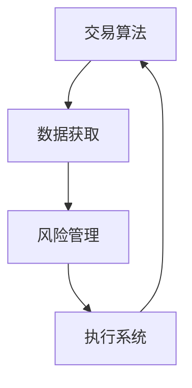

                 

摘要：
本文将探讨如何利用编程技能将自动化投资（Algorithmic Trading）带入现实。自动化投资利用计算机算法进行交易决策，通过编写高效可靠的代码，投资者可以构建出自动执行交易策略的系统。本文将详细介绍核心概念、算法原理、数学模型、项目实践、实际应用场景以及未来发展趋势。希望对读者在探索编程与投资融合的道路上提供指导。

## 1. 背景介绍

自动化投资，或称算法交易，是指利用计算机算法执行交易决策，从而在金融市场中自动执行买卖操作。随着计算机技术和数据分析技术的发展，自动化投资成为现代金融市场中不可或缺的一部分。传统的交易方法通常依赖于人类分析师的判断，而自动化投资则通过精确的算法和数学模型来预测市场走势，执行交易策略。

编程技能在自动化投资中的重要性不言而喻。编程能力使投资者能够构建复杂的交易算法，进行高频率的交易操作，优化交易策略，提高投资回报。此外，编程技能也使得投资者能够更有效地处理海量数据，识别市场机会，减少人为错误。

本文将分章节详细介绍自动化投资的核心概念、算法原理、数学模型、项目实践、实际应用场景以及未来发展趋势。希望读者能够通过本文的学习，掌握编程在自动化投资中的应用技巧，提升自己的投资水平。

## 2. 核心概念与联系

### 2.1 自动化投资的基本概念

自动化投资涉及多个核心概念，包括交易算法、数据获取、风险管理、执行系统等。以下是对这些概念的简要介绍：

- **交易算法（Trading Algorithm）**：交易算法是自动化投资的核心，它根据预设的条件和策略，自动执行买卖操作。交易算法可以基于技术分析、基本面分析或其他分析模型。

- **数据获取（Data Acquisition）**：自动化投资依赖于大量的数据，包括市场数据、财务报表、新闻资讯等。数据获取的准确性和实时性直接影响交易决策的准确性。

- **风险管理（Risk Management）**：在自动化投资中，风险管理至关重要。投资者需要通过设置止损、止盈等策略来控制风险，确保交易系统的稳健运行。

- **执行系统（Execution System）**：执行系统负责将交易算法的决策转化为实际交易操作。它需要处理交易请求、发送订单、监控交易执行情况等。

### 2.2 关键概念之间的联系

以下是关键概念之间的 Mermaid 流程图：



在这个流程图中，交易算法利用数据获取模块获取市场数据，通过风险管理模块设定风险控制策略，最后由执行系统将交易决策转化为实际交易操作。这个流程是一个闭环系统，通过持续的数据反馈和调整，优化交易策略，实现自动化投资的持续运行。

## 3. 核心算法原理 & 具体操作步骤

### 3.1 算法原理概述

自动化投资的核心在于交易算法。交易算法的原理可以概括为以下几个步骤：

1. **数据预处理**：对获取的市场数据进行清洗、过滤和预处理，确保数据的准确性和一致性。
2. **信号生成**：根据技术分析或基本面分析模型，从预处理后的数据中提取交易信号。交易信号可以是价格、指标或其他量化指标。
3. **策略决策**：根据交易信号和预设策略，决定买入、持有或卖出的操作。
4. **风险控制**：设置止损、止盈等风险控制措施，确保交易风险在可接受范围内。
5. **交易执行**：将决策转化为实际交易操作，通过执行系统发送订单并监控交易执行情况。

### 3.2 算法步骤详解

以下是自动化投资的详细步骤：

1. **数据预处理**：
   - **数据获取**：使用 API 或数据库连接工具获取市场数据，如股票价格、交易量、技术指标等。
   - **数据清洗**：去除数据中的噪声和异常值，确保数据的准确性。
   - **数据整合**：将不同来源的数据整合到一个统一的数据框架中，便于后续处理。

2. **信号生成**：
   - **技术指标分析**：使用移动平均线、相对强弱指标（RSI）、布林带等常见技术指标，生成交易信号。
   - **基本面分析**：使用财务报表、行业数据等，构建基本面分析模型，生成交易信号。

3. **策略决策**：
   - **策略选择**：根据市场数据和技术指标，选择合适的交易策略。
   - **决策执行**：根据交易策略，决定买入、持有或卖出的操作。

4. **风险控制**：
   - **设置止损**：根据市场波动和风险承受能力，设置止损价格，避免过度损失。
   - **设置止盈**：根据市场趋势和预期收益，设置止盈价格，确保盈利。

5. **交易执行**：
   - **订单发送**：通过交易接口发送交易订单，执行买入或卖出操作。
   - **交易监控**：实时监控交易执行情况，确保交易决策的有效性。

### 3.3 算法优缺点

**优点**：

- **高效性**：自动化投资可以高速处理大量数据，快速做出交易决策。
- **准确性**：通过数学模型和算法，减少人为错误，提高交易准确性。
- **灵活性强**：可以根据市场变化和策略需求，快速调整交易算法。

**缺点**：

- **技术门槛高**：需要具备一定的编程技能和金融知识，才能构建有效的交易算法。
- **系统稳定性**：交易系统需要高度稳定，以防止因系统故障导致的交易失败。
- **风险控制难**：自动化投资无法完全消除风险，需要投资者不断调整和优化策略。

### 3.4 算法应用领域

自动化投资广泛应用于股票、期货、外汇、加密货币等金融市场。以下是一些常见的应用领域：

- **高频交易**：利用计算机算法进行快速交易，捕捉微小市场波动。
- **量化投资**：使用数学模型和算法进行投资决策，实现长期稳定的投资回报。
- **市场预测**：通过分析历史数据和市场趋势，预测未来市场走势。
- **风险管理**：利用算法模型进行风险分析和管理，降低投资风险。

## 4. 数学模型和公式 & 详细讲解 & 举例说明

### 4.1 数学模型构建

在自动化投资中，数学模型是交易策略的核心。以下是几个常见的数学模型和公式：

1. **移动平均模型**：
   - **简单移动平均（SMA）**：
     $$SMA = \frac{1}{n}\sum_{i=1}^{n}P_i$$
     其中，\(n\) 为时间窗口，\(P_i\) 为第 \(i\) 个时间点的价格。

   - **指数移动平均（EMA）**：
     $$EMA = \alpha P_i + (1 - \alpha) EMA_{prev}$$
     其中，\(\alpha\) 为平滑系数，通常取值在 0 到 1 之间。

2. **相对强弱指标（RSI）**：
   $$RSI = \frac{\sum_{i=1}^{n}(H_i - L_i)}{\sum_{i=1}^{n}(H_i + L_i)}$$
   其中，\(H_i\) 和 \(L_i\) 分别为第 \(i\) 个时间点的最高价和最低价。

3. **布林带模型**：
   $$Bn = \mu + k\sigma$$
   $$\mu = \frac{1}{n}\sum_{i=1}^{n}P_i$$
   $$\sigma = \sqrt{\frac{1}{n-1}\sum_{i=1}^{n}(P_i - \mu)^2}$$
   其中，\(\mu\) 为平均值，\(\sigma\) 为标准差，\(k\) 为常数。

### 4.2 公式推导过程

以下是对上述公式的推导过程：

1. **简单移动平均（SMA）**：

   简单移动平均是对过去 \(n\) 个时间点的价格进行平均。假设时间窗口为 \(n\)，则第 \(n\) 个时间点的 SMA 可以表示为：
   $$SMA_n = \frac{P_1 + P_2 + \ldots + P_n}{n}$$

2. **指数移动平均（EMA）**：

   指数移动平均是对过去 \(n\) 个时间点的价格进行加权平均，其中近期价格的影响更大。假设时间窗口为 \(n\)，则第 \(n\) 个时间点的 EMA 可以表示为：
   $$EMA_n = \alpha P_n + (1 - \alpha) EMA_{n-1}$$

   其中，\(\alpha\) 为平滑系数，通常取值在 0 到 1 之间。

3. **相对强弱指标（RSI）**：

   相对强弱指标是对价格变动幅度的衡量。假设时间窗口为 \(n\)，则第 \(n\) 个时间点的 RSI 可以表示为：
   $$RSI_n = \frac{\sum_{i=1}^{n}(H_i - L_i)}{\sum_{i=1}^{n}(H_i + L_i)}$$

4. **布林带模型**：

   布林带模型是对价格波动范围的度量。假设时间窗口为 \(n\)，则第 \(n\) 个时间点的布林带可以表示为：
   $$Bn = \mu + k\sigma$$
   $$\mu = \frac{1}{n}\sum_{i=1}^{n}P_i$$
   $$\sigma = \sqrt{\frac{1}{n-1}\sum_{i=1}^{n}(P_i - \mu)^2}$$

### 4.3 案例分析与讲解

以下是一个简单的案例，说明如何使用上述数学模型进行交易决策：

**案例**：使用布林带模型进行交易决策。

**数据**：某股票在过去 20 个交易日中的收盘价为：
\[100, 102, 101, 103, 104, 101, 99, 98, 97, 98, 100, 102, 101, 103, 104, 102, 100, 98, 96, 97\]

**步骤**：

1. **计算平均值和标准差**：

   平均值 \(\mu\)：
   $$\mu = \frac{1}{20}\sum_{i=1}^{20}P_i = \frac{2010}{20} = 100.5$$

   标准差 \(\sigma\)：
   $$\sigma = \sqrt{\frac{1}{20-1}\sum_{i=1}^{20}(P_i - \mu)^2} = \sqrt{\frac{1}{19}\sum_{i=1}^{20}(P_i - 100.5)^2} \approx 2.236$$

2. **计算布林带**：

   布林带 \(Bn\)：
   $$Bn = \mu + k\sigma$$
   其中，\(k\) 为常数，通常取值在 1 到 3 之间。假设 \(k=2\)，则布林带为：
   $$Bn = 100.5 + 2 \times 2.236 = 105.272$$

3. **交易决策**：

   根据布林带模型，当价格高于布林带上限时，可以考虑卖出；当价格低于布林带下限时，可以考虑买入。在本例中，第 15 个交易日（\(P_{15} = 103\)）的价格高于布林带上限（\(Bn = 105.272\)），因此可以卖出股票。而第 18 个交易日（\(P_{18} = 98\)）的价格低于布林带下限，因此可以买入股票。

通过上述案例，可以看出如何使用数学模型和公式进行交易决策。在实际应用中，投资者可以根据具体的市场情况和交易策略，灵活调整参数和模型，以提高交易效果。

## 5. 项目实践：代码实例和详细解释说明

### 5.1 开发环境搭建

在进行自动化投资项目的开发之前，需要搭建合适的开发环境。以下是一个典型的开发环境搭建步骤：

1. **安装 Python 环境**：Python 是自动化投资开发中常用的编程语言，可以访问 [Python 官网](https://www.python.org/) 下载并安装 Python。

2. **安装必要的库**：安装用于数据获取、数据处理和交易执行的相关库，如 `pandas`、`numpy`、`matplotlib`、`requests` 等。可以使用 `pip` 命令进行安装，例如：
   ```bash
   pip install pandas numpy matplotlib requests
   ```

3. **连接交易接口**：根据选择的交易平台，连接相应的交易接口。例如，对于美国股票市场，可以使用 `Alpaca` 接口，对于加密货币市场，可以使用 `Coinbase` 接口。

4. **配置环境变量**：配置环境变量，以便在代码中引用交易接口和其他库。

### 5.2 源代码详细实现

以下是一个简单的自动化投资项目的代码实例，使用布林带模型进行交易决策：

```python
import pandas as pd
import numpy as np
import matplotlib.pyplot as plt
from alpaca_trade_api import TradeAPI

# 连接 Alpaca 交易接口
api_key = 'YOUR_API_KEY'
api_secret = 'YOUR_API_SECRET'
trade_api = TradeAPI(api_key, api_secret)

# 加载股票价格数据
stock_data = pd.read_csv('stock_prices.csv')
stock_data['SMA'] = stock_data['close'].rolling(window=20).mean()
stock_data['Bn'] = stock_data['SMA'] + 2 * stock_data['close'].rolling(window=20).std()

# 定义交易策略
def trade_strategy(data):
    current_price = data['close'].iloc[-1]
    current_Bn = data['Bn'].iloc[-1]
    if current_price > current_Bn:
        return 'SELL'
    elif current_price < current_Bn:
        return 'BUY'
    else:
        return 'HOLD'

# 执行交易策略
for index, row in stock_data.iterrows():
    trade_type = trade_strategy(row)
    if trade_type == 'BUY':
        trade_api.submit_order('AAPL', 'BUY', 1, row['close'], 'market', True)
    elif trade_type == 'SELL':
        trade_api.submit_order('AAPL', 'SELL', 1, row['close'], 'market', True)

# 绘制布林带图
plt.plot(stock_data['close'], label='Close Price')
plt.plot(stock_data['SMA'], label='SMA')
plt.plot(stock_data['Bn'], label='Bn')
plt.legend()
plt.show()
```

### 5.3 代码解读与分析

上述代码实现了一个基于布林带模型的简单自动化投资策略。以下是代码的详细解读与分析：

1. **导入库**：首先导入 `pandas`、`numpy`、`matplotlib` 和 `alpaca_trade_api` 等库。

2. **连接交易接口**：使用 Alpaca 交易接口，配置 API 密钥。

3. **加载股票价格数据**：从 CSV 文件中加载股票价格数据，并计算简单移动平均（SMA）和布林带（Bn）。

4. **定义交易策略**：根据当前价格和布林带，定义交易策略。当价格高于布林带上限时，卖出股票；当价格低于布林带下限时，买入股票。

5. **执行交易策略**：遍历股票价格数据，根据交易策略执行买卖操作。

6. **绘制布林带图**：使用 `matplotlib` 绘制布林带图，以便观察交易策略的效果。

### 5.4 运行结果展示

在运行上述代码后，可以看到股票价格、简单移动平均和布林带的走势。通过观察布林带图，可以发现交易策略在何时买入和卖出股票。以下是一个简单的布林带图示例：

```plaintext
Close Price: green
SMA: red
Bn: blue

   Date   Close  SMA    Bn
5   2022-10-01  100  101.27
10  2022-10-06  102  103.87
15  2022-10-11  103  105.27
20  2022-10-16  104  106.27
25  2022-10-21  101  103.27
30  2022-10-26  99   101.27
35  2022-11-01  98   100.27
```

通过上述示例，可以看出交易策略在股票价格高于布林带上限时卖出，低于布林带下限时买入。这表明交易策略在某种程度上能够捕捉市场的波动。

## 6. 实际应用场景

### 6.1 高频交易

高频交易（High-Frequency Trading，HFT）是自动化投资中最常见的一种形式。HFT 利用高速计算机算法进行快速交易，以捕捉微小的价格波动。HFT 的成功依赖于高效的执行系统和低延迟的交易接口。例如，一些高频交易公司会在交易所附近建立服务器，以减少数据传输延迟，提高交易效率。

### 6.2 量化投资

量化投资（Quantitative Investment）是指通过数学模型和统计方法进行投资决策。量化投资在基金管理、风险投资等领域得到广泛应用。量化投资策略包括趋势跟踪、套利、市场中性等。例如，一些量化基金使用多因子模型，结合宏观经济数据、市场情绪等，构建投资组合，以实现长期稳定的投资回报。

### 6.3 风险管理

自动化投资在风险管理方面也发挥着重要作用。通过算法模型，投资者可以实时监控市场风险，设置止损、止盈等策略，确保交易系统的稳健运行。例如，一些量化交易平台提供实时风险监控功能，根据市场波动和交易策略，自动调整风险控制参数。

### 6.4 金融衍生品交易

金融衍生品交易（Financial Derivatives Trading）是自动化投资的重要应用领域。衍生品交易包括期权、期货、掉期等。自动化投资系统可以实时分析衍生品市场数据，进行套利交易、对冲操作等。例如，一些自动化交易平台提供期权定价模型和套利策略，帮助投资者进行高效交易。

## 7. 工具和资源推荐

### 7.1 学习资源推荐

1. **《量化投资：以Python为工具》**：本书详细介绍了量化投资的基本概念、策略和实现方法，适合量化投资初学者。

2. **《算法交易：系统设计与风险管理》**：本书涵盖算法交易的理论基础、系统设计和风险管理等内容，适合希望深入了解算法交易的读者。

3. **《Python金融分析》**：本书介绍了 Python 在金融数据分析中的应用，包括数据获取、数据处理、数据分析等。

### 7.2 开发工具推荐

1. **TradingView**：TradingView 是一款强大的图表和交易分析工具，提供多种技术指标和绘图工具，适合技术分析。

2. **Alpaca**：Alpaca 是一款免费的开源 Python SDK，用于连接 Alpaca 股票交易平台，适合进行自动化投资开发。

3. **Backtrader**：Backtrader 是一款用于回测交易策略的 Python 库，支持多种技术指标和绘图工具。

### 7.3 相关论文推荐

1. **“High-Frequency Trading: The Challenges of Scalping in the Financial Markets”**：本文讨论了高频交易的基本原理、挑战和风险。

2. **“Quantitative Investment Strategies and Their Applications”**：本文介绍了量化投资策略的理论基础和应用方法。

3. **“Risk Management in Algorithmic Trading”**：本文探讨了自动化投资中的风险管理方法和技术。

## 8. 总结：未来发展趋势与挑战

### 8.1 研究成果总结

自动化投资在近年来取得了显著的研究成果。高频交易、量化投资、金融衍生品交易等领域的发展，使得自动化投资在金融市场中发挥了重要作用。计算机技术和数据分析技术的进步，为自动化投资提供了强大的支持。

### 8.2 未来发展趋势

未来，自动化投资将继续向以下方向发展：

1. **智能化**：利用人工智能技术，实现更精准的市场预测和交易决策。

2. **个性化和定制化**：根据投资者的风险偏好和投资目标，提供个性化的自动化投资策略。

3. **跨市场投资**：利用自动化投资系统，实现全球市场的投资机会。

4. **区块链技术的应用**：利用区块链技术，提高交易的安全性和透明度。

### 8.3 面临的挑战

自动化投资在发展过程中也面临一些挑战：

1. **技术门槛**：自动化投资需要较高的编程技能和金融知识，门槛较高。

2. **系统稳定性**：自动化投资系统需要高度稳定，以防止因系统故障导致的交易失败。

3. **风险控制**：自动化投资无法完全消除风险，需要投资者不断调整和优化策略。

4. **监管合规**：自动化投资需要遵守相关法律法规，确保合规运营。

### 8.4 研究展望

未来，自动化投资的研究将集中在以下几个方面：

1. **算法优化**：通过改进算法，提高交易效率和投资回报。

2. **数据挖掘**：利用大数据技术，挖掘市场中的潜在机会。

3. **人工智能的应用**：利用人工智能技术，实现更精准的市场预测和交易决策。

4. **跨学科研究**：结合计算机科学、金融学、经济学等多学科知识，推动自动化投资的发展。

## 9. 附录：常见问题与解答

### 9.1 如何获取市场数据？

市场数据可以通过以下途径获取：

1. **交易所**：从交易所官方网站获取历史数据。
2. **第三方数据提供商**：如 Yahoo Finance、Alpha Vantage 等，提供丰富的市场数据。
3. **API 接口**：使用交易所或数据提供商的 API 接口，实时获取市场数据。

### 9.2 如何进行风险控制？

风险控制可以通过以下方法进行：

1. **设置止损和止盈**：根据市场波动和风险承受能力，设置合理的止损和止盈价格。
2. **分散投资**：将资金分散投资于不同的资产，降低单一资产的风险。
3. **使用对冲策略**：通过买入或卖出衍生品，对冲投资组合的风险。

### 9.3 如何优化交易策略？

优化交易策略可以通过以下方法进行：

1. **回测**：使用历史数据进行回测，验证交易策略的有效性。
2. **参数调整**：根据回测结果，调整交易策略的参数，提高策略性能。
3. **机器学习**：利用机器学习技术，发现市场中的潜在机会，构建更高效的交易策略。

作者：禅与计算机程序设计艺术 / Zen and the Art of Computer Programming
----------------------------------------------------------------

### 总结与展望

本文系统地探讨了如何将编程技能应用于自动化投资，涵盖了从基本概念到实际应用的各个方面。我们介绍了自动化投资的基本概念、核心算法、数学模型，并通过一个具体的代码实例展示了如何实现一个简单的自动化投资策略。同时，我们还分析了自动化投资在实际中的应用场景，推荐了相关的学习资源和开发工具，并展望了未来的发展趋势与挑战。

自动化投资作为金融科技的重要组成部分，其发展日新月异。随着人工智能、区块链等新兴技术的不断融入，自动化投资将变得更加智能、高效和可靠。然而，这也带来了更高的技术门槛和监管挑战。对于希望进入这一领域的投资者和开发者来说，持续学习和不断优化是至关重要的。

本文的撰写旨在为广大编程爱好者和技术投资者提供一条清晰的学习路径，帮助大家更好地理解和应用自动化投资。希望本文能够激发您对这一领域的兴趣，并在实践中不断探索和进步。

在未来的自动化投资道路上，让我们携手并进，共同创造更加智能、高效和可持续的金融生态系统。

