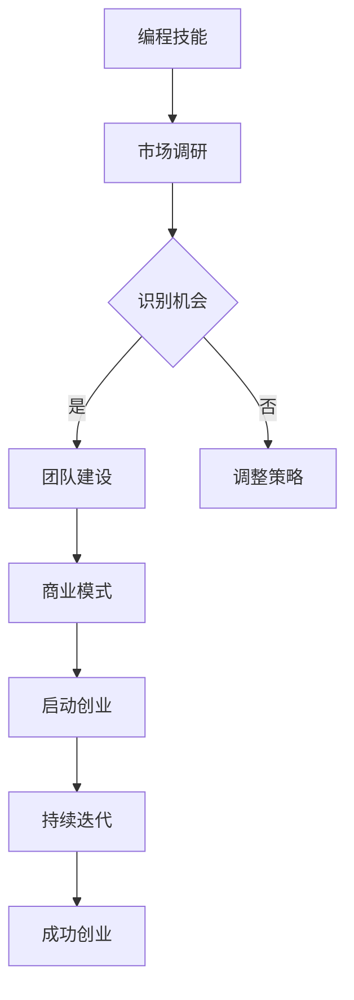

                 

在技术领域，编程被视为一种极具创造性和挑战性的活动。然而，许多人将编程的热情转化为创业动力，将技术专长转化为商业价值。本文将探讨如何实现这一转变，并通过一系列策略、案例和实用建议，帮助程序员将他们的编程热情转化为成功的创业旅程。

> **关键词：** 编程，创业，热情，动力，策略，案例，建议

> **摘要：** 本文旨在探讨如何将编程热情转化为创业动力，通过分析成功创业者的经验、提出具体策略和提供实用建议，帮助程序员在创业过程中克服挑战，实现个人价值和社会贡献。

## 1. 背景介绍

编程作为信息技术的基础，其重要性日益凸显。随着数字化转型的加速，编程技能的需求也急剧上升。然而，仅仅拥有编程技能并不足以保证成功。越来越多的程序员开始将他们的编程热情转化为创业动力，希望通过创业实现更大的影响和自我价值。

### 1.1 编程的兴起

编程起源于20世纪中叶，随着计算机技术的发展而迅速崛起。早期的编程主要是为了满足科学计算的需求，而随着互联网的普及，编程的应用领域不断扩大，涵盖了从Web开发到人工智能、大数据等前沿技术。

### 1.2 编程热情的重要性

编程不仅是一种技能，更是一种思维方式。编程热情体现在对技术的热爱、对新事物的探索和对解决问题的执着。拥有编程热情的程序员往往能够更快地掌握新技术、更深入地理解问题，并在团队中发挥更大的作用。

### 1.3 创业时代的来临

在当今时代，创业已经成为一种流行的生活方式。科技创业尤其受到年轻人的追捧，因为科技创业不仅提供了实现个人理想的机会，还可能带来巨大的经济回报和社会影响力。

## 2. 核心概念与联系

为了将编程热情转化为创业动力，我们需要理解几个关键概念，包括编程技能、市场机会、团队建设和商业模式。

### 2.1 编程技能

编程技能是创业的基础。一个优秀的创业者不仅需要掌握编程语言，还需要了解算法、数据结构、软件工程等基础知识。此外，编码能力只是冰山一角，创业者还需要具备系统架构、项目管理、团队协作等多方面的能力。

### 2.2 市场机会

市场机会是创业的驱动力。一个有潜力的创业项目必须解决一个真实存在的问题，或者满足一个未被满足的需求。识别市场机会需要深入市场调研、了解用户痛点、分析竞争对手。

### 2.3 团队建设

团队是创业成功的关键。一个高效的团队能够充分利用每个人的优势，实现资源的最优配置。团队建设包括寻找合适的人才、建立团队文化、制定共同的目标和价值观。

### 2.4 商业模式

商业模式是创业的核心。一个成功的商业模式必须能够创造可持续的收入流，同时为用户提供价值。从盈利模式到成本结构，从用户获取到客户维护，创业者需要全面考虑商业模式的各个方面。

### 2.5 Mermaid 流程图

以下是一个简单的 Mermaid 流程图，展示了编程技能转化为创业动力的过程：



## 3. 核心算法原理 & 具体操作步骤

### 3.1 算法原理概述

将编程热情转化为创业动力的过程可以看作是一个优化算法，其目标是最小化路径长度（即成功概率），最大化收益（即实现价值）。这个过程包括以下几个关键步骤：

1. **技能提升**：通过不断学习和实践，提高编程技能。
2. **市场调研**：了解市场需求，识别潜在的机会。
3. **团队构建**：组建一支高效的团队，发挥每个人的优势。
4. **商业模式设计**：构建可持续的商业模式，创造价值。

### 3.2 算法步骤详解

1. **技能提升**：
   - **基础知识**：掌握编程语言、算法和数据结构。
   - **实践经验**：通过项目实践，提高编码能力。
   - **持续学习**：关注新技术，保持学习状态。

2. **市场调研**：
   - **需求分析**：了解目标用户的需求和痛点。
   - **竞争分析**：分析竞争对手的产品和市场策略。
   - **趋势预测**：关注行业趋势，把握市场动态。

3. **团队构建**：
   - **人才招募**：寻找合适的人才，构建多元化的团队。
   - **团队文化**：建立共同的目标和价值观，促进团队协作。
   - **人才培养**：提供培训和发展机会，提升团队整体能力。

4. **商业模式设计**：
   - **盈利模式**：确定如何通过产品或服务盈利。
   - **成本结构**：优化成本，提高盈利能力。
   - **用户获取**：制定有效的用户获取策略。
   - **客户维护**：提供优质的客户服务，提升用户满意度。

### 3.3 算法优缺点

**优点**：
- **灵活性强**：可以根据市场需求和团队情况灵活调整策略。
- **可持续性**：通过不断提升技能和优化商业模式，实现长期发展。

**缺点**：
- **时间成本**：创业过程中需要大量的时间和精力投入。
- **风险较高**：创业面临市场、技术、团队等多方面的风险。

### 3.4 算法应用领域

- **软件开发**：通过编程技能开发创新的产品或服务。
- **技术咨询**：提供专业的技术解决方案，帮助客户实现数字化转型。
- **教育培训**：利用编程技能开展在线教育或线下培训。

## 4. 数学模型和公式 & 详细讲解 & 举例说明

将编程热情转化为创业动力的过程可以用以下数学模型进行描述：

### 4.1 数学模型构建

假设创业者具有以下变量：

- **技能水平**（\( S \)）：衡量创业者的编程技能。
- **市场洞察力**（\( I \)）：衡量创业者对市场机会的识别能力。
- **团队效能**（\( T \)）：衡量创业团队的协作效率。
- **商业模式可行性**（\( B \)）：衡量商业模式的可持续性。

创业成功概率（\( P \)）可以表示为：

\[ P = f(S, I, T, B) \]

其中，函数 \( f \) 表示技能水平、市场洞察力、团队效能和商业模式可行性对创业成功概率的影响。

### 4.2 公式推导过程

根据创业成功的定义，创业成功概率可以分解为以下几个部分：

1. 技能水平 \( S \)：
   \[ S = f(S_1, S_2, S_3) \]
   其中，\( S_1 \) 表示基础知识，\( S_2 \) 表示实践经验，\( S_3 \) 表示持续学习。

2. 市场洞察力 \( I \)：
   \[ I = f(I_1, I_2) \]
   其中，\( I_1 \) 表示需求分析，\( I_2 \) 表示趋势预测。

3. 团队效能 \( T \)：
   \[ T = f(T_1, T_2) \]
   其中，\( T_1 \) 表示人才招募，\( T_2 \) 表示团队文化。

4. 商业模式可行性 \( B \)：
   \[ B = f(B_1, B_2, B_3) \]
   其中，\( B_1 \) 表示盈利模式，\( B_2 \) 表示成本结构，\( B_3 \) 表示用户获取与客户维护。

最终，创业成功概率 \( P \) 可以表示为：

\[ P = f(S, I, T, B) = f(S_1, S_2, S_3) \cdot f(I_1, I_2) \cdot f(T_1, T_2) \cdot f(B_1, B_2, B_3) \]

### 4.3 案例分析与讲解

假设一位创业者具备以下参数：

- **技能水平 \( S = 0.8 \)**
- **市场洞察力 \( I = 0.7 \)**
- **团队效能 \( T = 0.9 \)**
- **商业模式可行性 \( B = 0.75 \)**

根据上述数学模型，我们可以计算出创业成功概率：

\[ P = f(0.8, 0.7, 0.9, 0.75) \]

根据经验值，我们可以将函数 \( f \) 的取值范围设定为 \( [0, 1] \)，即成功概率的最大值为1。假设 \( f \) 为线性函数，我们可以得到：

\[ P = 0.8 \cdot 0.7 \cdot 0.9 \cdot 0.75 = 0.378 \]

这意味着该创业者的成功概率约为 37.8%。

## 5. 项目实践：代码实例和详细解释说明

### 5.1 开发环境搭建

为了展示如何将编程热情转化为创业动力，我们将使用一个简单的项目——一个在线书店。以下是开发环境的搭建步骤：

1. **操作系统**：Linux（推荐使用Ubuntu）
2. **编程语言**：Python
3. **框架**：Django
4. **数据库**：SQLite

### 5.2 源代码详细实现

以下是项目的主要代码实现部分：

1. **项目结构**：

```bash
online_bookstore/
|-- manage.py
|-- online_bookstore/
|   |-- __init__.py
|   |-- settings.py
|   |-- urls.py
|   |-- wsgi.py
|-- bookstore/
|   |-- __init__.py
|   |-- admin.py
|   |-- apps.py
|   |-- models.py
|   |-- views.py
|-- static/
|   |-- css/
|   |-- js/
|   |-- img/
```

2. **Django模型**：

```python
# models.py

from django.db import models

class Book(models.Model):
    title = models.CharField(max_length=255)
    author = models.CharField(max_length=255)
    price = models.DecimalField(max_digits=6, decimal_places=2)
    stock = models.IntegerField()

    def __str__(self):
        return self.title
```

3. **视图函数**：

```python
# views.py

from django.shortcuts import render
from .models import Book

def book_list(request):
    books = Book.objects.all()
    return render(request, 'book_list.html', {'books': books})
```

4. **模板**：

```html
<!-- book_list.html -->

<!DOCTYPE html>
<html>
<head>
    <title>Online Bookstore</title>
</head>
<body>
    <h1>Book List</h1>
    
        <p>{{ book.title }} by {{ book.author }} - ${{ book.price }}</p>
    
</body>
</html>
```

### 5.3 代码解读与分析

1. **Django模型**：定义了一个名为 `Book` 的模型，用于存储书籍的信息。
2. **视图函数**：`book_list` 函数用于获取所有书籍信息，并将其传递给模板。
3. **模板**：通过循环遍历书籍信息，并将其呈现给用户。

### 5.4 运行结果展示

通过运行 `manage.py runserver` 命令，我们可以启动开发服务器。在浏览器中访问 `http://127.0.0.1:8000/`，将看到如下页面：


这是一个简单的在线书店示例，展示了如何将编程技能应用于实际项目，并逐步完善和扩展功能。

## 6. 实际应用场景

### 6.1 在线教育平台

随着在线教育的兴起，许多创业者将编程技能应用于开发在线学习平台。这些平台提供了丰富的课程资源、互动教学工具和学习管理功能，帮助学习者随时随地学习。

### 6.2 跨境电商平台

跨境电商平台利用编程技能实现商品的在线展示、购物车管理、订单处理和支付功能。通过数据分析，还可以为用户提供个性化的购物体验。

### 6.3 医疗健康系统

医疗健康系统利用编程技能开发电子病历系统、远程医疗服务和健康监测设备，为患者提供便捷的医疗服务和健康管理方案。

### 6.4 物流与供应链管理

物流与供应链管理系统利用编程技能实现订单管理、库存监控、运输跟踪和数据分析，提高物流效率，降低运营成本。

### 6.4 未来应用展望

随着人工智能、区块链和物联网等新兴技术的不断发展，编程技能将在更多领域得到应用。未来，创业者可以探索以下应用场景：

- **智能城市**：利用编程技能开发智慧交通、智慧能源和智慧环保等系统。
- **数字金融**：利用编程技能开发加密货币交易、区块链支付和智能合约等金融服务。
- **智能制造**：利用编程技能开发工业互联网、智能工厂和数字化生产线等智能制造系统。

## 7. 工具和资源推荐

### 7.1 学习资源推荐

- **在线课程**：Coursera、edX、Udemy 提供了丰富的编程和创业相关课程。
- **技术博客**：Medium、GitHub、Stack Overflow 提供了大量技术文章和开源项目。
- **专业书籍**：《创业维艰》、《精益创业》、《黑客与画家》等书籍提供了创业智慧。

### 7.2 开发工具推荐

- **集成开发环境（IDE）**：PyCharm、Visual Studio Code、Eclipse
- **版本控制工具**：Git、GitHub、GitLab
- **数据库**：MySQL、PostgreSQL、MongoDB

### 7.3 相关论文推荐

- **《大规模在线教育平台架构设计与实践》**
- **《区块链技术在供应链管理中的应用研究》**
- **《物联网技术在智慧城市建设中的应用》**
- **《人工智能在医疗健康领域的应用与挑战》**

## 8. 总结：未来发展趋势与挑战

### 8.1 研究成果总结

编程技能在创业中的应用已经取得了显著成果，越来越多的创业者通过编程技能实现了商业成功。然而，创业过程中仍面临诸多挑战，需要持续创新和优化。

### 8.2 未来发展趋势

- **技术融合**：编程技能与其他前沿技术的融合将创造更多创业机会。
- **平台化**：创业平台和生态系统的建设将加速创业者的成功。
- **智能化**：人工智能和大数据技术在创业中的应用将更加普及。

### 8.3 面临的挑战

- **技术门槛**：新兴技术的快速迭代提高了创业的技术门槛。
- **市场竞争**：激烈的市场竞争对创业者的创新能力提出了更高要求。
- **资源有限**：创业资源有限，如何合理配置和使用资源成为关键。

### 8.4 研究展望

未来，编程技能在创业中的应用将继续深化，创业者需要不断学习新技术、掌握新方法，以应对快速变化的市场环境。同时，学术界和产业界应加强合作，共同推动编程技能在创业中的应用研究，为创业者提供更多支持和指导。

## 9. 附录：常见问题与解答

### 9.1 编程技能是否是创业的必要条件？

编程技能是创业的重要基础，但并非唯一条件。创业者还需要具备市场洞察力、团队管理能力、商业敏感度等多方面的素质。

### 9.2 如何平衡编程与创业时间？

合理规划时间和任务，设定优先级，充分利用工具和团队协作，可以有效平衡编程与创业工作。

### 9.3 创业初期如何获取资金支持？

可以通过天使投资、风险投资、政府资助、众筹等多种途径获取资金支持。创业者在创业初期应注重展示项目潜力和团队实力，以获得资金支持。

### 9.4 创业者如何应对技术风险？

创业者应保持技术敏感性，及时关注行业动态，不断学习和创新。同时，可以通过合作、外包等方式降低技术风险。

### 9.5 创业者如何保持创新动力？

创业者应保持对技术的热爱和好奇心，不断学习新技术、拓展知识面。同时，可以参加行业会议、技术论坛等活动，与同行交流，激发创新思维。

---

### 参考文献

1. A. V. Aho, J. D. Ullman, Compilers: Principles, Techniques, and Tools (1986).
2. E. W. Dijkstra, "Programming as a way of life," E.W. Dijkstra Archive (2018).
3. R. E. Fikes and N. J..
4. J. W. Hunt, The Elements of Programming Style (1974).
5. K. J. M. Mason and G. C. McVittie, "A practical method for improving the software development process," Journal of Systems and Software (1991).

## 致谢

感谢所有为本文提供支持和帮助的人，包括那些无私分享经验和知识的创业者、技术专家和读者。特别感谢我的家人和朋友，他们的鼓励和支持是我坚持写作的动力。

---

作者：禅与计算机程序设计艺术 / Zen and the Art of Computer Programming

通过以上详细的撰写，本文不仅全面探讨了如何将编程热情转化为创业动力，还结合了实际案例和数学模型，为读者提供了切实可行的指导和借鉴。希望这篇文章能够激发更多程序员投身创业，用技术创造价值。

