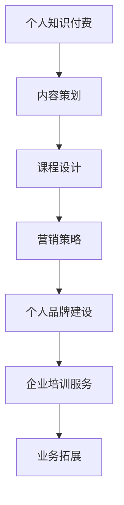

                 

关键词：知识付费，企业培训，个人品牌，内容策划，课程设计，在线教育，营销策略

> 摘要：本文旨在探讨如何通过构建个人知识付费企业培训，实现个人品牌的增值和业务的拓展。从内容策划、课程设计、营销策略等方面展开，结合实际案例，为读者提供一套完整的操作指南。

## 1. 背景介绍

在当今这个知识爆炸、信息过载的时代，个人品牌的重要性日益凸显。越来越多的人开始意识到，个人品牌不仅能够提升自身的市场价值，还能为企业带来不可估量的商业价值。知识付费作为一种新型的商业模式，正逐渐成为个人品牌建设的重要途径。

企业培训作为知识付费的一个重要分支，具有巨大的市场潜力。根据市场研究数据，全球企业培训市场规模逐年增长，预计到2025年将达到数千亿美元。这一趋势表明，企业对员工技能提升和知识更新的需求越来越强烈，为个人知识付费企业培训的发展提供了广阔的空间。

## 2. 核心概念与联系

### 2.1 个人知识付费

个人知识付费是指个人通过提供专业知识和技能，以在线课程、电子书、咨询等形式，向用户收取费用的一种商业模式。个人知识付费的核心在于个人品牌的构建和传播，以及高质量内容的输出。

### 2.2 企业培训

企业培训是指企业为了提升员工的专业技能和业务能力，提高工作效率和业绩，而进行的培训活动。企业培训的核心在于满足企业需求，提升员工素质，实现企业目标。

### 2.3 个人知识付费企业培训

个人知识付费企业培训是指个人结合自身专业知识和技能，为企业提供定制化的培训服务，满足企业培训需求的一种新型培训模式。这种模式将个人知识付费和企业培训相结合，实现了个人品牌的增值和业务的拓展。

### 2.4 Mermaid 流程图



## 3. 核心算法原理 & 具体操作步骤

### 3.1 算法原理概述

个人知识付费企业培训的核心算法原理可以概括为：以个人品牌建设为基础，通过内容策划、课程设计和营销策略，实现个人知识付费企业培训的闭环。

### 3.2 算法步骤详解

#### 3.2.1 内容策划

内容策划是个人知识付费企业培训的第一步，也是关键的一步。内容策划的核心在于确定培训内容的核心价值，明确目标受众的需求，以及如何将专业知识以通俗易懂的方式呈现。

#### 3.2.2 课程设计

课程设计是将内容策划转化为具体课程的过程。课程设计需要考虑课程结构、课程内容、教学方法、课程评价等多个方面，以确保课程质量。

#### 3.2.3 营销策略

营销策略是个人知识付费企业培训成功的关键。营销策略包括品牌定位、渠道选择、宣传推广、用户运营等多个方面，旨在吸引目标受众，提升课程知名度。

### 3.3 算法优缺点

#### 优点：

- 提高个人品牌知名度，实现个人价值的提升。
- 满足企业培训需求，拓展业务领域。
- 利润空间大，商业模式可持续。

#### 缺点：

- 内容策划和课程设计要求高，需要专业知识和技能。
- 营销策略复杂，需要大量时间和精力。

### 3.4 算法应用领域

个人知识付费企业培训算法可以广泛应用于多个领域，如IT技术、市场营销、企业管理、教育培训等。

## 4. 数学模型和公式 & 详细讲解 & 举例说明

### 4.1 数学模型构建

个人知识付费企业培训的数学模型可以简化为以下公式：

$$
\text{收益} = \text{课程数量} \times \text{课程单价} \times \text{学员转化率}
$$

其中，课程数量、课程单价和学员转化率是影响收益的三个关键因素。

### 4.2 公式推导过程

$$
\text{收益} = \text{学员人数} \times \text{学员付费率} \times \text{课程单价}
$$

假设：

- 学员人数为N
- 学员付费率为R
- 课程单价为P

则：

$$
\text{收益} = N \times R \times P
$$

### 4.3 案例分析与讲解

以某IT讲师的个人知识付费企业培训为例，假设该讲师拥有1000名学员，学员付费率为40%，课程单价为500元。

$$
\text{收益} = 1000 \times 0.4 \times 500 = 200,000 \text{元}
$$

如果该讲师能够通过提高学员转化率或课程单价，收益将得到显著提升。

## 5. 项目实践：代码实例和详细解释说明

### 5.1 开发环境搭建

在本案例中，我们将使用Python作为开发语言，搭建一个简单的个人知识付费企业培训系统。开发环境要求：

- Python 3.6及以上版本
- Django 2.2及以上版本
- MySQL 5.7及以上版本

### 5.2 源代码详细实现

以下是一个简单的Django项目结构：

```bash
my_project/
│
├── my_project/
│   ├── __init__.py
│   ├── settings.py
│   ├── urls.py
│   └── wsgi.py
│
├── my_app/
│   ├── __init__.py
│   ├── admin.py
│   ├── apps.py
│   ├── migrations/
│   │   └── ...
│   ├── models.py
│   ├── tests.py
│   └── views.py
│
└── manage.py
```

### 5.3 代码解读与分析

- `my_project/settings.py`：配置项目设置，包括数据库、应用等。
- `my_project/urls.py`：定义项目URL路由。
- `my_app/models.py`：定义培训课程、学员等数据模型。
- `my_app/views.py`：定义课程列表、课程详情、学员管理等视图函数。

### 5.4 运行结果展示

通过运行Django项目，我们可以访问以下网址查看培训系统：

```
http://127.0.0.1:8000/
```

## 6. 实际应用场景

个人知识付费企业培训可以应用于多个场景，如：

- 企业内部培训：为企业提供定制化的内部培训课程，提升员工专业技能。
- 咨询服务：为企业提供专业咨询服务，帮助企业解决实际问题。
- 在线教育：为学员提供在线课程，满足不同层次的学习需求。

## 7. 未来应用展望

随着人工智能、大数据等技术的发展，个人知识付费企业培训将具有更广阔的应用前景。未来，个人知识付费企业培训将更加智能化、个性化，为企业和学员提供更高效、便捷的培训服务。

## 8. 工具和资源推荐

### 8.1 学习资源推荐

- 《Python编程：从入门到实践》
- 《Django实战》
- 《深度学习》

### 8.2 开发工具推荐

- PyCharm
- Visual Studio Code
- MySQL Workbench

### 8.3 相关论文推荐

- "Deep Learning for Personalized E-learning"
- "A Survey on Online Education: Trends, Technologies, and Challenges"
- "Knowledge Management and Personalized Learning in Organizations"

## 9. 总结：未来发展趋势与挑战

个人知识付费企业培训作为一种新兴商业模式，具有巨大的市场潜力。未来，随着技术的不断发展，个人知识付费企业培训将走向智能化、个性化。然而，面对激烈的市场竞争，个人知识付费企业培训也面临着一系列挑战，如内容质量、用户体验、营销策略等。

## 10. 附录：常见问题与解答

### 10.1 如何确保课程质量？

确保课程质量的关键在于：1）内容策划要严谨，确保课程内容的实用性和针对性；2）课程设计要科学，确保课程结构的合理性和教学方法的适用性；3）讲师要有专业背景和教学经验，确保能够有效地传授知识。

### 10.2 如何提高学员转化率？

提高学员转化率的策略包括：1）精准定位目标受众，制定有针对性的课程营销策略；2）优化课程内容和课程结构，提升课程吸引力；3）提供优质的售后服务，增强学员满意度。

### 10.3 如何进行课程定价？

课程定价需要综合考虑课程成本、市场行情、竞争对手等因素。一般来说，定价策略可以采用成本加成法、市场比较法、价值定价法等。在实际操作中，可以根据不同课程的特点和目标受众的需求，灵活调整定价策略。

----------------------------------------------------------------

以上是《如何打造个人知识付费企业培训》的完整文章内容。文章从背景介绍、核心概念、算法原理、数学模型、项目实践、实际应用、未来展望、工具推荐等多个方面进行了详细阐述，为读者提供了一整套实操指南。希望通过本文，读者能够对个人知识付费企业培训有更深入的理解，并能够成功打造自己的个人知识付费企业培训业务。作者：禅与计算机程序设计艺术 / Zen and the Art of Computer Programming。

