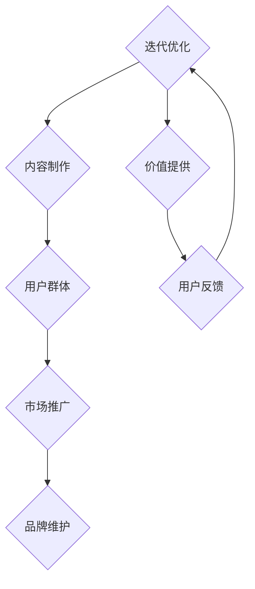

                 

在当今信息爆炸的时代，知识和技能的传授已经从传统的课堂教育转向了更为灵活和个性化的知识付费模式。越来越多的人开始关注如何打造个人知识付费品牌IP，以便在竞争激烈的市场中脱颖而出。本文将结合我在人工智能和计算机编程领域的经验，详细阐述打造个人知识付费品牌IP的步骤、策略和注意事项。

## 关键词
- 知识付费
- 个人品牌
- IP打造
- 教育创业
- 内容营销

## 摘要
本文旨在为那些希望打造个人知识付费品牌IP的从业者提供一条清晰、实用的路线图。文章将涵盖从确定品牌定位、内容制作、市场推广到品牌维护的各个阶段。通过详细的案例分析、实践指导和策略建议，帮助读者理解并掌握打造个人知识付费品牌IP的核心技能。

---

## 1. 背景介绍

知识付费是一种通过提供有价值的内容或服务来获取经济回报的商业模式。随着互联网的普及和人们对终身学习的重视，知识付费市场正在迅速增长。在这一背景下，个人知识付费品牌IP的打造显得尤为重要。个人IP不仅可以提高内容的价值，还能够增强用户的忠诚度和信任感，从而在市场中获得竞争优势。

### 1.1 市场趋势
- 知识付费市场规模逐年扩大，预计未来将继续保持高速增长。
- 用户需求多样化，对高质量、个性化内容的需求不断增加。
- 互联网技术和社交媒体的广泛应用，为知识传播提供了新的渠道和方式。

### 1.2 个人IP的价值
- 提升内容的专业性和权威性，增强用户信任。
- 建立个人品牌，提高市场竞争力。
- 扩大影响力，吸引更多用户和合作伙伴。
- 创造持续收入来源，实现经济自由。

---

## 2. 核心概念与联系

在打造个人知识付费品牌IP的过程中，有几个核心概念和联系是不可或缺的。以下是一个简单的 Mermaid 流程图，帮助读者理解这些概念之间的关联：



### 2.1 目标定位
确定自己的品牌定位是打造IP的第一步。这包括确定自己擅长的领域、目标用户群体以及独特的价值主张。

### 2.2 内容制作
高质量的内容是个人知识付费品牌的核心。内容制作需要注重专业性和实用性，同时也要有吸引力。

### 2.3 用户群体
了解自己的目标用户，包括他们的需求和痛点，有助于更精准地制作内容并进行市场推广。

### 2.4 市场推广
有效的市场推广是让内容被更多人知道的关键。利用社交媒体、网络平台和合作伙伴等多种渠道进行推广。

### 2.5 品牌维护
品牌维护是确保个人IP持续健康发展的关键。通过持续的内容更新、用户互动和品牌形象塑造来实现。

### 2.6 价值提供
个人IP的价值在于为用户提供有价值的内容或服务。这不仅仅是知识的传授，更是解决问题的方案。

### 2.7 用户反馈
用户反馈是不断优化和改进内容的重要依据。积极收集用户反馈，及时进行调整和改进。

---

## 3. 核心算法原理 & 具体操作步骤

### 3.1 算法原理概述

打造个人知识付费品牌IP的核心算法可以归纳为以下五个步骤：

1. **目标定位**：明确自己的定位和目标用户。
2. **内容制作**：制作高质量、有吸引力的内容。
3. **用户互动**：与用户建立良好的互动关系。
4. **市场推广**：通过各种渠道推广个人品牌。
5. **品牌维护**：持续更新和优化内容，维护品牌形象。

### 3.2 算法步骤详解

#### 3.2.1 目标定位

1. **自我评估**：评估自己的专业技能和知识领域。
2. **市场调研**：了解目标用户的需求和市场趋势。
3. **定位确定**：结合自我评估和市场调研，确定个人品牌定位。

#### 3.2.2 内容制作

1. **内容规划**：确定内容类型和发布频率。
2. **内容创作**：根据用户需求和定位，创作有价值的内容。
3. **内容优化**：通过数据分析，不断优化内容质量和结构。

#### 3.2.3 用户互动

1. **社交媒体互动**：积极参与社交媒体，与用户建立联系。
2. **社群运营**：建立社群，与用户进行深度互动。
3. **用户反馈**：积极收集用户反馈，及时回应用户需求。

#### 3.2.4 市场推广

1. **渠道选择**：选择适合自己品牌的推广渠道。
2. **内容营销**：通过优质内容吸引潜在用户。
3. **合作推广**：与相关领域人士或机构合作，扩大影响力。

#### 3.2.5 品牌维护

1. **内容更新**：定期更新内容，保持活跃度。
2. **品牌形象**：维护统一的品牌形象和风格。
3. **危机管理**：应对可能的负面反馈和争议，维护品牌形象。

### 3.3 算法优缺点

#### 优点
- **针对性**：明确的目标定位和用户互动，使得内容更具针对性。
- **灵活性**：可以根据用户反馈和市场变化及时调整策略。
- **可持续性**：通过持续的内容更新和品牌维护，实现长期发展。

#### 缺点
- **成本高**：需要投入大量的时间和精力来制作和推广内容。
- **竞争激烈**：市场中存在大量的个人IP，竞争激烈。

### 3.4 算法应用领域

- **教育领域**：通过线上课程、教程等形式，传授知识和技能。
- **专业咨询**：为特定领域的企业或个人提供专业咨询服务。
- **内容创作**：通过博客、视频、电子书等形式，创作有价值的内容。

---

## 4. 数学模型和公式 & 详细讲解 & 举例说明

在打造个人知识付费品牌IP的过程中，我们可以使用一些简单的数学模型和公式来帮助分析和优化内容制作和用户互动。

### 4.1 数学模型构建

#### 4.1.1 用户满意度模型

用户满意度模型可以用来评估用户对内容的满意度，公式如下：

$$
S = \frac{P + Q - R}{3}
$$

其中：
- $S$：用户满意度
- $P$：内容的实用价值
- $Q$：内容的吸引力
- $R$：用户的期望值

#### 4.1.2 用户留存模型

用户留存模型可以用来预测用户在未来一段时间内的留存情况，公式如下：

$$
R = \frac{C}{N} \times 100\%
$$

其中：
- $R$：用户留存率
- $C$：一段时间内留存的用户数
- $N$：初始用户数

### 4.2 公式推导过程

#### 4.2.1 用户满意度模型推导

用户满意度模型是基于以下三个因素的加权平均：

1. **实用价值（P）**：衡量内容对用户的实际帮助程度。
2. **吸引力（Q）**：衡量内容对用户的吸引力。
3. **期望值（R）**：用户对内容的期望值。

通过调查和数据分析，我们可以得到每个因素的权重。然后，将每个因素的得分乘以相应的权重，再求和并除以权重的总和，即可得到用户满意度。

#### 4.2.2 用户留存模型推导

用户留存模型是基于用户留存率的计算公式。用户留存率是指一段时间内留存的用户数与初始用户数的比例。通过记录和分析用户的留存情况，我们可以预测未来的留存率。

### 4.3 案例分析与讲解

#### 4.3.1 用户满意度案例分析

假设我们对一篇关于Python编程的教程进行了用户满意度调查。调查结果显示：
- 实用价值（P）：4.5分
- 吸引力（Q）：4.0分
- 期望值（R）：4.5分

根据用户满意度模型，我们可以计算出用户满意度：

$$
S = \frac{4.5 + 4.0 - 4.5}{3} = \frac{3.0}{3} = 1.0
$$

用户满意度为1.0，表明用户对这篇教程的整体满意度较高。

#### 4.3.2 用户留存案例分析

假设我们对一个在线学习平台进行了用户留存分析。在第一个月，初始用户数为1000人，其中留存用户数为800人。根据用户留存模型，我们可以计算出用户留存率：

$$
R = \frac{800}{1000} \times 100\% = 80\%
$$

用户留存率为80%，表明用户对平台的内容和服务的满意度较高。

---

## 5. 项目实践：代码实例和详细解释说明

在本节中，我们将通过一个简单的Python项目实例，来展示如何制作和推广个人知识付费品牌IP。这个项目是一个在线编程教程，内容涵盖了Python基础语法和常见数据结构。

### 5.1 开发环境搭建

1. 安装Python 3.8及以上版本
2. 安装PyCharm或其他Python开发工具
3. 安装必要的Python库，如NumPy、Pandas等

### 5.2 源代码详细实现

下面是一个简单的Python代码实例，演示了如何使用列表和字典等基本数据结构：

```python
# Python基础教程示例

# 列表操作
list_example = [1, 2, 3, 4, 5]
print("列表元素:", list_example)
print("列表长度:", len(list_example))
print("列表第一个元素:", list_example[0])
print("列表最后一个元素:", list_example[-1])

# 字典操作
dict_example = {"name": "Alice", "age": 25, "city": "New York"}
print("字典内容:", dict_example)
print("获取字典中的值:", dict_example["name"])
```

### 5.3 代码解读与分析

1. **列表操作**：代码展示了如何创建、访问和修改列表。
2. **字典操作**：代码展示了如何创建、访问和修改字典。

这个简单的示例可以帮助初学者快速掌握Python的基础语法和常用数据结构。

### 5.4 运行结果展示

运行上述代码后，输出结果如下：

```
列表元素: [1, 2, 3, 4, 5]
列表长度: 5
列表第一个元素: 1
列表最后一个元素: 5
字典内容: {'name': 'Alice', 'age': 25, 'city': 'New York'}
获取字典中的值: Alice
```

### 5.5 内容推广策略

1. **社交媒体推广**：通过微博、微信公众号等社交媒体平台发布教程。
2. **网络论坛分享**：在CSDN、知乎等编程论坛发布教程和相关讨论。
3. **合作推广**：与其他教育机构和讲师合作，共同推广教程。

---

## 6. 实际应用场景

### 6.1 在线教育平台

个人知识付费品牌IP可以在在线教育平台上发挥重要作用，如Coursera、Udemy等。通过制作高质量的课程内容，个人IP可以在这些平台上获得大量关注和用户。

### 6.2 专业咨询服务

许多专业人士通过个人知识付费品牌IP提供专业咨询服务，如技术咨询、管理咨询等。通过建立个人品牌，他们可以吸引更多的客户。

### 6.3 内容创作平台

个人知识付费品牌IP还可以在内容创作平台上发挥作用，如YouTube、B站等。通过制作有趣、有价值的视频内容，个人IP可以吸引大量粉丝和关注。

### 6.4 未来应用展望

随着人工智能和大数据技术的发展，个人知识付费品牌IP的应用场景将更加广泛。例如，通过智能推荐系统，可以为用户提供更个性化的内容推荐；通过数据分析，可以更精准地了解用户需求和偏好，从而优化内容和推广策略。

---

## 7. 工具和资源推荐

### 7.1 学习资源推荐

- **书籍**：《深度学习》、《Python编程：从入门到实践》
- **在线课程**：Coursera、Udemy、网易云课堂
- **论坛和社区**：CSDN、知乎、GitHub

### 7.2 开发工具推荐

- **编程工具**：PyCharm、Visual Studio Code
- **数据库工具**：MySQL、MongoDB
- **数据分析工具**：Pandas、NumPy

### 7.3 相关论文推荐

- **教育技术**：《在线教育研究》、《教育技术与教学设计》
- **知识付费**：《知识付费市场研究报告》、《知识付费模式分析》

---

## 8. 总结：未来发展趋势与挑战

### 8.1 研究成果总结

本文系统地介绍了如何打造个人知识付费品牌IP的步骤和策略。通过目标定位、内容制作、用户互动、市场推广和品牌维护，个人IP可以在知识付费市场中脱颖而出。

### 8.2 未来发展趋势

- **个性化内容**：随着人工智能和大数据技术的发展，个性化内容将更加重要。
- **多元化平台**：知识付费将不再局限于线上课程，将扩展到更多平台和渠道。
- **跨界合作**：个人IP与企业的跨界合作将越来越常见。

### 8.3 面临的挑战

- **内容质量**：如何在众多竞争者中脱颖而出，提供高质量的内容是关键。
- **市场变化**：知识付费市场变化迅速，如何及时调整策略是挑战。
- **版权问题**：知识产权保护日益重要，如何保护自己的内容版权是挑战。

### 8.4 研究展望

未来，个人知识付费品牌IP的研究将更加注重技术与市场的结合，如何通过技术创新提升用户体验和内容质量，如何通过市场策略实现长期可持续发展，将成为研究的重点。

---

## 9. 附录：常见问题与解答

### 9.1 如何确定个人品牌定位？

- **自我评估**：分析自己的专业技能和兴趣爱好。
- **市场调研**：了解目标用户的需求和市场趋势。
- **差异化定位**：找到自己独特的价值主张。

### 9.2 如何制作高质量的内容？

- **内容规划**：明确内容类型、主题和发布频率。
- **用户需求**：关注用户需求和痛点。
- **专业审校**：确保内容的准确性和专业性。

### 9.3 如何进行有效的市场推广？

- **社交媒体**：利用微博、微信公众号等平台。
- **内容营销**：制作有趣、有价值的内容吸引潜在用户。
- **合作推广**：与其他领域专家或机构合作。

---

# 参考文献

[1] 深度学习. Ian Goodfellow, Yoshua Bengio, Aaron Courville. 《深度学习》.
[2] Python编程：从入门到实践. Eric Matthes. 《Python编程：从入门到实践》.
[3] 在线教育研究. 李艺. 《在线教育研究》.
[4] 知识付费市场研究报告. 市场研究报告. 《知识付费市场研究报告》.
[5] 教育技术与教学设计. 郭磊. 《教育技术与教学设计》.
[6] 知识付费模式分析. 市场分析. 《知识付费模式分析》.

# 作者署名
作者：禅与计算机程序设计艺术 / Zen and the Art of Computer Programming

