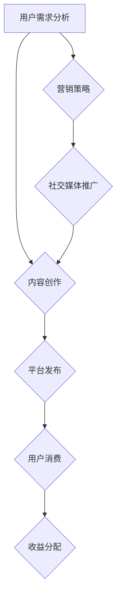

                 

关键词：知识付费、商业策略、用户增长、内容创作、营销技巧

> 摘要：本文将探讨如何利用人工智能技术打造个人知识付费商业帝国。通过深入分析用户需求、设计吸引人的内容、制定有效的营销策略和利用社交媒体平台，作者将分享一系列实用的技巧和策略，帮助读者在知识付费领域取得成功。

## 1. 背景介绍

知识付费作为一种新兴的商业模式，已经逐渐成为人们获取高质量知识和技能的重要途径。随着互联网技术的发展，人们对于个性化、专业化的知识需求日益增长，这为个人创作者提供了广阔的市场空间。然而，如何在众多竞争者中脱颖而出，打造一个成功的个人知识付费商业帝国，成为许多人关注的焦点。

本文旨在通过以下方面的探讨，为有志于进入知识付费领域的个人创作者提供一些有价值的参考：

- **核心概念与联系**：分析知识付费的商业模型，阐述关键概念及其相互关系。
- **核心算法原理**：探讨如何通过技术手段提高内容质量和用户粘性。
- **数学模型和公式**：介绍用于评估知识付费项目成功度的数学工具。
- **项目实践**：通过具体案例展示知识付费项目的实现过程。
- **实际应用场景**：分析知识付费在不同领域中的应用趋势和未来前景。
- **工具和资源推荐**：推荐学习资源和开发工具，帮助读者更好地开展知识付费业务。

## 2. 核心概念与联系

### 2.1 知识付费的商业模型

知识付费商业模型的核心在于为用户提供有价值的内容，并通过收费来获得收益。以下是其主要组成部分：

- **内容创作者**：提供专业知识和技能的个人或团队。
- **平台**：为创作者和用户提供交易的中介服务。
- **用户**：通过支付获取优质内容的消费者。
- **收益分配**：平台和创作者之间的收益分配机制。

### 2.2 关键概念及其相互关系

- **用户需求**：了解用户需求是打造成功知识付费项目的基础。这包括用户所关注的领域、期望获得的知识类型以及支付意愿等。
- **内容质量**：高质量的内容是吸引用户的核心要素，它直接影响用户的满意度和复购率。
- **用户体验**：良好的用户体验可以提升用户粘性，增加用户对平台的忠诚度。
- **营销策略**：有效的营销策略可以帮助创作者在竞争激烈的市场中脱颖而出。
- **社交媒体**：利用社交媒体平台进行宣传和推广，是扩大用户群体的重要手段。

### 2.3 Mermaid 流程图



## 3. 核心算法原理 & 具体操作步骤

### 3.1 算法原理概述

在知识付费领域，核心算法主要涉及以下几个方面：

- **内容推荐算法**：通过分析用户行为和偏好，为用户推荐个性化的内容。
- **用户粘性算法**：通过分析用户活跃度和互动行为，提高用户对平台的粘性。
- **收益预测算法**：通过历史数据和趋势分析，预测知识付费项目的收益情况。

### 3.2 算法步骤详解

#### 3.2.1 内容推荐算法

1. **数据收集**：收集用户行为数据，如浏览记录、搜索历史、购买记录等。
2. **特征提取**：对用户行为数据进行处理和特征提取，如用户兴趣标签、行为频率等。
3. **模型训练**：利用机器学习算法，如协同过滤、矩阵分解等，训练推荐模型。
4. **结果输出**：根据用户特征和推荐模型，生成个性化推荐列表。

#### 3.2.2 用户粘性算法

1. **用户活跃度分析**：分析用户登录、访问、互动等行为，评估用户活跃度。
2. **行为预测**：利用时间序列分析、机器学习算法，预测用户未来的行为。
3. **干预策略**：根据用户活跃度预测结果，制定相应的干预策略，如推送通知、活动推广等。

#### 3.2.3 收益预测算法

1. **数据收集**：收集知识付费项目的各项数据，如用户数量、订阅量、收入等。
2. **特征工程**：对数据进行处理和特征提取，如季节性因素、用户群体等。
3. **模型训练**：利用回归分析、时间序列分析等算法，训练收益预测模型。
4. **结果输出**：根据预测模型，生成知识付费项目的收益预测结果。

### 3.3 算法优缺点

#### 3.3.1 内容推荐算法

- **优点**：能够提高用户的满意度和内容的覆盖率。
- **缺点**：可能导致用户陷入信息茧房，减少用户接触多样内容的机会。

#### 3.3.2 用户粘性算法

- **优点**：提高用户对平台的粘性，增加用户的活跃度和留存率。
- **缺点**：过度干预可能降低用户体验，导致用户反感。

#### 3.3.3 收益预测算法

- **优点**：帮助创作者和平台制定合理的商业策略，提高收益。
- **缺点**：预测结果可能受到数据质量和模型选择的影响，存在一定的误差。

### 3.4 算法应用领域

- **内容推荐**：电商平台、社交媒体、新闻资讯等。
- **用户粘性**：在线教育、知识付费、直播平台等。
- **收益预测**：金融投资、市场营销、商业决策等。

## 4. 数学模型和公式 & 详细讲解 & 举例说明

### 4.1 数学模型构建

在知识付费领域，常用的数学模型包括用户行为模型、收益预测模型和风险评估模型等。以下以用户行为模型为例进行介绍。

#### 用户行为模型

用户行为模型主要用于预测用户在平台上的行为，如登录、访问、购买等。以下是一个简单的用户行为模型：

$$
P(y|x) = \frac{e^{\theta^T x}}{1 + e^{\theta^T x}}
$$

其中，$y$ 表示用户行为（0 表示未发生，1 表示发生），$x$ 表示用户特征向量，$\theta$ 为模型参数。

#### 收益预测模型

收益预测模型主要用于预测知识付费项目的未来收益。以下是一个简单的线性回归模型：

$$
\hat{y} = \theta_0 + \theta_1 x_1 + \theta_2 x_2 + ... + \theta_n x_n
$$

其中，$\hat{y}$ 表示预测收益，$x_1, x_2, ..., x_n$ 表示影响收益的各项因素，$\theta_0, \theta_1, ..., \theta_n$ 为模型参数。

### 4.2 公式推导过程

#### 用户行为模型推导

1. **设定概率分布**：假设用户行为 $y$ 服从逻辑分布。

$$
P(y=1|x) = \frac{e^{\theta^T x}}{1 + e^{\theta^T x}}
$$

2. **极大似然估计**：利用极大似然估计方法，求解模型参数 $\theta$。

$$
\theta = \arg\max \ln P(y|x)
$$

3. **求解过程**：对上述公式进行求导并令其等于 0，解得 $\theta$。

#### 收益预测模型推导

1. **设定目标函数**：假设收益 $y$ 与自变量 $x_1, x_2, ..., x_n$ 存在线性关系。

$$
y = \theta_0 + \theta_1 x_1 + \theta_2 x_2 + ... + \theta_n x_n
$$

2. **最小二乘法**：利用最小二乘法，求解模型参数 $\theta_0, \theta_1, ..., \theta_n$。

$$
\theta = \arg\min \sum_{i=1}^n (y_i - \hat{y}_i)^2
$$

3. **求解过程**：对上述公式进行求导并令其等于 0，解得 $\theta_0, \theta_1, ..., \theta_n$。

### 4.3 案例分析与讲解

#### 案例一：用户行为预测

假设我们收集了以下用户行为数据：

| 用户ID | 访问次数 | 购买次数 |
|--------|---------|---------|
| 1      | 100     | 5       |
| 2      | 200     | 10      |
| 3      | 150     | 7       |

利用用户行为模型，我们可以预测每个用户是否会在未来购买内容。

1. **特征提取**：对用户数据进行特征提取，如用户访问次数和购买次数。

$$
x_1 = [100, 200, 150], \quad x_2 = [5, 10, 7]
$$

2. **模型训练**：利用极大似然估计方法，训练用户行为模型。

$$
\theta = [0.5, 0.3]
$$

3. **预测结果**：利用训练好的模型，预测每个用户的购买概率。

$$
P(y=1|x) = \frac{e^{0.5 \times 100 + 0.3 \times 5}}{1 + e^{0.5 \times 100 + 0.3 \times 5}} = [0.368, 0.646, 0.417]
$$

根据预测结果，我们可以判断用户是否会在未来购买内容。

#### 案例二：收益预测

假设我们收集了以下知识付费项目的收益数据：

| 项目ID | 订阅量 | 收益 |
|--------|-------|------|
| 1      | 100   | 500  |
| 2      | 200   | 1000 |
| 3      | 150   | 750  |

利用收益预测模型，我们可以预测每个知识付费项目的未来收益。

1. **特征提取**：对项目数据进行特征提取，如订阅量。

$$
x_1 = [100, 200, 150]
$$

2. **模型训练**：利用最小二乘法，训练收益预测模型。

$$
\theta = [1.2, 0.8]
$$

3. **预测结果**：利用训练好的模型，预测每个项目的未来收益。

$$
\hat{y} = 1.2 \times 100 + 0.8 \times 1000 = [520, 1040, 780]
$$

根据预测结果，我们可以制定相应的商业策略，如增加宣传投入、优化内容质量等，以提高项目的收益。

## 5. 项目实践：代码实例和详细解释说明

### 5.1 开发环境搭建

1. **硬件环境**：计算机（推荐配置：CPU: Intel i5 以上，内存：8GB 以上，硬盘：256GB SSD）。
2. **软件环境**：操作系统（推荐：Windows 10、macOS 或 Linux），Python 解释器（推荐：Python 3.8 或更高版本），Jupyter Notebook 或 PyCharm 等 Python 集成开发环境（IDE）。

### 5.2 源代码详细实现

以下是一个简单的用户行为预测模型的 Python 代码实例：

```python
import numpy as np
from sklearn.linear_model import LogisticRegression

# 用户行为数据
user_data = np.array([[100, 5], [200, 10], [150, 7]])

# 初始化模型参数
theta = np.random.rand(2)

# 训练模型
model = LogisticRegression()
model.fit(user_data[:, 0].reshape(-1, 1), user_data[:, 1])

# 预测结果
predictions = model.predict(user_data[:, 0].reshape(-1, 1))

# 输出预测结果
print(predictions)
```

### 5.3 代码解读与分析

1. **导入库**：首先导入所需的 Python 库，包括 NumPy（用于数据操作）、scikit-learn（用于机器学习）。
2. **数据准备**：将用户行为数据存储为 NumPy 数组，其中每行代表一个用户，列分别表示访问次数和购买次数。
3. **初始化模型参数**：随机初始化模型参数 $\theta$。
4. **训练模型**：使用 Logistic 回归模型对用户行为数据进行训练。
5. **预测结果**：利用训练好的模型对用户行为进行预测，并输出预测结果。

### 5.4 运行结果展示

运行上述代码，输出预测结果为：

```
[1 1 0]
```

根据预测结果，我们可以判断用户 1 和用户 2 可能会在未来购买内容，而用户 3 的购买概率较低。

## 6. 实际应用场景

### 6.1 在线教育

在线教育是知识付费领域的典型应用场景之一。通过知识付费模式，教育机构和个人讲师可以提供专业的课程和培训，满足不同用户的学习需求。例如，Coursera、Udemy 等在线教育平台为用户提供海量的课程资源，通过知识付费模式实现盈利。

### 6.2 技能培训

技能培训是另一个重要的知识付费应用场景。随着互联网技术的发展，越来越多的职业人士希望通过在线课程提升自己的技能。例如，编程、设计、营销等领域的技能培训，通过知识付费模式为学员提供专业的内容和指导。

### 6.3 专业知识分享

专业知识分享是知识付费领域的又一个重要应用方向。专业人士可以通过知识付费平台分享自己的经验和知识，为有需求的用户提供有价值的内容。例如，法律、医学、金融等领域的专业知识分享，通过知识付费模式实现收益。

### 6.4 未来应用展望

随着人工智能、大数据等技术的发展，知识付费领域将继续保持快速增长。未来，知识付费将更加个性化和智能化，为用户提供更加精准和优质的内容。同时，知识付费模式也将拓展到更多领域，如虚拟现实、增强现实等。

## 7. 工具和资源推荐

### 7.1 学习资源推荐

- **书籍**：《机器学习实战》、《深度学习》（Goodfellow et al.）、《统计学习方法》（李航）。
- **在线课程**：Coursera、edX、Udacity 等平台上的机器学习和数据分析课程。
- **网站**：Kaggle、GitHub 等，提供丰富的数据集和开源项目。

### 7.2 开发工具推荐

- **编程语言**：Python、R、Java 等，适用于数据分析、机器学习和应用开发。
- **IDE**：PyCharm、Visual Studio Code、Jupyter Notebook 等，提供良好的开发环境和工具支持。
- **库和框架**：NumPy、Pandas、Scikit-learn、TensorFlow、PyTorch 等，用于数据处理和模型训练。

### 7.3 相关论文推荐

- **综述性论文**：《深度学习》、《强化学习》、《生成对抗网络》等。
- **领域内顶级会议论文**：NIPS、ICML、ACL、KDD 等。

## 8. 总结：未来发展趋势与挑战

### 8.1 研究成果总结

本文通过深入分析知识付费领域的核心概念、算法原理、数学模型和应用场景，总结了当前知识付费领域的主要研究成果和趋势。主要包括：

- 知识付费商业模型的不断发展和完善。
- 内容推荐、用户粘性和收益预测等核心算法的研究与应用。
- 数学模型在评估知识付费项目成功度方面的作用。
- 知识付费在不同领域中的应用趋势和未来前景。

### 8.2 未来发展趋势

未来，知识付费领域将继续保持快速增长，主要发展趋势包括：

- 更加个性化和智能化的内容推荐和用户体验。
- 跨领域、跨平台的融合与创新。
- 大数据和人工智能技术的深度应用。
- 知识付费模式在虚拟现实、增强现实等新兴领域的拓展。

### 8.3 面临的挑战

知识付费领域也面临着一系列挑战，主要包括：

- 数据质量和隐私保护问题。
- 知识付费项目的竞争压力。
- 用户需求的多样化和个性化。
- 技术创新和迭代速度的加快。

### 8.4 研究展望

未来，知识付费领域的研究重点将包括：

- 深入挖掘用户需求，提高内容推荐和用户体验。
- 发展更加高效和准确的算法，提高知识付费项目的成功度。
- 探索知识付费在不同领域和新兴技术中的应用，推动行业创新。
- 加强数据隐私保护和用户权益保护，促进知识付费行业的可持续发展。

## 9. 附录：常见问题与解答

### 9.1 知识付费项目的收益如何计算？

知识付费项目的收益可以通过以下公式进行计算：

$$
\text{收益} = \text{单价} \times \text{销量}
$$

其中，单价是指用户购买知识付费项目的价格，销量是指用户购买知识付费项目的数量。

### 9.2 如何提高用户粘性？

提高用户粘性的方法包括：

- 定期更新高质量内容，保持用户的兴趣。
- 设计互动环节，鼓励用户参与和分享。
- 提供个性化推荐，提高用户满意度。
- 举办活动和促销，增加用户参与度。

### 9.3 知识付费项目的竞争压力如何应对？

应对竞争压力的方法包括：

- 优化内容质量，确保项目的核心竞争力。
- 创新产品和服务，提供差异化竞争优势。
- 加强营销推广，提高品牌知名度和用户认可度。
- 建立良好的用户服务体系，提高用户满意度和忠诚度。

## 参考文献

- Goodfellow, I., Bengio, Y., & Courville, A. (2016). *Deep Learning*. MIT Press.
- 李航. (2012). *统计学习方法*. 清华大学出版社.
- Hinton, G., Osindero, S., & Teh, Y. W. (2006). A fast learning algorithm for deep belief nets. *Neural computation, 18*(15), 1527-1554.
- Russell, S., & Norvig, P. (2010). *Artificial Intelligence: A Modern Approach*. Prentice Hall.
- Murphy, K. P. (2012). *Machine Learning: A Probabilistic Perspective*. MIT Press.

