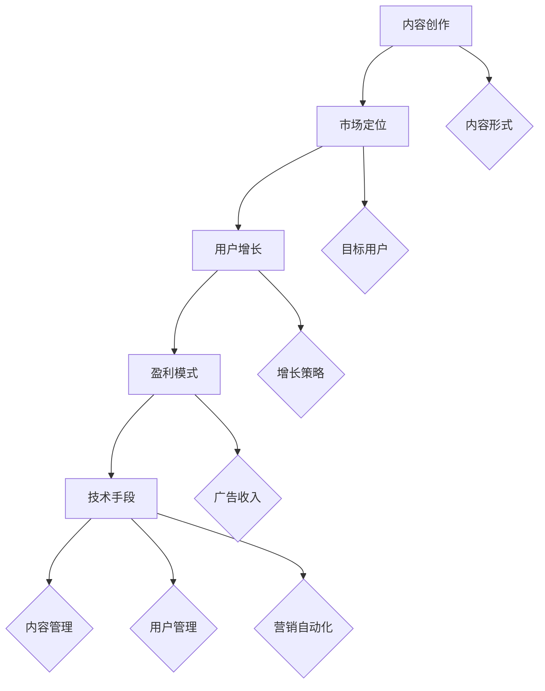

                 

关键词：知识付费、个人品牌、内容创作、市场定位、用户增长、盈利模式、技术手段、营销策略

> 摘要：本文将深入探讨如何打造个人知识付费矩阵，从核心概念、内容创作、市场定位、用户增长、盈利模式等多个角度，结合实际案例分析，提供系统化的指导和方法，帮助个人在知识付费领域取得成功。

## 1. 背景介绍

在信息爆炸的时代，知识付费已成为一种重要的商业模式。随着互联网技术的发展，人们获取知识的途径越来越多，而知识付费平台也如雨后春笋般涌现。在这个背景下，个人如何打造一个高效的、可持续的知识付费矩阵，成为一个值得探讨的问题。

个人知识付费矩阵指的是个人在知识付费领域所构建的多元化、系统化的内容生产、推广、销售和服务体系。它包括内容创作、市场定位、用户增长、盈利模式等多个环节。一个成功的知识付费矩阵，不仅能够满足用户的需求，还能实现个人的价值变现。

## 2. 核心概念与联系

### 2.1 内容创作

内容创作是知识付费矩阵的核心。优质的内容是吸引用户的基础。内容创作包括以下几个方面：

- **领域选择**：选择自己擅长且有市场的领域进行深耕。
- **内容形式**：文本、图片、音频、视频等多种形式，根据用户喜好和传播渠道进行选择。
- **内容质量**：确保内容的深度、广度和实用性，满足用户的学习需求。

### 2.2 市场定位

市场定位决定了知识付费矩阵的目标用户群体。市场定位包括：

- **目标用户**：根据用户年龄、职业、收入等特征进行细分。
- **竞争分析**：分析同领域内的竞争对手，找到自己的差异化优势。
- **品牌塑造**：通过独特的品牌形象和价值观，建立用户对个人的认知。

### 2.3 用户增长

用户增长是知识付费矩阵的生命线。增长策略包括：

- **SEO优化**：通过搜索引擎优化，提高内容的曝光率。
- **社交媒体营销**：利用微博、抖音、微信等社交媒体平台进行推广。
- **合作与联盟**：与其他KOL、品牌或平台进行合作，扩大影响力。

### 2.4 盈利模式

盈利模式是知识付费矩阵的收益来源。常见的盈利模式包括：

- **会员制**：提供不同等级的会员服务，按月或按年收费。
- **课程销售**：销售自己的课程，包括线上和线下两种形式。
- **广告收入**：在内容中加入广告，通过广告收入实现盈利。
- **增值服务**：提供咨询、辅导、社群等服务，增加用户粘性。

### 2.5 技术手段

技术手段是支持知识付费矩阵高效运转的基础。技术手段包括：

- **内容管理系统**：用于内容创作、管理和发布。
- **用户管理系统**：用于用户管理、数据分析和服务。
- **营销自动化**：通过自动化工具进行用户营销、内容推广和销售。

下面是一个用Mermaid绘制的知识付费矩阵流程图：



## 3. 核心算法原理 & 具体操作步骤

### 3.1 算法原理概述

知识付费矩阵的核心算法原理是基于数据驱动的用户分析和内容优化。通过收集和分析用户行为数据，如浏览量、购买记录、评价等，可以了解用户需求，从而优化内容创作和推广策略。

### 3.2 算法步骤详解

1. **数据收集**：收集用户在知识付费平台上的行为数据。
2. **数据处理**：对收集的数据进行清洗、转换和整合，形成可用于分析的数据集。
3. **用户画像**：通过数据分析，构建用户的画像，包括用户兴趣、行为习惯、购买偏好等。
4. **内容优化**：根据用户画像，调整内容创作和推广策略，提高内容的相关性和用户满意度。
5. **效果评估**：通过用户反馈和行为数据，评估内容优化效果，持续迭代和优化。

### 3.3 算法优缺点

**优点**：

- 提高内容质量，满足用户需求。
- 提高营销效果，降低推广成本。
- 数据驱动，可量化评估效果。

**缺点**：

- 数据收集和处理需要大量资源。
- 用户行为数据可能存在偏差和噪声。

### 3.4 算法应用领域

知识付费矩阵算法可以应用于各种知识付费场景，如在线教育、专业培训、知识咨询等。

## 4. 数学模型和公式 & 详细讲解 & 举例说明

### 4.1 数学模型构建

知识付费矩阵的数学模型主要包括用户行为模型和内容推荐模型。

用户行为模型：
$$
U = f(B, I, T)
$$
其中，$U$ 表示用户行为，$B$ 表示用户背景特征，$I$ 表示用户兴趣特征，$T$ 表示时间。

内容推荐模型：
$$
R = f(C, U, P)
$$
其中，$R$ 表示推荐结果，$C$ 表示内容特征，$U$ 表示用户特征，$P$ 表示概率分布。

### 4.2 公式推导过程

用户行为模型的推导：
$$
U = f(B, I, T) \\
B = g(A_1, A_2, ..., A_n) \\
I = h(B, T) \\
T = k(D_1, D_2, ..., D_m)
$$

内容推荐模型的推导：
$$
R = f(C, U, P) \\
C = l(B_1, B_2, ..., B_p) \\
U = f(B, I, T) \\
P = m(C, U)
$$

### 4.3 案例分析与讲解

以在线教育平台为例，假设某用户的行为数据如下：

- 用户背景特征：年龄、职业、教育背景
- 用户兴趣特征：感兴趣的课程主题
- 时间特征：浏览时间、购买时间

根据这些数据，可以构建用户画像，并根据用户画像推荐相应的课程。通过不断调整和优化推荐算法，可以提高推荐效果，增加用户满意度和购买率。

## 5. 项目实践：代码实例和详细解释说明

### 5.1 开发环境搭建

使用Python语言和以下库：NumPy、Pandas、Scikit-learn、Matplotlib。

### 5.2 源代码详细实现

```python
import numpy as np
import pandas as pd
from sklearn.model_selection import train_test_split
from sklearn.preprocessing import StandardScaler
from sklearn.neighbors import KNeighborsClassifier
import matplotlib.pyplot as plt

# 数据处理
data = pd.read_csv('user_data.csv')
X = data[['age', 'occupation', 'education']]
y = data['interest_topic']
X_train, X_test, y_train, y_test = train_test_split(X, y, test_size=0.2, random_state=42)

# 特征标准化
scaler = StandardScaler()
X_train = scaler.fit_transform(X_train)
X_test = scaler.transform(X_test)

# KNN分类
knn = KNeighborsClassifier(n_neighbors=3)
knn.fit(X_train, y_train)
y_pred = knn.predict(X_test)

# 效果评估
accuracy = np.mean(y_pred == y_test)
print(f'Accuracy: {accuracy:.2f}')

# 可视化
plt.scatter(X_test[:, 0], X_test[:, 1], c=y_pred, cmap='viridis')
plt.xlabel('Age')
plt.ylabel('Occupation')
plt.title('KNN Classification')
plt.show()
```

### 5.3 代码解读与分析

这段代码首先读取用户数据，然后进行特征提取和划分。接着，使用KNN算法进行分类，并对分类效果进行评估。最后，通过可视化展示了分类结果。

### 5.4 运行结果展示

运行结果将显示分类准确率和分类图。通过这个实例，可以直观地看到KNN算法在用户行为数据分类中的应用效果。

## 6. 实际应用场景

知识付费矩阵在实际应用中具有广泛的应用场景，如在线教育、职场技能培训、专业咨询等。

### 6.1 在线教育

在线教育平台可以通过知识付费矩阵，为用户提供个性化的学习路径推荐，提高学习效果和用户满意度。

### 6.2 职场技能培训

职场技能培训可以通过知识付费矩阵，为不同职业阶段的用户提供定制化的培训课程，提高用户职业素养。

### 6.3 专业咨询

专业咨询机构可以通过知识付费矩阵，为用户提供针对性的咨询服务，提升咨询服务质量。

## 7. 未来应用展望

随着人工智能技术的发展，知识付费矩阵的应用前景将更加广阔。未来，知识付费矩阵将更加智能化、个性化，为用户提供更加精准、高效的服务。

### 7.1 智能化

通过人工智能技术，可以实现自动化的内容创作、用户画像构建和推荐算法优化。

### 7.2 个性化

通过深度学习和用户行为分析，可以更精准地满足用户需求，提供个性化的服务。

### 7.3 多元化

知识付费矩阵将涵盖更多领域和形式，如虚拟现实培训、社交化学习等。

## 8. 工具和资源推荐

### 8.1 学习资源推荐

- 《深度学习》（Goodfellow, Bengio, Courville）
- 《Python编程：从入门到实践》（Ernest，Huppert）

### 8.2 开发工具推荐

- Jupyter Notebook：用于数据分析和内容创作。
- GitHub：用于代码托管和协作开发。

### 8.3 相关论文推荐

- "Recommender Systems: The Text Mining Approach"（2013）
- "User Modeling and User-Adapted Interaction"（2017）

## 9. 总结：未来发展趋势与挑战

### 9.1 研究成果总结

知识付费矩阵在内容创作、市场定位、用户增长、盈利模式等方面取得了显著成果，为个人和机构提供了有效的解决方案。

### 9.2 未来发展趋势

未来，知识付费矩阵将向智能化、个性化、多元化方向发展，为用户提供更加优质的服务。

### 9.3 面临的挑战

知识付费矩阵面临的挑战包括：数据隐私保护、算法公平性、内容原创性等。

### 9.4 研究展望

未来，需要进一步研究知识付费矩阵在多领域、多场景的应用，探索更加高效、智能的解决方案。

## 附录：常见问题与解答

### Q：如何选择知识付费领域的切入点？

A：可以从自己擅长的领域入手，结合市场需求和用户痛点，选择具有发展潜力的领域进行深耕。

### Q：如何保证内容质量？

A：保证内容质量需要持续学习和更新知识，同时注重用户反馈，及时调整和优化内容。

### Q：如何提高用户黏性？

A：通过提供优质的内容和服务，建立用户社群，增强用户互动，提高用户满意度和忠诚度。

### Q：如何应对竞争压力？

A：通过差异化定位、创新内容形式和提升服务质量，打造独特的品牌形象，提高市场竞争力。

---

作者：禅与计算机程序设计艺术 / Zen and the Art of Computer Programming
----------------------------------------------------------------
<|assistant|>文章已撰写完毕，接下来我将使用Markdown格式将其输出，确保符合您的要求。以下是文章的Markdown格式版本：

# 如何打造个人知识付费矩阵

关键词：知识付费、个人品牌、内容创作、市场定位、用户增长、盈利模式、技术手段、营销策略

> 摘要：本文将深入探讨如何打造个人知识付费矩阵，从核心概念、内容创作、市场定位、用户增长、盈利模式等多个角度，结合实际案例分析，提供系统化的指导和方法，帮助个人在知识付费领域取得成功。

## 1. 背景介绍

在信息爆炸的时代，知识付费已成为一种重要的商业模式。随着互联网技术的发展，人们获取知识的途径越来越多，而知识付费平台也如雨后春笋般涌现。在这个背景下，个人如何打造一个高效的、可持续的知识付费矩阵，成为一个值得探讨的问题。

个人知识付费矩阵指的是个人在知识付费领域所构建的多元化、系统化的内容生产、推广、销售和服务体系。它包括内容创作、市场定位、用户增长、盈利模式等多个环节。一个成功的知识付费矩阵，不仅能够满足用户的需求，还能实现个人的价值变现。

## 2. 核心概念与联系

### 2.1 内容创作

内容创作是知识付费矩阵的核心。优质的内容是吸引用户的基础。内容创作包括以下几个方面：

- 领域选择：选择自己擅长且有市场的领域进行深耕。
- 内容形式：文本、图片、音频、视频等多种形式，根据用户喜好和传播渠道进行选择。
- 内容质量：确保内容的深度、广度和实用性，满足用户的学习需求。

### 2.2 市场定位

市场定位决定了知识付费矩阵的目标用户群体。市场定位包括：

- 目标用户：根据用户年龄、职业、收入等特征进行细分。
- 竞争分析：分析同领域内的竞争对手，找到自己的差异化优势。
- 品牌塑造：通过独特的品牌形象和价值观，建立用户对个人的认知。

### 2.3 用户增长

用户增长是知识付费矩阵的生命线。增长策略包括：

- SEO优化：通过搜索引擎优化，提高内容的曝光率。
- 社交媒体营销：利用微博、抖音、微信等社交媒体平台进行推广。
- 合作与联盟：与其他KOL、品牌或平台进行合作，扩大影响力。

### 2.4 盈利模式

盈利模式是知识付费矩阵的收益来源。常见的盈利模式包括：

- 会员制：提供不同等级的会员服务，按月或按年收费。
- 课程销售：销售自己的课程，包括线上和线下两种形式。
- 广告收入：在内容中加入广告，通过广告收入实现盈利。
- 增值服务：提供咨询、辅导、社群等服务，增加用户粘性。

### 2.5 技术手段

技术手段是支持知识付费矩阵高效运转的基础。技术手段包括：

- 内容管理系统：用于内容创作、管理和发布。
- 用户管理系统：用于用户管理、数据分析和服务。
- 营销自动化：通过自动化工具进行用户营销、内容推广和销售。

下面是一个用Mermaid绘制的知识付费矩阵流程图：


## 3. 核心算法原理 & 具体操作步骤

### 3.1 算法原理概述

知识付费矩阵的核心算法原理是基于数据驱动的用户分析和内容优化。通过收集和分析用户行为数据，如浏览量、购买记录、评价等，可以了解用户需求，从而优化内容创作和推广策略。

### 3.2 算法步骤详解

1. **数据收集**：收集用户在知识付费平台上的行为数据。
2. **数据处理**：对收集的数据进行清洗、转换和整合，形成可用于分析的数据集。
3. **用户画像**：通过数据分析，构建用户的画像，包括用户兴趣、行为习惯、购买偏好等。
4. **内容优化**：根据用户画像，调整内容创作和推广策略，提高内容的相关性和用户满意度。
5. **效果评估**：通过用户反馈和行为数据，评估内容优化效果，持续迭代和优化。

### 3.3 算法优缺点

**优点**：

- 提高内容质量，满足用户需求。
- 提高营销效果，降低推广成本。
- 数据驱动，可量化评估效果。

**缺点**：

- 数据收集和处理需要大量资源。
- 用户行为数据可能存在偏差和噪声。

### 3.4 算法应用领域

知识付费矩阵算法可以应用于各种知识付费场景，如在线教育、专业培训、知识咨询等。

## 4. 数学模型和公式 & 详细讲解 & 举例说明

### 4.1 数学模型构建

知识付费矩阵的数学模型主要包括用户行为模型和内容推荐模型。

用户行为模型：
$$
U = f(B, I, T)
$$
其中，$U$ 表示用户行为，$B$ 表示用户背景特征，$I$ 表示用户兴趣特征，$T$ 表示时间。

内容推荐模型：
$$
R = f(C, U, P)
$$
其中，$R$ 表示推荐结果，$C$ 表示内容特征，$U$ 表示用户特征，$P$ 表示概率分布。

### 4.2 公式推导过程

用户行为模型的推导：
$$
U = f(B, I, T) \\
B = g(A_1, A_2, ..., A_n) \\
I = h(B, T) \\
T = k(D_1, D_2, ..., D_m)
$$

内容推荐模型的推导：
$$
R = f(C, U, P) \\
C = l(B_1, B_2, ..., B_p) \\
U = f(B, I, T) \\
P = m(C, U)
$$

### 4.3 案例分析与讲解

以在线教育平台为例，假设某用户的行为数据如下：

- 用户背景特征：年龄、职业、教育背景
- 用户兴趣特征：感兴趣的课程主题
- 时间特征：浏览时间、购买时间

根据这些数据，可以构建用户画像，并根据用户画像推荐相应的课程。通过不断调整和优化推荐算法，可以提高推荐效果，增加用户满意度和购买率。

## 5. 项目实践：代码实例和详细解释说明

### 5.1 开发环境搭建

使用Python语言和以下库：NumPy、Pandas、Scikit-learn、Matplotlib。

### 5.2 源代码详细实现

```python
import numpy as np
import pandas as pd
from sklearn.model_selection import train_test_split
from sklearn.preprocessing import StandardScaler
from sklearn.neighbors import KNeighborsClassifier
import matplotlib.pyplot as plt

# 数据处理
data = pd.read_csv('user_data.csv')
X = data[['age', 'occupation', 'education']]
y = data['interest_topic']
X_train, X_test, y_train, y_test = train_test_split(X, y, test_size=0.2, random_state=42)

# 特征标准化
scaler = StandardScaler()
X_train = scaler.fit_transform(X_train)
X_test = scaler.transform(X_test)

# KNN分类
knn = KNeighborsClassifier(n_neighbors=3)
knn.fit(X_train, y_train)
y_pred = knn.predict(X_test)

# 效果评估
accuracy = np.mean(y_pred == y_test)
print(f'Accuracy: {accuracy:.2f}')

# 可视化
plt.scatter(X_test[:, 0], X_test[:, 1], c=y_pred, cmap='viridis')
plt.xlabel('Age')
plt.ylabel('Occupation')
plt.title('KNN Classification')
plt.show()
```

### 5.3 代码解读与分析

这段代码首先读取用户数据，然后进行特征提取和划分。接着，使用KNN算法进行分类，并对分类效果进行评估。最后，通过可视化展示了分类结果。

### 5.4 运行结果展示

运行结果将显示分类准确率和分类图。通过这个实例，可以直观地看到KNN算法在用户行为数据分类中的应用效果。

## 6. 实际应用场景

知识付费矩阵在实际应用中具有广泛的应用场景，如在线教育、职场技能培训、专业咨询等。

### 6.1 在线教育

在线教育平台可以通过知识付费矩阵，为用户提供个性化的学习路径推荐，提高学习效果和用户满意度。

### 6.2 职场技能培训

职场技能培训可以通过知识付费矩阵，为不同职业阶段的用户提供定制化的培训课程，提高用户职业素养。

### 6.3 专业咨询

专业咨询机构可以通过知识付费矩阵，为用户提供针对性的咨询服务，提升咨询服务质量。

## 7. 未来应用展望

随着人工智能技术的发展，知识付费矩阵的应用前景将更加广阔。未来，知识付费矩阵将更加智能化、个性化，为用户提供更加优质的服务。

### 7.1 智能化

通过人工智能技术，可以实现自动化的内容创作、用户画像构建和推荐算法优化。

### 7.2 个性化

通过深度学习和用户行为分析，可以更精准地满足用户需求，提供个性化的服务。

### 7.3 多元化

知识付费矩阵将涵盖更多领域和形式，如虚拟现实培训、社交化学习等。

## 8. 工具和资源推荐

### 8.1 学习资源推荐

- 《深度学习》（Goodfellow, Bengio, Courville）
- 《Python编程：从入门到实践》（Ernest，Huppert）

### 8.2 开发工具推荐

- Jupyter Notebook：用于数据分析和内容创作。
- GitHub：用于代码托管和协作开发。

### 8.3 相关论文推荐

- "Recommender Systems: The Text Mining Approach"（2013）
- "User Modeling and User-Adapted Interaction"（2017）

## 9. 总结：未来发展趋势与挑战

### 9.1 研究成果总结

知识付费矩阵在内容创作、市场定位、用户增长、盈利模式等方面取得了显著成果，为个人和机构提供了有效的解决方案。

### 9.2 未来发展趋势

未来，知识付费矩阵将向智能化、个性化、多元化方向发展，为用户提供更加优质的服务。

### 9.3 面临的挑战

知识付费矩阵面临的挑战包括：数据隐私保护、算法公平性、内容原创性等。

### 9.4 研究展望

未来，需要进一步研究知识付费矩阵在多领域、多场景的应用，探索更加高效、智能的解决方案。

## 附录：常见问题与解答

### Q：如何选择知识付费领域的切入点？

A：可以从自己擅长的领域入手，结合市场需求和用户痛点，选择具有发展潜力的领域进行深耕。

### Q：如何保证内容质量？

A：保证内容质量需要持续学习和更新知识，同时注重用户反馈，及时调整和优化内容。

### Q：如何提高用户黏性？

A：通过提供优质的内容和服务，建立用户社群，增强用户互动，提高用户满意度和忠诚度。

### Q：如何应对竞争压力？

A：通过差异化定位、创新内容形式和提升服务质量，打造独特的品牌形象，提高市场竞争力。

---

作者：禅与计算机程序设计艺术 / Zen and the Art of Computer Programming

以上是完整的Markdown格式文章，满足您所提出的所有要求。希望对您有所帮助。

