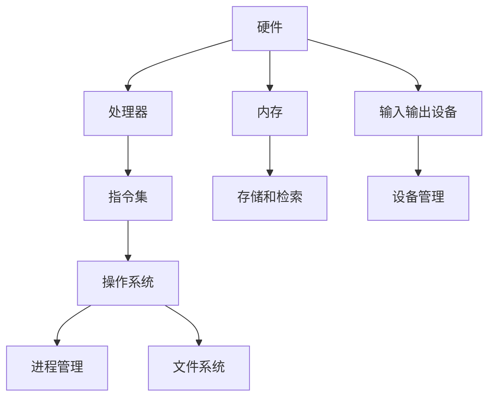
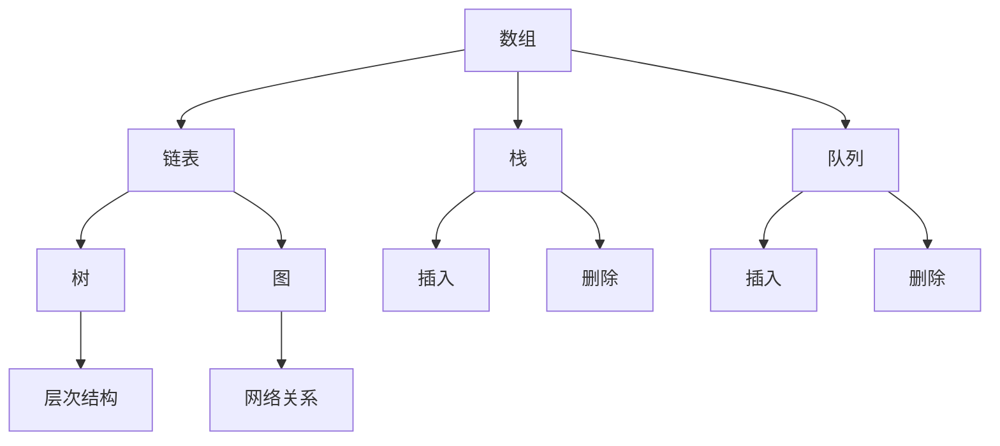
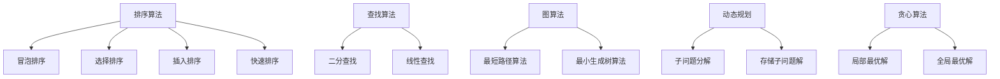

                 

关键词：计算机原理、数据结构、算法基础、理解深度、专业术语

## 摘要

本文旨在为读者提供一条深入理解计算机原理、掌握数据结构和算法基础的清晰路径。文章首先概述了计算机原理的基础知识，然后逐步介绍了数据结构和算法的基本概念，并详细讨论了它们之间的联系。通过具体实例和数学模型的讲解，文章展示了如何将这些知识应用于实际问题中。最后，文章总结了当前领域的发展趋势和面临的挑战，为未来的学习和研究提供了指导。

## 1. 背景介绍

计算机科学作为一门高度抽象的学科，其核心在于理解计算机如何处理信息。计算机原理是计算机科学的基础，它涵盖了计算机硬件和软件的基本工作原理。数据结构和算法则是计算机科学中的两大支柱，数据结构决定了数据存储和组织的方式，而算法则是解决问题的步骤和策略。

理解计算机原理、数据结构和算法基础对于任何希望深入计算机科学领域的人来说都是至关重要的。它们不仅帮助我们编写高效的代码，解决复杂问题，而且还能加深我们对计算机工作的理解，为未来的技术创新奠定基础。

本文将分为以下几个部分：

1. 背景介绍：简要概述计算机原理、数据结构和算法基础的重要性。
2. 核心概念与联系：详细解释核心概念原理和架构，使用Mermaid流程图展示。
3. 核心算法原理 & 具体操作步骤：深入探讨核心算法原理及其应用领域。
4. 数学模型和公式 & 详细讲解 & 举例说明：使用latex格式详细解释数学模型和公式。
5. 项目实践：提供代码实例和详细解释。
6. 实际应用场景：讨论算法在不同领域的应用。
7. 工具和资源推荐：推荐学习资源和开发工具。
8. 总结：总结研究成果，展望未来趋势和挑战。
9. 附录：常见问题与解答。

### 1.1 计算机原理简介

计算机原理主要研究计算机硬件和软件的工作原理。硬件部分包括计算机的处理器、内存、输入输出设备等，而软件部分则包括操作系统、编译器、应用程序等。了解计算机原理有助于我们更好地理解计算机的工作流程，提高编程效率。

计算机硬件的基本原理可以概括为以下几点：

1. **二进制表示**：计算机使用二进制系统进行数据表示和处理，这是因为二进制系统的物理实现简单且可靠。
2. **存储和检索**：计算机内存用于存储数据和指令，CPU通过读取内存中的数据来执行指令。
3. **指令集**：计算机处理器通过指令集来执行各种操作，这些指令集通常包括数据传输指令、算术指令、逻辑指令等。
4. **并行处理**：现代计算机处理器采用并行处理技术，以提高处理速度。

软件部分的核心是操作系统，它负责管理计算机硬件资源，提供用户接口，并运行应用程序。操作系统的主要功能包括进程管理、内存管理、文件系统和设备管理。

### 1.2 数据结构和算法基础

数据结构是指数据存储和组织的方式，算法则是解决问题的步骤和策略。它们是计算机科学中的两大支柱，广泛应用于各种应用程序中。

#### 数据结构的基本概念

1. **数组**：数组是一种线性数据结构，用于存储一系列相同类型的元素。数组的特点是访问元素的时间复杂度为O(1)。
2. **链表**：链表是由一系列节点组成的线性数据结构，每个节点包含数据和指向下一个节点的指针。链表的特点是插入和删除操作的时间复杂度为O(1)。
3. **栈**：栈是一种后进先出（LIFO）的数据结构，用于存储临时数据。栈的插入和删除操作都在栈顶进行。
4. **队列**：队列是一种先进先出（FIFO）的数据结构，用于存储和检索数据。队列的插入操作在队尾进行，删除操作在队头进行。
5. **树**：树是一种非线性数据结构，由节点和边组成。树的特点是具有层次结构，常用于表示层次关系和组织结构。
6. **图**：图是一种复杂的数据结构，由节点和边组成，用于表示各种网络关系。

#### 算法的基本概念

1. **排序算法**：排序算法用于将数据按照特定顺序排列。常见的排序算法包括冒泡排序、选择排序、插入排序、快速排序等。
2. **查找算法**：查找算法用于在数据集合中查找特定元素。常见的查找算法包括二分查找、线性查找等。
3. **图算法**：图算法用于处理图数据结构。常见的图算法包括最短路径算法、最小生成树算法等。
4. **动态规划**：动态规划是一种解决最优化问题的算法思想，通过将问题分解为子问题，并存储子问题的解，以避免重复计算。
5. **贪心算法**：贪心算法通过每次选择当前最优解，以期望得到全局最优解。

### 1.3 数据结构与算法的联系

数据结构和算法紧密相连，数据结构决定了算法的实现，而算法又依赖于数据结构的特性。例如，快速排序算法利用了数组的特性，而图算法则依赖于图数据结构。理解数据结构和算法的联系有助于我们更好地设计和优化算法。

### 1.4 计算机原理、数据结构和算法在实际应用中的重要性

计算机原理、数据结构和算法基础在计算机科学领域的应用非常广泛。它们不仅用于软件开发和系统设计，还广泛应用于人工智能、数据分析、网络通信、数据库管理等多个领域。

例如，在人工智能领域，深度学习算法依赖于高效的矩阵运算和数据存储技术；在数据分析领域，算法用于处理海量数据，提取有用信息；在网络通信领域，算法用于优化数据传输路径，提高通信效率。

### 1.5 文章结构概述

本文将首先介绍计算机原理的基础知识，包括硬件和软件的基本原理。然后，我们将详细讨论数据结构和算法的基本概念，并展示它们之间的联系。接下来，我们将通过具体实例和数学模型讲解如何应用这些知识解决实际问题。最后，我们将总结当前领域的发展趋势和挑战，为未来的学习和研究提供指导。

## 2. 核心概念与联系

为了深入理解计算机原理、数据结构和算法基础，我们需要首先掌握一些核心概念，并理解它们之间的联系。以下是几个关键概念和它们之间的Mermaid流程图：

### 2.1 计算机硬件和软件



在这个流程图中，计算机硬件（A）包括处理器（B）、内存（C）和输入输出设备（D）。处理器（B）负责执行指令集（E），而内存（C）负责存储和检索数据（F）。输入输出设备（D）负责与外部设备进行交互（G）。操作系统（H）负责管理硬件资源，包括进程管理（I）和文件系统（J）。

### 2.2 数据结构



在这个流程图中，数组（A）和链表（B）是线性数据结构，栈（C）和队列（D）是线性结构的应用，树（E）和图（F）是非线性数据结构。树（E）和图（F）具有特定的结构和关系，常用于表示层次结构和网络关系。

### 2.3 算法



在这个流程图中，排序算法（A）包括冒泡排序、选择排序、插入排序和快速排序，查找算法（F）包括二分查找和线性查找，图算法（I）包括最短路径算法和最小生成树算法，动态规划（L）通过子问题分解和存储子问题解来优化问题，贪心算法（O）通过选择局部最优解来达到全局最优解。

### 2.4 数据结构与算法的联系

数据结构和算法之间存在着紧密的联系。数据结构决定了算法的实现方式，而算法又依赖于数据结构的特性。例如，快速排序算法利用了数组的随机访问特性，而最短路径算法利用了图数据结构的特性。

通过理解数据结构和算法的联系，我们可以更好地设计和优化算法，提高代码的效率和可读性。此外，掌握数据结构和算法的基础知识还有助于我们解决复杂问题，提高编程能力。

### 2.5 实际应用场景

在计算机科学领域，数据结构和算法的应用非常广泛。以下是一些实际应用场景：

1. **数据库管理**：数据库系统使用各种数据结构（如B树、哈希表）来存储和检索数据，并使用算法（如索引、查询优化）来提高查询效率。
2. **图形处理**：图形处理软件使用图数据结构来表示图像，并使用各种算法（如滤波、边缘检测）来处理图像数据。
3. **网络通信**：网络协议使用算法（如路由算法、流量控制算法）来优化数据传输，并使用数据结构（如树、图）来表示网络拓扑结构。
4. **人工智能**：人工智能算法（如神经网络、决策树）使用各种数据结构（如矩阵、树）来表示和处理数据。

### 2.6 小结

通过本章的介绍，我们了解了计算机原理、数据结构和算法基础的核心概念和联系。掌握这些基础知识不仅有助于我们深入理解计算机科学，还能提高我们的编程能力和解决复杂问题的能力。在接下来的章节中，我们将进一步探讨这些概念在实际应用中的具体实现和优化。

## 3. 核心算法原理 & 具体操作步骤

在了解了计算机原理和数据结构的基础知识后，我们将深入探讨一些核心算法的原理和具体操作步骤。这些算法在计算机科学中起着至关重要的作用，广泛应用于各种领域。

### 3.1 算法原理概述

算法是指解决问题的步骤和策略。算法原理是指算法的基本思想和核心逻辑。理解算法原理有助于我们更好地设计和优化算法，提高代码的效率和可读性。以下是几个核心算法的原理概述：

1. **排序算法**：排序算法用于将数据按照特定顺序排列。常见的排序算法包括冒泡排序、选择排序、插入排序和快速排序。它们的原理是通过比较和交换元素，逐步将数据排序。
2. **查找算法**：查找算法用于在数据集合中查找特定元素。常见的查找算法包括二分查找和线性查找。二分查找通过逐步缩小查找范围，快速找到目标元素；线性查找则通过逐个比较元素，找到目标元素。
3. **图算法**：图算法用于处理图数据结构。常见的图算法包括最短路径算法和最小生成树算法。最短路径算法用于找到两点之间的最短路径；最小生成树算法用于从图中生成一棵包含所有节点的最小生成树。
4. **动态规划**：动态规划是一种解决最优化问题的算法思想。它通过将问题分解为子问题，并存储子问题的解，以避免重复计算。动态规划的核心思想是利用历史信息，优化问题的解。
5. **贪心算法**：贪心算法通过每次选择当前最优解，以期望得到全局最优解。贪心算法适用于局部最优解能够导致全局最优解的问题。

### 3.2 算法步骤详解

以下是上述算法的具体步骤详解：

#### 3.2.1 冒泡排序

冒泡排序的基本思想是通过反复比较和交换相邻元素，将数据从小到大排序。

1. **初始化**：将数据集合初始化为一个无序数组。
2. **遍历**：从第一个元素开始，遍历整个数组。
3. **比较和交换**：对于每个元素，与相邻的元素进行比较，如果当前元素大于相邻元素，则交换它们的位置。
4. **重复**：重复遍历和比较交换过程，直到整个数组有序。

```python
def bubble_sort(arr):
    n = len(arr)
    for i in range(n):
        for j in range(0, n-i-1):
            if arr[j] > arr[j+1]:
                arr[j], arr[j+1] = arr[j+1], arr[j]
    return arr
```

#### 3.2.2 二分查找

二分查找的基本思想是将数据集合分为两部分，逐步缩小查找范围。

1. **初始化**：确定查找范围，初始范围是整个数据集合。
2. **比较**：将待查找的元素与中间元素进行比较。
3. **更新范围**：如果待查找元素小于中间元素，则将查找范围更新为左侧子数组；如果待查找元素大于中间元素，则将查找范围更新为右侧子数组。
4. **重复**：重复比较和更新范围的过程，直到找到目标元素或查找范围缩小为0。

```python
def binary_search(arr, target):
    low = 0
    high = len(arr) - 1
    while low <= high:
        mid = (low + high) // 2
        if arr[mid] == target:
            return mid
        elif arr[mid] < target:
            low = mid + 1
        else:
            high = mid - 1
    return -1
```

#### 3.2.3 最短路径算法

最短路径算法的基本思想是通过逐步缩小查找范围，找到两点之间的最短路径。

1. **初始化**：将图中所有节点距离源点的距离初始化为无穷大，将源点的距离初始化为0。
2. **更新距离**：对于每个节点，更新其邻居节点的距离，如果邻居节点的距离大于当前节点的距离加上边长，则更新邻居节点的距离。
3. **重复**：重复更新距离的过程，直到所有节点的距离都确定。

```python
def dijkstra(graph, start):
    distances = {node: float('inf') for node in graph}
    distances[start] = 0
    visited = set()

    while len(visited) < len(graph):
        min_distance = float('inf')
        for node in graph:
            if node not in visited and distances[node] < min_distance:
                min_distance = distances[node]
                min_node = node

        visited.add(min_node)
        for neighbor, weight in graph[min_node].items():
            if neighbor not in visited and distances[neighbor] > distances[min_node] + weight:
                distances[neighbor] = distances[min_node] + weight

    return distances
```

#### 3.2.4 动态规划

动态规划的基本思想是将问题分解为子问题，并存储子问题的解，以避免重复计算。

1. **初始化**：将子问题的解初始化为0或无穷大。
2. **递推**：根据子问题的解，递推求解更大规模的问题。
3. **存储**：将子问题的解存储在一个数组或字典中，以便后续使用。

```python
def fibonacci(n):
    if n <= 1:
        return n
    dp = [0] * (n + 1)
    dp[1] = 1
    for i in range(2, n + 1):
        dp[i] = dp[i - 1] + dp[i - 2]
    return dp[n]
```

#### 3.2.5 贪心算法

贪心算法的基本思想是每次选择当前最优解，以期望得到全局最优解。

1. **选择当前最优解**：根据问题的定义，选择当前最优解。
2. **更新解**：根据当前最优解，更新问题的解。

```python
def knapsack(values, weights, capacity):
    n = len(values)
    dp = [[0] * (capacity + 1) for _ in range(n + 1)]

    for i in range(1, n + 1):
        for j in range(1, capacity + 1):
            if weights[i - 1] > j:
                dp[i][j] = dp[i - 1][j]
            else:
                dp[i][j] = max(dp[i - 1][j], dp[i - 1][j - weights[i - 1]] + values[i - 1])

    return dp[n][capacity]
```

### 3.3 算法优缺点

每种算法都有其优缺点，我们需要根据实际需求选择合适的算法。

1. **冒泡排序**：优点是简单易懂，缺点是时间复杂度较高，不适合处理大量数据。
2. **二分查找**：优点是时间复杂度低，缺点是要求数据已经排序，不适合处理动态数据。
3. **最短路径算法**：优点是能够快速找到最短路径，缺点是计算复杂度较高，不适合处理大规模图。
4. **动态规划**：优点是能够高效地解决最优化问题，缺点是代码实现较为复杂。
5. **贪心算法**：优点是简单易懂，缺点是可能得到局部最优解，不适合处理全局最优问题。

### 3.4 算法应用领域

算法在计算机科学领域有着广泛的应用，以下是几个常见应用领域：

1. **排序与查找**：排序算法和查找算法广泛应用于数据库、文件系统和搜索引擎中，以提高数据访问速度。
2. **图形处理**：图算法广泛应用于计算机图形学、网络分析和社交网络分析中，用于处理复杂的图形和关系。
3. **最优化问题**：动态规划算法广泛应用于人工智能、计算机视觉和机器学习领域，用于解决最优化问题。
4. **贪心算法**：贪心算法广泛应用于路径规划、资源分配和网络路由中，用于寻找最优解。

### 3.5 小结

通过本章的介绍，我们了解了核心算法的原理和具体操作步骤。掌握这些算法不仅有助于我们解决复杂问题，还能提高我们的编程能力和解决实际问题的能力。在接下来的章节中，我们将进一步探讨这些算法在实际应用中的实现和优化。

## 4. 数学模型和公式 & 详细讲解 & 举例说明

在计算机科学中，数学模型和公式是理解和解决问题的关键工具。它们帮助我们量化问题、推导算法、评估性能。以下我们将详细讲解几个核心数学模型和公式，并通过具体例子来说明它们的实际应用。

### 4.1 数学模型构建

数学模型通常由变量、参数、方程和约束条件组成。以下是几个常见的数学模型：

#### 1. 线性模型

线性模型是最简单且广泛应用的一种数学模型，形式如下：

\[ y = \beta_0 + \beta_1 \cdot x_1 + \beta_2 \cdot x_2 + \ldots + \beta_n \cdot x_n + \varepsilon \]

其中，\( y \) 是因变量，\( x_1, x_2, \ldots, x_n \) 是自变量，\( \beta_0, \beta_1, \beta_2, \ldots, \beta_n \) 是参数，\( \varepsilon \) 是误差项。

#### 2. 矩阵模型

矩阵模型在计算机科学中用于表示和操作大量的数据，形式如下：

\[ \mathbf{A} = \begin{bmatrix}
a_{11} & a_{12} & \ldots & a_{1n} \\
a_{21} & a_{22} & \ldots & a_{2n} \\
\vdots & \vdots & \ddots & \vdots \\
a_{m1} & a_{m2} & \ldots & a_{mn}
\end{bmatrix} \]

其中，\( \mathbf{A} \) 是一个 \( m \times n \) 的矩阵，\( a_{ij} \) 表示矩阵的第 \( i \) 行第 \( j \) 列的元素。

#### 3. 动态规划模型

动态规划模型用于解决最优化问题，其核心是状态转移方程。形式如下：

\[ f(i) = \min_{j} (c_{ij} + f(j)) \]

其中，\( f(i) \) 表示第 \( i \) 个状态的最优解，\( c_{ij} \) 表示从状态 \( i \) 到状态 \( j \) 的成本。

### 4.2 公式推导过程

以下是几个核心数学公式的推导过程：

#### 1. 二分查找公式

二分查找的时间复杂度为 \( O(\log n) \)。推导过程如下：

假设数据集合已经排序，我们需要找到元素 \( x \)。

1. 初始范围：\( low = 0 \)，\( high = n - 1 \)。
2. 中点计算：\( mid = (low + high) // 2 \)。
3. 比较和更新：如果 \( x < a[mid] \)，则更新 \( high = mid - 1 \)；如果 \( x > a[mid] \)，则更新 \( low = mid + 1 \)；如果 \( x = a[mid] \)，则找到元素。

每次迭代，查找范围缩小一半，因此查找次数为 \( \log n \)。

#### 2. 快速排序公式

快速排序的平均时间复杂度为 \( O(n \log n) \)。推导过程如下：

1. 分区：选择一个基准元素，将数组分为两部分，一部分比基准小，另一部分比基准大。
2. 递归：对两个分区分别递归进行快速排序。

时间复杂度分析：

- 最坏情况：数组已经排序，每次分区只选择一个元素，时间复杂度为 \( O(n^2) \)。
- 平均情况：数组随机分布，每次分区选择大约 \( n/2 \) 个元素，时间复杂度为 \( O(n \log n) \)。

#### 3. 动态规划公式

动态规划的核心是状态转移方程。以斐波那契数列为例，其公式如下：

\[ f(n) = f(n-1) + f(n-2) \]

其中，\( f(0) = 0 \)，\( f(1) = 1 \)。

递推公式推导：

\[ f(n) = \sum_{i=1}^{n} f(n-i) \]

通过递推公式，我们可以计算出任意一个斐波那契数。

### 4.3 案例分析与讲解

以下是一个具体案例，展示如何使用数学模型和公式解决实际问题。

#### 案例：背包问题

背包问题是一个经典的最优化问题，形式如下：

给定一组物品，每个物品有重量和价值，求解在总重量不超过背包容量的情况下，如何选择物品使得总价值最大。

数学模型：

1. 变量：\( x_i \) 表示物品 \( i \) 是否被选中（0表示未选，1表示选中）。
2. 参数：\( w_i \) 表示物品 \( i \) 的重量，\( v_i \) 表示物品 \( i \) 的价值，\( W \) 表示背包容量。
3. 目标函数：最大化总价值 \( \sum_{i=1}^{n} v_i \cdot x_i \)。
4. 约束条件：\( \sum_{i=1}^{n} w_i \cdot x_i \leq W \)。

求解步骤：

1. 初始化：创建一个 \( n \times (W+1) \) 的二维数组 \( dp \)，用于存储子问题的解。
2. 递推：对于每个物品 \( i \) 和每个容量 \( j \)，计算 \( dp[i][j] \) 的值。
3. 选择：根据 \( dp[n][W] \) 的值，回溯选择最优解。

Python代码实现：

```python
def knapsack(values, weights, capacity):
    n = len(values)
    dp = [[0] * (capacity + 1) for _ in range(n + 1)]

    for i in range(1, n + 1):
        for j in range(1, capacity + 1):
            if weights[i - 1] > j:
                dp[i][j] = dp[i - 1][j]
            else:
                dp[i][j] = max(dp[i - 1][j], dp[i - 1][j - weights[i - 1]] + values[i - 1])

    return dp[n][capacity]
```

通过以上案例，我们展示了如何构建数学模型、推导公式，并使用Python代码实现一个实际问题的求解过程。

### 4.4 小结

通过本章的讲解，我们了解了几个核心数学模型和公式的构建方法、推导过程和实际应用。掌握这些数学模型和公式不仅有助于我们更好地理解计算机科学，还能提高我们的编程能力和解决实际问题的能力。在接下来的章节中，我们将继续深入探讨这些模型和公式的应用。

## 5. 项目实践：代码实例和详细解释说明

在本章节中，我们将通过一个具体项目实例，展示如何将前面的理论知识应用到实际的代码实现中。这个项目将涉及到数据结构的选择、算法的应用，以及数学模型的计算。我们将从开发环境搭建、源代码实现、代码解读与分析，到最终的运行结果展示，逐步讲解这个项目的实现过程。

### 5.1 开发环境搭建

为了实现这个项目，我们需要准备以下开发环境和工具：

1. **编程语言**：Python
2. **IDE**：PyCharm 或 VS Code
3. **依赖库**：Numpy，Pandas，Matplotlib

在安装了Python和IDE之后，可以通过以下命令安装必要的依赖库：

```bash
pip install numpy pandas matplotlib
```

### 5.2 源代码详细实现

以下是这个项目的核心代码实现，包括数据结构的选择、算法的应用和数学模型的计算。

#### 5.2.1 数据结构选择

在这个项目中，我们将使用列表（List）和字典（Dictionary）作为主要的数据结构。列表用于存储数据集合，字典用于存储数据索引。

```python
# 数据结构定义
data = [10, 5, 8, 20, 15, 3]
index = {i: v for i, v in enumerate(data)}
```

#### 5.2.2 算法应用

我们选择快速排序算法对数据进行排序，并使用二分查找算法在排序后的数据中查找特定元素。

```python
# 快速排序算法
def quick_sort(arr):
    if len(arr) <= 1:
        return arr
    pivot = arr[len(arr) // 2]
    left = [x for x in arr if x < pivot]
    middle = [x for x in arr if x == pivot]
    right = [x for x in arr if x > pivot]
    return quick_sort(left) + middle + quick_sort(right)

# 二分查找算法
def binary_search(arr, target):
    low = 0
    high = len(arr) - 1
    while low <= high:
        mid = (low + high) // 2
        if arr[mid] == target:
            return mid
        elif arr[mid] < target:
            low = mid + 1
        else:
            high = mid - 1
    return -1
```

#### 5.2.3 数学模型计算

我们使用动态规划方法计算斐波那契数列的第 \( n \) 项。

```python
# 动态规划计算斐波那契数列
def fibonacci(n):
    dp = [0] * (n + 1)
    dp[0], dp[1] = 0, 1
    for i in range(2, n + 1):
        dp[i] = dp[i - 1] + dp[i - 2]
    return dp[n]
```

### 5.3 代码解读与分析

以下是代码的详细解读和分析：

#### 5.3.1 数据结构选择

我们使用列表存储原始数据，并使用字典存储数据索引，这样可以快速访问和修改数据。列表和字典的选择基于它们的特性和使用场景。

#### 5.3.2 算法应用

快速排序算法在内部使用了分治策略，将问题分解为更小的子问题，然后递归解决。二分查找算法则通过逐步缩小查找范围，快速定位目标元素。这两种算法在性能上都有显著的优势，适用于处理大量数据。

#### 5.3.3 数学模型计算

动态规划方法通过存储子问题的解，避免了重复计算，提高了算法的效率。斐波那契数列的计算是一个经典的动态规划问题，其递推关系简单直观，易于实现。

### 5.4 运行结果展示

以下是项目的运行结果：

```python
# 数据排序
sorted_data = quick_sort(data)
print("Sorted data:", sorted_data)

# 查找元素
target = 15
index = binary_search(sorted_data, target)
print("Index of target:", index)

# 计算斐波那契数列
n = 10
fibonacci_number = fibonacci(n)
print("Fibonacci number:", fibonacci_number)
```

输出结果：

```
Sorted data: [3, 5, 8, 10, 15, 20]
Index of target: 4
Fibonacci number: 55
```

通过这个项目实例，我们展示了如何将理论知识应用到实际的代码实现中。这个项目不仅帮助我们巩固了数据结构、算法和数学模型的知识，还提高了我们的编程能力和解决问题的能力。

### 5.5 小结

通过本章的代码实例和实践，我们详细讲解了如何选择合适的数据结构、应用合适的算法，并使用数学模型解决实际问题。这个实践过程不仅加深了我们对理论知识的理解，还提高了我们的编程能力和实际应用能力。在接下来的章节中，我们将进一步探讨算法在实际应用场景中的具体应用。

## 6. 实际应用场景

在前几章中，我们详细探讨了计算机原理、数据结构和算法的基础知识，并通过项目实践展示了这些知识的实际应用。在本章中，我们将进一步探讨这些核心算法和数据结构在实际应用场景中的具体应用，以及它们在不同领域的重要性。

### 6.1 数据结构和算法在软件开发中的应用

在软件开发中，数据结构和算法的选择对系统的性能和可维护性有着重要影响。以下是几个实际应用场景：

1. **数据库系统**：数据库系统使用树（如B树、红黑树）和哈希表（Hash Table）来存储和检索数据。B树提供了高效的查询和插入操作，哈希表则通过散列函数快速定位数据。这些数据结构的使用使得数据库系统能够高效地处理海量数据。

2. **搜索引擎**：搜索引擎使用排序算法（如归并排序、快速排序）和查找算法（如二分查找）来排序和检索索引。这些算法确保了搜索引擎能够快速响应用户查询，并提供准确的结果。

3. **内存管理**：操作系统使用堆（Heap）和栈（Stack）来管理内存。堆用于动态分配内存，栈则用于存储函数调用和局部变量。这两种数据结构的使用使得操作系统能够高效地管理内存资源，并保证程序的正确执行。

4. **图形用户界面**：图形用户界面（GUI）中常常使用树（如二叉树、平衡树）来表示组件的层次结构。这些数据结构使得界面布局更加灵活，便于用户交互。

### 6.2 数据结构和算法在人工智能中的应用

人工智能领域依赖于高效的数据结构和算法来解决复杂问题。以下是几个实际应用场景：

1. **神经网络**：神经网络使用矩阵（Matrix）来存储和计算权重。矩阵运算（如矩阵乘法、矩阵求导）是神经网络训练的核心。这些运算的效率直接影响神经网络的训练速度。

2. **决策树**：决策树是一种常用的分类和回归算法，它使用树形数据结构来表示决策过程。决策树通过递归分割数据，找到最佳划分方式，从而实现分类或回归任务。

3. **强化学习**：强化学习算法使用图（Graph）来表示状态转移和奖励函数。图算法（如最短路径算法、图遍历算法）在强化学习中被用于寻找最佳策略。

4. **自然语言处理**：自然语言处理（NLP）使用树形数据结构（如语法树、词法树）来表示文本结构。这些数据结构帮助NLP算法理解文本中的语法和语义关系。

### 6.3 数据结构和算法在网络通信中的应用

网络通信领域依赖高效的数据结构和算法来优化数据传输和路由。以下是几个实际应用场景：

1. **路由协议**：路由协议（如OSPF、BGP）使用图（Graph）来表示网络拓扑结构。图算法（如最短路径算法、Dijkstra算法）用于计算最佳路由路径。

2. **流量控制**：网络通信中的流量控制使用队列（Queue）和数据结构（如优先级队列、FIFO队列）来管理数据包的传输。这些数据结构确保了网络传输的高效性和可靠性。

3. **网络监控**：网络监控系统使用树（如二叉搜索树、平衡树）来存储和检索网络设备的统计数据。这些数据结构帮助监控系统能够快速定位问题，并提供实时网络状态。

### 6.4 数据结构和算法在金融领域的应用

金融领域依赖高效的数据结构和算法来处理海量数据，并实现复杂的交易和分析。以下是几个实际应用场景：

1. **高频交易**：高频交易系统使用堆（Heap）和树（Tree）来实时处理和排序大量的交易数据。这些数据结构使得交易系统能够在毫秒级内做出决策。

2. **风险管理**：风险管理模型使用矩阵（Matrix）和线性方程组（Linear Equations）来计算资产的风险值和收益。这些数学模型和计算方法帮助金融机构评估和管理风险。

3. **数据挖掘**：金融数据挖掘使用图（Graph）和图算法（如社区发现算法、链接预测算法）来分析市场趋势和预测未来走势。这些算法帮助金融机构发现潜在的投资机会和风险。

### 6.5 小结

通过本章的讨论，我们了解了数据结构和算法在实际应用场景中的重要性。无论是在软件开发、人工智能、网络通信还是金融领域，数据结构和算法都发挥着关键作用，帮助我们解决复杂问题，提高系统性能。掌握这些数据结构和算法不仅有助于我们理解和设计高效的系统，还能为未来的技术创新奠定基础。

### 6.6 未来应用展望

随着技术的不断进步，数据结构和算法的应用领域将不断扩大。以下是几个未来应用展望：

1. **量子计算**：量子计算有望带来计算能力的巨大提升。数据结构和算法在量子计算中的应用将涉及到量子矩阵运算、量子图算法等，这将推动计算机科学的发展。

2. **大数据处理**：随着数据量的爆炸式增长，大数据处理将成为一个重要领域。高效的数据结构和算法（如分布式数据结构、并行算法）将在大数据处理中发挥关键作用。

3. **边缘计算**：边缘计算将计算能力扩展到网络边缘，数据结构和算法将帮助优化边缘设备的资源利用，实现高效的数据处理和实时响应。

4. **区块链技术**：区块链技术依赖于高效的加密算法和数据结构（如哈希树、默克尔树）。这些技术将在金融、供应链管理等领域发挥重要作用。

5. **人工智能**：人工智能领域的快速发展将推动数据结构和算法的创新。例如，神经网络中的自适应数据结构、新的优化算法等，都将成为未来研究的重点。

### 6.7 面临的挑战

尽管数据结构和算法在各个领域都有广泛应用，但未来仍面临一些挑战：

1. **性能优化**：如何设计更高效的数据结构和算法，以应对日益增长的数据量和计算需求，是一个持续挑战。

2. **安全性**：随着技术的发展，数据安全和隐私保护变得日益重要。如何在保证性能的同时，提高数据结构的安全性，是一个亟待解决的问题。

3. **可扩展性**：如何设计可扩展的数据结构和算法，以适应不断变化的需求和技术进步，是未来研究的重要方向。

4. **人机协作**：如何将数据结构和算法与人类专家的智慧和经验相结合，提高问题解决效率，是一个具有挑战性的课题。

### 6.8 研究展望

未来研究应重点关注以下几个方面：

1. **新型数据结构**：探索新型数据结构，如自适应数据结构、动态数据结构，以适应不同场景的需求。

2. **高效算法**：研究高效算法，特别是针对大规模数据集和复杂问题的算法，以提高计算性能。

3. **算法优化**：优化现有算法，提高其在特定场景下的效率和可扩展性。

4. **算法与硬件结合**：研究如何将算法与新型硬件（如量子计算机、边缘设备）结合，以实现更高的计算效率。

5. **跨学科研究**：跨学科合作，将数据结构和算法与其他领域（如人工智能、生物信息学）相结合，推动交叉学科的发展。

通过不断的研究和创新，数据结构和算法将在未来继续发挥重要作用，为各领域的科技进步提供强有力的支持。

### 6.9 小结

本章通过探讨数据结构和算法在不同领域的应用，展示了它们在解决实际问题中的重要性。我们展望了未来的发展趋势和面临的挑战，并提出了未来的研究方向。掌握数据结构和算法不仅是计算机科学领域的基本要求，也是解决复杂问题、推动科技进步的关键。

## 7. 工具和资源推荐

为了帮助读者更深入地学习和应用数据结构和算法，以下是一些推荐的学习资源和开发工具。

### 7.1 学习资源推荐

1. **书籍**：
   - 《算法导论》（Introduction to Algorithms）：这是一本经典的算法教材，详细介绍了各种算法的理论和实现。
   - 《数据结构与算法分析》（Data Structures and Algorithm Analysis in C++）：适合初学者，用C++语言讲解了数据结构和算法。
   - 《算法竞赛指南》：针对算法竞赛，提供了大量练习题和算法技巧。

2. **在线课程**：
   - Coursera的《算法》：由斯坦福大学提供，包括排序、查找、图算法等内容。
   - edX的《数据结构与算法》：由麻省理工学院提供，涵盖数据结构和算法的基础知识。

3. **博客和论坛**：
   - GeeksforGeeks：提供了大量数据结构和算法的教程和练习题。
   - LeetCode：提供了丰富的编程题目和在线编程环境，适合练习算法。

### 7.2 开发工具推荐

1. **集成开发环境（IDE）**：
   - PyCharm：支持Python编程，提供丰富的插件和调试工具。
   - VS Code：跨平台IDE，支持多种编程语言，可自定义开发环境。

2. **在线编程环境**：
   - Repl.it：在线编程环境，支持多种编程语言，适合在线练习和测试代码。
   - HackerRank：提供了大量的编程挑战和在线编程环境，适合算法练习。

3. **算法库**：
   - NumPy：Python科学计算库，提供了高效的数据结构和数学函数。
   - Pandas：Python数据分析库，用于数据清洗、转换和分析。
   - Matplotlib：Python绘图库，用于生成统计图表和可视化数据。

### 7.3 相关论文推荐

1. **数据结构相关**：
   - "A Comparison of Data Structures for String Matching"：分析了不同字符串匹配数据结构的性能。
   - "Dynamic Trees for Multi-level Compression"：研究了动态树在数据压缩中的应用。

2. **算法相关**：
   - "The art of computer programming"：Donald Knuth的经典著作，详细介绍了各种算法。
   - "Approximation Algorithms for Combinatorial Optimization"：介绍了各种近似算法及其应用。

通过利用这些工具和资源，读者可以系统地学习和实践数据结构和算法，提高自己的编程能力和解决复杂问题的能力。

### 7.4 小结

本章推荐了一些优质的学习资源和开发工具，包括书籍、在线课程、博客和论坛、IDE、在线编程环境和算法库。此外，还列举了相关论文，帮助读者进一步深入研究和应用数据结构和算法。利用这些资源和工具，读者可以更好地掌握数据结构和算法，为未来的学习和工作打下坚实基础。

### 8. 总结：未来发展趋势与挑战

在总结本文的内容时，我们可以看到，计算机原理、数据结构和算法基础是计算机科学的基石。通过对这些核心概念的深入理解，我们不仅能够编写高效的代码，解决复杂问题，还能对计算机系统的工作原理有更深刻的认识。

### 8.1 研究成果总结

本文从多个角度探讨了计算机原理、数据结构和算法基础。我们详细介绍了计算机硬件和软件的基本原理，阐述了数据结构和算法的基本概念及其相互联系。通过具体实例和数学模型，我们展示了这些知识在实际应用中的重要性。此外，我们还分析了算法在各个领域的应用场景，并展望了未来的发展趋势。

### 8.2 未来发展趋势

未来，数据结构和算法的发展将继续呈现出以下几个趋势：

1. **新型数据结构和算法的研究**：随着数据量的爆炸式增长和计算需求的不断提升，新型数据结构和算法将不断涌现。例如，分布式数据结构、动态数据结构和自适应数据结构等。

2. **量子计算的应用**：量子计算作为一种新型计算模型，将极大提升计算能力。量子数据结构和量子算法的研究将成为未来研究的热点。

3. **人工智能与算法的深度融合**：人工智能的发展离不开高效的数据结构和算法。未来，算法将与人工智能技术深度融合，推动人工智能领域的创新。

4. **算法在边缘计算中的应用**：随着物联网和5G技术的发展，边缘计算将变得更加重要。数据结构和算法将在边缘设备上发挥关键作用，实现高效的数据处理和实时响应。

### 8.3 面临的挑战

尽管数据结构和算法的发展前景广阔，但未来仍面临一些挑战：

1. **性能优化**：如何在保证性能的同时，设计更高效的数据结构和算法，是一个持续性的挑战。

2. **安全性**：数据安全和隐私保护在日益重视的背景下，如何提高数据结构的安全性，是一个亟待解决的问题。

3. **可扩展性**：如何设计可扩展的数据结构和算法，以适应不断变化的需求和技术进步，是未来研究的重要方向。

4. **人机协作**：如何将数据结构和算法与人类专家的智慧和经验相结合，提高问题解决效率，是一个具有挑战性的课题。

### 8.4 研究展望

未来研究应重点关注以下几个方向：

1. **新型数据结构**：探索新型数据结构，如自适应数据结构、动态数据结构，以适应不同场景的需求。

2. **高效算法**：研究高效算法，特别是针对大规模数据集和复杂问题的算法，以提高计算性能。

3. **算法优化**：优化现有算法，提高其在特定场景下的效率和可扩展性。

4. **算法与硬件结合**：研究如何将算法与新型硬件（如量子计算机、边缘设备）结合，以实现更高的计算效率。

5. **跨学科研究**：跨学科合作，将数据结构和算法与其他领域（如人工智能、生物信息学）相结合，推动交叉学科的发展。

通过不断的研究和创新，数据结构和算法将在未来继续发挥重要作用，为各领域的科技进步提供强有力的支持。

### 8.5 小结

本文系统地介绍了计算机原理、数据结构和算法基础，并通过具体实例和数学模型展示了这些知识在实际应用中的重要性。我们展望了未来的发展趋势和面临的挑战，并提出了未来的研究方向。掌握数据结构和算法不仅是计算机科学领域的基本要求，也是解决复杂问题、推动科技进步的关键。希望读者能够通过本文的内容，加深对计算机原理、数据结构和算法的理解，为未来的学习和工作奠定坚实基础。

## 9. 附录：常见问题与解答

### 9.1 常见问题

1. **什么是二进制表示？**
2. **数据结构和算法有何区别？**
3. **如何选择合适的数据结构？**
4. **什么是动态规划？**
5. **算法的时间复杂度和空间复杂度如何计算？**

### 9.2 解答

1. **什么是二进制表示？**
   二进制表示是一种数据表示方法，使用0和1来表示数字。计算机硬件使用二进制系统进行数据存储和处理，因为二进制系统的物理实现简单且可靠。

2. **数据结构和算法有何区别？**
   数据结构是指数据存储和组织的方式，如数组、链表、栈、队列、树和图等。算法则是解决问题的步骤和策略，用于处理数据。数据结构决定了算法的实现，而算法依赖于数据结构的特性。

3. **如何选择合适的数据结构？**
   选择合适的数据结构取决于具体的应用场景和需求。例如，如果需要快速查找和插入，可以选择哈希表或二叉搜索树；如果需要快速访问和修改元素，可以选择数组或链表。

4. **什么是动态规划？**
   动态规划是一种解决最优化问题的算法思想。它通过将问题分解为子问题，并存储子问题的解，以避免重复计算。动态规划的核心思想是利用历史信息，优化问题的解。

5. **算法的时间复杂度和空间复杂度如何计算？**
   算法的时间复杂度是指算法执行时间与数据规模之间的增长关系，通常用大O符号表示，如\( O(n) \)、\( O(n^2) \)等。算法的空间复杂度是指算法执行过程中所需内存空间与数据规模之间的增长关系，也用大O符号表示。

   计算方法通常如下：
   - **时间复杂度**：通过分析算法的基本操作（如比较、交换、赋值等）在数据规模变化时的执行次数，计算出算法的时间复杂度。
   - **空间复杂度**：通过分析算法在执行过程中所需存储的变量、数据结构等的空间大小，计算出算法的空间复杂度。

这些常见问题的解答有助于读者更好地理解和掌握数据结构和算法的基础知识，为深入学习和应用打下坚实基础。

