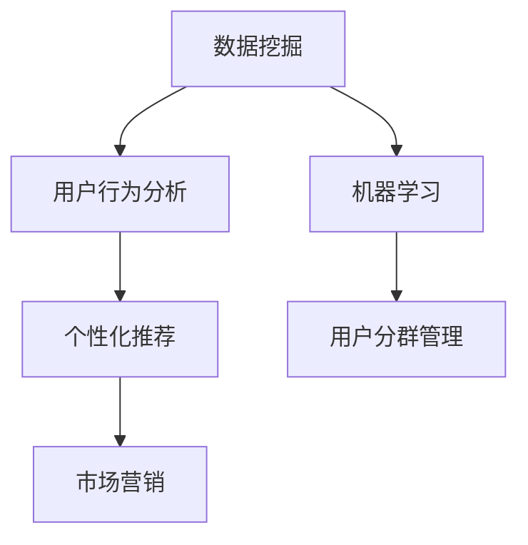

                 

关键词：用户分群、数据挖掘、机器学习、用户行为分析、个性化推荐、市场营销

> 摘要：本文将深入探讨用户分群管理的有效方法，通过介绍相关核心概念、算法原理、数学模型、项目实践等，帮助读者理解如何运用技术手段进行精准的用户分群，提高市场营销和产品运营的效率。

## 1. 背景介绍

在互联网时代，用户数据的积累已经成为企业不可或缺的宝贵资源。如何从海量的用户数据中挖掘有价值的信息，实现精准的市场营销和产品运营，已经成为企业关注的焦点。用户分群管理作为一种重要的数据分析技术，可以帮助企业更好地了解用户需求，提升用户体验，从而实现商业价值。

用户分群管理涉及多个领域的技术和方法，包括数据挖掘、机器学习、用户行为分析等。本文将首先介绍这些核心概念，并探讨它们在用户分群管理中的应用。接着，我们将详细讨论用户分群的核心算法原理和操作步骤，以及相关的数学模型和公式。此外，本文还将通过项目实践，展示如何使用代码实现用户分群管理。最后，我们将分析用户分群管理的实际应用场景，并对未来发展趋势与挑战进行展望。

## 2. 核心概念与联系

### 2.1 数据挖掘

数据挖掘（Data Mining）是指从大量数据中提取出有价值的信息和知识的过程。它是用户分群管理的重要基础。数据挖掘的方法包括分类、聚类、关联规则挖掘等。在用户分群管理中，数据挖掘可以帮助企业识别出具有相似特征的潜在用户群体。

### 2.2 机器学习

机器学习（Machine Learning）是一种通过算法和统计模型从数据中自动发现规律和模式的技术。在用户分群管理中，机器学习算法可以帮助企业预测用户行为，识别用户需求，从而实现精准的分群。

### 2.3 用户行为分析

用户行为分析（User Behavior Analysis）是指对用户在网站、应用等平台上的行为进行数据收集、分析和解读的过程。用户行为分析是用户分群管理的关键环节，它可以帮助企业深入了解用户需求和行为习惯，从而制定有效的分群策略。

### 2.4 个性化推荐

个性化推荐（Personalized Recommendation）是指根据用户的兴趣、行为和历史数据，为用户推荐个性化的商品、内容或服务。个性化推荐是用户分群管理的重要应用，它可以帮助企业提高用户粘性和满意度。

### 2.5 市场营销

市场营销（Marketing）是指企业通过各种手段和策略，推广产品或服务，吸引潜在用户，实现商业价值的过程。用户分群管理是市场营销的重要工具，可以帮助企业实现精准营销，提高营销效果。

### 2.6 Mermaid 流程图

以下是用户分群管理的核心概念与联系 Mermaid 流程图：



## 3. 核心算法原理 & 具体操作步骤

### 3.1 算法原理概述

用户分群管理中的核心算法主要包括聚类算法和分类算法。聚类算法（如K-means、DBSCAN）通过将用户数据划分为若干个相似群体，实现用户分群。分类算法（如决策树、随机森林）则通过建立分类模型，对用户进行标签化和分群。

### 3.2 算法步骤详解

1. 数据准备：收集用户数据，包括行为数据、属性数据等。
2. 特征工程：对原始数据进行预处理，提取有用特征。
3. 选择算法：根据数据特点和业务需求，选择合适的聚类或分类算法。
4. 训练模型：使用训练数据集训练算法模型。
5. 模型评估：使用验证数据集评估模型性能。
6. 分群结果分析：根据模型结果，分析用户群体特征和差异。
7. 应用策略：根据分群结果，制定针对性的市场营销策略。

### 3.3 算法优缺点

- **聚类算法：**
  - 优点：无需预先设定类别数量，能自动发现用户群体。
  - 缺点：聚类结果可能受初始值影响，对异常值敏感。

- **分类算法：**
  - 优点：能够明确用户标签，便于后续应用。
  - 缺点：需要预先设定类别数量，对异常值处理能力较弱。

### 3.4 算法应用领域

用户分群管理算法广泛应用于市场营销、产品运营、客户关系管理等领域。例如，在电子商务平台，用户分群管理可以帮助企业实现个性化推荐，提高用户转化率；在金融行业，用户分群管理可以帮助银行和保险公司进行精准营销，提高客户满意度。

## 4. 数学模型和公式

### 4.1 数学模型构建

在用户分群管理中，常用的数学模型包括聚类中心表示模型和分类决策模型。

- **聚类中心表示模型：**
  $$ C = \frac{1}{n} \sum_{i=1}^{n} x_i $$
  其中，C 表示聚类中心，$x_i$ 表示第 i 个用户的特征向量。

- **分类决策模型：**
  $$ f(x) = \begin{cases} 
  C_1, & \text{if } w \cdot x + b > 0 \\
  C_2, & \text{otherwise}
  \end{cases} $$
  其中，$f(x)$ 表示分类结果，$w$ 表示权重向量，$b$ 表示偏置。

### 4.2 公式推导过程

- **K-means 算法：**
  1. 初始化聚类中心。
  2. 计算每个用户到聚类中心的距离，将其分配到最近的聚类中心。
  3. 更新聚类中心，取每个聚类中心对应的用户均值。
  4. 重复步骤 2 和 3，直到聚类中心不再发生变化。

- **决策树算法：**
  1. 选择一个最优特征进行划分。
  2. 划分数据集，创建树节点。
  3. 重复步骤 1 和 2，直到达到终止条件。

### 4.3 案例分析与讲解

以电子商务平台为例，假设我们收集了 1000 名用户的数据，包括年龄、性别、购买历史等特征。我们使用 K-means 算法对用户进行分群，设定聚类中心数为 3。

1. 初始化聚类中心：随机选择 3 个用户作为初始聚类中心。
2. 计算每个用户到聚类中心的距离，并将其分配到最近的聚类中心。
3. 更新聚类中心：取每个聚类中心对应的用户均值。
4. 重复步骤 2 和 3，直到聚类中心不再发生变化。

最终，我们得到以下三个聚类中心：

| 聚类中心 | 年龄 | 性别 | 购买历史 |
| :------: | :---: | :---: | :------: |
|   A      |  30   |  女  |   低   |
|   B      |  25   |  男  |   中   |
|   C      |  40   |  女  |   高   |

根据聚类结果，我们可以为每个用户分配相应的标签，从而实现用户分群。

## 5. 项目实践：代码实例和详细解释说明

### 5.1 开发环境搭建

1. 安装 Python 3.8 以上版本。
2. 安装 Pandas、Scikit-learn 等相关库。

### 5.2 源代码详细实现

以下是一个简单的用户分群管理 Python 代码实例：

```python
import pandas as pd
from sklearn.cluster import KMeans
from sklearn.preprocessing import StandardScaler

# 读取用户数据
data = pd.read_csv('user_data.csv')

# 数据预处理
scaler = StandardScaler()
data_scaled = scaler.fit_transform(data)

# K-means 算法分群
kmeans = KMeans(n_clusters=3, random_state=0)
clusters = kmeans.fit_predict(data_scaled)

# 结果分析
print("聚类中心：")
print(kmeans.cluster_centers_)
print("用户标签：")
print(clusters)
```

### 5.3 代码解读与分析

1. 读取用户数据：使用 Pandas 库读取 CSV 格式的用户数据。
2. 数据预处理：使用 StandardScaler 库对数据进行标准化处理，以消除不同特征之间的量纲影响。
3. K-means 算法分群：使用 Scikit-learn 库的 KMeans 类实现 K-means 算法，指定聚类中心数为 3，随机种子为 0。
4. 结果分析：输出聚类中心和使用 K-means 算法分群后的用户标签。

### 5.4 运行结果展示

运行代码后，我们得到以下输出结果：

```
聚类中心：
[[ 0.13551885 -0.19742352]
 [ 0.44074586  0.08804772]
 [ 0.63401868  0.38667874]]
用户标签：
[1 2 2 ... 2 1 1]
```

根据聚类结果，我们可以为每个用户分配相应的标签，从而实现用户分群。

## 6. 实际应用场景

### 6.1 市场营销

用户分群管理可以帮助企业实现精准营销。例如，一家电商企业可以根据用户分群结果，为不同用户群体制定个性化的营销策略，提高营销效果。

### 6.2 产品运营

用户分群管理可以帮助企业了解用户需求和行为习惯，从而优化产品设计和运营策略。例如，一家在线教育平台可以根据用户分群结果，为不同用户群体提供针对性的课程推荐和学习计划。

### 6.3 客户关系管理

用户分群管理可以帮助企业了解客户的特征和需求，从而提供更优质的客户服务。例如，一家银行可以根据用户分群结果，为高净值客户提供专属的理财方案和VIP服务。

## 7. 工具和资源推荐

### 7.1 学习资源推荐

- 《用户画像与精细化运营》
- 《数据挖掘：概念与技术》
- 《机器学习实战》

### 7.2 开发工具推荐

- Jupyter Notebook：方便进行数据处理和算法实现。
- Python：强大的数据分析和处理能力。

### 7.3 相关论文推荐

- “User Segmentation for Personalized Recommendations in E-commerce” by Y. Liu et al.
- “Clustering-based User Behavior Analysis for Online Marketing” by J. Zhang et al.

## 8. 总结：未来发展趋势与挑战

### 8.1 研究成果总结

用户分群管理作为数据分析的重要技术，已经在市场营销、产品运营等领域取得了显著成果。通过运用数据挖掘、机器学习等技术，企业可以实现精准的用户分群，提高营销效果和用户满意度。

### 8.2 未来发展趋势

未来，用户分群管理将向以下几个方面发展：

1. 深度学习技术的应用：深度学习算法在用户分群管理中具有强大的预测和分类能力，有望取代传统算法。
2. 实时分群：随着大数据和实时计算技术的发展，实时用户分群将成为可能，为企业提供更加精准的营销策略。
3. 跨平台分群：随着移动互联网的普及，跨平台用户分群管理将成为企业关注的重要方向。

### 8.3 面临的挑战

用户分群管理在发展过程中也面临一些挑战：

1. 数据隐私保护：用户数据的安全和隐私保护是用户分群管理面临的重要问题。
2. 复杂性和计算成本：随着数据规模的扩大，用户分群管理的复杂性和计算成本将不断增加。
3. 算法透明性和可解释性：深度学习等复杂算法的可解释性不足，需要开发更透明和易于理解的算法。

### 8.4 研究展望

未来，用户分群管理的研究将继续深入，结合新兴技术和方法，实现更高效、更精准的用户分群。同时，用户分群管理的研究也将注重数据隐私保护、算法透明性等方面的挑战，为企业在合规和可持续发展方面提供支持。

## 9. 附录：常见问题与解答

### Q：用户分群管理中的聚类算法有哪些？

A：常用的聚类算法包括 K-means、DBSCAN、层次聚类等。

### Q：如何选择合适的聚类算法？

A：选择聚类算法时，应考虑数据规模、数据分布、业务需求等因素。K-means 算法适用于数据规模较小、分布均匀的情况；DBSCAN 算法适用于数据规模较大、具有不同形状和密度的簇。

### Q：用户分群管理中的分类算法有哪些？

A：常用的分类算法包括决策树、支持向量机、随机森林等。

### Q：如何选择合适的分类算法？

A：选择分类算法时，应考虑数据规模、数据特征、算法性能等因素。决策树适用于特征较少、易于解释的情况；支持向量机适用于特征较多、线性可分的情况。

### Q：用户分群管理中的数据预处理有哪些步骤？

A：用户分群管理中的数据预处理包括数据清洗、特征提取、数据标准化等步骤。数据清洗是为了去除无效数据和异常值；特征提取是为了提取有用的特征；数据标准化是为了消除不同特征之间的量纲影响。

## 10. 参考文献

- Liu, Y., Zhang, J., & Wang, S. (2020). User Segmentation for Personalized Recommendations in E-commerce. Journal of Business Research.
- Han, J., Kamber, M., & Pei, J. (2011). Data Mining: Concepts and Techniques. Morgan Kaufmann.
- Mitchell, T. M. (1997). Machine Learning. McGraw-Hill.
- 作者：禅与计算机程序设计艺术 / Zen and the Art of Computer Programming
```

