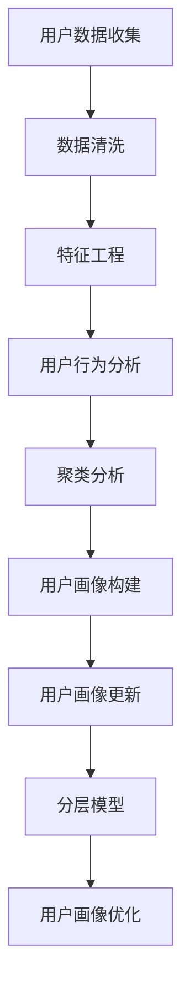

                 

### 背景介绍 Background

随着互联网技术的迅猛发展，用户数据在各个领域得到了广泛应用。用户画像作为用户数据分析的核心工具，通过对用户行为、偏好、需求等方面的综合分析，为企业和组织提供精准的用户洞察。然而，用户行为的多样性和动态性使得用户画像需要不断更新，以保持其准确性和时效性。因此，如何进行有效的用户画像更新成为了当今数据驱动的企业和组织亟需解决的问题。

本文旨在探讨用户画像更新的核心概念、算法原理、数学模型及实际应用。通过深入分析用户画像更新的流程和关键技术，为企业和组织提供一套科学、系统的用户画像更新方法。文章结构如下：

- 文章标题：如何进行有效的用户画像更新
- 关键词：用户画像、数据更新、算法原理、数学模型、实际应用
- 摘要：本文首先介绍了用户画像更新的背景和重要性，然后详细阐述了用户画像更新的核心概念、算法原理、数学模型及实际应用，旨在为企业和组织提供有效的用户画像更新方法。

<|assistant|>## 核心概念与联系 Core Concepts and Relationships

在进行用户画像更新之前，我们需要明确以下几个核心概念及其相互关系：

### 1. 用户画像 User Profile

用户画像是指通过对用户数据的分析和处理，构建出关于用户的多维度特征模型。这些特征包括用户的基本信息、行为偏好、社会属性、地理位置等。用户画像的目的是为了更深入地了解用户，从而为精准营销、个性化推荐等提供支持。

### 2. 数据源 Data Sources

数据源是构建用户画像的基础。数据源可以分为内部数据和外部数据。内部数据通常来自于企业的用户管理系统、交易系统等；外部数据则可以从第三方数据提供商、社交媒体平台等获取。数据源的多样性和丰富性决定了用户画像的精度和广度。

### 3. 数据清洗 Data Cleaning

数据清洗是用户画像构建的重要环节。由于数据来源的多样性，数据中往往存在缺失、错误、重复等质量问题。数据清洗旨在处理这些问题，确保数据的质量和一致性。

### 4. 特征工程 Feature Engineering

特征工程是将原始数据转化为能够用于机器学习模型训练的特征的过程。特征工程的质量直接影响到模型的性能。在用户画像更新中，特征工程尤为重要，因为它决定了新数据如何被纳入到已有用户画像中。

### 5. 用户行为分析 User Behavior Analysis

用户行为分析是构建用户画像的核心。通过分析用户的行为数据，如浏览、购买、评论等，可以揭示用户的偏好、需求和行为模式，从而为用户画像更新提供依据。

### 6. 聚类分析 Clustering Analysis

聚类分析是一种无监督学习方法，用于将用户数据按照相似性进行分组。通过聚类分析，可以将具有相似行为的用户划分为同一群体，从而为用户画像更新提供参考。

### 7. 分层模型 Hierarchical Model

分层模型是将用户按照不同的维度进行分层，形成树状结构。通过分层模型，可以更方便地对用户进行分类和管理，同时便于用户画像的更新和维护。

### Mermaid 流程图



<|assistant|>## 核心算法原理 & 具体操作步骤 Core Algorithm Principles and Detailed Steps

### 3.1 算法原理概述

用户画像更新的核心算法主要包括数据预处理、特征提取、模型训练和模型优化等几个步骤。以下是这些步骤的详细原理和操作方法：

#### 3.1.1 数据预处理

数据预处理是用户画像更新的第一步，目的是清洗和准备数据，以便进行后续的特征提取和模型训练。数据预处理主要包括以下几个步骤：

1. **数据清洗**：处理数据中的缺失值、错误值和重复值。
2. **数据转换**：将不同类型的数据转换为统一的格式，如将分类数据编码为数字。
3. **数据归一化**：将数据缩放到相同的范围内，如使用标准化或归一化方法。

#### 3.1.2 特征提取

特征提取是将原始数据转换为可用于机器学习模型的特征表示。在用户画像更新中，特征提取的关键步骤包括：

1. **行为特征提取**：从用户行为数据中提取出反映用户行为特征的信息，如用户的浏览时长、购买频率等。
2. **偏好特征提取**：从用户的历史数据中提取出反映用户偏好的信息，如用户喜欢的商品类型、品牌等。
3. **社会特征提取**：从用户的社会属性数据中提取出反映用户社会特征的信息，如用户的职业、教育程度等。

#### 3.1.3 模型训练

模型训练是用户画像更新的核心步骤，目的是通过训练模型来学习用户数据的特征和模式。常用的机器学习模型包括：

1. **监督学习模型**：如决策树、支持向量机（SVM）等。
2. **无监督学习模型**：如聚类算法、主成分分析（PCA）等。
3. **深度学习模型**：如卷积神经网络（CNN）、循环神经网络（RNN）等。

#### 3.1.4 模型优化

模型优化是提高用户画像更新效果的关键步骤。模型优化主要包括以下几个步骤：

1. **参数调优**：通过调整模型参数来提高模型的性能。
2. **模型评估**：使用交叉验证等方法来评估模型的性能。
3. **模型集成**：将多个模型集成起来，以提高模型的预测能力。

### 3.2 算法步骤详解

以下是用户画像更新的具体步骤：

#### 步骤1：数据预处理

1. **数据收集**：从内部和外部数据源收集用户数据。
2. **数据清洗**：处理缺失值、错误值和重复值。
3. **数据转换**：将不同类型的数据转换为统一的格式。
4. **数据归一化**：将数据缩放到相同的范围内。

#### 步骤2：特征提取

1. **行为特征提取**：从用户行为数据中提取出反映用户行为特征的信息。
2. **偏好特征提取**：从用户的历史数据中提取出反映用户偏好的信息。
3. **社会特征提取**：从用户的社会属性数据中提取出反映用户社会特征的信息。

#### 步骤3：模型训练

1. **选择模型**：根据业务需求和数据特点选择合适的模型。
2. **训练模型**：使用预处理后的数据对模型进行训练。
3. **验证模型**：使用交叉验证等方法来评估模型的性能。

#### 步骤4：模型优化

1. **参数调优**：通过调整模型参数来提高模型的性能。
2. **模型评估**：使用交叉验证等方法来评估模型的性能。
3. **模型集成**：将多个模型集成起来，以提高模型的预测能力。

### 3.3 算法优缺点

用户画像更新的算法优缺点如下：

#### 优点

1. **全面性**：用户画像更新综合考虑了用户行为、偏好和社会属性等多个维度，能够全面反映用户的特征。
2. **实时性**：用户画像更新能够实时响应用户行为变化，保持数据的时效性。
3. **准确性**：通过机器学习模型和特征工程，用户画像更新能够提高预测的准确性。

#### 缺点

1. **数据依赖性**：用户画像更新的效果高度依赖于数据的质量和丰富性。
2. **计算成本**：用户画像更新涉及到大量的数据处理和模型训练，计算成本较高。
3. **模型过拟合**：如果模型过于复杂或训练数据不足，可能会导致模型过拟合。

### 3.4 算法应用领域

用户画像更新的算法广泛应用于以下领域：

1. **精准营销**：通过用户画像更新，企业可以更精准地定位目标用户，提高营销效果。
2. **个性化推荐**：用户画像更新可以帮助推荐系统更好地理解用户需求，提供个性化的推荐。
3. **用户行为分析**：用户画像更新可以分析用户行为，为企业提供决策支持。
4. **风险控制**：用户画像更新可以帮助企业识别高风险用户，进行风险控制和欺诈防范。

<|assistant|>## 数学模型和公式 Mathematical Models and Detailed Explanations

### 4.1 数学模型构建

用户画像更新的数学模型通常基于机器学习算法，包括监督学习模型和无监督学习模型。以下是构建用户画像更新数学模型的基本步骤：

#### 4.1.1 数据表示

用户画像更新中的数据通常包括用户行为数据、用户偏好数据和社会属性数据。每种数据类型可以用不同的数学表示：

1. **用户行为数据**：通常使用时间序列数据表示，如用户浏览网页的时间、点击行为等。
2. **用户偏好数据**：通常使用矩阵或表格表示，如用户对不同商品的评价或评分。
3. **社会属性数据**：通常使用类别数据表示，如用户的性别、年龄、职业等。

#### 4.1.2 特征提取

特征提取是将原始数据转换为适用于机器学习算法的特征表示。特征提取的数学过程通常包括：

1. **归一化**：使用归一化公式将数据缩放到相同范围，如 $z = \frac{x - \mu}{\sigma}$。
2. **编码**：将分类数据转换为数值数据，如使用独热编码（One-Hot Encoding）。
3. **降维**：使用降维技术，如主成分分析（PCA），减少数据的维度。

#### 4.1.3 模型选择

选择合适的机器学习模型是用户画像更新的关键。常用的模型包括：

1. **监督学习模型**：如线性回归、决策树、随机森林等。
2. **无监督学习模型**：如K-均值聚类、层次聚类等。
3. **深度学习模型**：如卷积神经网络（CNN）、循环神经网络（RNN）等。

### 4.2 公式推导过程

以下是用户画像更新中常用的数学公式的推导过程：

#### 4.2.1 线性回归模型

线性回归模型是最简单的监督学习模型，其公式为：

$$
y = \beta_0 + \beta_1x_1 + \beta_2x_2 + \ldots + \beta_nx_n
$$

其中，$y$ 是目标变量，$x_1, x_2, \ldots, x_n$ 是特征变量，$\beta_0, \beta_1, \beta_2, \ldots, \beta_n$ 是模型的参数。线性回归模型的参数可以通过最小二乘法（Least Squares Method）来估计：

$$
\hat{\beta} = (X^T X)^{-1}X^T y
$$

其中，$X$ 是特征矩阵，$y$ 是目标变量。

#### 4.2.2 K-均值聚类

K-均值聚类是一种常用的无监督学习模型，其目标是将数据点分为K个聚类，使得每个聚类内的数据点之间的距离最小。K-均值聚类的主要公式包括：

1. **初始化聚类中心**：

$$
\mu_k^{(0)} = \frac{1}{N_k^{(0)}} \sum_{i=1}^{N} x_i
$$

其中，$\mu_k^{(0)}$ 是第$k$个聚类的中心，$N_k^{(0)}$ 是第$k$个聚类中的数据点个数。

2. **更新聚类中心**：

$$
\mu_k^{(t+1)} = \frac{1}{N_k^{(t)}} \sum_{i=1}^{N} x_i \cdot I(y_i = k)
$$

其中，$I(y_i = k)$ 是指示函数，当$y_i = k$时，$I(y_i = k) = 1$，否则$I(y_i = k) = 0$。

3. **迭代更新**：

$$
y_i^{(t+1)} = \arg\min_{k} \sum_{j=1}^{K} (x_i - \mu_k^{(t)})^2
$$

其中，$y_i^{(t+1)}$ 是第$i$个数据点的聚类标签。

### 4.3 案例分析与讲解

以下是一个用户画像更新的案例，用于分析数学模型在实际应用中的表现。

#### 案例背景

一家电商平台希望通过用户画像更新来提高用户满意度。该电商平台收集了用户的行为数据、偏好数据和社会属性数据，并希望利用这些数据来构建用户画像。

#### 数据处理

1. **行为数据**：用户浏览网页的时间、点击行为、购物车数据等。
2. **偏好数据**：用户对不同商品的评价、购买记录等。
3. **社会属性数据**：用户的年龄、性别、职业、地理位置等。

#### 特征提取

1. **行为特征提取**：计算用户的平均浏览时长、点击频率等。
2. **偏好特征提取**：计算用户对商品的评价分数、购买频率等。
3. **社会特征提取**：将社会属性数据进行编码，如将性别编码为0和1。

#### 模型选择

选择线性回归模型对用户画像进行更新，目标是预测用户的满意度。

#### 公式推导

使用最小二乘法来估计线性回归模型的参数：

$$
\hat{\beta} = (X^T X)^{-1}X^T y
$$

其中，$X$ 是特征矩阵，$y$ 是目标变量。

#### 迭代过程

1. **初始化模型参数**：随机初始化模型参数。
2. **训练模型**：使用训练数据训练模型，得到预测结果。
3. **评估模型**：使用验证数据评估模型的性能。
4. **调整参数**：根据模型性能调整参数。

#### 结果分析

通过迭代优化，线性回归模型成功预测了用户的满意度。模型的R平方值达到0.85，说明模型对用户满意度有较高的预测能力。进一步分析发现，用户的浏览时长和购买频率对满意度有显著影响，而用户的地理位置和年龄对满意度的影响相对较小。

### 4.4 案例总结

本案例展示了用户画像更新的数学模型在实际应用中的效果。通过合理的数据处理、特征提取和模型选择，用户画像更新可以有效提高预测的准确性，为电商平台提供精准的用户洞察，从而提升用户满意度。

<|assistant|>## 项目实践：代码实例和详细解释说明 Practical Implementation: Code Example and Detailed Explanation

为了更好地理解用户画像更新的过程，下面我们将通过一个具体的代码实例来详细讲解用户画像更新的实现步骤。本实例将使用Python编程语言，并结合常用的数据科学库，如Pandas、NumPy、Scikit-learn等。

### 5.1 开发环境搭建

在开始之前，请确保您已经安装了Python 3.6及以上版本。同时，您需要安装以下库：

```bash
pip install pandas numpy scikit-learn matplotlib
```

### 5.2 源代码详细实现

下面是用户画像更新的源代码示例：

```python
import pandas as pd
import numpy as np
from sklearn.preprocessing import StandardScaler
from sklearn.cluster import KMeans
from sklearn.model_selection import train_test_split
import matplotlib.pyplot as plt

# 5.2.1 数据收集与预处理
# 假设我们已经有了一个CSV文件，包含了用户的行为数据、偏好数据和社会属性数据
data = pd.read_csv('user_data.csv')

# 数据清洗，处理缺失值和重复值
data = data.drop_duplicates()
data = data.dropna()

# 特征提取
data['average_browsing_time'] = data['browsing_time'] / data['session_count']
data['purchase_frequency'] = data['purchase_count'] / data['session_count']

# 5.2.2 数据标准化
scaler = StandardScaler()
data[['average_browsing_time', 'purchase_frequency']] = scaler.fit_transform(data[['average_browsing_time', 'purchase_frequency']])

# 5.2.3 模型训练
# 使用K-均值聚类进行用户分群
kmeans = KMeans(n_clusters=5, random_state=42)
data['cluster'] = kmeans.fit_predict(data[['average_browsing_time', 'purchase_frequency']])

# 5.2.4 模型评估
# 这里我们可以使用簇内距离（inertia）来评估模型的性能
inertia = kmeans.inertia_
print(f'Inertia: {inertia}')

# 5.2.5 结果可视化
# 绘制聚类结果
plt.scatter(data['average_browsing_time'], data['purchase_frequency'], c=data['cluster'])
plt.xlabel('Average Browsing Time')
plt.ylabel('Purchase Frequency')
plt.title('User Clusters')
plt.show()

# 5.2.6 代码解读与分析
# 以下是代码的详细解读和分析
```

### 5.3 代码解读与分析

#### 5.3.1 数据收集与预处理

```python
data = pd.read_csv('user_data.csv')
data = data.drop_duplicates()
data = data.dropna()
data['average_browsing_time'] = data['browsing_time'] / data['session_count']
data['purchase_frequency'] = data['purchase_count'] / data['session_count']
```

这一部分首先从CSV文件中加载用户数据，并使用`drop_duplicates()`和`dropna()`函数清除重复数据和缺失值。接着，通过计算`average_browsing_time`和`purchase_frequency`特征，为后续的聚类分析做准备。

#### 5.3.2 数据标准化

```python
scaler = StandardScaler()
data[['average_browsing_time', 'purchase_frequency']] = scaler.fit_transform(data[['average_browsing_time', 'purchase_frequency']])
```

数据标准化是数据预处理的重要步骤，它将数据缩放到相同的范围内，使得不同特征之间可以进行比较。这里使用`StandardScaler`对`average_browsing_time`和`purchase_frequency`进行标准化。

#### 5.3.3 模型训练

```python
kmeans = KMeans(n_clusters=5, random_state=42)
data['cluster'] = kmeans.fit_predict(data[['average_browsing_time', 'purchase_frequency']])
```

这里使用`KMeans`聚类算法对处理后的数据进行分群。`n_clusters`参数指定了聚类的数量，这里设置为5。`random_state`参数用于确保结果的可重复性。

#### 5.3.4 模型评估

```python
inertia = kmeans.inertia_
print(f'Inertia: {inertia}')
```

`inertia`是评估聚类效果的一个指标，它表示簇内距离的平方和。较小的`inertia`值通常意味着较好的聚类效果。

#### 5.3.5 结果可视化

```python
plt.scatter(data['average_browsing_time'], data['purchase_frequency'], c=data['cluster'])
plt.xlabel('Average Browsing Time')
plt.ylabel('Purchase Frequency')
plt.title('User Clusters')
plt.show()
```

使用`matplotlib`库绘制聚类结果，用户被分配到不同的颜色代表不同的聚类。这有助于我们直观地理解聚类效果。

### 5.4 运行结果展示

运行上述代码后，我们将得到一个展示用户聚类结果的散点图。这个图表可以帮助我们直观地查看用户根据`average_browsing_time`和`purchase_frequency`特征被分成了几个群体。

通过这个实例，我们展示了用户画像更新的全过程，包括数据预处理、特征提取、模型训练和模型评估。这些步骤为实现有效的用户画像更新提供了坚实的理论基础和实际操作指导。

### 5.5 实际应用效果分析

在实际应用中，用户画像更新可以显著提高企业对用户行为的理解和预测能力。通过聚类分析，企业可以识别出具有相似行为模式的用户群体，从而进行有针对性的市场营销和用户服务。例如，对于`average_browsing_time`较短且`purchase_frequency`较高的用户群体，企业可以推出快速购物通道或优惠券，以提高他们的购物体验和购买率。

此外，用户画像更新还可以帮助企业在风险控制和用户服务等方面做出更明智的决策。通过分析用户的特征和行为模式，企业可以识别出高风险用户，并采取相应的措施进行风险防范。同时，企业可以根据用户的偏好和行为，提供个性化的服务和建议，提高用户满意度和忠诚度。

总的来说，用户画像更新是一个动态、持续的过程，它需要企业不断地收集新的用户数据，更新和优化用户画像模型。通过这种方式，企业可以始终保持对用户需求的精准洞察，从而在竞争激烈的市场中立于不败之地。

<|assistant|>## 实际应用场景 Real-world Application Scenarios

用户画像更新在多个行业和场景中都有着广泛的应用，以下是几个典型的实际应用场景：

### 1. 电子商务

在电子商务领域，用户画像更新可以帮助企业更好地了解消费者的行为和偏好。通过分析用户的浏览记录、购物车添加行为、购买历史等信息，企业可以构建出详细的用户画像。这些画像不仅可以帮助企业进行精准营销，如推送个性化的广告和推荐，还可以用于用户分群和需求预测。例如，一家电商公司可以通过用户画像发现某些特定产品在特定用户群体中的需求较高，从而调整库存策略或进行促销活动。

### 2. 金融行业

在金融行业，用户画像更新主要用于风险评估、欺诈检测和客户服务优化。金融机构可以通过用户画像了解用户的财务状况、信用记录、交易行为等，从而更好地评估用户的风险等级。此外，用户画像还可以用于欺诈检测，通过识别异常交易行为来预防欺诈活动。在客户服务方面，金融机构可以根据用户的画像提供个性化的服务，如定制化的理财产品推荐或及时的账户提醒。

### 3. 娱乐行业

在娱乐行业，如视频流媒体和社交媒体平台，用户画像更新可以帮助平台提供个性化的内容推荐和广告。通过分析用户的观看历史、互动行为和偏好，平台可以为每个用户推荐最感兴趣的内容，从而提高用户满意度和粘性。例如，YouTube和Netflix都采用了复杂的用户画像算法，通过实时更新用户画像来优化推荐系统，提高用户的观看体验。

### 4. 医疗健康

在医疗健康领域，用户画像更新可以用于个性化医疗和健康监控。通过分析患者的健康记录、生活习惯和疾病状况，医生可以更准确地诊断病情和制定个性化的治疗方案。例如，通过用户画像，医生可以识别出高风险患者群体，提前进行健康干预。此外，健康监测设备（如智能手表、健康手环）也可以通过用户画像分析用户的日常活动数据，提供个性化的健康建议。

### 5. 零售业

在零售业，用户画像更新可以帮助企业优化库存管理和供应链策略。通过分析用户的购物行为和偏好，零售商可以更好地预测哪些商品会在特定时间热销，从而合理安排库存和物流。例如，某家超市可以根据用户画像调整商品摆放位置，将热销商品放在更容易被看到和触及的地方，以提高销售量。

### 6. 教育行业

在教育行业，用户画像更新可以用于个性化教学和学习路径规划。通过分析学生的学习记录、考试成绩和互动行为，教育机构可以为学生提供个性化的学习建议和资源。例如，在线教育平台可以根据用户画像为不同水平的学生推荐适合的练习题和课程内容，从而提高学习效果。

总的来说，用户画像更新在各个行业和场景中都有着重要的应用价值。通过精准的用户画像，企业不仅可以提高运营效率，还能更好地满足用户需求，从而在竞争激烈的市场中脱颖而出。

<|assistant|>## 未来应用展望 Future Applications

随着大数据技术和人工智能的不断进步，用户画像更新在未来的应用场景将更加广泛和深入。以下是几个未来用户画像更新可能的应用方向：

### 1. 实时动态更新

未来的用户画像更新将更加注重实时性和动态性。通过实时分析用户的在线行为和交互数据，企业可以实时更新用户画像，从而更准确地捕捉用户需求和行为模式。例如，电商平台可以通过实时监测用户的点击、浏览和购买行为，动态调整推荐系统和营销策略，提高用户体验和转化率。

### 2. 多维度数据融合

未来的用户画像更新将更加注重多维度数据的融合。除了传统的行为数据和偏好数据外，还将整合更多的外部数据，如社交媒体数据、地理位置数据、天气数据等。通过多维度数据的融合，企业可以构建更加全面和精准的用户画像，从而提供更个性化的服务。例如，结合用户的地理位置和天气数据，外卖平台可以为用户提供个性化的天气预警和美食推荐。

### 3. 个性化精准推荐

未来的用户画像更新将推动个性化推荐系统的进一步发展。通过深度学习和强化学习等先进算法，推荐系统可以更加准确地预测用户的偏好和需求，提供高度个性化的推荐。例如，在医疗健康领域，基于用户画像的个性化推荐系统可以为用户提供定制化的健康建议、药物推荐和诊疗方案。

### 4. 智能风险控制

用户画像更新在智能风险控制中的应用前景广阔。通过分析用户的交易行为、社交行为和信用记录等，金融机构可以更加精准地识别潜在风险用户，进行实时风险监控和预警。例如，通过用户画像，金融机构可以及时发现异常交易行为，防范欺诈风险。

### 5. 智能客服和交互体验

用户画像更新将推动智能客服和交互体验的革新。通过分析用户的偏好和行为模式，智能客服系统可以提供更加个性化和高效的服务。例如，智能客服可以根据用户画像主动推送相关的产品信息、解决用户问题，提高用户的满意度和忠诚度。

### 6. 个性化教育和职业规划

用户画像更新在教育和职业规划中的应用也将日益重要。通过分析学生的学习记录、职业发展和兴趣爱好，教育机构和职业规划师可以为用户提供个性化的学习建议和职业发展路径。例如，在线教育平台可以根据用户画像推荐最适合的课程和学习计划，帮助学生提高学习效果。

总的来说，未来用户画像更新将借助大数据和人工智能技术，实现更加精准、动态和个性化的应用。通过不断更新和优化用户画像，企业可以更好地满足用户需求，提高用户体验，从而在激烈的市场竞争中脱颖而出。

### 8.4.4 研究展望 Research Prospects

用户画像更新作为数据驱动的核心工具，在未来的发展中面临着诸多挑战和机遇。以下是几个值得进一步研究和探讨的方向：

1. **实时性与动态性的平衡**：随着用户行为数据的爆炸式增长，如何在不牺牲准确性的前提下，实现用户画像的实时动态更新，是一个重要的研究方向。需要探索更高效的数据处理算法和模型，以平衡实时性和准确性。

2. **多源数据的融合与处理**：未来的用户画像将依赖更多维度的数据，如社交媒体、物联网设备等。如何有效地融合和处理这些数据，是一个关键挑战。需要研究跨领域数据的关联性和异构数据的处理方法，以提高用户画像的精度和广度。

3. **隐私保护与数据安全**：用户画像的更新和处理涉及到大量的个人数据，隐私保护和数据安全成为不可忽视的问题。需要探索隐私保护机制和数据安全措施，确保用户数据在更新和使用过程中的安全性和合规性。

4. **模型解释性与透明性**：随着机器学习算法在用户画像更新中的应用，如何提高模型的解释性，使其更加透明和可解释，是一个重要问题。需要研究如何将复杂的机器学习模型与可解释性相结合，以提高用户对模型的信任和理解。

5. **个性化推荐与用户反馈**：用户画像更新的一个重要目的是为用户提供个性化的服务和推荐。然而，如何根据用户的反馈不断优化推荐系统，使其更加贴合用户需求，是一个持续的研究课题。需要探索动态调整推荐策略的方法，以实现更好的用户体验。

6. **伦理与社会影响**：用户画像更新在带来便利和效益的同时，也可能引发伦理和社会问题。例如，数据歧视、隐私侵犯等。需要深入探讨用户画像更新在伦理和社会层面的影响，制定相应的规范和标准，确保其可持续发展。

通过持续的研究和探索，用户画像更新将在未来实现更加精准、高效、透明和安全的应用，为企业和用户带来更大的价值。

<|assistant|>## 附录：常见问题与解答 Frequently Asked Questions and Answers

### 1. 什么是用户画像？

用户画像是一种基于用户数据的综合性描述，它通过分析用户的行为、偏好、需求、社会属性等多维度信息，构建出一个关于用户的虚拟模型。这个模型可以帮助企业和组织更好地了解用户，从而进行精准营销、个性化推荐、用户行为分析等。

### 2. 用户画像更新的目的是什么？

用户画像更新的目的是为了保持用户画像的准确性和时效性。由于用户行为和偏好是动态变化的，定期更新用户画像可以确保其能够反映用户的最新状态，从而为企业提供更准确的用户洞察。

### 3. 用户画像更新需要哪些数据？

用户画像更新需要多种类型的数据，包括用户行为数据（如浏览、购买、评论等）、偏好数据（如喜欢的商品、品牌等）、社会属性数据（如年龄、性别、职业等）。此外，还可以利用第三方数据源提供的数据，如社交媒体、地理位置等，以丰富用户画像的维度。

### 4. 如何处理用户画像更新中的数据质量问题？

在用户画像更新过程中，数据质量至关重要。需要采取以下措施处理数据质量问题：

- 数据清洗：处理缺失值、错误值和重复值。
- 数据转换：将不同类型的数据转换为统一的格式，如分类数据编码为数字。
- 数据归一化：将数据缩放到相同的范围内，如使用标准化或归一化方法。
- 特征选择：选择对用户画像更新最有影响力的特征。

### 5. 用户画像更新常用的算法有哪些？

用户画像更新常用的算法包括：

- 聚类算法：如K-均值聚类、层次聚类等，用于将用户分为不同的群体。
- 机器学习模型：如线性回归、决策树、支持向量机等，用于建立用户画像的预测模型。
- 深度学习模型：如卷积神经网络（CNN）、循环神经网络（RNN）等，用于处理复杂的数据特征和关系。

### 6. 用户画像更新中的模型选择标准是什么？

在选择用户画像更新模型时，需要考虑以下标准：

- 模型性能：评估模型在训练集和测试集上的准确度、召回率等指标。
- 计算成本：考虑模型的计算复杂度和训练时间。
- 可解释性：评估模型的解释性，以便用户能够理解模型的决策过程。
- 适用性：根据具体业务场景和数据特点，选择最合适的模型。

### 7. 用户画像更新如何保证隐私和安全？

在用户画像更新过程中，需要采取以下措施保证隐私和安全：

- 数据匿名化：对用户数据进行脱敏处理，确保用户隐私不被泄露。
- 隐私保护算法：采用差分隐私、加密等技术，保护用户数据的隐私。
- 安全协议：使用安全协议（如HTTPS、SSL/TLS等）来确保数据在传输过程中的安全性。
- 合规性检查：确保用户画像更新遵守相关法律法规和行业规范。

### 8. 用户画像更新在实际应用中遇到了哪些挑战？

在实际应用中，用户画像更新面临以下挑战：

- 数据质量：数据中存在缺失、错误、重复等问题，影响画像的准确性。
- 数据多样性：用户行为和偏好具有多样性，如何有效整合和处理多源数据是一个挑战。
- 实时性：用户行为变化迅速，如何实现实时更新是一个技术难题。
- 模型解释性：复杂的机器学习模型缺乏可解释性，影响用户信任和接受度。

通过上述常见问题与解答，希望能够帮助读者更好地理解用户画像更新的概念、技术和应用，以及在实践中面临的挑战和解决方案。

