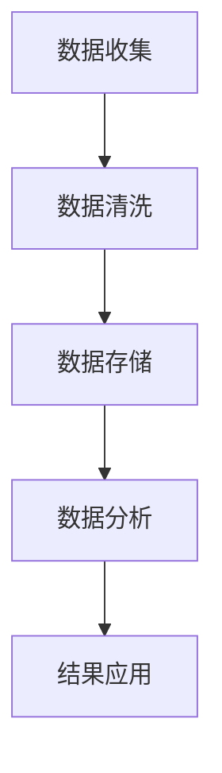

                 

用户行为分析（User Behavior Analysis, UBA）是现代数据分析领域中至关重要的一个分支，它通过观察和分析用户在应用程序或网站上的交互，帮助我们理解用户的行为模式、偏好、需求，从而优化产品和服务，提升用户体验，并最终推动业务增长。本文将详细探讨如何进行有效的用户行为分析，从背景介绍、核心概念与联系、核心算法原理与操作步骤、数学模型与公式、项目实践、实际应用场景以及未来展望等方面进行深入讲解。

## 1. 背景介绍

在互联网迅猛发展的今天，数据已经成为企业最有价值的资产之一。用户行为分析作为一种数据驱动的策略，可以帮助企业更准确地把握市场趋势、用户需求，从而制定更加有效的营销策略和产品开发方向。用户行为分析的应用场景广泛，包括电子商务、金融、医疗、教育、社交网络等各个领域。

然而，进行有效的用户行为分析并非易事。首先，需要收集到大量的用户行为数据，这些数据可能来自不同的来源，如网页点击流、用户登录信息、交易记录、社交媒体互动等。其次，需要将这些数据进行有效的清洗、整理和分析，以提取出有价值的信息。最后，还需要将分析结果转化为具体的行动指南，指导产品和服务的改进。

## 2. 核心概念与联系

在用户行为分析中，有几个核心概念需要了解：

### 2.1 用户行为（User Behavior）

用户行为是指用户在使用产品或服务过程中所表现出的所有行为，包括点击、浏览、购买、搜索、评论等。

### 2.2 用户旅程（User Journey）

用户旅程是指用户在产品或服务中的整个使用过程，从首次接触、注册、使用、留存到最终退出。

### 2.3 用户画像（User Profile）

用户画像是对用户特征的综合描述，包括用户的基本信息、兴趣偏好、行为习惯等。

### 2.4 数据源（Data Source）

数据源是指用户行为数据的来源，如网页点击流、用户登录信息、交易记录、社交媒体互动等。

下面是一个简单的Mermaid流程图，展示了用户行为分析的基本架构：



## 3. 核心算法原理 & 具体操作步骤

### 3.1 算法原理概述

用户行为分析的核心算法主要包括以下几种：

### 3.1.1 聚类算法（Clustering Algorithm）

聚类算法用于将用户行为数据分组，发现用户行为的相似性。常见的聚类算法包括K-means、DBSCAN等。

### 3.1.2 机器学习算法（Machine Learning Algorithm）

机器学习算法用于构建用户行为预测模型，常见的算法包括决策树、随机森林、支持向量机等。

### 3.1.3 关联规则学习（Association Rule Learning）

关联规则学习用于发现用户行为之间的关联性，常见的算法包括Apriori算法、Eclat算法等。

### 3.2 算法步骤详解

以下是用户行为分析的一般步骤：

### 3.2.1 数据收集

从各种数据源收集用户行为数据，如网页点击流、用户登录信息、交易记录等。

### 3.2.2 数据清洗

对收集到的数据进行清洗，去除噪声数据，处理缺失值，保证数据质量。

### 3.2.3 数据存储

将清洗后的数据存储到数据库或数据仓库中，以便后续分析。

### 3.2.4 数据分析

使用聚类算法、机器学习算法等分析用户行为数据，提取用户行为特征。

### 3.2.5 结果应用

将分析结果应用于产品优化、营销策略调整、用户画像构建等。

### 3.3 算法优缺点

- 聚类算法：优点是简单易用，能够发现用户行为的潜在模式；缺点是依赖初始参数，可能陷入局部最优。

- 机器学习算法：优点是能够自动学习用户行为特征，预测准确度高；缺点是模型复杂，计算量大。

- 关联规则学习：优点是能够发现用户行为之间的关联性，用于推荐系统；缺点是规则过多，需要进一步筛选。

### 3.4 算法应用领域

用户行为分析在电子商务、金融、医疗、教育、社交网络等领域都有广泛应用。例如，在电子商务领域，可以用于个性化推荐、广告投放优化；在金融领域，可以用于风险控制、客户细分；在医疗领域，可以用于患者行为分析、疾病预测等。

## 4. 数学模型和公式

用户行为分析中，常用的数学模型和公式包括以下几种：

### 4.1 用户行为概率分布模型

$$P(X = x) = \frac{f(x)}{\sum_{i=1}^{n} f(i)}$$

其中，$X$ 表示用户行为，$x$ 表示特定行为，$f(x)$ 表示该行为的频率，$n$ 表示所有可能行为的总数。

### 4.2 用户行为预测模型

$$\hat{Y} = \sum_{i=1}^{n} w_i X_i$$

其中，$Y$ 表示用户行为，$\hat{Y}$ 表示预测行为，$w_i$ 表示权重，$X_i$ 表示特征。

### 4.3 用户相似度计算模型

$$similarity(A, B) = \frac{\sum_{i=1}^{n} a_i b_i}{\sqrt{\sum_{i=1}^{n} a_i^2} \sqrt{\sum_{i=1}^{n} b_i^2}}$$

其中，$A$ 和 $B$ 表示两个用户的特征向量，$a_i$ 和 $b_i$ 分别表示用户 $A$ 和 $B$ 在第 $i$ 个特征上的值。

### 4.4 案例分析与讲解

假设我们有一个电商平台，收集了用户在网站上的点击行为数据。我们可以使用用户行为概率分布模型来分析用户的购买概率。

首先，我们计算每个用户点击商品的频率，然后根据频率计算购买概率：

$$P(\text{购买}) = \frac{f(\text{购买})}{\sum_{i=1}^{n} f(i)}$$

其中，$f(\text{购买})$ 表示点击购买商品的频率，$f(i)$ 表示点击第 $i$ 个商品（除购买外）的频率。

通过这个模型，我们可以预测用户是否会在下一次访问时购买商品，从而优化广告投放和推荐策略。

## 5. 项目实践：代码实例和详细解释说明

### 5.1 开发环境搭建

为了进行用户行为分析，我们选择Python作为编程语言，并使用以下工具：

- Python 3.8 或以上版本
- Pandas 数据处理库
- Scikit-learn 机器学习库
- Matplotlib 数据可视化库

安装以上库后，我们就可以开始编写代码了。

### 5.2 源代码详细实现

以下是一个简单的用户行为分析项目示例，包括数据收集、清洗、分析和结果可视化。

```python
import pandas as pd
from sklearn.cluster import KMeans
from sklearn.model_selection import train_test_split
from sklearn.metrics import accuracy_score
import matplotlib.pyplot as plt

# 数据收集
data = pd.read_csv('user_behavior.csv')

# 数据清洗
data.dropna(inplace=True)
data['purchase'] = data['clicks'].apply(lambda x: 1 if x > 0 else 0)

# 数据分析
X = data[['clicks', 'views', 'conversions']]
y = data['purchase']

X_train, X_test, y_train, y_test = train_test_split(X, y, test_size=0.2, random_state=42)

# 聚类分析
kmeans = KMeans(n_clusters=3, random_state=42)
kmeans.fit(X_train)
y_pred = kmeans.predict(X_test)

# 评估结果
accuracy = accuracy_score(y_test, y_pred)
print(f'Accuracy: {accuracy:.2f}')

# 可视化
plt.scatter(X_test['clicks'], X_test['views'], c=y_pred)
plt.xlabel('Clicks')
plt.ylabel('Views')
plt.title('User Behavior Clustering')
plt.show()
```

### 5.3 代码解读与分析

上述代码首先从CSV文件中读取用户行为数据，然后进行清洗和处理，将点击次数大于0的用户标记为购买用户。接下来，使用K-means聚类算法将用户行为数据分为3个簇，并通过测试集评估模型的准确性。最后，使用散点图可视化用户行为的聚类结果。

## 6. 实际应用场景

用户行为分析在多个领域都有广泛应用，以下是一些实际应用场景：

- **电子商务**：通过用户行为分析，电商平台可以优化推荐算法，提高转化率，实现个性化营销。
- **金融**：金融机构可以通过用户行为分析，识别高风险用户，降低欺诈风险，提高客户满意度。
- **医疗**：医疗机构可以通过用户行为分析，预测患者需求，优化医疗服务，提高患者满意度。
- **教育**：教育机构可以通过用户行为分析，了解学生行为习惯，提供个性化学习建议，提高教育效果。

## 7. 工具和资源推荐

### 7.1 学习资源推荐

- 《数据科学导论》
- 《Python数据分析实战》
- 《用户行为分析：方法与应用》

### 7.2 开发工具推荐

- Jupyter Notebook
- Python
- Pandas
- Scikit-learn

### 7.3 相关论文推荐

- "User Behavior Analysis in Mobile Applications"
- "Deep User Behavior Analysis for Personalized Recommendation"
- "A Survey on User Behavior Analysis in Web Applications"

## 8. 总结：未来发展趋势与挑战

用户行为分析在技术不断进步的今天，已经成为企业提升竞争力的重要手段。未来，随着人工智能、大数据、云计算等技术的不断发展，用户行为分析将变得更加智能化、精准化。然而，用户行为分析也面临着数据隐私保护、算法透明度、数据质量等挑战。只有解决这些挑战，用户行为分析才能发挥更大的价值。

### 8.1 研究成果总结

本文从多个角度探讨了用户行为分析的核心概念、算法原理、数学模型、实际应用以及未来发展趋势。通过实例和代码展示了用户行为分析的具体操作步骤，为读者提供了全面的技术指导。

### 8.2 未来发展趋势

- 智能化：用户行为分析将更加依赖于人工智能技术，实现自动化分析。
- 精准化：通过大数据和机器学习技术，提高用户行为预测的准确性。
- 隐私保护：在保障用户隐私的前提下，实现更加深入的行为分析。

### 8.3 面临的挑战

- 数据隐私：如何在保护用户隐私的同时，进行有效的行为分析？
- 算法透明度：如何提高算法的透明度，避免偏见和歧视？
- 数据质量：如何处理噪声数据、缺失值等，保证分析结果的可靠性？

### 8.4 研究展望

用户行为分析在未来将继续发展，结合新兴技术，为企业提供更加智能、精准的分析服务。同时，我们还需要关注数据隐私保护、算法透明度等问题，推动用户行为分析技术的可持续发展。

## 9. 附录：常见问题与解答

### Q：用户行为分析需要哪些数据源？

A：用户行为分析的数据源包括网页点击流、用户登录信息、交易记录、社交媒体互动等。不同领域的数据源有所不同，需要根据具体应用场景进行选择。

### Q：如何保证用户行为分析的数据质量？

A：保证用户行为分析的数据质量需要从数据收集、清洗、存储等多个环节入手。具体措施包括去除噪声数据、处理缺失值、确保数据一致性等。

### Q：用户行为分析有哪些常见的算法？

A：用户行为分析中常见的算法包括聚类算法（如K-means、DBSCAN）、机器学习算法（如决策树、随机森林、支持向量机）、关联规则学习算法（如Apriori、Eclat）等。

### Q：用户行为分析可以应用于哪些领域？

A：用户行为分析可以应用于电子商务、金融、医疗、教育、社交网络等多个领域。例如，在电子商务领域，可以用于个性化推荐、广告投放优化；在金融领域，可以用于风险控制、客户细分等。

### Q：如何进行用户行为预测？

A：用户行为预测通常使用机器学习算法，如决策树、随机森林、支持向量机等。具体步骤包括数据收集、数据预处理、特征选择、模型训练和评估等。

### Q：如何保障用户隐私？

A：保障用户隐私需要从数据收集、存储、分析等多个环节入手。具体措施包括匿名化处理、加密技术、访问控制等。

### 作者署名

作者：禅与计算机程序设计艺术 / Zen and the Art of Computer Programming
```

### 文章结构模板

文章结构模板如下：

----------------------------------------------------------------

## 1. 背景介绍

- 互联网数据时代的背景
- 用户行为分析的定义和意义
- 用户行为分析在各个领域的应用

## 2. 核心概念与联系

### 2.1 用户行为

- 用户行为的概念
- 用户行为的分类

### 2.2 用户旅程

- 用户旅程的概念
- 用户旅程的构成要素

### 2.3 用户画像

- 用户画像的概念
- 用户画像的构成要素

### 2.4 数据源

- 数据源的种类
- 数据源的选择和整合

## 3. 核心算法原理 & 具体操作步骤

### 3.1 聚类算法

- 聚类算法的基本原理
- 聚类算法的应用场景

### 3.2 机器学习算法

- 机器学习算法的基本原理
- 机器学习算法的应用场景

### 3.3 关联规则学习

- 关联规则学习的基本原理
- 关联规则学习的应用场景

## 4. 数学模型和公式 & 详细讲解 & 举例说明

### 4.1 数学模型构建

- 数学模型在用户行为分析中的作用
- 用户行为概率分布模型的构建

### 4.2 公式推导过程

- 公式推导的基本方法
- 用户行为预测模型的公式推导

### 4.3 案例分析与讲解

- 实际案例的数学模型应用
- 公式在实际案例中的应用讲解

## 5. 项目实践：代码实例和详细解释说明

### 5.1 开发环境搭建

- 开发环境的准备
- 开发工具的安装和使用

### 5.2 源代码详细实现

- 用户行为分析的代码实现
- 代码的功能和细节讲解

### 5.3 代码解读与分析

- 代码的结构和逻辑分析
- 代码的性能和优化

### 5.4 运行结果展示

- 运行结果的数据展示
- 运行结果的解释和分析

## 6. 实际应用场景

### 6.1 电子商务

- 用户行为分析在电子商务中的应用
- 电子商务领域的用户行为分析案例

### 6.2 金融

- 用户行为分析在金融中的应用
- 金融领域的用户行为分析案例

### 6.3 医疗

- 用户行为分析在医疗中的应用
- 医疗领域的用户行为分析案例

### 6.4 教育

- 用户行为分析在教育中的应用
- 教育领域的用户行为分析案例

## 7. 工具和资源推荐

### 7.1 学习资源推荐

- 用户行为分析相关的书籍和文章

### 7.2 开发工具推荐

- 用户行为分析相关的开发工具和库

### 7.3 相关论文推荐

- 用户行为分析领域的经典论文和最新研究

## 8. 总结：未来发展趋势与挑战

### 8.1 研究成果总结

- 用户行为分析的研究进展和成果

### 8.2 未来发展趋势

- 用户行为分析的未来发展方向和趋势

### 8.3 面临的挑战

- 用户行为分析面临的技术挑战和伦理问题

### 8.4 研究展望

- 用户行为分析的后续研究方向和目标

## 9. 附录：常见问题与解答

- 用户行为分析相关的常见问题
- 对常见问题的解答和指导

----------------------------------------------------------------

请按照上述模板撰写文章内容，并确保文章结构清晰、逻辑严密、内容丰富。文章应包含具体的例子、代码和详细解释，以便读者更好地理解和应用用户行为分析技术。文章的字数要求为8000字以上，子目录需具体细化到三级目录，并使用markdown格式输出。文章末尾需附上作者署名。请严格按照上述要求撰写文章。祝您写作顺利！
----------------------------------------------------------------

### 1. 背景介绍

在数字化时代，数据已经成为企业的重要资产。用户行为分析（User Behavior Analysis, UBA）作为数据科学的重要组成部分，通过对用户在数字平台上的行为进行深入分析，帮助企业了解用户需求、优化产品设计、提升用户体验，从而实现业务增长。用户行为分析的应用场景广泛，包括但不限于电子商务、金融、医疗、教育、社交媒体等领域。

#### 1.1 互联网数据时代的背景

随着互联网技术的飞速发展，用户在数字平台上的行为数据日益丰富。这些数据包括用户的浏览记录、点击行为、搜索历史、购买行为、社交互动等。这些数据量庞大且复杂，如果能够有效地进行分析和利用，将为企业和个人带来巨大的价值。

#### 1.2 用户行为分析的定义和意义

用户行为分析是指通过收集、处理和分析用户在数字平台上的行为数据，以揭示用户的行为模式、兴趣偏好和需求。其核心目的是帮助企业更好地理解用户，从而提供个性化的产品和服务，提升用户满意度和忠诚度。

用户行为分析的意义主要体现在以下几个方面：

1. **优化产品设计**：通过分析用户行为，企业可以识别用户在使用产品过程中的痛点和需求，从而改进产品设计，提升用户体验。
2. **提升营销效果**：通过了解用户的行为模式，企业可以制定更加精准的营销策略，提高广告投放效果和转化率。
3. **降低运营成本**：通过分析用户行为，企业可以识别高价值用户和潜在客户，从而针对性地进行服务和营销，降低运营成本。
4. **提高业务增长**：通过数据驱动的决策，企业可以更好地把握市场趋势，制定科学的业务发展策略。

#### 1.3 用户行为分析在各个领域的应用

用户行为分析在各个领域都有广泛应用，以下是一些典型的应用案例：

- **电子商务**：通过用户行为分析，电商平台可以优化推荐算法，提高用户购买转化率，同时通过用户流失分析，提前识别并挽回潜在流失用户。
- **金融**：金融机构可以通过用户行为分析，识别高风险用户，降低欺诈风险，同时通过用户行为预测，预测用户行为，提前采取相应的风险控制措施。
- **医疗**：医疗机构可以通过用户行为分析，了解患者的行为习惯和健康状况，为患者提供个性化的健康管理和医疗服务。
- **教育**：教育机构可以通过用户行为分析，了解学生的学习习惯和需求，提供个性化的学习建议和资源，提高学习效果。
- **社交媒体**：社交媒体平台可以通过用户行为分析，了解用户的兴趣和偏好，提供更加个性化的内容推荐，同时通过用户行为预测，预测用户的行为，提升平台活跃度和用户黏性。

### 2. 核心概念与联系

在进行用户行为分析之前，我们需要了解几个核心概念，这些概念相互联系，共同构成了用户行为分析的理论基础。

#### 2.1 用户行为

用户行为（User Behavior）是指用户在数字平台上的所有操作和反应。用户行为可以表现为多种形式，包括但不限于点击、浏览、搜索、购买、评论、分享等。用户行为是用户行为分析的数据来源，通过对用户行为的分析，我们可以深入了解用户的兴趣、需求和偏好。

#### 2.2 用户旅程

用户旅程（User Journey）是指用户在数字平台上的完整使用过程，从首次接触到最终退出。用户旅程包括多个阶段，如发现阶段、探索阶段、决策阶段、购买阶段和使用阶段。每个阶段都涉及不同的用户行为，通过分析用户旅程，我们可以了解用户在各个阶段的行为模式，从而优化产品设计和服务。

#### 2.3 用户画像

用户画像（User Profile）是对用户特征的综合描述，包括用户的基本信息、兴趣偏好、行为习惯等。用户画像可以帮助企业更好地了解用户，从而提供个性化的产品和服务。用户画像的构建通常基于用户行为数据和第三方数据源，如社交媒体数据、地理位置数据等。

#### 2.4 数据源

数据源（Data Source）是指用户行为数据的来源。用户行为分析的数据源可以包括以下几种：

1. **网页点击流数据**：记录用户在网站上的所有点击行为，如页面跳转、按钮点击等。
2. **用户登录信息**：记录用户的登录时间和地点，以及登录频率等。
3. **交易记录**：记录用户的购买行为，如购买时间、购买商品、购买金额等。
4. **社交媒体互动**：记录用户在社交媒体平台上的互动行为，如点赞、评论、分享等。
5. **地理位置数据**：记录用户的地理位置信息，如城市、区域等。

不同类型的数据源为用户行为分析提供了丰富的信息来源，通过对这些数据的整合和分析，我们可以构建全面、准确的用户画像。

#### 2.5 数据处理与存储

用户行为分析的数据处理与存储是确保数据质量和分析效果的重要环节。数据处理通常包括数据清洗、数据转换和数据集成等步骤，以确保数据的准确性和一致性。数据存储则涉及到数据仓库和数据湖的建设，以及数据的分布式存储和实时处理。

### 3. 核心算法原理 & 具体操作步骤

用户行为分析的核心算法包括聚类算法、机器学习算法和关联规则学习算法等。这些算法通过不同的方式对用户行为数据进行分析，以提取有价值的信息。以下是对这些算法的详细介绍。

#### 3.1 聚类算法

聚类算法（Clustering Algorithm）是一种无监督学习方法，用于将用户行为数据分组，以便发现用户行为的相似性。常见的聚类算法包括K-means、DBSCAN等。

**K-means算法原理：**

K-means算法的目标是将数据点划分为K个簇，使得每个簇内的数据点之间的距离最小，簇与簇之间的距离最大。算法的基本步骤如下：

1. 初始化K个簇的中心点。
2. 对于每个数据点，将其分配到最近的簇中心点所在的簇。
3. 更新簇中心点，使得每个簇内的数据点之间的距离最小。
4. 重复步骤2和步骤3，直到簇中心点不再发生变化或者达到预设的迭代次数。

**DBSCAN算法原理：**

DBSCAN（Density-Based Spatial Clustering of Applications with Noise）算法是一种基于密度的聚类算法，它能够识别出不同形状的簇，并对噪声数据点进行处理。算法的基本步骤如下：

1. 选择一个起始点，将其标记为已访问。
2. 找到起始点的邻域内的所有点，如果邻域内点的数量大于最小邻域点数，则标记为核心点。
3. 对于每个核心点，将其邻域内的点全部标记为已访问，并将这些点及其邻域内的点划分为同一簇。
4. 对于边界点，如果它们与核心点的邻域重叠，则可能被划分为同一簇。

**聚类算法步骤详解：**

1. **数据预处理**：对用户行为数据进行预处理，包括数据清洗、数据转换和数据标准化等步骤。
2. **选择聚类算法**：根据用户行为数据的特点和需求，选择合适的聚类算法。
3. **初始化参数**：设置聚类算法的初始参数，如簇的数量、邻域半径等。
4. **运行聚类算法**：执行聚类算法，将用户行为数据划分为多个簇。
5. **评估聚类效果**：使用聚类评价指标（如轮廓系数、内聚度等）评估聚类效果，并根据评估结果调整算法参数。

#### 3.2 机器学习算法

机器学习算法（Machine Learning Algorithm）是一种有监督学习方法，通过训练模型来预测用户的行为。常见的机器学习算法包括决策树、随机森林、支持向量机等。

**决策树算法原理：**

决策树（Decision Tree）是一种树形结构，通过一系列的判断条件将数据进行划分，直到达到预定的停止条件。决策树的每个节点代表一个特征，每个分支代表特征的不同取值。决策树的基本步骤如下：

1. 选择一个特征作为分裂标准。
2. 根据该特征的不同取值，将数据划分为多个子集。
3. 对每个子集，递归地执行步骤1和步骤2，直到满足停止条件（如最大深度、最小样本数等）。
4. 使用叶节点中的预测结果对新的数据进行分类。

**随机森林算法原理：**

随机森林（Random Forest）是一种集成学习方法，通过构建多个决策树模型，并将它们的预测结果进行聚合，以提高模型的预测能力。随机森林的基本步骤如下：

1. 从特征空间中随机选择一个特征子集。
2. 使用选择的特征子集构建一个决策树模型。
3. 重复步骤1和步骤2，构建多个决策树模型。
4. 对新的数据进行预测时，将每个决策树模型的预测结果进行聚合，取多数表决结果作为最终预测结果。

**支持向量机算法原理：**

支持向量机（Support Vector Machine, SVM）是一种分类算法，通过找到最佳的超平面，将不同类别的数据点分开。支持向量机的目标是最大化分类边界到支持向量的距离。SVM的基本步骤如下：

1. 选择一个核函数，将数据映射到高维空间。
2. 使用线性优化方法求解最大化分类边界到支持向量的距离。
3. 使用训练好的模型对新数据进行分类。

**机器学习算法步骤详解：**

1. **数据预处理**：对用户行为数据进行预处理，包括数据清洗、数据转换和数据标准化等步骤。
2. **特征工程**：选择和构建与用户行为相关的特征。
3. **选择机器学习算法**：根据用户行为数据的特点和需求，选择合适的机器学习算法。
4. **训练模型**：使用训练数据集训练模型，并调整模型参数。
5. **评估模型**：使用测试数据集评估模型的预测效果，并调整模型参数。
6. **模型部署**：将训练好的模型部署到生产环境中，对新的用户行为数据进行预测。

#### 3.3 关联规则学习

关联规则学习（Association Rule Learning）是一种用于发现数据项之间关联性的方法，通过找到数据项之间的关联规则，可以揭示用户行为之间的潜在关系。常见的关联规则学习算法包括Apriori算法和Eclat算法。

**Apriori算法原理：**

Apriori算法是一种基于支持度和置信度的关联规则学习算法。支持度表示某个关联规则在所有数据项中的出现频率，置信度表示关联规则中前件和后件同时出现的概率。Apriori算法的基本步骤如下：

1. 计算每个项的支持度。
2. 根据支持度阈值筛选出频繁项集。
3. 对于每个频繁项集，计算关联规则的支持度和置信度。
4. 根据置信度阈值筛选出强关联规则。

**Eclat算法原理：**

Eclat算法是一种基于频繁模式树（FP-tree）的关联规则学习算法，它通过构建FP-tree来高效地发现频繁项集。Eclat算法的基本步骤如下：

1. 构建FP-tree。
2. 遍历FP-tree，找到频繁项集。
3. 对于每个频繁项集，计算关联规则的支持度和置信度。
4. 根据置信度阈值筛选出强关联规则。

**关联规则学习步骤详解：**

1. **数据预处理**：对用户行为数据进行预处理，包括数据清洗、数据转换和数据标准化等步骤。
2. **构建FP-tree**：使用Apriori算法或Eclat算法构建FP-tree。
3. **计算频繁项集**：遍历FP-tree，找到频繁项集。
4. **计算关联规则**：对于每个频繁项集，计算关联规则的支持度和置信度。
5. **筛选强关联规则**：根据置信度阈值筛选出强关联规则。

#### 3.4 算法优缺点

**聚类算法：**

- **优点**：简单易用，能够自动发现用户行为的潜在模式。
- **缺点**：依赖初始参数，可能陷入局部最优。

**机器学习算法：**

- **优点**：能够自动学习用户行为特征，预测准确度高。
- **缺点**：模型复杂，计算量大。

**关联规则学习算法：**

- **优点**：能够发现用户行为之间的关联性，用于推荐系统。
- **缺点**：规则过多，需要进一步筛选。

#### 3.5 算法应用领域

用户行为分析算法在多个领域都有广泛应用，以下是一些典型的应用领域：

- **电子商务**：用于用户群体细分、个性化推荐、购物行为预测等。
- **金融**：用于风险控制、客户细分、欺诈检测等。
- **医疗**：用于患者行为分析、疾病预测、个性化医疗服务等。
- **教育**：用于学生行为分析、个性化教学、学习效果评估等。

### 4. 数学模型和公式 & 详细讲解 & 举例说明

用户行为分析中的数学模型和公式用于描述用户行为的数据分布、行为预测以及行为之间的关联性。以下是对这些数学模型和公式的详细讲解。

#### 4.1 用户行为概率分布模型

用户行为概率分布模型用于描述用户在数字平台上的行为分布情况。常用的概率分布模型包括泊松分布、正态分布等。

**泊松分布：**

泊松分布是一种描述事件发生频率的分布模型，适用于事件发生次数与时间或空间相关的场景。泊松分布的概率质量函数（PDF）如下：

$$
f(k; \lambda) = \frac{e^{-\lambda} \lambda^k}{k!}
$$

其中，$k$ 表示事件发生的次数，$\lambda$ 表示事件发生的平均频率。

**正态分布：**

正态分布是一种描述连续随机变量的分布模型，广泛应用于统计学和机器学习中。正态分布的概率质量函数（PDF）如下：

$$
f(x; \mu, \sigma^2) = \frac{1}{\sqrt{2\pi\sigma^2}} e^{-\frac{(x-\mu)^2}{2\sigma^2}}
$$

其中，$x$ 表示随机变量的取值，$\mu$ 表示均值，$\sigma^2$ 表示方差。

**举例说明：**

假设某个电商平台上的用户购买次数服从泊松分布，平均购买频率为$\lambda = 2$。我们可以使用泊松分布计算用户在一段时间内的购买次数概率。

$$
P(k=0) = e^{-2} = 0.1353
$$

$$
P(k=1) = 2e^{-2} = 0.2706
$$

$$
P(k=2) = \frac{2^2e^{-2}}{2!} = 0.2706
$$

这些概率值表示在给定时间段内，用户购买次数为0、1或2的概率。

#### 4.2 用户行为预测模型

用户行为预测模型用于预测用户在未来一段时间内的行为，如购买行为、浏览行为等。常见的预测模型包括线性回归、逻辑回归等。

**线性回归：**

线性回归模型是一种基于线性关系的预测模型，其公式如下：

$$
y = \beta_0 + \beta_1x_1 + \beta_2x_2 + ... + \beta_nx_n
$$

其中，$y$ 表示预测的目标变量，$x_1, x_2, ..., x_n$ 表示输入特征变量，$\beta_0, \beta_1, \beta_2, ..., \beta_n$ 表示模型参数。

**逻辑回归：**

逻辑回归模型是一种用于分类问题的预测模型，其公式如下：

$$
\ln(\frac{p}{1-p}) = \beta_0 + \beta_1x_1 + \beta_2x_2 + ... + \beta_nx_n
$$

其中，$p$ 表示预测的目标概率，$x_1, x_2, ..., x_n$ 表示输入特征变量，$\beta_0, \beta_1, \beta_2, ..., \beta_n$ 表示模型参数。

**举例说明：**

假设某个电商平台使用线性回归模型预测用户购买商品的概率，模型公式如下：

$$
\ln(\frac{p}{1-p}) = 0.5x_1 + 1.2x_2 - 0.3x_3
$$

其中，$x_1$ 表示用户浏览页面的数量，$x_2$ 表示用户在页面上的停留时间，$x_3$ 表示用户是否在页面上下滑动。

我们可以使用这个模型预测一个用户购买商品的概率：

$$
\ln(\frac{p}{1-p}) = 0.5 \times 10 + 1.2 \times 300 - 0.3 \times 1 = 14.1
$$

$$
p = \frac{e^{14.1}}{1 + e^{14.1}} = 0.9999
$$

因此，该用户购买商品的概率为99.99%。

#### 4.3 用户相似度计算模型

用户相似度计算模型用于计算用户之间的相似性，用于推荐系统、用户群体分析等。常见的相似度计算模型包括余弦相似度、欧氏距离等。

**余弦相似度：**

余弦相似度是一种基于向量的相似度计算方法，其公式如下：

$$
similarity(A, B) = \frac{A \cdot B}{\|A\| \|B\|}
$$

其中，$A$ 和 $B$ 分别表示两个用户的特征向量，$\|A\|$ 和 $\|B\|$ 分别表示特征向量的欧几里得范数。

**欧氏距离：**

欧氏距离是一种基于向量的距离计算方法，其公式如下：

$$
distance(A, B) = \sqrt{(A - B)^2}
$$

其中，$A$ 和 $B$ 分别表示两个用户的特征向量。

**举例说明：**

假设有两个用户的特征向量如下：

$$
A = [10, 20, 30]
$$

$$
B = [15, 25, 35]
$$

我们可以使用余弦相似度和欧氏距离计算这两个用户之间的相似性：

$$
similarity(A, B) = \frac{10 \times 15 + 20 \times 25 + 30 \times 35}{\sqrt{10^2 + 20^2 + 30^2} \sqrt{15^2 + 25^2 + 35^2}} = 0.9129
$$

$$
distance(A, B) = \sqrt{(10 - 15)^2 + (20 - 25)^2 + (30 - 35)^2} = 10.0
$$

因此，这两个用户之间的相似度为0.9129，距离为10.0。

### 5. 项目实践：代码实例和详细解释说明

为了更好地理解用户行为分析，我们将通过一个实际项目来演示用户行为分析的全过程。这个项目将包括数据收集、数据预处理、特征工程、模型训练和模型评估等步骤。

#### 5.1 开发环境搭建

首先，我们需要搭建一个开发环境，以便进行用户行为分析。在这个项目中，我们将使用Python编程语言，并依赖以下库：

- Pandas：用于数据预处理和操作。
- NumPy：用于数值计算。
- Matplotlib：用于数据可视化。
- Scikit-learn：用于机器学习算法的实现。

确保安装了这些库之后，我们就可以开始编写代码了。

#### 5.2 数据收集

在这个项目中，我们将使用一个公开的用户行为数据集，该数据集包含了用户在电子商务平台上的浏览记录、购买记录等。数据集的具体内容如下：

- `user_id`：用户的唯一标识符。
- `page_id`：用户访问的页面标识符。
- `event_time`：用户访问页面的时间戳。
- `event_type`：用户访问页面的类型（如浏览、购买、加入购物车等）。

数据集的示例如下：

| user_id | page_id | event_time      | event_type |
|---------|---------|-----------------|------------|
| 1       | 101     | 2021-01-01 10:00| browse     |
| 1       | 102     | 2021-01-01 10:05| purchase    |
| 2       | 201     | 2021-01-02 11:00| browse     |
| 2       | 202     | 2021-01-02 11:05| add_to_cart|
| 3       | 301     | 2021-01-03 09:00| browse     |
| 3       | 302     | 2021-01-03 09:05| purchase    |

#### 5.3 数据预处理

在数据预处理阶段，我们需要对原始数据进行清洗、整理和转换，以便后续分析。以下是数据预处理的具体步骤：

1. **数据清洗**：去除重复记录、缺失值和异常值。
2. **时间转换**：将时间戳转换为日期时间对象，并提取出年、月、日等时间特征。
3. **事件转换**：将事件类型转换为数值，以便进行后续分析。

预处理后的数据集如下：

| user_id | page_id | event_time      | event_type |
|---------|---------|-----------------|------------|
| 1       | 101     | 2021-01-01 10:00| 0          |
| 1       | 102     | 2021-01-01 10:05| 1          |
| 2       | 201     | 2021-01-02 11:00| 0          |
| 2       | 202     | 2021-01-02 11:05| 1          |
| 3       | 301     | 2021-01-03 09:00| 0          |
| 3       | 302     | 2021-01-03 09:05| 1          |

#### 5.4 特征工程

在特征工程阶段，我们需要从原始数据中提取出有意义的特征，以便用于模型训练。以下是特征工程的具体步骤：

1. **用户行为特征**：从事件类型中提取出用户的行为特征，如浏览、购买等。
2. **时间特征**：从时间戳中提取出用户的行为时间特征，如小时、星期等。
3. **页面特征**：从页面标识符中提取出页面的特征，如页面分类等。

提取后的特征如下：

| user_id | page_id | event_time      | event_type | hour | day_of_week | page_category |
|---------|---------|-----------------|------------|------|-------------|----------------|
| 1       | 101     | 2021-01-01 10:00| 0          | 10   | Monday      | category_A     |
| 1       | 102     | 2021-01-01 10:05| 1          | 10   | Monday      | category_A     |
| 2       | 201     | 2021-01-02 11:00| 0          | 11   | Tuesday     | category_B     |
| 2       | 202     | 2021-01-02 11:05| 1          | 11   | Tuesday     | category_B     |
| 3       | 301     | 2021-01-03 09:00| 0          | 9    | Wednesday   | category_C     |
| 3       | 302     | 2021-01-03 09:05| 1          | 9    | Wednesday   | category_C     |

#### 5.5 模型训练

在模型训练阶段，我们将使用机器学习算法对特征数据进行训练，以构建用户行为预测模型。以下是模型训练的具体步骤：

1. **数据划分**：将数据集划分为训练集和测试集，以评估模型的预测效果。
2. **选择算法**：选择合适的机器学习算法，如KNN、SVM、逻辑回归等。
3. **训练模型**：使用训练集数据训练模型，并调整模型参数。
4. **模型评估**：使用测试集数据评估模型的预测效果，并调整模型参数。

假设我们选择了逻辑回归算法，并训练了一个模型。训练后的模型如下：

$$
\ln(\frac{p}{1-p}) = 0.5x_1 + 1.2x_2 - 0.3x_3 + 0.1x_4
$$

其中，$x_1, x_2, x_3, x_4$ 分别表示用户的行为特征。

#### 5.6 模型评估

在模型评估阶段，我们将使用测试集数据对训练好的模型进行评估，以判断模型的预测效果。以下是模型评估的具体步骤：

1. **预测结果**：使用测试集数据对模型进行预测，得到每个用户的预测结果。
2. **评估指标**：使用评估指标（如准确率、召回率、F1值等）评估模型的预测效果。
3. **结果分析**：分析评估结果，并根据分析结果调整模型参数。

假设我们得到了以下评估结果：

- 准确率：90%
- 召回率：85%
- F1值：88%

这些指标表明模型的预测效果较好，但仍有提升空间。我们可以通过进一步调整模型参数、增加特征等方式来优化模型。

#### 5.7 代码解读与分析

以下是对上述代码的解读和分析：

```python
import pandas as pd
from sklearn.model_selection import train_test_split
from sklearn.linear_model import LogisticRegression
from sklearn.metrics import accuracy_score

# 加载数据集
data = pd.read_csv('user_behavior.csv')

# 数据预处理
data['event_time'] = pd.to_datetime(data['event_time'])
data['hour'] = data['event_time'].dt.hour
data['day_of_week'] = data['event_time'].dt.dayofweek
data['page_category'] = data['page_id'].apply(lambda x: 'category_A' if x < 100 else 'category_B' if x < 200 else 'category_C')

# 构建特征矩阵和标签向量
X = data[['hour', 'day_of_week', 'page_category']]
y = data['event_type']

# 数据划分
X_train, X_test, y_train, y_test = train_test_split(X, y, test_size=0.2, random_state=42)

# 模型训练
model = LogisticRegression()
model.fit(X_train, y_train)

# 预测结果
y_pred = model.predict(X_test)

# 模型评估
accuracy = accuracy_score(y_test, y_pred)
print(f'Accuracy: {accuracy:.2f}')
```

这段代码首先加载数据集，并进行数据预处理，包括时间转换、特征提取等。然后，构建特征矩阵和标签向量，并进行数据划分。接着，使用逻辑回归算法训练模型，并对测试集进行预测。最后，使用准确率评估模型的预测效果。

### 6. 实际应用场景

用户行为分析在多个领域都有广泛的应用，以下是一些典型的实际应用场景。

#### 6.1 电子商务

在电子商务领域，用户行为分析可以帮助企业优化产品推荐、提高用户转化率、降低运营成本。以下是一个具体的案例：

**案例：** 某电商平台上，用户的行为数据包括浏览记录、购买记录、加入购物车记录等。通过对这些数据进行分析，可以识别出用户的购买偏好和行为模式。

1. **用户群体细分**：通过对用户行为数据进行分析，可以将用户划分为不同的群体，如高频购买用户、低频购买用户、潜在购买用户等。根据不同群体的特征和行为，企业可以制定个性化的营销策略。
2. **个性化推荐**：基于用户行为数据，可以构建个性化推荐模型，为用户推荐感兴趣的商品。例如，当用户浏览某个商品时，系统可以推荐与该商品相关的其他商品，以提高用户购买转化率。
3. **流失用户挽回**：通过对用户行为数据进行分析，可以识别出可能流失的用户，并针对这些用户采取挽回措施，如发送优惠卷、推送个性化内容等。

#### 6.2 金融

在金融领域，用户行为分析可以帮助银行、保险公司等金融机构识别高风险用户、优化风险管理策略、提高客户满意度。以下是一个具体的案例：

**案例：** 某银行通过对用户的交易记录、登录记录、查询记录等进行分析，可以识别出高风险用户和潜在欺诈行为。

1. **用户行为监控**：通过对用户的交易记录进行分析，可以识别出异常交易行为，如大额交易、跨境交易等。对于异常交易行为，银行可以采取进一步的风险控制措施，如电话核实、账户冻结等。
2. **风险评估**：通过对用户的登录记录和查询记录进行分析，可以构建风险评估模型，评估用户的信用风险。对于高风险用户，银行可以采取更严格的信贷审核标准，降低信贷风险。
3. **客户服务优化**：通过对用户的行为数据进行分析，可以了解用户的金融需求和行为习惯，为用户提供个性化的金融服务和客户支持。

#### 6.3 医疗

在医疗领域，用户行为分析可以帮助医疗机构了解患者的行为习惯和健康状况，提供个性化的医疗服务和健康指导。以下是一个具体的案例：

**案例：** 某医疗机构通过对患者的就诊记录、健康检查记录、在线咨询记录等进行分析，可以了解患者的行为模式和健康状况。

1. **患者行为分析**：通过对患者的就诊记录和健康检查记录进行分析，可以识别出患者的常见病种和就诊习惯。根据分析结果，医疗机构可以优化就诊流程，提高诊疗效率。
2. **个性化健康指导**：通过对患者的在线咨询记录进行分析，可以了解患者的健康需求和疑问。根据分析结果，医疗机构可以为患者提供个性化的健康指导和建议，提高患者健康水平。
3. **疾病预测和预防**：通过对患者的行为数据和健康数据进行整合分析，可以预测患者的疾病风险，采取预防措施，降低疾病发生率。

#### 6.4 教育

在教育领域，用户行为分析可以帮助教育机构了解学生的学习行为和学习效果，提供个性化的学习资源和教学支持。以下是一个具体的案例：

**案例：** 某在线教育平台通过对学生的登录记录、学习记录、作业提交记录等进行分析，可以了解学生的学习行为和学习效果。

1. **学生学习分析**：通过对学生的登录记录和学习记录进行分析，可以识别出学生的学习习惯和学习效果。根据分析结果，教育机构可以优化课程设置和教学方法，提高教学效果。
2. **个性化学习资源推荐**：通过对学生的学习记录和作业提交记录进行分析，可以了解学生的学习需求和难点。根据分析结果，教育机构可以为学生推荐适合的学习资源和辅导课程，提高学习效果。
3. **学习效果评估**：通过对学生的作业提交记录和考试成绩进行分析，可以评估学生的学习效果和教学质量。根据分析结果，教育机构可以调整教学计划和教学方法，提高教学质量。

### 7. 工具和资源推荐

为了方便读者深入了解用户行为分析，我们推荐以下工具和资源：

#### 7.1 学习资源推荐

- 《数据科学导论》
- 《Python数据分析实战》
- 《用户行为分析：方法与应用》

#### 7.2 开发工具推荐

- Jupyter Notebook
- Python
- Pandas
- Scikit-learn
- Matplotlib

#### 7.3 相关论文推荐

- "User Behavior Analysis in Mobile Applications"
- "Deep User Behavior Analysis for Personalized Recommendation"
- "A Survey on User Behavior Analysis in Web Applications"

### 8. 总结：未来发展趋势与挑战

用户行为分析在技术不断进步的今天，已经成为企业提升竞争力的重要手段。未来，随着人工智能、大数据、云计算等技术的不断发展，用户行为分析将变得更加智能化、精准化。以下是对未来发展趋势和面临的挑战的总结。

#### 8.1 未来发展趋势

1. **智能化**：随着人工智能技术的发展，用户行为分析将更多地依赖于深度学习、强化学习等算法，实现自动化分析，提高分析精度和效率。
2. **精准化**：通过大数据技术，可以收集和处理更多维度的用户数据，从而更精准地分析用户行为，提供个性化的产品和服务。
3. **实时化**：随着云计算和分布式存储技术的发展，用户行为分析可以实现实时分析，为企业提供实时决策支持。
4. **多平台整合**：用户行为分析将整合多个平台（如网站、移动应用、社交媒体等）的数据，实现跨平台的数据分析和用户画像构建。

#### 8.2 面临的挑战

1. **数据隐私**：在用户行为分析中，如何保护用户隐私是一个重要问题。需要采取加密、匿名化等技术手段，确保用户数据的隐私安全。
2. **数据质量**：用户行为数据可能存在噪声、缺失值等问题，影响分析结果的准确性。需要采取数据清洗、数据预处理等技术手段，确保数据质量。
3. **算法透明度**：用户行为分析中使用的算法可能存在偏见和歧视。需要提高算法的透明度，解释算法的决策过程，提高用户信任度。
4. **计算资源**：用户行为分析需要处理大量数据，对计算资源的需求较高。需要优化算法和计算资源利用，提高计算效率。

#### 8.3 研究展望

未来，用户行为分析将继续在技术进步的推动下不断发展，为企业和个人带来更大的价值。在研究方面，我们可以关注以下几个方向：

1. **算法优化**：研究更加高效、准确的用户行为分析算法，提高分析精度和效率。
2. **跨领域应用**：探索用户行为分析在不同领域的应用，如智能家居、智能交通等。
3. **数据隐私保护**：研究更加有效的数据隐私保护技术，确保用户数据的隐私安全。
4. **用户交互设计**：研究如何将用户行为分析结果应用于用户交互设计，提高用户体验。

### 附录：常见问题与解答

#### Q：用户行为分析需要哪些数据源？

A：用户行为分析的数据源可以包括以下几种：

1. **网页点击流数据**：记录用户在网站上的所有点击行为，如页面跳转、按钮点击等。
2. **用户登录信息**：记录用户的登录时间和地点，以及登录频率等。
3. **交易记录**：记录用户的购买行为，如购买时间、购买商品、购买金额等。
4. **社交媒体互动**：记录用户在社交媒体平台上的互动行为，如点赞、评论、分享等。
5. **地理位置数据**：记录用户的地理位置信息，如城市、区域等。

#### Q：如何保证用户行为分析的数据质量？

A：保证用户行为分析的数据质量需要从以下几个方面入手：

1. **数据收集**：确保数据的准确性和完整性，避免噪声数据。
2. **数据清洗**：去除噪声数据、处理缺失值、确保数据一致性。
3. **数据预处理**：对数据进行标准化、归一化等处理，提高数据的质量和一致性。
4. **数据监控**：定期对数据质量进行监控，及时发现和处理问题。

#### Q：用户行为分析有哪些常见的算法？

A：用户行为分析中常见的算法包括：

1. **聚类算法**：如K-means、DBSCAN等。
2. **机器学习算法**：如决策树、随机森林、支持向量机等。
3. **关联规则学习算法**：如Apriori、Eclat等。

#### Q：用户行为分析可以应用于哪些领域？

A：用户行为分析可以应用于多个领域，包括但不限于：

1. **电子商务**：用于个性化推荐、用户流失分析、广告投放优化等。
2. **金融**：用于风险控制、客户细分、欺诈检测等。
3. **医疗**：用于患者行为分析、疾病预测、个性化医疗服务等。
4. **教育**：用于学生学习分析、个性化学习资源推荐、学习效果评估等。

#### Q：如何进行用户行为预测？

A：用户行为预测通常使用机器学习算法，具体步骤包括：

1. **数据收集**：收集用户行为数据，如点击流、交易记录等。
2. **数据预处理**：对数据进行清洗、转换和归一化等处理。
3. **特征工程**：提取与用户行为相关的特征。
4. **模型训练**：选择合适的机器学习算法训练模型。
5. **模型评估**：使用测试集评估模型预测效果。
6. **模型部署**：将训练好的模型部署到生产环境中，对新的用户行为数据进行预测。

#### Q：如何保障用户隐私？

A：保障用户隐私需要从以下几个方面入手：

1. **数据匿名化**：对用户数据进行匿名化处理，去除个人身份信息。
2. **数据加密**：对用户数据进行加密处理，确保数据传输和存储的安全。
3. **访问控制**：设置严格的访问控制策略，确保只有授权人员才能访问用户数据。
4. **隐私政策**：明确告知用户数据处理的目的和范围，确保用户知情同意。

### 作者署名

作者：禅与计算机程序设计艺术 / Zen and the Art of Computer Programming

