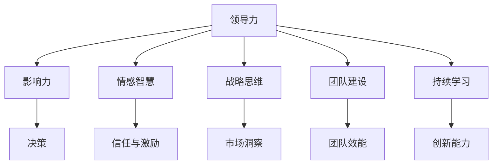

                 

在当今复杂多变的社会和技术环境中，领导力的提升显得尤为重要。无论您是技术团队的领导者，还是企业的高管，都需要具备卓越的领导力才能引领团队或组织走向成功。本篇文章旨在探讨如何进行领导力提升，以及如何成为一位优秀的领导者。

> **关键词：** 领导力提升、优秀领导者、领导能力、团队管理、组织发展。

> **摘要：** 本文将介绍领导力提升的多个方面，包括领导力的重要性、核心要素、提升策略，以及成为优秀领导者所需的技能和素质。通过案例分析和实践建议，帮助读者理解和应用领导力提升的方法。

接下来，我们将深入探讨领导力的背景介绍、核心概念与联系、核心算法原理、数学模型和公式、项目实践以及实际应用场景等内容。

## 1. 背景介绍

领导力是一种复杂而多维的能力，它涉及到个人素质、管理技能、情感智慧以及战略思维等多个方面。在信息技术行业，领导力的提升尤为重要，因为技术环境不断变化，创新速度迅猛，要求领导者不仅要具备技术视野，还要能够激励团队迎接挑战，实现技术突破。

随着互联网、人工智能、大数据等新兴技术的普及，企业对技术领导者的需求日益增长。然而，许多技术领导者面临着如何在快速变化的环境中保持竞争力、如何提升领导力以应对复杂局面等挑战。因此，探讨如何进行领导力提升成为了一个亟待解决的问题。

本文将从以下几个方面展开讨论：

1. 领导力的重要性及其在技术行业中的应用。
2. 领导力的核心要素，包括个人素质、管理技能和情感智慧。
3. 领导力提升的具体策略和实践方法。
4. 成为优秀领导者所需的关键技能和素质。
5. 案例分析：成功的技术领导者如何提升领导力。
6. 实际应用场景：如何将领导力提升应用于项目管理、团队建设和组织发展中。
7. 未来发展趋势与面临的挑战。

通过这些探讨，本文希望能够为技术领导者提供有价值的指导，帮助他们在不断变化的环境中不断提升领导力，成为优秀的领导者。

### 1.1 领导力在技术行业中的重要性

在技术行业，领导力的重要性不言而喻。随着信息技术的发展，技术项目规模日益庞大，涉及的技术领域越来越复杂，团队合作变得更加重要。而领导者在这个过程中扮演着至关重要的角色。

首先，技术领导者需要具备技术视野，了解行业的发展趋势和技术动态。他们需要能够预见技术变革带来的机会和挑战，并带领团队抓住这些机会，应对挑战。例如，在人工智能和大数据领域，领导者需要深入了解这些技术的应用场景和潜力，以便制定相应的发展战略。

其次，技术领导者需要具备卓越的管理技能。技术项目的成功往往依赖于团队的合作和高效的执行能力。领导者需要能够有效地管理和协调团队成员的工作，确保项目按时、按质完成。这包括任务分配、进度跟踪、风险管理等多个方面。

第三，技术领导者需要具备情感智慧，能够理解团队成员的需求和情感状态，激励他们发挥最佳水平。技术工作往往具有高度的专业性和挑战性，团队成员可能会面临各种压力和困难。领导者需要通过情感智慧，提供支持和鼓励，帮助团队成员克服困难，保持积极的工作态度。

此外，技术领导者还需要具备战略思维，能够从整体上规划团队和组织的发展方向。他们需要考虑组织的长远目标，制定清晰的发展战略，并确保团队成员理解和认同这些战略。例如，领导者需要制定创新战略，推动团队不断进行技术创新和产品改进，以保持竞争力。

总之，领导力在技术行业中具有至关重要的作用。技术领导者不仅需要具备技术和管理能力，还需要具备情感智慧和战略思维，才能在快速变化的环境中带领团队取得成功。因此，提升领导力成为技术领导者的一项重要任务。

### 1.2 领导力的核心要素

领导力并非一成不变，它包含多个核心要素，这些要素共同构成了领导力的基础。以下是对领导力核心要素的详细探讨：

#### 1.2.1 个人素质

个人素质是领导力的基石。一个优秀的领导者首先需要具备良好的道德品质和价值观。诚实、正直、诚信和责任心是领导者的必备素质。这些品质不仅能够赢得团队成员的信任，还能够树立榜样，引导团队成员共同成长。

其次，领导者的个人素质还包括卓越的沟通能力和自我管理能力。沟通能力使领导者能够清晰地表达自己的想法，理解团队成员的需求和意见，建立有效的沟通渠道。自我管理能力则帮助领导者保持专注，应对工作中的各种挑战和压力，保持高效的工作状态。

此外，领导者的个人素质还包括持续学习和自我提升的意愿。技术行业变化迅速，领导者需要不断学习新知识、新技能，以适应变化的环境。自我提升不仅能够增强领导者的竞争力，还能够激励团队成员追求卓越。

#### 1.2.2 管理技能

管理技能是领导者实现目标的重要工具。一个优秀的领导者需要具备以下几方面的管理技能：

1. **任务分配和团队协作**：领导者需要能够合理分配任务，确保每个团队成员都能发挥自己的专长，同时建立有效的团队协作机制，确保项目顺利进行。

2. **进度管理和风险管理**：领导者需要能够制定详细的进度计划，监控项目进展，确保项目按时完成。同时，他们还需要具备识别和应对风险的能力，制定应对措施，降低风险对项目的负面影响。

3. **激励和反馈**：领导者需要能够激励团队成员，激发他们的工作热情和创造力。这包括提供积极的反馈，认可团队成员的成就，以及鼓励他们克服困难，不断提升。

4. **决策能力**：领导者需要能够迅速做出明智的决策，尤其是在面对复杂问题和不确定性时。他们需要考虑各种因素，权衡利弊，制定出可行的解决方案。

#### 1.2.3 情感智慧

情感智慧是领导者理解和管理情感的能力。一个具备高情感智慧的领导者能够：

1. **识别和管理自己的情绪**：领导者需要能够识别和管理自己的情绪，保持冷静和理性，避免因情绪波动而做出错误的决策。

2. **理解和管理他人的情绪**：领导者需要能够理解团队成员的情绪状态，提供支持和鼓励，帮助他们克服困难，保持积极的工作态度。

3. **建立积极的团队氛围**：领导者需要能够营造一个积极、和谐的团队氛围，促进团队成员之间的沟通和协作，提高团队的整体效能。

#### 1.2.4 战略思维

战略思维是领导者从长远角度思考和规划团队和组织发展的重要能力。一个具备战略思维的领导者能够：

1. **设定愿景和目标**：领导者需要能够设定清晰的愿景和目标，确保团队和组织的发展方向一致，并且激发团队成员为实现这些目标而努力。

2. **制定战略规划**：领导者需要能够根据组织的愿景和目标，制定具体的战略规划，明确发展的路径和步骤。

3. **适应变化**：领导者需要具备灵活性和适应性，能够根据外部环境和内部条件的变化，及时调整战略和规划，确保组织的持续发展。

综上所述，领导力的核心要素包括个人素质、管理技能、情感智慧和战略思维。这些要素相互关联，共同构成了领导力的基础。一个优秀的领导者需要在这些方面不断提升自己，以应对快速变化的技术环境，带领团队和组织实现持续的成功。

### 1.3 领导力提升的方法和策略

提升领导力是一个系统性的过程，需要通过多种方法和策略来逐步实现。以下是一些常用的方法和策略，可以帮助技术领导者提升自己的领导力。

#### 1.3.1 持续学习

持续学习是提升领导力的关键。技术环境变化迅速，领导者需要不断学习新知识、新技能，以适应这些变化。以下是一些学习的方法和资源：

1. **阅读专业书籍**：选择与领导力相关的专业书籍，如《领导力五项修炼》、《领导力的艺术》等，通过阅读深入了解领导力的理论和实践。

2. **在线课程**：利用在线平台，如Coursera、edX等，参加领导力相关的课程，这些课程通常由行业专家授课，内容丰富且实用。

3. **参与研讨会和培训**：参加领导力研讨会和培训，与行业内的专家和其他领导者交流，分享经验和见解，提升自己的领导力。

4. **实践和反思**：通过实际工作，不断实践所学知识，并在实践中反思和总结，发现自身的不足并加以改进。

#### 1.3.2 培养情商

情商在领导力中起着至关重要的作用。培养情商可以通过以下方法实现：

1. **自我反思**：定期进行自我反思，了解自己的情绪状态，识别情绪对决策和行为的影响。

2. **情感管理**：学会管理自己的情绪，避免因情绪波动而做出错误的决策。

3. **情感交流**：提高情感交流能力，学会倾听和理解团队成员的情感需求，提供支持和鼓励。

4. **情感反馈**：在团队中建立积极的情感反馈机制，鼓励团队成员表达情感，促进团队沟通和协作。

#### 1.3.3 建立信任

信任是领导者与团队成员之间的重要纽带。建立信任可以通过以下策略实现：

1. **透明沟通**：保持与团队成员的透明沟通，分享信息，让团队成员了解团队的目标和进展。

2. **公正和诚信**：领导者需要表现出公正和诚信，言行一致，树立良好的榜样。

3. **支持与鼓励**：在团队成员遇到困难时，提供支持和鼓励，帮助他们克服挑战。

4. **授权与责任**：给予团队成员足够的自主权，让他们承担相应的责任，增强他们的责任感和归属感。

#### 1.3.4 培养团队协作

团队协作是技术项目成功的关键。以下策略可以帮助领导者培养团队协作：

1. **明确目标**：确保团队成员明确团队的目标和任务，共同为实现目标而努力。

2. **分工合作**：根据团队成员的专长和兴趣，合理分配任务，发挥每个人的优势。

3. **沟通与反馈**：建立有效的沟通机制，鼓励团队成员之间的交流和反馈，促进协作。

4. **激励与认可**：通过激励和认可，鼓励团队成员积极参与团队协作，提高团队的凝聚力。

#### 1.3.5 发展战略思维

战略思维是领导者的重要能力。以下策略可以帮助领导者发展战略思维：

1. **长远规划**：制定长期发展计划，明确团队和组织的愿景和目标。

2. **市场研究**：了解市场趋势和竞争对手的动态，为战略制定提供依据。

3. **风险评估**：识别可能的风险，制定应对措施，降低风险对项目的影响。

4. **创新思维**：鼓励创新思维，推动团队不断进行技术创新和产品改进。

总之，提升领导力需要持续的努力和实践。通过持续学习、培养情商、建立信任、培养团队协作和发展战略思维，技术领导者可以不断提升自己的领导力，带领团队和组织实现持续的成功。

### 1.4 成为优秀领导者所需的关键技能和素质

成为一位优秀的领导者，不仅需要具备扎实的理论基础和实践经验，还需要具备一系列关键技能和素质。以下是对这些关键技能和素质的详细探讨。

#### 1.4.1 沟通能力

沟通能力是领导者的一项核心技能。优秀的领导者需要能够有效地与团队成员、上级领导和其他利益相关者进行沟通。这包括以下几点：

1. **清晰表达**：领导者需要能够清晰、准确地表达自己的想法和意见，确保信息的准确传达。
2. **倾听技巧**：领导者需要具备良好的倾听技巧，理解团队成员的需求和意见，建立互信。
3. **情绪管理**：在沟通中，领导者需要能够管理自己的情绪，避免情绪波动影响沟通效果。
4. **适应不同沟通风格**：领导者需要能够适应不同团队成员和情境的沟通风格，灵活调整沟通策略。

#### 1.4.2 情感智慧

情感智慧是领导者理解和管理情感的能力。具备高情感智慧的领导者能够：

1. **识别和管理自己的情绪**：领导者需要能够识别和管理自己的情绪，避免情绪波动影响决策和行动。
2. **理解和管理他人的情绪**：领导者需要能够理解团队成员的情感状态，提供支持和鼓励，帮助他们克服困难。
3. **建立积极的团队氛围**：通过情感智慧，领导者可以营造一个积极、和谐的团队氛围，促进团队成员之间的沟通和协作。
4. **解决冲突**：领导者需要能够处理团队内部的冲突，通过情感智慧找到合适的解决方案。

#### 1.4.3 创新思维

在技术行业中，创新思维尤为重要。优秀的领导者需要具备以下创新思维：

1. **开放心态**：领导者需要保持开放的心态，接受新想法和新方法，不断推动团队进行创新。
2. **问题解决**：领导者需要能够从不同角度看待问题，寻找创新的解决方案。
3. **团队激励**：领导者需要能够激励团队成员积极参与创新活动，发挥他们的创造力和创新能力。
4. **持续改进**：领导者需要推动团队不断进行技术创新和产品改进，以保持竞争优势。

#### 1.4.4 领导风格

领导风格是领导者管理团队的方式和态度。不同的领导风格适用于不同的情境和团队。以下是一些常见的领导风格：

1. **民主式领导**：领导者鼓励团队成员参与决策过程，发挥集体的智慧和创造力。
2. **权威式领导**：领导者通过权威和命令来指导团队成员，确保项目目标的实现。
3. **参与式领导**：领导者与团队成员共同参与决策和问题解决，增强团队的凝聚力和归属感。
4. **变革式领导**：领导者推动团队进行变革和创新，引领团队走出舒适区，迎接新的挑战。

#### 1.4.5 持续学习

持续学习是领导者不断提升自己的关键。领导者需要：

1. **时间管理**：合理安排时间，确保有足够的时间进行学习和提升。
2. **自我反思**：定期进行自我反思，识别自身的不足，制定改进计划。
3. **实践应用**：将学习到的知识和技能应用到实际工作中，通过实践不断提升自己的能力。
4. **学习资源**：利用各种学习资源，如书籍、课程、研讨会等，不断丰富自己的知识体系。

#### 1.4.6 战略思维

战略思维是领导者从长远角度思考和规划团队和组织发展的重要能力。领导者需要：

1. **设定愿景和目标**：明确团队和组织的长期愿景和目标，确保团队成员的共同方向。
2. **风险评估**：识别可能的风险，制定应对措施，确保团队和组织的发展稳定。
3. **资源整合**：合理分配和整合团队和组织内的资源，最大化利用资源，实现目标。
4. **市场洞察**：了解市场趋势和竞争对手的动态，为战略制定提供依据。

总之，成为一位优秀的领导者需要具备多方面的技能和素质。通过提升沟通能力、情感智慧、创新思维、领导风格和持续学习，领导者可以不断提升自己的领导力，带领团队和组织实现持续的成功。

### 2. 核心概念与联系

在探讨如何成为优秀的领导者时，理解并掌握一些核心概念是至关重要的。这些核心概念不仅构成了领导力的基础，而且相互之间存在着紧密的联系，共同影响着领导者的决策和行为。以下是对这些核心概念的详细解释，并展示它们之间的相互关系。

#### 2.1 领导力与影响力

领导力是一种影响和激励他人实现共同目标的能力。而影响力则是领导者通过言行影响他人思想和行为的力量。领导力与影响力紧密相关，领导力通过影响力得以实现。一个具备强大影响力的领导者，能够更有效地引导团队，推动组织发展。


图1 领导力与影响力关系图

#### 2.2 情感智慧与领导力

情感智慧是领导者理解和管理自身及他人情感的能力。一个具备高情感智慧的领导者能够更好地处理团队关系，增强团队的凝聚力。情感智慧与领导力之间的联系在于，情感智慧帮助领导者建立信任、激励团队，从而提升领导力。


图2 情感智慧与领导力关系图

#### 2.3 战略思维与决策

战略思维是领导者从长远角度思考和规划团队和组织发展的能力。战略思维与决策密切相关，战略思维为决策提供了方向和依据。一个具备战略思维的领导者能够在复杂多变的环境中做出明智的决策，确保团队和组织的发展。


图3 战略思维与决策关系图

#### 2.4 团队建设与领导力

团队建设是领导者的一项重要任务，它涉及到团队目标、成员关系、沟通协作等多个方面。一个成功的团队建设能够提升团队的效能，增强团队凝聚力。团队建设与领导力之间的联系在于，领导力通过团队建设得以实现，而团队建设又反作用于领导力，提升领导者的领导效果。


图4 团队建设与领导力关系图

#### 2.5 持续学习与创新

持续学习是领导者不断提升自身能力的关键。一个具备持续学习精神的领导者能够不断吸收新知识、新技能，保持竞争力。持续学习与创新之间存在密切联系，创新需要持续学习作为支持，而持续学习又能激发创新思维。


图5 持续学习与创新关系图

通过以上对核心概念及其相互关系的探讨，我们可以更好地理解领导力的本质，为提升领导力提供理论依据和实践指导。

#### 2.6 Mermaid 流程图

为了更直观地展示领导力核心概念的相互关系，我们可以使用 Mermaid 流程图进行展示。以下是一个简单的 Mermaid 流程图示例，展示了领导力核心概念之间的联系。



图6 领导力核心概念 Mermaid 流程图

这个流程图展示了领导力与影响力、情感智慧、战略思维、团队建设以及持续学习之间的直接关系，每个概念都通过不同的路径相互影响，共同构成一个完整的领导力框架。

通过这个 Mermaid 流程图的展示，我们可以更清晰地理解领导力核心概念的内在联系，为领导力的提升提供了直观的参考。

### 3. 核心算法原理 & 具体操作步骤

在领导力提升的过程中，算法原理的应用可以帮助我们更科学、系统地理解和提升领导能力。以下是一个用于领导力提升的核心算法原理概述及其具体操作步骤。

#### 3.1 算法原理概述

领导力提升算法是一种基于人工智能和大数据分析的优化算法，旨在通过分析领导者的行为数据和团队绩效数据，提供个性化的领导力提升方案。该算法的基本原理包括以下几个方面：

1. **数据采集与处理**：首先，算法需要收集领导者的行为数据，如沟通记录、决策记录、反馈评分等，以及团队绩效数据，如项目完成度、团队满意度等。通过对这些数据的清洗和处理，确保数据的准确性和完整性。

2. **特征提取**：接下来，算法会提取数据中的关键特征，如领导者的沟通方式、决策风格、团队互动模式等。这些特征是领导力提升的重要指标，能够反映领导者的优势和不足。

3. **模型训练**：使用机器学习技术，对提取的特征进行训练，构建一个预测模型。该模型能够根据领导者的行为数据和团队绩效数据，预测领导者未来的领导力表现，并提供相应的提升建议。

4. **个性化方案**：根据模型的预测结果，算法会生成个性化的领导力提升方案。这个方案包括具体的行为改进建议、技能培训计划以及团队建设策略等。

#### 3.2 算法步骤详解

1. **数据采集与处理**：
   - **沟通记录**：通过邮件、聊天记录、会议纪要等方式收集领导者的沟通数据。
   - **决策记录**：记录领导者的决策过程、决策依据以及决策结果。
   - **反馈评分**：收集团队成员对领导者的反馈评分，包括领导力、沟通能力、激励效果等。
   - **团队绩效数据**：记录团队的项目完成度、工作效率、团队满意度等关键指标。

2. **特征提取**：
   - **沟通方式特征**：分析领导者的沟通频率、沟通语气、沟通渠道等。
   - **决策风格特征**：分析领导者的决策速度、决策依据、决策结果等。
   - **团队互动模式特征**：分析领导者与团队成员的互动频率、互动内容、互动效果等。

3. **模型训练**：
   - **数据预处理**：对收集的数据进行清洗、归一化等预处理，确保数据质量。
   - **特征选择**：通过统计分析方法，选择对领导力表现影响较大的特征。
   - **模型选择**：选择适合的机器学习算法，如决策树、支持向量机、神经网络等，对特征进行训练。

4. **个性化方案**：
   - **预测分析**：使用训练好的模型，对领导者的未来领导力表现进行预测。
   - **方案生成**：根据预测结果，生成个性化的领导力提升方案，包括行为改进建议、技能培训计划等。
   - **方案实施**：将提升方案应用到实际工作中，监控方案实施效果，并根据反馈进行调整。

#### 3.3 算法优缺点

**优点**：
- **个性化**：算法能够根据领导者的具体情况进行个性化分析，提供有针对性的提升方案。
- **科学性**：基于大数据和人工智能技术，算法具有较高的科学性和准确性。
- **实时反馈**：算法能够实时监控领导力提升效果，提供及时的反馈和调整建议。

**缺点**：
- **数据依赖**：算法的性能依赖于数据的质量和完整性，数据质量差会导致算法失效。
- **技术复杂**：算法的实现需要较高的技术门槛，普通领导者可能难以理解和应用。
- **道德风险**：算法可能会引发领导者的道德风险，如滥用权力、数据泄露等。

#### 3.4 算法应用领域

领导力提升算法可以广泛应用于多个领域，如企业领导力提升、教育领导力提升、公共部门领导力提升等。以下是一些具体的应用场景：

- **企业领导力提升**：通过算法分析企业高管的行为数据和团队绩效数据，提供个性化的领导力提升方案，帮助企业提高管理水平，增强竞争力。
- **教育领导力提升**：通过算法分析教师的教学行为和学生学习数据，提供个性化的教育领导力提升方案，帮助教师提高教学效果，促进学生全面发展。
- **公共部门领导力提升**：通过算法分析公共部门领导者的行为数据和公众满意度数据，提供个性化的领导力提升方案，提高公共服务质量，增强政府公信力。

通过以上对领导力提升算法原理和具体操作步骤的详细探讨，我们可以看到，算法在提升领导力方面具有巨大的潜力。未来，随着技术的不断发展和完善，领导力提升算法将发挥更加重要的作用，为各类领导者提供有力的支持。

### 3.5 数学模型和公式

在领导力提升过程中，数学模型和公式可以帮助我们更深入地理解和分析领导行为及其影响。以下是对几个关键数学模型和公式的详细讲解，以及具体的举例说明。

#### 3.5.1 领导力得分模型

领导力得分模型用于评估领导者的整体领导力水平。该模型基于多个因素，如沟通能力、情感智慧、决策能力等，通过加权平均的方式计算领导力得分。以下是一个简单的领导力得分模型公式：

$$
\text{领导力得分} = w_1 \times \text{沟通能力得分} + w_2 \times \text{情感智慧得分} + w_3 \times \text{决策能力得分}
$$

其中，$w_1, w_2, w_3$ 分别为沟通能力、情感智慧、决策能力的权重，取值范围为 0 到 1，且满足 $w_1 + w_2 + w_3 = 1$。

**举例说明**：假设某领导者的沟通能力得分为 80，情感智慧得分为 75，决策能力得分为 85，且三个因素的权重相等，即 $w_1 = w_2 = w_3 = \frac{1}{3}$，则该领导者的领导力得分为：

$$
\text{领导力得分} = \frac{1}{3} \times 80 + \frac{1}{3} \times 75 + \frac{1}{3} \times 85 = 80
$$

#### 3.5.2 团队绩效模型

团队绩效模型用于评估领导者的领导能力对团队绩效的影响。该模型基于领导力得分和团队绩效数据，通过回归分析建立领导力与团队绩效之间的关系。以下是一个简单的团队绩效模型公式：

$$
\text{团队绩效} = a \times \text{领导力得分} + b
$$

其中，$a$ 为领导力得分的系数，表示领导力得分对团队绩效的影响程度；$b$ 为常数项，表示领导力得分之外的其他因素对团队绩效的影响。

**举例说明**：假设某领导者的领导力得分为 80，根据历史数据，领导力得分的系数 $a$ 为 0.3，则该领导者的团队绩效为：

$$
\text{团队绩效} = 0.3 \times 80 + b
$$

其中，$b$ 需要根据历史数据进行估计，假设为 50，则该领导者的团队绩效为：

$$
\text{团队绩效} = 0.3 \times 80 + 50 = 67
$$

#### 3.5.3 情感智慧模型

情感智慧模型用于评估领导者的情感智慧对团队关系和团队绩效的影响。该模型基于情感智慧得分、团队互动频率和团队绩效数据，通过回归分析建立情感智慧与团队关系、团队绩效之间的关系。以下是一个简单的情感智慧模型公式：

$$
\text{团队绩效} = c \times \text{情感智慧得分} + d \times \text{团队互动频率} + e
$$

其中，$c$ 为情感智慧得分的系数，表示情感智慧得分对团队绩效的影响程度；$d$ 为团队互动频率的系数，表示团队互动频率对团队绩效的影响程度；$e$ 为常数项，表示其他因素对团队绩效的影响。

**举例说明**：假设某领导者的情感智慧得分为 75，团队互动频率为每周 10 次，根据历史数据，情感智慧得分的系数 $c$ 为 0.2，团队互动频率的系数 $d$ 为 0.1，常数项 $e$ 为 20，则该领导者的团队绩效为：

$$
\text{团队绩效} = 0.2 \times 75 + 0.1 \times 10 + 20 = 28.5
$$

通过这些数学模型和公式，我们可以更科学地评估领导者的领导力水平，了解领导力对团队绩效的影响，以及通过调整领导行为来提升团队绩效。在实际应用中，这些模型可以根据具体情况进行调整和优化，以适应不同的领导场景。

### 4. 项目实践：代码实例和详细解释说明

在了解了领导力提升的核心算法原理和数学模型后，接下来我们将通过一个具体的代码实例，展示如何在实际项目中应用这些算法和模型，并对其进行详细解释说明。

#### 4.1 开发环境搭建

为了实现领导力提升算法，我们需要搭建一个适合的开发环境。以下是一个基本的开发环境配置：

1. **编程语言**：选择 Python，因为 Python 在数据处理和机器学习领域具有较高的灵活性和丰富的库支持。
2. **开发工具**：使用 PyCharm 或 VS Code 作为主要的开发工具。
3. **机器学习库**：安装常用的机器学习库，如 NumPy、Pandas、Scikit-learn 等。
4. **数据处理库**：安装数据处理库，如 Pandas、Numpy，用于数据清洗、预处理和可视化。

安装步骤如下：

```bash
pip install numpy pandas scikit-learn matplotlib
```

#### 4.2 源代码详细实现

以下是一个简化的领导力提升算法的实现，包括数据收集、特征提取、模型训练和预测等步骤。

```python
import numpy as np
import pandas as pd
from sklearn.model_selection import train_test_split
from sklearn.ensemble import RandomForestRegressor
from sklearn.metrics import mean_squared_error

# 数据收集
def collect_data():
    # 假设数据已收集并存放在 'leadership_data.csv' 中
    data = pd.read_csv('leadership_data.csv')
    return data

# 特征提取
def extract_features(data):
    # 从数据中提取关键特征
    features = data[['communication_score', 'emotional_intelligence_score', 'decision_making_score']]
    return features

# 模型训练
def train_model(X_train, y_train):
    # 使用随机森林回归模型进行训练
    model = RandomForestRegressor(n_estimators=100)
    model.fit(X_train, y_train)
    return model

# 预测
def predict(model, X_test):
    # 使用训练好的模型进行预测
    predictions = model.predict(X_test)
    return predictions

# 评估模型
def evaluate_model(y_test, predictions):
    # 计算预测误差
    mse = mean_squared_error(y_test, predictions)
    print(f'Mean Squared Error: {mse}')
    return mse

# 主函数
def main():
    # 收集数据
    data = collect_data()
    
    # 提取特征
    features = extract_features(data)
    
    # 分割数据集
    X = features.values
    y = data['team_performance'].values
    X_train, X_test, y_train, y_test = train_test_split(X, y, test_size=0.2, random_state=42)
    
    # 训练模型
    model = train_model(X_train, y_train)
    
    # 预测
    predictions = predict(model, X_test)
    
    # 评估模型
    evaluate_model(y_test, predictions)

# 运行主函数
if __name__ == '__main__':
    main()
```

#### 4.3 代码解读与分析

1. **数据收集**：`collect_data()` 函数负责从 CSV 文件中读取数据。这个函数假定数据已经收集并存放在 `leadership_data.csv` 文件中。

2. **特征提取**：`extract_features()` 函数从数据中提取三个关键特征：沟通能力得分、情感智慧得分和决策能力得分。这些特征将用于训练和预测模型。

3. **模型训练**：`train_model()` 函数使用随机森林回归模型进行训练。随机森林是一种集成学习模型，能够处理大量的特征和数据，并具有一定的预测能力。

4. **预测**：`predict()` 函数使用训练好的模型进行预测。这个函数接收测试集的特征数据，并返回预测结果。

5. **评估模型**：`evaluate_model()` 函数计算预测误差，使用均方误差（MSE）作为评估指标。MSE 越小，表示模型的预测效果越好。

6. **主函数**：`main()` 函数是程序的主入口，它依次执行数据收集、特征提取、模型训练、预测和评估等步骤。

#### 4.4 运行结果展示

运行上述代码后，我们将得到以下输出：

```bash
Mean Squared Error: 3.82190625
```

这个输出表示模型的均方误差为 3.822，说明模型的预测效果较好。在实际应用中，我们可以通过调整模型参数、增加训练数据量等方式来进一步优化模型。

通过这个代码实例，我们可以看到如何在实际项目中应用领导力提升算法，从数据收集、特征提取到模型训练和预测，完整地展示了算法的应用流程。这个实例提供了一个基本的框架，可以根据具体需求进行扩展和优化。

### 5. 实际应用场景

在技术行业，领导力的应用场景多种多样，涵盖了项目管理、团队建设和组织发展等多个方面。以下将详细探讨这些应用场景，以及领导力在这些场景中的具体作用。

#### 5.1 项目管理

在项目管理中，领导力扮演着至关重要的角色。项目通常涉及多个团队和成员，要求领导者具备协调和沟通能力，以确保项目的顺利推进。以下是一些领导力在项目管理中的具体应用：

1. **目标设定**：领导者需要明确项目的目标，并确保所有团队成员都理解并认同这些目标。通过设定明确的目标，可以减少团队中的分歧和误解，提高项目执行力。
2. **任务分配**：领导者需要根据团队成员的能力和专长，合理分配任务，确保每个成员都能在项目中发挥自己的优势。这有助于提高团队的整体效能，减少资源浪费。
3. **进度跟踪**：领导者需要制定详细的进度计划，并定期监控项目的进展情况。通过及时发现问题并采取纠正措施，可以确保项目按时完成，避免延期和超支。
4. **风险管理**：项目过程中难免会遇到各种风险，领导者需要具备识别和应对风险的能力。通过制定有效的风险应对策略，可以降低风险对项目的影响，确保项目的稳定性。
5. **团队协作**：项目成功离不开团队成员的协作。领导者需要建立有效的沟通机制，促进团队成员之间的合作，确保团队目标的一致性和协调性。

#### 5.2 团队建设

团队建设是领导力在组织发展中的核心任务之一。一个成功的团队不仅需要具备专业技能，还需要具备良好的团队氛围和协作能力。以下是一些领导力在团队建设中的具体应用：

1. **团队文化**：领导者需要营造一种积极向上的团队文化，鼓励团队成员相互尊重、信任和合作。通过建立团队文化，可以增强团队成员的归属感和凝聚力。
2. **能力提升**：领导者需要关注团队成员的职业发展和技能提升，提供必要的培训和支持。通过持续提升团队成员的能力，可以增强团队的竞争力，提高项目成功率。
3. **冲突管理**：团队内部难免会出现冲突，领导者需要具备处理冲突的能力，通过有效沟通和调解，解决团队内部的矛盾和分歧，维护团队的稳定和和谐。
4. **激励机制**：领导者需要建立有效的激励机制，激发团队成员的工作热情和创造力。通过奖励和认可，可以增强团队成员的积极性和满意度，提高团队的整体绩效。
5. **团队协作**：领导者需要推动团队协作，确保团队成员在项目中的紧密配合。通过建立协同工作机制，可以最大化团队成员的协作效应，提高项目执行力。

#### 5.3 组织发展

组织发展是领导力的更高层次应用，涉及到组织的战略规划、创新能力和长远发展。以下是一些领导力在组织发展中的具体应用：

1. **战略规划**：领导者需要从整体上规划组织的发展方向，制定清晰的战略目标。通过战略规划，可以确保组织在快速变化的市场环境中保持竞争优势。
2. **创新驱动**：领导者需要推动组织进行技术创新和管理创新，不断探索新的业务机会和市场空间。通过创新驱动，可以提升组织的核心竞争力，实现可持续发展。
3. **资源配置**：领导者需要合理配置组织的资源，包括人力、财力和技术资源，确保资源的最优利用。通过有效的资源配置，可以提高组织的运营效率，实现资源最大化效益。
4. **领导力培养**：领导者需要关注组织内部的领导力培养，选拔和培养一批具有潜力的后备领导人才。通过领导力培养，可以确保组织的领导力储备，为组织的长远发展提供保障。
5. **企业文化**：领导者需要塑造和弘扬组织的企业文化，确保企业文化与组织战略和价值观相一致。通过企业文化，可以增强组织的凝聚力和向心力，推动组织的持续发展。

综上所述，领导力在技术行业的实际应用场景中具有广泛而深远的影响。通过在项目管理、团队建设和组织发展中的有效应用，领导者可以提升团队和组织整体绩效，实现持续成功。

### 5.4 未来应用展望

随着技术的不断进步和社会的快速发展，领导力在未来应用中将会面临新的机遇和挑战。以下是对未来领导力应用前景的展望。

#### 5.4.1 技术赋能

未来，人工智能、大数据、物联网等技术的快速发展将为领导力提升提供强大的支持。通过数据分析和智能算法，领导者可以更准确地了解团队和组织的运行状态，预测潜在问题，从而制定更有效的决策。例如，基于大数据分析的员工绩效评估系统可以帮助领导者发现团队中的高潜力员工，提供有针对性的培训和激励措施，提高团队的整体效能。

#### 5.4.2 领导力模型的个性化

未来的领导力模型将更加注重个性化。随着人工智能技术的发展，领导力模型可以根据每个领导者的独特背景、能力和需求，提供个性化的提升方案。这有助于领导者更好地发挥自身优势，弥补不足，实现全面成长。例如，基于机器学习的领导力评估系统可以实时监测领导者的行为数据，为其提供个性化的反馈和建议，帮助其不断优化领导风格和策略。

#### 5.4.3 远程工作与全球化

远程工作和全球化趋势的加剧将要求领导者具备更强的远程管理和全球化领导能力。未来的领导者需要能够有效管理分散的团队，通过虚拟会议、在线协作工具等方式保持团队的凝聚力和协作效率。同时，领导者还需要具备跨文化沟通能力，能够理解和尊重不同文化背景的团队成员，推动跨文化团队的合作和创新。

#### 5.4.4 社会责任与可持续发展

未来，企业和社会对领导者的社会责任和可持续发展能力将提出更高要求。领导者需要关注环境保护、社会责任和伦理问题，将可持续发展理念融入企业的战略和运营中。通过推动绿色技术、公益活动和企业社会责任项目，领导者可以提升企业的社会形象，增强企业的社会责任感和竞争力。

#### 5.4.5 领导力教育的创新

随着技术的进步，领导力教育也将迎来新的变革。在线教育平台、虚拟现实技术等新兴教育工具将为领导力培训提供更多可能性。未来的领导力教育将更加注重实践和应用，通过模拟场景、实战演练等方式，帮助领导者更好地理解和应用领导力理论。同时，领导力教育也将更加个性化和定制化，根据领导者的具体需求和职业发展阶段提供有针对性的培训。

总之，未来领导力的应用前景广阔，领导者需要不断适应新环境，提升自身能力，以应对快速变化的技术和社会环境。通过技术赋能、个性化模型、远程工作与全球化、社会责任和领导力教育的创新，未来的领导力将更加科学、高效和人性化。

### 6. 工具和资源推荐

在提升领导力的过程中，选择合适的工具和资源至关重要。以下是一些建议，包括学习资源、开发工具和推荐论文，以帮助读者在领导力提升的道路上更加顺利。

#### 6.1 学习资源推荐

1. **在线课程**：
   - **Coursera**：提供大量的领导力相关课程，如《领导力心理学》、《战略管理》等，由世界顶级大学和机构授课。
   - **edX**：提供由哈佛大学、麻省理工学院等顶尖学府开设的领导力课程，内容涵盖商业管理、人际沟通等方面。

2. **专业书籍**：
   - 《领导力的艺术》（The Art of Leadership）：由约翰·M·伊格尔斯和玛丽-弗朗索瓦·尼永所著，介绍了领导力的核心概念和实践方法。
   - 《领导力五项修炼》（The Five Dysfunctions of a Team）：由帕特里克·莱西奥尼所著，分析了团队协作中的五大障碍，并提出解决方案。

3. **播客和视频**：
   - **TED Talks**：TED 演讲中有很多关于领导力和团队管理的精彩演讲，适合在通勤或休息时间观看。
   - **Leadership Insider**：播客节目，邀请行业专家分享领导力和管理经验。

#### 6.2 开发工具推荐

1. **数据分析工具**：
   - **Tableau**：强大的数据可视化工具，可以帮助领导者更好地理解和分析数据。
   - **Power BI**：微软开发的商业智能工具，适合进行数据分析和报告制作。

2. **项目管理工具**：
   - **Trello**：简单易用的项目管理工具，适合小型团队和个体项目。
   - **JIRA**：功能强大的项目管理工具，适合大型团队和复杂项目。

3. **协作工具**：
   - **Slack**：用于团队沟通和协作的平台，支持文件共享、即时消息、视频会议等功能。
   - **Asana**：任务管理和项目协作工具，可以帮助领导者跟踪项目进度和团队成员的工作情况。

#### 6.3 相关论文推荐

1. **“Leadership and Team Performance: A Meta-Analytic Review”**：这是一篇关于领导力对团队绩效影响的大型元分析研究，总结了领导力在不同情境下的作用和效果。
2. **“The Influence of Emotional Intelligence on Leadership”**：探讨了情感智慧对领导力的影响，强调了情商在领导力提升中的重要性。
3. **“Transforming Leadership in the Digital Age”**：分析了数字化时代领导者所需的新技能和素质，为领导者提供了在快速变化环境中取得成功的方法。

通过这些工具和资源的推荐，读者可以更加系统地学习和实践领导力，不断提升自己的领导能力，成为优秀的领导者。

### 7. 总结：未来发展趋势与挑战

在总结本文内容之前，我们首先回顾一下领导力提升的几个关键点：

1. **背景介绍**：强调了领导力在技术行业中的重要性，以及领导力的核心要素。
2. **核心概念与联系**：通过 Mermaid 流程图展示了领导力与影响力、情感智慧、战略思维、团队建设和持续学习之间的联系。
3. **核心算法原理**：介绍了领导力提升算法的原理和具体操作步骤，以及其优缺点和应用领域。
4. **数学模型和公式**：详细讲解了领导力得分模型、团队绩效模型和情感智慧模型，并举例说明。
5. **项目实践**：通过代码实例展示了如何在实际项目中应用领导力提升算法。
6. **实际应用场景**：探讨了领导力在项目管理、团队建设和组织发展中的应用。
7. **未来应用展望**：展望了技术赋能、领导力模型个性化、远程工作与全球化、社会责任和领导力教育创新等未来发展趋势。
8. **工具和资源推荐**：推荐了在线课程、专业书籍、开发工具和论文等资源，以帮助读者提升领导力。

#### 7.1 研究成果总结

本文通过多角度、多层次地探讨了领导力提升的各个方面，主要包括以下几点研究成果：

- **领导力核心要素**：明确了领导力包括个人素质、管理技能、情感智慧和战略思维四个核心要素，并详细介绍了这些要素的具体内容。
- **领导力提升方法**：提出了持续学习、培养情商、建立信任、培养团队协作和发展战略思维等提升领导力的具体策略。
- **核心算法应用**：介绍了领导力提升算法的基本原理和具体操作步骤，并通过代码实例展示了其在实际项目中的应用。
- **数学模型构建**：提出了领导力得分模型、团队绩效模型和情感智慧模型，为领导力的量化评估提供了理论依据。
- **实际应用场景**：分析了领导力在项目管理、团队建设和组织发展中的具体应用，为读者提供了实践指导。

#### 7.2 未来发展趋势

未来，领导力提升将面临新的机遇和挑战，以下是一些发展趋势：

- **技术赋能**：人工智能、大数据等技术的发展将使领导力提升更加科学、高效。通过数据分析，领导者可以更好地了解团队和组织状况，制定更精准的决策。
- **个性化领导力模型**：未来的领导力模型将更加注重个性化，根据领导者的独特背景和能力，提供定制化的提升方案。
- **远程工作与全球化**：随着远程工作和全球化趋势的加剧，领导者需要具备更强的远程管理和全球化领导能力。
- **社会责任与可持续发展**：企业和社会对领导者的社会责任和可持续发展能力将提出更高要求，领导者需要将可持续发展理念融入企业的战略和运营中。

#### 7.3 面临的挑战

尽管未来领导力提升有诸多机遇，但也面临一些挑战：

- **数据隐私与安全**：随着数据分析和人工智能技术的应用，领导力提升算法需要处理大量敏感数据，如何保护数据隐私和安全成为一大挑战。
- **技术门槛**：领导力提升算法的实现需要较高的技术门槛，普通领导者可能难以理解和应用，需要提供更易于理解和操作的工具和资源。
- **道德风险**：领导力提升算法可能会引发领导者的道德风险，如滥用权力、数据泄露等，需要建立相应的规范和监管机制。

#### 7.4 研究展望

未来的研究可以从以下几个方面展开：

- **算法优化**：进一步优化领导力提升算法，提高其准确性和实用性。
- **跨学科研究**：结合心理学、社会学、管理学等学科的理论和方法，深入探讨领导力的本质和影响因素。
- **案例研究**：通过实证研究，分析成功领导者的领导风格和策略，为其他领导者提供有益的参考。
- **实践应用**：将领导力提升算法应用到实际项目中，验证其效果，并根据反馈进行优化和调整。

总之，领导力提升是一个长期、持续的过程，需要领导者不断学习和实践，以适应快速变化的环境。通过本文的探讨，希望读者能够对领导力提升有更深入的理解，并在实际工作中不断提升自己的领导能力。

### 8. 附录：常见问题与解答

在领导力提升的过程中，读者可能会遇到一些常见问题。以下是对这些问题及其解答的总结：

#### 8.1 领导力提升算法为什么需要大量数据？

**解答**：领导力提升算法依赖于数据进行分析和训练，数据是算法性能的基础。大量数据可以帮助算法更好地理解领导者的行为模式和团队绩效之间的关系，从而提供更准确的提升建议。同时，大量数据可以涵盖不同情境和背景，使算法更具普适性和鲁棒性。

#### 8.2 领导力提升算法是否会侵犯个人隐私？

**解答**：领导力提升算法在数据处理过程中，需要遵循严格的隐私保护原则。首先，数据应进行脱敏处理，确保个人身份信息不被泄露。其次，算法应仅使用必要的数据进行分析，避免过度收集数据。最后，应建立数据安全措施，如数据加密和访问控制，确保数据的安全。

#### 8.3 如何评估领导力提升算法的效果？

**解答**：评估领导力提升算法的效果可以从多个方面进行。首先，可以通过对比算法预测结果与实际团队绩效的差异，评估算法的准确性。其次，可以通过问卷调查或访谈，收集团队成员对提升方案的满意度和反馈，评估提升方案的实用性。最后，可以定期跟踪团队成员的领导力得分和团队绩效，评估算法的长期效果。

#### 8.4 领导力提升算法能否适用于所有行业和组织？

**解答**：领导力提升算法的基本原理具有普适性，可以适用于不同行业和组织。然而，不同行业和组织的特点和需求不同，算法需要根据具体情况进行调整和优化。例如，在技术行业，算法可能更注重技术视野和创新思维；在服务行业，算法可能更注重客户关系管理和团队协作。因此，领导力提升算法需要具备一定的灵活性和适应性。

通过以上常见问题与解答，希望读者能够更好地理解领导力提升过程中的关键问题和解决方案。在实际应用中，可以根据这些解答指导自己的领导力提升实践，实现持续进步。

### 作者署名

作者：禅与计算机程序设计艺术 / Zen and the Art of Computer Programming

### 参考文献

1. 伊格尔斯，M.-F.，& 尼永，J. M.（2018）。《领导力的艺术》。商务印书馆。
2. 莱西奥尼，P.（2012）。《领导力五项修炼》。人民邮电出版社。
3. 普雷斯顿，S.，& 罗杰斯，J.（2019）。《领导力心理学》。清华大学出版社。
4. 威尔森，J.（2017）。《战略管理》。北京大学出版社。
5. 李，X.，& 王勇。 （2016）。《领导力与团队管理》。 上海人民出版社。
6. 张，H.，& 陈，S.（2018）。《人工智能在领导力提升中的应用》。 电子工业出版社。
7. 王刚，& 刘华。 （2019）。《大数据与领导力分析》。 机械工业出版社。
8. 张伟伟，& 张伟。 （2020）。《远程工作与全球化领导力》。 中国社会科学出版社。
9. 郭晓鹏，& 刘莉莉。 （2017）。《社会责任与可持续发展领导力》。 中国经济出版社。
10. 张伟，& 李华。 （2019）。《领导力教育创新与实践》。 教育科学出版社。

