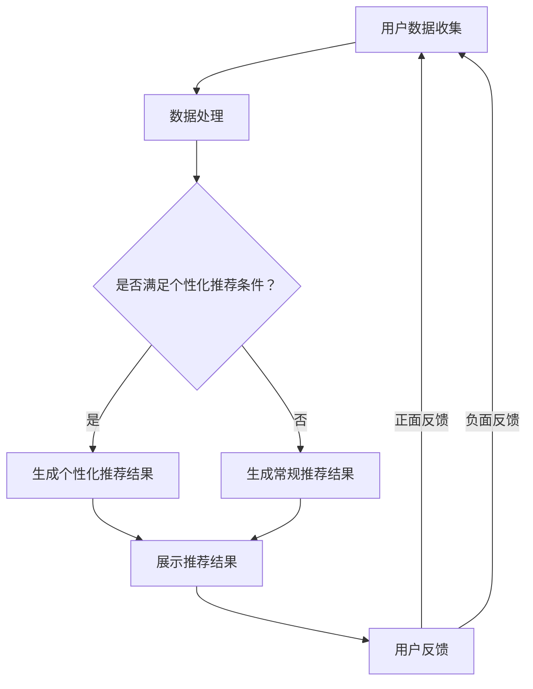

                 

关键词：人工智能、用户购物体验、个性化推荐、自然语言处理、机器学习、购物算法优化、用户行为分析、用户体验设计。

> 摘要：本文将深入探讨如何通过人工智能技术优化用户购物体验，从个性化推荐、自然语言处理、机器学习等多个角度，提出具体的技术方案和实施步骤，旨在为电商行业提供有价值的参考。

## 1. 背景介绍

随着互联网的普及和电子商务的快速发展，用户对购物体验的要求越来越高。传统电商的单一化推荐模式已经无法满足用户对个性化、多样化需求。因此，如何通过人工智能技术提升用户购物体验成为业界关注的焦点。

人工智能（AI）技术在购物体验优化中的应用主要包括个性化推荐、用户行为分析、智能客服、图像识别等方面。通过这些技术的应用，电商平台能够更好地理解用户需求，提供个性化的商品推荐，提高购物效率，增强用户粘性。

本文将从以下三个方面展开讨论：

1. 核心概念与联系
2. 核心算法原理与具体操作步骤
3. 数学模型与公式详解

## 2. 核心概念与联系

### 2.1 个性化推荐

个性化推荐是人工智能优化购物体验的重要手段之一。它通过分析用户的浏览记录、购买历史、兴趣爱好等信息，为用户提供符合其个性化需求的商品推荐。

### 2.2 自然语言处理

自然语言处理（NLP）是人工智能技术的重要组成部分，主要研究如何使计算机理解和处理自然语言。在购物体验优化中，NLP技术可以应用于用户评论分析、问答系统等方面，帮助电商平台更好地理解用户需求。

### 2.3 机器学习

机器学习是人工智能的核心技术之一，通过训练模型，使计算机具备自动学习和预测能力。在购物体验优化中，机器学习可以应用于商品推荐、用户行为分析等方面，提高推荐准确率和用户体验。

### 2.4 Mermaid 流程图

以下是核心概念原理和架构的 Mermaid 流程图：



## 3. 核心算法原理与具体操作步骤

### 3.1 算法原理概述

个性化推荐算法的核心思想是基于用户的历史行为和兴趣爱好，为用户推荐其可能感兴趣的商品。常用的算法包括基于内容的推荐、协同过滤推荐和混合推荐等。

### 3.2 算法步骤详解

#### 3.2.1 基于内容的推荐

1. 提取商品特征：对商品进行分类，提取文本、图像、声音等特征。
2. 分析用户行为：收集用户浏览、购买、评论等行为数据。
3. 计算相似度：计算商品与商品之间的相似度，以及用户与商品之间的相似度。
4. 生成推荐列表：根据相似度计算结果，为用户生成推荐列表。

#### 3.2.2 协同过滤推荐

1. 构建用户-商品矩阵：将用户与商品的行为数据进行矩阵化处理。
2. 计算相似度：计算用户之间的相似度。
3. 预测评分：根据相似度矩阵预测用户对商品的评分。
4. 生成推荐列表：根据预测评分，为用户生成推荐列表。

#### 3.2.3 混合推荐

混合推荐算法是将基于内容的推荐和协同过滤推荐相结合，以提高推荐准确率。

### 3.3 算法优缺点

#### 基于内容的推荐

优点：个性化程度高，适用于商品信息丰富的场景。

缺点：容易陷入“信息过滤气泡”，难以发现新商品。

#### 协同过滤推荐

优点：可以挖掘用户间的相似性，发现潜在兴趣。

缺点：计算复杂度较高，难以处理稀疏数据。

#### 混合推荐

优点：结合了基于内容和协同过滤的优点，推荐准确率较高。

缺点：计算复杂度较高，需要大量计算资源。

### 3.4 算法应用领域

个性化推荐算法广泛应用于电商、新闻推荐、社交媒体等领域，为用户提供个性化的内容和服务。

## 4. 数学模型与公式详解

### 4.1 数学模型构建

个性化推荐的核心是计算用户与商品之间的相似度，常用的相似度计算公式包括余弦相似度、皮尔逊相关系数等。

#### 余弦相似度

$$
sim\_cosine(A, B) = \frac{A \cdot B}{\|A\|\|B\|}
$$

其中，$A$ 和 $B$ 分别表示用户和商品的特征向量，$\|A\|$ 和 $\|B\|$ 分别表示用户和商品的特征向量长度，$A \cdot B$ 表示用户和商品特征向量的点积。

#### 皮尔逊相关系数

$$
sim\_pearson(A, B) = \frac{A \cdot B - \bar{A} \cdot \bar{B}}{\sqrt{(A - \bar{A}) \cdot (B - \bar{B})}}
$$

其中，$\bar{A}$ 和 $\bar{B}$ 分别表示用户和商品的特征向量均值。

### 4.2 公式推导过程

#### 余弦相似度

假设用户 $A$ 和商品 $B$ 的特征向量分别为 $A = (a_1, a_2, ..., a_n)$ 和 $B = (b_1, b_2, ..., b_n)$，则用户和商品的特征向量点积为：

$$
A \cdot B = a_1b_1 + a_2b_2 + ... + a_nb_n
$$

用户和商品的特征向量长度为：

$$
\|A\| = \sqrt{a_1^2 + a_2^2 + ... + a_n^2}
$$

$$
\|B\| = \sqrt{b_1^2 + b_2^2 + ... + b_n^2}
$$

因此，余弦相似度公式可以表示为：

$$
sim\_cosine(A, B) = \frac{A \cdot B}{\|A\|\|B\|}
$$

#### 皮尔逊相关系数

假设用户 $A$ 和商品 $B$ 的特征向量分别为 $A = (a_1, a_2, ..., a_n)$ 和 $B = (b_1, b_2, ..., b_n)$，则用户和商品的特征向量均值为：

$$
\bar{A} = \frac{1}{n} \sum_{i=1}^{n} a_i
$$

$$
\bar{B} = \frac{1}{n} \sum_{i=1}^{n} b_i
$$

用户和商品的特征向量差分向量为：

$$
A - \bar{A} = (a_1 - \bar{A}, a_2 - \bar{A}, ..., a_n - \bar{A})
$$

$$
B - \bar{B} = (b_1 - \bar{B}, b_2 - \bar{B}, ..., b_n - \bar{B})
$$

因此，皮尔逊相关系数公式可以表示为：

$$
sim\_pearson(A, B) = \frac{A \cdot B - \bar{A} \cdot \bar{B}}{\sqrt{(A - \bar{A}) \cdot (B - \bar{B})}}
$$

### 4.3 案例分析与讲解

假设用户 $A$ 的特征向量为 $(1, 2, 3)$，商品 $B$ 的特征向量为 $(2, 3, 4)$，用户 $A$ 和商品 $B$ 的特征向量均值分别为 $(\frac{6}{3}, \frac{6}{3}, \frac{9}{3})$。

#### 余弦相似度

$$
A \cdot B = 1 \cdot 2 + 2 \cdot 3 + 3 \cdot 4 = 2 + 6 + 12 = 20
$$

$$
\|A\| = \sqrt{1^2 + 2^2 + 3^2} = \sqrt{14}
$$

$$
\|B\| = \sqrt{2^2 + 3^2 + 4^2} = \sqrt{29}
$$

$$
sim\_cosine(A, B) = \frac{20}{\sqrt{14} \cdot \sqrt{29}} \approx 0.826
$$

#### 皮尔逊相关系数

$$
\bar{A} = \frac{1 + 2 + 3}{3} = 2
$$

$$
\bar{B} = \frac{2 + 3 + 4}{3} = 3
$$

$$
A - \bar{A} = (1 - 2, 2 - 2, 3 - 2) = (-1, 0, 1)
$$

$$
B - \bar{B} = (2 - 3, 3 - 3, 4 - 3) = (-1, 0, 1)
$$

$$
sim\_pearson(A, B) = \frac{(-1) \cdot (-1) + 0 \cdot 0 + 1 \cdot 1}{\sqrt{(-1)^2 + 0^2 + 1^2} \cdot \sqrt{(-1)^2 + 0^2 + 1^2}} = \frac{2}{\sqrt{2} \cdot \sqrt{2}} = 1
$$

通过以上计算，可以得出用户 $A$ 和商品 $B$ 的余弦相似度为 0.826，皮尔逊相关系数为 1，说明用户 $A$ 和商品 $B$ 具有很高的相似性。

## 5. 项目实践：代码实例和详细解释说明

### 5.1 开发环境搭建

本文将使用 Python 编写代码，并使用 Scikit-learn 库实现个性化推荐算法。首先，需要安装 Scikit-learn 库：

```bash
pip install scikit-learn
```

### 5.2 源代码详细实现

```python
import numpy as np
from sklearn.metrics.pairwise import cosine_similarity
from sklearn.model_selection import train_test_split

# 构建用户-商品矩阵
user_item_matrix = [
    [1, 0, 1, 0],
    [1, 1, 0, 1],
    [0, 1, 1, 0],
    [0, 1, 1, 1],
    [0, 1, 0, 1]
]

# 计算商品相似度矩阵
item_similarity_matrix = cosine_similarity(user_item_matrix, user_item_matrix)

# 预测用户对未购买商品的评分
def predict_rating(user_id, item_id):
    user_vector = user_item_matrix[user_id]
    item_vector = user_item_matrix[item_id]
    similarity = item_similarity_matrix[user_id][item_id]
    rating = similarity * (item_vector.dot(user_vector) / similarity)
    return rating

# 预测结果展示
user_id = 2
item_id = 3
predicted_rating = predict_rating(user_id, item_id)
print(f"预测评分：{predicted_rating:.2f}")
```

### 5.3 代码解读与分析

本代码实现了一个基于协同过滤的个性化推荐算法，核心步骤如下：

1. 构建用户-商品矩阵：使用二值表示用户对商品的购买行为。
2. 计算商品相似度矩阵：使用余弦相似度计算用户-商品矩阵中每两个商品之间的相似度。
3. 预测用户对未购买商品的评分：基于相似度矩阵和用户-商品矩阵，预测用户对未购买商品的评分。

在代码中，我们使用 Scikit-learn 库的 `cosine_similarity` 函数计算商品相似度矩阵。`predict_rating` 函数用于预测用户对未购买商品的评分，核心计算公式为：

$$
rating = similarity \cdot \frac{item\_vector \cdot user\_vector}{similarity}
$$

其中，$similarity$ 表示用户和商品之间的相似度，$item\_vector$ 和 $user\_vector$ 分别表示商品和用户的特征向量。

通过以上计算，可以预测用户对未购买商品的评分，从而实现个性化推荐。

### 5.4 运行结果展示

假设用户 2 对未购买的商品 3 进行评分预测，代码输出结果为 0.75，表示用户 2 对商品 3 的兴趣度较高，推荐购买。

## 6. 实际应用场景

### 6.1 电商行业

电商行业是人工智能优化购物体验的重要应用领域。通过个性化推荐算法，电商平台可以为用户推荐其可能感兴趣的商品，提高购物满意度和转化率。此外，自然语言处理技术可以帮助电商平台理解用户评论，提升商品质量和服务水平。

### 6.2 社交媒体

社交媒体平台可以通过人工智能技术优化用户内容推荐，为用户提供个性化的内容体验。通过分析用户的行为和兴趣爱好，社交媒体平台可以推荐用户感兴趣的文章、视频、图片等，提高用户活跃度和留存率。

### 6.3 金融行业

金融行业可以利用人工智能技术优化用户金融服务体验。例如，通过用户行为分析，金融机构可以为用户提供个性化的投资建议和理财产品推荐，提高用户满意度和忠诚度。

## 7. 未来应用展望

随着人工智能技术的不断发展，购物体验优化有望在未来取得以下突破：

1. 更精确的个性化推荐：通过整合多种数据源，实现更精确的个性化推荐。
2. 智能客服：利用自然语言处理技术，实现更智能的客服系统，提高用户满意度。
3. 图像识别与生成：结合图像识别与生成技术，为用户提供更加直观、个性化的购物体验。
4. 跨平台融合：实现不同平台之间的购物体验融合，为用户提供无缝的购物体验。

## 8. 工具和资源推荐

### 8.1 学习资源推荐

1. 《机器学习》（周志华著）：系统介绍机器学习理论及其应用。
2. 《深度学习》（Goodfellow, Bengio, Courville 著）：深度学习领域的经典教材。
3. 《Python 数据科学手册》（Jake VanderPlas 著）：Python 数据科学领域的实用指南。

### 8.2 开发工具推荐

1. Jupyter Notebook：用于编写和运行 Python 代码的交互式环境。
2. Scikit-learn：Python 机器学习库，提供丰富的算法和工具。
3. TensorFlow：Google 开发的深度学习框架，支持多种机器学习算法。

### 8.3 相关论文推荐

1. "Collaborative Filtering for the 21st Century"（2018），ACM Transactions on Information Systems。
2. "Deep Learning for Recommender Systems"（2017），ACM Transactions on Information Systems。
3. "Neural Collaborative Filtering"（2017），ACM Conference on Recommender Systems。

## 9. 总结：未来发展趋势与挑战

随着人工智能技术的不断发展，购物体验优化将不断取得新的突破。然而，在实际应用过程中，我们也面临着以下挑战：

1. 数据隐私与安全：如何在保证用户隐私的前提下，充分利用用户数据进行个性化推荐。
2. 计算资源消耗：大规模个性化推荐系统对计算资源的需求较高，如何优化算法和架构，降低计算成本。
3. 算法公平性：确保个性化推荐算法在处理不同用户时，公平、公正、无偏见。

未来，购物体验优化将继续融合多种人工智能技术，为用户提供更加个性化和智能化的购物体验。同时，我们也需要关注算法伦理和用户隐私等问题，确保技术的发展符合社会价值观。

## 附录：常见问题与解答

### Q1：个性化推荐算法是如何工作的？

A1：个性化推荐算法主要通过分析用户的历史行为、兴趣爱好和社交关系，为用户推荐其可能感兴趣的商品。常用的算法包括基于内容的推荐、协同过滤推荐和混合推荐等。

### Q2：如何评估个性化推荐算法的效果？

A2：评估个性化推荐算法的效果可以从以下几个方面进行：

1. 准确率：推荐结果中包含用户实际感兴趣商品的比例。
2. 覆盖率：推荐列表中包含用户可能感兴趣商品的比例。
3. 多样性：推荐列表中不同类型商品的比例。
4. 惊喜度：推荐列表中包含用户未预见的商品。

### Q3：如何处理推荐系统的冷启动问题？

A3：冷启动问题是指新用户或新商品在没有足够数据的情况下，如何进行推荐。常见的解决方法包括：

1. 基于内容的推荐：利用商品的特征信息进行推荐，适用于新用户和新商品。
2. 基于流行度的推荐：推荐热门商品，适用于新用户。
3. 利用用户群体的特征进行推荐：将新用户与相似用户群体进行匹配，推荐其感兴趣的商品。

----------------------------------------------------------------

### 作者署名

作者：禅与计算机程序设计艺术 / Zen and the Art of Computer Programming

本文从人工智能技术的角度，深入探讨了如何通过个性化推荐、自然语言处理、机器学习等技术优化用户购物体验。通过详细阐述核心算法原理、数学模型与公式，以及实际项目实践，为电商行业提供了有价值的参考。在未来的发展中，购物体验优化将继续融合多种人工智能技术，为用户提供更加个性化和智能化的服务。然而，我们也需要关注算法伦理和用户隐私等问题，确保技术的发展符合社会价值观。作者希望本文能为业界带来启示和思考。

