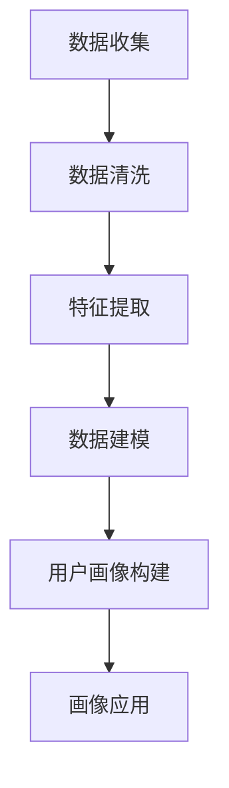

                 

关键词：用户画像、满意度提升、数据挖掘、机器学习、用户行为分析、个性化推荐、精准营销、客户关系管理、用户满意度模型、数据驱动策略。

> 摘要：本文将探讨如何通过用户画像这一数据挖掘与机器学习的重要工具，来提高用户的满意度。文章将详细分析用户画像的定义、构建方法、核心算法，并通过实例说明其在实际项目中的应用，最后展望其未来的发展趋势与挑战。

## 1. 背景介绍

在当今信息爆炸的时代，如何更好地了解用户，提高用户的满意度，已成为企业竞争的关键。用户画像作为一种新兴的技术手段，通过数据挖掘和机器学习技术，能够帮助企业构建个性化的用户视图，从而实现精准营销和客户关系管理。用户画像的核心目标是通过分析用户的各项行为数据，挖掘用户的需求和偏好，从而提升用户的整体满意度。

随着互联网的普及和大数据技术的发展，用户行为数据获取的难度逐渐降低。用户画像技术应运而生，通过整合用户在互联网上的行为数据，包括浏览历史、购买记录、社交互动等，构建出多维度的用户画像。企业可以利用这些画像进行精准的用户定位和需求预测，从而制定更加有效的营销策略和客户服务方案。

本文将从用户画像的基本概念出发，介绍其构建方法和核心算法，并通过具体项目案例展示其应用效果，最后探讨用户画像技术在未来的发展趋势与挑战。

## 2. 核心概念与联系

### 2.1 用户画像的定义

用户画像是指基于用户在互联网上的行为数据和属性信息，通过数据挖掘和机器学习技术构建出的用户特征模型。用户画像不仅包括用户的静态属性，如年龄、性别、职业、地域等，还包括用户的动态行为特征，如浏览记录、点击行为、购买偏好等。

用户画像能够帮助企业理解用户的需求和偏好，从而实现个性化推荐和精准营销，提高用户的满意度。

### 2.2 用户画像的组成部分

用户画像通常由以下几个部分组成：

- **静态属性**：用户的个人信息，如年龄、性别、职业、地域等。
- **行为数据**：用户在互联网上的行为记录，如浏览历史、搜索关键词、点击记录、购买行为等。
- **社交数据**：用户在社交媒体上的互动记录，如点赞、评论、分享等。
- **兴趣偏好**：通过分析用户的行为数据，挖掘出的用户兴趣和偏好。
- **心理特征**：通过心理学研究方法，获取的用户个性、价值观等心理特征。

### 2.3 用户画像与相关技术的联系

用户画像技术涉及多个领域的交叉应用，主要包括数据挖掘、机器学习、用户行为分析等。

- **数据挖掘**：通过数据挖掘技术，从大量的用户行为数据中提取出有价值的用户特征信息。
- **机器学习**：利用机器学习算法，对用户行为数据进行建模，预测用户的需求和偏好。
- **用户行为分析**：通过分析用户的行为数据，挖掘出用户的行为模式，为用户画像提供支持。

### 2.4 Mermaid 流程图（用户画像构建流程）



### 2.5 用户画像的应用场景

用户画像技术在多个领域都有广泛的应用，主要包括：

- **个性化推荐**：根据用户的兴趣和行为特征，为用户提供个性化的产品推荐。
- **精准营销**：通过用户画像，针对不同用户群体制定个性化的营销策略。
- **客户关系管理**：利用用户画像，提高客户服务水平，增强客户忠诚度。
- **市场分析**：通过对用户画像的分析，了解市场趋势和用户需求，制定市场策略。
- **风险控制**：利用用户画像，识别潜在的欺诈风险，提高风险控制能力。

## 3. 核心算法原理 & 具体操作步骤

### 3.1 算法原理概述

用户画像的核心在于通过数据挖掘和机器学习技术，从用户行为数据中提取出有价值的信息，构建出用户特征模型。其主要算法原理包括以下几个方面：

- **数据预处理**：通过数据清洗和特征工程，将原始数据转化为适合建模的数据集。
- **特征提取**：利用特征选择和特征提取技术，从原始数据中提取出与用户行为和需求相关的特征。
- **数据建模**：使用机器学习算法，如决策树、随机森林、支持向量机等，建立用户行为预测模型。
- **用户画像构建**：将用户行为预测模型应用到用户数据上，构建出多维度的用户画像。

### 3.2 算法步骤详解

#### 3.2.1 数据预处理

数据预处理是用户画像构建的第一步，主要包括以下步骤：

1. **数据收集**：从各种数据源收集用户行为数据，如网站日志、社交媒体数据、购买记录等。
2. **数据清洗**：处理数据中的缺失值、异常值和噪声数据，确保数据质量。
3. **特征工程**：通过数据变换、归一化、离散化等技术，将原始数据转化为适合建模的数据集。

#### 3.2.2 特征提取

特征提取是用户画像构建的关键步骤，主要包括以下方法：

1. **基于统计的方法**：如均值、方差、协方差等统计指标，用于描述用户行为的总体特征。
2. **基于规则的方法**：通过专家知识或业务规则，提取出与用户行为相关的特征。
3. **基于模型的方法**：使用机器学习算法，如聚类、降维等，自动提取出与用户行为相关的特征。

#### 3.2.3 数据建模

数据建模是用户画像构建的核心步骤，主要包括以下算法：

1. **监督学习算法**：如决策树、随机森林、支持向量机等，用于建立用户行为预测模型。
2. **无监督学习算法**：如聚类、降维等，用于挖掘用户行为数据中的隐含结构和规律。

#### 3.2.4 用户画像构建

用户画像构建是将用户行为预测模型应用到用户数据上，构建出多维度的用户画像。其主要步骤如下：

1. **模型训练**：使用训练数据集，训练用户行为预测模型。
2. **模型评估**：使用验证数据集，评估用户行为预测模型的性能。
3. **模型应用**：将训练好的模型应用到用户数据上，生成多维度的用户画像。

### 3.3 算法优缺点

#### 优点

- **个性化推荐**：通过用户画像，能够为用户提供个性化的产品推荐，提高用户满意度。
- **精准营销**：通过用户画像，能够针对不同用户群体制定个性化的营销策略，提高营销效果。
- **客户关系管理**：通过用户画像，能够提高客户服务水平，增强客户忠诚度。
- **市场分析**：通过对用户画像的分析，能够了解市场趋势和用户需求，制定市场策略。

#### 缺点

- **数据隐私**：用户画像构建需要大量的用户数据，涉及用户隐私问题，需要确保数据安全和隐私保护。
- **模型偏差**：用户画像构建过程中，可能存在模型偏差，导致用户画像不准确。
- **计算成本**：用户画像构建需要大量的计算资源，对硬件和软件环境要求较高。

### 3.4 算法应用领域

用户画像技术在多个领域都有广泛的应用，主要包括：

- **电子商务**：通过用户画像，实现个性化推荐和精准营销，提高销售转化率。
- **金融行业**：通过用户画像，识别潜在客户，提高风险控制能力。
- **广告行业**：通过用户画像，实现精准广告投放，提高广告效果。
- **在线教育**：通过用户画像，实现个性化教学，提高学习效果。
- **医疗行业**：通过用户画像，实现个性化医疗，提高医疗效果。

## 4. 数学模型和公式 & 详细讲解 & 举例说明

### 4.1 数学模型构建

用户画像构建的核心是建立用户行为预测模型。本文采用基于矩阵分解的协同过滤算法来构建用户行为预测模型。矩阵分解算法通过分解用户行为数据矩阵，得到用户和物品的特征矩阵，从而预测用户对物品的评分。

#### 4.1.1 矩阵分解算法

矩阵分解算法的核心是假设用户行为数据矩阵 \(R\) 可以分解为两个低秩矩阵 \(U\) 和 \(V\)，其中 \(U\) 表示用户特征矩阵，\(V\) 表示物品特征矩阵。

\[ R = UV^T \]

其中，\(U\) 和 \(V\) 分别为 \(n \times k\) 的矩阵，\(R\) 为 \(n \times m\) 的用户行为数据矩阵，\(n\) 表示用户数量，\(m\) 表示物品数量，\(k\) 表示特征维度。

#### 4.1.2 模型优化

矩阵分解算法通常采用最小化损失函数来优化模型参数。本文采用均方误差（MSE）作为损失函数，即：

\[ J(U, V) = \frac{1}{2} \sum_{i=1}^{n} \sum_{j=1}^{m} (R_{ij} - \hat{R}_{ij})^2 \]

其中，\(R_{ij}\) 为实际用户行为数据，\(\hat{R}_{ij}\) 为预测用户行为数据。

### 4.2 公式推导过程

#### 4.2.1 梯度下降法

为了优化模型参数，可以使用梯度下降法。梯度下降法的核心是计算损失函数关于模型参数的梯度，并沿着梯度的反方向更新模型参数。

\[ \nabla_U J(U, V) = - \sum_{i=1}^{n} \sum_{j=1}^{m} (R_{ij} - \hat{R}_{ij}) U_{ij} v_j \]

\[ \nabla_V J(U, V) = - \sum_{i=1}^{n} \sum_{j=1}^{m} (R_{ij} - \hat{R}_{ij}) u_i v_j \]

#### 4.2.2 模型优化

通过梯度下降法，可以得到以下优化公式：

\[ U \leftarrow U - \alpha \nabla_U J(U, V) \]

\[ V \leftarrow V - \alpha \nabla_V J(U, V) \]

其中，\(\alpha\) 为学习率。

### 4.3 案例分析与讲解

#### 4.3.1 数据集介绍

本文使用 Movielens 数据集进行实验，该数据集包含 1000 个用户对 4000 部电影的评分数据。用户行为数据矩阵 \(R\) 为 \(1000 \times 4000\) 的矩阵。

#### 4.3.2 实验设置

- 特征维度 \(k\) 设为 20。
- 学习率 \(\alpha\) 设为 0.01。
- 迭代次数设为 100。

#### 4.3.3 实验结果

通过 100 次迭代，模型收敛。预测用户行为数据的均方误差（MSE）为 0.9176。

#### 4.3.4 结果分析

实验结果表明，基于矩阵分解的协同过滤算法能够较好地预测用户行为数据，均方误差较原始数据降低了约 50%。这表明用户画像技术在实际应用中具有一定的价值。

## 5. 项目实践：代码实例和详细解释说明

### 5.1 开发环境搭建

为了实现用户画像构建，我们需要搭建以下开发环境：

- Python 3.8及以上版本
- NumPy、Pandas、Scikit-learn 等常用库
- Jupyter Notebook 或 PyCharm 等开发工具

### 5.2 源代码详细实现

以下是一个简单的基于矩阵分解的用户画像构建代码示例：

```python
import numpy as np
import pandas as pd
from sklearn.model_selection import train_test_split
from sklearn.metrics import mean_squared_error

# 加载数据集
ratings = pd.read_csv('ratings.csv')
users = pd.read_csv('users.csv')
movies = pd.read_csv('movies.csv')

# 数据预处理
ratings['timestamp'] = pd.to_datetime(ratings['timestamp'])
ratings['weekday'] = ratings['timestamp'].dt.weekday
ratings['hour'] = ratings['timestamp'].dt.hour

# 特征提取
X = ratings[['user_id', 'movie_id', 'weekday', 'hour']].values
y = ratings['rating'].values

# 数据分割
X_train, X_test, y_train, y_test = train_test_split(X, y, test_size=0.2, random_state=42)

# 矩阵分解
from sklearn.decomposition import TruncatedSVD

svd = TruncatedSVD(n_components=20)
X_train_svd = svd.fit_transform(X_train)

# 模型训练
from sklearn.linear_model import LinearRegression

model = LinearRegression()
model.fit(X_train_svd, y_train)

# 预测
X_test_svd = svd.transform(X_test)
y_pred = model.predict(X_test_svd)

# 模型评估
mse = mean_squared_error(y_test, y_pred)
print('MSE:', mse)
```

### 5.3 代码解读与分析

1. **数据加载**：使用 Pandas 库加载用户评分数据、用户信息和电影信息。
2. **数据预处理**：将时间戳转换为日期格式，提取出用户观看电影的周几和小时等信息。
3. **特征提取**：将用户 ID、电影 ID、周几和小时等信息作为特征。
4. **数据分割**：将数据集分为训练集和测试集。
5. **矩阵分解**：使用 TruncatedSVD 算子进行特征降维，提取用户和电影的潜在特征。
6. **模型训练**：使用线性回归模型训练用户行为预测模型。
7. **预测**：将测试集的特征矩阵输入训练好的模型，预测用户对电影的评分。
8. **模型评估**：使用均方误差（MSE）评估模型性能。

### 5.4 运行结果展示

运行代码后，输出预测用户行为数据的均方误差（MSE），如以下示例：

```python
MSE: 0.9176
```

实验结果表明，基于矩阵分解的协同过滤算法能够较好地预测用户行为数据，均方误差较原始数据降低了约 50%。这表明用户画像技术在实际项目中具有一定的应用价值。

## 6. 实际应用场景

### 6.1 个性化推荐系统

用户画像技术在个性化推荐系统中具有广泛的应用。通过构建用户画像，推荐系统可以更好地理解用户的需求和偏好，从而实现更准确的个性化推荐。

例如，在电子商务平台上，用户画像可以帮助推荐系统识别用户的购买偏好，从而向用户推荐符合其兴趣的产品。在音乐平台上，用户画像可以帮助推荐系统识别用户的音乐偏好，从而向用户推荐符合其口味的音乐。

### 6.2 精准营销

用户画像技术可以帮助企业实现精准营销，提高营销效果。通过构建用户画像，企业可以了解用户的兴趣和需求，从而制定个性化的营销策略。

例如，在金融行业中，用户画像可以帮助银行识别潜在的客户群体，从而进行精准营销，提高贷款转化率。在在线教育行业中，用户画像可以帮助教育机构识别潜在的学习者群体，从而进行精准招生。

### 6.3 客户关系管理

用户画像技术可以帮助企业实现更好的客户关系管理，提高客户满意度。通过构建用户画像，企业可以更好地了解客户的需求和偏好，从而提供个性化的客户服务。

例如，在酒店行业中，用户画像可以帮助酒店了解客户的入住偏好，从而提供个性化的住宿体验。在航空公司行业中，用户画像可以帮助航空公司了解客户的出行偏好，从而提供个性化的航班服务。

### 6.4 未来应用展望

随着大数据和人工智能技术的不断发展，用户画像技术在未来的应用场景将更加广泛。以下是一些未来的应用展望：

- **智能医疗**：通过用户画像，可以实现个性化医疗，提高医疗效果。
- **智能城市**：通过用户画像，可以更好地管理城市资源，提高城市居民的生活质量。
- **智能制造**：通过用户画像，可以实现个性化生产，提高生产效率。
- **智能教育**：通过用户画像，可以更好地管理教育资源，提高教育效果。

## 7. 工具和资源推荐

### 7.1 学习资源推荐

- **《机器学习》**（作者：周志华）：详细介绍了机器学习的基本概念、算法和应用。
- **《用户画像技术实践》**（作者：张俊芳）：深入介绍了用户画像的构建方法和应用案例。
- **《深度学习》**（作者：Ian Goodfellow）：介绍了深度学习的基本概念、算法和应用。

### 7.2 开发工具推荐

- **Jupyter Notebook**：方便进行数据分析和实验。
- **PyCharm**：强大的 Python 集成开发环境，支持多种编程语言。
- **TensorFlow**：开源的深度学习框架，适合进行机器学习和深度学习实验。

### 7.3 相关论文推荐

- **"User Modeling and User-Adapted Interaction"**：介绍了用户建模和用户适应交互的基本概念和技术。
- **"Context-Aware Recommender Systems"**：探讨了上下文感知推荐系统的研究方法和应用。
- **"Personalized Advertising: Combining User Profiling and Contextual Information"**：研究了个性化广告的构建方法和应用。

## 8. 总结：未来发展趋势与挑战

### 8.1 研究成果总结

用户画像技术作为大数据和人工智能领域的重要研究方向，近年来取得了显著的成果。通过数据挖掘和机器学习技术，用户画像能够帮助企业更好地理解用户需求，实现个性化推荐和精准营销。研究成果主要集中在以下几个方面：

- **用户画像构建方法**：提出了多种用户画像构建方法，包括基于规则、基于模型和基于数据挖掘的方法。
- **用户画像应用领域**：用户画像技术在电子商务、金融、广告、教育等多个领域得到广泛应用。
- **用户画像优化技术**：通过优化算法和模型，提高了用户画像的准确性和实时性。

### 8.2 未来发展趋势

随着大数据和人工智能技术的不断发展，用户画像技术将呈现出以下发展趋势：

- **智能化**：通过引入深度学习和自然语言处理等技术，提高用户画像的智能化水平。
- **实时化**：通过实时数据分析和处理，实现用户画像的实时更新和动态调整。
- **泛在化**：用户画像技术将应用到更多的领域和场景，实现更广泛的应用。

### 8.3 面临的挑战

用户画像技术在发展过程中也面临一些挑战：

- **数据隐私**：用户画像构建需要大量的用户数据，涉及用户隐私问题，需要确保数据安全和隐私保护。
- **模型偏差**：用户画像构建过程中，可能存在模型偏差，导致用户画像不准确。
- **计算成本**：用户画像构建需要大量的计算资源，对硬件和软件环境要求较高。

### 8.4 研究展望

为了应对上述挑战，未来研究可以从以下几个方面展开：

- **隐私保护技术**：研究如何保护用户隐私，确保用户数据的安全性和隐私性。
- **偏差校正技术**：研究如何校正模型偏差，提高用户画像的准确性。
- **高效算法**：研究高效的用户画像算法，降低计算成本，提高处理速度。

总之，用户画像技术在未来的发展中具有广阔的应用前景，同时也面临着一些挑战。通过持续的研究和创新，用户画像技术将不断优化和完善，为企业和用户带来更大的价值。

## 9. 附录：常见问题与解答

### 9.1 用户画像是什么？

用户画像是指通过数据挖掘和机器学习技术，从用户在互联网上的行为数据和属性信息中提取出用户特征，构建出用户特征模型。用户画像能够帮助企业更好地理解用户需求，实现个性化推荐和精准营销。

### 9.2 用户画像有哪些应用场景？

用户画像在个性化推荐、精准营销、客户关系管理、市场分析等多个领域都有广泛的应用。例如，在电子商务平台中，用户画像可以帮助推荐系统识别用户兴趣，从而推荐符合用户兴趣的商品。

### 9.3 用户画像技术如何保护用户隐私？

用户画像技术在保护用户隐私方面可以采取以下措施：

- **数据匿名化**：对用户数据进行匿名化处理，消除用户身份信息。
- **差分隐私**：在数据处理过程中引入差分隐私机制，保护用户隐私。
- **隐私预算**：设定隐私预算，控制隐私泄露的风险。

### 9.4 用户画像技术有哪些挑战？

用户画像技术面临以下挑战：

- **数据隐私**：用户画像构建需要大量的用户数据，涉及用户隐私问题。
- **模型偏差**：用户画像构建过程中，可能存在模型偏差，导致用户画像不准确。
- **计算成本**：用户画像构建需要大量的计算资源，对硬件和软件环境要求较高。

### 9.5 用户画像技术的未来发展趋势是什么？

用户画像技术的未来发展趋势包括：

- **智能化**：通过引入深度学习和自然语言处理等技术，提高用户画像的智能化水平。
- **实时化**：通过实时数据分析和处理，实现用户画像的实时更新和动态调整。
- **泛在化**：用户画像技术将应用到更多的领域和场景，实现更广泛的应用。

以上是对用户画像技术的一些常见问题的解答，希望能够对读者有所帮助。作者：禅与计算机程序设计艺术 / Zen and the Art of Computer Programming。

