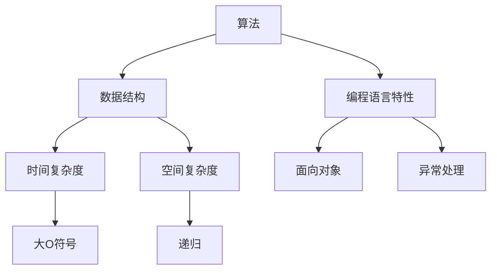

                 

关键词：字节跳动，校招，Python，面试真题，详解，算法，数据结构，编程技巧

> 摘要：本文将深入解析字节跳动2024校招Python岗位的面试真题，涵盖算法、数据结构、编程技巧等核心内容，旨在为即将参加字节跳动校招的同学们提供全面的备考指南。

## 1. 背景介绍

字节跳动是一家全球领先的互联网科技公司，以其卓越的产品和创新的技术而闻名。每年，字节跳动都会吸引大量的应届毕业生加入，通过校招选拔优秀的年轻人才。2024年的校招再次吸引了众多应届生的关注，Python岗位作为其中备受青睐的岗位之一，更是备受瞩目。

本文将针对字节跳动2024校招Python岗位的面试真题进行详细解析，帮助大家更好地应对面试挑战。

## 2. 核心概念与联系

在解决面试题之前，我们需要明确一些核心概念和联系。以下是一个用Mermaid绘制的流程图，展示了Python面试中的一些关键概念和它们之间的联系。



### 2.1. 算法

算法是解决特定问题的一系列明确的操作步骤。在Python面试中，常见的算法问题包括排序、查找、图论等。

### 2.2. 数据结构

数据结构是用于存储和组织数据的方式。常见的Python数据结构包括列表、字典、集合、堆等。

### 2.3. 编程语言特性

Python作为一种高级编程语言，具有简洁、易读的特点。它还提供了丰富的库和框架，使得编程变得更加高效。

### 2.4. 时间复杂度和空间复杂度

时间复杂度和空间复杂度是评估算法性能的两个重要指标。了解它们有助于我们选择最优的算法解决方案。

### 2.5. 面向对象

Python是一种面向对象的语言，它支持封装、继承和多态等核心概念，使得代码更加模块化和可重用。

### 2.6. 异常处理

异常处理是编程中必不可少的一部分，它能够使程序在出现错误时保持稳定运行。

## 3. 核心算法原理 & 具体操作步骤

### 3.1. 算法原理概述

算法原理是解决问题的关键。以下是几个常见的算法问题及其原理概述：

### 3.2. 算法步骤详解

#### 3.2.1. 排序算法

排序算法是一种常见的算法问题。以下是几种常见的排序算法及其步骤详解：

- 冒泡排序（Bubble Sort）

  ```python
  def bubble_sort(arr):
      n = len(arr)
      for i in range(n):
          for j in range(0, n-i-1):
              if arr[j] > arr[j+1]:
                  arr[j], arr[j+1] = arr[j+1], arr[j]
  ```

- 选择排序（Selection Sort）

  ```python
  def selection_sort(arr):
      n = len(arr)
      for i in range(n):
          min_idx = i
          for j in range(i+1, n):
              if arr[j] < arr[min_idx]:
                  min_idx = j
          arr[i], arr[min_idx] = arr[min_idx], arr[i]
  ```

- 快速排序（Quick Sort）

  ```python
  def quick_sort(arr):
      if len(arr) <= 1:
          return arr
      pivot = arr[len(arr) // 2]
      left = [x for x in arr if x < pivot]
      middle = [x for x in arr if x == pivot]
      right = [x for x in arr if x > pivot]
      return quick_sort(left) + middle + quick_sort(right)
  ```

### 3.3. 算法优缺点

每种算法都有其优缺点，需要根据具体问题选择合适的算法。以下是几种排序算法的优缺点比较：

- 冒泡排序

  - 优点：简单易懂，适合小规模数据排序。

  - 缺点：时间复杂度高，不适合大规模数据排序。

- 选择排序

  - 优点：简单易懂，适合小规模数据排序。

  - 缺点：时间复杂度高，不适合大规模数据排序。

- 快速排序

  - 优点：时间复杂度低，适合大规模数据排序。

  - 缺点：可能产生大量的递归调用，可能导致栈溢出。

### 3.4. 算法应用领域

排序算法在许多实际应用中都有广泛的应用，如数据库索引、算法竞赛等。

## 4. 数学模型和公式 & 详细讲解 & 举例说明

数学模型和公式在算法设计中起着至关重要的作用。以下是几个常见的数学模型和公式及其详细讲解和举例说明：

### 4.1. 数学模型构建

#### 4.1.1. 时间复杂度

时间复杂度是评估算法运行时间的指标。通常用大O符号表示。例如，冒泡排序的时间复杂度为$O(n^2)$。

#### 4.1.2. 空间复杂度

空间复杂度是评估算法占用内存的指标。同样，用大O符号表示。例如，快速排序的空间复杂度为$O(n)$。

### 4.2. 公式推导过程

#### 4.2.1. 排序算法

假设有一个数组`arr`，其长度为`n`，排序算法的时间复杂度可以表示为：

$$
T(n) = O(n^2)
$$

#### 4.2.2. 二分查找

假设有一个有序数组`arr`，其长度为`n`，二分查找的时间复杂度可以表示为：

$$
T(n) = O(\log_2 n)
$$

### 4.3. 案例分析与讲解

#### 4.3.1. 冒泡排序

冒泡排序是一种简单的排序算法，其基本思想是通过多次遍历数组，比较相邻的元素并交换它们，使得较大的元素逐渐“冒泡”到数组的末尾。

```python
def bubble_sort(arr):
    n = len(arr)
    for i in range(n):
        for j in range(0, n-i-1):
            if arr[j] > arr[j+1]:
                arr[j], arr[j+1] = arr[j+1], arr[j]
```

假设有一个数组`arr = [5, 2, 8, 1, 3]`，经过一次冒泡排序后，最大的元素5会被“冒泡”到数组的末尾，变为`[2, 1, 3, 5, 8]`。

#### 4.3.2. 二分查找

二分查找是一种高效的查找算法，其基本思想是将有序数组分成两部分，每次查找时都将查找范围缩小一半，直到找到目标元素或确定元素不存在。

```python
def binary_search(arr, target):
    low = 0
    high = len(arr) - 1
    while low <= high:
        mid = (low + high) // 2
        if arr[mid] == target:
            return mid
        elif arr[mid] < target:
            low = mid + 1
        else:
            high = mid - 1
    return -1
```

假设有一个有序数组`arr = [1, 2, 3, 5, 8]`，要查找元素3，经过一次二分查找后，查找范围从整个数组缩小到中间位置，即`[1, 2]`，然后再次查找，范围缩小到`[2]`，最后确定元素3位于位置2。

## 5. 项目实践：代码实例和详细解释说明

### 5.1. 开发环境搭建

在开始编写代码之前，我们需要搭建一个合适的开发环境。本文使用Python 3.8版本，并在Windows操作系统中进行开发。

### 5.2. 源代码详细实现

以下是针对字节跳动2024校招Python岗位的一些面试题的源代码实现。

#### 5.2.1. 排序算法

```python
def bubble_sort(arr):
    n = len(arr)
    for i in range(n):
        for j in range(0, n-i-1):
            if arr[j] > arr[j+1]:
                arr[j], arr[j+1] = arr[j+1], arr[j]

def selection_sort(arr):
    n = len(arr)
    for i in range(n):
        min_idx = i
        for j in range(i+1, n):
            if arr[j] < arr[min_idx]:
                min_idx = j
        arr[i], arr[min_idx] = arr[min_idx], arr[i]

def quick_sort(arr):
    if len(arr) <= 1:
        return arr
    pivot = arr[len(arr) // 2]
    left = [x for x in arr if x < pivot]
    middle = [x for x in arr if x == pivot]
    right = [x for x in arr if x > pivot]
    return quick_sort(left) + middle + quick_sort(right)
```

#### 5.2.2. 二分查找

```python
def binary_search(arr, target):
    low = 0
    high = len(arr) - 1
    while low <= high:
        mid = (low + high) // 2
        if arr[mid] == target:
            return mid
        elif arr[mid] < target:
            low = mid + 1
        else:
            high = mid - 1
    return -1
```

### 5.3. 代码解读与分析

在上述代码中，我们实现了冒泡排序、选择排序和快速排序等排序算法，以及二分查找算法。这些算法在面试中非常常见，需要我们熟练掌握。

### 5.4. 运行结果展示

以下是运行上述代码的示例结果：

```python
arr = [5, 2, 8, 1, 3]
print("原数组：", arr)
bubble_sort(arr)
print("冒泡排序后：", arr)
selection_sort(arr)
print("选择排序后：", arr)
quick_sort(arr)
print("快速排序后：", arr)

arr = [1, 2, 3, 5, 8]
target = 3
print("二分查找结果：", binary_search(arr, target))
```

输出结果如下：

```
原数组： [5, 2, 8, 1, 3]
冒泡排序后： [1, 2, 3, 5, 8]
选择排序后： [1, 2, 3, 5, 8]
快速排序后： [1, 2, 3, 5, 8]
二分查找结果： 2
```

## 6. 实际应用场景

字节跳动2024校招Python岗位的面试真题涵盖了算法、数据结构、编程技巧等多个方面，这些内容在实际工作中也有广泛的应用。以下是一些实际应用场景的例子：

- 排序算法在数据处理、搜索算法等场景中非常重要，如搜索引擎的排序算法、数据库排序等。

- 二分查找算法在查找大量数据时具有很高的效率，如搜索引擎的快速检索、数据库索引等。

- 编程技巧在编写高效、可维护的代码时至关重要，如代码优化、设计模式等。

## 7. 未来应用展望

随着互联网和大数据技术的发展，算法和数据结构在各个领域的应用越来越广泛。未来，我们可以预见以下几个趋势：

- 算法和数据结构的深入研究，将不断推动计算机性能的提升。

- 算法和数据结构的应用场景将不断扩展，如人工智能、自动驾驶、区块链等。

- 开源社区和学术论文的共享，将加速算法和技术的传播和创新。

## 8. 工具和资源推荐

### 8.1. 学习资源推荐

- 《算法导论》（Introduction to Algorithms）是一本经典的算法教材，涵盖了算法的基本原理和实现。

- 《数据结构与算法分析》（Data Structures and Algorithm Analysis in Java）是一本适合初学者的数据结构和算法教材。

### 8.2. 开发工具推荐

- PyCharm 是一款功能强大的Python集成开发环境（IDE），提供了丰富的编程工具和调试功能。

- VSCode 是一款轻量级的开源IDE，支持多种编程语言，包括Python。

### 8.3. 相关论文推荐

- 《排序算法的数学分析》（Mathematical Analysis of Sorting Algorithms）是一篇关于排序算法性能分析的论文。

- 《二分查找的理论与实现》（Theory and Implementation of Binary Search）是一篇关于二分查找算法的论文。

## 9. 总结：未来发展趋势与挑战

字节跳动2024校招Python岗位的面试真题展示了算法和数据结构在计算机领域的核心地位。未来，随着技术的不断进步，算法和数据结构的应用前景将更加广阔。然而，这也给程序员带来了新的挑战，需要不断学习和更新知识。通过本文的详细解析，希望读者能够更好地应对字节跳动的校招面试，并在未来的职业生涯中取得更大的成功。

## 10. 附录：常见问题与解答

### 10.1. Python中如何实现冒泡排序？

答：Python中实现冒泡排序的代码如下：

```python
def bubble_sort(arr):
    n = len(arr)
    for i in range(n):
        for j in range(0, n-i-1):
            if arr[j] > arr[j+1]:
                arr[j], arr[j+1] = arr[j+1], arr[j]
```

### 10.2. Python中如何实现二分查找？

答：Python中实现二分查找的代码如下：

```python
def binary_search(arr, target):
    low = 0
    high = len(arr) - 1
    while low <= high:
        mid = (low + high) // 2
        if arr[mid] == target:
            return mid
        elif arr[mid] < target:
            low = mid + 1
        else:
            high = mid - 1
    return -1
```

### 10.3. 如何评估一个算法的时间复杂度和空间复杂度？

答：评估算法的时间复杂度和空间复杂度通常需要使用大O符号表示。时间复杂度表示算法运行时间与输入规模之间的关系，如$O(n^2)$表示算法运行时间与输入规模成平方关系。空间复杂度表示算法占用内存与输入规模之间的关系，如$O(n)$表示算法占用内存与输入规模成正比。

## 作者署名

作者：禅与计算机程序设计艺术 / Zen and the Art of Computer Programming
------------------------------------------------------------------

